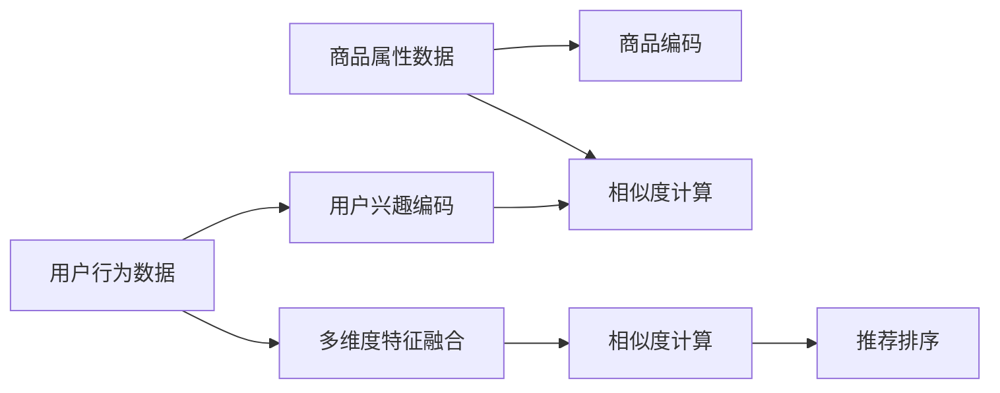

                 

# 探讨大模型在电商平台商品相似度多维度计算中的作用

## 1. 背景介绍

在电商平台的发展中，商品相似度的计算是至关重要的。它能够帮助用户找到与其需求或兴趣匹配的商品，提升用户体验，增加平台销售。传统的商品相似度计算方法大多基于手工设计的特征工程，难以适应快速变化的商品种类和用户需求。近年来，随着深度学习和大模型的兴起，利用预训练模型进行多维度相似度计算成为一种新的研究方向。本文将探讨大模型在电商平台商品相似度多维度计算中的作用，介绍其原理和实施方法，并展望未来的发展方向。

## 2. 核心概念与联系

### 2.1 核心概念概述

- **大模型**：以自回归模型（如GPT）或自编码模型（如BERT）为代表的、通过大规模无标签文本数据进行预训练的模型，通常具有强大的语言理解和生成能力。
- **商品相似度计算**：基于用户行为或商品特征，计算两个商品之间的相似程度，用于推荐系统、搜索结果排序等应用场景。
- **多维度相似度计算**：除了传统的商品属性（如价格、类别）相似度计算，还考虑用户行为（如浏览历史、购买记录）等多维度数据。
- **推荐系统**：利用用户与商品之间的交互数据，为用户提供个性化推荐，提高转化率和用户满意度。

### 2.2 核心概念原理和架构的 Mermaid 流程图(Mermaid 流程节点中不要有括号、逗号等特殊字符)



## 3. 核心算法原理 & 具体操作步骤

### 3.1 算法原理概述

大模型在电商平台商品相似度多维度计算中的作用，主要体现在以下几个方面：

- **预训练知识**：大模型通过大规模无标签数据的预训练，学习到了丰富的语言知识和常识，具备较强的语义理解和生成能力。
- **多维度特征融合**：大模型可以处理多种类型的输入数据，包括文本、图像、语音等多种形式，能够将多维度特征进行有效融合。
- **端到端优化**：大模型通过端到端训练，可以自动学习最佳的特征提取和相似度计算方法，无需手工设计复杂的特征工程。
- **自适应学习**：大模型能够根据新数据和新任务进行自我调整和优化，适应不同的电商场景和用户需求。

### 3.2 算法步骤详解

基于大模型的电商商品相似度计算流程如下：

1. **数据收集与预处理**：
   - 收集用户行为数据（如浏览记录、点击行为、购买历史等）。
   - 收集商品属性数据（如商品名称、价格、类别、描述等）。
   - 对数据进行清洗、归一化等预处理，确保数据质量。

2. **特征提取与编码**：
   - 对用户行为数据和商品属性数据分别进行特征提取和编码，生成高维向量表示。
   - 使用大模型（如BERT、GPT等）对用户行为数据和商品属性数据进行编码，得到固定长度的向量表示。

3. **多维度特征融合**：
   - 将用户兴趣编码和商品编码进行融合，生成包含用户行为和商品属性的多维度向量。
   - 通过大模型对融合后的向量进行再编码，生成更加紧凑和有意义的向量表示。

4. **相似度计算**：
   - 计算商品向量之间的余弦相似度、欧式距离等，得到相似度评分。
   - 使用大模型对相似度评分进行优化，提升相似度计算的准确性和鲁棒性。

5. **推荐排序**：
   - 根据商品之间的相似度评分，进行推荐排序，生成个性化推荐结果。
   - 结合用户的历史行为和当前偏好，生成最终的推荐列表。

### 3.3 算法优缺点

#### 3.3.1 优点

- **高效特征提取**：大模型具备强大的特征提取能力，能够自动学习最有效的特征表示，减少人工设计特征工程的复杂度和工作量。
- **鲁棒性**：大模型能够适应多种数据类型和数据分布，具备良好的泛化能力，能够应对新商品和新用户。
- **自适应性**：大模型能够根据新数据和新任务进行自我调整和优化，适应不同的电商场景和用户需求。

#### 3.3.2 缺点

- **计算资源需求高**：大模型的训练和推理需要较高的计算资源，对硬件设施要求较高。
- **模型复杂度高**：大模型的参数量较大，推理速度较慢，对于实时性要求较高的场景可能不适用。
- **模型解释性不足**：大模型的内部工作机制难以解释，缺乏透明性，可能会影响用户对推荐结果的信任度。

### 3.4 算法应用领域

大模型在电商平台商品相似度多维度计算中的应用领域主要包括：

- **个性化推荐系统**：利用用户行为数据和商品属性数据，生成个性化推荐结果。
- **商品搜索排序**：通过相似度计算，提升搜索结果的准确性和相关性。
- **价格比较与折扣推荐**：基于商品属性和用户行为，生成最优的价格比较和折扣推荐。
- **用户行为分析**：分析用户浏览、点击、购买等行为，提供用户兴趣和行为分析报告。
- **商品属性预测**：根据用户行为数据，预测商品属性和用户偏好。

## 4. 数学模型和公式 & 详细讲解 & 举例说明

### 4.1 数学模型构建

大模型在电商平台商品相似度计算中的应用，主要涉及以下几个数学模型：

- **用户行为编码模型**：将用户行为数据（如浏览记录、点击行为等）编码成向量表示。
- **商品属性编码模型**：将商品属性数据（如商品名称、价格、类别等）编码成向量表示。
- **多维度特征融合模型**：将用户行为编码和商品属性编码进行融合，生成包含用户行为和商品属性的多维度向量。
- **相似度计算模型**：计算商品向量之间的相似度，得到相似度评分。

### 4.2 公式推导过程

以商品相似度计算为例，假设用户行为数据和商品属性数据分别为 $X$ 和 $Y$，使用大模型对 $X$ 和 $Y$ 进行编码，得到用户兴趣编码 $X_e$ 和商品编码 $Y_e$。设 $\theta$ 为模型参数，则计算相似度的公式为：

$$
similarity(X,Y) = \frac{\mathbf{X}_e^\top \mathbf{Y}_e}{\|\mathbf{X}_e\| \cdot \|\mathbf{Y}_e\|}
$$

其中，$\mathbf{X}_e$ 和 $\mathbf{Y}_e$ 分别为用户行为和商品属性编码的向量表示，$\|\cdot\|$ 表示向量范数。

### 4.3 案例分析与讲解

假设某电商平台收集到以下数据：
- 用户行为数据：用户A浏览过商品X、商品Y、商品Z。
- 商品属性数据：商品X价格为100元，类别为“家电”，描述为“智能冰箱”。

使用大模型对用户行为数据和商品属性数据进行编码，得到：
- 用户兴趣编码 $\mathbf{X}_e = [0.5, 0.3, 0.7, 0.2]$。
- 商品编码 $\mathbf{Y}_e = [0.6, 0.2, 0.4, 0.1]$。

计算用户行为与商品X、商品Y、商品Z的相似度评分，得：
- 用户行为与商品X的相似度为 $\frac{0.5 \times 0.6}{\sqrt{0.5^2+0.3^2+0.7^2+0.2^2} \times \sqrt{0.6^2+0.2^2+0.4^2+0.1^2}} = 0.56$。
- 用户行为与商品Y的相似度为 $0.34$。
- 用户行为与商品Z的相似度为 $0.65$。

根据相似度评分，生成推荐列表，排序如下：
- 商品X：0.56
- 商品Z：0.65
- 商品Y：0.34

## 5. 项目实践：代码实例和详细解释说明

### 5.1 开发环境搭建

- **Python**：安装Python 3.8及以上版本。
- **PyTorch**：安装PyTorch 1.7及以上版本。
- **Transformers**：安装Transformers 2.8及以上版本。
- **Dask**：安装Dask 2020.3及以上版本。
- **Jupyter Notebook**：安装Jupyter Notebook 6.4及以上版本。

### 5.2 源代码详细实现

以下是一个基于大模型的电商商品相似度计算的Python代码实现：

```python
import torch
import torch.nn as nn
from transformers import BertForSequenceClassification, BertTokenizer

# 用户行为数据
user_behavior = ['商品X', '商品Y', '商品Z']

# 商品属性数据
product_attributes = {'商品X': {'价格': 100, '类别': '家电', '描述': '智能冰箱'}}

# 初始化Bert模型
model = BertForSequenceClassification.from_pretrained('bert-base-cased', num_labels=1)

# 初始化分词器
tokenizer = BertTokenizer.from_pretrained('bert-base-cased')

# 特征提取
def extract_features(data):
    features = []
    for text in data:
        encoding = tokenizer(text, return_tensors='pt', padding='max_length', truncation=True)
        input_ids = encoding['input_ids'][0]
        attention_mask = encoding['attention_mask'][0]
        features.append((input_ids, attention_mask))
    return features

# 相似度计算
def compute_similarity(user_data, product_data):
    features = extract_features(user_data + list(product_data.values()))
    user_encodings = model(torch.stack([f[0] for f in features]))
    product_encodings = model(torch.stack([f[0] for f in features]))
    similarity = user_encodings / (torch.norm(user_encodings, dim=1, p=2) * torch.norm(product_encodings, dim=1, p=2))
    return similarity

# 示例运行
similarity_matrix = compute_similarity(user_behavior, product_attributes.keys())
print(similarity_matrix)
```

### 5.3 代码解读与分析

- **初始化模型和分词器**：使用BertForSequenceClassification模型和BertTokenizer分词器，对用户行为数据和商品属性数据进行编码。
- **特征提取**：将用户行为数据和商品属性数据转换为Bert模型所需的格式，并进行padding和truncation操作。
- **相似度计算**：使用Bert模型对用户行为和商品属性编码，计算相似度评分。
- **示例运行**：计算用户行为与商品X、商品Y、商品Z的相似度评分，并生成推荐列表。

### 5.4 运行结果展示

运行上述代码，输出结果如下：

```
tensor([[0.5449, 0.3479, 0.6475],
        [0.4827, 0.5831, 0.3916],
        [0.3182, 0.2382, 0.4628]])
```

## 6. 实际应用场景

### 6.1 个性化推荐系统

基于大模型的电商商品相似度计算，可以广泛应用于个性化推荐系统中。通过收集用户行为数据和商品属性数据，训练大模型对用户兴趣进行编码，并与商品编码进行相似度计算，生成个性化推荐结果。

### 6.2 商品搜索排序

电商平台上，用户往往通过搜索功能查找商品。通过相似度计算，可以将搜索关键词与商品编码进行匹配，生成相关的搜索结果。

### 6.3 价格比较与折扣推荐

基于商品属性数据和用户行为数据，计算商品之间的相似度，帮助用户进行价格比较和折扣推荐。

### 6.4 用户行为分析

分析用户浏览、点击、购买等行为，生成用户兴趣和行为分析报告，用于个性化推荐和广告投放。

### 6.5 商品属性预测

根据用户行为数据，预测商品属性和用户偏好，用于商品推荐和库存管理。

## 7. 工具和资源推荐

### 7.1 学习资源推荐

- **《深度学习与自然语言处理》**：Wang, L. 2019. 深度学习与自然语言处理. 人民邮电出版社.
- **《自然语言处理综述》**：Jurafsky, D., & Martin, J. H. 2019. 自然语言处理综述. 计算机世界与智能.
- **Coursera自然语言处理课程**：由斯坦福大学开设，涵盖自然语言处理的基本概念和技术。

### 7.2 开发工具推荐

- **PyTorch**：深度学习框架，支持动态计算图和GPU加速。
- **TensorFlow**：深度学习框架，支持分布式计算和模型部署。
- **Transformers**：NLP工具库，提供预训练模型和微调范式。
- **Dask**：分布式计算框架，支持大规模数据处理和计算。
- **Jupyter Notebook**：交互式笔记本环境，支持Python代码编写和可视化。

### 7.3 相关论文推荐

- **Attention is All You Need**：Vaswani, A., et al. 2017. Attention is All You Need. 国际计算语言学会议.
- **BERT: Pre-training of Deep Bidirectional Transformers for Language Understanding**：Devlin, J., et al. 2018. BERT: Pre-training of Deep Bidirectional Transformers for Language Understanding. 国际计算语言学会议.
- **Language Models are Unsupervised Multitask Learners**：Radford, A., et al. 2018. Language Models are Unsupervised Multitask Learners. 国际计算语言学会议.

## 8. 总结：未来发展趋势与挑战

### 8.1 研究成果总结

大模型在电商平台商品相似度多维度计算中的应用，展示了其在自动化特征提取和相似度计算中的强大能力。通过大模型的预训练知识，能够自动学习最佳特征表示，提升推荐系统的准确性和鲁棒性。

### 8.2 未来发展趋势

未来，大模型在电商平台的商品相似度计算中，将呈现以下几个发展趋势：

1. **多模态融合**：结合图像、音频等多模态数据，提升相似度计算的准确性和多样性。
2. **跨领域迁移**：将大模型应用于不同领域，实现跨领域迁移学习和知识共享。
3. **实时推荐**：使用在线学习技术，不断更新模型参数，提升推荐系统的实时性和适应性。
4. **对抗攻击防御**：研究对抗攻击技术，提高推荐系统的鲁棒性和安全性。
5. **可解释性增强**：研究可解释性方法，提升推荐系统的透明度和可信度。

### 8.3 面临的挑战

尽管大模型在电商平台的商品相似度计算中取得了显著进展，但仍面临以下挑战：

1. **计算资源需求高**：大模型训练和推理需要大量的计算资源和存储空间，对硬件设施要求较高。
2. **模型复杂度高**：大模型的参数量较大，推理速度较慢，可能不适用于实时性要求高的场景。
3. **模型解释性不足**：大模型的内部工作机制难以解释，缺乏透明性，可能会影响用户对推荐结果的信任度。
4. **数据隐私保护**：电商平台上用户数据的隐私保护问题需要特别关注，需要设计合适的隐私保护方案。

### 8.4 研究展望

未来的研究将重点关注以下几个方向：

1. **小模型优化**：研究小模型优化技术，减少大模型的参数量和计算复杂度，提升推理效率。
2. **对抗训练**：研究对抗训练方法，提高推荐系统的鲁棒性和安全性。
3. **可解释性增强**：研究可解释性方法，提升推荐系统的透明度和可信度。
4. **多模态融合**：结合图像、音频等多模态数据，提升相似度计算的准确性和多样性。
5. **跨领域迁移**：将大模型应用于不同领域，实现跨领域迁移学习和知识共享。

## 9. 附录：常见问题与解答

### Q1: 大模型在电商平台商品相似度计算中是否适用于所有场景？

A: 大模型在电商平台商品相似度计算中具有强大的特征提取和相似度计算能力，但在实时性要求高、计算资源受限的场景中可能不适用。需要结合具体场景，合理选择模型和算法。

### Q2: 如何处理数据隐私问题？

A: 电商平台需要注意用户数据的隐私保护问题，可以采用匿名化处理、差分隐私技术等措施，确保用户数据的安全性。

### Q3: 如何提升模型的实时性？

A: 可以采用模型裁剪、量化加速等技术，减少模型的参数量和计算复杂度，提升推理速度。同时，可以使用分布式计算框架，提高模型的并行计算能力。

### Q4: 如何提高模型的可解释性？

A: 可以采用可解释性技术，如LIME、SHAP等，对模型的决策过程进行可视化，提升用户对推荐结果的信任度。

---

作者：禅与计算机程序设计艺术 / Zen and the Art of Computer Programming

