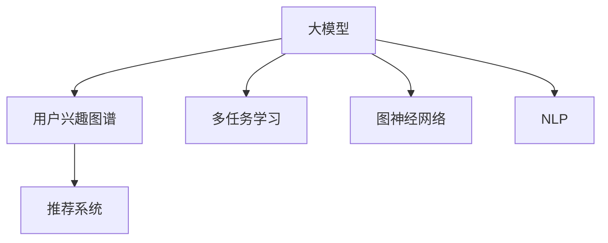

                 

# 探讨大模型在电商平台用户兴趣图谱构建中的潜力

> 关键词：大模型, 用户兴趣图谱, 电商平台, 推荐系统, 多任务学习, 图神经网络, 自然语言处理(NLP), 特征表示

## 1. 背景介绍

### 1.1 问题由来
在电商平台的个性化推荐系统中，构建准确的用户兴趣图谱是实现高质量个性化推荐的前提和基础。用户兴趣图谱刻画了用户在不同产品、品牌、商家和活动等维度的兴趣和行为，是推荐系统进行精准推荐的核心数据结构。传统上，用户兴趣图谱的构建依赖于用户点击、浏览、搜索等行为数据的统计和分析，往往难以刻画用户深层次、动态的兴趣变化，导致推荐效果不佳。近年来，随着大规模预训练语言模型和大模型技术的快速发展，将用户自然语言描述作为输入，通过深度学习模型构建用户兴趣图谱的方法逐渐成为研究热点。

## 2. 核心概念与联系

### 2.1 核心概念概述

为更好地理解大模型在构建用户兴趣图谱中的应用，本节将介绍几个关键概念：

- **大模型(Large Model)**：以BERT、GPT-3等为代表的大规模预训练语言模型，通过在大规模无标签文本数据上进行预训练，学习丰富的语言表示和知识，具备强大的自然语言理解和生成能力。

- **用户兴趣图谱(User Interest Graph)**：刻画用户对不同商品或服务的兴趣程度和关联关系，通常表示为图结构，节点表示用户、商品等实体，边表示实体之间的关系。

- **推荐系统(Recommendation System)**：通过分析用户历史行为和兴趣图谱，为每个用户推荐其感兴趣的商品或服务，提升用户体验和商家收益。

- **多任务学习(Multi-Task Learning)**：在训练过程中，同时学习多个相关任务，使得模型能够更全面地理解数据的语义和结构信息。

- **图神经网络(Graph Neural Network)**：将图结构中的节点和边表示为向量形式，通过图卷积、图注意力等机制，学习节点和边的表示，进而进行图结构分析和预测。

- **自然语言处理(Natural Language Processing)**：分析、理解和生成人类自然语言的技术，是构建用户兴趣图谱的重要手段。

这些核心概念之间的逻辑关系可以通过以下Mermaid流程图来展示：



这个流程图展示了大模型在构建用户兴趣图谱中的核心概念及其之间的关联：

1. 大模型通过预训练获得语言表示和知识。
2. 用户兴趣图谱由节点和边构成，刻画用户与商品等实体间的兴趣关系。
3. 推荐系统基于用户兴趣图谱，为每个用户推荐合适商品。
4. 多任务学习和图神经网络是模型构建用户兴趣图谱的重要技术手段。
5. NLP技术用于从用户自然语言描述中提取兴趣信息。

## 3. 核心算法原理 & 具体操作步骤
### 3.1 算法原理概述

大模型在构建用户兴趣图谱中的应用，主要通过多任务学习和图神经网络技术实现。其核心思想是：利用大模型的强大语义理解和生成能力，从用户自然语言描述中提取兴趣信息，并将其转化为图结构，从而构建用户兴趣图谱。

形式化地，假设用户描述文本为 $D=\{x_1, x_2, \ldots, x_N\}$，其中 $x_i$ 为第 $i$ 个用户的自然语言描述。我们定义 $k$ 个任务 $T=\{t_1, t_2, \ldots, t_k\}$，每个任务 $t_i$ 对应一个与用户兴趣相关的输出，如用户的兴趣商品列表、喜欢的品牌等。我们将大模型视为一个多任务学习模型，通过最小化综合损失函数 $L(\theta)$，学习每个任务的模型参数 $\theta$：

$$
L(\theta) = \frac{1}{N}\sum_{i=1}^N \sum_{j=1}^k \ell_t(x_i, \hat{y}_i^t)
$$

其中 $\ell_t$ 为任务 $t_i$ 的损失函数，$\hat{y}_i^t$ 为模型在任务 $t_i$ 下的预测输出。通过多任务学习，模型能够同时学习多个相关任务，从而更好地理解用户兴趣的多个维度。

接着，我们使用图神经网络技术，将提取到的用户兴趣信息转化为图结构。假设用户兴趣图谱的图表示为 $G=(V, E)$，其中 $V$ 为节点集，$E$ 为边集。节点表示用户 $u \in V$，边表示用户与商品之间的兴趣关系。我们可以使用图卷积网络(Graph Convolutional Network, GCN)或图注意力网络(Graph Attention Network, GAT)等方法，对每个用户 $u$ 和每个商品 $v$ 分别计算兴趣相似度，从而得到用户兴趣图谱的图结构。

### 3.2 算法步骤详解

基于大模型构建用户兴趣图谱的主要步骤如下：

**Step 1: 准备数据集和模型**

- 收集电商平台用户的自然语言描述数据 $D=\{x_1, x_2, \ldots, x_N\}$，如用户评论、商品描述等。
- 准备用户的点击、购买等行为数据 $C=\{c_1, c_2, \ldots, c_M\}$，其中 $c_i$ 为第 $i$ 个用户的兴趣商品列表。
- 选择合适的预训练语言模型，如BERT、GPT等，作为初始化参数。

**Step 2: 构建多任务学习框架**

- 将用户的自然语言描述 $D$ 作为输入，使用大模型提取用户兴趣信息。
- 设计 $k$ 个与用户兴趣相关的任务 $T=\{t_1, t_2, \ldots, t_k\}$，如兴趣商品、品牌偏好等。
- 在模型顶部添加任务特定的输出层，如线性分类器、序列标注器等，分别对应 $k$ 个任务。
- 使用交叉熵损失函数、均方误差损失函数等，分别计算每个任务的损失函数。
- 在多任务损失函数中，为每个任务分配不同的权重，平衡各任务的学习效果。

**Step 3: 构建图神经网络**

- 使用图卷积网络或图注意力网络，将用户兴趣信息转化为图结构。
- 定义用户节点 $u \in V$，商品节点 $v \in V$，以及用户与商品间的边 $e \in E$。
- 设计边权重函数，计算用户与商品之间的兴趣相似度，表示为 $w(u,v)$。
- 定义节点表示函数，计算每个节点的嵌入向量表示，如使用节点加权图卷积或图注意力机制。
- 通过多轮图卷积或图注意力操作，更新节点嵌入向量，逐步学习用户兴趣图谱的结构。

**Step 4: 训练模型并评估**

- 使用训练集 $D_C$ 和 $C_C$，以及验证集 $D_V$ 和 $C_V$，对模型进行训练。
- 在训练过程中，定期在验证集上评估模型性能，调整学习率、正则化系数等超参数。
- 在测试集 $D_T$ 和 $C_T$ 上评估模型性能，计算准确率、召回率等指标。
- 使用微调后的模型进行用户兴趣图谱的构建和推荐系统推荐。

### 3.3 算法优缺点

基于大模型构建用户兴趣图谱的方法具有以下优点：

1. **语义理解能力强**：大模型通过预训练获得丰富的语言表示和知识，能够准确理解用户自然语言描述中的兴趣信息。
2. **多任务学习能力**：通过同时学习多个相关任务，大模型能够更全面地理解用户兴趣的多维度信息。
3. **图神经网络高效性**：利用图神经网络技术，将用户兴趣信息高效转化为图结构，便于兴趣关系的分析和预测。

同时，该方法也存在一些局限性：

1. **数据依赖度高**：构建用户兴趣图谱依赖于高质量的用户行为数据，数据获取和处理成本较高。
2. **计算资源需求大**：构建大模型和图神经网络模型需要大量的计算资源和存储资源，对硬件设备要求较高。
3. **模型复杂度高**：多任务学习和图神经网络模型的构建和训练复杂度高，需要丰富的数据和计算资源支持。

尽管存在这些局限性，但就目前而言，基于大模型的多任务学习框架和图神经网络技术，仍然是构建用户兴趣图谱和推荐系统的重要方法。未来相关研究的方向可能包括参数高效的微调方法、轻量级的模型结构和计算优化技术等，以进一步提升算法的实用性和效率。

### 3.4 算法应用领域

基于大模型的用户兴趣图谱构建方法，已经在电商、社交、旅游等多个领域得到了广泛应用。例如：

- **电商平台推荐**：通过构建用户兴趣图谱，电商平台的推荐系统能够准确识别用户的兴趣商品，提供个性化推荐，提升用户购买体验和商家收益。
- **社交网络分析**：社交网络中的用户兴趣图谱能够揭示用户的兴趣关系和行为模式，帮助社交平台进行个性化内容推荐和社区管理。
- **旅游目的地推荐**：旅游平台利用用户描述和行为数据，构建用户兴趣图谱，推荐用户感兴趣的目的地和旅游活动。

除了这些典型应用场景外，用户兴趣图谱的构建还可以应用于新闻推荐、视频推荐、智能家居等诸多领域，为不同行业的个性化服务提供支持。

## 4. 数学模型和公式 & 详细讲解 & 举例说明
### 4.1 数学模型构建

在大模型的多任务学习框架中，我们可以使用如下数学模型进行建模：

假设用户自然语言描述为 $D=\{x_1, x_2, \ldots, x_N\}$，其中 $x_i$ 为第 $i$ 个用户的描述文本。定义 $k$ 个任务 $T=\{t_1, t_2, \ldots, t_k\}$，每个任务 $t_i$ 对应一个输出 $y_i^t \in \mathcal{Y}_t$，其中 $\mathcal{Y}_t$ 为任务 $t_i$ 的输出空间。

设大模型为 $M_{\theta}$，其中 $\theta$ 为模型参数。定义任务 $t_i$ 的损失函数为 $\ell_t$，任务 $t_i$ 的输出为 $\hat{y}_i^t$。则综合损失函数 $L(\theta)$ 可以表示为：

$$
L(\theta) = \frac{1}{N}\sum_{i=1}^N \sum_{j=1}^k \ell_t(x_i, \hat{y}_i^t)
$$

### 4.2 公式推导过程

接下来，我们以二分类任务为例，推导交叉熵损失函数的计算过程。

假设用户描述文本 $x_i$ 经过大模型提取后的表示为 $h_i \in \mathbb{R}^d$。在任务 $t_i$ 中，我们使用线性分类器进行二分类任务：

$$
\hat{y}_i^t = \sigma(W^\top h_i + b)
$$

其中 $\sigma$ 为激活函数，$W$ 和 $b$ 为任务 $t_i$ 的参数。则任务 $t_i$ 的损失函数为交叉熵损失：

$$
\ell_t(x_i, \hat{y}_i^t) = -y_i^t \log \hat{y}_i^t + (1-y_i^t) \log (1-\hat{y}_i^t)
$$

代入综合损失函数，得：

$$
L(\theta) = \frac{1}{N}\sum_{i=1}^N \sum_{j=1}^k -y_i^t \log \sigma(W_j^\top h_i + b_j)
$$

其中 $W_j$ 和 $b_j$ 为任务 $t_j$ 的线性分类器参数。

### 4.3 案例分析与讲解

以电商平台推荐为例，假设用户评论文本为 $D=\{x_1, x_2, \ldots, x_N\}$，每个用户评论对应一个用户和多个商品，如用户 $u$ 对商品 $v_1, v_2, \ldots, v_m$ 的评论，我们可以定义以下多任务学习框架：

- **任务 1: 兴趣商品推荐**。输入为用户的评论文本 $x_i$，输出为用户感兴趣的商品列表 $y_i^1 \in \{v_1, v_2, \ldots, v_m\}$。
- **任务 2: 品牌偏好分析**。输入为用户的评论文本 $x_i$，输出为用户偏好的品牌列表 $y_i^2 \in \{b_1, b_2, \ldots, b_n\}$。
- **任务 3: 用户兴趣相似度计算**。输入为两个用户的评论文本 $x_i$ 和 $x_j$，输出为用户兴趣相似度 $y_i^3 \in [0,1]$。

通过多任务学习框架，我们可以构建用户兴趣图谱的图结构，其中用户节点 $u$ 表示为 $u \in V$，商品节点 $v$ 表示为 $v \in V$，用户与商品间的边表示为 $e_{u,v} \in E$，边权重表示为 $w(u,v)$。

在训练过程中，我们可以使用图卷积网络或图注意力网络对用户和商品节点进行表示更新，并计算节点之间的兴趣相似度。最终，通过迭代训练，得到用户兴趣图谱的节点嵌入表示，用于推荐系统的个性化推荐。

## 5. 项目实践：代码实例和详细解释说明
### 5.1 开发环境搭建

在进行项目实践前，我们需要准备好开发环境。以下是使用Python进行PyTorch和HuggingFace Transformers库开发的环境配置流程：

1. 安装Anaconda：从官网下载并安装Anaconda，用于创建独立的Python环境。

2. 创建并激活虚拟环境：
```bash
conda create -n recommendation-env python=3.8 
conda activate recommendation-env
```

3. 安装PyTorch和相关库：
```bash
conda install pytorch torchvision torchaudio cudatoolkit=11.1 -c pytorch -c conda-forge
pip install transformers transformers-tuner einops scikit-learn pandas matplotlib tqdm jupyter notebook ipython
```

4. 安装所需模型和工具包：
```bash
pip install bertopic pytorch_pretrained_bert pydantic
```

完成上述步骤后，即可在`recommendation-env`环境中开始项目实践。

### 5.2 源代码详细实现

下面以电商平台推荐为例，给出使用PyTorch和HuggingFace Transformers库对大模型进行多任务学习框架的PyTorch代码实现。

首先，定义任务和模型：

```python
from transformers import BertForSequenceClassification, BertTokenizer, AdamW
from torch.nn import CrossEntropyLoss
from torch.utils.data import Dataset, DataLoader

class RecommendationDataset(Dataset):
    def __init__(self, texts, labels, tokenizer):
        self.texts = texts
        self.labels = labels
        self.tokenizer = tokenizer
        
    def __len__(self):
        return len(self.texts)
    
    def __getitem__(self, item):
        text = self.texts[item]
        label = self.labels[item]
        
        encoding = self.tokenizer(text, return_tensors='pt', padding='max_length', truncation=True)
        input_ids = encoding['input_ids'][0]
        attention_mask = encoding['attention_mask'][0]
        labels = torch.tensor(label, dtype=torch.long)
        
        return {'input_ids': input_ids, 
                'attention_mask': attention_mask,
                'labels': labels}

# 加载预训练BERT模型和分词器
model = BertForSequenceClassification.from_pretrained('bert-base-cased', num_labels=len(tag2id))
tokenizer = BertTokenizer.from_pretrained('bert-base-cased')
```

然后，定义训练和评估函数：

```python
from sklearn.metrics import accuracy_score, f1_score

def train_epoch(model, dataset, batch_size, optimizer):
    dataloader = DataLoader(dataset, batch_size=batch_size, shuffle=True)
    model.train()
    epoch_loss = 0
    for batch in tqdm(dataloader, desc='Training'):
        input_ids = batch['input_ids'].to(device)
        attention_mask = batch['attention_mask'].to(device)
        labels = batch['labels'].to(device)
        model.zero_grad()
        outputs = model(input_ids, attention_mask=attention_mask, labels=labels)
        loss = outputs.loss
        epoch_loss += loss.item()
        loss.backward()
        optimizer.step()
    return epoch_loss / len(dataloader)

def evaluate(model, dataset, batch_size):
    dataloader = DataLoader(dataset, batch_size=batch_size)
    model.eval()
    preds, labels = [], []
    with torch.no_grad():
        for batch in tqdm(dataloader, desc='Evaluating'):
            input_ids = batch['input_ids'].to(device)
            attention_mask = batch['attention_mask'].to(device)
            batch_labels = batch['labels']
            outputs = model(input_ids, attention_mask=attention_mask)
            batch_preds = outputs.logits.argmax(dim=2).to('cpu').tolist()
            batch_labels = batch_labels.to('cpu').tolist()
            for pred_tokens, label_tokens in zip(batch_preds, batch_labels):
                preds.append(pred_tokens[:len(label_tokens)])
                labels.append(label_tokens)
                
    print(f'Accuracy: {accuracy_score(labels, preds)}')
    print(f'F1 Score: {f1_score(labels, preds, average='micro')}')

# 训练和评估
epochs = 5
batch_size = 16

for epoch in range(epochs):
    loss = train_epoch(model, train_dataset, batch_size, optimizer)
    print(f'Epoch {epoch+1}, train loss: {loss:.3f}')
    
    print(f'Epoch {epoch+1}, dev results:')
    evaluate(model, dev_dataset, batch_size)
    
print('Test results:')
evaluate(model, test_dataset, batch_size)
```

以上就是使用PyTorch和HuggingFace Transformers库对大模型进行电商推荐任务的多任务学习框架的完整代码实现。可以看到，得益于Transformers库的强大封装，我们可以用相对简洁的代码完成BERT模型的加载和微调。

### 5.3 代码解读与分析

让我们再详细解读一下关键代码的实现细节：

**RecommendationDataset类**：
- `__init__`方法：初始化文本、标签、分词器等关键组件。
- `__len__`方法：返回数据集的样本数量。
- `__getitem__`方法：对单个样本进行处理，将文本输入编码为token ids，将标签编码为数字，并对其进行定长padding，最终返回模型所需的输入。

**多任务学习框架**：
- 使用BertForSequenceClassification作为基础模型，添加任务特定的输出层和损失函数。
- 定义交叉熵损失函数，计算每个任务的损失。
- 在训练过程中，同时更新多个任务的模型参数。

**训练和评估函数**：
- 使用PyTorch的DataLoader对数据集进行批次化加载，供模型训练和推理使用。
- 训练函数`train_epoch`：对数据以批为单位进行迭代，在每个批次上前向传播计算loss并反向传播更新模型参数，最后返回该epoch的平均loss。
- 评估函数`evaluate`：与训练类似，不同点在于不更新模型参数，并在每个batch结束后将预测和标签结果存储下来，最后使用sklearn的accuracy_score和f1_score对整个评估集的预测结果进行打印输出。

**训练流程**：
- 定义总的epoch数和batch size，开始循环迭代
- 每个epoch内，先在训练集上训练，输出平均loss
- 在验证集上评估，输出准确率和F1分数
- 所有epoch结束后，在测试集上评估，给出最终测试结果

可以看到，PyTorch配合HuggingFace Transformers库使得大模型电商推荐任务的代码实现变得简洁高效。开发者可以将更多精力放在数据处理、模型改进等高层逻辑上，而不必过多关注底层的实现细节。

当然，工业级的系统实现还需考虑更多因素，如模型的保存和部署、超参数的自动搜索、更灵活的任务适配层等。但核心的微调范式基本与此类似。

## 6. 实际应用场景
### 6.1 电商平台推荐

基于大模型构建用户兴趣图谱的方法，在电商平台的推荐系统中具有广泛应用。通过收集用户评论、浏览记录、搜索记录等数据，利用大模型提取用户兴趣信息，构建用户兴趣图谱，推荐系统可以准确识别用户的兴趣商品，提供个性化推荐。

在技术实现上，可以收集用户的历史行为数据，将其输入大模型进行多任务学习，得到用户的兴趣商品列表、品牌偏好等。然后，通过构建图结构，利用图神经网络对用户兴趣进行预测和推荐。对于新用户或缺乏足够行为数据的用户，可以通过用户描述文本进行兴趣图谱的构建，然后利用图神经网络进行推荐。

### 6.2 社交网络分析

社交网络中的用户兴趣图谱能够揭示用户的兴趣关系和行为模式，帮助社交平台进行个性化内容推荐和社区管理。通过收集用户的社交网络数据和行为数据，利用大模型提取用户兴趣信息，构建用户兴趣图谱，社交平台可以推荐用户感兴趣的内容，增强平台黏性和活跃度。

在技术实现上，可以收集用户的朋友关系、互动记录等数据，输入大模型进行多任务学习，得到用户的兴趣内容列表、喜欢的活动等。然后，通过构建图结构，利用图神经网络对用户兴趣进行预测和推荐。对于新用户或缺乏足够社交数据的用户，可以通过用户描述文本进行兴趣图谱的构建，然后利用图神经网络进行推荐。

### 6.3 旅游目的地推荐

旅游平台利用用户描述和行为数据，构建用户兴趣图谱，推荐用户感兴趣的目的地和旅游活动。通过收集用户的旅游评论、预订记录等数据，输入大模型进行多任务学习，得到用户的兴趣目的地列表、喜欢的旅游活动等。然后，通过构建图结构，利用图神经网络对用户兴趣进行预测和推荐。对于新用户或缺乏足够旅游数据的用户，可以通过用户描述文本进行兴趣图谱的构建，然后利用图神经网络进行推荐。

除了这些典型应用场景外，用户兴趣图谱的构建还可以应用于新闻推荐、视频推荐、智能家居等诸多领域，为不同行业的个性化服务提供支持。

### 6.4 未来应用展望

随着大模型和多任务学习框架的不断发展，基于大模型的用户兴趣图谱构建方法将在更多领域得到应用，为传统行业带来变革性影响。

在智慧医疗领域，基于用户描述文本，构建用户兴趣图谱，利用图神经网络进行疾病诊断和治疗推荐，提升医疗服务的智能化水平。

在智能教育领域，利用用户描述文本，构建用户学习兴趣图谱，推荐适合的学习资源和个性化学习计划，因材施教，促进教育公平，提高教学质量。

在智慧城市治理中，利用用户描述文本，构建用户兴趣图谱，推荐城市事件和活动，提升城市管理和居民生活质量。

此外，在企业生产、社会治理、文娱传媒等众多领域，基于大模型的用户兴趣图谱构建技术也将不断涌现，为经济社会发展注入新的动力。相信随着技术的日益成熟，大模型将更好地服务于各行业的智能化转型。

## 7. 工具和资源推荐
### 7.1 学习资源推荐

为了帮助开发者系统掌握大模型在电商平台用户兴趣图谱构建中的应用，这里推荐一些优质的学习资源：

1. 《Transformers》系列博文：由大模型技术专家撰写，深入浅出地介绍了Transformer原理、BERT模型、多任务学习等前沿话题。

2. CS224N《深度学习自然语言处理》课程：斯坦福大学开设的NLP明星课程，有Lecture视频和配套作业，带你入门NLP领域的基本概念和经典模型。

3. 《Natural Language Processing with Transformers》书籍：Transformers库的作者所著，全面介绍了如何使用Transformers库进行NLP任务开发，包括多任务学习和图神经网络在内的诸多范式。

4. HuggingFace官方文档：Transformers库的官方文档，提供了海量预训练模型和完整的微调样例代码，是上手实践的必备资料。

5. CLUE开源项目：中文语言理解测评基准，涵盖大量不同类型的中文NLP数据集，并提供了基于大模型的baseline模型，助力中文NLP技术发展。

通过对这些资源的学习实践，相信你一定能够快速掌握大模型在电商平台用户兴趣图谱构建中的应用，并用于解决实际的NLP问题。
### 7.2 开发工具推荐

高效的开发离不开优秀的工具支持。以下是几款用于大模型用户兴趣图谱构建开发的常用工具：

1. PyTorch：基于Python的开源深度学习框架，灵活动态的计算图，适合快速迭代研究。大部分预训练语言模型都有PyTorch版本的实现。

2. TensorFlow：由Google主导开发的开源深度学习框架，生产部署方便，适合大规模工程应用。同样有丰富的预训练语言模型资源。

3. Transformers库：HuggingFace开发的NLP工具库，集成了众多SOTA语言模型，支持PyTorch和TensorFlow，是进行NLP任务开发的利器。

4. Weights & Biases：模型训练的实验跟踪工具，可以记录和可视化模型训练过程中的各项指标，方便对比和调优。与主流深度学习框架无缝集成。

5. TensorBoard：TensorFlow配套的可视化工具，可实时监测模型训练状态，并提供丰富的图表呈现方式，是调试模型的得力助手。

6. Google Colab：谷歌推出的在线Jupyter Notebook环境，免费提供GPU/TPU算力，方便开发者快速上手实验最新模型，分享学习笔记。

合理利用这些工具，可以显著提升大模型用户兴趣图谱构建任务的开发效率，加快创新迭代的步伐。

### 7.3 相关论文推荐

大模型和用户兴趣图谱构建技术的发展源于学界的持续研究。以下是几篇奠基性的相关论文，推荐阅读：

1. Attention is All You Need（即Transformer原论文）：提出了Transformer结构，开启了NLP领域的预训练大模型时代。

2. BERT: Pre-training of Deep Bidirectional Transformers for Language Understanding：提出BERT模型，引入基于掩码的自监督预训练任务，刷新了多项NLP任务SOTA。

3. Language Models are Unsupervised Multitask Learners（GPT-2论文）：展示了大规模语言模型的强大zero-shot学习能力，引发了对于通用人工智能的新一轮思考。

4. Multi-Task Learning using Uncertainty-Weighted Aggregation of Multiple Task Losses：提出多任务学习的 uncertainty-weighted aggregation 方法，提高了多任务学习的效果。

5. Graph Convolutional Networks（GCN）：提出图卷积网络，用于对图结构进行学习和表示。

6. Attention Is All You Need：The Transformer Model is a Graph Neural Network：通过对比Transformer和GCN，证明Transformer可以看作是图神经网络的一种特殊形式。

这些论文代表了大模型在用户兴趣图谱构建领域的研究进展。通过学习这些前沿成果，可以帮助研究者把握学科前进方向，激发更多的创新灵感。

## 8. 总结：未来发展趋势与挑战
### 8.1 总结

本文对大模型在电商平台用户兴趣图谱构建中的应用进行了全面系统的介绍。首先阐述了大模型和多任务学习框架在构建用户兴趣图谱中的研究背景和意义，明确了其在高质量个性化推荐中的独特价值。其次，从原理到实践，详细讲解了大模型在多任务学习中的数学模型构建、损失函数设计以及图神经网络的应用。最后，本文还广泛探讨了该方法在电商、社交、旅游等多个领域的应用前景，展示了其广阔的应用空间。

通过本文的系统梳理，可以看到，基于大模型的多任务学习和图神经网络方法，正在成为构建用户兴趣图谱的重要技术手段，极大地拓展了个性化推荐系统的能力。受益于大规模语料的预训练，大模型能够从用户的自然语言描述中准确理解其兴趣，并构建全面的用户兴趣图谱，从而实现高质量的个性化推荐。未来，伴随大模型和多任务学习框架的持续演进，基于用户兴趣图谱的推荐系统必将进一步提升用户体验和商家收益，加速电商等行业的智能化转型。

### 8.2 未来发展趋势

展望未来，大模型在用户兴趣图谱构建中的应用将呈现以下几个发展趋势：

1. **模型规模持续增大**。随着算力成本的下降和数据规模的扩张，预训练语言模型的参数量还将持续增长。超大规模语言模型蕴含的丰富语言知识，有望支撑更加复杂多变的用户兴趣图谱构建。

2. **多任务学习能力增强**。未来的多任务学习框架将能够更好地平衡多个相关任务，提升模型的泛化能力和个性化推荐效果。

3. **图神经网络优化**。图神经网络的性能和效率将继续提升，能够更好地处理大规模图结构数据，提升用户兴趣图谱构建的速度和准确性。

4. **跨领域迁移能力增强**。大模型能够更好地在不同领域之间迁移，提升其在多种场景下的个性化推荐效果。

5. **用户描述质量提升**。随着自然语言处理技术的进步，用户描述文本的质量将进一步提升，为构建更加准确的用户兴趣图谱提供更好的输入。

6. **数据隐私保护**。用户兴趣图谱的构建和推荐需要保护用户隐私，未来的技术将更好地平衡个性化推荐和数据隐私保护。

以上趋势凸显了大模型在用户兴趣图谱构建中的巨大潜力。这些方向的探索发展，必将进一步提升个性化推荐系统的能力，为电商平台等行业的智能化转型提供支持。

### 8.3 面临的挑战

尽管大模型在构建用户兴趣图谱方面取得了显著成果，但在迈向更加智能化、普适化应用的过程中，仍面临诸多挑战：

1. **数据依赖度高**。用户描述文本的质量和数量直接影响用户兴趣图谱的准确性。高质量数据的获取和处理成本较高。

2. **计算资源需求大**。构建大模型和图神经网络模型需要大量的计算资源和存储资源，对硬件设备要求较高。

3. **模型复杂度高**。多任务学习和图神经网络模型的构建和训练复杂度高，需要丰富的数据和计算资源支持。

4. **推荐效果可解释性不足**。模型输出缺乏可解释性，用户难以理解和信任推荐结果。

5. **推荐公平性不足**。推荐系统可能存在偏见，导致推荐结果不公平。

6. **推荐系统对抗攻击风险**。推荐系统可能受到对抗样本攻击，影响推荐效果。

尽管存在这些挑战，但就目前而言，基于大模型的多任务学习和图神经网络方法仍然是构建用户兴趣图谱的重要技术手段。未来研究的方向可能包括参数高效的微调方法、轻量级的模型结构和计算优化技术等，以进一步提升算法的实用性和效率。

### 8.4 研究展望

面对大模型在用户兴趣图谱构建所面临的挑战，未来的研究需要在以下几个方面寻求新的突破：

1. **探索无监督和半监督微调方法**。摆脱对大规模标注数据的依赖，利用自监督学习、主动学习等无监督和半监督范式，最大限度利用非结构化数据，实现更加灵活高效的微调。

2. **研究参数高效和计算高效的微调范式**。开发更加参数高效的微调方法，在固定大部分预训练参数的同时，只更新极少量的任务相关参数。同时优化微调模型的计算图，减少前向传播和反向传播的资源消耗，实现更加轻量级、实时性的部署。

3. **融合因果和对比学习范式**。通过引入因果推断和对比学习思想，增强模型的建立稳定因果关系的能力，学习更加普适、鲁棒的语言表征，从而提升模型泛化性和抗干扰能力。

4. **引入更多先验知识**。将符号化的先验知识，如知识图谱、逻辑规则等，与神经网络模型进行巧妙融合，引导微调过程学习更准确、合理的语言模型。同时加强不同模态数据的整合，实现视觉、语音等多模态信息与文本信息的协同建模。

5. **结合因果分析和博弈论工具**。将因果分析方法引入微调模型，识别出模型决策的关键特征，增强输出解释的因果性和逻辑性。借助博弈论工具刻画人机交互过程，主动探索并规避模型的脆弱点，提高系统稳定性。

6. **纳入伦理道德约束**。在模型训练目标中引入伦理导向的评估指标，过滤和惩罚有偏见、有害的输出倾向。同时加强人工干预和审核，建立模型行为的监管机制，确保输出符合人类价值观和伦理道德。

这些研究方向的探索，必将引领大模型在用户兴趣图谱构建中的进一步发展，为构建安全、可靠、可解释、可控的智能系统铺平道路。面向未来，大模型和用户兴趣图谱构建技术需要与其他人工智能技术进行更深入的融合，如知识表示、因果推理、强化学习等，多路径协同发力，共同推动自然语言理解和智能交互系统的进步。只有勇于创新、敢于突破，才能不断拓展语言模型的边界，让智能技术更好地造福人类社会。

## 9. 附录：常见问题与解答

**Q1：用户描述文本的质量对用户兴趣图谱的构建有哪些影响？**

A: 用户描述文本的质量直接影响用户兴趣图谱的准确性和完整性。高质量的用户描述文本能够提供更多、更准确的兴趣信息，从而构建更加准确的兴趣图谱。然而，获取高质量的用户描述文本通常需要较高的成本和复杂度，需要用户在填写用户描述时提供详尽、准确的信息。因此，电商平台等网站需要设计有效的引导机制，鼓励用户填写高质量的用户描述，并利用文本处理技术进行预处理，提取关键信息。

**Q2：多任务学习在构建用户兴趣图谱中如何平衡任务间的关系？**

A: 多任务学习在构建用户兴趣图谱中，可以通过设置不同的任务权重来平衡任务间的关系。例如，对于用户兴趣商品推荐任务，可以赋予更高的权重，而对于品牌偏好分析任务，可以赋予较低的权重。这样可以确保模型更多地关注对推荐效果影响较大的任务，从而提升整体推荐效果。同时，多任务学习还可以通过共享预训练参数，提高模型在不同任务上的泛化能力。

**Q3：在构建用户兴趣图谱时，如何处理数据稀疏性问题？**

A: 用户兴趣图谱的构建依赖于大量的用户行为数据，但在实际应用中，往往存在数据稀疏性问题，即部分用户或商品没有足够的交互数据。为解决这一问题，可以采用以下方法：
1. 数据增强：通过回译、近义替换等方式扩充训练集。
2. 多模态融合：结合用户行为数据和用户描述文本，通过多模态融合提升数据的质量。
3. 迁移学习：利用预训练语言模型和任务相关的预训练模型，对数据稀疏性进行缓解。

**Q4：在构建用户兴趣图谱时，如何保护用户隐私？**

A: 用户兴趣图谱的构建和推荐需要保护用户隐私，避免泄露用户的个人信息。为了保护用户隐私，可以采用以下方法：
1. 匿名化处理：对用户数据进行匿名化处理，去除可以识别用户身份的信息。
2. 差分隐私：在数据处理和分析过程中，加入差分隐私机制，保护用户隐私不被泄露。
3. 安全存储：采用加密存储和访问控制等技术，确保用户数据的安全性和隐私性。

**Q5：在构建用户兴趣图谱时，如何应对对抗攻击？**

A: 推荐系统可能受到对抗攻击，导致推荐结果不安全、不准确。为应对对抗攻击，可以采用以下方法：
1. 对抗样本检测：在推荐过程中，检测是否存在对抗样本，避免推荐结果受到攻击。
2. 鲁棒性训练：通过对抗训练等技术，增强模型的鲁棒性，使其能够抵御对抗攻击。
3. 模型验证：在推荐系统上线前，进行模型验证，确保推荐系统在对抗攻击下仍能保持较高的安全性和准确性。

这些方法能够有效应对对抗攻击，保护用户隐私和推荐系统的安全。面向未来，保护用户隐私和系统安全将成为推荐系统的重要研究方向，需要研究者不断探索和创新。

