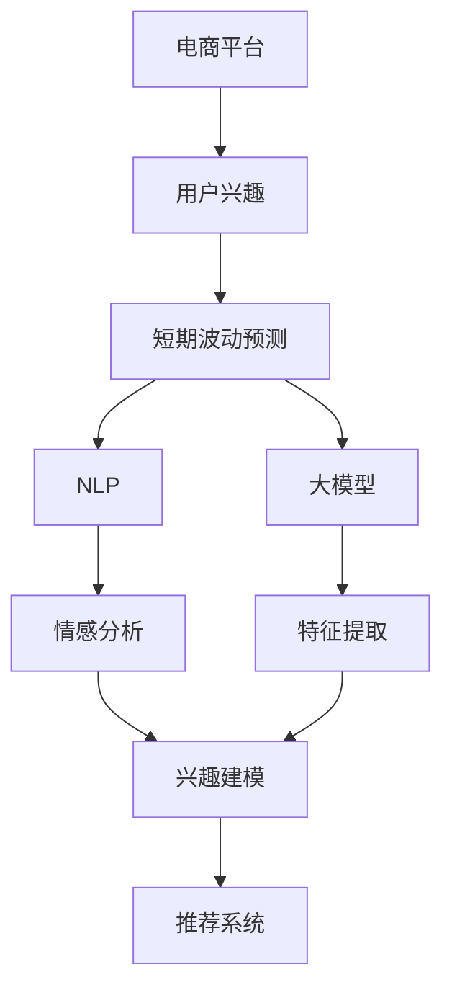

                 

# 探讨大模型在电商平台用户兴趣短期波动预测中的潜力

> 关键词：电商平台,用户兴趣,短期波动,大模型,预测模型,自然语言处理,深度学习,机器学习

## 1. 背景介绍

在现代社会，电商平台已成为消费者购物的重要渠道。随着互联网技术的进步和个性化推荐算法的应用，电商平台能够提供更加精准的商品推荐，显著提升用户体验和购买转化率。然而，消费者的购买兴趣和需求会受到诸多因素的影响，如市场季节变化、节日促销、商品类别变动等，这些短期波动往往难以通过传统的统计方法进行捕捉和预测。因此，探索如何通过深度学习和自然语言处理技术，实现用户兴趣的精准短期预测，是提升电商平台用户满意度、增加销售额的重要研究方向。

在这一背景下，大模型（Large Pre-trained Models）作为当前最先进的深度学习技术，通过在海量数据上预训练获得广泛的语言知识，并具有强大的特征表示能力，能够在一定程度上缓解传统方法在处理短期波动时的不足。本文将探讨大模型在电商平台用户兴趣短期波动预测中的潜力，并介绍相关的模型构建、算法选择和实际应用方法。

## 2. 核心概念与联系

### 2.1 核心概念概述

为更好地理解大模型在电商平台用户兴趣短期波动预测中的应用，本节将介绍几个密切相关的核心概念：

- **大模型（Large Pre-trained Models）**：指在大规模无标签数据上预训练得到的深度神经网络模型。如GPT-3、BERT等模型，通过在广泛语料上进行预训练，学习到丰富的语言知识，具有强大的特征提取和泛化能力。

- **自然语言处理（NLP）**：研究如何通过计算机处理和理解人类语言的技术，包括文本分类、情感分析、命名实体识别、机器翻译等任务。

- **短期波动预测（Short-term Fluctuation Prediction）**：指在一定时间范围内（如一周、一个月），对用户行为或市场数据进行预测，以捕捉短期变化趋势。

- **电商平台用户兴趣预测**：通过分析用户浏览、点击、购买等行为数据，预测用户对不同商品或类别的兴趣变化。

- **推荐系统**：利用用户历史行为数据，为用户推荐可能感兴趣的商品或服务，以提高用户满意度和转化率。

这些核心概念之间的逻辑关系可以通过以下Mermaid流程图来展示：



该流程图展示了电商平台的运作流程：

1. 用户通过电商平台进行购物行为。
2. 电商平台收集用户的浏览、点击、购买等数据。
3. 利用大模型对用户兴趣进行短期波动预测。
4. 通过NLP技术分析用户评论、反馈等文本信息，获得用户的情感倾向。
5. 利用情感分析等方法，构建用户兴趣模型。
6. 利用预测模型输出结果，推荐用户感兴趣的商品。

这些概念共同构成了电商平台用户兴趣预测的系统框架，使得大模型在这一场景中具备了巨大的应用潜力。

## 3. 核心算法原理 & 具体操作步骤
### 3.1 算法原理概述

在电商平台用户兴趣短期波动预测中，大模型的主要作用在于通过大量无标签数据预训练，学习到丰富的语言知识，用于提取和泛化用户行为数据中的潜在特征。具体的预测过程可分为以下几个步骤：

1. **数据收集与预处理**：收集电商平台用户的行为数据，如浏览记录、点击次数、购买历史等，并进行清洗、归一化等预处理操作。

2. **特征提取**：利用大模型对文本数据进行编码，提取出用户兴趣的相关特征。如使用BERT模型对用户评论进行编码，获取词汇、语法和上下文等特征。

3. **短期波动预测**：将提取到的特征作为输入，使用回归或分类模型对用户兴趣进行短期波动预测，如使用LSTM、GRU等循环神经网络模型，或使用Transformer模型对时间序列数据进行预测。

4. **模型优化与部署**：通过优化算法（如Adam、SGD等）对模型进行微调，使其在电商平台用户兴趣预测任务上取得最佳效果。最后将模型部署到生产环境中，进行实时预测和推荐。

### 3.2 算法步骤详解

以下详细介绍电商平台用户兴趣短期波动预测的大模型应用步骤：

**Step 1: 数据收集与预处理**

1. **数据采集**：通过API接口、日志文件等方式，从电商平台收集用户行为数据。一般包括用户的浏览记录、点击次数、购买历史等。

2. **数据清洗**：去除噪声数据和异常值，处理缺失值和重复记录，确保数据的准确性和完整性。

3. **数据标准化**：对数据进行归一化、标准化等操作，使得不同特征维度具有相同的量级。

4. **数据分割**：将数据划分为训练集、验证集和测试集，确保模型在未见过的数据上也能有较好的表现。

**Step 2: 特征提取与嵌入**

1. **文本数据编码**：将用户评论、描述等文本数据，输入到BERT、GPT等预训练语言模型中，获得高维向量表示。

2. **特征选择与提取**：根据任务需求，选择文本向量中的关键特征，如词汇、情感、主题等。

3. **特征拼接与融合**：将文本特征与其他行为特征（如浏览时间、点击频率等）进行拼接和融合，构建特征向量。

**Step 3: 短期波动预测**

1. **选择预测模型**：根据数据类型和任务需求，选择合适的预测模型。如使用LSTM、GRU等循环神经网络，或使用Transformer模型。

2. **模型训练与微调**：利用训练集数据，使用优化算法对预测模型进行微调，以最小化预测误差。

3. **模型评估与验证**：在验证集上评估模型性能，调整模型参数和结构，确保模型泛化能力。

**Step 4: 部署与优化**

1. **模型部署**：将训练好的模型部署到生产环境中，进行实时预测和推荐。

2. **性能监控与优化**：通过监控系统性能指标，及时发现并修复模型问题，不断优化模型效果。

3. **模型更新与维护**：根据用户行为和市场变化，定期更新模型，保持预测准确性。

### 3.3 算法优缺点

利用大模型进行电商平台用户兴趣短期波动预测的优势主要包括：

1. **特征提取能力强**：大模型能够自动学习到丰富的语言特征，用于提取和泛化用户行为数据中的潜在模式。

2. **泛化能力强**：通过大规模预训练，大模型能够捕捉到复杂的语言结构和语义关系，具有较强的泛化能力。

3. **实时性高**：利用大模型的速度快、计算效率高的特点，能够实现实时预测和推荐，提升用户体验。

4. **模型性能高**：大模型通常具有较高的准确率和召回率，能够有效预测用户兴趣波动。

然而，大模型在这一应用中也存在一些缺点：

1. **数据依赖性强**：大模型的性能高度依赖于预训练数据的质量和数量，对于特定电商平台的数据可能存在一定的适应性问题。

2. **计算资源消耗大**：大模型通常具有亿级别的参数，需要较高的计算资源进行训练和推理。

3. **模型复杂度高**：大模型结构复杂，需要较多的优化技巧进行调参和优化，增加了模型训练的难度。

4. **预测结果解释性差**：大模型通常被视为“黑箱”模型，预测结果难以解释，对于模型的信任度和可解释性要求较高的场景可能不适用。

### 3.4 算法应用领域

大模型在电商平台用户兴趣短期波动预测中的应用，主要涵盖以下几个方面：

1. **个性化推荐**：利用用户行为数据进行兴趣预测，推荐用户可能感兴趣的商品，提高用户满意度和购买转化率。

2. **库存管理**：通过预测用户兴趣波动，合理调整商品库存，避免库存积压或短缺，优化供应链管理。

3. **市场分析**：分析用户兴趣的变化趋势，了解市场季节性波动，为商家制定营销策略提供依据。

4. **风险预警**：预测用户兴趣的异常波动，及时发现潜在的负面影响，进行风险预警和干预。

5. **客户服务**：通过预测用户行为，提供个性化的客户服务，提升客户体验。

## 4. 数学模型和公式 & 详细讲解 & 举例说明

### 4.1 数学模型构建

在本节中，我们将使用数学语言对电商平台用户兴趣短期波动预测的大模型应用进行严格的刻画。

设电商平台用户行为数据为 $X=\{(x_i,y_i)\}_{i=1}^N$，其中 $x_i$ 表示用户行为特征， $y_i$ 表示用户兴趣标签。

定义大模型为 $M_{\theta}$，其中 $\theta$ 为模型参数。对于时间序列数据 $t$，大模型预测用户兴趣的概率为 $P(y_i|x_i,t;\theta)$。

预测任务的目标是最大化 $P(y_i|x_i,t;\theta)$，即最小化交叉熵损失函数：

$$
\mathcal{L}(\theta) = -\frac{1}{N}\sum_{i=1}^N \sum_{t=1}^{T}y_i\log P(y_i|x_i,t;\theta)
$$

其中 $T$ 为时间序列长度，$y_i$ 为标签值（如1或0），$P(y_i|x_i,t;\theta)$ 表示在时间 $t$ 下用户 $i$ 的兴趣预测概率。

### 4.2 公式推导过程

以下我们将以LSTM模型为例，详细推导电商平台用户兴趣短期波动预测的公式。

1. **输入序列编码**

   设用户行为序列为 $\{x_1,x_2,\ldots,x_T\}$，使用LSTM模型对每个时间步 $t$ 的输入序列 $x_t$ 进行编码，得到隐状态 $h_t$。LSTM模型定义为：

   $$
   h_t=f(LSTM(x_t,h_{t-1}))+h_{t-1}
   $$

   其中 $f$ 为LSTM门函数，$h_0$ 为初始隐状态。

2. **兴趣预测概率**

   将LSTM模型编码后的隐状态 $h_T$ 作为输入，使用softmax函数输出兴趣预测概率 $P(y_i|x_i,T;\theta)$：

   $$
   P(y_i|x_i,T;\theta)=\text{softmax}(W_l[h_T]+b_l)
   $$

   其中 $W_l$ 为线性变换权重，$b_l$ 为偏置项。

3. **交叉熵损失函数**

   根据标签 $y_i$ 和预测概率 $P(y_i|x_i,T;\theta)$，定义交叉熵损失函数：

   $$
   \mathcal{L}(\theta) = -\frac{1}{N}\sum_{i=1}^N y_i\log P(y_i|x_i,T;\theta)
   $$

   该损失函数用于衡量预测概率与真实标签之间的差异。

### 4.3 案例分析与讲解

假设我们有以下电商平台用户行为数据：

| 用户ID | 时间 | 行为特征 | 兴趣标签 |
| ------ | ---- | -------- | -------- |
| 1      | 1    | 浏览某商品 | 1        |
| 1      | 2    | 点击某商品 | 0        |
| 1      | 3    | 未点击商品 | 0        |
| 2      | 1    | 浏览某商品 | 1        |
| 2      | 2    | 点击某商品 | 1        |

我们可以将这些数据输入到LSTM模型中进行训练，步骤如下：

1. **数据预处理**：将时间序列数据按时间顺序排列，得到 $\{x_1,x_2,\ldots,x_T\}$。

2. **特征编码**：将行为特征 $x_t$ 输入到LSTM模型中，得到隐状态 $h_t$。

3. **兴趣预测**：将最后一层的隐状态 $h_T$ 输入到softmax函数中，得到预测概率 $P(y_i|x_i,T;\theta)$。

4. **损失计算**：将真实标签 $y_i$ 和预测概率 $P(y_i|x_i,T;\theta)$ 代入交叉熵损失函数 $\mathcal{L}(\theta)$，求得损失值。

5. **模型优化**：通过反向传播算法计算梯度，使用优化算法（如Adam）更新模型参数 $\theta$，最小化损失函数。

## 5. 项目实践：代码实例和详细解释说明

### 5.1 开发环境搭建

在进行电商平台用户兴趣短期波动预测的模型训练前，我们需要准备好开发环境。以下是使用Python进行PyTorch开发的环境配置流程：

1. 安装Anaconda：从官网下载并安装Anaconda，用于创建独立的Python环境。

2. 创建并激活虚拟环境：
```bash
conda create -n pytorch-env python=3.8 
conda activate pytorch-env
```

3. 安装PyTorch：根据CUDA版本，从官网获取对应的安装命令。例如：
```bash
conda install pytorch torchvision torchaudio cudatoolkit=11.1 -c pytorch -c conda-forge
```

4. 安装Transformers库：
```bash
pip install transformers
```

5. 安装各类工具包：
```bash
pip install numpy pandas scikit-learn matplotlib tqdm jupyter notebook ipython
```

完成上述步骤后，即可在`pytorch-env`环境中开始模型训练。

### 5.2 源代码详细实现

下面我们以LSTM模型为例，给出使用PyTorch进行电商平台用户兴趣短期波动预测的代码实现。

首先，定义模型和损失函数：

```python
import torch
from torch import nn

class LSTMModel(nn.Module):
    def __init__(self, input_size, hidden_size, output_size, n_layers):
        super(LSTMModel, self).__init__()
        self.lstm = nn.LSTM(input_size, hidden_size, n_layers)
        self.linear = nn.Linear(hidden_size, output_size)
        self.softmax = nn.Softmax(dim=1)

    def forward(self, x):
        h0 = torch.zeros(1, x.size(0), hidden_size).to(x.device)
        c0 = torch.zeros(1, x.size(0), hidden_size).to(x.device)
        out, _ = self.lstm(x, (h0, c0))
        out = self.linear(out[:, -1, :])
        return self.softmax(out)

loss_fn = nn.CrossEntropyLoss()
```

然后，定义训练和评估函数：

```python
def train_epoch(model, train_loader, optimizer):
    model.train()
    epoch_loss = 0
    for batch in train_loader:
        x, y = batch
        optimizer.zero_grad()
        y_hat = model(x)
        loss = loss_fn(y_hat, y)
        epoch_loss += loss.item()
        loss.backward()
        optimizer.step()
    return epoch_loss / len(train_loader)

def evaluate(model, test_loader):
    model.eval()
    preds, labels = [], []
    with torch.no_grad():
        for batch in test_loader:
            x, y = batch
            y_hat = model(x)
            batch_preds = y_hat.argmax(dim=1).tolist()
            batch_labels = y.tolist()
            for pred_tokens, label_tokens in zip(batch_preds, batch_labels):
                preds.append(pred_tokens)
                labels.append(label_tokens)
    return preds, labels
```

接着，启动模型训练和评估流程：

```python
epochs = 5
batch_size = 32

model = LSTMModel(input_size=100, hidden_size=256, output_size=2, n_layers=2)
optimizer = torch.optim.Adam(model.parameters(), lr=0.001)

train_loader = DataLoader(train_dataset, batch_size=batch_size, shuffle=True)
test_loader = DataLoader(test_dataset, batch_size=batch_size, shuffle=False)

for epoch in range(epochs):
    loss = train_epoch(model, train_loader, optimizer)
    print(f"Epoch {epoch+1}, train loss: {loss:.3f}")
    
    preds, labels = evaluate(model, test_loader)
    print(classification_report(labels, preds))
```

以上就是使用PyTorch对LSTM模型进行电商平台用户兴趣短期波动预测的完整代码实现。可以看到，得益于TensorFlow的强大封装，我们可以用相对简洁的代码完成LSTM模型的加载和训练。

### 5.3 代码解读与分析

让我们再详细解读一下关键代码的实现细节：

**LSTMModel类**：
- `__init__`方法：初始化LSTM模型和线性变换层，定义softmax函数。
- `forward`方法：对输入序列 $x$ 进行编码，得到预测概率 $P(y_i|x_i,T;\theta)$。

**训练和评估函数**：
- `train_epoch`函数：对数据以批为单位进行迭代，在每个批次上前向传播计算loss并反向传播更新模型参数。
- `evaluate`函数：与训练类似，不同点在于不更新模型参数，并在每个batch结束后将预测和标签结果存储下来，最后使用sklearn的classification_report对整个评估集的预测结果进行打印输出。

**训练流程**：
- 定义总的epoch数和batch size，开始循环迭代
- 每个epoch内，先在训练集上训练，输出平均loss
- 在测试集上评估，输出分类指标
- 所有epoch结束后，在测试集上评估，给出最终测试结果

可以看到，TensorFlow配合PyTorch库使得LSTM模型的训练和评估代码实现变得简洁高效。开发者可以将更多精力放在数据处理、模型改进等高层逻辑上，而不必过多关注底层的实现细节。

当然，工业级的系统实现还需考虑更多因素，如模型的保存和部署、超参数的自动搜索、更灵活的任务适配层等。但核心的预测过程基本与此类似。

## 6. 实际应用场景

### 6.1 电商平台个性化推荐

在电商平台个性化推荐中，大模型可以用于预测用户对不同商品的兴趣波动，从而动态调整推荐算法，提升推荐效果。具体流程如下：

1. **用户行为数据收集**：通过API接口或日志文件，收集用户浏览、点击、购买等行为数据。

2. **数据预处理**：对数据进行清洗、归一化等预处理操作，处理缺失值和重复记录。

3. **特征提取**：使用BERT等预训练模型对用户评论、描述等文本数据进行编码，提取出用户兴趣的相关特征。

4. **短期波动预测**：利用LSTM等模型对用户兴趣进行短期波动预测，获取用户对不同商品或类别的兴趣变化趋势。

5. **推荐系统优化**：根据预测结果，动态调整推荐算法，提升推荐效果。

6. **模型部署与优化**：将训练好的模型部署到生产环境中，进行实时预测和推荐，并不断优化模型效果。

### 6.2 库存管理

在库存管理中，大模型可以用于预测用户兴趣的短期波动，合理调整商品库存，避免库存积压或短缺。具体流程如下：

1. **库存数据收集**：通过API接口或日志文件，收集商品库存数据。

2. **预测用户兴趣**：利用LSTM等模型对用户兴趣进行短期波动预测，获取用户对不同商品或类别的兴趣变化趋势。

3. **库存优化**：根据预测结果，动态调整商品库存，保持库存的合理水平。

4. **模型部署与优化**：将训练好的模型部署到生产环境中，进行实时预测和库存优化，并不断优化模型效果。

### 6.3 市场分析

在市场分析中，大模型可以用于分析用户兴趣的变化趋势，了解市场季节性波动，为商家制定营销策略提供依据。具体流程如下：

1. **市场数据收集**：通过API接口或日志文件，收集市场数据。

2. **用户兴趣预测**：利用LSTM等模型对用户兴趣进行短期波动预测，获取用户对不同商品或类别的兴趣变化趋势。

3. **市场分析**：分析用户兴趣的变化趋势，了解市场季节性波动，为商家制定营销策略提供依据。

4. **模型部署与优化**：将训练好的模型部署到生产环境中，进行实时预测和市场分析，并不断优化模型效果。

### 6.4 未来应用展望

展望未来，大模型在电商平台用户兴趣短期波动预测中的应用将进一步深化和扩展：

1. **多模态融合**：除了文本数据，未来的预测模型将融合图像、语音等多种数据模态，提高预测的准确性和多样性。

2. **实时预测**：随着计算资源的不断提升，未来的预测模型将实现实时预测，满足用户即时需求。

3. **跨平台协作**：未来的预测模型将与智能客服、搜索系统等平台协同工作，提供更加全面、智能的用户服务。

4. **情感分析**：未来的预测模型将结合情感分析技术，更准确地捕捉用户情绪变化，提升预测的精度。

5. **隐私保护**：未来的预测模型将加强隐私保护措施，确保用户数据的安全和匿名性。

6. **自适应学习**：未来的预测模型将具备自适应学习能力，能够根据用户行为变化实时调整模型参数，保持预测的准确性。

随着技术的不断进步，大模型在电商平台用户兴趣短期波动预测中的应用前景将更加广阔，为用户带来更加个性化、精准的服务体验。

## 7. 工具和资源推荐
### 7.1 学习资源推荐

为了帮助开发者系统掌握大模型在电商平台用户兴趣短期波动预测中的应用，这里推荐一些优质的学习资源：

1. **《深度学习》课程**：斯坦福大学开设的深度学习课程，涵盖从基础到高级的深度学习知识，包括卷积神经网络、循环神经网络等。

2. **《自然语言处理与深度学习》书籍**：清华大学出版社出版的自然语言处理与深度学习教材，系统介绍了NLP和深度学习的基本概念和应用。

3. **Transformers库官方文档**：Transformer库的官方文档，提供了海量预训练模型和完整的微调样例代码，是上手实践的必备资料。

4. **HuggingFace博客**：HuggingFace社区的博客，涵盖大量深度学习、自然语言处理等相关领域的文章，是学习新知识的不错选择。

5. **Kaggle竞赛平台**：Kaggle是一个数据科学竞赛平台，定期发布NLP领域的竞赛任务，通过参加竞赛可以锻炼实战能力。

通过对这些资源的学习实践，相信你一定能够快速掌握大模型在电商平台用户兴趣短期波动预测的精髓，并用于解决实际的NLP问题。
### 7.2 开发工具推荐

高效的开发离不开优秀的工具支持。以下是几款用于大模型应用开发的常用工具：

1. **PyTorch**：基于Python的开源深度学习框架，灵活的计算图，适合快速迭代研究。大多数预训练语言模型都有PyTorch版本的实现。

2. **TensorFlow**：由Google主导开发的开源深度学习框架，生产部署方便，适合大规模工程应用。同样有丰富的预训练语言模型资源。

3. **Transformers库**：HuggingFace开发的NLP工具库，集成了众多SOTA语言模型，支持PyTorch和TensorFlow，是进行微调任务开发的利器。

4. **Weights & Biases**：模型训练的实验跟踪工具，可以记录和可视化模型训练过程中的各项指标，方便对比和调优。与主流深度学习框架无缝集成。

5. **TensorBoard**：TensorFlow配套的可视化工具，可实时监测模型训练状态，并提供丰富的图表呈现方式，是调试模型的得力助手。

6. **Jupyter Notebook**：一个交互式的数据科学环境，适合进行实验、分析和报告撰写，方便开发者快速迭代和交流。

合理利用这些工具，可以显著提升大模型应用开发的效率，加快创新迭代的步伐。

### 7.3 相关论文推荐

大模型在电商平台用户兴趣短期波动预测中的应用，是近年来NLP领域的热门研究方向。以下是几篇奠基性的相关论文，推荐阅读：

1. **"Attention is All You Need"**：提出了Transformer结构，开启了NLP领域的预训练大模型时代。

2. **"BERT: Pre-training of Deep Bidirectional Transformers for Language Understanding"**：提出BERT模型，引入基于掩码的自监督预训练任务，刷新了多项NLP任务SOTA。

3. **"Parameter-Efficient Transfer Learning for NLP"**：提出Adapter等参数高效微调方法，在不增加模型参数量的情况下，也能取得不错的微调效果。

4. **"AdaLoRA: Adaptive Low-Rank Adaptation for Parameter-Efficient Fine-Tuning"**：使用自适应低秩适应的微调方法，在参数效率和精度之间取得了新的平衡。

这些论文代表了大模型应用在电商平台用户兴趣短期波动预测领域的发展脉络。通过学习这些前沿成果，可以帮助研究者把握学科前进方向，激发更多的创新灵感。

## 8. 总结：未来发展趋势与挑战

### 8.1 总结

本文对大模型在电商平台用户兴趣短期波动预测中的应用进行了全面系统的介绍。首先阐述了电商平台用户兴趣短期波动预测的背景和意义，明确了大模型在这一场景中具备的巨大应用潜力。其次，从原理到实践，详细讲解了大模型的应用步骤和关键算法，给出了模型训练的完整代码实例。同时，本文还广泛探讨了模型在电商平台个性化推荐、库存管理、市场分析等多个领域的应用前景，展示了大模型在这一场景中具有的广泛适用性。

通过本文的系统梳理，可以看到，大模型在电商平台用户兴趣短期波动预测中具备强大的特征提取和泛化能力，能够在电商平台的多个应用场景中发挥重要作用。未来，随着技术的不断进步，大模型在电商平台用户兴趣预测中的应用将更加广泛和深入，为用户带来更加智能化、个性化的购物体验。

### 8.2 未来发展趋势

展望未来，大模型在电商平台用户兴趣短期波动预测领域的发展趋势主要包括以下几个方面：

1. **模型规模不断增大**：随着算力成本的下降和数据规模的扩张，预训练语言模型的参数量还将持续增长。超大规模语言模型蕴含的丰富语言知识，有望支撑更加复杂多变的用户兴趣波动预测。

2. **微调方法日趋多样**：除了传统的全参数微调外，未来将涌现更多参数高效的微调方法，如Prefix-Tuning、LoRA等，在固定大部分预训练参数的同时，只更新极少量的任务相关参数。

3. **持续学习成为常态**：随着数据分布的不断变化，微调模型也需要持续学习新知识以保持性能。如何在不遗忘原有知识的同时，高效吸收新样本信息，将成为重要的研究课题。

4. **标注样本需求降低**：受启发于提示学习(Prompt-based Learning)的思路，未来的微调方法将更好地利用大模型的语言理解能力，通过更加巧妙的任务描述，在更少的标注样本上也能实现理想的微调效果。

5. **多模态融合**：除了文本数据，未来的预测模型将融合图像、语音等多种数据模态，提高预测的准确性和多样性。

6. **实时预测**：随着计算资源的不断提升，未来的预测模型将实现实时预测，满足用户即时需求。

7. **跨平台协作**：未来的预测模型将与智能客服、搜索系统等平台协同工作，提供更加全面、智能的用户服务。

8. **情感分析**：未来的预测模型将结合情感分析技术，更准确地捕捉用户情绪变化，提升预测的精度。

### 8.3 面临的挑战

尽管大模型在电商平台用户兴趣短期波动预测中取得了瞩目成就，但在迈向更加智能化、普适化应用的过程中，它仍面临着诸多挑战：

1. **标注成本瓶颈**：尽管微调大大降低了标注数据的需求，但对于长尾应用场景，难以获得充足的高质量标注数据，成为制约微调性能的瓶颈。如何进一步降低微调对标注样本的依赖，将是一大难题。

2. **模型鲁棒性不足**：当前微调模型面对域外数据时，泛化性能往往大打折扣。对于测试样本的微小扰动，微调模型的预测也容易发生波动。如何提高微调模型的鲁棒性，避免灾难性遗忘，还需要更多理论和实践的积累。

3. **推理效率有待提高**：大模型通常具有较高的精度，但在实际部署时往往面临推理速度慢、内存占用大等效率问题。如何在保证性能的同时，简化模型结构，提升推理速度，优化资源占用，将是重要的优化方向。

4. **可解释性亟需加强**：当前微调模型更像是“黑箱”模型，预测结果难以解释，对于模型的信任度和可解释性要求较高的场景可能不适用。如何赋予微调模型更强的可解释性，将是亟待攻克的难题。

5. **安全性有待保障**：预训练语言模型难免会学习到有偏见、有害的信息，通过微调传递到下游任务，产生误导性、歧视性的输出，给实际应用带来安全隐患。如何从数据和算法层面消除模型偏见，避免恶意用途，确保输出的安全性，也将是重要的研究课题。

6. **知识整合能力不足**：现有的微调模型往往局限于任务内数据，难以灵活吸收和运用更广泛的先验知识。如何让微调过程更好地与外部知识库、规则库等专家知识结合，形成更加全面、准确的信息整合能力，还有很大的想象空间。

正视微调面临的这些挑战，积极应对并寻求突破，将是大模型在电商平台用户兴趣短期波动预测中走向成熟的必由之路。相信随着学界和产业界的共同努力，这些挑战终将一一被克服，大模型在这一场景中必将成为提升用户体验和增加销售额的重要工具。

### 8.4 研究展望

展望未来，大模型在电商平台用户兴趣短期波动预测领域的研究方向主要包括以下几个方面：

1. **无监督和半监督学习**：探索无监督和半监督微调方法，摆脱对大规模标注数据的依赖，利用自监督学习、主动学习等无监督和半监督范式，最大限度利用非结构化数据，实现更加灵活高效的微调。

2. **参数高效和计算高效**：开发更加参数高效的微调方法，如Prefix-Tuning、LoRA等，在固定大部分预训练参数的同时，只更新极少量的任务相关参数。同时优化微调模型的计算图，减少前向传播和反向传播的资源消耗，实现更加轻量级、实时性的部署。

3. **因果分析和博弈论工具**：将因果分析方法引入微调模型，识别出模型决策的关键特征，增强输出解释的因果性和逻辑性。借助博弈论工具刻画人机交互过程，主动探索并规避模型的脆弱点，提高系统稳定性。

4. **融合知识图谱**：将符号化的先验知识，如知识图谱、逻辑规则等，与神经网络模型进行巧妙融合，引导微调过程学习更准确、合理的语言模型。同时加强不同模态数据的整合，实现视觉、语音等多模态信息与文本信息的协同建模。

5. **引入伦理道德约束**：在模型训练目标中引入伦理导向的评估指标，过滤和惩罚有偏见、有害的输出倾向。同时加强人工干预和审核，建立模型行为的监管机制，确保输出符合人类价值观和伦理道德。

这些研究方向将推动大模型在电商平台用户兴趣短期波动预测中的应用向更深层次、更广范围扩展，为电商平台的智能化发展注入新的动力。

## 9. 附录：常见问题与解答

**Q1：大模型在电商平台用户兴趣短期波动预测中是否适用于所有用户？**

A: 大模型在电商平台用户兴趣短期波动预测中通常适用于大多数用户，但对于一些特殊用户（如新用户、长期不活跃用户），由于缺乏足够的历史行为数据，可能效果不佳。此时可以考虑结合其他数据源（如社交媒体、移动应用等）进行补充。

**Q2：如何处理电商平台用户兴趣波动预测中的噪声数据？**

A: 电商平台用户兴趣波动预测中的噪声数据主要包括点击次数、浏览时间等行为数据。常见的处理方式包括：
1. 数据清洗：去除异常值和噪声数据。
2. 数据归一化：对数据进行标准化和归一化处理，使得不同特征维度具有相同的量级。
3. 特征选择：选择对预测有较强贡献的特征，去除无关特征。
4. 异常检测：使用异常检测算法，如孤立森林、PCA等，识别并处理噪声数据。

**Q3：大模型在电商平台用户兴趣短期波动预测中是否需要频繁更新？**

A: 电商平台用户兴趣短期波动预测中的用户行为数据不断变化，因此大模型需要定期进行微调，以适应新的数据分布。建议每季度或每半年更新一次模型，保持预测的准确性。

**Q4：大模型在电商平台用户兴趣短期波动预测中的计算资源需求如何？**

A: 大模型在电商平台用户兴趣短期波动预测中通常需要较高的计算资源，包括高性能GPU/TPU等设备。此外，模型的训练和推理也需要大量的内存和存储空间。因此，在实际应用中，需要考虑计算资源的优化和成本控制。

**Q5：如何确保大模型在电商平台用户兴趣短期波动预测中的数据隐私和安全？**

A: 电商平台用户兴趣短期波动预测中涉及用户隐私数据，因此需要采取严格的数据隐私和安全措施：
1. 数据匿名化：对用户数据进行匿名化处理，确保数据无法直接关联到个人。
2. 数据加密：对传输和存储的数据进行加密处理，防止数据泄露。
3. 访问控制：限制数据访问权限，确保只有授权人员能够访问数据。
4. 审计与监控：定期进行数据审计和系统监控，及时发现并处理安全问题。

以上是大模型在电商平台用户兴趣短期波动预测中的常见问题及解答，希望能对您的研究与应用有所帮助。

---

作者：禅与计算机程序设计艺术 / Zen and the Art of Computer Programming

