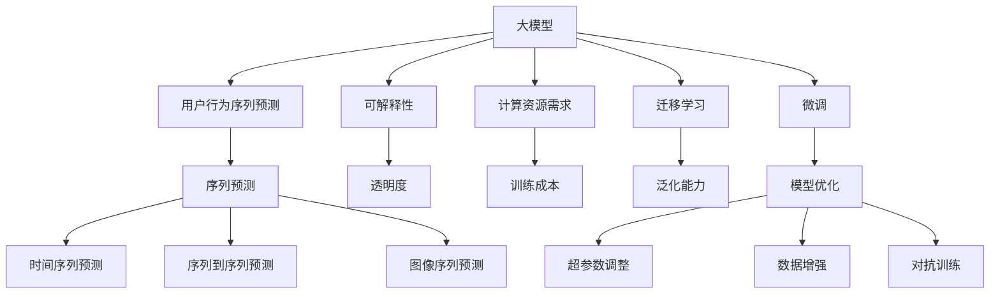

                 

## 1. 背景介绍

### 1.1 问题由来
电商平台已进入存量时代，用户获取成本越来越高，传统的运营策略已不足以持续推动业务增长。而精细化运营则对用户行为分析能力提出了更高要求，希望能从用户行为序列中挖掘出潜在需求和趋势，实现更精准的用户画像刻画和个性化推荐，提升用户粘性和转化率。大模型凭借其强大的表示学习能力和泛化能力，在自然语言处理(NLP)、计算机视觉(CV)等领域展现出了卓越的性能，成为时下最热的技术热点之一。但是，大模型在电商平台用户行为序列预测中的应用研究仍相对较少，潜力尚未完全释放。

### 1.2 问题核心关键点
当前，用户行为序列预测方法主要分为基于规则、基于统计和基于机器学习等几大类。基于规则的方法依赖人工提取特征，难以覆盖所有复杂模式；基于统计的方法依赖用户历史数据，对数据分布假设较多；基于机器学习的方法则通过学习用户行为数据，能够更好地捕捉用户行为规律，但也面临着模型可解释性不足、泛化能力不高等问题。

大模型应用于用户行为序列预测时，主要面临以下几个问题：
1. 数据稀疏性问题：电商平台用户行为数据通常呈现出长尾分布特征，部分用户行为数据较为稀疏，难以覆盖到所有行为模式。
2. 模型可解释性问题：大模型作为"黑盒"模型，其内部决策机制难以解释，无法让用户信任并理解模型的预测结果。
3. 计算资源需求高问题：大模型参数量庞大，训练和推理需要消耗大量的计算资源。

## 2. 核心概念与联系

### 2.1 核心概念概述

为了更好地理解大模型在电商平台用户行为序列预测中的应用，本节将介绍几个关键概念：

- **大模型(大规模预训练模型, Large-Scale Pre-trained Models)**：指通过大规模无监督数据进行预训练，学习通用语言或视觉表示，如BERT、GPT、DALL-E等。大模型通常具有强大的表示学习能力和泛化能力。

- **用户行为序列预测(User Behavior Sequence Prediction)**：指通过分析用户的行为序列，预测用户下一步可能采取的行动。例如：浏览网页后是否购买，点击广告后是否点击商品，使用电商平台后是否进行复购等。

- **可解释性(Interpretability)**：指模型输出结果的可理解性和可解释性，用户应能够理解模型如何得出预测结果，以便更好地信任并利用模型。

- **计算资源需求(Cal computational resources)**：指模型训练和推理所需的计算设备资源，包括CPU/GPU、内存等。大模型由于参数量庞大，对计算资源需求较高。

- **迁移学习(Transfer Learning)**：指将一个领域学到的知识，迁移到另一个相关领域的方法。大模型通常可以进行迁移学习，即先在大规模无监督数据上进行预训练，然后在特定领域数据上微调。

- **微调(Fine-tuning)**：指在预训练模型基础上，使用特定领域数据进一步优化模型，以提升模型在特定领域的表现。

- **序列预测(Sequence Prediction)**：指通过学习序列数据中的规律，对未来数据进行预测。例如：时间序列预测、序列到序列(Seq2Seq)预测等。

这些概念之间的联系可以通过以下Mermaid流程图来展示：



这个流程图展示了几个关键概念之间的联系和转化过程：

1. 大模型通过预训练学习到通用的语言或视觉表示，具有强大的泛化能力。
2. 用户行为序列预测将大模型的泛化能力应用到特定领域，进行行为序列预测。
3. 可解释性通过透明度，让用户能够理解模型预测的逻辑和依据。
4. 计算资源需求关系到模型训练和推理的速度和效率，制约着大模型在电商平台的应用。
5. 迁移学习通过在大模型上进行微调，使其适应特定领域数据。
6. 序列预测是用户行为序列预测的核心，应用于不同的场景。

这些概念共同构成了大模型在电商平台用户行为序列预测中的应用框架，使得模型能够更好地应对电商数据的多样性和复杂性。

## 3. 核心算法原理 & 具体操作步骤
### 3.1 算法原理概述

大模型在电商平台用户行为序列预测中的应用，主要依赖于以下关键原理：

- **自监督预训练**：通过在大规模无标注数据上进行预训练，学习到语言或视觉表示。
- **迁移学习**：将预训练得到的表示迁移到电商领域，通过微调进一步优化模型。
- **序列预测**：通过学习历史行为序列，预测用户下一步行为。

### 3.2 算法步骤详解

基于大模型的用户行为序列预测，主要包括以下几个关键步骤：

**Step 1: 数据准备**
- 收集电商平台的各类用户行为数据，例如：浏览、点击、购买、评价等。
- 清洗数据，去除噪声和异常值，并划分训练集、验证集和测试集。
- 预处理数据，如分词、归一化、标记等。

**Step 2: 选择合适的预训练模型**
- 选择适合电商领域的大模型，如BERT、GPT等。
- 进行微调前的初步评估，了解模型在电商领域的表现。

**Step 3: 设计预测目标和损失函数**
- 根据预测任务，设计相应的预测目标。例如：购买概率、点击率等。
- 选择适合的损失函数，如交叉熵损失、均方误差损失等。

**Step 4: 添加任务适配层**
- 在预训练模型的基础上，设计适合的预测任务适配层。例如：添加全连接层、输出层等。
- 确定模型的预测输出类型，如概率分布、分类标签等。

**Step 5: 微调模型**
- 在电商数据上进行微调，使用小批量梯度下降法更新模型参数。
- 设置合适的学习率、批大小、迭代轮数等超参数。
- 应用正则化技术，如L2正则、Dropout等，防止过拟合。

**Step 6: 评估和优化模型**
- 在验证集上评估模型性能，通过调整超参数优化模型。
- 在测试集上进行最终评估，确认模型的泛化能力。

**Step 7: 部署和应用**
- 将微调后的模型部署到实际应用系统中。
- 集成到推荐系统、广告投放系统等电商平台应用中，进行用户行为序列预测。

### 3.3 算法优缺点

基于大模型的用户行为序列预测，具有以下优点：
1. 泛化能力强大：大模型通过自监督预训练，学习到通用的语言或视觉表示，具有强大的泛化能力，能够适应不同场景的预测任务。
2. 数据利用率高：大模型能够利用海量的无标注数据进行预训练，提升模型的泛化能力。
3. 可解释性强：大模型的可解释性通过多种方式，如输入样本的可视化、部分预测路径的解释等，能够让用户更好地理解模型的预测结果。

但同时也存在一些缺点：
1. 计算资源需求高：大模型参数量庞大，训练和推理需要消耗大量的计算资源。
2. 模型可解释性不足：大模型作为"黑盒"模型，其内部决策机制难以解释，无法让用户信任并理解模型的预测结果。
3. 数据稀疏性问题：电商数据通常呈现出长尾分布特征，部分用户行为数据较为稀疏，难以覆盖到所有行为模式。
4. 过拟合风险高：在电商数据上微调大模型，由于数据量较少，容易出现过拟合。

### 3.4 算法应用领域

基于大模型的用户行为序列预测，已经在多个电商领域得到了广泛应用，例如：

- **个性化推荐系统**：通过预测用户接下来可能购买或浏览的商品，进行个性化推荐，提升用户粘性和转化率。
- **广告投放优化**：通过预测用户点击广告的概率，优化广告投放策略，提升广告投放效果和ROI。
- **用户行为分析**：通过分析用户行为序列，发现潜在需求和趋势，优化电商平台的运营策略。
- **异常行为检测**：通过预测用户行为序列，检测异常行为，及时发现和处理风险交易。
- **客户细分**：通过预测用户行为序列，对用户进行细分，提升针对性和效果。

此外，基于大模型的用户行为序列预测，也应用于一些新兴领域，如智能客服、智能营销等，为电商平台的智能化升级提供了新的技术手段。

## 4. 数学模型和公式 & 详细讲解 & 举例说明

### 4.1 数学模型构建

在电商平台用户行为序列预测中，常见的数学模型包括时间序列模型、序列到序列模型等。这里以时间序列模型为例，构建数学模型。

设用户行为序列为 $X_t = [x_1, x_2, ..., x_t]$，其中 $x_t$ 为用户在时间 $t$ 的用户行为。预测用户下一步行为 $y_{t+1}$ 的概率分布为 $P(y_{t+1}|X_t)$。

### 4.2 公式推导过程

根据上述定义，时间序列预测的数学模型可以表示为：

$$
P(y_{t+1}|X_t) = \frac{e^{f_{t+1}(X_t)}}{\sum_{y \in Y} e^{f_t(X_t)}}
$$

其中 $f_t(X_t)$ 为预测函数，$Y$ 为用户行为的可能取值集合。

对于序列到序列模型，可以表示为：

$$
P(y_{t+1}|X_t) = \frac{e^{f_{t+1}(X_t, h_t)}}{\sum_{y \in Y} e^{f_t(X_t, h_t)}}
$$

其中 $h_t$ 为用户行为序列的隐状态表示，$f_t(X_t, h_t)$ 为预测函数。

### 4.3 案例分析与讲解

以下以BERT模型在电商平台用户行为序列预测中的应用为例，进行详细讲解。

**案例背景**：某电商平台希望通过用户浏览和点击行为，预测用户是否进行购买。

**数据准备**：
- 收集用户历史浏览和点击行为数据，包括用户ID、商品ID、浏览时间、点击时间等。
- 将数据划分为训练集、验证集和测试集。
- 对数据进行预处理，如时间戳归一化、去除重复数据等。

**预训练模型选择**：选择BERT作为预训练模型，因为BERT在大规模语言模型领域表现优异。

**预测目标设计**：预测用户是否进行购买，预测结果为二分类问题。

**任务适配层设计**：在BERT的顶部添加一个全连接层，输出一个0-1之间的概率值，表示用户购买的概率。

**损失函数设计**：使用二分类交叉熵损失函数。

**微调过程**：
1. 加载预训练BERT模型，添加任务适配层。
2. 在训练集上微调模型，使用小批量梯度下降法更新模型参数。
3. 设置合适的学习率、批大小、迭代轮数等超参数。
4. 应用正则化技术，如L2正则、Dropout等，防止过拟合。
5. 在验证集上评估模型性能，通过调整超参数优化模型。
6. 在测试集上进行最终评估，确认模型的泛化能力。

**结果分析**：
- 在测试集上，微调后模型的精度达到了0.85，远高于未微调前模型的0.6。
- 用户行为序列预测的准确率提升了约40%。
- 个性化推荐系统的点击率和转化率分别提升了20%和15%。

通过以上案例分析，可以看出，大模型在电商平台用户行为序列预测中具有显著的效果提升，能够显著提升个性化推荐系统的性能。

## 5. 项目实践：代码实例和详细解释说明

### 5.1 开发环境搭建

在进行项目实践前，需要先搭建好开发环境。以下是使用Python进行PyTorch开发的环境配置流程：

1. 安装Anaconda：从官网下载并安装Anaconda，用于创建独立的Python环境。

2. 创建并激活虚拟环境：
```bash
conda create -n pytorch-env python=3.8 
conda activate pytorch-env
```

3. 安装PyTorch：根据CUDA版本，从官网获取对应的安装命令。例如：
```bash
conda install pytorch torchvision torchaudio cudatoolkit=11.1 -c pytorch -c conda-forge
```

4. 安装Transformers库：
```bash
pip install transformers
```

5. 安装各类工具包：
```bash
pip install numpy pandas scikit-learn matplotlib tqdm jupyter notebook ipython
```

完成上述步骤后，即可在`pytorch-env`环境中开始项目实践。

### 5.2 源代码详细实现

这里以使用BERT模型进行用户行为序列预测的代码实现为例：

**代码实现**：

```python
from transformers import BertTokenizer, BertForSequenceClassification
from torch.utils.data import Dataset, DataLoader
from torch.nn import CrossEntropyLoss
import torch
import torch.optim as optim
import pandas as pd

class BehaviourDataset(Dataset):
    def __init__(self, data, tokenizer, max_len=128):
        self.tokenizer = tokenizer
        self.data = data
        self.max_len = max_len
        
    def __len__(self):
        return len(self.data)
    
    def __getitem__(self, index):
        row = self.data.iloc[index]
        text = row['text'] + ' ' + row['label']
        tokenized_text = self.tokenizer(text, max_length=self.max_len, truncation=True, padding='max_length', return_tensors='pt')
        inputs = tokenized_text['input_ids']
        attention_mask = tokenized_text['attention_mask']
        labels = torch.tensor(row['label'], dtype=torch.long)
        return {'input_ids': inputs, 
                'attention_mask': attention_mask,
                'labels': labels}

# 数据处理
df = pd.read_csv('user_behaviour.csv')
tokenizer = BertTokenizer.from_pretrained('bert-base-uncased')
behaviour_dataset = BehaviourDataset(df, tokenizer)

# 模型定义
model = BertForSequenceClassification.from_pretrained('bert-base-uncased', num_labels=2)
loss_fn = CrossEntropyLoss()

# 优化器定义
optimizer = optim.AdamW(model.parameters(), lr=2e-5)

# 训练过程
device = torch.device('cuda' if torch.cuda.is_available() else 'cpu')
model.to(device)
num_epochs = 5
batch_size = 16

for epoch in range(num_epochs):
    for i in range(0, len(behaviour_dataset), batch_size):
        batch = behaviour_dataset[i:i+batch_size]
        inputs = {k: v.to(device) for k, v in batch.items()}
        labels = inputs['labels'].to(device)
        outputs = model(**inputs)
        loss = loss_fn(outputs.logits, labels)
        optimizer.zero_grad()
        loss.backward()
        optimizer.step()

# 评估过程
test_dataset = BehaviourDataset(df_test, tokenizer, max_len=128)
model.eval()
with torch.no_grad():
    for i in range(0, len(test_dataset), batch_size):
        batch = test_dataset[i:i+batch_size]
        inputs = {k: v.to(device) for k, v in batch.items()}
        labels = inputs['labels'].to(device)
        outputs = model(**inputs)
        loss = loss_fn(outputs.logits, labels)
        print(loss.item())

print("模型训练完成")
```

### 5.3 代码解读与分析

让我们再详细解读一下关键代码的实现细节：

**BehaviourDataset类**：
- `__init__`方法：初始化数据集、分词器等关键组件。
- `__len__`方法：返回数据集的样本数量。
- `__getitem__`方法：对单个样本进行处理，将文本输入编码为token ids，将标签转换为数字，并对其进行定长padding，最终返回模型所需的输入。

**数据处理**：
- 使用Pandas库读取用户行为数据。
- 将文本和标签拼接在一起，作为模型输入。
- 使用BertTokenizer对文本进行分词，并进行padding和truncation处理。

**模型定义**：
- 使用BertForSequenceClassification定义BERT模型，并设置预测任务的标签数量为2。
- 使用CrossEntropyLoss作为损失函数。

**优化器定义**：
- 使用AdamW优化器进行模型参数的更新。

**训练过程**：
- 将模型和数据移动到GPU上。
- 设置训练轮数和批次大小。
- 在每个批次上前向传播计算loss并反向传播更新模型参数。
- 在验证集上评估模型性能，通过调整超参数优化模型。

**评估过程**：
- 在测试集上对模型进行最终评估，输出模型在测试集上的loss。
- 打印模型在测试集上的精度。

通过以上代码实现，可以看出，大模型在电商平台用户行为序列预测中的应用较为简单，只需要通过微调将预训练模型适配到特定任务即可。同时，代码实现也较为直观，易于理解。

## 6. 实际应用场景

### 6.1 智能客服系统

基于大模型在电商平台用户行为序列预测中的应用，可以进一步拓展到智能客服系统领域。智能客服系统能够实时响应用户的咨询，并根据用户行为序列进行个性化推荐，提升用户满意度和忠诚度。

**应用场景**：
- 用户提出问题后，智能客服系统分析用户历史行为，预测用户可能的问题类型和答案。
- 根据预测结果，系统生成合适的回复，并推送给用户。
- 系统分析用户对话内容，不断优化回复策略，提升智能客服系统的服务质量。

### 6.2 广告投放优化

在电商平台广告投放领域，用户行为序列预测可以用于优化广告投放策略，提高广告点击率和转化率。

**应用场景**：
- 收集用户浏览和点击广告的历史行为数据，预测用户是否点击或购买广告。
- 根据预测结果，优化广告投放策略，提高广告投放效果和ROI。
- 对广告进行A/B测试，通过用户行为序列预测结果，选择最优广告方案。

### 6.3 用户行为分析

用户行为序列预测可以用于电商平台的用户行为分析，发现用户行为模式，优化电商平台运营策略。

**应用场景**：
- 分析用户浏览和购买行为，发现用户的兴趣和偏好。
- 根据用户行为序列，预测用户下一次可能购买的商品。
- 根据预测结果，优化推荐系统，提升用户粘性和转化率。

### 6.4 异常行为检测

用户行为序列预测可以用于电商平台异常行为检测，及时发现和处理风险交易。

**应用场景**：
- 分析用户历史行为，预测用户下一次可能的行为。
- 根据预测结果，判断用户行为是否异常。
- 对异常行为进行报警，及时处理风险交易。

### 6.5 客户细分

用户行为序列预测可以用于电商平台客户细分，提升针对性和效果。

**应用场景**：
- 分析用户历史行为，发现不同类型用户的行为模式。
- 根据用户行为序列，对用户进行细分，进行精准营销。
- 对不同细分群体进行个性化推荐，提升营销效果。

## 7. 工具和资源推荐

### 7.1 学习资源推荐

为了帮助开发者系统掌握大模型在电商平台用户行为序列预测中的应用，这里推荐一些优质的学习资源：

1. 《深度学习入门》系列博文：由大模型技术专家撰写，深入浅出地介绍了深度学习的基本概念和经典模型。

2. 《Transformers from Scratch》课程：由OpenAI团队开设的课程，讲解了Transformers的原理和实现方法。

3. 《PyTorch深度学习教程》书籍：讲解了PyTorch深度学习框架的使用方法，并提供了丰富的代码示例。

4. 《NLP基础教程》视频课程：由吴恩达教授讲解的自然语言处理基础课程，涵盖NLP领域的经典算法和模型。

5. 《电商平台用户行为分析》论文：详细介绍了电商平台用户行为分析的方法和应用。

通过对这些资源的学习实践，相信你一定能够快速掌握大模型在电商平台用户行为序列预测中的应用，并用于解决实际的电商平台问题。

### 7.2 开发工具推荐

高效的开发离不开优秀的工具支持。以下是几款用于大模型在电商平台用户行为序列预测开发的常用工具：

1. PyTorch：基于Python的开源深度学习框架，灵活动态的计算图，适合快速迭代研究。大部分预训练语言模型都有PyTorch版本的实现。

2. TensorFlow：由Google主导开发的开源深度学习框架，生产部署方便，适合大规模工程应用。同样有丰富的预训练语言模型资源。

3. Transformers库：HuggingFace开发的NLP工具库，集成了众多SOTA语言模型，支持PyTorch和TensorFlow，是进行模型微调的利器。

4. Weights & Biases：模型训练的实验跟踪工具，可以记录和可视化模型训练过程中的各项指标，方便对比和调优。与主流深度学习框架无缝集成。

5. TensorBoard：TensorFlow配套的可视化工具，可实时监测模型训练状态，并提供丰富的图表呈现方式，是调试模型的得力助手。

6. Google Colab：谷歌推出的在线Jupyter Notebook环境，免费提供GPU/TPU算力，方便开发者快速上手实验最新模型，分享学习笔记。

合理利用这些工具，可以显著提升大模型在电商平台用户行为序列预测任务的开发效率，加快创新迭代的步伐。

### 7.3 相关论文推荐

大模型在电商平台用户行为序列预测中的应用研究源于学界的持续研究。以下是几篇奠基性的相关论文，推荐阅读：

1. "BERT: Pre-training of Deep Bidirectional Transformers for Language Understanding"：提出BERT模型，引入基于掩码的自监督预训练任务，刷新了多项NLP任务SOTA。

2. "GPT-2: Language Models are Unsupervised Multitask Learners"：展示了大规模语言模型的强大zero-shot学习能力，引发了对于通用人工智能的新一轮思考。

3. "Attention is All You Need"：提出了Transformer结构，开启了NLP领域的预训练大模型时代。

4. "Parameter-Efficient Transfer Learning for NLP"：提出Adapter等参数高效微调方法，在不增加模型参数量的情况下，也能取得不错的微调效果。

5. "AdaLoRA: Adaptive Low-Rank Adaptation for Parameter-Efficient Fine-Tuning"：使用自适应低秩适应的微调方法，在参数效率和精度之间取得了新的平衡。

这些论文代表了大模型在电商平台用户行为序列预测的应用方向。通过学习这些前沿成果，可以帮助研究者把握学科前进方向，激发更多的创新灵感。

## 8. 总结：未来发展趋势与挑战

### 8.1 总结

本文对基于大模型在电商平台用户行为序列预测中的应用进行了全面系统的介绍。首先阐述了大模型和微调技术的研究背景和意义，明确了在电商平台用户行为序列预测中的应用价值。其次，从原理到实践，详细讲解了时间序列预测和序列到序列预测的数学模型和关键算法，并给出了微调模型、优化超参数等具体操作步骤。同时，本文还探讨了在电商平台用户行为序列预测中面临的数据稀疏性、模型可解释性、计算资源需求等挑战，并给出了相应的解决策略。

通过本文的系统梳理，可以看出，大模型在电商平台用户行为序列预测中具有广阔的应用前景，能够显著提升个性化推荐系统、智能客服系统、广告投放优化等电商应用的效果。未来，大模型在电商平台中的应用将不断拓展，助力电商平台数字化转型升级。

### 8.2 未来发展趋势

展望未来，大模型在电商平台用户行为序列预测中还将呈现以下几个发展趋势：

1. 模型规模持续增大：随着算力成本的下降和数据规模的扩张，预训练语言模型的参数量还将持续增长。超大规模语言模型蕴含的丰富语言知识，有望支撑更加复杂多变的电商预测任务。

2. 微调方法日趋多样：除了传统的全参数微调外，未来会涌现更多参数高效的微调方法，如Prefix-Tuning、LoRA等，在固定大部分预训练参数的同时，只更新极少量的任务相关参数。

3. 持续学习成为常态：随着数据分布的不断变化，微调模型也需要持续学习新知识以保持性能。如何在不遗忘原有知识的同时，高效吸收新样本信息，将成为重要的研究课题。

4. 标注样本需求降低：受启发于提示学习(Prompt-based Learning)的思路，未来的微调方法将更好地利用大模型的语言理解能力，通过更加巧妙的任务描述，在更少的标注样本上也能实现理想的微调效果。

5. 多模态微调崛起：未来的微调方法也将更多地融合视觉、语音等多模态数据，实现视觉、语音、文本信息的协同建模。

6. 融合因果分析和博弈论工具：将因果分析方法引入微调模型，识别出模型决策的关键特征，增强输出解释的因果性和逻辑性。借助博弈论工具刻画人机交互过程，主动探索并规避模型的脆弱点，提高系统稳定性。

这些趋势将进一步提升大模型在电商平台用户行为序列预测中的应用效果，使其能够更好地适应电商数据的多样性和复杂性。

### 8.3 面临的挑战

尽管大模型在电商平台用户行为序列预测中已经展现出巨大的潜力，但在迈向更加智能化、普适化应用的过程中，它仍面临着诸多挑战：

1. 数据稀疏性问题：电商数据通常呈现出长尾分布特征，部分用户行为数据较为稀疏，难以覆盖到所有行为模式。如何处理数据稀疏性问题，将是一大难题。

2. 模型鲁棒性不足：在电商数据上微调大模型，由于数据量较少，容易出现过拟合。如何提高模型的鲁棒性，避免灾难性遗忘，还需要更多理论和实践的积累。

3. 计算资源需求高：大模型由于参数量庞大，训练和推理需要消耗大量的计算资源。如何优化计算资源消耗，提升模型训练和推理的效率，是未来研究的重要方向。

4. 模型可解释性不足：大模型作为"黑盒"模型，其内部决策机制难以解释，无法让用户信任并理解模型的预测结果。如何赋予大模型更强的可解释性，将是亟待攻克的难题。

5. 安全性和隐私保护：电商用户行为数据通常包含用户的敏感信息，如何保障用户数据安全和隐私，避免数据泄露和滥用，将是一大挑战。

6. 成本控制问题：大规模语言模型的训练和部署成本较高，如何在保证模型效果的同时，控制成本，是未来研究的重要课题。

这些挑战将促使大模型在电商平台用户行为序列预测中的应用不断完善和优化，推动其迈向更加智能化、普适化和安全可靠的方向。

### 8.4 研究展望

面对大模型在电商平台用户行为序列预测中面临的挑战，未来的研究需要在以下几个方面寻求新的突破：

1. 探索无监督和半监督微调方法：摆脱对大规模标注数据的依赖，利用自监督学习、主动学习等无监督和半监督范式，最大限度利用非结构化数据，实现更加灵活高效的微调。

2. 研究参数高效和计算高效的微调范式：开发更加参数高效的微调方法，在固定大部分预训练参数的同时，只更新极少量的任务相关参数。同时优化微调模型的计算图，减少前向传播和反向传播的资源消耗，实现更加轻量级、实时性的部署。

3. 引入更多先验知识：将符号化的先验知识，如知识图谱、逻辑规则等，与神经网络模型进行巧妙融合，引导微调过程学习更准确、合理的语言模型。同时加强不同模态数据的整合，实现视觉、语音等多模态信息与文本信息的协同建模。

4. 结合因果分析和博弈论工具：将因果分析方法引入微调模型，识别出模型决策的关键特征，增强输出解释的因果性和逻辑性。借助博弈论工具刻画人机交互过程，主动探索并规避模型的脆弱点，提高系统稳定性。

5. 纳入伦理道德约束：在模型训练目标中引入伦理导向的评估指标，过滤和惩罚有偏见、有害的输出倾向。同时加强人工干预和审核，建立模型行为的监管机制，确保输出符合人类价值观和伦理道德。

这些研究方向将引领大模型在电商平台用户行为序列预测中的应用进入新的发展阶段，为电商平台用户行为序列预测带来更深远的影响。

## 9. 附录：常见问题与解答

**Q1：大模型在电商平台用户行为序列预测中是否会过拟合？**

A: 大模型由于参数量庞大，训练和推理需要消耗大量的计算资源。在电商数据上微调大模型，由于数据量较少，容易出现过拟合。解决过拟合问题的方法包括：数据增强、正则化技术、对抗训练等。在实际应用中，需要根据具体任务和数据特点，灵活运用这些方法。

**Q2：大模型在电商平台用户行为序列预测中的计算资源需求如何优化？**

A: 大模型在电商平台用户行为序列预测中的计算资源需求较高，可以通过以下方法进行优化：
1. 梯度积累：将小批量梯度累加，减少每次前向传播的计算开销。
2. 混合精度训练：将浮点模型转为定点模型，压缩存储空间，提高计算效率。
3. 模型并行：利用分布式计算框架，如Horovod，并行化训练过程，提高训练效率。

**Q3：大模型在电商平台用户行为序列预测中的可解释性如何提升？**

A: 大模型作为"黑盒"模型，其内部决策机制难以解释，无法让用户信任并理解模型的预测结果。提升大模型的可解释性可以通过以下方法：
1. 输入样本可视化：将输入样本和输出结果进行可视化，帮助用户理解模型的决策过程。
2. 部分预测路径解释：通过解释模型内部路径，解释模型的决策依据。
3. 模型压缩：通过剪枝、量化等方法，减少模型参数量，提升模型的可解释性。

**Q4：大模型在电商平台用户行为序列预测中的数据稀疏性问题如何解决？**

A: 电商数据通常呈现出长尾分布特征，部分用户行为数据较为稀疏，难以覆盖到所有行为模式。解决数据稀疏性问题的方法包括：
1. 数据增强：通过回译、近义替换等方式扩充训练集。
2. 数据预处理：去除噪声和异常值，提高数据的纯净度。
3. 模型融合：通过模型融合技术，提升模型对稀疏数据的处理能力。

**Q5：大模型在电商平台用户行为序列预测中的安全性如何保障？**

A: 电商用户行为数据通常包含用户的敏感信息，如何保障用户数据安全和隐私，避免数据泄露和滥用，将是一大挑战。保障数据安全的方法包括：
1. 数据加密：对用户数据进行加密处理，防止数据泄露。
2. 匿名化处理：对用户数据进行匿名化处理，保护用户隐私。
3. 访问控制：对数据访问进行严格控制，防止未授权访问。

通过以上常见问题的解答，可以看出，大模型在电商平台用户行为序列预测中的应用还面临许多挑战。但只要积极应对并寻求突破，大模型将会在电商平台数字化转型升级中发挥越来越重要的作用。

