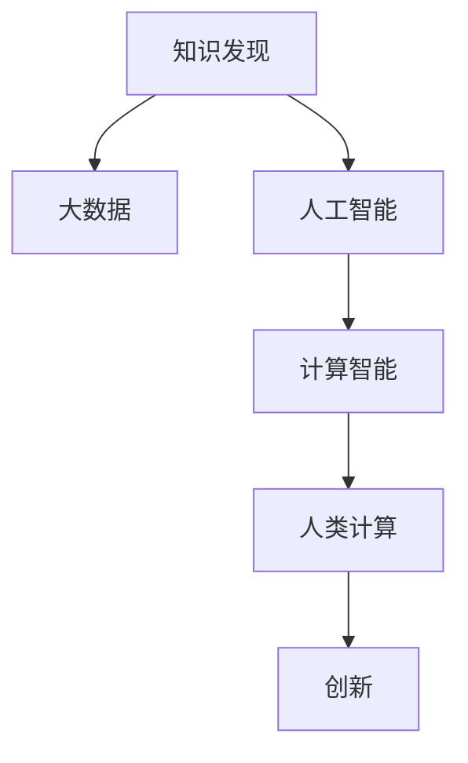
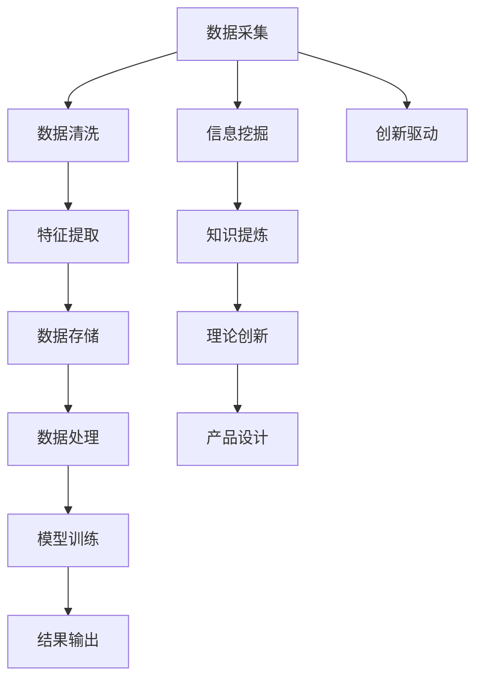

                 

# 推动知识发现与创新：人类计算的智力贡献

> 关键词：
- 知识发现
- 创新
- 人类计算
- 人工智能
- 大数据
- 机器学习
- 计算智能

## 1. 背景介绍

### 1.1 问题由来
在信息爆炸的时代，人类积累的知识和数据呈指数级增长，从海量文献、数据库到社交媒体、物联网数据，信息来源和种类日益丰富。面对如此庞大的数据资源，传统的人力劳动已无法有效处理。同时，现代信息技术在各个领域的应用也迫切需要高效的知识提取、分析与创新能力。这便催生了知识发现与创新的需求，即利用先进计算技术从数据中挖掘知识、提炼规律，推动新思想、新方法的产生，从而支撑经济社会的可持续发展。

### 1.2 问题核心关键点
当前，知识发现与创新已日益成为推动科技进步、经济发展的关键驱动力。随着人工智能（AI）和大数据技术的迅速发展，智能系统已经开始在各个领域崭露头角。然而，尽管已有许多先进算法和框架，但由于算法复杂度、数据规模等因素的限制，传统方法往往难以满足高效、准确的计算需求。

因此，如何高效地利用计算技术提取和发现知识、创新和优化算法，成为科研人员、工程师、数据科学家面临的共同挑战。在这一背景下，"人类计算"这一概念应运而生，它将人机协同计算的智慧与现代计算技术结合，利用人类独有的逻辑推理、创新思维和经验直觉，推动数据驱动的科学决策和智能创新。

## 2. 核心概念与联系

### 2.1 核心概念概述

为更好地理解人类计算在知识发现与创新中的作用，本节将介绍几个关键概念：

- **知识发现**：从海量数据中自动或半自动地发现、提炼有用信息和知识，如关联规则、模式、趋势等。
- **创新**：基于已有知识和信息，通过逻辑推理、联想和迭代，提出新观点、新方法和新产品。
- **人类计算**：结合人类智慧与现代计算技术，高效解决复杂问题，进行知识发现和创新。
- **人工智能**：通过机器学习、深度学习等技术，使计算机系统具备一定的人类智能水平，如自主学习、推理、判断等。
- **大数据**：指规模庞大、类型多样、结构复杂的数据集合，是知识发现与创新的数据基础。
- **机器学习**：通过算法使计算机从数据中学习规律，提高问题解决和预测的准确性。
- **计算智能**：融合人工智能和大数据技术，实现高效的信息处理、分析和智能决策。

这些概念之间的联系和作用机制可通过以下Mermaid流程图展示：



该流程图表明：
- **大数据**是知识发现和创新的基础。
- **人工智能**和大数据技术支撑知识发现和创新。
- **计算智能**融合了人工智能和大数据，推动高效的知识发现和创新。
- **人类计算**结合了人类智慧与现代计算智能，进一步提升了知识发现和创新的效果。

### 2.2 核心概念原理和架构的 Mermaid 流程图



该流程图展示了从数据采集到知识提炼、理论创新和产品设计的全过程：

- **数据采集**：从不同来源收集数据，包括结构化和非结构化数据。
- **数据清洗**：去除噪声和异常值，确保数据质量。
- **特征提取**：从原始数据中提取有用的特征，为后续分析奠定基础。
- **数据存储**：将清洗后的数据存储在数据库中，方便后续查询和分析。
- **数据处理**：利用计算技术进行数据挖掘和处理，提取有用信息。
- **模型训练**：基于提取的信息和数据，训练机器学习模型。
- **结果输出**：通过机器学习模型进行预测、分类等处理，输出最终结果。
- **信息挖掘**：从大数据中挖掘出深层次的信息和知识。
- **知识提炼**：从挖掘出的信息中提炼出理论和技术。
- **理论创新**：基于提炼的知识，进行新理论、新方法的创新。
- **产品设计**：将创新理论应用于实际产品设计中。
- **创新驱动**：通过持续创新，推动技术进步和应用发展。

## 3. 核心算法原理 & 具体操作步骤
### 3.1 算法原理概述

基于人类计算的知识发现与创新算法，通常遵循以下基本原理：

1. **数据驱动**：从大规模数据中提取信息，发现规律。
2. **算法迭代**：利用机器学习算法，不断优化和迭代。
3. **人机协同**：结合人类智慧与机器能力，进行智能决策和创新。
4. **结果验证**：通过人工验证和反馈，不断优化算法和模型。

以知识发现为例，其核心算法包括：

- **聚类算法**：如K-means、层次聚类等，将相似数据分组，发现潜在规律。
- **关联规则学习**：如Apriori、FP-growth等，从数据中挖掘出相关性。
- **分类算法**：如SVM、随机森林等，对数据进行分类和预测。
- **网络分析**：如PageRank、社交网络分析等，揭示数据间的复杂关系。

### 3.2 算法步骤详解

以知识发现为例，基于人类计算的知识发现与创新一般包括以下几个关键步骤：

**Step 1: 数据收集与预处理**
- 收集不同来源的数据，包括结构化和非结构化数据。
- 对数据进行清洗和预处理，如去噪、归一化等。
- 提取关键特征，如文本关键词、时间戳、地理位置等。

**Step 2: 特征选择与编码**
- 选择对知识发现有帮助的关键特征。
- 将特征进行编码和表示，如转换为向量或数字。

**Step 3: 数据建模**
- 选择合适的算法进行建模，如聚类、关联规则、分类等。
- 训练模型，并利用交叉验证等技术进行调参。

**Step 4: 结果验证与反馈**
- 对模型结果进行人工验证和评估，如精度、召回率等指标。
- 根据验证结果调整模型参数和算法，进行迭代优化。

**Step 5: 知识提炼与创新**
- 从模型结果中提炼出知识、规律和理论。
- 结合人类经验与直觉，进行创新和新方法设计。
- 将创新结果应用于实际问题中，进行产品设计和优化。

### 3.3 算法优缺点

基于人类计算的知识发现与创新算法具有以下优点：

1. **高效性**：利用现代计算技术，高效处理大规模数据。
2. **准确性**：结合机器学习算法，提高发现和分析的准确性。
3. **人机协同**：融合人类智慧和机器能力，提升决策和创新水平。
4. **可解释性**：利用人类逻辑推理和经验，增加结果的可解释性。

然而，该方法也存在一些局限性：

1. **数据依赖**：对数据质量、完整性和多样性有较高要求。
2. **算法复杂**：算法复杂度高，对计算资源和专业知识要求较高。
3. **创新难度**：需要结合人类直觉和经验，可能面临思维瓶颈。
4. **可扩展性**：难以应对实时、动态变化的数据和场景。
5. **结果泛化**：模型结果可能存在过拟合或泛化不足的问题。

尽管存在这些局限性，但人类计算在知识发现与创新中的应用已经展现出巨大的潜力，成为当前智能技术研究的重要方向。

### 3.4 算法应用领域

基于人类计算的知识发现与创新算法，已经在多个领域得到了广泛应用，例如：

- **金融风控**：利用机器学习算法进行风险预测和欺诈检测，结合人类经验进行创新模型设计。
- **医疗健康**：利用大数据分析疾病趋势和基因关联，结合医学知识进行创新药物研发和疾病治疗。
- **制造业**：利用工业大数据分析生产流程和设备状态，结合人类经验进行智能优化和故障预测。
- **市场营销**：利用用户行为数据进行市场分析和预测，结合人类直觉进行创新营销策略设计。
- **城市规划**：利用城市数据进行交通、能源、环境等多领域的优化，结合城市规划经验进行创新设计。
- **环境保护**：利用环境数据进行污染源监测和生态分析，结合环保知识进行创新治理方案设计。
- **农业生产**：利用农业大数据分析气候变化和作物生长规律，结合农业经验进行创新种植和管理。

以上领域展示了基于人类计算的知识发现与创新算法的广泛应用前景，未来还将进一步拓展到更多新兴行业和垂直领域。

## 4. 数学模型和公式 & 详细讲解  
### 4.1 数学模型构建

在知识发现与创新中，常用的数学模型包括统计学模型、概率模型和图模型等。

以机器学习模型为例，常用的统计学习模型包括线性回归、逻辑回归、决策树等。其数学模型构建如下：

- **线性回归**：
  $$
  y = w_0 + w_1x_1 + w_2x_2 + \cdots + w_nx_n
  $$
  其中 $w_0, w_1, \cdots, w_n$ 为模型参数，$x_1, x_2, \cdots, x_n$ 为输入特征，$y$ 为输出目标。

- **逻辑回归**：
  $$
  P(y|x) = \frac{e^{w_0 + w_1x_1 + w_2x_2 + \cdots + w_nx_n}}{1 + e^{w_0 + w_1x_1 + w_2x_2 + \cdots + w_nx_n}}
  $$
  其中 $P(y|x)$ 表示在给定输入 $x$ 下，$y$ 的条件概率。

- **决策树**：
  $$
  \text{Decision Tree} = T_1 \rightarrow T_2 \rightarrow \cdots \rightarrow T_k
  $$
  其中 $T_1, T_2, \cdots, T_k$ 为决策树节点，每个节点表示一个分类规则或条件判断。

### 4.2 公式推导过程

以线性回归模型为例，其目标是通过最小化预测值与真实值之间的误差，求解模型参数 $w$。设训练样本集为 $D=\{(x_i, y_i)\}_{i=1}^N$，则线性回归模型的损失函数为：
$$
L(w) = \frac{1}{2N}\sum_{i=1}^N (y_i - w_0 - \sum_{j=1}^n w_jx_{ij})^2
$$

其中 $y_i$ 为第 $i$ 个样本的真实值，$x_{ij}$ 为第 $i$ 个样本的第 $j$ 个特征值。

通过对损失函数求偏导，得：
$$
\frac{\partial L(w)}{\partial w_0} = -\frac{1}{N}\sum_{i=1}^N (y_i - w_0 - \sum_{j=1}^n w_jx_{ij})
$$
$$
\frac{\partial L(w)}{\partial w_j} = -\frac{1}{N}\sum_{i=1}^N x_{ij}(y_i - w_0 - \sum_{k=1}^n w_kx_{ik})
$$

利用梯度下降等优化算法，即可求解模型参数 $w$。

### 4.3 案例分析与讲解

以金融风控为例，假设有一批客户的信用数据，包括年龄、收入、资产等特征。利用线性回归模型进行客户信用风险预测，步骤如下：

1. 收集客户数据，并进行清洗和预处理。
2. 选择关键特征，如年龄、收入、资产等。
3. 构建线性回归模型，求解模型参数。
4. 对新客户进行信用风险预测，判断其信用等级。
5. 结合金融专家经验，进行模型优化和创新设计。

在实际应用中，还可以结合聚类算法、关联规则学习等方法，进行更深入的分析和预测。例如，利用聚类算法对客户进行分组，发现不同群体的风险特征；利用关联规则学习，挖掘出特征间的潜在关联关系。这些技术结合人类经验，能够进一步提升风险预测的准确性和鲁棒性。

## 5. 项目实践：代码实例和详细解释说明
### 5.1 开发环境搭建

在进行知识发现与创新实践前，我们需要准备好开发环境。以下是使用Python进行Scikit-learn和TensorFlow开发的环境配置流程：

1. 安装Anaconda：从官网下载并安装Anaconda，用于创建独立的Python环境。

2. 创建并激活虚拟环境：
```bash
conda create -n myenv python=3.8 
conda activate myenv
```

3. 安装Scikit-learn和TensorFlow：
```bash
pip install scikit-learn
pip install tensorflow
```

4. 安装各类工具包：
```bash
pip install numpy pandas matplotlib seaborn scikit-learn joblib
```

完成上述步骤后，即可在`myenv`环境中开始知识发现与创新实践。

### 5.2 源代码详细实现

下面我们以金融风控项目为例，给出使用Scikit-learn对线性回归模型进行知识发现与创新的Python代码实现。

首先，定义数据处理函数：

```python
import pandas as pd
from sklearn.model_selection import train_test_split
from sklearn.preprocessing import StandardScaler
from sklearn.linear_model import LinearRegression

def load_data(path):
    df = pd.read_csv(path)
    X = df.drop('y', axis=1)
    y = df['y']
    return X, y

def train_model(X, y, test_size=0.2, random_state=42):
    X_train, X_test, y_train, y_test = train_test_split(X, y, test_size=test_size, random_state=random_state)
    scaler = StandardScaler()
    X_train = scaler.fit_transform(X_train)
    X_test = scaler.transform(X_test)
    model = LinearRegression()
    model.fit(X_train, y_train)
    return model, X_test, y_test
```

然后，定义模型评估函数：

```python
def evaluate_model(model, X_test, y_test):
    y_pred = model.predict(X_test)
    print('Mean Absolute Error:', metrics.mean_absolute_error(y_test, y_pred))
    print('Mean Squared Error:', metrics.mean_squared_error(y_test, y_pred))
    print('R-squared:', metrics.r2_score(y_test, y_pred))
```

最后，启动模型训练和评估流程：

```python
path = 'data.csv'
X, y = load_data(path)
model, X_test, y_test = train_model(X, y)
evaluate_model(model, X_test, y_test)
```

以上就是使用Scikit-learn对线性回归模型进行金融风控知识发现的完整代码实现。可以看到，得益于Scikit-learn的强大封装，我们可以用相对简洁的代码完成线性回归模型的训练和评估。

### 5.3 代码解读与分析

让我们再详细解读一下关键代码的实现细节：

**load_data函数**：
- 读取CSV格式的数据文件，并分离特征和标签。
- 对特征进行标准化处理，确保数据的一致性。

**train_model函数**：
- 将数据集划分为训练集和测试集。
- 对训练集进行标准化处理。
- 训练线性回归模型。
- 返回模型和测试集。

**evaluate_model函数**：
- 使用测试集对模型进行评估，计算MAE、MSE、R-squared等指标。
- 打印评估结果。

**训练流程**：
- 定义数据路径，加载数据。
- 训练线性回归模型，并返回模型和测试集。
- 使用测试集评估模型性能。

可以看到，Scikit-learn提供了丰富的模型和工具，使得知识发现与创新的代码实现变得简洁高效。开发者可以将更多精力放在数据处理、模型选择和优化上，而不必过多关注底层的实现细节。

当然，工业级的系统实现还需考虑更多因素，如模型裁剪、量化加速、服务化封装等。但核心的知识发现与创新范式基本与此类似。

## 6. 实际应用场景
### 6.1 智能客服系统

基于知识发现与创新的智能客服系统，能够通过分析历史客户对话，发现常见问题和解决方案，提炼出自动回复的模板。具体流程如下：

1. 收集客户历史对话数据。
2. 对对话进行自然语言处理和特征提取，如情感分析、意图识别等。
3. 利用机器学习算法进行模型训练，发现问题-答案的关联关系。
4. 结合人类客服经验，进行模型优化和创新。
5. 部署模型到智能客服系统中，自动回复客户咨询。
6. 定期更新模型，根据新对话数据进行知识发现与创新。

### 6.2 医疗健康

利用知识发现与创新，医疗健康领域可以从大量患者数据中发现疾病规律、基因关联和药物效果，提炼出新的诊疗方案和药物研发思路。具体流程如下：

1. 收集患者电子病历数据和基因信息。
2. 对数据进行清洗和预处理，如去除噪声、标准化格式等。
3. 利用机器学习算法进行疾病预测、基因关联分析和药物效果评估。
4. 结合医疗专家经验，进行模型优化和创新设计。
5. 部署模型到医疗健康系统中，辅助医生诊疗和药物研发。
6. 定期更新模型，根据新数据进行知识发现与创新。

### 6.3 智能交通

智能交通系统通过分析交通数据，发现交通流量规律和异常事件，提炼出交通优化方案。具体流程如下：

1. 收集交通流量、天气、事件等数据。
2. 对数据进行清洗和预处理，如去噪、归一化等。
3. 利用机器学习算法进行交通流量预测和异常事件检测。
4. 结合交通规划经验，进行模型优化和创新设计。
5. 部署模型到智能交通系统中，优化交通信号和路线。
6. 定期更新模型，根据新数据进行知识发现与创新。

### 6.4 未来应用展望

随着知识发现与创新技术的发展，未来将在更多领域得到应用，为各行各业带来变革性影响。

在智慧城市领域，利用大数据和人工智能技术，可以从城市运行数据中发现城市运行规律和问题，提炼出城市管理优化方案，推动智慧城市建设。

在金融领域，通过数据分析和模型创新，可以从海量金融数据中发现市场趋势和风险信号，提炼出金融产品和风险管理方案，支持金融机构决策。

在农业领域，通过数据分析和模型创新，可以从气象、土壤等数据中发现农作物的生长规律和病虫害规律，提炼出农业优化方案，提高农业生产效率和产品质量。

未来，随着计算能力的提升和大数据技术的发展，知识发现与创新将变得更加高效和深入，推动更多领域的智能化发展。

## 7. 工具和资源推荐
### 7.1 学习资源推荐

为了帮助开发者系统掌握知识发现与创新的理论基础和实践技巧，这里推荐一些优质的学习资源：

1. 《机器学习实战》系列书籍：深入浅出地介绍了机器学习算法和应用，适合入门和进阶学习。
2. 《深度学习》课程：斯坦福大学开设的深度学习课程，涵盖深度学习的基础和前沿技术。
3. 《TensorFlow教程》：Google官方提供的TensorFlow教程，详细介绍了TensorFlow的使用方法和实践技巧。
4. Kaggle竞赛平台：提供丰富的数据集和竞赛任务，实战练习知识发现与创新。
5. GitHub开源项目：搜索和参与开源项目，学习和借鉴他人实践经验。

通过对这些资源的学习实践，相信你一定能够快速掌握知识发现与创新的精髓，并用于解决实际的智能系统问题。

### 7.2 开发工具推荐

高效的开发离不开优秀的工具支持。以下是几款用于知识发现与创新开发的常用工具：

1. Python：作为数据科学和人工智能的主流语言，Python具有丰富的库和工具支持，适合高效的数据分析和模型开发。
2. Scikit-learn：基于Python的开源机器学习库，提供了丰富的算法和工具，适合知识发现和数据分析。
3. TensorFlow：由Google主导开发的深度学习框架，支持大规模分布式训练和高效推理，适合复杂模型开发。
4. PyTorch：基于Python的开源深度学习框架，灵活动态的计算图，适合快速迭代研究。
5. Jupyter Notebook：交互式的数据分析和模型开发环境，支持代码和结果的可视化展示。
6. Google Colab：谷歌提供的在线Jupyter Notebook环境，免费提供GPU和TPU算力，方便开发者快速上手实验最新模型。

合理利用这些工具，可以显著提升知识发现与创新的开发效率，加快创新迭代的步伐。

### 7.3 相关论文推荐

知识发现与创新技术的发展源于学界的持续研究。以下是几篇奠基性的相关论文，推荐阅读：

1. R. O. Duda, P. E. Hart, D. G. Stork. 《Pattern Recognition and Machine Learning》：详细介绍了机器学习算法和应用，是知识发现与创新领域的重要参考书。
2. Y. Bengio, G. Hinton, S. Kingsbury. 《Deep Learning for Self-Driving Cars》：探讨了深度学习在自动驾驶中的应用，展示了知识发现与创新的前沿进展。
3. P. S. Yu, V. S. Lee. 《Knowledge Discovery and Data Mining: Techniques and Tools》：系统介绍了知识发现与数据挖掘的技术和工具，适合全面学习。
4. J. Han, M. Kamber, J. Pei. 《Data Mining: Concepts and Techniques》：介绍了数据挖掘的基本概念和算法，适合入门学习。
5. T. M. Mitchell. 《Machine Learning》：介绍了机器学习的基础理论和应用，适合系统学习。

这些论文代表了大数据和人工智能领域的知识发现与创新技术的发展脉络。通过学习这些前沿成果，可以帮助研究者把握学科前进方向，激发更多的创新灵感。

## 8. 总结：未来发展趋势与挑战

### 8.1 总结

本文对基于人类计算的知识发现与创新方法进行了全面系统的介绍。首先阐述了知识发现与创新的研究背景和意义，明确了人类计算在其中的关键作用。其次，从原理到实践，详细讲解了知识发现与创新的数学模型和操作步骤，给出了知识发现与创新的完整代码实例。同时，本文还广泛探讨了知识发现与创新方法在智能客服、医疗健康、智能交通等多个行业领域的应用前景，展示了知识发现与创新方法的巨大潜力。此外，本文精选了知识发现与创新技术的各类学习资源，力求为读者提供全方位的技术指引。

通过本文的系统梳理，可以看到，基于人类计算的知识发现与创新方法正在成为知识驱动技术研究的重要方向，极大地拓展了智能系统的应用边界，催生了更多的落地场景。受益于大数据技术、人工智能算法的不断进步，知识发现与创新方法将进一步提升智能系统的性能和应用范围，为经济社会的可持续发展提供重要支持。

### 8.2 未来发展趋势

展望未来，知识发现与创新技术将呈现以下几个发展趋势：

1. **技术融合**：知识发现与创新将与其他AI技术如强化学习、生成对抗网络等进行更深入的融合，推动跨领域知识的整合与创新。
2. **实时处理**：基于实时数据流的大规模计算，实现动态的知识发现与创新。
3. **多模态融合**：结合视觉、音频、文本等多模态数据，进行更全面、深入的知识发现与创新。
4. **个性化定制**：利用大数据和机器学习技术，根据用户需求和行为，进行个性化的知识发现与创新。
5. **深度学习**：利用深度学习技术，提高知识发现与创新的准确性和泛化能力。
6. **元学习**：通过元学习算法，快速适应新领域和新任务，实现知识的迁移与创新。
7. **伦理与社会责任**：在知识发现与创新中，注重算法的伦理和社会责任，确保公平、透明和可解释性。

以上趋势凸显了知识发现与创新技术的广阔前景。这些方向的探索发展，必将进一步提升知识发现与创新的效果和应用范围，推动人工智能技术在更多领域的落地应用。

### 8.3 面临的挑战

尽管知识发现与创新技术已经取得了瞩目成就，但在迈向更加智能化、普适化应用的过程中，仍面临诸多挑战：

1. **数据隐私与安全**：大规模数据收集和分析可能涉及用户隐私和数据安全问题，如何保护用户隐私，确保数据安全，将是重要的研究方向。
2. **模型复杂度**：高复杂度的模型需要更强的计算资源和专业知识，如何简化模型结构，提高计算效率，是一个长期挑战。
3. **可解释性**：知识发现与创新模型的输出往往缺乏可解释性，难以解释其内部工作机制和决策逻辑，如何提高模型的可解释性，将是重要的研究课题。
4. **公平性与偏见**：模型可能存在数据偏见和歧视性问题，如何确保模型的公平性，减少偏见，也是亟待解决的问题。
5. **动态变化**：知识发现与创新模型需要能够动态适应数据和环境的变化，如何在模型中嵌入动态更新机制，是重要的研究方向。
6. **计算资源**：大规模知识发现与创新需要强大的计算资源和算力支持，如何提升计算效率，优化资源使用，是一个长期挑战。

正视知识发现与创新面临的这些挑战，积极应对并寻求突破，将是大数据和人工智能技术走向成熟的必由之路。相信随着学界和产业界的共同努力，这些挑战终将一一被克服，知识发现与创新方法必将在更多领域发挥重要作用。

### 8.4 研究展望

面向未来，知识发现与创新技术的深入研究需要在以下几个方面寻求新的突破：

1. **跨领域融合**：将知识发现与创新技术与跨领域的AI技术进行更深入的融合，如知识图谱、自然语言处理、计算机视觉等，构建更全面、深入的知识发现与创新体系。
2. **实时动态**：基于实时数据流的大规模计算，实现动态的知识发现与创新，提升模型对实时变化的适应能力。
3. **多模态数据融合**：结合视觉、音频、文本等多模态数据，进行更全面、深入的知识发现与创新。
4. **模型压缩与优化**：利用模型压缩和优化技术，提升知识发现与创新模型的计算效率和可部署性。
5. **人机协同**：结合人类智慧与机器能力，进行智能决策和创新，提升知识发现与创新的效果和可靠性。
6. **伦理与社会责任**：在知识发现与创新中，注重算法的伦理和社会责任，确保公平、透明和可解释性，避免模型偏见和歧视性问题。
7. **动态更新机制**：在模型中嵌入动态更新机制，实时适应数据和环境的变化，确保模型的持续有效性。

这些研究方向将推动知识发现与创新技术不断突破和进步，为构建更加智能、普适的智能系统奠定坚实基础。面向未来，知识发现与创新技术将发挥更大的作用，成为推动经济社会可持续发展的重要动力。

## 9. 附录：常见问题与解答

**Q1：知识发现与创新是否适用于所有领域？**

A: 知识发现与创新方法在多个领域已经得到了广泛应用，如金融、医疗、交通、农业等。然而，对于一些特定领域的任务，如自然语言理解、自动驾驶等，仅仅依靠数据驱动的模型可能难以很好地适应。此时需要在特定领域语料上进一步预训练，再进行知识发现与创新，才能获得理想效果。

**Q2：知识发现与创新过程中如何选择合适的算法？**

A: 选择合适的算法需要考虑数据特征、任务目标和计算资源等因素。通常，可以先进行数据探索，了解数据的特征和分布，然后选择合适的算法进行建模。常用的算法包括聚类、关联规则学习、分类、回归等。此外，还可以利用多个算法进行模型集成，提高发现和创新的效果。

**Q3：如何提升知识发现与创新的效果？**

A: 提升知识发现与创新的效果可以从以下几个方面入手：
1. 数据预处理：对数据进行清洗、归一化、特征选择等预处理，提高数据质量。
2. 算法优化：选择合适的算法进行建模，并优化算法的参数和超参数，提高模型效果。
3. 模型集成：利用多个模型进行集成学习，提高模型的鲁棒性和泛化能力。
4. 数据增强：通过数据增强技术，扩充训练数据集，提高模型的泛化能力。
5. 领域知识：结合领域专家的知识和经验，进行模型优化和创新，提高模型的可解释性和可靠性。

**Q4：知识发现与创新过程中需要注意哪些问题？**

A: 知识发现与创新过程中需要注意以下问题：
1. 数据隐私与安全：保护用户隐私，确保数据安全。
2. 模型复杂度：简化模型结构，提高计算效率。
3. 可解释性：提高模型的可解释性，确保决策透明。
4. 公平性与偏见：确保模型的公平性，减少偏见。
5. 动态变化：建立动态更新机制，实时适应数据和环境的变化。
6. 计算资源：优化计算资源使用，提升计算效率。
7. 模型鲁棒性：提高模型的鲁棒性，避免过拟合和泛化不足。

**Q5：如何评估知识发现与创新的效果？**

A: 评估知识发现与创新的效果可以从以下几个方面入手：
1. 准确性：计算模型的预测精度、召回率等指标。
2. 鲁棒性：测试模型在不同数据和环境下的鲁棒性，确保模型的稳定性和可靠性。
3. 可解释性：评估模型的可解释性，确保决策过程透明可理解。
4. 公平性：测试模型在不同群体和样本上的公平性，确保模型的公正性。
5. 创新性：评估模型在新数据和新任务上的泛化能力和创新能力。

通过以上问题的解答，相信你对知识发现与创新有更深入的了解。未来，随着知识发现与创新技术的发展，其在更多领域的应用将带来深远的影响，推动智能系统的不断进步。

---

作者：禅与计算机程序设计艺术 / Zen and the Art of Computer Programming

