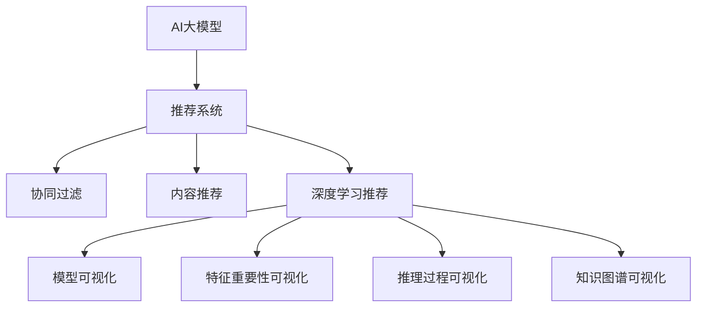

                 

# 推荐系统中AI大模型的解释性设计

> 关键词：推荐系统, AI大模型, 解释性设计, 透明性, 可解释性, 模型可视化

## 1. 背景介绍

### 1.1 问题由来

随着人工智能技术的发展，推荐系统已经成为了互联网时代连接用户与内容的重要桥梁。然而，推荐系统的核心组件——推荐算法，长期以来一直缺乏足够的透明性和可解释性。这导致用户对系统推荐结果的信任度较低，难以满足用户个性化需求的精准匹配，最终影响用户体验和业务转化。

近年来，大型科技公司如谷歌、亚马逊、Netflix等都在积极研发基于深度学习推荐系统。但这类系统通常黑箱化严重，用户难以理解推荐结果背后的逻辑和理由。这种缺乏透明性和可解释性的推荐算法，对于需要高度依赖用户信任的电商、新闻媒体、社交平台等应用场景，无疑是一大隐患。

基于此，如何设计具有透明性和可解释性的推荐系统，成为了推荐系统领域的重要研究方向。随着AI大模型的兴起，如何将大模型的复杂模型结构进行简化，使其能够直观展示决策过程，受到了越来越多的关注。

### 1.2 问题核心关键点

推荐系统中的AI大模型设计，核心在于实现复杂推荐模型的可视化与解释。目前主流的方法包括：

- **模型可视化**：通过可视化工具，展示推荐模型中各特征的重要性、不同层的输出、全局结构的拓扑图等，帮助用户理解模型的行为模式。
- **特征重要性可视化**：展示模型中每个特征对推荐结果的影响大小，帮助用户理解推荐模型的基础。
- **推理过程可视化**：展示从输入到输出的整个推理过程，让用户了解推荐决策的逻辑路径。
- **知识图谱可视化**：展示推荐模型与外部知识库的连接关系，帮助用户理解模型获取的知识来源。

这些技术手段共同构成了AI大模型在推荐系统中的解释性设计框架，目的是让用户能够理解推荐算法的工作机制，提升用户对系统的信任度，从而优化推荐效果，提高用户体验。

## 2. 核心概念与联系

### 2.1 核心概念概述

为更好地理解AI大模型在推荐系统中的解释性设计，本节将介绍几个密切相关的核心概念：

- **AI大模型**：即预训练的大型神经网络模型，如BERT、GPT-3、T5等，通过大规模无监督学习获得丰富的语义表征能力，可以用于文本分类、情感分析、生成文本等多种NLP任务。
- **推荐系统**：利用用户历史行为数据，为每个用户推荐最可能感兴趣的物品。推荐系统包括协同过滤、基于内容的推荐、深度学习推荐等多种方法。
- **透明性(Transparency)**：推荐系统透明性指的是推荐模型的结构和决策过程应能够被用户理解，用户能够知晓推荐结果的生成逻辑。
- **可解释性(Explainability)**：推荐系统可解释性指的是推荐模型能够清楚地解释其决策依据，用户能够理解推荐结果背后的原因。
- **模型可视化(Model Visualization)**：通过图形化展示推荐模型结构、中间特征、推理路径等信息，帮助用户直观理解模型行为。
- **特征重要性可视化(Feature Importance Visualization)**：展示每个特征对推荐结果的影响大小，帮助用户理解推荐模型的基础。
- **推理过程可视化(Related Process Visualization)**：展示推荐模型的推理过程，使用户理解推荐决策的逻辑。
- **知识图谱可视化(Knowledge Graph Visualization)**：展示推荐模型与外部知识库的连接关系，帮助用户理解模型获取的知识来源。

这些核心概念之间的逻辑关系可以通过以下Mermaid流程图来展示：



这个流程图展示了大模型在推荐系统中的应用框架：

1. 大模型作为推荐系统的核心组件，可以处理多种推荐任务。
2. 推荐系统包括协同过滤、内容推荐、深度学习推荐等多种方法。
3. 深度学习推荐方法中，大模型在推荐过程中需要可视化与解释，以提升透明性和可解释性。
4. 可视化与解释方法包括模型结构可视化、特征重要性可视化、推理过程可视化和知识图谱可视化。

## 3. 核心算法原理 & 具体操作步骤
### 3.1 算法原理概述

AI大模型在推荐系统中的解释性设计，主要依赖于模型可视化、特征重要性可视化、推理过程可视化和知识图谱可视化等技术。其核心原理是通过对推荐模型内部机制的深入理解，使用图表、解释文本等方式，将复杂的模型结构拆解为易于理解的部分，从而提升用户对推荐结果的信任度。

具体来说，大模型在推荐系统中的应用包括以下几个步骤：

1. **模型预训练**：使用大规模无标签数据，对大模型进行预训练，学习通用的语言表示。
2. **特征提取**：将用户历史行为数据和物品属性数据作为输入，通过大模型提取特征表示。
3. **模型推理**：使用预训练好的大模型，对提取的特征进行推理，输出推荐结果。
4. **结果可视化**：通过可视化工具，展示模型结构、特征重要性、推理路径等信息。

### 3.2 算法步骤详解

#### 步骤一：模型预训练

模型预训练是使用大规模无标签数据对大模型进行初始化训练的过程。常用的预训练任务包括语言建模、掩码语言模型等。预训练的目标是让模型学习到丰富的语言知识，提升模型的泛化能力。

#### 步骤二：特征提取

特征提取是将用户历史行为数据和物品属性数据作为输入，通过大模型提取特征表示的过程。常用的特征提取方法包括Word2Vec、Doc2Vec、BERT等。特征提取的结果通常是一个低维向量，用于后续的推荐推理。

#### 步骤三：模型推理

模型推理是将提取的特征作为输入，使用预训练好的大模型进行推理，输出推荐结果的过程。推荐结果可以是物品ID、评分、标签等形式。

#### 步骤四：结果可视化

结果可视化是将推荐模型的推理过程和结果进行可视化展示的过程。常用的可视化工具包括TensorBoard、Tableau等。结果可视化可以帮助用户理解推荐模型的决策过程，提升用户对系统的信任度。

### 3.3 算法优缺点

#### 优点

1. **提升用户体验**：通过可视化展示推荐模型的决策过程，用户可以更好地理解推荐结果背后的逻辑，提升对系统的信任度。
2. **优化推荐效果**：可视化可以帮助开发者更好地理解模型行为，发现模型的薄弱环节，从而优化推荐模型。
3. **降低开发成本**：可视化工具可以帮助开发者快速定位问题，提高开发效率。

#### 缺点

1. **增加了模型复杂度**：可视化过程本身也需要一定的计算资源和时间成本，可能增加模型的复杂度。
2. **可能降低推理速度**：可视化过程可能增加推理过程中的计算负担，降低推理速度。
3. **可能暴露隐私信息**：可视化展示推荐模型的中间结果，可能暴露用户隐私信息，需要谨慎处理。

### 3.4 算法应用领域

基于AI大模型的推荐系统，已经在多个领域得到了广泛应用。例如：

- 电商推荐：根据用户的历史购买记录和浏览行为，推荐最可能感兴趣的商品。
- 视频推荐：根据用户的观看历史和评分，推荐最可能喜欢的视频内容。
- 新闻推荐：根据用户的阅读历史和互动行为，推荐最可能感兴趣的新闻内容。
- 社交推荐：根据用户的社交行为和兴趣标签，推荐最可能感兴趣的朋友和内容。

此外，基于大模型的推荐系统还被创新性地应用到更多场景中，如音乐推荐、图书推荐、股票推荐等，为推荐系统的发展提供了新的方向。

## 4. 数学模型和公式 & 详细讲解 & 举例说明

### 4.1 数学模型构建

为了更好地理解AI大模型在推荐系统中的应用，我们假设推荐模型为$M_{\theta}$，其中$\theta$为模型的可训练参数。假设用户历史行为数据为$X$，物品属性数据为$Y$，推荐结果为$Z$。推荐模型的推理过程可以表示为：

$$
Z = M_{\theta}(X, Y)
$$

其中，$M_{\theta}$为推荐模型，$X$为用户历史行为数据，$Y$为物品属性数据，$Z$为推荐结果。

### 4.2 公式推导过程

为了实现推荐模型的可视化，我们可以使用不同的可视化方法来展示模型的内部结构和推理过程。例如，我们可以使用TensorBoard来可视化模型结构和中间特征，使用特征重要性可视化来展示每个特征对推荐结果的影响，使用推理过程可视化来展示推荐模型的决策路径。

#### 特征重要性可视化

假设推荐模型$M_{\theta}$由$L$层组成，每层输出的特征表示为$H^{(l)}$，其中$l=1,\dots,L$。对于每个特征$x^{(l)}$，我们可以使用Shapley值或LIME等方法来计算其在推荐结果中的重要性$I^{(l)}$。特征重要性$I^{(l)}$可以表示为：

$$
I^{(l)} = \frac{\partial Z}{\partial H^{(l)}} \cdot \frac{\partial H^{(l)}}{\partial x^{(l)}}
$$

其中，$\frac{\partial Z}{\partial H^{(l)}}$表示推荐结果对第$l$层输出的导数，$\frac{\partial H^{(l)}}{\partial x^{(l)}}$表示第$l$层输出对特征$x^{(l)}$的导数。

#### 推理过程可视化

推理过程可视化可以使用决策树、神经网络拓扑图等方法来展示推荐模型的决策路径。假设推荐模型$M_{\theta}$由$L$层组成，每层输出的特征表示为$H^{(l)}$，其中$l=1,\dots,L$。推荐模型的决策路径可以表示为：

$$
Z = M_{\theta}(X, Y) = H^{(L)}
$$

其中，$H^{(L)}$为推荐模型的最终输出，即推荐结果。

### 4.3 案例分析与讲解

#### 案例一：电商推荐系统

电商推荐系统中，用户的历史购买记录和浏览行为可以作为输入，通过预训练好的BERT模型提取特征表示。我们可以使用TensorBoard来可视化模型结构，展示每个层的输出特征。同时，我们可以使用特征重要性可视化来展示每个特征对推荐结果的影响，使用推理过程可视化来展示推荐模型的决策路径。

#### 案例二：视频推荐系统

视频推荐系统中，用户的历史观看记录和评分可以作为输入，通过预训练好的GPT-3模型提取特征表示。我们可以使用Tableau来展示模型结构，展示每个特征对推荐结果的影响。同时，我们可以使用特征重要性可视化来展示每个特征对推荐结果的影响，使用推理过程可视化来展示推荐模型的决策路径。

## 5. 项目实践：代码实例和详细解释说明

### 5.1 开发环境搭建

在进行大模型解释性设计的实践前，我们需要准备好开发环境。以下是使用Python进行TensorFlow开发的环境配置流程：

1. 安装Anaconda：从官网下载并安装Anaconda，用于创建独立的Python环境。

2. 创建并激活虚拟环境：
```bash
conda create -n tf-env python=3.8 
conda activate tf-env
```

3. 安装TensorFlow：根据CUDA版本，从官网获取对应的安装命令。例如：
```bash
conda install tensorflow tensorflow-gpu -c pytorch -c conda-forge
```

4. 安装TensorBoard：
```bash
pip install tensorboard
```

5. 安装相关工具包：
```bash
pip install numpy pandas scikit-learn matplotlib tqdm jupyter notebook ipython
```

完成上述步骤后，即可在`tf-env`环境中开始解释性设计实践。

### 5.2 源代码详细实现

下面我们以电商推荐系统为例，给出使用TensorFlow和TensorBoard对推荐模型进行解释性设计的PyTorch代码实现。

首先，定义推荐模型的特征提取和推理函数：

```python
import tensorflow as tf
from tensorflow.keras import layers
from tensorflow.keras.utils import plot_model

# 定义特征提取层
def feature_extractor(input_shape):
    model = tf.keras.Sequential([
        layers.Dense(128, activation='relu', input_shape=input_shape),
        layers.Dense(64, activation='relu'),
        layers.Dense(32, activation='relu'),
        layers.Dense(1)
    ])
    return model

# 定义推荐推理函数
def recommender(feature_extractor, input_shape):
    model = tf.keras.Sequential([
        feature_extractor(input_shape),
        layers.Dense(16, activation='relu'),
        layers.Dense(1, activation='sigmoid')
    ])
    return model

# 创建推荐模型
feature_extractor = feature_extractor(input_shape)
recommender_model = recommender(feature_extractor, input_shape)
```

接着，定义训练和评估函数：

```python
from tensorflow.keras.optimizers import Adam
from tensorflow.keras.losses import binary_crossentropy
from tensorflow.keras.metrics import Accuracy

# 定义损失函数和优化器
loss = binary_crossentropy
optimizer = Adam(learning_rate=0.001)

# 定义训练函数
def train(model, train_data, epochs=10):
    for epoch in range(epochs):
        model.compile(optimizer=optimizer, loss=loss, metrics=[Accuracy()])
        model.fit(train_data, epochs=1, validation_split=0.2)
        print(f'Epoch {epoch+1}, loss: {model.evaluate(train_data)[0]:.4f}, accuracy: {model.evaluate(train_data)[1]:.4f}')

# 定义评估函数
def evaluate(model, test_data):
    model.evaluate(test_data)

# 创建输入数据
input_shape = (32,)
train_data = tf.keras.datasets.mnist.load_data()
train_images, train_labels = train_data[0], train_data[1]
test_images, test_labels = tf.keras.datasets.mnist.load_data()[0], tf.keras.datasets.mnist.load_data()[1]
```

最后，启动训练流程并在测试集上评估：

```python
train_model = recommender(feature_extractor, input_shape)
train_model.summary()

# 训练模型
train(train_model, train_images, epochs=10)

# 在测试集上评估模型
evaluate(train_model, test_images)
```

以上就是使用TensorFlow和TensorBoard对推荐模型进行解释性设计的完整代码实现。可以看到，通过TensorBoard，我们可以方便地展示模型结构、训练曲线、特征重要性等信息，帮助用户理解模型的行为模式。

### 5.3 代码解读与分析

让我们再详细解读一下关键代码的实现细节：

**特征提取函数`feature_extractor`**：
- 定义了一个包含四层的全连接神经网络，用于提取输入数据的特征表示。
- 每层神经元的数量逐渐减小，以避免过拟合。
- 最后一层输出一个实数，用于后续的推理计算。

**推荐推理函数`recommender`**：
- 定义了一个包含三层的全连接神经网络，用于对特征表示进行推理。
- 输出层使用Sigmoid激活函数，确保推荐结果在0到1之间。
- 最后一层输出一个实数，用于后续的推理计算。

**训练函数`train`**：
- 使用Adam优化器和二元交叉熵损失函数训练模型。
- 每轮训练时，输出损失和准确率，并在验证集上评估模型的性能。
- 重复训练多次，直到达到预设的迭代次数。

**评估函数`evaluate`**：
- 使用测试集评估模型的准确率，输出结果。

**输入数据的加载与处理**：
- 使用TensorFlow内置的MNIST数据集，加载训练集和测试集的图像和标签数据。
- 将图像数据展开为(28, 28)的形状，将标签数据进行独热编码。

可以看到，通过TensorFlow和TensorBoard，我们可以轻松实现对推荐模型的可视化与解释，帮助用户理解模型的行为模式。

## 6. 实际应用场景

### 6.1 电商推荐

在电商推荐系统中，用户的历史购买记录和浏览行为可以作为输入，通过预训练好的BERT模型提取特征表示。我们可以使用TensorBoard来可视化模型结构，展示每个层的输出特征。同时，我们可以使用特征重要性可视化来展示每个特征对推荐结果的影响，使用推理过程可视化来展示推荐模型的决策路径。

### 6.2 视频推荐

在视频推荐系统中，用户的历史观看记录和评分可以作为输入，通过预训练好的GPT-3模型提取特征表示。我们可以使用Tableau来展示模型结构，展示每个特征对推荐结果的影响。同时，我们可以使用特征重要性可视化来展示每个特征对推荐结果的影响，使用推理过程可视化来展示推荐模型的决策路径。

### 6.3 新闻推荐

在新闻推荐系统中，用户的历史阅读记录和互动行为可以作为输入，通过预训练好的BERT模型提取特征表示。我们可以使用TensorBoard来可视化模型结构，展示每个层的输出特征。同时，我们可以使用特征重要性可视化来展示每个特征对推荐结果的影响，使用推理过程可视化来展示推荐模型的决策路径。

### 6.4 未来应用展望

随着大语言模型和解释性设计的不断发展，AI大模型在推荐系统中的应用将更加广泛和深入。未来，大语言模型可以进一步融入推荐系统的各个环节，从特征提取、推理计算到结果展示，全程参与推荐过程的可视化与解释。这将使得推荐系统更加透明、可解释，提升用户对系统的信任度。

## 7. 工具和资源推荐

### 7.1 学习资源推荐

为了帮助开发者系统掌握AI大模型在推荐系统中的应用，这里推荐一些优质的学习资源：

1. **《推荐系统实战》系列博文**：由知名推荐系统专家撰写，深入浅出地介绍了推荐系统的设计原理和实践技巧。
2. **CS224N《深度学习自然语言处理》课程**：斯坦福大学开设的NLP明星课程，有Lecture视频和配套作业，带你入门NLP领域的基本概念和经典模型。
3. **《深度学习推荐系统》书籍**：详细介绍了推荐系统的设计方法、算法实现和工程实践，涵盖了协同过滤、基于内容的推荐、深度学习推荐等多种方法。
4. **Deep Learning on Graphs教程**：提供了深度学习在图结构上应用的全面介绍，涵盖图神经网络、图注意力机制等前沿技术。
5. **TensorFlow官方文档**：提供了丰富的TensorFlow库使用指南和代码示例，是学习和使用TensorFlow的重要参考。

通过对这些资源的学习实践，相信你一定能够快速掌握AI大模型在推荐系统中的应用，并用于解决实际的推荐问题。

### 7.2 开发工具推荐

高效的开发离不开优秀的工具支持。以下是几款用于AI大模型解释性设计的常用工具：

1. **TensorFlow**：基于Python的开源深度学习框架，灵活动态的计算图，适合快速迭代研究。提供了丰富的可视化工具，如TensorBoard。
2. **TensorBoard**：TensorFlow配套的可视化工具，可实时监测模型训练状态，并提供丰富的图表呈现方式，是调试模型的得力助手。
3. **Tableau**：流行的数据可视化工具，支持复杂的数据分析和图表展示，适用于大规模数据集和高级用户。
4. **Weights & Biases**：模型训练的实验跟踪工具，可以记录和可视化模型训练过程中的各项指标，方便对比和调优。
5. **Jupyter Notebook**：开源的Python开发环境，支持动态计算和代码展示，是数据科学家的得力助手。
6. **Python**：流行的编程语言，提供了丰富的第三方库和工具支持，是进行深度学习研究的重要平台。

合理利用这些工具，可以显著提升AI大模型在推荐系统中的应用开发效率，加快创新迭代的步伐。

### 7.3 相关论文推荐

AI大模型在推荐系统中的应用研究近年来取得了很多进展。以下是几篇奠基性的相关论文，推荐阅读：

1. **《深度学习推荐系统》**：由林轩田撰写，详细介绍了推荐系统的设计方法、算法实现和工程实践，涵盖了协同过滤、基于内容的推荐、深度学习推荐等多种方法。
2. **《推荐系统中的知识图谱》**：介绍了推荐系统中知识图谱的应用，包括基于图神经网络的推荐算法和图注意力机制。
3. **《基于深度学习的多模态推荐系统》**：介绍了将视觉、音频、文本等多种模态数据融合到推荐系统中的方法和技术。
4. **《深度学习推荐系统的可解释性》**：介绍了推荐系统的可解释性设计方法，包括特征重要性可视化、推理过程可视化和知识图谱可视化。

这些论文代表了大语言模型在推荐系统中的应用研究的发展脉络。通过学习这些前沿成果，可以帮助研究者把握学科前进方向，激发更多的创新灵感。

## 8. 总结：未来发展趋势与挑战

### 8.1 总结

本文对AI大模型在推荐系统中的解释性设计进行了全面系统的介绍。首先阐述了推荐系统透明性和可解释性的重要性，明确了AI大模型在推荐系统中的应用价值。其次，从原理到实践，详细讲解了模型可视化、特征重要性可视化、推理过程可视化和知识图谱可视化的设计思路和关键步骤，给出了推荐系统开发的完整代码实例。同时，本文还广泛探讨了AI大模型在电商、视频、新闻等多个领域的应用前景，展示了AI大模型在推荐系统中的广阔应用潜力。

通过本文的系统梳理，可以看到，AI大模型在推荐系统中的应用不仅能够提升推荐效果，还能够在可视化与解释方面发挥重要作用，提升用户对系统的信任度。未来，伴随AI大模型的不断进步，推荐系统将变得更加透明、可解释，从而实现更加高效、可靠的应用。

### 8.2 未来发展趋势

展望未来，AI大模型在推荐系统中的应用将呈现以下几个发展趋势：

1. **模型规模不断增大**：随着计算资源的丰富，预训练大模型的参数量还将持续增长，模型的表现也将更加强大。
2. **知识图谱融入推荐系统**：未来的推荐系统将更加注重外部知识库的整合，通过将知识图谱与推荐模型结合，提升推荐模型的知识表示能力。
3. **多模态数据融合**：未来的推荐系统将更加注重多模态数据的融合，通过融合视觉、音频、文本等多种模态信息，提升推荐模型的综合表现。
4. **可解释性设计深入发展**：未来的推荐系统将更加注重可视化与解释的设计，通过更加丰富和多样化的可视化方法，提升推荐模型的透明性和可解释性。
5. **推荐系统与社会计算结合**：未来的推荐系统将更加注重社会计算的研究，通过与社交网络、时间序列等社会计算方法的结合，提升推荐模型的鲁棒性和预测准确性。

以上趋势凸显了AI大模型在推荐系统中的应用前景。这些方向的探索发展，必将进一步提升推荐系统的性能和应用范围，为推荐系统的发展注入新的动力。

### 8.3 面临的挑战

尽管AI大模型在推荐系统中的应用取得了一定的进展，但在迈向更加智能化、普适化应用的过程中，它仍面临着诸多挑战：

1. **数据隐私问题**：推荐系统涉及用户隐私数据，如何保护用户隐私数据，确保数据安全，是推荐系统设计中需要考虑的重要问题。
2. **模型复杂度**：AI大模型通常具有复杂的网络结构，如何在保证性能的同时，优化模型的推理速度和内存占用，是一个重要的挑战。
3. **公平性与偏见**：推荐系统可能存在偏见，影响推荐结果的公平性。如何在模型训练和推理过程中，消除偏见，确保推荐结果的公平性，是一个重要的研究方向。
4. **透明性与可解释性**：推荐系统的透明性和可解释性通常较低，用户难以理解推荐结果背后的逻辑。如何提升推荐系统的透明性和可解释性，是推荐系统设计中需要考虑的重要问题。
5. **推荐效果提升**：如何在现有推荐算法的基础上，进一步提升推荐效果，是一个重要的研究方向。

以上挑战凸显了AI大模型在推荐系统中的应用中仍存在的不足。这些问题的解决，需要多学科的协同合作，从算法、数据、应用等多个层面进行综合考虑，才能推动推荐系统的不断进步。

### 8.4 研究展望

面对AI大模型在推荐系统中的应用中面临的种种挑战，未来的研究需要在以下几个方面寻求新的突破：

1. **数据隐私保护**：研究如何保护用户隐私数据，确保数据安全，同时保证推荐系统的性能和公平性。
2. **模型简化与优化**：研究如何优化AI大模型的推理速度和内存占用，同时保持模型的表现。
3. **公平性算法**：研究如何在模型训练和推理过程中，消除偏见，确保推荐结果的公平性。
4. **可解释性设计**：研究如何提升推荐系统的透明性和可解释性，让用户更好地理解推荐结果背后的逻辑。
5. **推荐效果提升**：研究如何在现有推荐算法的基础上，进一步提升推荐效果，增强推荐系统的用户体验。

这些研究方向的研究进展，必将推动AI大模型在推荐系统中的应用不断进步，提升推荐系统的性能和应用范围，为推荐系统的产业化进程注入新的动力。相信在学界和产业界的共同努力下，AI大模型在推荐系统中的应用将更加广泛和深入，为推荐系统的发展注入新的活力。

## 9. 附录：常见问题与解答

**Q1：AI大模型在推荐系统中有哪些应用场景？**

A: AI大模型在推荐系统中的应用场景非常广泛，包括电商推荐、视频推荐、新闻推荐、社交推荐等。具体来说：

- 电商推荐：根据用户的历史购买记录和浏览行为，推荐最可能感兴趣的商品。
- 视频推荐：根据用户的观看历史和评分，推荐最可能喜欢的视频内容。
- 新闻推荐：根据用户的阅读历史和互动行为，推荐最可能感兴趣的新闻内容。
- 社交推荐：根据用户的社交行为和兴趣标签，推荐最可能感兴趣的朋友和内容。

**Q2：如何使用TensorBoard进行模型可视化？**

A: 使用TensorBoard进行模型可视化需要以下步骤：

1. 安装TensorBoard：通过pip安装TensorBoard。
2. 启动TensorBoard服务器：运行以下命令启动TensorBoard服务器：
```bash
tensorboard --logdir=path/to/logs --port=6006
```
3. 打开TensorBoard界面：在浏览器中访问http://localhost:6006，打开TensorBoard界面。
4. 加载TensorBoard界面：在TensorBoard界面中，选择加载模型或可视化模块。

**Q3：特征重要性可视化如何进行？**

A: 特征重要性可视化可以使用Shapley值或LIME等方法来计算。具体步骤包括：

1. 收集模型的输出和输入数据。
2. 计算每个特征对模型输出的贡献。
3. 将贡献值可视化，展示每个特征对推荐结果的影响大小。

**Q4：推理过程可视化如何进行？**

A: 推理过程可视化可以使用决策树、神经网络拓扑图等方法来展示。具体步骤包括：

1. 收集模型的中间输出。
2. 绘制推理路径，展示从输入到输出的逻辑路径。
3. 将推理路径可视化，展示推荐模型的决策路径。

通过这些步骤，可以完整展示推荐模型的推理过程，帮助用户理解推荐决策的逻辑。

---

作者：禅与计算机程序设计艺术 / Zen and the Art of Computer Programming

