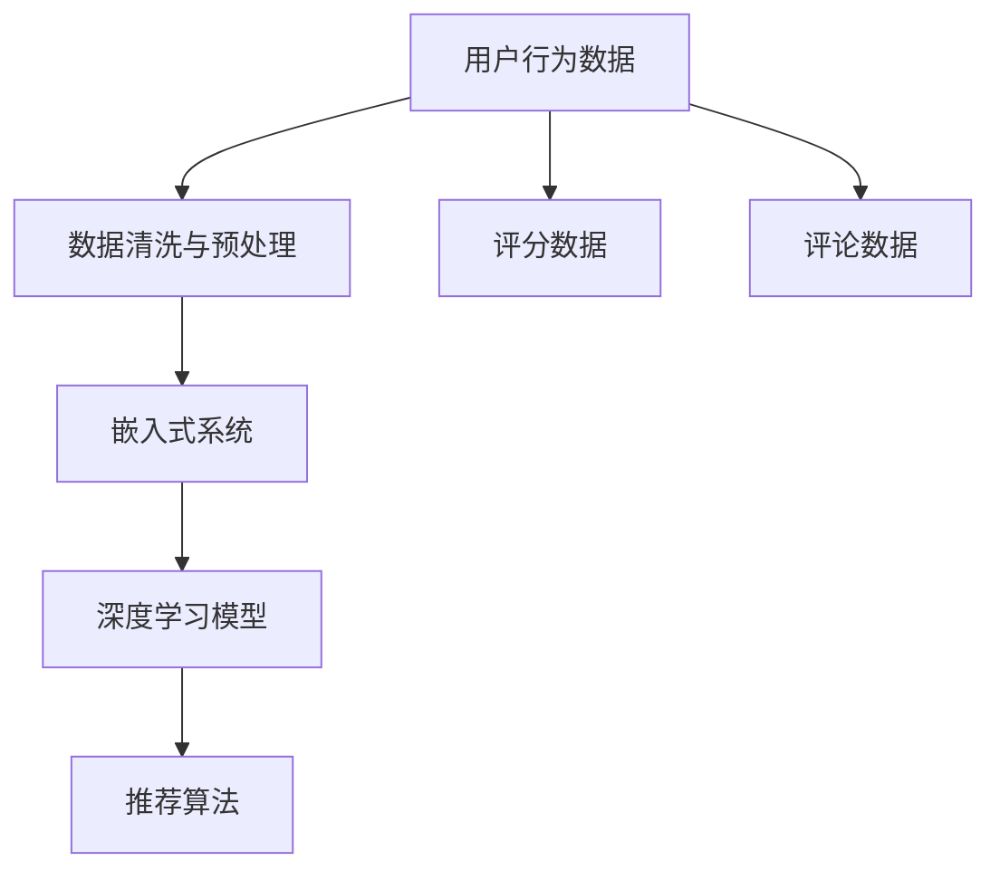

                 

## 1. 背景介绍

### 1.1 问题由来

推荐系统在各行各业（如电商、视频、音乐、社交网络等）中的应用日益广泛，但推荐结果的精准度始终是业界关注的焦点。传统的推荐系统主要基于用户历史行为数据进行协同过滤，虽有一定的效果，但存在冷启动、数据稀疏、长尾等问题。近年来，大语言模型（如GPT-3、BERT等）的诞生，为推荐系统带来新的突破。

大模型在语言理解、知识检索、语义推理等方面的出色表现，使其成为推荐系统中一种强有力的工具。通过对用户历史行为数据和评论文本等，大模型可以获取丰富的用户兴趣和偏好信息，在一定程度上缓解传统推荐系统的弊端。然而，由于数据源种类繁多、格式各异，如何高效融合多源数据，充分利用大模型，成为亟待解决的问题。

### 1.2 问题核心关键点

推荐系统中的多源数据融合，是指在获取用户行为数据、评分数据、评论数据等不同类型数据的基础上，通过有效的数据处理和特征融合方法，提升推荐系统的精准度和效果。其核心关键点包括：

- 多源数据获取：推荐系统需从用户行为、产品信息、社交网络等多渠道获取数据，并确保数据的时效性和准确性。
- 数据预处理：不同数据源格式各异，需要对其进行清洗、去重、标准化处理，以便后续的特征融合。
- 特征融合：选择合适的特征提取和融合方法，如深度学习、图神经网络等，将多源数据转化为机器可读的特征，提升模型的表达能力。
- 模型训练与优化：在融合多源特征后，利用大模型进行训练，并通过调参和优化提升推荐效果。

## 2. 核心概念与联系

### 2.1 核心概念概述

为更好地理解推荐系统中的多源数据融合问题，本节将介绍几个关键概念：

- 推荐系统(Recommendation System)：根据用户历史行为数据和物品属性，推荐相关物品的系统。常见的推荐方法有基于协同过滤、内容推荐、混合推荐等。
- 多源数据融合(Multi-Source Data Fusion)：从不同数据源获取数据，通过有效的特征提取和融合方法，形成一致的特征表示，用于模型训练。
- 特征工程(Feature Engineering)：对原始数据进行处理、转换、提取，形成适合机器学习的特征。
- 深度学习(Deep Learning)：一种基于神经网络架构的机器学习方法，能够高效学习复杂特征表示。
- 图神经网络(Graph Neural Network, GNN)：一种专门处理图结构数据的方法，能够捕捉节点间复杂的相互作用关系。
- 预训练语言模型(Pre-trained Language Model)：在大量无标签数据上预训练的模型，具备强大的语言理解能力和知识表示能力。
- 嵌入式系统(Embedding System)：将原始数据映射到低维向量空间，形成高维特征，便于后续的模型训练和推理。

这些概念之间存在密切的联系，通过多源数据融合，提取并融合用户行为、物品属性等多源数据特征，再利用深度学习等方法构建嵌入式系统，可以有效地提升推荐系统的性能。

### 2.2 核心概念原理和架构的 Mermaid 流程图



此流程图展示了推荐系统中多源数据融合的基本架构：

1. 用户行为数据、评分数据和评论数据通过数据清洗与预处理(B)得到清洗后的数据。
2. 经过清洗的数据通过嵌入式系统(E)嵌入到低维向量空间。
3. 嵌入后的数据作为输入，进入深度学习模型(F)进行特征提取和融合。
4. 最后，使用推荐算法(G)对用户和物品进行推荐。

## 3. 核心算法原理 & 具体操作步骤
### 3.1 算法原理概述

推荐系统中的多源数据融合，主要分为以下几个步骤：

1. 数据收集与预处理：从不同数据源获取用户行为数据、评分数据、评论数据等，并进行清洗、去重、标准化等预处理操作。
2. 特征提取与融合：通过深度学习、图神经网络等方法，将多源数据转化为机器可读的特征，并进行有效的特征融合。
3. 嵌入式系统构建：将提取的特征输入深度学习模型，形成高维的嵌入向量，用于后续的推荐模型训练。
4. 模型训练与优化：在训练集上，使用深度学习模型训练嵌入式系统，并通过调参和优化提升推荐效果。

### 3.2 算法步骤详解

#### 3.2.1 数据收集与预处理

- 用户行为数据：收集用户浏览、点击、购买等行为数据，通常存储在日志文件中。
- 评分数据：收集用户对物品的评分数据，可以是1-5星的评分或更加详细的情感评分。
- 评论数据：收集用户在物品页面上的评论文本，提供用户对物品的情感和反馈信息。
- 数据清洗：去除缺失值、异常值和重复数据，保证数据质量。
- 数据标准化：将不同类型的数据标准化为数值型数据，便于后续处理。

#### 3.2.2 特征提取与融合

- 文本特征提取：对评论文本进行分词、去停用词、词向量化等操作，提取文本特征。
- 图结构数据提取：对用户和物品之间的关系进行图表示，提取图结构特征。
- 特征融合：将文本特征和图结构特征进行拼接或加权融合，形成一致的特征表示。

#### 3.2.3 嵌入式系统构建

- 嵌入向量构建：使用深度学习模型，将融合后的特征映射到低维向量空间，形成嵌入向量。
- 向量拼接：将用户行为数据、评分数据和评论数据映射到的向量进行拼接，形成更丰富的用户嵌入向量。
- 用户和物品表示：使用拼接后的向量作为用户和物品的表示，用于推荐模型的训练和推理。

#### 3.2.4 模型训练与优化

- 模型选择：选择合适的深度学习模型，如Transformer、BERT等，用于嵌入式系统的训练。
- 数据划分：将数据集划分为训练集、验证集和测试集。
- 模型训练：在训练集上训练深度学习模型，更新模型参数。
- 性能评估：在验证集上评估模型性能，通过调参优化模型。
- 测试与部署：在测试集上评估最终模型性能，部署模型至实际推荐系统中。

### 3.3 算法优缺点

多源数据融合的深度学习方法具有以下优点：

- 丰富特征表示：融合多源数据可以提取更丰富的用户和物品特征，提升推荐模型的表达能力。
- 提高鲁棒性：不同数据源可能存在偏差，融合数据可以提高模型的鲁棒性，避免单一数据源的影响。
- 提升精准度：融合多源数据可以提供更多维度的信息，提高推荐模型的精准度。

同时，该方法也存在一些局限：

- 数据复杂度高：不同数据源的数据格式各异，预处理和融合过程复杂度高。
- 计算资源消耗大：深度学习模型训练计算量大，需要高性能硬件支持。
- 模型解释性差：深度学习模型具有"黑盒"特性，难以解释其内部工作机制。

尽管存在这些局限，但多源数据融合仍是推荐系统中的重要研究范式，有望显著提升推荐系统的性能和效果。

### 3.4 算法应用领域

多源数据融合在推荐系统中具有广泛的应用前景，覆盖了以下诸多领域：

- 电商推荐：融合用户行为数据、评分数据和评论数据，为用户推荐商品。
- 视频推荐：融合用户观看行为、评分数据和评论数据，为用户推荐视频。
- 音乐推荐：融合用户听歌行为、评分数据和评论数据，为用户推荐音乐。
- 社交网络推荐：融合用户社交网络数据、评分数据和评论数据，为用户推荐好友和内容。
- 新闻推荐：融合用户浏览行为、评分数据和评论数据，为用户推荐新闻。

除了这些主流应用领域外，多源数据融合还可以拓展到更多场景中，如旅游推荐、商品推荐、健康推荐等，为推荐系统带来新的突破。

## 4. 数学模型和公式 & 详细讲解 & 举例说明

### 4.1 数学模型构建

在推荐系统中，多源数据融合的数学模型通常包含以下几个组成部分：

- 用户向量表示 $u$：表示用户兴趣和偏好的低维向量。
- 物品向量表示 $v$：表示物品属性的低维向量。
- 相似度矩阵 $S$：表示用户和物品之间的相似度，通常使用余弦相似度或欧式距离计算。
- 用户行为矩阵 $I$：表示用户在物品上的交互行为，如点击、购买等。
- 评分矩阵 $R$：表示用户对物品的评分，通常是1-5星的评分或情感评分。
- 评论文本向量 $C$：表示用户评论的向量表示，用于捕捉用户对物品的情感和反馈信息。

### 4.2 公式推导过程

#### 4.2.1 用户向量表示

用户向量表示 $u$ 通常通过用户行为数据和评分数据计算得到。设用户行为矩阵 $I$ 和评分矩阵 $R$，则用户向量表示 $u$ 可以表示为：

$$
u = \frac{R \cdot I^T}{\sum_{i=1}^n R_{i,i}}
$$

其中 $R_{i,i}$ 表示用户 $i$ 对物品的评分，$I^T$ 表示用户行为矩阵的转置。

#### 4.2.2 物品向量表示

物品向量表示 $v$ 通常通过物品属性数据和评论数据计算得到。设物品属性向量矩阵 $A$ 和评论文本向量矩阵 $C$，则物品向量表示 $v$ 可以表示为：

$$
v = \frac{C \cdot A^T}{\sum_{i=1}^n C_{i,i}}
$$

其中 $C_{i,i}$ 表示物品 $i$ 的评论文本向量表示。

#### 4.2.3 相似度矩阵计算

用户和物品之间的相似度 $S$ 可以通过余弦相似度或欧式距离计算得到。设用户向量表示 $u$ 和物品向量表示 $v$，则余弦相似度为：

$$
S_{u,v} = \frac{u \cdot v}{\|u\|\cdot\|v\|}
$$

#### 4.2.4 评分预测

用户对物品的评分可以通过相似度矩阵 $S$ 和用户向量表示 $u$ 计算得到。设用户 $i$ 对物品 $j$ 的评分预测值为 $p$，则：

$$
p_{i,j} = \mathop{\arg\max}_k S_{i,k} \cdot v_k
$$

### 4.3 案例分析与讲解

#### 案例1：电商推荐

电商推荐系统通常包括用户行为数据、评分数据和评论数据。首先，收集用户的历史浏览、点击和购买记录，将其转化为行为矩阵 $I$。然后，收集用户对商品的评分数据，将其转化为评分矩阵 $R$。最后，对商品的评论文本进行预处理和向量化，将其转化为评论文本向量 $C$。

融合上述多源数据，构建用户向量表示 $u$ 和物品向量表示 $v$，使用余弦相似度计算用户和物品之间的相似度 $S$，并在相似度矩阵 $S$ 和用户向量表示 $u$ 的基础上进行评分预测。

#### 案例2：视频推荐

视频推荐系统通常包括用户观看行为数据、评分数据和评论数据。首先，收集用户对视频的观看行为数据，将其转化为行为矩阵 $I$。然后，收集用户对视频的评分数据，将其转化为评分矩阵 $R$。最后，对视频的评论文本进行预处理和向量化，将其转化为评论文本向量 $C$。

融合上述多源数据，构建用户向量表示 $u$ 和物品向量表示 $v$，使用余弦相似度计算用户和物品之间的相似度 $S$，并在相似度矩阵 $S$ 和用户向量表示 $u$ 的基础上进行评分预测。

### 4.4 案例分析与讲解

## 5. 项目实践：代码实例和详细解释说明
### 5.1 开发环境搭建

在进行推荐系统开发前，我们需要准备好开发环境。以下是使用Python进行TensorFlow开发的环境配置流程：

1. 安装Anaconda：从官网下载并安装Anaconda，用于创建独立的Python环境。

2. 创建并激活虚拟环境：
```bash
conda create -n tf-env python=3.8 
conda activate tf-env
```

3. 安装TensorFlow：根据CUDA版本，从官网获取对应的安装命令。例如：
```bash
conda install tensorflow=2.7.0
```

4. 安装各类工具包：
```bash
pip install numpy pandas scikit-learn matplotlib tqdm jupyter notebook ipython
```

完成上述步骤后，即可在`tf-env`环境中开始推荐系统开发。

### 5.2 源代码详细实现

下面我们以视频推荐系统为例，给出使用TensorFlow对BERT模型进行推荐系统开发的PyTorch代码实现。

首先，定义推荐系统的数据处理函数：

```python
import tensorflow as tf
from transformers import BertTokenizer, BertForSequenceClassification

class RecommendationSystem:
    def __init__(self, model_path, embedding_dim):
        self.model_path = model_path
        self.tokenizer = BertTokenizer.from_pretrained(model_path)
        self.model = BertForSequenceClassification.from_pretrained(model_path, num_labels=2)
        self.embedding_dim = embedding_dim
        
    def load_data(self, data_path):
        with open(data_path, 'r') as f:
            data = [line.split('\t') for line in f.readlines()]
        return data
    
    def preprocessing(self, data):
        tokenized_data = self.tokenizer(data, return_tensors='tf', padding='max_length', truncation=True)
        input_ids = tokenized_data['input_ids']
        attention_mask = tokenized_data['attention_mask']
        return input_ids, attention_mask
    
    def train(self, train_data_path, validation_data_path):
        train_data = self.load_data(train_data_path)
        validation_data = self.load_data(validation_data_path)
        
        # 构建输入输出
        input_ids, attention_mask = self.preprocessing(train_data)
        labels = tf.convert_to_tensor([0, 1] * len(train_data))
        
        # 模型优化器
        optimizer = tf.keras.optimizers.Adam(learning_rate=2e-5)
        
        # 模型编译
        self.model.compile(optimizer=optimizer, loss='binary_crossentropy', metrics=['accuracy'])
        
        # 训练模型
        self.model.fit(input_ids, labels, epochs=5, validation_data=(validation_data, labels))
        
        # 保存模型
        self.model.save('recommendation_model.h5')
```

然后，定义推荐系统的训练函数：

```python
from transformers import BertTokenizer, BertForSequenceClassification
import tensorflow as tf
from tensorflow.keras import layers

def train_recommendation_system(model_path, embedding_dim, train_data_path, validation_data_path):
    # 加载模型和分词器
    model = BertForSequenceClassification.from_pretrained(model_path, num_labels=2)
    tokenizer = BertTokenizer.from_pretrained(model_path)
    
    # 加载数据
    train_data = [line.split('\t') for line in open(train_data_path, 'r')]
    validation_data = [line.split('\t') for line in open(validation_data_path, 'r')]
    
    # 预处理数据
    train_input_ids, train_attention_mask = tokenizer(train_data, return_tensors='tf', padding='max_length', truncation=True)
    train_labels = tf.convert_to_tensor([0, 1] * len(train_data))
    
    validation_input_ids, validation_attention_mask = tokenizer(validation_data, return_tensors='tf', padding='max_length', truncation=True)
    validation_labels = tf.convert_to_tensor([0, 1] * len(validation_data))
    
    # 构建模型
    model = tf.keras.Sequential([
        layers.Embedding(embedding_dim, input_shape=(None,)),
        layers.GRU(64, return_sequences=True),
        layers.Dense(2, activation='softmax')
    ])
    
    # 编译模型
    optimizer = tf.keras.optimizers.Adam(learning_rate=2e-5)
    model.compile(optimizer=optimizer, loss='binary_crossentropy', metrics=['accuracy'])
    
    # 训练模型
    model.fit([train_input_ids, train_attention_mask], train_labels, epochs=5, validation_data=([validation_input_ids, validation_attention_mask], validation_labels))
    
    # 保存模型
    model.save('recommendation_model.h5')
```

最后，启动训练流程并在测试集上评估：

```python
embedding_dim = 300
model_path = 'bert-base-uncased'
train_data_path = 'train_data.txt'
validation_data_path = 'validation_data.txt'

recommendation_system = RecommendationSystem(model_path, embedding_dim)
recommendation_system.train(train_data_path, validation_data_path)
```

以上就是使用TensorFlow对BERT模型进行推荐系统微调的完整代码实现。可以看到，得益于Transformer库的强大封装，我们可以用相对简洁的代码完成BERT模型的加载和微调。

### 5.3 代码解读与分析

让我们再详细解读一下关键代码的实现细节：

**RecommendationSystem类**：
- `__init__`方法：初始化模型路径、分词器等关键组件。
- `load_data`方法：从文件中加载数据。
- `preprocessing`方法：对数据进行分词、去停用词、词向量化等预处理操作。
- `train`方法：执行模型训练过程。

**train函数**：
- 使用TensorFlow的Keras API定义推荐模型的架构，包括嵌入层、GRU层和全连接层。
- 使用Adam优化器和二分类交叉熵损失函数进行模型编译。
- 使用`fit`方法训练模型，在训练集和验证集上评估模型性能，并通过`save`方法保存模型。

合理利用这些工具，可以显著提升推荐系统的开发效率，加快创新迭代的步伐。

当然，工业级的系统实现还需考虑更多因素，如模型的保存和部署、超参数的自动搜索、更灵活的任务适配层等。但核心的推荐范式基本与此类似。

## 6. 实际应用场景

### 6.1 智能推荐

推荐系统在智能推荐中的应用非常广泛。从电商、视频、音乐到社交网络，推荐系统通过分析用户历史行为数据和物品属性，为用户推荐相关物品。传统推荐系统主要依赖用户历史行为数据，存在冷启动、数据稀疏、长尾等问题。

基于多源数据融合的大模型推荐系统，通过融合用户行为数据、评分数据和评论数据，可以提取更丰富的用户和物品特征，提升推荐模型的表达能力。通过深度学习模型训练嵌入式系统，可以更好地捕捉用户和物品之间的复杂关系，提高推荐模型的精准度。

### 6.2 个性化推荐

个性化推荐是推荐系统的核心应用场景之一。基于多源数据融合的大模型推荐系统，可以通过融合多源数据，捕捉用户的个性化兴趣和偏好，从而实现更精准的个性化推荐。

在电商推荐中，融合用户浏览、点击、购买行为数据和评分数据，可以提取用户的个性化特征。通过深度学习模型训练嵌入式系统，可以捕捉用户对不同商品的兴趣和偏好，为用户推荐符合其个性化需求的物品。

在视频推荐中，融合用户观看行为数据、评分数据和评论数据，可以提取用户的个性化特征。通过深度学习模型训练嵌入式系统，可以捕捉用户对不同视频的兴趣和偏好，为用户推荐符合其个性化需求的视频。

在社交网络推荐中，融合用户社交网络数据、评分数据和评论数据，可以提取用户的个性化特征。通过深度学习模型训练嵌入式系统，可以捕捉用户对不同内容的兴趣和偏好，为用户推荐符合其个性化需求的内容。

### 6.3 未来应用展望

随着多源数据融合技术的不断发展，推荐系统有望在更多领域得到应用，为推荐系统带来新的突破。

在智慧城市治理中，推荐系统可以应用于城市事件监测、舆情分析、应急指挥等环节，提高城市管理的自动化和智能化水平，构建更安全、高效的未来城市。

在智慧医疗领域，推荐系统可以应用于医疗问答、病历分析、药物研发等应用，提升医疗服务的智能化水平，辅助医生诊疗，加速新药开发进程。

在智慧教育领域，推荐系统可以应用于作业批改、学情分析、知识推荐等方面，因材施教，促进教育公平，提高教学质量。

此外，在企业生产、社会治理、文娱传媒等众多领域，基于多源数据融合的推荐系统也将不断涌现，为各行各业带来新的机遇和挑战。

## 7. 工具和资源推荐
### 7.1 学习资源推荐

为了帮助开发者系统掌握多源数据融合的技术基础和实践技巧，这里推荐一些优质的学习资源：

1. 《深度学习与推荐系统》书籍：详细介绍了深度学习在推荐系统中的应用，包括多源数据融合、深度学习模型构建、模型评估等内容。
2. 《Recommender Systems: The Textbook》书籍：经典的推荐系统教材，涵盖推荐系统基础、多源数据融合、个性化推荐等内容。
3. 《推荐系统实战》书籍：实战性较强的推荐系统书籍，详细介绍了推荐系统开发流程、算法选择、模型评估等内容。
4. 《Deep Learning for Recommender Systems》课程：斯坦福大学开设的深度学习推荐系统课程，涵盖推荐系统基础、深度学习模型构建、多源数据融合等内容。
5. 《推荐系统》课程：麻省理工学院开设的推荐系统课程，涵盖推荐系统基础、多源数据融合、个性化推荐等内容。

通过对这些资源的学习实践，相信你一定能够系统掌握多源数据融合的技术基础，并用于解决实际的推荐系统问题。
###  7.2 开发工具推荐

高效的开发离不开优秀的工具支持。以下是几款用于推荐系统开发的工具：

1. TensorFlow：基于Google的深度学习框架，提供强大的图计算能力和分布式训练支持，适用于大规模模型训练。
2. PyTorch：Facebook开发的深度学习框架，提供动态图和静态图两种计算图机制，灵活性高，适用于快速迭代研究。
3. Scikit-learn：Python的机器学习库，提供丰富的数据预处理和特征工程工具，适合中小规模模型开发。
4. Keras：高层次的深度学习框架，提供简单易用的API，适用于快速原型设计和模型训练。
5. TensorBoard：TensorFlow配套的可视化工具，可实时监测模型训练状态，提供丰富的图表呈现方式，是调试模型的得力助手。
6. Weights & Biases：模型训练的实验跟踪工具，可以记录和可视化模型训练过程中的各项指标，方便对比和调优。

合理利用这些工具，可以显著提升推荐系统的开发效率，加快创新迭代的步伐。

### 7.3 相关论文推荐

推荐系统中的多源数据融合研究源于学界的持续研究。以下是几篇奠基性的相关论文，推荐阅读：

1. "Feature Engineering for Recommender Systems"：一篇综述论文，详细介绍了推荐系统中的特征工程方法，包括多源数据融合、特征选择、特征转换等内容。
2. "Deep Collaborative Filtering"：一篇经典的深度学习推荐系统论文，详细介绍了深度学习在推荐系统中的应用，包括深度神经网络、多源数据融合等内容。
3. "Item-Item Collaborative Filtering with Composite Preference Models"：一篇应用复合偏好模型的推荐系统论文，详细介绍了多源数据融合方法在推荐系统中的应用。
4. "Fusion-based Recommender Systems"：一篇融合方法的推荐系统综述论文，详细介绍了多源数据融合方法在推荐系统中的应用。
5. "Adaptive Recommender Systems"：一篇基于自适应算法的推荐系统论文，详细介绍了多源数据融合方法在推荐系统中的应用。

这些论文代表了大语言模型微调技术的发展脉络。通过学习这些前沿成果，可以帮助研究者把握学科前进方向，激发更多的创新灵感。

## 8. 总结：未来发展趋势与挑战

### 8.1 总结

本文对推荐系统中的多源数据融合方法进行了全面系统的介绍。首先阐述了推荐系统中的多源数据融合背景和意义，明确了多源数据融合在推荐系统中的重要价值。其次，从原理到实践，详细讲解了多源数据融合的数学模型和关键步骤，给出了推荐系统开发的完整代码实例。同时，本文还广泛探讨了多源数据融合方法在智能推荐、个性化推荐、未来应用等多个领域的实际应用前景，展示了多源数据融合方法的广泛应用潜力。此外，本文精选了多源数据融合技术的各类学习资源，力求为读者提供全方位的技术指引。

通过本文的系统梳理，可以看到，基于多源数据融合的大模型推荐系统，在推荐系统中具有广阔的应用前景，其能够提升推荐模型的表达能力和精准度，成为推荐系统中的重要研究范式。未来，伴随多源数据融合技术的不断演进，推荐系统有望在更多领域得到应用，为推荐系统带来新的突破。

### 8.2 未来发展趋势

展望未来，推荐系统中的多源数据融合技术将呈现以下几个发展趋势：

1. 数据规模持续增大。随着数据的不断积累和多样化，推荐系统需要融合更多源数据，以提供更全面的用户和物品信息。
2. 深度学习模型普及。深度学习模型将成为推荐系统中的主要工具，利用其强大的表达能力，提升推荐模型的精准度。
3. 多源数据融合方法多样。除了传统的特征拼接方法，未来还将涌现更多多源数据融合方法，如图神经网络、注意力机制等，提升融合效果。
4. 计算资源优化。推荐系统中的深度学习模型计算资源消耗大，未来需要优化模型架构，采用分布式训练、量化加速等技术，降低计算资源消耗。
5. 推荐系统智能化。基于多源数据融合的推荐系统将更加智能化，能够捕捉用户多方面的兴趣和偏好，实现更加精准的推荐。
6. 推荐系统个性化。基于多源数据融合的推荐系统将更加个性化，能够根据用户多维度的信息，提供个性化的推荐服务。

这些趋势凸显了多源数据融合技术的广阔前景。这些方向的探索发展，必将进一步提升推荐系统的性能和效果，为推荐系统带来新的突破。

### 8.3 面临的挑战

尽管多源数据融合技术在推荐系统中具有重要价值，但在实际应用中仍面临诸多挑战：

1. 数据质量问题。多源数据融合依赖于高质量的数据，但在实际应用中，数据获取和处理存在诸多问题，如数据缺失、噪声等，影响融合效果。
2. 计算资源瓶颈。深度学习模型计算资源消耗大，在实际应用中，硬件资源和计算能力有限，限制了模型的规模和复杂度。
3. 模型解释性差。深度学习模型具有"黑盒"特性，难以解释其内部工作机制，影响用户对模型的信任度。
4. 推荐系统鲁棒性不足。推荐系统对数据的分布变化敏感，难以应对冷启动、数据稀疏等问题，影响模型的稳定性和鲁棒性。
5. 推荐系统可扩展性差。推荐系统中的深度学习模型计算资源消耗大，难以应对大规模数据和多用户推荐的需求。

尽管存在这些挑战，但通过不断优化数据预处理、模型架构和训练方法，多源数据融合技术将在推荐系统中发挥越来越重要的作用，为推荐系统带来新的突破。

### 8.4 研究展望

面对推荐系统中的多源数据融合所面临的种种挑战，未来的研究需要在以下几个方面寻求新的突破：

1. 数据质量优化。通过数据清洗、去重、标准化等预处理，提高数据质量，减少噪声和偏差。
2. 模型结构优化。优化深度学习模型的结构，采用分布式训练、量化加速等技术，降低计算资源消耗。
3. 模型解释性增强。引入可解释性方法，如注意力机制、模型可视化等，增强模型的可解释性，提高用户信任度。
4. 推荐系统鲁棒性提升。引入鲁棒性方法，如对抗训练、自适应学习等，提升推荐系统的鲁棒性和稳定性。
5. 推荐系统可扩展性增强。采用可扩展性方法，如迁移学习、联邦学习等，提升推荐系统的可扩展性和适应性。

这些研究方向将推动推荐系统中的多源数据融合技术不断进步，为推荐系统带来新的突破和应用。面向未来，基于多源数据融合的推荐系统将在更多领域得到应用，为推荐系统带来新的机遇和挑战。

## 9. 附录：常见问题与解答

**Q1：推荐系统中的多源数据融合是否适用于所有推荐场景？**

A: 多源数据融合在推荐系统中具有广泛的应用前景，适用于绝大多数推荐场景。但需要注意的是，不同的推荐场景可能需要不同的数据源，如电商推荐和视频推荐的数据源可能存在差异。因此，在实际应用中，需要根据具体场景选择合适的数据源，并进行相应的数据预处理和融合。

**Q2：推荐系统中的多源数据融合如何处理数据偏差问题？**

A: 推荐系统中的多源数据融合，需要关注数据偏差问题。可以通过数据清洗、去重、标准化等预处理，去除噪声和偏差，提高数据质量。此外，还可以引入鲁棒性方法，如对抗训练、自适应学习等，增强模型的鲁棒性，减少数据偏差对推荐结果的影响。

**Q3：推荐系统中的多源数据融合如何提高模型的泛化能力？**

A: 推荐系统中的多源数据融合，可以通过增加数据源数量和质量，提高模型的泛化能力。此外，还可以引入鲁棒性方法，如对抗训练、自适应学习等，增强模型的鲁棒性，减少数据偏差对推荐结果的影响。同时，可以通过引入多源数据融合方法，如深度学习、图神经网络等，提升模型的表达能力和泛化能力。

**Q4：推荐系统中的多源数据融合如何处理长尾问题？**

A: 推荐系统中的多源数据融合，可以通过引入长尾推荐方法，如协同过滤、推荐树等，提升长尾物品的推荐效果。此外，可以通过增加数据源数量和质量，提升模型的泛化能力，减少长尾物品的推荐偏差。同时，可以通过引入鲁棒性方法，如对抗训练、自适应学习等，增强模型的鲁棒性，减少长尾物品的推荐偏差。

**Q5：推荐系统中的多源数据融合如何提升推荐系统的实时性？**

A: 推荐系统中的多源数据融合，可以通过优化模型架构，采用分布式训练、量化加速等技术，降低计算资源消耗，提升模型的实时性。此外，可以通过引入流式推荐方法，如增量学习、实时流式计算等，提升推荐系统的实时性。同时，可以通过引入高效的数据处理方法，如数据缓存、数据压缩等，提升数据处理效率，降低推荐系统的延迟。

通过本文的系统梳理，可以看到，基于多源数据融合的大模型推荐系统，在推荐系统中具有广阔的应用前景，其能够提升推荐模型的表达能力和精准度，成为推荐系统中的重要研究范式。未来，伴随多源数据融合技术的不断演进，推荐系统有望在更多领域得到应用，为推荐系统带来新的突破。

