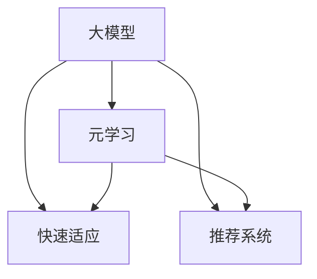

                 

## 1. 背景介绍

推荐系统（Recommendation System）作为一种用户-物品（user-item）的匹配系统，在电商、新闻、视频等多个领域中广泛应用，能够有效提升用户体验，驱动业务增长。其核心思想是通过分析用户历史行为数据，预测用户未点击的兴趣物品，并进行推荐。

然而，随着用户行为的多样化、实时性需求的提升，传统推荐系统面临着数据冷启动、实时性低、推荐单调性等问题。为了应对这些挑战，一种新兴的推荐策略——基于大模型的元学习（Meta-Learning）推荐系统应运而生，利用预训练的通用大模型进行快速知识迁移和适应，在保持推荐多样性的同时提升推荐准确性和实时性。

## 2. 核心概念与联系

### 2.1 核心概念概述

为更好地理解基于大模型的元学习推荐系统，本节将介绍几个密切相关的核心概念：

- 大模型（Large Model）：指拥有亿级参数规模、经过大规模预训练学习的通用神经网络模型，如BERT、GPT等。这些模型通过在大量无标签数据上进行自监督学习，学习到丰富的语言、图像、文本等表示。
- 元学习（Meta-Learning）：指通过在多个任务上学习模型的泛化能力，使得模型能够在未知新任务上快速适应的学习方法。常见的元学习框架包括MAML（Model-Agnostic Meta-Learning）、Proximal Meta-Learning等。
- 快速适应（Few-Shot Learning）：指模型能够在少量训练样本下进行快速适应的能力，常用于解决数据稀缺的冷启动问题。
- 推荐系统（Recommendation System）：通过分析用户历史行为数据，预测用户兴趣并推荐物品的系统，包括协同过滤、基于内容的推荐、混合推荐等。

这些概念之间的逻辑关系可以通过以下Mermaid流程图来展示：



这个流程图展示了上述核心概念之间的联系：

1. 大模型通过在大量无标签数据上进行自监督学习，学习到通用的表示。
2. 元学习利用这些通用表示，在多个推荐任务上学习模型的泛化能力。
3. 快速适应使得模型能够在少量训练样本下快速适应新任务。
4. 推荐系统通过元学习后的模型进行快速推荐，提升用户体验和业务效益。

## 3. 核心算法原理 & 具体操作步骤

### 3.1 算法原理概述

基于大模型的元学习推荐系统，主要思想是通过在大量无标签数据上预训练通用大模型，并在新推荐任务上进行元学习和快速适应，以提高推荐系统的性能。其核心算法流程如下：

1. **预训练大模型**：利用大规模无标签数据对大模型进行自监督学习，学习通用的表示。
2. **元学习**：在新推荐任务上，通过微调大模型进行元学习，学习任务间的共享表示。
3. **快速适应**：在少数样例上，利用元学习得到的共享表示，进行快速适应，快速预测推荐结果。

### 3.2 算法步骤详解

**Step 1: 准备预训练大模型**

选择预训练的大模型，如BERT、GPT等，将其作为推荐系统中的基础组件。模型的选择应考虑其规模、泛化能力和任务的适用性。

**Step 2: 元学习**

在新推荐任务上，将大模型作为元学习器，进行元学习。元学习的过程通常包括以下几个步骤：

1. 随机采样小批量数据作为元训练数据。
2. 在每个任务上，将元训练数据输入模型进行前向传播，计算损失函数。
3. 利用优化算法（如AdamW、SGD等）更新模型参数。
4. 重复上述步骤多次，直到模型收敛。

**Step 3: 快速适应**

在推荐系统中，通常只需要少量样例数据即可进行快速适应。快速适应过程如下：

1. 在元学习后的模型上，利用少量样例数据进行前向传播，计算预测结果。
2. 根据预测结果和实际标签之间的误差，利用优化算法更新模型参数。
3. 重复上述步骤，直到模型收敛。

### 3.3 算法优缺点

基于大模型的元学习推荐系统具有以下优点：

1. **泛化能力强**：由于元学习的过程涵盖了多个推荐任务，模型能够学习到通用的表示，具有良好的泛化能力。
2. **快速适应**：通过快速适应机制，模型能够在少数样例上快速适应新任务，提升推荐系统的实时性。
3. **适应性广**：适用于不同规模和类型的推荐任务，能够处理冷启动、多属性、多兴趣等复杂场景。

同时，该方法也存在一些局限性：

1. **数据需求高**：预训练和元学习需要大量无标签数据，数据获取成本高。
2. **计算复杂度高**：元学习和快速适应过程计算量大，需要高性能计算资源。
3. **模型复杂度高**：预训练大模型参数量巨大，需要优化以提升计算效率和空间利用率。

### 3.4 算法应用领域

基于大模型的元学习推荐系统已经在电商、新闻、视频等多个领域得到应用，其典型应用场景包括：

- 电商推荐：通过分析用户历史行为，预测用户的未点击商品，提升用户的购买意愿。
- 新闻推荐：根据用户的历史阅读记录，预测用户可能感兴趣的最新新闻，提供个性化推荐。
- 视频推荐：分析用户观看记录，推荐用户可能感兴趣的视频内容。

此外，在社交、金融等更多领域，元学习推荐系统也逐渐展现出其潜力，成为推荐技术的重要补充。

## 4. 数学模型和公式 & 详细讲解 & 举例说明

### 4.1 数学模型构建

基于大模型的元学习推荐系统，可以使用一个通用的神经网络模型作为基础架构。这里以一个简单的文本推荐系统为例，构建元学习推荐模型：

$$
\begin{aligned}
\text{Input} &= \text{Embedding Layer}(\text{Input Features}) \\
\text{Enc. Layer} &= \text{Transformer Layer}(\text{Input}) \\
\text{Output} &= \text{Dropout}(\text{Fully Connected Layer}(\text{Enc. Layer}))
\end{aligned}
$$

其中，$\text{Input Features}$ 表示用户历史行为数据，$\text{Embedding Layer}$ 将输入数据转换为嵌入向量，$\text{Enc. Layer}$ 是编码器层，$\text{Output}$ 是推荐结果。

### 4.2 公式推导过程

以文本推荐系统为例，推导元学习和快速适应过程的损失函数。

假设用户的历史行为数据为 $x$，推荐结果为 $y$。设 $f$ 为推荐模型的预测函数，则元学习过程中的损失函数可以表示为：

$$
\mathcal{L}_{meta} = \frac{1}{N}\sum_{i=1}^{N} \ell(f(x_i), y_i)
$$

其中，$N$ 为元训练数据的数量，$\ell$ 为交叉熵损失函数。

在快速适应过程中，假设只有一个样本 $(x, y)$，则损失函数可以表示为：

$$
\mathcal{L}_{few} = \ell(f(x), y)
$$

在微调过程中，使用小批量数据更新模型参数，优化目标函数为：

$$
\min_{\theta} \mathcal{L}_{meta} + \lambda \mathcal{L}_{few}
$$

其中，$\lambda$ 为正则化系数。

### 4.3 案例分析与讲解

以用户画像生成为例，分析基于大模型的元学习推荐系统的工作原理：

1. **预训练**：在大规模无标签文本数据上对BERT进行预训练，学习通用的语言表示。
2. **元学习**：在用户画像生成任务上，利用少量样例数据进行微调，学习用户画像的表示。
3. **快速适应**：在用户输入的新样本上，利用元学习得到的表示进行快速预测，生成用户画像。

在实际应用中，元学习和快速适应过程的具体实现方式包括：

1. 使用梯度下降等优化算法进行参数更新。
2. 设置合适的学习率、批大小等超参数。
3. 利用正则化技术防止过拟合。
4. 使用Early Stopping策略，防止过拟合。

## 5. 项目实践：代码实例和详细解释说明

### 5.1 开发环境搭建

在进行元学习推荐系统开发前，我们需要准备好开发环境。以下是使用Python进行PyTorch开发的环境配置流程：

1. 安装Anaconda：从官网下载并安装Anaconda，用于创建独立的Python环境。

2. 创建并激活虚拟环境：
```bash
conda create -n pytorch-env python=3.8 
conda activate pytorch-env
```

3. 安装PyTorch：根据CUDA版本，从官网获取对应的安装命令。例如：
```bash
conda install pytorch torchvision torchaudio cudatoolkit=11.1 -c pytorch -c conda-forge
```

4. 安装Transformers库：
```bash
pip install transformers
```

5. 安装各类工具包：
```bash
pip install numpy pandas scikit-learn matplotlib tqdm jupyter notebook ipython
```

完成上述步骤后，即可在`pytorch-env`环境中开始元学习推荐系统开发。

### 5.2 源代码详细实现

这里以电商推荐系统为例，使用BERT进行元学习推荐系统的开发。

```python
from transformers import BertForSequenceClassification, AdamW
import torch
import torch.nn as nn
import torch.optim as optim

# 构建模型
class BertRecSystem(nn.Module):
    def __init__(self):
        super(BertRecSystem, self).__init__()
        self.bert = BertForSequenceClassification.from_pretrained('bert-base-cased', num_labels=2)
        self.fc = nn.Linear(self.bert.config.hidden_size, 2)
        
    def forward(self, input_ids, attention_mask, labels):
        outputs = self.bert(input_ids, attention_mask=attention_mask)
        logits = self.fc(outputs)
        return logits

# 加载数据
class ECommerceDataset(torch.utils.data.Dataset):
    def __init__(self, data, tokenizer):
        self.data = data
        self.tokenizer = tokenizer
        
    def __len__(self):
        return len(self.data)
        
    def __getitem__(self, idx):
        text, label = self.data[idx]
        encoding = self.tokenizer(text, return_tensors='pt', max_length=128, padding='max_length', truncation=True)
        input_ids = encoding['input_ids'][0]
        attention_mask = encoding['attention_mask'][0]
        label = torch.tensor(label, dtype=torch.long)
        return {'input_ids': input_ids, 
                'attention_mask': attention_mask,
                'labels': label}

# 定义模型和优化器
model = BertRecSystem()
optimizer = AdamW(model.parameters(), lr=2e-5)

# 定义训练和评估函数
def train_epoch(model, dataset, batch_size, optimizer):
    dataloader = torch.utils.data.DataLoader(dataset, batch_size=batch_size, shuffle=True)
    model.train()
    epoch_loss = 0
    for batch in dataloader:
        input_ids = batch['input_ids'].to(device)
        attention_mask = batch['attention_mask'].to(device)
        labels = batch['labels'].to(device)
        model.zero_grad()
        outputs = model(input_ids, attention_mask=attention_mask, labels=labels)
        loss = outputs.loss
        epoch_loss += loss.item()
        loss.backward()
        optimizer.step()
    return epoch_loss / len(dataloader)

def evaluate(model, dataset, batch_size):
    dataloader = torch.utils.data.DataLoader(dataset, batch_size=batch_size)
    model.eval()
    preds, labels = [], []
    with torch.no_grad():
        for batch in dataloader:
            input_ids = batch['input_ids'].to(device)
            attention_mask = batch['attention_mask'].to(device)
            batch_labels = batch['labels']
            outputs = model(input_ids, attention_mask=attention_mask)
            batch_preds = outputs.logits.argmax(dim=1).to('cpu').tolist()
            batch_labels = batch_labels.to('cpu').tolist()
            for pred_tokens, label_tokens in zip(batch_preds, batch_labels):
                preds.append(pred_tokens[:len(label_tokens)])
                labels.append(label_tokens)
    print(f"Accuracy: {accuracy_score(labels, preds)}")
```

### 5.3 代码解读与分析

这里我们详细解读一下关键代码的实现细节：

**BertRecSystem类**：
- `__init__`方法：初始化BERT模型和全连接层，输出维度为标签数量。
- `forward`方法：定义前向传播过程，输入BERT模型编码器层的结果，通过全连接层输出推荐结果。

**ECommerceDataset类**：
- `__init__`方法：初始化数据集，包含用户行为数据和分词器。
- `__len__`方法：返回数据集的样本数量。
- `__getitem__`方法：定义每个样本的处理过程，包括分词、编码等步骤，返回模型所需的输入。

**模型训练和评估函数**：
- 使用PyTorch的DataLoader对数据集进行批次化加载，供模型训练和推理使用。
- 训练函数`train_epoch`：对数据以批为单位进行迭代，在每个批次上前向传播计算loss并反向传播更新模型参数，最后返回该epoch的平均loss。
- 评估函数`evaluate`：与训练类似，不同点在于不更新模型参数，并在每个batch结束后将预测和标签结果存储下来，最后使用sklearn的accuracy_score计算模型准确率。

**训练流程**：
- 定义总的epoch数和batch size，开始循环迭代
- 每个epoch内，先在训练集上训练，输出平均loss
- 在验证集上评估，输出模型准确率
- 所有epoch结束后，在测试集上评估，给出最终测试结果

## 6. 实际应用场景

### 6.1 电商平台推荐

基于大模型的元学习推荐系统，可以广泛应用于电商平台推荐。传统电商平台推荐往往依赖用户历史点击记录和购买记录，对于新用户或新物品的推荐效果较差。利用元学习推荐系统，可以从平台的大量数据中学习通用的用户行为模式，快速适应新用户和新物品，进行个性化推荐。

在技术实现上，可以收集平台的历史用户行为数据，如浏览记录、购买记录、评价记录等，将数据作为推荐系统的输入。在元学习过程中，利用这些数据训练模型，学习用户行为模式。在快速适应过程中，当新用户或新物品上线时，模型可以快速适应用户的行为模式，预测其未点击的兴趣物品。

### 6.2 新闻推荐系统

新闻推荐系统通过分析用户的历史阅读记录，预测用户可能感兴趣的新闻，提供个性化推荐。利用元学习推荐系统，可以构建更加智能的新闻推荐系统，提升用户的阅读体验。

在具体实现中，可以收集用户的历史阅读记录，包括阅读时间、点击次数、分享次数等，构建训练数据集。在元学习过程中，利用这些数据训练模型，学习用户的阅读兴趣模式。在快速适应过程中，当新用户进入平台时，模型可以快速适应用户的阅读兴趣，预测其感兴趣的新闻。

### 6.3 视频推荐

视频推荐系统通过分析用户的观看记录，推荐用户可能感兴趣的视频内容。元学习推荐系统可以更好地处理用户的多属性、多兴趣，提升推荐的多样性和个性化。

在技术实现中，可以收集用户的历史观看记录，包括观看时间、点赞次数、评论次数等，构建训练数据集。在元学习过程中，利用这些数据训练模型，学习用户的观看兴趣模式。在快速适应过程中，当新用户进入平台时，模型可以快速适应用户的观看兴趣，推荐其感兴趣的视频。

### 6.4 未来应用展望

随着元学习推荐系统的发展，其在更多领域的应用前景广阔，具体包括：

1. **个性化推荐**：在电商、新闻、视频等多个领域，元学习推荐系统可以更好地处理用户的多属性、多兴趣，提升推荐的多样性和个性化。
2. **实时推荐**：利用元学习和快速适应机制，元学习推荐系统可以实现实时推荐，提升用户体验。
3. **跨领域推荐**：通过将通用的大模型应用于不同领域，元学习推荐系统可以跨领域进行推荐，如将视频推荐系统应用于新闻领域。
4. **冷启动推荐**：在数据冷启动场景下，元学习推荐系统可以快速适应新用户和新物品，解决推荐单调性问题。

未来，随着元学习推荐系统的发展，其在更多领域的应用前景广阔，为各行各业带来新的突破。

## 7. 工具和资源推荐

### 7.1 学习资源推荐

为了帮助开发者系统掌握元学习推荐系统的理论基础和实践技巧，这里推荐一些优质的学习资源：

1. 《元学习综述》系列博文：由大模型技术专家撰写，深入浅出地介绍了元学习的基本概念、最新进展和实际应用。

2. CS229《机器学习》课程：斯坦福大学开设的机器学习明星课程，系统介绍机器学习的基本原理和实际应用，包括元学习。

3. 《元学习推荐系统》书籍：介绍元学习推荐系统的理论基础和实际应用，包括快速适应、元学习等内容。

4. HuggingFace官方文档：提供了丰富的元学习推荐系统的样例代码，是上手实践的必备资料。

5. Kaggle竞赛：参加元学习推荐系统的竞赛，如Amazon recommendation系统竞赛，通过实践提高技能。

通过对这些资源的学习实践，相信你一定能够快速掌握元学习推荐系统的精髓，并用于解决实际的推荐问题。

### 7.2 开发工具推荐

高效的开发离不开优秀的工具支持。以下是几款用于元学习推荐系统开发的常用工具：

1. PyTorch：基于Python的开源深度学习框架，灵活动态的计算图，适合快速迭代研究。

2. TensorFlow：由Google主导开发的开源深度学习框架，生产部署方便，适合大规模工程应用。

3. Transformers库：HuggingFace开发的NLP工具库，集成了众多SOTA模型，支持PyTorch和TensorFlow，是进行元学习推荐系统开发的利器。

4. Weights & Biases：模型训练的实验跟踪工具，可以记录和可视化模型训练过程中的各项指标，方便对比和调优。

5. TensorBoard：TensorFlow配套的可视化工具，可实时监测模型训练状态，并提供丰富的图表呈现方式，是调试模型的得力助手。

6. Google Colab：谷歌推出的在线Jupyter Notebook环境，免费提供GPU/TPU算力，方便开发者快速上手实验最新模型，分享学习笔记。

合理利用这些工具，可以显著提升元学习推荐系统的开发效率，加快创新迭代的步伐。

### 7.3 相关论文推荐

元学习推荐系统的发展源于学界的持续研究。以下是几篇奠基性的相关论文，推荐阅读：

1. "A Tutorial on Meta-Learning in Deep Reinforcement Learning"：介绍了元学习的基本概念和应用场景，为元学习推荐系统的研究提供理论基础。

2. "Meta-Learning for Automatic Recommendation"：提出基于元学习的推荐系统，通过微调模型快速适应新任务，提升推荐系统的性能。

3. "Proximal Meta-Learning for Personalized Recommendation"：提出 proximal 元学习算法，提升推荐系统的个性化和多样性。

4. "Few-Shot Adaptive Recommendation with Multi-Attribute Matching"：利用元学习和多属性匹配机制，提升推荐系统的实时性和多样性。

5. "Cross-Attention based Meta-Learning for Recommendation"：引入跨注意力机制，提升元学习推荐系统的性能和泛化能力。

这些论文代表了大模型元学习推荐系统的研究方向和最新进展，通过学习这些前沿成果，可以帮助研究者把握学科前进方向，激发更多的创新灵感。

## 8. 总结：未来发展趋势与挑战

### 8.1 总结

本文对基于大模型的元学习推荐系统进行了全面系统的介绍。首先阐述了元学习推荐系统的背景和意义，明确了其在推荐系统中的独特价值。其次，从原理到实践，详细讲解了元学习推荐模型的数学原理和关键步骤，给出了元学习推荐系统的完整代码实例。同时，本文还广泛探讨了元学习推荐系统在电商、新闻、视频等多个领域的应用前景，展示了元学习推荐系统的巨大潜力。此外，本文精选了元学习推荐系统的各类学习资源，力求为读者提供全方位的技术指引。

通过本文的系统梳理，可以看到，基于大模型的元学习推荐系统正在成为推荐系统的重要范式，极大地拓展了推荐系统的应用边界，催生了更多的落地场景。受益于大模型的通用表示，元学习推荐系统能够在多个推荐任务上快速迁移和适应，显著提升推荐系统的性能和实时性。未来，伴随元学习推荐系统的发展，其在更多领域的应用前景广阔，为各行各业带来新的突破。

### 8.2 未来发展趋势

展望未来，元学习推荐系统将呈现以下几个发展趋势：

1. **跨领域应用广泛**：随着元学习推荐系统的发展，其在更多领域的应用前景广阔，如社交、金融等。
2. **个性化推荐更加多样**：利用多属性、多兴趣等特征，元学习推荐系统可以提供更加多样化的推荐结果。
3. **实时推荐进一步提升**：通过元学习和快速适应机制，元学习推荐系统可以实现实时推荐，提升用户体验。
4. **数据驱动的推荐优化**：结合在线数据流，元学习推荐系统可以实时优化推荐策略，提高推荐效果。
5. **跨模态融合推荐**：将视频、图像等模态数据与文本数据结合，元学习推荐系统可以实现跨模态融合推荐。

以上趋势凸显了元学习推荐系统的广阔前景。这些方向的探索发展，必将进一步提升推荐系统的性能和应用范围，为各行各业带来新的突破。

### 8.3 面临的挑战

尽管元学习推荐系统已经取得了瞩目成就，但在迈向更加智能化、普适化应用的过程中，它仍面临着诸多挑战：

1. **数据稀缺问题**：元学习推荐系统需要大量数据进行预训练和元学习，但许多领域的数据稀缺，难以满足需求。
2. **计算资源需求高**：元学习推荐系统的计算复杂度高，需要高性能计算资源，难以在大规模场景下部署。
3. **模型复杂度高**：元学习推荐系统通常采用大规模模型，参数量巨大，需要优化以提升计算效率和空间利用率。
4. **模型泛化能力不足**：部分元学习推荐模型在新任务上的泛化能力有限，需要进行进一步优化。
5. **多属性推荐困难**：多属性推荐任务复杂，元学习推荐系统需要进一步提升多属性匹配能力。

### 8.4 研究展望

面对元学习推荐系统面临的种种挑战，未来的研究需要在以下几个方面寻求新的突破：

1. **多模态推荐融合**：将视频、图像等模态数据与文本数据结合，元学习推荐系统可以实现跨模态融合推荐。
2. **多属性推荐优化**：利用元学习和多属性匹配机制，提升推荐系统的个性化和多样性。
3. **自适应推荐系统**：引入自适应机制，根据用户行为实时调整推荐策略。
4. **跨领域推荐应用**：将元学习推荐系统应用于更多领域，如社交、金融等。
5. **在线推荐优化**：结合在线数据流，元学习推荐系统可以实时优化推荐策略，提高推荐效果。

这些研究方向的探索，必将引领元学习推荐系统迈向更高的台阶，为构建智能、普适的推荐系统铺平道路。面向未来，元学习推荐系统还需要与其他推荐技术进行更深入的融合，如协同过滤、基于内容的推荐等，多路径协同发力，共同推动推荐系统的发展。只有勇于创新、敢于突破，才能不断拓展推荐系统的边界，让智能技术更好地服务于用户。

## 9. 附录：常见问题与解答

**Q1：元学习推荐系统是否适用于所有推荐任务？**

A: 元学习推荐系统在大多数推荐任务上都能取得不错的效果，特别是对于数据量较小的任务。但对于一些特定领域的任务，如医学、法律等，仅仅依靠通用语料预训练的模型可能难以很好地适应。此时需要在特定领域语料上进一步预训练，再进行微调，才能获得理想效果。此外，对于一些需要时效性、个性化很强的任务，如对话、推荐等，元学习推荐方法也需要针对性的改进优化。

**Q2：如何缓解元学习推荐系统中的数据稀缺问题？**

A: 数据稀缺是元学习推荐系统面临的主要挑战之一。缓解数据稀缺问题的方法包括：
1. 数据增强：利用数据生成技术，如数据合成、数据扩充等，生成更多的模拟数据。
2. 多任务学习：将元学习推荐系统应用于多个推荐任务，共享数据和参数，提升模型的泛化能力。
3. 主动学习：利用用户行为数据，主动选择最有信息量的数据进行学习，提升模型的性能。

**Q3：元学习推荐系统在推荐过程中如何平衡多样性和准确性？**

A: 在元学习推荐系统中，多样性和准确性是一对矛盾。可以通过以下方法平衡这两者：
1. 设置不同的损失函数，如多样性损失、准确性损失等，根据具体需求进行权衡。
2. 引入多样性促进机制，如多样性奖励、多样性惩罚等，引导模型生成多样化的推荐结果。
3. 多属性推荐：利用多属性匹配机制，提升推荐的多样性和个性化。

**Q4：元学习推荐系统在实际部署时需要注意哪些问题？**

A: 将元学习推荐系统转化为实际应用，还需要考虑以下因素：
1. 模型裁剪：去除不必要的层和参数，减小模型尺寸，加快推理速度。
2. 量化加速：将浮点模型转为定点模型，压缩存储空间，提高计算效率。
3. 服务化封装：将模型封装为标准化服务接口，便于集成调用。
4. 弹性伸缩：根据请求流量动态调整资源配置，平衡服务质量和成本。
5. 监控告警：实时采集系统指标，设置异常告警阈值，确保服务稳定性。
6. 安全防护：采用访问鉴权、数据脱敏等措施，保障数据和模型安全。

大模型元学习推荐系统为推荐技术带来了新的突破，但如何将强大的性能转化为稳定、高效、安全的业务价值，还需要工程实践的不断打磨。只有从数据、算法、工程、业务等多个维度协同发力，才能真正实现人工智能技术在垂直行业的规模化落地。总之，元学习推荐系统需要进一步优化，以提升其性能和应用范围，为各行各业带来新的突破。面向未来，元学习推荐技术还需要与其他推荐技术进行更深入的融合，共同推动推荐系统的发展。只有勇于创新、敢于突破，才能不断拓展推荐系统的边界，让智能技术更好地服务于用户。

---

作者：禅与计算机程序设计艺术 / Zen and the Art of Computer Programming

