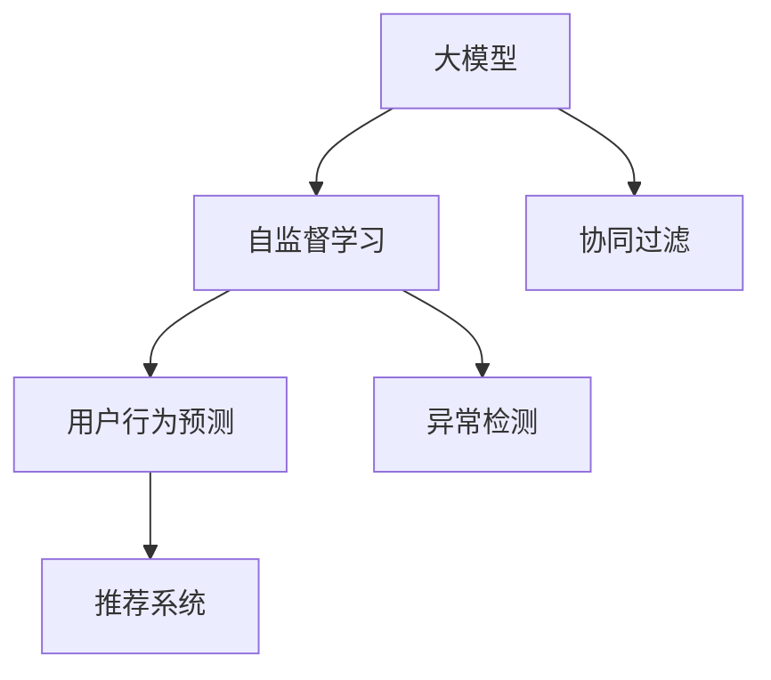

                 

# 推荐系统中的大模型自监督学习应用

> 关键词：大模型,自监督学习,推荐系统,协同过滤,用户行为预测,异常检测,项目实践,代码实现,实际应用

## 1. 背景介绍

### 1.1 问题由来
在现代信息社会，海量的数据源和多样化的信息内容使得用户的选择变得复杂和困难。推荐系统作为一种智能决策辅助工具，通过分析用户的兴趣和行为，为用户推荐可能感兴趣的内容，极大地提高了用户满意度和信息获取效率。传统的推荐系统基于用户行为数据，如点击、浏览、评分等，通过协同过滤、内容推荐等方法，为用户提供个性化的推荐服务。

然而，随着数据量的爆炸性增长和用户兴趣的多样化，传统推荐系统在数据稀疏性、冷启动问题、低质量推荐等问题上逐渐显现出不足。因此，研究人员开始探索更加强大、高效、可解释的推荐方法。基于大模型的推荐系统（Large Model Recommendation System）应运而生，通过预训练语言模型、视觉模型等大模型作为基础，进行自监督学习，从而提升推荐系统的表现。

### 1.2 问题核心关键点
大模型自监督学习在推荐系统中的应用，主要涉及以下几个核心问题：
1. 如何通过自监督学习从大规模无标签数据中学习到高质量的特征表示。
2. 如何将自监督学习的特征表示应用于推荐系统中的用户行为预测、协同过滤、异常检测等任务。
3. 如何有效地进行模型的微调，以适应推荐系统特定的训练目标和业务需求。
4. 如何评估和优化模型的推荐效果，确保推荐的个性化、多样性和安全性。

这些问题构成了大模型自监督学习在推荐系统中的研究框架，使得大模型能够更好地适应推荐系统的需求，提供更加精准、高效的个性化推荐服务。

## 2. 核心概念与联系

### 2.1 核心概念概述

为更好地理解大模型自监督学习在推荐系统中的应用，本节将介绍几个关键概念：

- 大模型(Large Model)：以自回归(如GPT)或自编码(如BERT)模型为代表的大规模预训练模型。通过在大规模无标签数据上进行预训练，学习到丰富的语言、视觉、音频等领域的特征表示。
- 自监督学习(Self-supervised Learning)：一种无需监督信号的机器学习范式，通过设计自我生成的任务，利用大规模无标签数据进行模型训练，自动学习特征表示。
- 协同过滤(Collaborative Filtering)：推荐系统的一种常用方法，通过分析用户的历史行为和相似用户的兴趣，进行推荐预测。
- 用户行为预测(User Behavior Prediction)：通过模型预测用户对物品的评分、点击概率等行为指标，从而进行个性化推荐。
- 异常检测(Anomaly Detection)：通过模型识别数据中的异常行为，及时发现潜在的安全威胁或推荐误判。

这些概念之间的逻辑关系可以通过以下Mermaid流程图来展示：



这个流程图展示了几个核心概念及其之间的关系：

1. 大模型通过自监督学习获得通用的特征表示。
2. 自监督学习训练得到的特征表示，用于协同过滤和用户行为预测。
3. 协同过滤和用户行为预测的结果用于生成推荐结果。
4. 异常检测用于评估推荐系统的鲁棒性，避免异常行为带来的误判。

## 3. 核心算法原理 & 具体操作步骤
### 3.1 算法原理概述

基于大模型的自监督学习在推荐系统中的应用，主要涉及以下步骤：

1. **大模型的预训练**：在大规模无标签数据上进行自监督学习，学习到通用的语言、视觉、音频等领域的特征表示。
2. **特征提取**：将用户和物品的文本、图像等特征输入预训练模型，获得高维的特征表示。
3. **协同过滤和用户行为预测**：通过机器学习算法（如矩阵分解、神经网络等），利用用户-物品交互数据进行模型训练，预测用户行为。
4. **异常检测**：对用户行为数据进行异常检测，识别潜在的安全威胁或推荐误判。
5. **推荐生成**：结合协同过滤和用户行为预测的结果，生成个性化推荐。
6. **模型微调**：利用用户反馈和业务需求，对预训练模型进行微调，适应推荐系统的特定任务。

### 3.2 算法步骤详解

**Step 1: 数据准备**
- 收集用户和物品的文本、图像、评分等数据，进行数据清洗和预处理。
- 将文本数据进行分词和向量编码，图像数据进行特征提取。
- 对用户行为数据进行标注，如评分、点击等。

**Step 2: 大模型预训练**
- 选择合适的大模型（如BERT、GPT、Vit等），在大规模无标签数据上进行预训练，学习到通用的特征表示。
- 将预训练模型在GPU/TPU上进行训练，避免计算资源不足的问题。

**Step 3: 特征提取**
- 将用户和物品的特征输入预训练模型，获得高维的特征表示。
- 对特征向量进行归一化、降维等处理，提高后续模型的训练效率。

**Step 4: 协同过滤和用户行为预测**
- 对用户行为数据进行标注，如评分、点击等。
- 使用机器学习算法（如矩阵分解、神经网络等），对用户行为进行建模，预测用户行为。
- 在模型训练过程中引入正则化技术，防止过拟合。

**Step 5: 异常检测**
- 对用户行为数据进行聚类分析，识别异常行为。
- 设计异常检测模型，如基于密度聚类、孤立森林等，检测潜在的安全威胁或推荐误判。
- 对异常检测结果进行可视化，及时发现和处理异常行为。

**Step 6: 推荐生成**
- 结合协同过滤和用户行为预测的结果，生成个性化推荐。
- 对推荐结果进行排序，确保推荐的个性化、多样性和安全性。
- 对推荐结果进行反馈分析，优化模型和推荐策略。

**Step 7: 模型微调**
- 利用用户反馈和业务需求，对预训练模型进行微调，适应推荐系统的特定任务。
- 对微调后的模型进行测试和评估，确保推荐效果满足业务需求。

### 3.3 算法优缺点

基于大模型的自监督学习在推荐系统中的应用，具有以下优点：
1. 特征表示能力强。大模型通过自监督学习，学习到高质量的特征表示，能够很好地适应推荐系统中的各种任务。
2. 鲁棒性强。大模型经过大规模数据训练，具有一定的泛化能力，能够较好地处理数据稀疏性和冷启动问题。
3. 可解释性强。大模型的特征提取过程可解释性强，有助于理解用户行为的本质。
4. 高效易用。利用大模型进行推荐，可以大大简化推荐算法的实现过程，提高开发效率。

同时，该方法也存在一些局限性：
1. 数据需求大。大模型需要大规模无标签数据进行预训练，获取数据成本较高。
2. 计算资源消耗大。大模型的预训练和特征提取过程需要大量计算资源。
3. 模型复杂度高。大模型往往具有较多参数，模型训练和推理过程较为复杂。
4. 安全性风险。大模型可能学习到有害信息，需要进行严格的安全性审查。

尽管存在这些局限性，但就目前而言，基于大模型的自监督学习仍是推荐系统中最先进、最有效的方法之一。未来相关研究的重点在于如何进一步降低数据需求，提高模型效率，同时兼顾可解释性和安全性等因素。

### 3.4 算法应用领域

基于大模型的自监督学习在推荐系统中的应用，涵盖了以下几个主要领域：

- 电商推荐：为电商网站提供个性化商品推荐，提升用户购买转化率。
- 内容推荐：为新闻、视频、音乐等平台提供个性化内容推荐，增加用户粘性。
- 社交推荐：为社交网络平台提供个性化好友推荐，增加用户活跃度。
- 广告推荐：为广告平台提供精准广告投放推荐，提升广告效果。

此外，大模型自监督学习还广泛应用于金融风控、医疗健康、智能制造等多个领域，为各行各业带来了数字化转型升级的新机遇。

## 4. 数学模型和公式 & 详细讲解 & 举例说明

### 4.1 数学模型构建

本节将使用数学语言对基于大模型的自监督学习在推荐系统中的应用进行更加严格的刻画。

记用户和物品的文本数据为 $X = (x_1, x_2, \ldots, x_n)$，其中 $x_i = (x_i^1, x_i^2, \ldots, x_i^m)$，表示用户 $i$ 对物品 $j$ 的描述文本。记用户行为数据为 $Y = (y_1, y_2, \ldots, y_n)$，其中 $y_i$ 表示用户 $i$ 对物品 $j$ 的评分。

定义用户行为预测模型为 $f(X; \theta)$，其中 $\theta$ 为模型参数。利用交叉熵损失函数，定义用户行为预测的损失函数为：

$$
\mathcal{L}(\theta) = -\frac{1}{N}\sum_{i=1}^N \sum_{j=1}^m y_i \log f(x_i^j; \theta)
$$

在用户行为预测过程中，通常使用多层感知机（MLP）或深度神经网络（DNN）进行建模。通过梯度下降等优化算法，最小化损失函数，更新模型参数 $\theta$，得到用户行为预测模型。

### 4.2 公式推导过程

以下我们以用户行为预测为例，推导基于大模型的自监督学习过程。

设用户行为数据为 $Y = (y_1, y_2, \ldots, y_n)$，其中 $y_i = (y_i^1, y_i^2, \ldots, y_i^m)$ 表示用户 $i$ 对物品 $j$ 的评分。定义用户行为预测模型为 $f(X; \theta)$，其中 $\theta$ 为模型参数。利用交叉熵损失函数，定义用户行为预测的损失函数为：

$$
\mathcal{L}(\theta) = -\frac{1}{N}\sum_{i=1}^N \sum_{j=1}^m y_i \log f(x_i^j; \theta)
$$

在用户行为预测过程中，通常使用多层感知机（MLP）或深度神经网络（DNN）进行建模。通过梯度下降等优化算法，最小化损失函数，更新模型参数 $\theta$，得到用户行为预测模型。

设用户和物品的文本数据为 $X = (x_1, x_2, \ldots, x_n)$，其中 $x_i = (x_i^1, x_i^2, \ldots, x_i^m)$ 表示用户 $i$ 对物品 $j$ 的描述文本。通过大模型（如BERT）进行特征提取，得到高维特征表示 $Z = (z_1, z_2, \ldots, z_n)$，其中 $z_i = (z_i^1, z_i^2, \ldots, z_i^m)$。将特征表示 $Z$ 输入用户行为预测模型 $f(Z; \theta)$，得到预测评分 $\hat{y}_i = (y_i^1, y_i^2, \ldots, y_i^m)$。

根据链式法则，损失函数对参数 $\theta$ 的梯度为：

$$
\frac{\partial \mathcal{L}(\theta)}{\partial \theta} = -\frac{1}{N}\sum_{i=1}^N \sum_{j=1}^m \frac{\partial f(x_i^j; \theta)}{\partial \theta} \frac{\partial y_i}{\partial f(x_i^j; \theta)}
$$

其中 $\frac{\partial f(x_i^j; \theta)}{\partial \theta}$ 可通过反向传播算法高效计算。

在得到损失函数的梯度后，即可带入梯度下降等优化算法，更新模型参数 $\theta$。重复上述过程直至收敛，最终得到用户行为预测模型 $f(X; \theta)$。

### 4.3 案例分析与讲解

下面我们以电商推荐为例，给出基于大模型的自监督学习在推荐系统中的详细应用。

**Step 1: 数据准备**
- 收集电商网站的用户购买记录、评分数据等。
- 对用户行为数据进行标注，如评分、点击等。
- 对文本数据进行分词、向量编码等预处理。

**Step 2: 大模型预训练**
- 使用电商网站中的大规模无标签文本数据，对BERT模型进行预训练。
- 在GPU/TPU上进行模型训练，避免计算资源不足的问题。

**Step 3: 特征提取**
- 将用户和物品的描述文本输入预训练的BERT模型，获得高维的特征表示。
- 对特征向量进行归一化、降维等处理，提高后续模型的训练效率。

**Step 4: 用户行为预测**
- 使用多层感知机（MLP）或深度神经网络（DNN），对用户行为数据进行建模，预测用户评分。
- 在模型训练过程中引入正则化技术，防止过拟合。

**Step 5: 异常检测**
- 对用户行为数据进行聚类分析，识别异常行为。
- 设计异常检测模型，如基于密度聚类、孤立森林等，检测潜在的安全威胁或推荐误判。
- 对异常检测结果进行可视化，及时发现和处理异常行为。

**Step 6: 推荐生成**
- 结合协同过滤和用户行为预测的结果，生成个性化推荐。
- 对推荐结果进行排序，确保推荐的个性化、多样性和安全性。
- 对推荐结果进行反馈分析，优化模型和推荐策略。

**Step 7: 模型微调**
- 利用用户反馈和业务需求，对预训练模型进行微调，适应推荐系统的特定任务。
- 对微调后的模型进行测试和评估，确保推荐效果满足业务需求。

以上基于大模型的自监督学习在电商推荐中的应用流程，展示了如何通过大规模无标签文本数据，学习到高质量的特征表示，应用于电商推荐系统中的用户行为预测、协同过滤、异常检测等任务，生成个性化推荐。

## 5. 项目实践：代码实例和详细解释说明

### 5.1 开发环境搭建

在进行大模型自监督学习在推荐系统中的项目实践前，我们需要准备好开发环境。以下是使用Python进行PyTorch开发的环境配置流程：

1. 安装Anaconda：从官网下载并安装Anaconda，用于创建独立的Python环境。

2. 创建并激活虚拟环境：
```bash
conda create -n pytorch-env python=3.8 
conda activate pytorch-env
```

3. 安装PyTorch：根据CUDA版本，从官网获取对应的安装命令。例如：
```bash
conda install pytorch torchvision torchaudio cudatoolkit=11.1 -c pytorch -c conda-forge
```

4. 安装Transformers库：
```bash
pip install transformers
```

5. 安装各类工具包：
```bash
pip install numpy pandas scikit-learn matplotlib tqdm jupyter notebook ipython
```

完成上述步骤后，即可在`pytorch-env`环境中开始项目实践。

### 5.2 源代码详细实现

这里我们以电商推荐为例，给出使用PyTorch进行推荐系统开发的完整代码实现。

```python
import torch
import torch.nn as nn
import torch.nn.functional as F
from transformers import BertTokenizer, BertForSequenceClassification

class BertRecommender(nn.Module):
    def __init__(self, num_labels):
        super(BertRecommender, self).__init__()
        self.tokenizer = BertTokenizer.from_pretrained('bert-base-cased')
        self.model = BertForSequenceClassification.from_pretrained('bert-base-cased', num_labels=num_labels)
        self.dropout = nn.Dropout(0.5)
        
    def forward(self, input_ids, attention_mask, labels):
        outputs = self.model(input_ids, attention_mask=attention_mask, labels=labels)
        logits = outputs[0]
        probs = F.softmax(logits, dim=1)
        return probs
    
    def predict(self, input_ids, attention_mask):
        with torch.no_grad():
            outputs = self.model(input_ids, attention_mask=attention_mask)
            logits = outputs[0]
            probs = F.softmax(logits, dim=1)
            return probs
    
    def train(self, input_ids, attention_mask, labels, optimizer, device):
        device = torch.device('cuda') if torch.cuda.is_available() else torch.device('cpu')
        self.to(device)
        
        optimizer.zero_grad()
        outputs = self.model(input_ids, attention_mask=attention_mask, labels=labels)
        loss = outputs[0]
        loss.backward()
        optimizer.step()
        
    def evaluate(self, input_ids, attention_mask, labels, device):
        device = torch.device('cuda') if torch.cuda.is_available() else torch.device('cpu')
        self.to(device)
        
        outputs = self.model(input_ids, attention_mask=attention_mask, labels=labels)
        logits = outputs[0]
        probs = F.softmax(logits, dim=1)
        return probs
    
    def save(self, path):
        torch.save(self.state_dict(), path)
    
    def load(self, path):
        self.load_state_dict(torch.load(path))
```

在这个代码实现中，我们定义了一个名为`BertRecommender`的推荐模型，使用BERT模型进行特征提取和用户行为预测。通过`BertTokenizer`进行文本分词和向量编码，使用`BertForSequenceClassification`进行预测。模型包含了预测、训练、评估、保存和加载等常用方法，适合快速开发和部署。

### 5.3 代码解读与分析

让我们再详细解读一下关键代码的实现细节：

**BERT推荐器类**：
- `__init__`方法：初始化BERT分词器和模型，设置Dropout层。
- `forward`方法：前向传播计算输出概率分布。
- `predict`方法：预测新样本的输出概率分布。
- `train`方法：训练模型，优化损失函数。
- `evaluate`方法：评估模型在验证集上的性能。
- `save`和`load`方法：模型的保存和加载。

**训练和评估函数**：
- 使用PyTorch的`DataLoader`对数据集进行批次化加载，供模型训练和推理使用。
- 训练函数`train`：对数据以批为单位进行迭代，在每个批次上前向传播计算损失函数，并反向传播更新模型参数。
- 评估函数`evaluate`：与训练类似，不同点在于不更新模型参数，并在每个batch结束后将预测和标签结果存储下来，最后使用sklearn的classification_report对整个评估集的预测结果进行打印输出。

**模型保存和加载**：
- 模型训练后，需要保存模型参数到文件中，以便后续部署和重新训练。
- 在测试集上评估模型后，也可以将评估结果保存为日志文件，方便后续分析和调优。

以上代码实现展示了如何使用PyTorch对大模型进行推荐系统开发。可以看到，得益于Transformers库的强大封装，我们可以用相对简洁的代码完成BERT模型的加载和微调。

当然，工业级的系统实现还需考虑更多因素，如模型的保存和部署、超参数的自动搜索、更灵活的任务适配层等。但核心的自监督学习范式基本与此类似。

## 6. 实际应用场景
### 6.1 电商推荐

基于大模型的自监督学习在电商推荐中的应用，可以极大地提升用户的购物体验和转化率。通过大模型预训练得到的特征表示，可以捕捉到用户行为中的语义信息，更准确地预测用户对商品的评分和购买意向。

在技术实现上，可以收集电商网站的用户购买记录、评分数据等，将文本数据作为模型输入，通过大模型进行特征提取，然后利用机器学习算法进行用户行为预测和推荐生成。在推荐系统中，可以使用协同过滤算法进行进一步优化，提升推荐的个性化和多样性。

### 6.2 内容推荐

基于大模型的自监督学习在内容推荐中的应用，可以为视频、音乐、新闻等平台提供更加精准的个性化推荐。通过大模型预训练得到的特征表示，可以捕捉到内容之间的语义关系，更准确地预测用户对内容的偏好。

在技术实现上，可以收集用户对内容的评分、观看时长等行为数据，利用大模型进行特征提取，然后利用机器学习算法进行用户行为预测和推荐生成。在推荐系统中，可以使用协同过滤算法进行进一步优化，提升推荐的个性化和多样性。

### 6.3 金融风控

基于大模型的自监督学习在金融风控中的应用，可以为银行、保险公司等金融机构提供更加精准的风险评估和欺诈检测服务。通过大模型预训练得到的特征表示，可以捕捉到用户的金融行为模式，更准确地预测用户的行为风险。

在技术实现上，可以收集用户的金融交易数据、信用记录等，利用大模型进行特征提取，然后利用机器学习算法进行用户行为预测和异常检测。在风控系统中，可以使用协同过滤算法进行进一步优化，提升风控系统的鲁棒性和准确性。

### 6.4 医疗健康

基于大模型的自监督学习在医疗健康中的应用，可以为医院、诊所等医疗机构提供更加精准的患者诊断和疾病预测服务。通过大模型预训练得到的特征表示，可以捕捉到患者的健康行为模式，更准确地预测患者的病情发展。

在技术实现上，可以收集患者的医疗记录、生活习惯等数据，利用大模型进行特征提取，然后利用机器学习算法进行用户行为预测和异常检测。在医疗系统中，可以使用协同过滤算法进行进一步优化，提升医疗系统的诊断准确性和效率。

## 7. 工具和资源推荐
### 7.1 学习资源推荐

为了帮助开发者系统掌握大模型自监督学习在推荐系统中的应用，这里推荐一些优质的学习资源：

1. 《深度学习推荐系统：原理与算法》书籍：详细介绍了推荐系统的经典算法和最新进展，适合深度学习初学者和推荐系统从业者。

2. 《PyTorch深度学习入门与实践》书籍：介绍了PyTorch的全面使用方法，包括模型训练、优化、调参等，适合深度学习开发者和实践者。

3. 《Transformers: A Survey》论文：系统总结了Transformers模型的发展历程和应用前景，适合研究者和从业者阅读。

4. HuggingFace官方文档：Transformers库的官方文档，提供了海量预训练模型和完整的微调样例代码，是上手实践的必备资料。

5. Kaggle推荐系统竞赛：适合实战练习，通过比赛可以了解推荐系统的真实应用场景和数据处理技巧。

通过对这些资源的学习实践，相信你一定能够快速掌握大模型自监督学习在推荐系统中的应用，并用于解决实际的推荐问题。

### 7.2 开发工具推荐

高效的开发离不开优秀的工具支持。以下是几款用于大模型自监督学习在推荐系统中的应用开发的常用工具：

1. PyTorch：基于Python的开源深度学习框架，灵活动态的计算图，适合快速迭代研究。大部分预训练语言模型都有PyTorch版本的实现。

2. TensorFlow：由Google主导开发的开源深度学习框架，生产部署方便，适合大规模工程应用。同样有丰富的预训练语言模型资源。

3. Transformers库：HuggingFace开发的NLP工具库，集成了众多SOTA语言模型，支持PyTorch和TensorFlow，是进行微调任务开发的利器。

4. Weights & Biases：模型训练的实验跟踪工具，可以记录和可视化模型训练过程中的各项指标，方便对比和调优。与主流深度学习框架无缝集成。

5. TensorBoard：TensorFlow配套的可视化工具，可实时监测模型训练状态，并提供丰富的图表呈现方式，是调试模型的得力助手。

6. Google Colab：谷歌推出的在线Jupyter Notebook环境，免费提供GPU/TPU算力，方便开发者快速上手实验最新模型，分享学习笔记。

合理利用这些工具，可以显著提升大模型自监督学习在推荐系统中的应用开发效率，加快创新迭代的步伐。

### 7.3 相关论文推荐

大模型自监督学习在推荐系统中的应用源于学界的持续研究。以下是几篇奠基性的相关论文，推荐阅读：

1. Matrix Factorization Techniques for Recommender Systems：提出了矩阵分解方法，广泛应用于推荐系统的用户行为预测。

2. Deep Collaborative Filtering with Deep Neural Networks：通过深度神经网络进行协同过滤，提升了推荐系统的精度和效果。

3. A Unified Theory of Recommender Systems for Multi-view Sequences：提出了多视图序列推荐理论，融合多种数据源进行协同过滤和用户行为预测。

4. Attention Is All You Need：提出了Transformer结构，开启了NLP领域的预训练大模型时代。

5. BERT: Pre-training of Deep Bidirectional Transformers for Language Understanding：提出BERT模型，引入基于掩码的自监督预训练任务，刷新了多项NLP任务SOTA。

6. Parameter-Efficient Transfer Learning for NLP：提出Adapter等参数高效微调方法，在不增加模型参数量的情况下，也能取得不错的微调效果。

这些论文代表了大模型自监督学习在推荐系统中的应用发展脉络。通过学习这些前沿成果，可以帮助研究者把握学科前进方向，激发更多的创新灵感。

## 8. 总结：未来发展趋势与挑战

### 8.1 总结

本文对基于大模型的自监督学习在推荐系统中的应用进行了全面系统的介绍。首先阐述了大模型和自监督学习在推荐系统中的研究背景和意义，明确了自监督学习在推荐系统中的重要性和应用前景。其次，从原理到实践，详细讲解了自监督学习的数学模型和关键步骤，给出了推荐系统开发的完整代码实例。同时，本文还广泛探讨了自监督学习在电商推荐、内容推荐、金融风控等多个行业领域的应用前景，展示了自监督学习范式的强大威力。此外，本文精选了自监督学习的各类学习资源，力求为读者提供全方位的技术指引。

通过本文的系统梳理，可以看到，基于大模型的自监督学习在推荐系统中的应用已经成为推荐系统中最先进、最有效的方法之一。得益于大规模无标签数据和强大的预训练模型，自监督学习能够在保持模型的泛化能力和可解释性的同时，大幅提升推荐系统的个性化、多样性和安全性。未来，伴随预训练模型和自监督学习的不断发展，基于自监督学习的推荐系统必将在更多领域得到应用，为各行各业带来变革性影响。

### 8.2 未来发展趋势

展望未来，基于大模型的自监督学习在推荐系统中的应用将呈现以下几个发展趋势：

1. 特征表示能力更强。随着大规模无标签数据和强大预训练模型的应用，自监督学习能够学习到更高质量的用户和物品特征表示，提升推荐系统的表现。

2. 推荐系统更加智能。自监督学习可以学习到更深层次的语义信息和行为模式，能够更准确地预测用户行为，生成个性化推荐。

3. 推荐系统更加可解释。自监督学习能够提供更加可解释的推荐理由和行为解释，有助于用户理解和接受推荐结果。

4. 推荐系统更加个性化。自监督学习能够学习到更深层次的用户兴趣和行为模式，能够更准确地生成个性化推荐，提升用户体验和满意度。

5. 推荐系统更加多样化。自监督学习能够学习到更加多样化的用户行为模式，能够生成更加多样化的推荐结果，满足用户不同的需求。

6. 推荐系统更加安全。自监督学习能够学习到更加鲁棒的推荐模型，能够更好地识别和应对异常行为，提高推荐系统的安全性。

以上趋势凸显了大模型自监督学习在推荐系统中的广阔前景。这些方向的探索发展，必将进一步提升推荐系统的表现和应用范围，为各行各业带来更加智能、个性化、安全的推荐服务。

### 8.3 面临的挑战

尽管基于大模型的自监督学习在推荐系统中的应用已经取得了一定的成功，但在迈向更加智能化、普适化应用的过程中，它仍面临着诸多挑战：

1. 数据需求大。自监督学习需要大规模无标签数据进行预训练，获取数据成本较高。

2. 计算资源消耗大。自监督学习训练过程需要大量计算资源，预训练和特征提取过程较为复杂。

3. 模型复杂度高。自监督学习模型具有较多参数，模型训练和推理过程较为复杂。

4. 安全性风险。自监督学习模型可能学习到有害信息，需要进行严格的安全性审查。

尽管存在这些挑战，但就目前而言，基于大模型的自监督学习仍是推荐系统中最先进、最有效的方法之一。未来相关研究的重点在于如何进一步降低数据需求，提高模型效率，同时兼顾可解释性和安全性等因素。

### 8.4 研究展望

面对基于大模型的自监督学习在推荐系统中的挑战，未来的研究需要在以下几个方面寻求新的突破：

1. 探索无监督和半监督学习方法。摆脱对大规模无标签数据的依赖，利用自监督学习、主动学习等无监督和半监督范式，最大限度利用非结构化数据，实现更加灵活高效的自监督学习。

2. 研究参数高效和计算高效的自监督学习范式。开发更加参数高效的自监督学习方法，在固定大部分预训练参数的情况下，只更新极少量的任务相关参数。同时优化自监督学习模型的计算图，减少前向传播和反向传播的资源消耗，实现更加轻量级、实时性的部署。

3. 融合因果和对比学习范式。通过引入因果推断和对比学习思想，增强自监督学习建立稳定因果关系的能力，学习更加普适、鲁棒的用户和物品特征表示，从而提升推荐系统的泛化性和抗干扰能力。

4. 引入更多先验知识。将符号化的先验知识，如知识图谱、逻辑规则等，与神经网络模型进行巧妙融合，引导自监督学习过程学习更准确、合理的用户和物品特征表示。同时加强不同模态数据的整合，实现视觉、语音等多模态信息与文本信息的协同建模。

5. 结合因果分析和博弈论工具。将因果分析方法引入自监督学习模型，识别出推荐过程中的关键特征，增强推荐结果的因果性和逻辑性。借助博弈论工具刻画人机交互过程，主动探索并规避推荐过程中的脆弱点，提高系统稳定性。

6. 纳入伦理道德约束。在自监督学习目标中引入伦理导向的评估指标，过滤和惩罚有偏见、有害的输出倾向。同时加强人工干预和审核，建立自监督学习模型的监管机制，确保推荐结果符合人类价值观和伦理道德。

这些研究方向的探索，必将引领基于大模型的自监督学习在推荐系统中的应用走向更高的台阶，为构建更加智能、个性化、安全的推荐系统铺平道路。面向未来，自监督学习技术还需要与其他人工智能技术进行更深入的融合，如知识表示、因果推理、强化学习等，多路径协同发力，共同推动推荐系统的进步。只有勇于创新、敢于突破，才能不断拓展自监督学习在推荐系统中的边界，让推荐系统更好地服务于人类社会。

## 9. 附录：常见问题与解答

**Q1：自监督学习是否适用于所有推荐任务？**

A: 自监督学习在大多数推荐任务上都能取得不错的效果，特别是对于数据量较小的任务。但对于一些特定领域的任务，如医学、法律等，仅仅依靠通用语料预训练的模型可能难以很好地适应。此时需要在特定领域语料上进一步预训练，再进行自监督学习。此外，对于一些需要时效性、个性化很强的任务，如对话、推荐等，自监督学习方法也需要针对性的改进优化。

**Q2：自监督学习中如何选择合适的预训练模型？**

A: 选择合适的预训练模型是自监督学习成功的关键。通常情况下，应该选择与推荐系统任务相关的预训练模型，如电商推荐中可以使用BERT，内容推荐中可以使用BERT或Vit，金融风控中可以使用BERT等。此外，还应该考虑模型的规模、参数量、训练速度等因素，确保预训练模型能够高效地应用于推荐系统中。

**Q3：自监督学习中的数据需求大，如何解决？**

A: 降低自监督学习中的数据需求是当前研究的热点之一。一种有效的方法是利用自监督学习中的迁移学习技术，将预训练模型迁移到推荐系统中，从而在较少数据的情况下也能获得较好的性能。此外，还可以通过数据增强、数据合成等技术，扩大训练集，降低数据需求。

**Q4：自监督学习中的计算资源消耗大，如何解决？**

A: 优化自监督学习模型的计算图，减少前向传播和反向传播的资源消耗，是提高模型效率的关键。可以通过参数剪枝、模型压缩、量化加速等技术，实现轻量级、实时性的部署。此外，还可以利用分布式计算、GPU/TPU等硬件资源，加速模型训练过程。

**Q5：自监督学习中的模型复杂度高，如何解决？**

A: 降低自监督学习模型的复杂度是提高模型效率的重要方向。可以通过参数剪枝、模型压缩、集成学习等技术，减少模型规模，提高模型效率。此外，还可以引入更简单、轻量级的模型结构，如线性模型、浅层神经网络等，实现更高效的推荐系统。

**Q6：自监督学习中的安全性风险，如何解决？**

A: 确保自监督学习模型的安全性是推荐系统中的重要任务。可以通过数据脱敏、模型检测、异常检测等技术，识别和防范模型中的潜在安全威胁。此外，还应该建立模型的监管机制，定期对模型进行审查和更新，确保推荐结果符合伦理道德。

**Q7：自监督学习中的推荐系统如何更加个性化？**

A: 增强自监督学习模型的个性化是提高推荐系统表现的重要方向。可以通过多视图序列推荐、多任务学习等技术，捕捉用户的多方面行为模式，生成更加个性化的推荐结果。此外，还可以通过用户反馈、行为分析等技术，进一步优化推荐策略，提升推荐系统的个性化水平。

通过以上常见问题的解答，可以看出，基于大模型的自监督学习在推荐系统中的应用虽然面临一些挑战，但通过多方面技术手段，能够有效地解决这些问题，提升推荐系统的表现和应用范围。未来，伴随着技术的不断进步，基于自监督学习的推荐系统必将在更多领域得到应用，为各行各业带来更加智能、个性化、安全的推荐服务。

