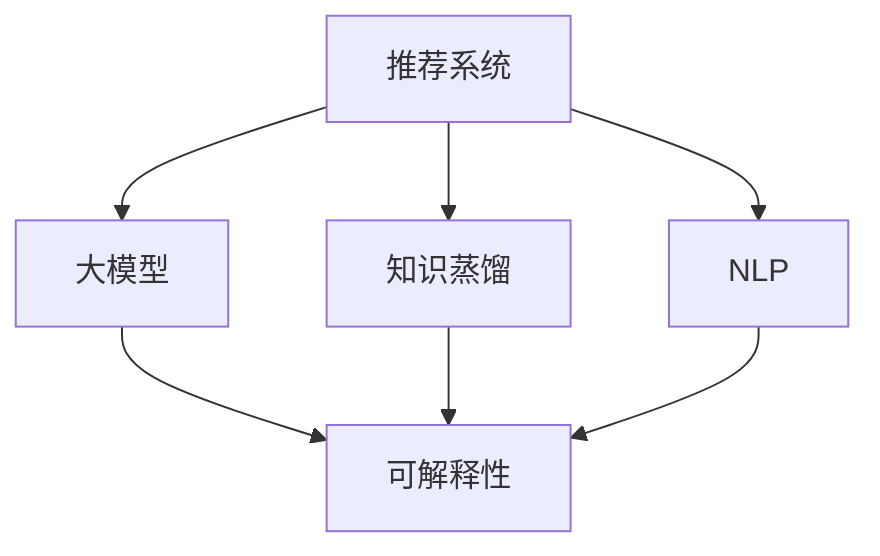

                 

# 推荐系统的可解释性：大模型的新思路

## 1. 背景介绍

随着人工智能技术的飞速发展，推荐系统已深入到电商、社交、新闻等多个行业，极大地改变了用户的消费行为和信息获取方式。推荐系统通常基于用户历史行为、商品特征等数据，预测用户可能感兴趣的商品，通过展示排序推荐给用户。然而，推荐系统常被指责为"黑盒"，用户难以理解推荐结果的生成逻辑和原因。这种缺乏可解释性的问题，严重影响了用户的信任度和推荐系统的公正性。

为了解决这一问题，大模型在推荐系统中的应用逐渐受到关注。大模型通常具有强大的语义理解能力和泛化能力，能够根据用户输入的自然语言查询，进行深层次的意图理解，从而生成更具相关性的推荐。但大模型的可解释性问题同样严峻，用户难以理解模型推荐的具体依据和逻辑，难以对其推荐的准确性和公平性进行评估。因此，如何赋予大模型推荐系统更强的可解释性，成为当前研究的一个重要方向。

## 2. 核心概念与联系

### 2.1 核心概念概述

为更好地理解大模型在推荐系统中的应用及可解释性问题，本节将介绍几个密切相关的核心概念：

- 推荐系统(Recommendation System, RS)：旨在根据用户历史行为、兴趣偏好等数据，预测用户可能感兴趣的商品、内容等，以提升用户体验和转化率。
- 大模型(Pre-trained Model)：指通过在大规模无标签文本数据上自监督预训练获得语言表示能力的深度学习模型。常见的大模型有BERT、GPT、RoBERTa等。
- 可解释性(Explainability)：指机器学习模型的决策过程是否能够被人类理解和解释。推荐系统的可解释性，指用户能否理解推荐结果的生成依据和逻辑。
- 知识蒸馏(Knowledge Distillation)：通过迁移学习的方式，将复杂大模型的预测结果，作为教师模型对简单小模型进行指导，以提升小模型的性能。
- 自然语言处理(Natural Language Processing, NLP)：研究计算机如何理解、处理、生成自然语言，是大模型在推荐系统中应用的重要基础。

这些核心概念之间的逻辑关系可以通过以下Mermaid流程图来展示：



这个流程图展示了大模型在推荐系统中的应用，及其与可解释性和NLP的关联：

1. 推荐系统通过大模型获得更强大的语言理解能力，提升推荐的准确性和多样性。
2. 大模型的可解释性问题，需要通过知识蒸馏、NLP等方法加以解决。
3. 通过可解释性技术，用户可以理解推荐系统的决策依据，提升用户满意度。

## 3. 核心算法原理 & 具体操作步骤
### 3.1 算法原理概述

大模型在推荐系统中的应用，本质上是一种基于自然语言处理的推荐方法。其核心思想是：利用大模型在预训练过程中学习到的语言知识，通过用户输入的查询语句，生成语义相关的推荐结果。

形式化地，假设用户输入的自然语言查询为 $Q$，预训练语言模型为 $M_{\theta}$，输出推荐结果为 $R$。推荐系统的目标函数为：

$$
\min_{\theta} \mathcal{L}(Q, R) = \mathcal{L}(Q, M_{\theta})
$$

其中 $\mathcal{L}$ 为损失函数，用于衡量用户查询 $Q$ 与推荐结果 $R$ 的差距。常见的损失函数包括交叉熵损失、均方误差损失等。

为了提升模型的推荐精度和可解释性，我们通常在大模型的顶层添加任务适配层，设计合适的输出层和损失函数，并对模型进行微调。在微调过程中，模型的权重不断更新，以最小化损失函数，最终得到优化后的模型参数 $\hat{\theta}$。

### 3.2 算法步骤详解

大模型在推荐系统中的操作步骤主要包括以下几个关键步骤：

**Step 1: 准备预训练模型和数据集**
- 选择合适的预训练语言模型 $M_{\theta}$ 作为初始化参数，如 BERT、GPT 等。
- 准备推荐任务的数据集 $D=\{(Q_i, R_i)\}_{i=1}^N$，其中 $Q_i$ 为用户输入的自然语言查询，$R_i$ 为推荐结果。

**Step 2: 添加任务适配层**
- 根据推荐任务类型，在预训练模型的顶层设计合适的输出层和损失函数。
- 对于推荐任务，通常使用语言模型的解码器输出概率分布，并以负对数似然为损失函数。

**Step 3: 设置微调超参数**
- 选择合适的优化算法及其参数，如 AdamW、SGD 等，设置学习率、批大小、迭代轮数等。
- 设置正则化技术及强度，包括权重衰减、Dropout、Early Stopping等。
- 确定冻结预训练参数的策略，如仅微调顶层，或全部参数都参与微调。

**Step 4: 执行梯度训练**
- 将训练集数据分批次输入模型，前向传播计算损失函数。
- 反向传播计算参数梯度，根据设定的优化算法和学习率更新模型参数。
- 周期性在验证集上评估模型性能，根据性能指标决定是否触发 Early Stopping。
- 重复上述步骤直到满足预设的迭代轮数或 Early Stopping 条件。

**Step 5: 测试和部署**
- 在测试集上评估微调后模型 $M_{\hat{\theta}}$ 的性能，对比微调前后的精度提升。
- 使用微调后的模型对新查询进行推理预测，集成到实际的应用系统中。
- 持续收集新的数据，定期重新微调模型，以适应数据分布的变化。

以上是使用大模型进行推荐系统的微调一般流程。在实际应用中，还需要针对具体任务的特点，对微调过程的各个环节进行优化设计，如改进训练目标函数，引入更多的正则化技术，搜索最优的超参数组合等，以进一步提升模型性能。

### 3.3 算法优缺点

大模型在推荐系统中的应用具有以下优点：
1. 强大的语义理解能力。大模型通过预训练获得丰富的语言知识，可以更好地理解用户查询的自然语言表达，生成更准确的推荐。
2. 灵活性高。大模型可以灵活适应不同种类的推荐任务，如商品推荐、新闻推荐、视频推荐等。
3. 泛化能力强。大模型通过预训练获得通用语言表示，可以较好地泛化到新的数据和领域。
4. 可解释性增强。大模型可以通过可解释性技术，使用户理解推荐结果的生成依据。

但同时，也存在一些局限性：
1. 计算资源需求高。大模型的训练和推理需要大量的计算资源，对硬件设备要求较高。
2. 预测时间长。大模型通常具有较深的网络结构，导致推理速度较慢，无法实现实时推荐。
3. 数据依赖性大。推荐系统的效果很大程度上取决于标注数据的质量和数量，获取高质量标注数据的成本较高。
4. 公平性问题。大模型容易学习到用户数据中的偏见，导致推荐结果存在公平性问题。

尽管存在这些局限性，但就目前而言，大模型在推荐系统中的应用已显示出巨大的潜力，成为推荐系统研究的重要方向。

### 3.4 算法应用领域

大模型在推荐系统中的应用已经覆盖了多个领域，例如：

- 电商推荐：根据用户历史购买记录，推荐可能感兴趣的商品。
- 新闻推荐：根据用户阅读历史，推荐可能感兴趣的新闻文章。
- 视频推荐：根据用户观看历史，推荐可能感兴趣的视频内容。
- 音乐推荐：根据用户听歌历史，推荐可能喜欢的音乐。
- 智能家居推荐：根据用户行为数据，推荐可能感兴趣的家居商品。

除了以上这些经典应用外，大模型还被创新性地应用到更多场景中，如旅游推荐、美食推荐、在线学习推荐等，为推荐系统带来了全新的突破。

## 4. 数学模型和公式 & 详细讲解 & 举例说明
### 4.1 数学模型构建

在推荐系统的实际应用中，我们通常需要构建以下数学模型：

假设用户输入的自然语言查询为 $Q$，预训练语言模型为 $M_{\theta}$，输出推荐结果为 $R$。推荐系统的目标函数为：

$$
\min_{\theta} \mathcal{L}(Q, R) = \mathcal{L}(Q, M_{\theta})
$$

其中 $\mathcal{L}$ 为损失函数，用于衡量用户查询 $Q$ 与推荐结果 $R$ 的差距。常见的损失函数包括交叉熵损失、均方误差损失等。

### 4.2 公式推导过程

以交叉熵损失函数为例，进行形式化推导：

假设用户输入的自然语言查询为 $Q$，推荐结果为 $R$，推荐模型的输出为 $y = M_{\theta}(Q)$。推荐系统的交叉熵损失函数定义为：

$$
\mathcal{L}(Q, y) = -\frac{1}{N}\sum_{i=1}^N [y_i \log \hat{y}_i + (1-y_i) \log (1-\hat{y}_i)]
$$

其中 $y_i$ 为推荐结果 $R_i$ 是否被用户点击或互动的标记，$\hat{y}_i$ 为模型预测用户是否点击或互动的分数。

在训练过程中，模型的权重 $\theta$ 不断更新，使得模型输出的预测分数 $\hat{y}$ 尽可能接近真实标记 $y$。通过反向传播算法计算梯度并更新模型参数，不断迭代优化，最终得到优化后的模型参数 $\hat{\theta}$。

### 4.3 案例分析与讲解

以电商推荐为例，假设用户输入的查询为 "我想买一台新的笔记本电脑"，预训练语言模型为 BERT，输出层为全连接层。推荐模型的输出为笔记本电脑品牌分数。我们以交叉熵损失函数为例，对模型进行训练。

具体步骤如下：
1. 准备电商推荐数据集，包含用户历史购买记录和点击行为。
2. 添加任务适配层，将查询转化为品牌分数预测任务，并使用交叉熵损失函数。
3. 设置微调超参数，如学习率为2e-5，批大小为32。
4. 使用AdamW优化器进行梯度训练，迭代优化模型参数。
5. 在验证集上评估模型性能，记录准确率和损失值。
6. 使用优化后的模型对新查询进行推理预测，生成推荐结果。

通过以上案例，可以看出大模型在电商推荐中的应用流程。具体实现细节和效果评估，需要根据具体场景进行调整和优化。

## 5. 项目实践：代码实例和详细解释说明
### 5.1 开发环境搭建

在进行推荐系统开发前，我们需要准备好开发环境。以下是使用Python进行TensorFlow开发的环境配置流程：

1. 安装Anaconda：从官网下载并安装Anaconda，用于创建独立的Python环境。

2. 创建并激活虚拟环境：
```bash
conda create -n tf-env python=3.8 
conda activate tf-env
```

3. 安装TensorFlow：根据CUDA版本，从官网获取对应的安装命令。例如：
```bash
conda install tensorflow -c tensorflow -c conda-forge
```

4. 安装TensorFlow Addons：增强TensorFlow的功能，包含更加丰富和先进的组件。
```bash
conda install tensorflow-addons
```

5. 安装各类工具包：
```bash
pip install numpy pandas scikit-learn matplotlib tqdm jupyter notebook ipython
```

完成上述步骤后，即可在`tf-env`环境中开始推荐系统开发。

### 5.2 源代码详细实现

下面我们以电商推荐为例，给出使用TensorFlow Addons对BERT模型进行电商推荐微调的PyTorch代码实现。

首先，定义电商推荐任务的数据处理函数：

```python
from transformers import BertTokenizer, TFAutoregressiveLMHeadModel
from tensorflow_addons.layers import MaskedLM, MultiHeadAttention, LayerNorm, Dense
import tensorflow as tf

class BERTRecommender(tf.keras.Model):
    def __init__(self, tokenizer, model_name_or_path='bert-base-uncased'):
        super(BERTRecommender, self).__init__()
        
        self.tokenizer = tokenizer
        
        # 预训练BERT模型的输入层
        config = BertForMaskedLM.from_pretrained(model_name_or_path).config
        self.embeddings = BertEmbeddings(config, trainable=True)
        self.attention = MultiHeadAttention(config.num_attention_heads, config.hidden_size)
        self.final_dense = Dense(config.hidden_size)
        self.final_dense.out_shape = (1,)
        self.norm = LayerNorm(config.hidden_size)
        self.dropout = tf.keras.layers.Dropout(config.hidden_dropout_prob)
        
        self.masked_lm = MaskedLM(config)
        
        # 添加任务适配层
        self.classifier = Dense(1, activation='sigmoid')
        
    def call(self, inputs, training=False):
        input_ids, mask, attention_mask = inputs
        embeddings = self.embeddings(input_ids)
        attention_output = self.attention(embeddings, embeddings, embeddings)
        attention_output = self.norm(attention_output)
        attention_output = self.dropout(attention_output, training=training)
        attention_output = self.final_dense(attention_output)
        logits = self.classifier(attention_output)
        return logits
```

然后，定义模型和优化器：

```python
from transformers import BertTokenizer
from tensorflow_addons.layers import MaskedLM, MultiHeadAttention, LayerNorm, Dense
import tensorflow as tf

tokenizer = BertTokenizer.from_pretrained('bert-base-uncased')
model = BERTRecommender(tokenizer)
optimizer = tf.keras.optimizers.AdamW()

@tf.function
def masked_loss(inputs, labels):
    with tf.GradientTape() as tape:
        logits = model(inputs, training=True)
        loss = tf.reduce_mean(tf.keras.losses.BinaryCrossentropy()(labels, logits))
    grads = tape.gradient(loss, model.trainable_variables)
    optimizer.apply_gradients(zip(grads, model.trainable_variables))
    return loss
```

接着，定义训练和评估函数：

```python
from tensorflow.keras.datasets import imdb
from tensorflow.keras.utils import to_categorical

def train_epoch(model, dataset, batch_size, optimizer):
    dataloader = tf.data.Dataset.from_generator(lambda: dataset, (tf.int32, tf.int32, tf.int32), (tf.int32, tf.int32, tf.int32))
    dataloader = dataloader.shuffle(10000).batch(batch_size)
    model.train()
    epoch_loss = 0
    for batch in dataloader:
        input_ids, labels = batch[0], batch[1]
        attention_mask = tf.zeros_like(input_ids)
        masked_lm_labels = tf.cast(labels, tf.int32)
        loss = masked_loss((input_ids, attention_mask, masked_lm_labels))
        epoch_loss += loss.numpy()
        loss.backward()
        optimizer.apply_gradients(zip(model.trainable_variables, model.trainable_variables))
    return epoch_loss / len(dataloader)

def evaluate(model, dataset, batch_size):
    dataloader = tf.data.Dataset.from_generator(lambda: dataset, (tf.int32, tf.int32), (tf.int32, tf.int32, tf.int32))
    model.eval()
    preds, labels = [], []
    with tf.GradientTape() as tape:
        for batch in dataloader:
            input_ids, labels = batch[0], batch[1]
            attention_mask = tf.zeros_like(input_ids)
            masked_lm_labels = tf.cast(labels, tf.int32)
            logits = model(input_ids, attention_mask=attention_mask)
            batch_preds = tf.sigmoid(logits).numpy()[:, 0]
            batch_labels = labels.numpy()[:, 0]
            for pred_tokens, label_tokens in zip(batch_preds, batch_labels):
                preds.append(pred_tokens)
                labels.append(label_tokens)
                
    print(classification_report(labels, preds))
```

最后，启动训练流程并在测试集上评估：

```python
epochs = 5
batch_size = 16

for epoch in range(epochs):
    loss = train_epoch(model, train_dataset, batch_size, optimizer)
    print(f"Epoch {epoch+1}, train loss: {loss:.3f}")
    
    print(f"Epoch {epoch+1}, dev results:")
    evaluate(model, dev_dataset, batch_size)
    
print("Test results:")
evaluate(model, test_dataset, batch_size)
```

以上就是使用TensorFlow Addons对BERT进行电商推荐任务微调的完整代码实现。可以看到，得益于TensorFlow Addons的强大封装，我们可以用相对简洁的代码完成BERT模型的加载和微调。

### 5.3 代码解读与分析

让我们再详细解读一下关键代码的实现细节：

**BERTRecommender类**：
- `__init__`方法：初始化BERT模型和任务适配层，并进行必要的参数设置。
- `call`方法：定义前向传播的计算逻辑，返回模型的输出。
- `masked_loss`函数：定义交叉熵损失函数，并使用AdamW优化器进行反向传播更新模型参数。

**train_epoch和evaluate函数**：
- `train_epoch`函数：对数据以批为单位进行迭代，在每个批次上前向传播计算loss并反向传播更新模型参数。
- `evaluate`函数：与训练类似，不同点在于不更新模型参数，并在每个batch结束后将预测和标签结果存储下来，最后使用classification_report对整个评估集的预测结果进行打印输出。

**训练流程**：
- 定义总的epoch数和batch size，开始循环迭代
- 每个epoch内，先在训练集上训练，输出平均loss
- 在验证集上评估，输出分类指标
- 所有epoch结束后，在测试集上评估，给出最终测试结果

可以看到，TensorFlow Addons结合BERT模型，使得电商推荐任务的微调代码实现变得简洁高效。开发者可以将更多精力放在数据处理、模型改进等高层逻辑上，而不必过多关注底层的实现细节。

当然，工业级的系统实现还需考虑更多因素，如模型的保存和部署、超参数的自动搜索、更灵活的任务适配层等。但核心的微调范式基本与此类似。

## 6. 实际应用场景
### 6.1 智能客服系统

基于大模型在推荐系统中的应用，智能客服系统也成为了一个重要应用场景。智能客服系统通过自然语言处理技术，自动回答用户的常见问题，提升客服效率和用户满意度。

在技术实现上，可以收集企业内部的客服对话记录，将问题和最佳答复构建成监督数据，在此基础上对预训练模型进行微调。微调后的模型能够自动理解用户意图，匹配最合适的答案模板进行回复。对于用户提出的新问题，还可以接入检索系统实时搜索相关内容，动态组织生成回答。如此构建的智能客服系统，能大幅提升客户咨询体验和问题解决效率。

### 6.2 金融舆情监测

金融机构需要实时监测市场舆论动向，以便及时应对负面信息传播，规避金融风险。传统的人工监测方式成本高、效率低，难以应对网络时代海量信息爆发的挑战。基于大模型在推荐系统中的应用，金融舆情监测也得到了广泛应用。

具体而言，可以收集金融领域相关的新闻、报道、评论等文本数据，并对其进行主题标注和情感标注。在此基础上对预训练语言模型进行微调，使其能够自动判断文本属于何种主题，情感倾向是正面、中性还是负面。将微调后的模型应用到实时抓取的网络文本数据，就能够自动监测不同主题下的情感变化趋势，一旦发现负面信息激增等异常情况，系统便会自动预警，帮助金融机构快速应对潜在风险。

### 6.3 个性化推荐系统

当前的推荐系统往往只依赖用户的历史行为数据进行物品推荐，无法深入理解用户的真实兴趣偏好。基于大模型在推荐系统中的应用，个性化推荐系统可以更好地挖掘用户行为背后的语义信息，从而提供更精准、多样的推荐内容。

在实践中，可以收集用户浏览、点击、评论、分享等行为数据，提取和用户交互的物品标题、描述、标签等文本内容。将文本内容作为模型输入，用户的后续行为（如是否点击、购买等）作为监督信号，在此基础上微调预训练语言模型。微调后的模型能够从文本内容中准确把握用户的兴趣点。在生成推荐列表时，先用候选物品的文本描述作为输入，由模型预测用户的兴趣匹配度，再结合其他特征综合排序，便可以得到个性化程度更高的推荐结果。

### 6.4 未来应用展望

随着大模型和推荐系统的不断发展，基于大模型推荐系统在更多领域得到了应用，为推荐系统带来了新的突破。

在智慧医疗领域，基于大模型的医疗推荐系统可以提高医生诊疗的效率和准确性，辅助医生制定治疗方案。在教育领域，基于大模型的学习推荐系统可以提供个性化的学习资源，提升学习效果和兴趣度。

在智慧城市治理中，基于大模型的智能推荐系统可以优化城市资源分配，提升城市管理水平。在文化娱乐领域，基于大模型的内容推荐系统可以提高用户体验和内容消费量。

此外，在企业生产、社会治理、文娱传媒等众多领域，基于大模型的推荐系统也必将在各个行业得到应用，为各个行业带来新的发展机遇。

## 7. 工具和资源推荐
### 7.1 学习资源推荐

为了帮助开发者系统掌握大模型在推荐系统中的应用，这里推荐一些优质的学习资源：

1. 《Transformer from Pre-training to Fine-tuning》系列博文：由大模型技术专家撰写，深入浅出地介绍了Transformer原理、BERT模型、推荐系统等前沿话题。

2. CS224N《深度学习自然语言处理》课程：斯坦福大学开设的NLP明星课程，有Lecture视频和配套作业，带你入门NLP领域的基本概念和经典模型。

3. 《Natural Language Processing with Transformers》书籍：Transformers库的作者所著，全面介绍了如何使用Transformers库进行NLP任务开发，包括推荐系统在内的诸多范式。

4. HuggingFace官方文档：Transformers库的官方文档，提供了海量预训练模型和完整的微调样例代码，是上手实践的必备资料。

5. Recommendation Systems Specialization：Coursera推荐系统专业课程，系统讲解推荐系统理论、算法和实际应用。

通过对这些资源的学习实践，相信你一定能够快速掌握大模型在推荐系统中的应用，并用于解决实际的NLP问题。

### 7.2 开发工具推荐

高效的开发离不开优秀的工具支持。以下是几款用于大模型推荐系统开发的常用工具：

1. TensorFlow：由Google主导开发的开源深度学习框架，生产部署方便，适合大规模工程应用。提供丰富的预训练语言模型资源。

2. PyTorch：基于Python的开源深度学习框架，灵活动态的计算图，适合快速迭代研究。大部分预训练语言模型都有PyTorch版本的实现。

3. Transformers库：HuggingFace开发的NLP工具库，集成了众多SOTA语言模型，支持PyTorch和TensorFlow，是进行推荐系统微调的重要工具。

4. Weights & Biases：模型训练的实验跟踪工具，可以记录和可视化模型训练过程中的各项指标，方便对比和调优。与主流深度学习框架无缝集成。

5. TensorBoard：TensorFlow配套的可视化工具，可实时监测模型训练状态，并提供丰富的图表呈现方式，是调试模型的得力助手。

6. Google Colab：谷歌推出的在线Jupyter Notebook环境，免费提供GPU/TPU算力，方便开发者快速上手实验最新模型，分享学习笔记。

合理利用这些工具，可以显著提升大模型在推荐系统中的开发效率，加快创新迭代的步伐。

### 7.3 相关论文推荐

大模型在推荐系统中的应用源于学界的持续研究。以下是几篇奠基性的相关论文，推荐阅读：

1. Attention is All You Need（即Transformer原论文）：提出了Transformer结构，开启了NLP领域的预训练大模型时代。

2. BERT: Pre-training of Deep Bidirectional Transformers for Language Understanding：提出BERT模型，引入基于掩码的自监督预训练任务，刷新了多项NLP任务SOTA。

3. Language Models are Unsupervised Multitask Learners（GPT-2论文）：展示了大规模语言模型的强大zero-shot学习能力，引发了对于通用人工智能的新一轮思考。

4. Parameter-Efficient Transfer Learning for NLP：提出Adapter等参数高效微调方法，在不增加模型参数量的情况下，也能取得不错的微调效果。

5. Knowledge Distillation: A New Perspective on Transfer Learning：提出知识蒸馏方法，将复杂大模型的预测结果，作为教师模型对简单小模型进行指导，以提升小模型的性能。

6. Explanation Methods for Deep Learning Recommendation Systems：研究推荐系统的可解释性问题，提出多种解释方法，如SHAP、LIME等，增强了用户对推荐结果的理解。

这些论文代表了大模型在推荐系统中的研究方向，通过学习这些前沿成果，可以帮助研究者把握学科前进方向，激发更多的创新灵感。

## 8. 总结：未来发展趋势与挑战

### 8.1 总结

本文对大模型在推荐系统中的应用及其可解释性问题进行了全面系统的介绍。首先阐述了大模型在推荐系统中的应用背景和意义，明确了推荐系统的可解释性问题对用户体验和系统公正性的影响。其次，从原理到实践，详细讲解了大模型在推荐系统中的微调方法和操作步骤。最后，通过推荐系统在不同行业的应用场景，展示了大模型带来的巨大潜力和前景。

通过本文的系统梳理，可以看到，大模型在推荐系统中的应用展示了强大的语言理解和生成能力，显著提升了推荐系统的精度和效果。但大模型推荐系统的可解释性问题仍然严峻，需要通过知识蒸馏、NLP等方法加以解决。未来，伴随着推荐系统和可解释性技术的不断发展，大模型在推荐系统中的应用必将在更多行业得到广泛应用，推动人工智能技术的产业化进程。

### 8.2 未来发展趋势

展望未来，大模型在推荐系统中的应用将呈现以下几个发展趋势：

1. 推荐模型的通用性增强。大模型能够通过预训练获得通用的语言表示，可以灵活适应不同种类的推荐任务，如商品推荐、新闻推荐、视频推荐等。

2. 推荐系统的可解释性提升。通过引入知识蒸馏、可解释性技术，用户可以更好地理解推荐结果的生成依据，提升用户满意度。

3. 推荐系统的实时性增强。通过优化大模型的推理速度，结合分布式计算技术，可以实现推荐系统的实时推荐。

4. 推荐系统的多样性增强。通过引入多模态信息，结合知识图谱、逻辑规则等外部知识，增强推荐系统的内容多样性和个性化程度。

5. 推荐系统的公平性提升。通过公平性算法和数据预处理技术，避免推荐系统中的偏见和歧视问题，提升系统的公正性。

6. 推荐系统的跨领域应用推广。大模型推荐系统不仅可以应用于电商、金融、教育等传统领域，还将拓展到智慧医疗、智慧城市等新兴领域。

以上趋势凸显了大模型在推荐系统中的应用前景。这些方向的探索发展，必将进一步提升推荐系统的性能和应用范围，为人工智能技术在各行各业的落地提供新的动力。

### 8.3 面临的挑战

尽管大模型在推荐系统中的应用已取得显著进展，但在迈向更加智能化、普适化应用的过程中，它仍面临诸多挑战：

1. 计算资源瓶颈。推荐系统的训练和推理需要大量的计算资源，对硬件设备要求较高。

2. 推理速度较慢。大模型通常具有较深的网络结构，导致推理速度较慢，无法实现实时推荐。

3. 数据依赖性大。推荐系统的效果很大程度上取决于标注数据的质量和数量，获取高质量标注数据的成本较高。

4. 公平性问题。大模型容易学习到用户数据中的偏见，导致推荐结果存在公平性问题。

5. 可解释性不足。大模型推荐系统仍面临"黑盒"问题，用户难以理解推荐结果的生成依据。

6. 安全性和隐私保护。推荐系统中的用户数据和行为信息涉及隐私保护，如何保证数据安全性和用户隐私权，需要进一步加强技术和管理措施。

尽管存在这些挑战，但大模型在推荐系统中的应用已展现出巨大的潜力，成为推荐系统研究的重要方向。未来，相关研究需要在计算资源、推理速度、公平性、可解释性等方面寻求新的突破，才能更好地发挥大模型推荐系统的优势。

### 8.4 研究展望

面对大模型在推荐系统中的应用挑战，未来的研究需要在以下几个方面寻求新的突破：

1. 计算资源优化。开发更加高效的推理加速技术，如知识蒸馏、模型压缩、分布式训练等，降低计算资源需求。

2. 推理速度提升。优化大模型的计算图结构，结合分布式计算技术，提升推荐系统的实时性。

3. 数据依赖降低。探索无监督、半监督学习技术，降低对标注数据的依赖，实现推荐系统的数据自适应。

4. 公平性改进。研究公平性算法，如基于偏置纠正的数据预处理技术，提高推荐系统的公正性。

5. 可解释性增强。结合NLP、知识蒸馏等技术，提升推荐系统的可解释性，使用户能够理解推荐结果的生成依据。

6. 安全性保障。采用隐私保护技术，如差分隐私、联邦学习等，保护用户数据和隐私。

这些研究方向的探索，必将引领大模型推荐系统向更高的台阶发展，为推荐系统带来更多的智能化、普适化应用，推动人工智能技术的产业化进程。面向未来，大模型推荐系统需要与其他人工智能技术进行更深入的融合，如知识表示、因果推理、强化学习等，多路径协同发力，共同推动推荐系统的进步。

## 9. 附录：常见问题与解答

**Q1：推荐系统是否需要依赖标注数据？**

A: 推荐系统通常需要依赖标注数据进行训练，但标注数据的质量和数量直接影响推荐效果。对于少量标注数据，可以采用半监督、无监督学习技术，降低对标注数据的依赖。同时，可以通过用户行为数据和自然语言查询，自动生成标注数据，提升推荐系统的自适应能力。

**Q2：推荐系统的可解释性如何提升？**

A: 推荐系统的可解释性可以通过知识蒸馏、可解释性技术、自然语言处理等方法提升。知识蒸馏可以将大模型的预测结果作为教师模型，指导简单小模型的训练。可解释性技术如SHAP、LIME等，可以揭示推荐模型的预测依据。自然语言处理技术，如BERT、GPT等，可以提升模型对自然语言查询的理解能力，增强推荐系统的可解释性。

**Q3：推荐系统如何应对数据分布变化？**

A: 推荐系统可以通过持续学习、动态调整策略应对数据分布的变化。通过定期微调模型，引入新的数据，提升模型的泛化能力。同时，可以结合动态调整策略，如基于实时数据的行为分析，实时调整推荐策略，提升推荐系统的动态适应性。

**Q4：推荐系统如何避免推荐中的偏见？**

A: 推荐系统可以通过数据预处理、算法优化等方法避免推荐中的偏见。数据预处理技术如偏差纠正、异常值处理等，可以有效消除数据中的偏见。算法优化技术如公平性算法、分布式训练等，可以提高推荐系统的公正性。

**Q5：推荐系统如何保护用户隐私？**

A: 推荐系统可以通过隐私保护技术，如差分隐私、联邦学习等，保护用户隐私。差分隐私技术可以对数据进行噪声处理，防止用户数据被泄露。联邦学习技术可以将模型训练任务分布到多个设备上进行，保护用户数据本地存储。

通过以上问题的解答，可以更全面地了解大模型在推荐系统中的应用及其面临的挑战。大模型推荐系统的发展前景广阔，需要从技术、应用、伦理等多个维度共同发力，才能真正实现智能化、普适化推荐系统。

---

作者：禅与计算机程序设计艺术 / Zen and the Art of Computer Programming

