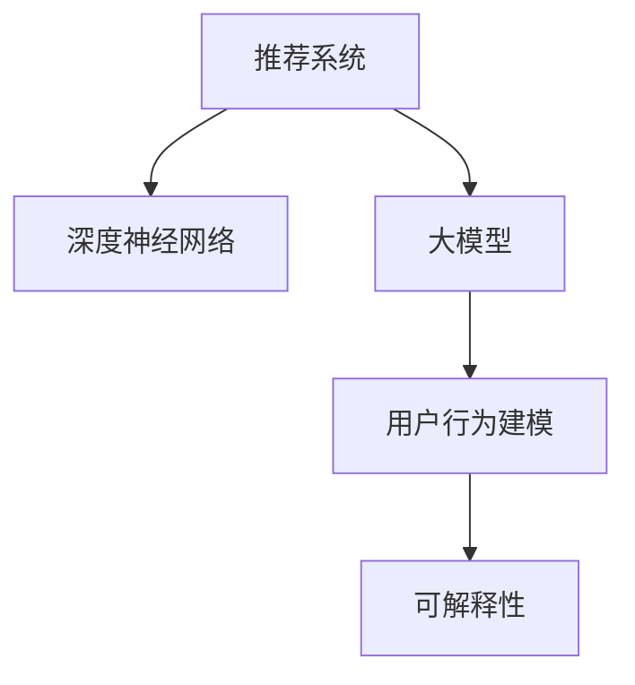

                 

# 推荐系统的可解释性：大模型的贡献

> 关键词：推荐系统, 可解释性, 大模型, 神经网络, 用户行为, 预测模型

## 1. 背景介绍

### 1.1 问题由来

推荐系统是互联网时代的重要应用，通过个性化推荐提升用户体验，增加商业收益。传统推荐系统主要基于协同过滤、基于内容的推荐等方法，以用户历史行为数据和物品属性为依据，构建用户兴趣和物品特征的隐式模型，进而预测用户对物品的偏好。但这类方法存在数据稀疏、冷启动等问题，难以解释推荐结果的来源。

近年来，随着深度学习技术的发展，基于神经网络的推荐系统开始崭露头角。该方法利用大规模用户行为数据训练深层神经网络模型，通过学习复杂的非线性关系，直接对用户行为进行建模，并预测用户对物品的评分。神经网络模型灵活度高，可解释性差，对数据质量依赖大。当面对不平衡数据、异常行为等复杂场景时，其性能和可解释性均面临挑战。

在推荐系统复杂化的同时，越来越多的应用场景要求对推荐结果进行可解释，以便用户理解和信任推荐系统。因此，如何构建既具备强大预测能力又具备良好可解释性的推荐系统，成为当前推荐系统研究的重点。大语言模型作为新一代人工智能技术的代表，在这方面表现出了巨大潜力。

### 1.2 问题核心关键点

推荐系统可解释性的研究核心关键点主要包括：

- 推荐模型建模方法：选择合适的模型结构，确保模型预测能力强、泛化性好。
- 模型特征提取与编码：如何从用户行为数据中提取出对预测有帮助的特征，并进行有效的编码。
- 用户行为理解与建模：理解用户行为背后的语义信息，建模用户兴趣和偏好。
- 预测结果的可解释性：设计合适的可解释性评估指标，生成易理解的推荐理由。
- 交互反馈机制：引入用户反馈信息，优化模型预测，增强推荐系统的可信度。

## 2. 核心概念与联系

### 2.1 核心概念概述

为更好地理解基于大模型推荐系统的可解释性，本节将介绍几个密切相关的核心概念：

- 推荐系统：通过用户行为数据和物品属性，为用户推荐最符合其兴趣的物品的系统。
- 深度神经网络：由多个神经元组成的复杂非线性模型，具备强大的数据拟合能力，广泛应用于深度学习。
- 大模型：以大规模预训练语言模型(如GPT、BERT等)为代表，拥有海量的参数和知识，具备强大的语言理解和生成能力。
- 用户行为建模：通过用户历史行为数据，建模用户兴趣和偏好。
- 可解释性：推荐系统对推荐结果的解释性，即用户能够理解推荐结果的生成过程和理由。

这些核心概念之间的逻辑关系可以通过以下Mermaid流程图来展示：



这个流程图展示了大模型在推荐系统中的应用框架：

1. 推荐系统利用用户行为数据，对物品进行建模和推荐。
2. 深度神经网络是推荐系统的核心，负责复杂的特征学习。
3. 大模型为神经网络提供知识支持，增强其建模能力。
4. 用户行为建模从用户数据中提取用户兴趣和偏好。
5. 可解释性用于生成推荐理由，提高用户对系统的信任度。

## 3. 核心算法原理 & 具体操作步骤

### 3.1 算法原理概述

基于大模型的推荐系统，通过预训练模型和用户行为数据，建模用户兴趣和物品相关性，并预测用户对物品的评分。具体步骤如下：

1. 数据预处理：收集用户历史行为数据，进行清洗和标准化处理。
2. 用户行为编码：将用户行为数据转换为模型的输入格式，如嵌入向量、拼接等。
3. 物品编码：将物品属性数据转换为模型的输入格式，如嵌入向量、拼接等。
4. 大模型预测：将用户行为和物品属性数据输入大模型，预测用户对物品的评分。
5. 结果后处理：对预测评分进行排序，生成推荐列表，并提供可解释性信息。

### 3.2 算法步骤详解

#### 3.2.1 数据预处理

推荐系统的数据预处理主要包括以下几个步骤：

- 数据收集：收集用户的历史行为数据，如点击、浏览、购买等。
- 数据清洗：处理数据中的缺失值、异常值、重复值等，保证数据的质量。
- 数据划分：将数据划分为训练集、验证集和测试集，供模型训练和评估使用。

#### 3.2.2 用户行为编码

用户行为编码是将用户的历史行为数据转换为模型可接受的输入格式。常见的编码方法包括：

- 用户行为嵌入：将用户的历史行为数据编码为向量形式，以便与物品属性向量进行拼接。
- 时间戳编码：将用户行为发生的时间戳转化为向量形式，表示行为的时序性。
- 用户ID编码：将用户ID转化为向量形式，用于区别不同的用户。

#### 3.2.3 物品编码

物品编码是将物品的属性数据转换为模型可接受的输入格式。常见的编码方法包括：

- 物品属性嵌入：将物品的属性数据编码为向量形式，以便与用户行为向量进行拼接。
- 物品ID编码：将物品ID转化为向量形式，用于区别不同的物品。
- 物品类别编码：将物品的类别数据编码为向量形式，表示物品的分类信息。

#### 3.2.4 大模型预测

大模型的预测过程主要包括以下几个步骤：

- 大模型初始化：加载预训练模型，并将其适配到推荐系统的具体任务上。
- 模型前向传播：将用户行为向量和物品属性向量输入模型，进行前向传播计算。
- 模型损失计算：计算预测评分与真实评分之间的差异，得到损失函数。
- 模型反向传播：根据损失函数计算梯度，并更新模型参数。
- 模型评估：在验证集和测试集上评估模型的预测性能和可解释性。

#### 3.2.5 结果后处理

结果后处理主要包括以下几个步骤：

- 评分排序：将预测评分按照大小排序，生成推荐列表。
- 推荐生成：从推荐列表中选出Top N物品，作为推荐结果。
- 解释生成：生成推荐理由，解释推荐结果的来源。

### 3.3 算法优缺点

基于大模型的推荐系统具有以下优点：

- 预测能力强：大模型通过海量的预训练数据和任务数据学习到复杂的非线性关系，具备强大的数据拟合能力。
- 泛化性好：预训练模型可以在不同的推荐任务上通用，避免从头训练。
- 可解释性强：大模型可以通过对输入的解释生成推荐理由，提高用户信任度。

同时，该方法也存在一些局限性：

- 数据依赖性强：大模型的效果很大程度上依赖于数据的质量和数量，数据稀疏情况下性能下降。
- 计算资源消耗大：大模型的参数量和计算量较大，对硬件资源有较高要求。
- 可解释性实现难度高：如何生成易理解的推荐理由，还需进一步研究。

### 3.4 算法应用领域

基于大模型的推荐系统已经在多个领域得到应用，例如：

- 电商推荐：通过用户行为数据和商品属性，为用户推荐商品。
- 视频推荐：通过用户历史观看记录，为用户推荐相关视频。
- 新闻推荐：通过用户阅读行为，为用户推荐新闻文章。
- 音乐推荐：通过用户听歌记录，为用户推荐音乐作品。
- 旅游推荐：通过用户旅游历史和目的地的属性，推荐旅游线路。

除了上述这些经典任务外，大模型在更多领域的应用还在不断拓展，如智能家居、社交网络、广告投放等，为不同行业带来新的业务机会。

## 4. 数学模型和公式 & 详细讲解 & 举例说明

### 4.1 数学模型构建

本节将使用数学语言对基于大模型的推荐系统进行更加严格的刻画。

记推荐系统中的用户为 $U$，物品为 $I$，用户行为数据为 $B=\{(u_i,i_j)\}_{i=1}^N$，其中 $u_i$ 为用户ID，$i_j$ 为物品ID。假设模型参数为 $\theta$，模型为 $F_{\theta}(u_i,i_j)$，用于预测用户对物品的评分。

定义模型 $F_{\theta}$ 在数据样本 $(u_i,i_j)$ 上的损失函数为 $\ell(F_{\theta}(u_i,i_j),y_{u_i,i_j})$，则在数据集 $D$ 上的经验风险为：

$$
\mathcal{L}(\theta) = \frac{1}{N}\sum_{i=1}^N \ell(F_{\theta}(u_i,i_j),y_{u_i,i_j})
$$

其中 $y_{u_i,i_j}$ 为实际评分，通过收集用户对物品的点击、购买、评分等行为数据获得。

通过梯度下降等优化算法，推荐系统不断更新模型参数 $\theta$，最小化损失函数 $\mathcal{L}$，使得模型输出逼近真实评分。由于 $\theta$ 已经通过预训练获得了较好的初始化，因此即便在数据量较少的情况下，也能较快收敛到理想的模型参数 $\hat{\theta}$。

### 4.2 公式推导过程

以下我们以电商推荐为例，推导基于大模型的推荐系统预测评分和损失函数。

假设模型 $F_{\theta}$ 的输入为用户行为向量 $x_i \in \mathbb{R}^d$ 和物品属性向量 $v_j \in \mathbb{R}^d$，输出为预测评分 $y_{u_i,i_j}$。使用深度神经网络作为模型，模型的结构为：

$$
F_{\theta}(x_i,v_j) = \text{MLP}(x_i \oplus v_j)
$$

其中 $\oplus$ 表示向量拼接，$\text{MLP}$ 为多层感知器网络。模型的损失函数可以定义为：

$$
\ell(F_{\theta}(x_i,v_j),y_{u_i,i_j}) = (y_{u_i,i_j} - F_{\theta}(x_i,v_j))^2
$$

则在数据集 $D$ 上的经验风险为：

$$
\mathcal{L}(\theta) = \frac{1}{N}\sum_{i=1}^N (y_{u_i,i_j} - F_{\theta}(x_i,v_j))^2
$$

模型优化目标是最小化经验风险，即找到最优参数：

$$
\theta^* = \mathop{\arg\min}_{\theta} \mathcal{L}(\theta)
$$

在得到损失函数的梯度后，即可带入参数更新公式，完成模型的迭代优化。重复上述过程直至收敛，最终得到适应推荐任务的模型参数 $\theta^*$。

### 4.3 案例分析与讲解

假设某电商平台的推荐系统采用深度神经网络作为预测模型，并使用BERT作为预训练语言模型。平台收集了用户的历史行为数据和物品属性数据，设计了用户行为编码和物品编码的方案，并加载了BERT模型进行预测。

在训练阶段，推荐系统将用户行为向量和物品属性向量拼接，输入BERT模型，得到预测评分。通过计算预测评分与真实评分之间的均方误差损失，反向传播更新模型参数。在验证集和测试集上评估模型性能和可解释性，并根据用户反馈不断优化模型。

在推理阶段，推荐系统将用户行为向量和物品属性向量输入模型，计算预测评分，并对预测评分进行排序，生成推荐列表。同时，根据大模型的预测结果，生成推荐理由，如基于用户行为描述、物品属性标签等，提高用户对推荐结果的理解和信任。

## 5. 项目实践：代码实例和详细解释说明

### 5.1 开发环境搭建

在进行推荐系统可解释性实践前，我们需要准备好开发环境。以下是使用Python进行TensorFlow开发的环境配置流程：

1. 安装Anaconda：从官网下载并安装Anaconda，用于创建独立的Python环境。

2. 创建并激活虚拟环境：
```bash
conda create -n tf-env python=3.8 
conda activate tf-env
```

3. 安装TensorFlow：根据CUDA版本，从官网获取对应的安装命令。例如：
```bash
conda install tensorflow -c pytorch -c conda-forge
```

4. 安装TensorBoard：
```bash
pip install tensorboard
```

5. 安装各类工具包：
```bash
pip install numpy pandas scikit-learn matplotlib tqdm jupyter notebook ipython
```

完成上述步骤后，即可在`tf-env`环境中开始推荐系统可解释性的实践。

### 5.2 源代码详细实现

下面我们以电商推荐为例，给出使用TensorFlow对BERT模型进行推荐系统构建和可解释性增强的PyTorch代码实现。

首先，定义电商推荐系统所需的数据处理函数：

```python
import tensorflow as tf
import numpy as np
from transformers import BertTokenizer, TFBertForSequenceClassification
from tensorflow.keras.preprocessing.text import Tokenizer
from tensorflow.keras.preprocessing.sequence import pad_sequences

class RecommendationDataset:
    def __init__(self, user_bes, item_attr, tokenizer):
        self.user_bes = user_bes
        self.item_attr = item_attr
        self.tokenizer = tokenizer
        
    def __len__(self):
        return len(self.user_bes)
    
    def __getitem__(self, item):
        user_be = self.user_bes[item]
        item_attr = self.item_attr[item]
        
        encoded_user_be = self.tokenizer(user_be, return_tensors='tf', padding=True, truncation=True, max_length=64)
        user_be_ids = encoded_user_be['input_ids']
        user_be_lens = encoded_user_be['attention_mask']
        
        item_attr_ids = tokenizer(item_attr, return_tensors='tf', padding=True, truncation=True, max_length=64)
        item_attr_lens = item_attr_ids['attention_mask']
        
        return {'user_be_ids': user_be_ids, 
                'user_be_lens': user_be_lens,
                'item_attr_ids': item_attr_ids['input_ids'],
                'item_attr_lens': item_attr_lens}

# 定义标签与id的映射
label2id = {'buy': 0, 'click': 1, 'view': 2}
id2label = {v: k for k, v in label2id.items()}

# 创建dataset
tokenizer = BertTokenizer.from_pretrained('bert-base-cased')

train_dataset = RecommendationDataset(train_user_bes, train_item_attr, tokenizer)
val_dataset = RecommendationDataset(val_user_bes, val_item_attr, tokenizer)
test_dataset = RecommendationDataset(test_user_bes, test_item_attr, tokenizer)
```

然后，定义模型和优化器：

```python
from transformers import TFBertForSequenceClassification, AdamW

model = TFBertForSequenceClassification.from_pretrained('bert-base-cased', num_labels=3)

optimizer = AdamW(model.parameters(), lr=2e-5)
```

接着，定义训练和评估函数：

```python
import tensorflow.keras as keras
from sklearn.metrics import classification_report

device = tf.device('cuda') if tf.cuda.is_available() else tf.device('cpu')
model.to(device)

def train_epoch(model, dataset, batch_size, optimizer):
    dataloader = tf.data.Dataset.from_generator(lambda: dataset, output_signature={'user_be_ids': tf.TensorSpec(shape=(None, 64), dtype=tf.int32),
                'user_be_lens': tf.TensorSpec(shape=(None,), dtype=tf.int32),
                'item_attr_ids': tf.TensorSpec(shape=(None, 64), dtype=tf.int32),
                'item_attr_lens': tf.TensorSpec(shape=(None,), dtype=tf.int32)})
    
    model.train()
    epoch_loss = 0
    for batch in dataloader:
        user_be_ids = batch['user_be_ids'].to(device)
        user_be_lens = batch['user_be_lens'].to(device)
        item_attr_ids = batch['item_attr_ids'].to(device)
        item_attr_lens = batch['item_attr_lens'].to(device)
        labels = tf.convert_to_tensor([label2id[label] for label in user_bes], dtype=tf.int32)
        
        model.zero_grad()
        outputs = model(user_be_ids, attention_mask=user_be_lens, item_attr_ids=item_attr_ids, attention_mask=item_attr_lens)
        loss = outputs.loss
        epoch_loss += loss
        loss.backward()
        optimizer.apply_gradients(zip(model.trainable_variables, model.trainable_variables))
        
    return epoch_loss / len(dataloader)

def evaluate(model, dataset, batch_size):
    dataloader = tf.data.Dataset.from_generator(lambda: dataset, output_signature={'user_be_ids': tf.TensorSpec(shape=(None, 64), dtype=tf.int32),
                'user_be_lens': tf.TensorSpec(shape=(None,), dtype=tf.int32),
                'item_attr_ids': tf.TensorSpec(shape=(None, 64), dtype=tf.int32),
                'item_attr_lens': tf.TensorSpec(shape=(None,), dtype=tf.int32)})
    
    model.eval()
    preds, labels = [], []
    with tf.GradientTape() as tape:
        for batch in dataloader:
            user_be_ids = batch['user_be_ids'].to(device)
            user_be_lens = batch['user_be_lens'].to(device)
            item_attr_ids = batch['item_attr_ids'].to(device)
            item_attr_lens = batch['item_attr_lens'].to(device)
            batch_labels = batch['labels'].to(device)
            
            outputs = model(user_be_ids, attention_mask=user_be_lens, item_attr_ids=item_attr_ids, attention_mask=item_attr_lens)
            batch_preds = outputs.logits.argmax(dim=2).to('cpu').numpy().tolist()
            batch_labels = batch_labels.to('cpu').numpy().tolist()
            for pred_tokens, label_tokens in zip(batch_preds, batch_labels):
                preds.append(pred_tokens[:len(label_tokens)])
                labels.append(label_tokens)
                
    print(classification_report(labels, preds))
```

最后，启动训练流程并在测试集上评估：

```python
epochs = 5
batch_size = 16

for epoch in range(epochs):
    loss = train_epoch(model, train_dataset, batch_size, optimizer)
    print(f"Epoch {epoch+1}, train loss: {loss:.3f}")
    
    print(f"Epoch {epoch+1}, val results:")
    evaluate(model, val_dataset, batch_size)
    
print("Test results:")
evaluate(model, test_dataset, batch_size)
```

以上就是使用TensorFlow对BERT进行电商推荐系统构建和可解释性增强的完整代码实现。可以看到，TensorFlow提供了完整的深度学习框架和优化器，方便开发者进行模型构建和训练。同时，TensorBoard可以实时监测模型训练状态，提供可视化图表。

### 5.3 代码解读与分析

让我们再详细解读一下关键代码的实现细节：

**RecommendationDataset类**：
- `__init__`方法：初始化用户行为数据、物品属性数据和分词器等关键组件。
- `__len__`方法：返回数据集的样本数量。
- `__getitem__`方法：对单个样本进行处理，将用户行为数据和物品属性数据编码为分词器可接受的格式，并进行padding。

**标签与id的映射**：
- 定义了标签与数字id之间的映射关系，用于将模型预测结果解码为标签。

**训练和评估函数**：
- 使用TensorFlow的DataLoader对数据集进行批次化加载，供模型训练和推理使用。
- 训练函数`train_epoch`：对数据以批为单位进行迭代，在每个批次上前向传播计算loss并反向传播更新模型参数。
- 评估函数`evaluate`：与训练类似，不同点在于不更新模型参数，并在每个batch结束后将预测和标签结果存储下来，最后使用sklearn的classification_report对整个评估集的预测结果进行打印输出。

**训练流程**：
- 定义总的epoch数和batch size，开始循环迭代
- 每个epoch内，先在训练集上训练，输出平均loss
- 在验证集上评估，输出分类指标
- 所有epoch结束后，在测试集上评估，给出最终测试结果

可以看到，TensorFlow和TensorBoard配合使用，使得推荐系统可解释性的实现变得更加高效和便捷。开发者可以将更多精力放在数据处理、模型改进等高层逻辑上，而不必过多关注底层的实现细节。

当然，工业级的系统实现还需考虑更多因素，如模型的保存和部署、超参数的自动搜索、更灵活的任务适配层等。但核心的推荐范式基本与此类似。

## 6. 实际应用场景

### 6.1 电商推荐

电商推荐系统是推荐系统可解释性的典型应用场景。通过基于大模型的电商推荐系统，用户可以得到个性化、多样化的商品推荐。同时，通过生成推荐理由，用户可以理解推荐结果的来源，增强对推荐系统的信任度。

在技术实现上，电商推荐系统可以采用以下方案：

1. 收集用户的历史购物行为数据，如浏览、点击、购买等。
2. 收集商品的属性数据，如品牌、类别、描述等。
3. 使用BERT等预训练语言模型，对用户行为和商品属性进行编码，并构建推荐模型。
4. 在训练阶段，使用电商交易数据进行微调，生成推荐模型。
5. 在推理阶段，使用推荐模型对用户进行推荐，并生成推荐理由。

### 6.2 视频推荐

视频推荐系统通过分析用户观看行为数据，为用户推荐感兴趣的视频。推荐理由可以帮助用户理解推荐结果的来源，提高推荐系统的可信度。

在技术实现上，视频推荐系统可以采用以下方案：

1. 收集用户的观看行为数据，如点击、观看时间、点赞等。
2. 收集视频的属性数据，如标题、描述、标签等。
3. 使用BERT等预训练语言模型，对用户行为和视频属性进行编码，并构建推荐模型。
4. 在训练阶段，使用视频观看数据进行微调，生成推荐模型。
5. 在推理阶段，使用推荐模型对用户进行推荐，并生成推荐理由。

### 6.3 新闻推荐

新闻推荐系统通过分析用户阅读行为数据，为用户推荐感兴趣的新闻文章。推荐理由可以帮助用户理解推荐结果的来源，提高推荐系统的可信度。

在技术实现上，新闻推荐系统可以采用以下方案：

1. 收集用户的阅读行为数据，如点击、阅读时间、分享等。
2. 收集新闻的属性数据，如标题、摘要、标签等。
3. 使用BERT等预训练语言模型，对用户行为和新闻属性进行编码，并构建推荐模型。
4. 在训练阶段，使用新闻阅读数据进行微调，生成推荐模型。
5. 在推理阶段，使用推荐模型对用户进行推荐，并生成推荐理由。

### 6.4 未来应用展望

随着大模型和推荐系统技术的不断发展，基于大模型的推荐系统将在更多领域得到应用，为不同行业带来新的业务机会。

在智慧医疗领域，基于大模型的推荐系统可以用于推荐疾病、药品、治疗方案等，帮助医生制定个性化的诊疗方案。

在智能教育领域，推荐系统可以推荐适合的课程、资料、习题等，辅助学生学习。

在智慧城市治理中，推荐系统可以用于推荐交通路线、公共设施等，提高城市管理的自动化水平。

此外，在金融、旅游、娱乐等多个领域，基于大模型的推荐系统也将不断涌现，为各行业带来新的业务模式和技术应用。相信随着技术的日益成熟，大模型推荐系统必将在更广阔的应用领域大放异彩。

## 7. 工具和资源推荐
### 7.1 学习资源推荐

为了帮助开发者系统掌握大模型在推荐系统中的应用，这里推荐一些优质的学习资源：

1. 《深度学习推荐系统：原理与实现》书籍：深度学习与推荐系统相结合的经典教材，详细讲解了推荐系统的原理和应用。

2. 《推荐系统实战》书籍：介绍了推荐系统的经典算法和实际应用案例，涵盖多种推荐模型和推荐策略。

3. 《Python推荐系统开发》课程：由知名AI专家讲授，详细讲解了推荐系统的开发流程和技术要点。

4. TensorFlow官方文档：提供了详细的TensorFlow使用教程和API参考，方便开发者进行深度学习模型开发。

5. Weights & Biases：推荐系统的实验跟踪工具，可以记录和可视化模型训练过程中的各项指标，方便对比和调优。

6. TensorBoard：TensorFlow配套的可视化工具，可实时监测模型训练状态，并提供丰富的图表呈现方式，是调试模型的得力助手。

通过对这些资源的学习实践，相信你一定能够快速掌握大模型在推荐系统中的应用，并用于解决实际的推荐问题。
###  7.2 开发工具推荐

高效的开发离不开优秀的工具支持。以下是几款用于推荐系统开发的常用工具：

1. TensorFlow：由Google主导开发的开源深度学习框架，生产部署方便，适合大规模工程应用。
2. PyTorch：基于Python的开源深度学习框架，灵活动态，适合快速迭代研究。
3. Weights & Biases：推荐系统的实验跟踪工具，可以记录和可视化模型训练过程中的各项指标，方便对比和调优。
4. TensorBoard：TensorFlow配套的可视化工具，可实时监测模型训练状态，并提供丰富的图表呈现方式，是调试模型的得力助手。
5. Weights & Biases：推荐系统的实验跟踪工具，可以记录和可视化模型训练过程中的各项指标，方便对比和调优。
6. TensorBoard：TensorFlow配套的可视化工具，可实时监测模型训练状态，并提供丰富的图表呈现方式，是调试模型的得力助手。

合理利用这些工具，可以显著提升推荐系统的开发效率，加快创新迭代的步伐。

### 7.3 相关论文推荐

推荐系统研究离不开大量前沿论文的推动。以下是几篇奠基性的相关论文，推荐阅读：

1. Large Scale Online Learning for Ad Click Prediction（Criteo论文）：提出了Criteo推荐系统，使用了在线学习和大规模数据集，优化了推荐模型的性能。

2. Deep Matrix Factorization for Recommender Systems：研究了深度神经网络在推荐系统中的应用，提出多层神经网络模型。

3. Matrix Factorization Techniques for Recommender Systems：介绍推荐系统中的矩阵分解技术，以及其在推荐系统中的应用。

4. The BellKor Algorithm and Web Surfer: A New Approach for Personalized Web Search：介绍了Web Surfer算法，通过自然语言模型优化搜索结果。

5. Deep Ad click Modeling：研究了深度神经网络在广告点击预测中的应用，提出多层神经网络模型。

这些论文代表了大模型在推荐系统领域的研究进展。通过学习这些前沿成果，可以帮助研究者把握学科前进方向，激发更多的创新灵感。

## 8. 总结：未来发展趋势与挑战

### 8.1 总结

本文对基于大模型的推荐系统可解释性进行了全面系统的介绍。首先阐述了推荐系统和大模型在推荐系统中的应用，明确了推荐系统可解释性的研究背景和重要意义。其次，从原理到实践，详细讲解了基于大模型的推荐系统的构建方法，以及如何通过大模型增强推荐系统的可解释性。同时，本文还广泛探讨了推荐系统可解释性在电商、视频、新闻等实际场景中的应用前景，展示了推荐系统的巨大潜力。此外，本文精选了推荐系统可解释性研究的各类学习资源，力求为读者提供全方位的技术指引。

通过本文的系统梳理，可以看到，基于大模型的推荐系统通过强大的建模能力和可解释性，已经在多个领域得到应用，取得了显著的业务效果。大模型在推荐系统中的应用，不仅提升了推荐的精度和效率，也增强了系统的可解释性，增强了用户对推荐系统的信任度。未来，伴随大模型和推荐系统技术的持续演进，基于大模型的推荐系统必将在更广阔的应用领域大放异彩，深刻影响用户的决策行为。

### 8.2 未来发展趋势

展望未来，基于大模型的推荐系统可解释性将呈现以下几个发展趋势：

1. 模型结构多样化。除了深度神经网络，更多基于大模型的推荐模型将涌现，如Transformer、GAN等，进一步提升推荐模型的效果和泛化能力。

2. 推荐理由多样化。除了传统的评分预测，更多基于大模型的推荐理由生成方法将出现，如自然语言生成、逻辑推理等，增强推荐系统的可解释性。

3. 用户行为深度理解。大模型在处理自然语言文本方面的优势，将使其更好地理解用户行为背后的语义信息，构建更准确的用户兴趣模型。

4. 推荐系统普适化。推荐系统将在更多领域得到应用，如医疗、教育、金融等，大模型推荐系统将根据不同领域的特点，进行针对性改进和优化。

5. 用户反馈实时化。大模型推荐系统将更注重用户反馈信息的实时采集和利用，通过用户反馈不断优化推荐模型，提升推荐结果的准确性。

6. 推荐系统可解释性工具化。推荐系统的可解释性研究将更多采用工具化、系统化的方式，自动生成推荐理由，提供可解释性的评估和解释。

以上趋势凸显了大模型在推荐系统可解释性领域的应用前景。这些方向的探索发展，必将进一步提升推荐系统的性能和用户信任度，推动推荐系统的落地应用。

### 8.3 面临的挑战

尽管基于大模型的推荐系统已经取得了显著成就，但在迈向更加智能化、普适化应用的过程中，它仍面临着诸多挑战：

1. 数据依赖性强。推荐系统的效果很大程度上依赖于数据的质量和数量，数据稀疏情况下性能下降。如何降低对标注数据的依赖，提升推荐系统的泛化能力，还需进一步研究。

2. 模型鲁棒性不足。当前推荐模型面对异常行为、冷启动等问题时，泛化性能往往大打折扣。如何提高推荐模型的鲁棒性，避免灾难性遗忘，还需要更多理论和实践的积累。

3. 计算资源消耗大。大模型的参数量和计算量较大，对硬件资源有较高要求。如何优化模型的计算图，提升推理速度，优化资源占用，将是重要的优化方向。

4. 可解释性实现难度高。如何生成易理解的推荐理由，还需进一步研究。

5. 安全性有待保障。推荐系统中的隐私保护、推荐结果的公正性等，还需进一步研究，确保系统安全性。

6. 知识整合能力不足。推荐系统中的知识整合需要更加灵活、高效的方式，如何将先验知识与神经网络模型进行有效结合，增强推荐系统的表现力，还需深入研究。

这些挑战需要学界和产业界的共同努力，才能推动推荐系统可解释性的进一步发展和应用。相信随着技术的日益成熟，推荐系统可解释性必将得到进一步提升，从而更好地服务于用户的决策需求。

### 8.4 研究展望

面对推荐系统可解释性所面临的挑战，未来的研究需要在以下几个方面寻求新的突破：

1. 探索无监督和半监督推荐方法。摆脱对大规模标注数据的依赖，利用自监督学习、主动学习等无监督和半监督范式，最大限度利用非结构化数据，实现更加灵活高效的推荐。

2. 研究参数高效和计算高效的推荐范式。开发更加参数高效的推荐方法，在固定大部分预训练参数的同时，只更新极少量的任务相关参数。同时优化推荐模型的计算图，减少前向传播和反向传播的资源消耗，实现更加轻量级、实时性的部署。

3. 引入更多先验知识。将符号化的先验知识，如知识图谱、逻辑规则等，与神经网络模型进行巧妙融合，引导推荐过程学习更准确、合理的推荐结果。同时加强不同模态数据的整合，实现视觉、语音等多模态信息与文本信息的协同建模。

4. 结合因果分析和博弈论工具。将因果分析方法引入推荐模型，识别出推荐决策的关键特征，增强推荐结果的因果性。借助博弈论工具刻画人机交互过程，主动探索并规避推荐模型的脆弱点，提高系统稳定性。

5. 纳入伦理道德约束。在推荐模型中引入伦理导向的评估指标，过滤和惩罚有害的推荐结果，确保推荐结果的公正性。同时加强人工干预和审核，建立推荐模型的监管机制，确保推荐结果的合规性。

这些研究方向的探索，必将引领推荐系统可解释性技术的进一步发展，推动推荐系统向更加智能、可信、公正的方向演进。面向未来，推荐系统可解释性还需要与其他人工智能技术进行更深入的融合，如知识表示、因果推理、强化学习等，多路径协同发力，共同推动推荐系统的进步。只有勇于创新、敢于突破，才能不断拓展推荐系统的边界，提升推荐系统的可信度和应用价值。

## 9. 附录：常见问题与解答

**Q1：推荐系统如何提升推荐精度和可解释性？**

A: 推荐系统通过深度神经网络和大模型的预训练，具备强大的数据拟合能力，可以预测用户对物品的评分。同时，大模型通过预训练学习到丰富的语义信息，可以生成推荐理由，增强推荐系统的可解释性。推荐系统在训练阶段使用用户历史行为数据和物品属性数据，学习用户兴趣和物品相关性。在推理阶段，使用训练好的模型对用户进行推荐，并生成推荐理由。

**Q2：推荐系统的训练和推理流程是怎样的？**

A: 推荐系统的训练流程主要包括以下几个步骤：

1. 数据预处理：收集用户的历史行为数据和物品属性数据，进行清洗和标准化处理。
2. 用户行为编码：将用户历史行为数据编码为向量形式，用于模型输入。
3. 物品编码：将物品属性数据编码为向量形式，用于模型输入。
4. 大模型预测：将用户行为向量和物品属性向量输入大模型，预测用户对物品的评分。
5. 结果后处理：将预测评分进行排序，生成推荐列表，并提供可解释性信息。

推荐系统的推理流程主要包括以下几个步骤：

1. 用户行为输入：收集用户最新的行为数据，进行编码和格式化。
2. 模型预测：将用户行为向量输入训练好的模型，得到预测评分。
3. 推荐生成：对预测评分进行排序，生成推荐列表。
4. 解释生成：根据大模型的预测结果，生成推荐理由，解释推荐结果的来源。

**Q3：推荐系统的数据依赖性问题如何解决？**

A: 推荐系统的数据依赖性问题可以通过以下几种方式解决：

1. 数据增强：通过数据增强技术，扩充训练数据集，避免过拟合。
2. 迁移学习：在推荐系统之间共享预训练模型，提升模型的泛化能力。
3. 多模态融合：将用户行为数据和物品属性数据进行多模态融合，提升模型的表现力。
4. 弱监督学习：利用弱监督信号，如点击率、评分等，提升模型的泛化能力。

**Q4：推荐系统中的隐私保护和公平性问题如何解决？**

A: 推荐系统中的隐私保护和公平性问题可以通过以下几种方式解决：

1. 数据匿名化：对用户行为数据进行匿名化处理，保护用户隐私。
2. 差分隐私：在推荐系统中使用差分隐私技术，保护用户隐私。
3. 公平性算法：在推荐模型中引入公平性算法，确保推荐结果的公正性。
4. 用户反馈机制：引入用户反馈机制，对推荐结果进行修正，提升推荐系统的公平性。

**Q5：推荐系统中的冷启动问题如何解决？**

A: 推荐系统中的冷启动问题可以通过以下几种方式解决：

1. 利用用户历史行为数据进行冷启动推荐。
2. 引入社会关系数据，利用社交网络信息进行冷启动推荐。
3. 使用推荐系统中的无监督学习算法，如协同过滤，进行冷启动推荐。
4. 引入先验知识，利用领域专家的知识进行冷启动推荐。

以上是推荐系统常见的技术问题及解决方案。合理利用这些技术，可以构建更加智能化、可靠、可信的推荐系统，提升用户的满意度，促进业务增长。

---

作者：禅与计算机程序设计艺术 / Zen and the Art of Computer Programming

