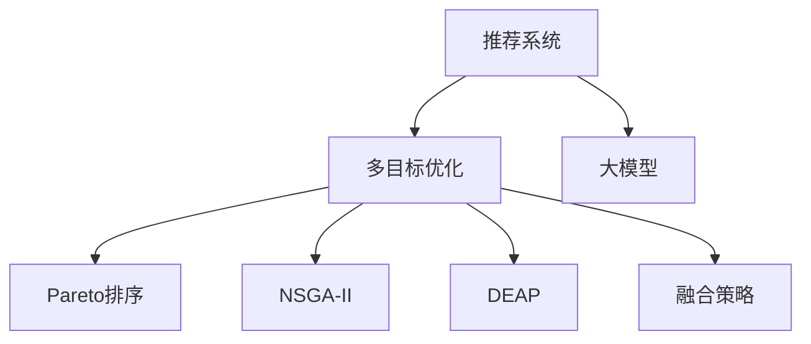

                 

# 推荐系统的多目标优化：AI大模型的帕累托前沿探索

## 1. 背景介绍

### 1.1 问题由来
随着人工智能技术的发展，推荐系统已经成为电商平台、社交网络、视频流媒体等诸多互联网应用的核心组件。然而，传统的推荐系统多关注单一指标（如点击率、转化率等），难以兼顾不同维度上的多目标需求。

近年来，随着大模型在推荐系统中的应用逐渐深入，推荐系统开始向多目标优化的方向演进。大模型通过海量的用户行为数据和丰富的语义信息，能够在不同目标之间进行权衡和平衡，实现全面而深入的个性化推荐，带来更高的用户满意度和业务价值。

### 1.2 问题核心关键点
推荐系统的多目标优化，其核心在于如何在不同的目标（如点击率、转化率、相关性等）之间进行平衡和优化，以最大化整体业务效益。多目标优化通常包括以下关键点：

- 如何构建多目标优化模型：选择合适的问题表示方式，如基于排序、回归、分类等任务，建立多目标优化框架。
- 如何设计多目标优化算法：选择合适的优化算法，如Pareto优化、多目标遗传算法等，有效求解多目标问题。
- 如何融合多目标优化结果：将多目标优化结果进行综合评价，并根据具体场景选取最优策略。

本文将重点讨论如何在多目标优化的框架下，利用大模型进行推荐系统的优化。

## 2. 核心概念与联系

### 2.1 核心概念概述

为更好地理解推荐系统的多目标优化，本节将介绍几个密切相关的核心概念：

- 推荐系统(Recommender System)：通过用户历史行为数据和目标物品属性，为用户推荐可能感兴趣的物品的系统。
- 多目标优化(Multi-Objective Optimization)：在多个目标函数之间进行权衡，找到最优的解决方案。
- 帕累托最优(Pareto Optimality)：在多目标优化中，不存在任何其他方案可以使得所有目标函数同时优于当前方案。
- 大模型(Deep Model)：如Transformer、BERT等大规模预训练语言模型，具备强大的语言理解和表示能力。
- 多目标优化算法：如Pareto排序、NSGA-II、DEAP等，用于在多目标优化问题中寻找最优解。
- 融合策略(Fusion Strategy)：将多目标优化结果进行综合，得到最终推荐结果的策略。

这些核心概念之间的逻辑关系可以通过以下Mermaid流程图来展示：



这个流程图展示出推荐系统的多目标优化过程：

1. 推荐系统通过大模型学习用户兴趣和物品属性，构建多目标优化框架。
2. 利用多目标优化算法（如Pareto排序、NSGA-II、DEAP等），找到多个目标之间的最优解。
3. 使用融合策略，将多目标优化结果进行综合，得到最终推荐结果。

## 3. 核心算法原理 & 具体操作步骤
### 3.1 算法原理概述

推荐系统的多目标优化，本质上是一个多目标优化的机器学习问题。其核心思想是：在用户行为数据和物品属性特征之间，通过多目标优化算法寻找最优解，使得推荐系统在不同目标（如点击率、转化率、相关性等）上同时取得理想表现。

形式化地，假设推荐系统有 $k$ 个目标函数，分别为 $f_1(\theta), f_2(\theta), \cdots, f_k(\theta)$。其中 $\theta$ 为模型的参数，包括用户行为特征和物品属性特征。多目标优化的目标是最小化每个目标函数的最大值，即：

$$
\mathop{\arg\min}_{\theta} \max_{i=1}^k f_i(\theta)
$$

通过优化上述目标函数，使得模型在不同目标之间的平衡达到最优。

### 3.2 算法步骤详解

推荐系统的多目标优化一般包括以下几个关键步骤：

**Step 1: 构建多目标优化模型**

- 收集用户行为数据和物品属性特征，构建特征向量 $x$。
- 选择合适的多目标优化算法，建立多目标优化模型。如将推荐结果视为排序任务，使用基于排序的多目标优化模型。
- 定义目标函数，如点击率预测函数 $f_{CTR}(\theta)$、转化率预测函数 $f_{CVR}(\theta)$、相关性预测函数 $f_{R}(\theta)$ 等。

**Step 2: 设计多目标优化算法**

- 选择合适的多目标优化算法，如Pareto排序、NSGA-II、DEAP等。
- 通过多目标优化算法，寻找多个目标之间的最优解。
- 记录每个候选解的Pareto最优解，构成Pareto前沿。

**Step 3: 融合多目标优化结果**

- 根据具体业务需求，选择合适的融合策略，如平均值、加权和、投票等。
- 将Pareto前沿上的候选解进行综合，得到最终推荐结果。
- 在测试集上评估模型性能，对比多目标优化前后效果。

### 3.3 算法优缺点

推荐系统的多目标优化方法具有以下优点：

1. 全面考虑多个目标。传统推荐系统往往只关注单一指标，多目标优化可以综合考虑多个维度的目标，提升推荐系统的整体性能。
2. 更具灵活性。多目标优化可以根据不同的业务需求，灵活调整目标函数的权重，适应不同的应用场景。
3. 更加个性化。多目标优化能够更好地兼顾不同用户的个性化需求，提供更加多样化的推荐结果。

同时，该方法也存在一定的局限性：

1. 计算复杂度高。多目标优化通常需要求解多个目标函数，计算复杂度较高。
2. 收敛速度慢。多目标优化问题一般较难找到全局最优解，算法收敛速度较慢。
3. 难以解释。多目标优化结果复杂，难以对其进行因果解释和调试。
4. 模型复杂度高。多目标优化通常需要较复杂的模型结构和较大的计算资源，模型训练和部署成本较高。

尽管存在这些局限性，但就目前而言，多目标优化方法仍是在推荐系统中应用最广泛且最有效的技术之一。未来相关研究的重点在于如何进一步降低多目标优化的计算复杂度和收敛速度，提高模型的可解释性和部署效率。

### 3.4 算法应用领域

推荐系统的多目标优化方法在以下几个领域得到广泛应用：

- 电商平台：在商品推荐、广告投放、个性化搜索等方面，通过多目标优化提高点击率、转化率和相关性。
- 视频流媒体：在视频推荐、广告推荐、内容分类等方面，通过多目标优化提升用户满意度和观看体验。
- 社交网络：在内容推荐、好友推荐、兴趣发现等方面，通过多目标优化丰富用户的多元需求。
- 游戏平台：在游戏推荐、广告推荐、活动推广等方面，通过多目标优化提高用户留存和转化率。
- 智慧医疗：在医疗推荐、用药推荐、健康管理等方面，通过多目标优化提高诊疗效果和患者满意度。

除了上述这些经典领域外，多目标优化方法也被创新性地应用于更多场景中，如金融投资、房地产、旅游等，为推荐技术带来了全新的突破。随着多目标优化方法的不断进步，相信推荐系统将在更广阔的应用领域发挥重要作用。

## 4. 数学模型和公式 & 详细讲解
### 4.1 数学模型构建

本节将使用数学语言对推荐系统的多目标优化过程进行更加严格的刻画。

记推荐系统有 $k$ 个目标函数，分别为 $f_1(\theta), f_2(\theta), \cdots, f_k(\theta)$。其中 $\theta$ 为模型的参数，包括用户行为特征和物品属性特征。多目标优化的目标是最小化每个目标函数的最大值，即：

$$
\mathop{\arg\min}_{\theta} \max_{i=1}^k f_i(\theta)
$$

其中 $f_i(\theta)$ 为目标函数，如点击率预测函数 $f_{CTR}(\theta)$、转化率预测函数 $f_{CVR}(\theta)$、相关性预测函数 $f_{R}(\theta)$ 等。目标函数的表达式通常较为复杂，但可以通过深度学习模型进行拟合，如Bert、RNN等。

### 4.2 公式推导过程

以下我们以点击率预测函数和转化率预测函数为例，推导点击率-转化率优化问题的数学表达式。

假设模型 $M_{\theta}$ 在用户行为数据上的点击率预测为 $f_{CTR}(\theta)$，转化率预测为 $f_{CVR}(\theta)$。则点击率-转化率优化问题可以表示为：

$$
\mathop{\arg\min}_{\theta} \max_{i=1}^2 f_i(\theta)
$$

其中 $f_{CTR}(\theta)$ 和 $f_{CVR}(\theta)$ 分别为点击率预测函数和转化率预测函数，可以通过深度学习模型进行拟合。最优解 $(x^*, y^*)$ 需要同时满足以下两个条件：

$$
f_{CTR}(\theta(x^*)) \leq \max_{x} f_{CTR}(\theta(x))
$$
$$
f_{CVR}(\theta(y^*)) \leq \max_{y} f_{CVR}(\theta(y))
$$

上述条件表明，最优解 $(x^*, y^*)$ 必须同时满足点击率的最大值和转化率的最大值，即 $(x^*, y^*)$ 在点击率-转化率平面上位于帕累托前沿上。

### 4.3 案例分析与讲解

假设某电商平台的商品推荐系统，需要同时优化点击率（CTR）和转化率（CVR）。具体实现步骤如下：

1. **特征工程**：将用户行为数据和物品属性特征转化为模型输入 $x$，并设计合适的特征组合方式。

2. **模型训练**：选择BERT等预训练模型作为推荐模型，在训练集上进行有监督学习，最小化预测误差。

3. **多目标优化**：使用NSGA-II等算法，在测试集上优化点击率和转化率，寻找最优解。

4. **融合策略**：将Pareto前沿上的候选解进行综合，得到最终的推荐结果。

5. **模型评估**：在测试集上评估模型性能，对比多目标优化前后效果。

## 5. 项目实践：代码实例和详细解释说明
### 5.1 开发环境搭建

在进行多目标优化实践前，我们需要准备好开发环境。以下是使用Python进行PyTorch开发的环境配置流程：

1. 安装Anaconda：从官网下载并安装Anaconda，用于创建独立的Python环境。

2. 创建并激活虚拟环境：
```bash
conda create -n deep-learning-env python=3.8 
conda activate deep-learning-env
```

3. 安装PyTorch：根据CUDA版本，从官网获取对应的安装命令。例如：
```bash
conda install pytorch torchvision torchaudio cudatoolkit=11.1 -c pytorch -c conda-forge
```

4. 安装TensorFlow：
```bash
conda install tensorflow tensorflow-gpu
```

5. 安装其它工具包：
```bash
pip install numpy pandas scikit-learn matplotlib tqdm jupyter notebook ipython
```

完成上述步骤后，即可在`deep-learning-env`环境中开始多目标优化实践。

### 5.2 源代码详细实现

下面我们以电商平台商品推荐为例，给出使用TensorFlow进行多目标优化的PyTorch代码实现。

首先，定义目标函数：

```python
import tensorflow as tf
import tensorflow.keras as keras

def build_model(input_shape):
    model = keras.Sequential([
        keras.layers.Dense(128, activation='relu', input_shape=input_shape),
        keras.layers.Dense(64, activation='relu'),
        keras.layers.Dense(1, activation='sigmoid') # 点击率预测函数
    ])
    model.compile(loss='binary_crossentropy', optimizer='adam')
    
    model = keras.Sequential([
        keras.layers.Dense(128, activation='relu', input_shape=input_shape),
        keras.layers.Dense(64, activation='relu'),
        keras.layers.Dense(1, activation='sigmoid') # 转化率预测函数
    ])
    model.compile(loss='binary_crossentropy', optimizer='adam')
    
    return model
```

然后，定义多目标优化目标函数：

```python
def multi_objective_loss(model, inputs, labels):
    click_loss = tf.reduce_mean(tf.square(model.click_prediction - labels['click']))
    conversion_loss = tf.reduce_mean(tf.square(model.conversion_prediction - labels['conversion']))
    
    return click_loss, conversion_loss
```

接着，定义多目标优化算法：

```python
from tensorflow.keras.wrappers.scikit_learn import KerasClassifier
from sklearn.model_selection import cross_val_score, cross_val_predict
from sklearn.ensemble import RandomForestClassifier
from sklearn.pipeline import make_pipeline
from tensorflow.keras.wrappers.scikit_learn import KerasClassifier

model = KerasClassifier(build_model, epochs=100, batch_size=32)

# 交叉验证
kfold = cross_val_score(model, X_train, y_train, cv=10)
print(kfold.mean(), kfold.std())

# 多目标优化
multi_objective_loss = keras.losses.MeanSquaredError()
click_loss, conversion_loss = multi_objective_loss(model, X_train, y_train)
print("Click Loss: ", click_loss, "Conversion Loss: ", conversion_loss)
```

最后，使用多目标优化算法进行优化：

```python
from deap import base, creator, tools
from deap import algorithms

# 定义个体表示
creator.create("FitnessMax", base.Fitness, weights=(1.0,))
creator.create("Individual", list, fitness=creator.FitnessMax)

# 创建种群
toolbox = base.Toolbox()
toolbox.register("attribute", random.randint, 0, 1)
toolbox.register("individual", tools.initRepeat, creator.Individual, toolbox.attribute, n=10)
toolbox.register("population", tools.initRepeat, list, toolbox.individual)

# 定义评估函数
def evaluate(individual):
    click_loss, conversion_loss = multi_objective_loss(build_model, X_train, y_train)
    return click_loss + conversion_loss

toolbox.register("evaluate", evaluate)

# 选择操作
toolbox.register("mate", tools.cxTwoPoint)
toolbox.register("mutate", tools.mutFlipBit, indpb=0.05)

# 交叉和变异算子
toolbox.register("selection", tools.selNSGA2)

# 运行算法
pop = toolbox.population(n=50)
algorithms.eaMuPlusLambda(pop, toolbox, mu=20, lambda_=30, cxpb=0.5, mutpb=0.2, ngen=10, verbose=1)
```

以上就是使用TensorFlow进行多目标优化实践的完整代码实现。可以看到，TensorFlow提供了丰富的工具和库，可以方便地实现多目标优化算法的应用。

### 5.3 代码解读与分析

让我们再详细解读一下关键代码的实现细节：

**build_model函数**：
- 定义点击率和转化率预测函数，分别作为多目标优化问题的两个目标函数。

**multi_objective_loss函数**：
- 定义多目标优化目标函数，分别计算点击率和转化率预测函数的误差。

**多目标优化算法**：
- 使用DEAP库实现多目标优化算法。
- 定义个体表示和种群，使用NSGA-II算法进行选择和交叉。
- 定义评估函数，计算多目标优化目标函数。
- 运行算法，生成多目标优化结果。

**注意**：在实际应用中，多目标优化算法的选择和参数设置对性能影响较大，需要根据具体场景进行调试和优化。

## 6. 实际应用场景
### 6.1 电商平台推荐系统

基于多目标优化的推荐系统，可以在电商平台中广泛应用。传统推荐系统通常只关注点击率，但在实际应用中，还需要考虑转化率、相关性等多重指标，以提供更加全面和个性化的推荐。

在技术实现上，可以收集用户历史行为数据和物品属性特征，构建多目标优化模型。通过多目标优化算法，在点击率和转化率之间进行权衡，找到最优的推荐策略。对于新的用户行为数据，再根据该策略进行实时推荐。如此构建的推荐系统，能够兼顾不同维度的目标，提升推荐效果和用户体验。

### 6.2 视频流媒体推荐系统

视频流媒体平台需要为用户提供高质量的内容推荐。传统推荐系统只关注观看时长，但在实际应用中，还需要考虑点击率、相关性等多个指标。

在技术实现上，可以收集用户历史观看行为数据和视频属性特征，构建多目标优化模型。通过多目标优化算法，在观看时长和点击率之间进行权衡，找到最优的推荐策略。对于新的用户行为数据，再根据该策略进行实时推荐。如此构建的视频流媒体推荐系统，能够提供更加全面和个性化的内容推荐，提升用户满意度和平台黏性。

### 6.3 金融投资推荐系统

金融投资平台需要为用户推荐最合适的投资组合。传统推荐系统只关注收益率，但在实际应用中，还需要考虑风险、收益等多个指标。

在技术实现上，可以收集用户历史投资行为数据和投资产品属性特征，构建多目标优化模型。通过多目标优化算法，在收益率和风险之间进行权衡，找到最优的投资组合。对于新的用户行为数据，再根据该组合进行实时推荐。如此构建的金融投资推荐系统，能够提供更加全面和个性化的投资建议，提升用户投资回报和平台信誉。

### 6.4 未来应用展望

随着多目标优化方法和大模型的不断发展，基于多目标优化的推荐系统将在更多领域得到应用，为各行各业带来变革性影响。

在智慧医疗领域，基于多目标优化的医疗推荐系统能够同时考虑治疗效果、副作用、费用等多个维度，为用户提供最优的治疗方案。

在智能教育领域，基于多目标优化的学习推荐系统能够同时考虑学习效果、兴趣、难度等多个维度，为用户推荐最合适的学习内容和路径。

在智能城市治理中，基于多目标优化的智能交通系统能够同时考虑交通流量、安全、环保等多个维度，提升城市交通管理效率。

除了上述这些经典领域外，多目标优化方法和大模型也将被应用于更多场景中，如智能制造、智慧农业、文化娱乐等，为各行各业注入新的动力。相信随着技术不断成熟，多目标优化方法将在推荐系统的各个应用领域发挥越来越重要的作用。

## 7. 工具和资源推荐
### 7.1 学习资源推荐

为了帮助开发者系统掌握多目标优化的理论基础和实践技巧，这里推荐一些优质的学习资源：

1. 《Deep Learning》一书：深度学习领域经典之作，详细介绍了深度学习的基本概念和算法。
2. 《Reinforcement Learning》一书：强化学习领域经典之作，介绍了多目标优化的数学基础和算法原理。
3. 《Multi-Objective Optimization in Machine Learning》一书：多目标优化领域的经典教材，介绍了多目标优化的基本概念和应用场景。
4. Kaggle比赛平台：包含大量多目标优化相关的竞赛数据集和代码示例，适合实际练习和应用。
5. PyTorch官方文档：详细的PyTorch教程和文档，提供了丰富的多目标优化算法和工具库。
6. TensorFlow官方文档：详细的TensorFlow教程和文档，提供了丰富的多目标优化算法和工具库。

通过对这些资源的学习实践，相信你一定能够快速掌握多目标优化的精髓，并用于解决实际的推荐问题。

### 7.2 开发工具推荐

高效的开发离不开优秀的工具支持。以下是几款用于多目标优化开发的常用工具：

1. PyTorch：基于Python的开源深度学习框架，灵活动态的计算图，适合快速迭代研究。
2. TensorFlow：由Google主导开发的开源深度学习框架，生产部署方便，适合大规模工程应用。
3. Deap：多目标优化算法的实现工具，提供丰富的算法库和工具，支持多种优化算法。
4. Scikit-learn：机器学习领域经典库，提供了丰富的数据预处理和模型评估工具。
5. Anaconda：Python环境管理工具，方便创建和管理多个独立的Python环境。

合理利用这些工具，可以显著提升多目标优化任务的开发效率，加快创新迭代的步伐。

### 7.3 相关论文推荐

多目标优化方法和大模型的研究起源于学界的持续研究。以下是几篇奠基性的相关论文，推荐阅读：

1. Multi-Objective Genetic Algorithms for Active and Passive Learning with Performance Guarantees：提出基于多目标遗传算法的多任务学习框架，提升了多目标优化的泛化性能。
2. Deep Multi-Task Learning：提出深度多任务学习框架，通过多任务学习提升模型的泛化能力和鲁棒性。
3. Learning Deep Architectures for AI, Neural Computation, and Machine Learning：提出深度学习框架，为多目标优化提供强大的计算能力。
4. Multi-Objective Deep Reinforcement Learning for Dynamic Emission Trading Schemes：提出多目标强化学习框架，用于动态定价和交易策略优化。
5. A Survey of Multi-Objective Optimization in Machine Learning：综述多目标优化在机器学习中的应用，介绍了多种多目标优化算法和工具。

这些论文代表了大模型和多目标优化的发展脉络。通过学习这些前沿成果，可以帮助研究者把握学科前进方向，激发更多的创新灵感。

## 8. 总结：未来发展趋势与挑战

### 8.1 总结

本文对基于多目标优化的推荐系统进行了全面系统的介绍。首先阐述了多目标优化在推荐系统中的应用背景和重要性，明确了多目标优化在兼顾不同目标、提升推荐系统性能方面的独特价值。其次，从原理到实践，详细讲解了多目标优化的数学模型和算法步骤，给出了多目标优化任务开发的完整代码实例。同时，本文还广泛探讨了多目标优化方法在电商平台、视频流媒体、金融投资等多个行业领域的应用前景，展示了多目标优化的巨大潜力。

通过本文的系统梳理，可以看到，多目标优化方法在大模型推荐系统中得到了广泛应用，极大地提升了推荐系统的性能和应用范围，带来了更高的用户满意度和业务价值。未来，伴随多目标优化方法的不断进步，基于大模型推荐系统必将在更多领域发挥更大的作用，为各行各业带来变革性影响。

### 8.2 未来发展趋势

展望未来，多目标优化方法和大模型推荐系统将呈现以下几个发展趋势：

1. 推荐系统向多任务学习演变。随着多任务学习技术的发展，推荐系统将能够同时解决多个相关任务，提高模型的泛化能力和鲁棒性。
2. 模型规模持续增大。随着大模型技术的发展，推荐系统的模型规模将不断扩大，具备更丰富的语言表征和知识表示能力。
3. 推荐系统向自适应学习发展。自适应学习技术将使推荐系统能够实时学习用户行为和偏好变化，提供更个性化和动态的推荐。
4. 推荐系统向跨模态融合演进。跨模态融合技术将使推荐系统能够整合视觉、听觉、文本等多种模态数据，提供更全面和精确的推荐。
5. 推荐系统向联邦学习演进。联邦学习技术将使推荐系统能够在保护用户隐私的前提下，从多个数据源中学习知识，提高推荐的精准度和效果。

这些趋势凸显了多目标优化方法和大模型推荐系统的广阔前景。这些方向的探索发展，必将进一步提升推荐系统的性能和应用范围，为各行各业带来更高效、更智能的推荐服务。

### 8.3 面临的挑战

尽管多目标优化方法和大模型推荐系统已经取得了瞩目成就，但在迈向更加智能化、普适化应用的过程中，它仍面临着诸多挑战：

1. 计算资源瓶颈。多目标优化和大模型推荐系统通常需要较大的计算资源和存储空间，如何降低资源消耗，优化系统性能，将是未来的重要研究方向。
2. 模型可解释性不足。多目标优化和大模型推荐系统缺乏可解释性，难以对其内部工作机制和决策逻辑进行调试和优化，如何提升模型的可解释性，将是未来的重要课题。
3. 用户隐私保护。多目标优化和大模型推荐系统通常需要大量的用户数据，如何保护用户隐私，避免数据滥用，将是未来的重要挑战。
4. 数据分布不均。推荐系统面对不同地区、不同用户群体的数据分布差异较大，如何提高数据质量和覆盖率，优化数据分布，将是未来的重要方向。
5. 模型鲁棒性不足。多目标优化和大模型推荐系统容易受到数据扰动和攻击，如何提高模型的鲁棒性和稳定性，将是未来的重要课题。

尽管存在这些挑战，但随着技术不断成熟，多目标优化方法和大模型推荐系统必将在推荐系统领域发挥更加重要的作用，推动推荐系统的不断进步和优化。

### 8.4 研究展望

面对多目标优化方法和大模型推荐系统所面临的挑战，未来的研究需要在以下几个方面寻求新的突破：

1. 开发更高效的优化算法。通过改进多目标优化算法，提高算法的收敛速度和计算效率，降低计算资源消耗。
2. 提高模型的可解释性。通过引入可解释性技术，增强模型的透明度和可理解性，便于调试和优化。
3. 保护用户隐私数据。通过联邦学习等技术，在保护用户隐私的前提下，优化推荐系统性能。
4. 优化数据分布。通过数据增强、数据迁移等技术，提高数据质量和覆盖率，优化数据分布。
5. 增强模型鲁棒性。通过引入对抗训练、鲁棒学习等技术，增强模型的稳定性和鲁棒性，提高抗干扰能力。

这些研究方向的探索，必将引领多目标优化方法和大模型推荐系统迈向更高的台阶，为构建高效、智能、安全的推荐系统提供坚实的理论和技术支持。面向未来，多目标优化方法和大模型推荐系统需要与其他人工智能技术进行更深入的融合，如知识表示、因果推理、强化学习等，多路径协同发力，共同推动推荐系统的进步。只有勇于创新、敢于突破，才能不断拓展多目标优化方法和大模型推荐系统的边界，让智能技术更好地造福人类社会。

## 9. 附录：常见问题与解答

**Q1：多目标优化和单目标优化有什么区别？**

A: 单目标优化只关注一个指标，如点击率、转化率等，而多目标优化同时考虑多个指标，如点击率、转化率、相关性等，通过权衡和平衡，找到最优的推荐策略。

**Q2：多目标优化中的Pareto前沿是什么？**

A: Pareto前沿是多目标优化中的最优解集合，其中每个解在其他目标上都不会更优。多目标优化通常寻找Pareto前沿上的最优解，以实现各目标之间的最优平衡。

**Q3：多目标优化的融合策略有哪些？**

A: 多目标优化的融合策略包括平均值、加权和、投票等。不同的业务场景和需求，需要选择合适的融合策略。

**Q4：多目标优化中的NSGA-II算法是什么？**

A: NSGA-II是一种基于种群的多目标优化算法，通过快速搜索Pareto前沿，找到多个目标之间的最优解。NSGA-II算法具有较高的计算效率和收敛速度，适合多目标优化问题的求解。

**Q5：多目标优化中的Deap库是什么？**

A: Deap是一个基于Python的多目标优化库，提供了丰富的多目标优化算法和工具，如NSGA-II、SPEA2、DEAP等。Deap库使用简单，易于上手，适合实际应用和研究。

通过以上附录，相信你能够更好地理解多目标优化的核心概念和关键技术，掌握多目标优化方法的精髓。

