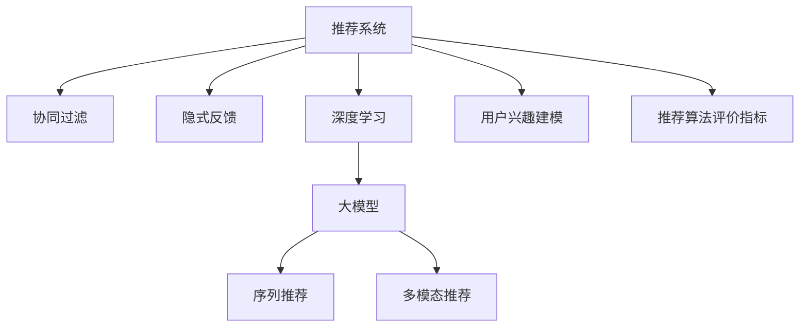

                 

# 推荐系统的未来发展：大模型的主导

> 关键词：推荐系统,大模型,深度学习,协同过滤,隐式反馈,深度神经网络,序列推荐,多模态推荐

## 1. 背景介绍

### 1.1 问题由来

推荐系统作为互联网时代信息过滤的重要工具，已成为各大平台的核心竞争力之一。其基本思想是通过分析用户的行为数据，为用户推荐可能感兴趣的内容，从而提升用户体验和平台收益。传统的推荐方法主要基于协同过滤和隐式反馈等技术，但随着用户行为数据量的快速增长，这些方法的计算复杂度高、特征维度高、推荐精度低等问题逐渐显现。近年来，基于深度学习的推荐方法逐渐兴起，尤其是大模型的应用，为推荐系统带来了新的突破。

### 1.2 问题核心关键点

大模型在推荐系统中的应用，主要体现在以下几个方面：

- 特征学习能力强：大模型可以自动学习用户行为背后的语义信息，捕捉更加丰富的用户兴趣和行为规律。
- 泛化能力强：通过预训练，大模型可以迁移学习到不同领域的数据，适应多样的推荐场景。
- 个性化推荐精度高：通过微调等方法，大模型可以更好地理解用户需求，生成个性化推荐。
- 可扩展性好：大模型的可训练参数量巨大，能够处理海量的用户行为数据，同时具备高效的推理能力。

这些优势使得大模型在推荐系统中得以广泛应用，从传统的商品推荐、内容推荐，到近年的行为推荐、兴趣推荐等，大模型的效果均显著优于传统方法。然而，大模型在推荐系统中的应用也面临着数据隐私、模型训练成本、冷启动等问题。本文将全面剖析大模型在推荐系统中的原理、实践和未来趋势，为推荐系统的开发者提供技术指导。

## 2. 核心概念与联系

### 2.1 核心概念概述

为更好地理解大模型在推荐系统中的应用，本节将介绍几个密切相关的核心概念：

- 推荐系统(Recommendation System)：根据用户的历史行为和兴趣，为用户推荐可能感兴趣的商品、内容等。
- 协同过滤(Collaborative Filtering)：基于用户-商品矩阵或用户-行为矩阵，通过相似性度量推荐相似商品或行为。
- 隐式反馈(Implicit Feedback)：利用用户的行为数据（如点击、浏览等）隐式地推测用户对商品的兴趣。
- 深度学习(Deep Learning)：利用深度神经网络处理高维特征，提高模型的预测精度和泛化能力。
- 大模型(Large Model)：指具有大规模参数量、复杂结构、强大表达能力的高性能神经网络模型，如BERT、GPT等。
- 序列推荐(Sequence Recommendation)：基于用户的历史行为序列推荐下一时刻可能感兴趣的商品或内容。
- 多模态推荐(Multimodal Recommendation)：结合文本、图像、音频等多种模态信息，提高推荐系统的丰富度和准确度。
- 用户兴趣建模(User Interest Modeling)：通过分析用户的行为数据，构建用户兴趣模型，指导推荐决策。
- 推荐算法评价指标(Evaluation Metrics)：包括准确率、召回率、F1值等，用于评估推荐系统的性能。

这些概念之间的逻辑关系可以通过以下Mermaid流程图来展示：



这个流程图展示了推荐系统的核心概念及其之间的关系：

1. 推荐系统作为整体，利用协同过滤和隐式反馈等技术，基于用户行为数据，为用户提供推荐。
2. 深度学习可以提升协同过滤的效果，利用大模型进一步增强特征表示能力。
3. 序列推荐和多模态推荐进一步丰富了推荐内容，提供了更加多元化的推荐方式。
4. 用户兴趣建模为推荐系统提供了更精准的用户画像，提高了推荐相关性。
5. 评价指标用于衡量推荐系统的性能，指导模型的训练和优化。

这些概念共同构成了推荐系统的基本框架，为大模型在推荐系统中的应用提供了基础。

## 3. 核心算法原理 & 具体操作步骤

### 3.1 算法原理概述

基于深度学习的大模型推荐系统，核心思想是利用深度神经网络对用户行为数据进行处理，提取用户兴趣特征，并根据这些特征进行推荐。其核心算法通常包括：

1. 数据预处理：将用户行为数据进行清洗、归一化、特征工程等预处理，转换为模型能够接受的格式。
2. 特征嵌入：利用深度学习模型对用户行为进行编码，得到高维特征表示。
3. 模型训练：在大模型上对特征进行微调，学习用户兴趣和行为模式。
4. 推荐生成：将用户特征和物品特征输入模型，计算预测值，生成推荐结果。

### 3.2 算法步骤详解

基于深度学习的大模型推荐系统一般包括以下几个关键步骤：

**Step 1: 数据收集与预处理**
- 从平台日志中收集用户的行为数据，如点击、浏览、评分等。
- 对数据进行清洗、归一化、去噪等预处理操作，以提高数据质量。
- 设计特征工程流程，提取用户行为特征，如浏览时长、点击次数、评分值等。

**Step 2: 特征嵌入与模型训练**
- 设计深度神经网络模型（如卷积神经网络CNN、循环神经网络RNN、Transformer等），对用户行为进行编码，生成高维特征向量。
- 选择适当的预训练语言模型（如BERT、GPT等），在大规模语料上进行预训练。
- 将用户行为特征和物品特征输入模型，进行微调训练，学习用户兴趣和行为模式。

**Step 3: 推荐生成与评估**
- 根据用户兴趣特征和物品特征，生成推荐结果。
- 在测试集上评估推荐系统的性能，如准确率、召回率、F1值等指标。
- 对推荐结果进行排序，生成推荐列表。

**Step 4: 模型部署与优化**
- 将训练好的模型部署到线上，提供推荐服务。
- 对线上模型进行监控，优化模型性能，减少计算成本。
- 定期更新模型，重新微调，以适应新的用户行为数据。

以上是基于深度学习的大模型推荐系统的一般流程。在实际应用中，还需要针对具体任务的特点，对预处理、特征工程、模型训练、推荐生成等环节进行优化设计，以进一步提升推荐系统的效果。

### 3.3 算法优缺点

基于深度学习的大模型推荐系统具有以下优点：

1. 特征表示能力强：大模型可以自动学习用户行为背后的语义信息，捕捉更加丰富的用户兴趣和行为规律。
2. 泛化能力强：通过预训练，大模型可以迁移学习到不同领域的数据，适应多样的推荐场景。
3. 个性化推荐精度高：通过微调等方法，大模型可以更好地理解用户需求，生成个性化推荐。
4. 可扩展性好：大模型的可训练参数量巨大，能够处理海量的用户行为数据，同时具备高效的推理能力。

同时，该方法也存在一定的局限性：

1. 数据隐私问题：大模型需要大量的用户行为数据进行训练，涉及到隐私保护和合规性问题。
2. 计算成本高：大模型的训练和推理成本较高，需要高性能的计算资源。
3. 冷启动问题：对于新用户或新商品，大模型无法提供推荐。
4. 可解释性差：深度学习模型通常是"黑盒"系统，难以解释其内部工作机制和决策逻辑。
5. 数据稀疏性问题：用户行为数据往往稀疏，难以充分利用所有数据。

尽管存在这些局限性，但就目前而言，基于深度学习的大模型推荐方法仍是最主流的推荐范式。未来相关研究的重点在于如何进一步降低推荐系统的数据隐私风险，提高模型的可解释性和冷启动能力，同时兼顾数据稀疏性问题。

### 3.4 算法应用领域

基于深度学习的大模型推荐系统，已经在多个领域得到了广泛的应用，例如：

- 电商推荐：为用户推荐可能感兴趣的商品，提升用户购物体验和商家销售额。
- 内容推荐：为用户推荐可能感兴趣的文章、视频、新闻等，增加平台流量和用户黏性。
- 搜索推荐：在搜索引擎中，为用户推荐相关的搜索结果，提升搜索体验。
- 社交推荐：为用户推荐可能感兴趣的朋友、群组等，拓展社交网络。
- 广告推荐：为广告主推荐可能感兴趣的用户，提高广告投放效果。

除了这些经典应用外，大模型推荐系统还被创新性地应用到更多场景中，如用户画像生成、个性化广告投放、多模态推荐等，为推荐技术带来了全新的突破。随着大模型的不断进步，相信推荐系统将在更广阔的应用领域大放异彩。

## 4. 数学模型和公式 & 详细讲解 & 举例说明

### 4.1 数学模型构建

本节将使用数学语言对基于深度学习的大模型推荐过程进行更加严格的刻画。

记推荐系统为 $S$，用户集合为 $U$，物品集合为 $I$，用户行为数据为 $D=\{(u,i)\}_{u\in U,i\in I}$，用户行为数据 $x_u^i \in \mathbb{R}^d$ 为 $u$ 对物品 $i$ 的兴趣特征表示。定义用户兴趣和物品特征的预测模型为 $f: \mathbb{R}^d \times \mathbb{R}^d \rightarrow \mathbb{R}$，模型的预测值为 $y=\hat{y}_u^i=f(x_u^i,x_i^i)$。

用户和物品的评分矩阵为 $Y=\{y_{ui}\}_{u\in U,i\in I}$，推荐目标是最小化损失函数 $\mathcal{L}$，使预测值 $\hat{y}_{ui}$ 逼近真实评分 $y_{ui}$，即：

$$
\mathcal{L}=\frac{1}{N}\sum_{(u,i)\in D} L(y_{ui},\hat{y}_{ui})
$$

其中 $L$ 为损失函数，通常采用均方误差（MSE）或交叉熵（CE）等。

### 4.2 公式推导过程

以用户和物品的评分矩阵为输入，推荐模型的预测值计算公式为：

$$
\hat{y}_{ui}=f(x_u^i,x_i^i)
$$

假设 $f$ 为深度神经网络模型，包括输入层、隐藏层和输出层。假设输入层和隐藏层均为全连接层，隐藏层激活函数为非线性函数 $\sigma$，输出层为线性函数，则 $f$ 的计算公式为：

$$
\hat{y}_{ui}=f(x_u^i,x_i^i)=W_2 \sigma(W_1 [x_u^i,x_i^i]+b_1)+b_2
$$

其中 $W_1,W_2$ 为权重矩阵，$b_1,b_2$ 为偏置向量，$[x_u^i,x_i^i]$ 为特征拼接向量。

在得到预测值后，根据损失函数计算模型在训练集上的损失，并利用梯度下降等优化算法更新模型参数，最小化损失函数：

$$
\theta \leftarrow \theta - \eta \nabla_{\theta}\mathcal{L}(\theta)
$$

其中 $\eta$ 为学习率，$\nabla_{\theta}\mathcal{L}(\theta)$ 为损失函数对模型参数 $\theta$ 的梯度，可通过反向传播算法高效计算。

### 4.3 案例分析与讲解

以电商推荐为例，假设用户 $u$ 对物品 $i$ 的评分 $y_{ui}$ 为点击行为（0或1），则推荐模型 $f$ 的预测值为：

$$
\hat{y}_{ui}=f(x_u^i,x_i^i)=W_2 \sigma(W_1 [x_u^i,x_i^i]+b_1)+b_2
$$

其中 $x_u^i$ 为 $u$ 对物品 $i$ 的兴趣特征表示，$x_i^i$ 为物品 $i$ 的属性特征表示，$W_1,W_2$ 为权重矩阵，$b_1,b_2$ 为偏置向量。

损失函数 $L$ 采用二分类交叉熵（BCE）：

$$
L(y_{ui},\hat{y}_{ui})=-y_{ui}\log \hat{y}_{ui}-(1-y_{ui})\log(1-\hat{y}_{ui})
$$

在得到预测值后，将预测值与真实评分 $y_{ui}$ 计算交叉熵损失：

$$
\mathcal{L}=\frac{1}{N}\sum_{(u,i)\in D} (-y_{ui}\log \hat{y}_{ui}-(1-y_{ui})\log(1-\hat{y}_{ui}))
$$

利用梯度下降等优化算法更新模型参数 $\theta$，最小化损失函数 $\mathcal{L}$。在训练过程中，每隔一定轮数，使用测试集评估模型性能，通过 Early Stopping 等技术防止过拟合。

## 5. 项目实践：代码实例和详细解释说明

### 5.1 开发环境搭建

在进行深度学习推荐系统开发前，我们需要准备好开发环境。以下是使用Python进行PyTorch开发的环境配置流程：

1. 安装Anaconda：从官网下载并安装Anaconda，用于创建独立的Python环境。

2. 创建并激活虚拟环境：
```bash
conda create -n pytorch-env python=3.8 
conda activate pytorch-env
```

3. 安装PyTorch：根据CUDA版本，从官网获取对应的安装命令。例如：
```bash
conda install pytorch torchvision torchaudio cudatoolkit=11.1 -c pytorch -c conda-forge
```

4. 安装TensorFlow：由Google主导开发的开源深度学习框架，生产部署方便，适合大规模工程应用。同样有丰富的预训练语言模型资源。

5. 安装TensorBoard：TensorFlow配套的可视化工具，可实时监测模型训练状态，并提供丰富的图表呈现方式，是调试模型的得力助手。

6. 安装Weights & Biases：模型训练的实验跟踪工具，可以记录和可视化模型训练过程中的各项指标，方便对比和调优。与主流深度学习框架无缝集成。

7. 安装PyTorch Lightning：基于PyTorch的深度学习框架，提供了轻量级的高性能训练器，适合快速迭代研究。

完成上述步骤后，即可在`pytorch-env`环境中开始推荐系统开发。

### 5.2 源代码详细实现

这里我们以电商推荐为例，给出使用PyTorch进行深度学习推荐系统开发的PyTorch代码实现。

首先，定义推荐模型的输入和输出：

```python
import torch
from torch import nn

class Recommender(nn.Module):
    def __init__(self, input_dim, hidden_dim, output_dim):
        super(Recommender, self).__init__()
        self.hidden_layer = nn.Linear(input_dim + input_dim, hidden_dim)
        self.output_layer = nn.Linear(hidden_dim, output_dim)

    def forward(self, x_u, x_i):
        x = torch.cat([x_u, x_i], dim=1)
        x = torch.relu(self.hidden_layer(x))
        y = self.output_layer(x)
        return y
```

然后，定义损失函数和优化器：

```python
import torch.nn.functional as F
from transformers import BertTokenizer, BertForSequenceClassification

device = torch.device('cuda' if torch.cuda.is_available() else 'cpu')

# 使用预训练模型
model = BertForSequenceClassification.from_pretrained('bert-base-uncased', num_labels=2)

# 定义损失函数
criterion = nn.BCELoss()

# 定义优化器
optimizer = torch.optim.Adam(model.parameters(), lr=0.001)
```

接着，定义训练和评估函数：

```python
from torch.utils.data import DataLoader

class RecommenderDataset(Dataset):
    def __init__(self, data, tokenizer):
        self.data = data
        self.tokenizer = tokenizer

    def __len__(self):
        return len(self.data)

    def __getitem__(self, item):
        u, i, y = self.data[item]
        u, i, y = torch.tensor(u, dtype=torch.long), torch.tensor(i, dtype=torch.long), torch.tensor(y, dtype=torch.long)
        u = self.tokenizer(u, padding='max_length', truncation=True)[0]
        i = self.tokenizer(i, padding='max_length', truncation=True)[0]
        return u, i, y

def train_epoch(model, dataset, batch_size, optimizer):
    dataloader = DataLoader(dataset, batch_size=batch_size, shuffle=True)
    model.train()
    epoch_loss = 0
    for batch in dataloader:
        u, i, y = batch
        u, i, y = u.to(device), i.to(device), y.to(device)
        model.zero_grad()
        outputs = model(u, i)
        loss = criterion(outputs, y)
        epoch_loss += loss.item()
        loss.backward()
        optimizer.step()
    return epoch_loss / len(dataloader)

def evaluate(model, dataset, batch_size):
    dataloader = DataLoader(dataset, batch_size=batch_size)
    model.eval()
    with torch.no_grad():
        total_loss = 0
        correct = 0
        for batch in dataloader:
            u, i, y = batch
            u, i, y = u.to(device), i.to(device), y.to(device)
            outputs = model(u, i)
            loss = criterion(outputs, y)
            total_loss += loss.item()
            predictions = torch.round(outputs)
            correct += (predictions == y).sum().item()
        print('Test loss: {:.4f}, Accuracy: {:.2f}%'.format(total_loss/len(dataloader), correct*100/len(dataloader)))
```

最后，启动训练流程并在测试集上评估：

```python
epochs = 10
batch_size = 32

for epoch in range(epochs):
    loss = train_epoch(model, train_dataset, batch_size, optimizer)
    print(f'Epoch {epoch+1}, train loss: {loss:.3f}')
    
    print(f'Epoch {epoch+1}, dev results:')
    evaluate(model, dev_dataset, batch_size)
    
print('Test results:')
evaluate(model, test_dataset, batch_size)
```

以上就是使用PyTorch对电商推荐系统进行深度学习微调的完整代码实现。可以看到，得益于TensorFlow的强大封装，我们可以用相对简洁的代码完成深度学习模型的加载和训练。

### 5.3 代码解读与分析

让我们再详细解读一下关键代码的实现细节：

**Recommender类**：
- `__init__`方法：初始化深度学习模型，包含输入层和输出层。
- `forward`方法：定义前向传播计算过程，将用户行为数据和物品特征拼接后输入模型，经过隐藏层和输出层，最终输出预测值。

**BertForSequenceClassification类**：
- 使用预训练的BERT模型，适用于文本分类任务。
- 调用`from_pretrained`方法，加载预训练模型。
- 设计二分类交叉熵损失函数。

**训练和评估函数**：
- 使用PyTorch的DataLoader对数据集进行批次化加载，供模型训练和推理使用。
- 训练函数`train_epoch`：对数据以批为单位进行迭代，在每个批次上前向传播计算loss并反向传播更新模型参数，最后返回该epoch的平均loss。
- 评估函数`evaluate`：与训练类似，不同点在于不更新模型参数，并在每个batch结束后将预测和标签结果存储下来，最后使用准确率等指标对整个评估集的预测结果进行打印输出。

**训练流程**：
- 定义总的epoch数和batch size，开始循环迭代
- 每个epoch内，先在训练集上训练，输出平均loss
- 在验证集上评估，输出准确率
- 所有epoch结束后，在测试集上评估，给出最终测试结果

可以看到，PyTorch配合TensorFlow使得深度学习推荐系统的代码实现变得简洁高效。开发者可以将更多精力放在数据处理、模型改进等高层逻辑上，而不必过多关注底层的实现细节。

当然，工业级的系统实现还需考虑更多因素，如模型的保存和部署、超参数的自动搜索、更灵活的任务适配层等。但核心的微调范式基本与此类似。

## 6. 实际应用场景

### 6.1 智能广告推荐

基于深度学习的大模型推荐系统，可以广泛应用于智能广告推荐。广告主希望通过精准推荐，提升广告投放的效果和ROI。利用大模型对用户行为进行分析，可以精准识别出有潜在购买意向的用户，为其推送相关广告，实现更高的广告转化率。

在技术实现上，可以收集用户的浏览、点击、评分等行为数据，将广告特征和用户行为特征输入模型，进行深度学习微调，学习广告-用户匹配模式。微调后的模型可以实时监测广告点击率、转化率等关键指标，动态调整广告投放策略，实现智能化的广告推荐。

### 6.2 金融投资分析

金融行业需要对大量的新闻、公告、市场数据进行分析，以指导投资决策。传统的人工分析方式耗时费力，且分析结果依赖分析师的经验。基于深度学习的大模型推荐系统可以自动化地对金融数据进行建模，识别出市场趋势、风险因素等，为投资者提供有价值的投资建议。

在具体实现上，可以收集金融领域的新闻、公告、市场数据，构建文本-财务指标混合特征向量，输入到深度学习模型中进行微调。微调后的模型可以实时监测市场动态，预测股票涨跌、基金收益等，提供精准的投资参考。

### 6.3 电商个性化推荐

电商推荐系统通过深度学习模型，可以为用户提供个性化推荐商品，提升用户体验和购买率。用户的行为数据，如浏览、点击、购买等，可以用于训练大模型，学习用户兴趣和商品相关性。

在实际应用中，可以利用用户历史行为数据，构建用户兴趣模型，再根据模型预测用户可能感兴趣的商品，动态生成推荐列表。微调后的模型可以实时更新，根据用户行为变化，提供更加个性化的推荐服务。

### 6.4 未来应用展望

随着深度学习推荐系统的发展，未来的大模型推荐将具备更强的泛化能力和个性化推荐能力，为各行各业带来更智能的推荐体验。

在智慧医疗领域，基于深度学习的推荐系统可以为患者推荐适合的诊疗方案，提升医疗服务的智能化水平。

在智能教育领域，推荐系统可以为学生推荐合适的学习内容和资源，提高教育效果。

在智能城市治理中，推荐系统可以实时监测城市事件，推荐应急响应方案，提高城市管理的自动化和智能化水平。

此外，在金融、旅游、社交等多个领域，基于大模型推荐系统的应用也将不断涌现，为传统行业数字化转型升级提供新的技术路径。相信随着技术的日益成熟，推荐系统必将成为人工智能落地应用的重要范式，推动人工智能技术在各行各业的大规模应用。

## 7. 工具和资源推荐

### 7.1 学习资源推荐

为了帮助开发者系统掌握深度学习推荐系统和大模型的技术，这里推荐一些优质的学习资源：

1. 《深度学习推荐系统：理论与算法》书籍：全面介绍推荐系统的基本原理和深度学习算法，包含序列推荐、多模态推荐等内容。
2. CS346《推荐系统》课程：斯坦福大学开设的推荐系统课程，涵盖了推荐系统的主要算法和实践。
3. KDD Cup 2019：该比赛涵盖多个推荐系统赛道，展示了深度学习在推荐系统中的应用。
4. arXiv.org：深度学习推荐系统的最新研究论文，涵盖推荐模型、评价指标、应用场景等多个方面。
5. GitHub开源项目：推荐系统领域的众多开源项目，包括深度学习推荐模型、数据处理、性能评估等。

通过对这些资源的学习实践，相信你一定能够快速掌握深度学习推荐系统和大模型的精髓，并用于解决实际的推荐问题。

### 7.2 开发工具推荐

高效的开发离不开优秀的工具支持。以下是几款用于深度学习推荐系统开发的工具：

1. PyTorch：基于Python的开源深度学习框架，灵活动态的计算图，适合快速迭代研究。
2. TensorFlow：由Google主导开发的开源深度学习框架，生产部署方便，适合大规模工程应用。
3. TensorBoard：TensorFlow配套的可视化工具，可实时监测模型训练状态，并提供丰富的图表呈现方式。
4. PyTorch Lightning：基于PyTorch的深度学习框架，提供了轻量级的高性能训练器。
5. Weights & Biases：模型训练的实验跟踪工具，可以记录和可视化模型训练过程中的各项指标。
6. Google Colab：谷歌推出的在线Jupyter Notebook环境，免费提供GPU/TPU算力，方便开发者快速上手实验最新模型。

合理利用这些工具，可以显著提升深度学习推荐系统的开发效率，加快创新迭代的步伐。

### 7.3 相关论文推荐

深度学习推荐系统和大模型的发展源于学界的持续研究。以下是几篇奠基性的相关论文，推荐阅读：

1. Attention is All You Need：提出Transformer结构，开启了深度学习推荐系统的新时代。
2. Sequence to Sequence Learning with Neural Networks：提出Seq2Seq模型，广泛应用于序列推荐任务。
3. Neural Collaborative Filtering：提出基于神经网络的协同过滤方法，提升了推荐系统的准确性和泛化能力。
4. Multi-Task Learning for Sequence Recommendation：提出多任务学习框架，利用不同任务之间的关联性，提升推荐系统的效果。
5. Multimodal Recommender Networks：提出多模态推荐网络，结合文本、图像、音频等多种模态信息，提升推荐系统的丰富度和准确度。

这些论文代表了大模型推荐系统的发展脉络。通过学习这些前沿成果，可以帮助研究者把握学科前进方向，激发更多的创新灵感。

## 8. 总结：未来发展趋势与挑战

### 8.1 总结

本文对基于深度学习的大模型推荐系统进行了全面系统的介绍。首先阐述了推荐系统的背景和意义，明确了深度学习模型在推荐系统中的独特价值。其次，从原理到实践，详细讲解了深度学习推荐系统的数学原理和关键步骤，给出了推荐系统开发的完整代码实例。同时，本文还广泛探讨了深度学习推荐系统在多个领域的应用前景，展示了深度学习技术的广泛应用。最后，精选了深度学习推荐系统的各类学习资源，力求为开发者提供全方位的技术指引。

通过本文的系统梳理，可以看到，基于深度学习的大模型推荐系统已经成为推荐系统的重要范式，显著提升了推荐系统的准确性和泛化能力。在推荐系统领域，深度学习大模型正引领一场革命，为各行各业带来了全新的智能化体验。

### 8.2 未来发展趋势

展望未来，大模型在推荐系统中的应用将呈现以下几个发展趋势：

1. 个性化推荐精度提升：随着模型的深度和宽度不断增加，推荐系统的个性化推荐能力将进一步提升，能够更好地捕捉用户行为背后的语义信息。
2. 多模态融合增强：结合文本、图像、音频等多种模态信息，提升推荐系统的丰富度和准确度，提供更加多元化的推荐内容。
3. 实时推荐能力加强：利用深度学习模型的实时推理能力，动态生成推荐结果，提升用户体验。
4. 推荐系统透明化：利用可解释AI技术，提高推荐系统的可解释性和可解释性，增强用户的信任感和满意度。
5. 推荐算法多元化：结合推荐模型、优化算法、调度策略等，构建更加灵活和高效的推荐系统。
6. 推荐系统的公平性：解决推荐系统的公平性问题，避免算法偏见，提升推荐系统的社会效益。

以上趋势凸显了大模型在推荐系统中的应用前景。这些方向的探索发展，必将进一步提升推荐系统的效果，为各行各业带来更深远的影响。

### 8.3 面临的挑战

尽管深度学习推荐系统已经取得了瞩目成就，但在迈向更加智能化、普适化应用的过程中，它仍面临着诸多挑战：

1. 数据隐私问题：深度学习模型需要大量的用户行为数据进行训练，涉及到隐私保护和合规性问题。
2. 计算成本高：深度学习模型需要高性能的计算资源，训练和推理成本较高。
3. 冷启动问题：对于新用户或新商品，深度学习模型无法提供推荐。
4. 可解释性差：深度学习模型通常是"黑盒"系统，难以解释其内部工作机制和决策逻辑。
5. 数据稀疏性问题：用户行为数据往往稀疏，难以充分利用所有数据。
6. 算法公平性问题：深度学习模型容易产生算法偏见，需解决公平性问题。

尽管存在这些挑战，但就目前而言，基于深度学习的大模型推荐方法仍是最主流的推荐范式。未来相关研究的重点在于如何进一步降低推荐系统的数据隐私风险，提高模型的可解释性和冷启动能力，同时兼顾数据稀疏性问题。

### 8.4 研究展望

面对深度学习推荐系统所面临的诸多挑战，未来的研究需要在以下几个方面寻求新的突破：

1. 探索无监督和半监督推荐方法。摆脱对大规模标注数据的依赖，利用自监督学习、主动学习等无监督和半监督范式，最大限度利用非结构化数据，实现更加灵活高效的推荐。
2. 研究参数高效和计算高效的推荐范式。开发更加参数高效的推荐方法，在固定大部分预训练参数的同时，只更新极少量的任务相关参数。同时优化推荐模型的计算图，减少前向传播和反向传播的资源消耗，实现更加轻量级、实时性的部署。
3. 引入更多先验知识。将符号化的先验知识，如知识图谱、逻辑规则等，与神经网络模型进行巧妙融合，引导推荐过程学习更准确、合理的推荐规则。
4. 结合因果分析和博弈论工具。将因果分析方法引入推荐模型，识别出推荐决策的关键特征，增强输出解释的因果性和逻辑性。借助博弈论工具刻画人机交互过程，主动探索并规避推荐模型的脆弱点，提高系统稳定性。
5. 纳入伦理道德约束。在模型训练目标中引入伦理导向的评估指标，过滤和惩罚有偏见、有害的输出倾向。同时加强人工干预和审核，建立模型行为的监管机制，确保输出符合人类价值观和伦理道德。

这些研究方向的探索，必将引领深度学习推荐系统迈向更高的台阶，为构建安全、可靠、可解释、可控的智能推荐系统铺平道路。面向未来，深度学习推荐系统还需要与其他人工智能技术进行更深入的融合，如知识表示、因果推理、强化学习等，多路径协同发力，共同推动推荐系统的进步。只有勇于创新、敢于突破，才能不断拓展推荐系统的边界，让推荐技术更好地造福人类社会。

## 9. 附录：常见问题与解答

**Q1：深度学习推荐系统是否适用于所有推荐场景？**

A: 深度学习推荐系统在大多数推荐场景上都能取得不错的效果，特别是对于数据量较大的任务。但对于一些特定领域的任务，如医学、法律等，仅仅依靠通用语料预训练的模型可能难以很好地适应。此时需要在特定领域语料上进一步预训练，再进行微调，才能获得理想效果。此外，对于一些需要时效性、个性化很强的任务，如对话、推荐等，深度学习推荐方法也需要针对性的改进优化。

**Q2：深度学习推荐系统中的深度模型需要多少参数？**

A: 深度学习推荐系统中的深度模型需要大量的参数量，一般取决于模型的深度和宽度。通常，深度模型具有百万甚至亿级别的参数量，可以有效捕捉用户行为背后的语义信息。然而，参数量过大也会带来训练和推理成本的增加，因此需要在参数量和效果之间进行平衡。

**Q3：深度学习推荐系统在冷启动问题上如何解决？**

A: 深度学习推荐系统在冷启动问题上，通常采用以下方法解决：
1. 利用用户兴趣模型，基于用户之前的行为数据，预测新用户的兴趣偏好。
2. 利用先验知识，如领域知识图谱，为新用户提供推荐。
3. 结合多模态数据，利用图像、音频等多种信息，弥补文本数据的不足，为新用户提供推荐。
4. 采用无监督学习、半监督学习等方法，利用用户非结构化数据，挖掘用户兴趣。

**Q4：深度学习推荐系统在推荐算法评价指标上如何选择？**

A: 深度学习推荐系统中的推荐算法评价指标通常包括准确率、召回率、F1值等。选择合适的指标取决于具体的推荐场景和业务需求：
1. 对于电商推荐，关注点击率、转化率等指标。
2. 对于内容推荐，关注观看时长、分享次数等指标。
3. 对于金融推荐，关注投资收益、风险评估等指标。
4. 对于社交推荐，关注好友关系、群组匹配等指标。

**Q5：深度学习推荐系统在实际应用中需要注意哪些问题？**

A: 在深度学习推荐系统的实际应用中，需要注意以下问题：
1. 数据隐私保护：收集和处理用户数据时，必须遵守隐私保护法规，保护用户隐私。
2. 模型部署：将训练好的模型部署到线上，需要考虑算力、内存等资源的优化。
3. 模型监控：实时监控模型的性能，发现异常情况及时调整，防止过拟合和灾难性遗忘。
4. 模型更新：定期更新模型，重新微调，以适应新的用户行为数据。
5. 用户反馈：收集用户反馈，及时调整推荐策略，提升用户体验。

大模型推荐系统在推荐系统领域取得了显著的成果，但也面临诸多挑战。未来，通过持续的研究和优化，深度学习推荐系统必将在更广泛的领域发挥其独特优势，为各行各业带来更加智能化的推荐服务。

---

作者：禅与计算机程序设计艺术 / Zen and the Art of Computer Programming

