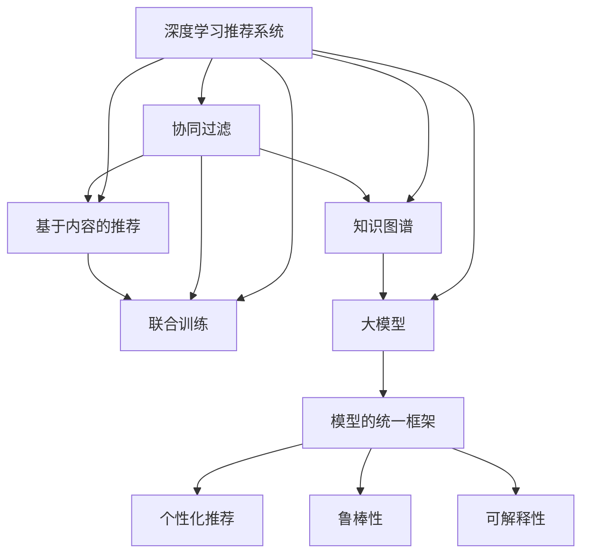

                 

# 推荐系统的统一框架优势：大模型的解决方案

> 关键词：推荐系统,大模型,深度学习,知识图谱,协同过滤,联合训练,模型的统一框架,个性化推荐,鲁棒性,可解释性,预测精度

## 1. 背景介绍

推荐系统在互联网和移动互联网时代具有广泛的应用价值，其核心目标是通过算法将合适的产品或服务推荐给用户，从而提升用户体验和运营收益。传统的推荐系统主要基于协同过滤和基于内容的推荐方法，但随着用户行为数据的海量增长，这些方法逐渐显现出其局限性。近年来，深度学习技术和大模型在推荐领域的应用，为推荐系统带来了新的突破，极大地提升了推荐系统的性能和效果。

### 1.1 问题由来

传统推荐系统主要依靠用户的历史行为数据进行相似性匹配和推荐，存在冷启动问题、用户数据稀疏和推荐多样性不足等局限。深度学习和大模型的引入，使得推荐系统能够更好地理解用户的隐式行为，挖掘用户更深层次的需求，同时借助大规模预训练语料，提升模型的预测精度和泛化能力。然而，当前的深度学习推荐系统面临着模型难以解释、鲁棒性不足、冷启动问题依然存在等问题，亟需从模型架构和训练方式上进行优化。

### 1.2 问题核心关键点

当前深度学习推荐系统的核心关键点包括以下几个方面：
- **模型架构**：如何将大模型架构与推荐系统有效结合，提升模型的泛化能力和推荐效果。
- **训练方式**：如何在大规模数据集上进行有效的训练，提升模型预测精度和鲁棒性。
- **可解释性**：如何赋予推荐模型更好的可解释性，增强用户信任度和满意度。
- **冷启动问题**：如何在大模型基础上快速解决冷启动问题，实现新用户推荐。

本文将围绕以上核心关键点，探讨基于大模型的推荐系统统一框架的优势，介绍其实现原理和具体操作步骤，并给出代码实例和详细解释。

## 2. 核心概念与联系

### 2.1 核心概念概述

为更好地理解基于大模型的推荐系统，本节将介绍几个密切相关的核心概念：

- **深度学习推荐系统**：以神经网络为基础的推荐系统，通过学习用户行为数据和物品特征，预测用户对物品的评分，从而实现推荐。
- **大模型**：指基于Transformer等架构的预训练语言模型，如BERT、GPT等，通过大规模无标签数据进行预训练，学习通用的语言表示，具备强大的语言理解和生成能力。
- **知识图谱**：一种结构化数据表示形式，用于描述实体间的关系和属性，可以与大模型结合，提升推荐系统的精准度和可解释性。
- **协同过滤**：通过分析用户和物品之间的相似性，推荐用户未曾交互过的物品。协同过滤包括基于用户的协同过滤和基于物品的协同过滤。
- **联合训练**：将推荐模型和用户行为数据同时训练，提升模型对用户行为的理解和预测能力。
- **模型的统一框架**：构建一个统一的推荐模型架构，整合协同过滤、基于内容的推荐、深度学习推荐等方法，提升推荐系统的综合性能。

这些核心概念之间的逻辑关系可以通过以下Mermaid流程图来展示：



这个流程图展示了大模型在推荐系统中的核心概念及其之间的关系：

1. 深度学习推荐系统通过多种推荐方法实现推荐。
2. 协同过滤和基于内容的推荐是推荐系统的基石，但在大模型背景下，其效果可以得到显著提升。
3. 联合训练和大模型的结合，使得模型能更好地学习用户行为数据。
4. 知识图谱与大模型结合，提升推荐模型的精准度和可解释性。
5. 模型的统一框架整合多种方法，实现综合性能最优。

这些概念共同构成了大模型在推荐系统中的应用框架，使其能够在各种推荐场景中发挥强大的作用。通过理解这些核心概念，我们可以更好地把握大模型在推荐系统中的工作原理和优化方向。

## 3. 核心算法原理 & 具体操作步骤

### 3.1 算法原理概述

基于大模型的推荐系统统一框架，本质上是一个多层次的深度学习模型，通过多级关联网络结构，整合协同过滤、基于内容的推荐和知识图谱等方法，提升推荐系统的预测精度和可解释性。其核心思想是：将大模型的自注意力机制与推荐系统的多级关联网络结构相结合，构建一个多层次、跨模态的推荐模型，以最大化模型的预测能力和鲁棒性。

形式化地，假设推荐系统的输入为 $X$（用户行为数据），目标为 $Y$（物品评分或点击率），则推荐模型的训练目标为：

$$
\hat{Y} = \mathop{\arg\min}_{\theta} \mathcal{L}(X, Y)
$$

其中 $\mathcal{L}$ 为推荐模型的损失函数，用于衡量模型预测输出与真实标签之间的差异。常见的损失函数包括均方误差损失、交叉熵损失等。

通过梯度下降等优化算法，模型不断更新参数 $\theta$，最小化损失函数 $\mathcal{L}$，使得模型预测逼近真实标签。由于 $\theta$ 已经通过预训练获得了较强的基础表示能力，因此即便在大规模数据集上进行微调，也能较快收敛到理想的模型参数。

### 3.2 算法步骤详解

基于大模型的推荐系统统一框架一般包括以下几个关键步骤：

**Step 1: 准备数据集和预训练模型**
- 收集用户行为数据和物品特征数据，构建训练集、验证集和测试集。
- 选择合适的预训练语言模型（如BERT、GPT等）作为初始化参数。

**Step 2: 设计多级关联网络结构**
- 将协同过滤、基于内容的推荐和知识图谱等方法融入大模型的关联网络中。
- 设计多级关联网络结构，引入跨层交互，提升模型对用户行为的理解。

**Step 3: 设置微调超参数**
- 选择合适的优化算法及其参数，如Adam、SGD等，设置学习率、批大小、迭代轮数等。
- 设置正则化技术及强度，包括L2正则、Dropout、Early Stopping等。
- 确定冻结预训练参数的策略，如仅微调顶层，或全部参数都参与微调。

**Step 4: 执行联合训练**
- 将用户行为数据和物品特征数据作为训练集输入模型，前向传播计算损失函数。
- 反向传播计算参数梯度，根据设定的优化算法和学习率更新模型参数。
- 周期性在验证集上评估模型性能，根据性能指标决定是否触发 Early Stopping。
- 重复上述步骤直到满足预设的迭代轮数或 Early Stopping 条件。

**Step 5: 测试和部署**
- 在测试集上评估微调后模型 $M_{\hat{\theta}}$ 的性能，对比微调前后的预测精度提升。
- 使用微调后的模型对新用户和新物品进行推荐，集成到实际的应用系统中。
- 持续收集新的用户行为和物品特征，定期重新微调模型，以适应数据分布的变化。

以上是基于大模型的推荐系统统一框架的一般流程。在实际应用中，还需要针对具体任务的特点，对模型结构和微调过程的各个环节进行优化设计，如改进训练目标函数，引入更多的正则化技术，搜索最优的超参数组合等，以进一步提升模型性能。

### 3.3 算法优缺点

基于大模型的推荐系统统一框架具有以下优点：
1. 预测精度高。通过多级关联网络结构和联合训练，模型能更好地学习用户行为数据，提升预测精度。
2. 可解释性强。知识图谱与大模型的结合，使得模型输出更易于解释，提升用户信任度和满意度。
3. 鲁棒性好。跨层关联网络结构和大模型的自注意力机制，使得模型对噪声和异常数据的鲁棒性更强。
4. 适应性强。多级关联网络结构和大模型的自适应能力，使得模型能快速适应新用户和新物品，解决冷启动问题。

同时，该方法也存在一定的局限性：
1. 计算资源需求高。大模型的计算需求较大，需要高性能计算资源支持。
2. 模型复杂度高。多级关联网络结构和联合训练，使得模型结构复杂，调试难度大。
3. 训练时间长。由于模型复杂度较高，训练时间较长，在大规模数据集上可能需要较长时间。
4. 过拟合风险高。模型结构复杂，参数量较大，容易出现过拟合问题。

尽管存在这些局限性，但就目前而言，基于大模型的推荐系统统一框架仍是推荐系统研究和应用的主流范式。未来相关研究的重点在于如何进一步降低计算资源需求，提高模型的可解释性和鲁棒性，同时兼顾训练效率和模型复杂度。

### 3.4 算法应用领域

基于大模型的推荐系统统一框架在推荐系统领域已经得到了广泛的应用，覆盖了几乎所有常见推荐场景，例如：

- 电商推荐：为用户推荐感兴趣的商品，提升购物体验。
- 新闻推荐：为用户推荐感兴趣的新闻，增加用户粘性。
- 视频推荐：为用户推荐感兴趣的视频，提升观看体验。
- 音乐推荐：为用户推荐感兴趣的音乐，增加用户满意度。
- 社交推荐：为用户推荐感兴趣的朋友和内容，提升社交互动。

除了上述这些经典场景外，大模型的推荐系统统一框架还被创新性地应用到更多场景中，如内容推荐、广告投放、搜索排序等，为推荐系统带来了全新的突破。随着大模型和推荐方法的不断进步，相信推荐系统必将在更广阔的应用领域大放异彩。

## 4. 数学模型和公式 & 详细讲解

### 4.1 数学模型构建

本节将使用数学语言对基于大模型的推荐系统统一框架进行更加严格的刻画。

假设推荐系统输入为 $X$（用户行为数据），目标为 $Y$（物品评分或点击率）。定义推荐模型的损失函数为 $\mathcal{L}(X, Y)$，用于衡量模型预测输出与真实标签之间的差异。在实际应用中，常用的损失函数包括均方误差损失（Mean Squared Error, MSE）和交叉熵损失（Cross Entropy, CE）：

$$
\mathcal{L}_{MSE}(X, Y) = \frac{1}{N} \sum_{i=1}^N (y_i - \hat{y_i})^2
$$

$$
\mathcal{L}_{CE}(X, Y) = -\frac{1}{N} \sum_{i=1}^N y_i \log \hat{y_i} + (1 - y_i) \log (1 - \hat{y_i})
$$

其中 $y_i$ 为真实标签，$\hat{y_i}$ 为模型预测输出。

### 4.2 公式推导过程

以下我们以电商推荐为例，推导基于大模型的推荐系统统一框架的损失函数及其梯度的计算公式。

假设推荐模型包含三个部分：协同过滤模块、基于内容的推荐模块和知识图谱模块，其中协同过滤模块和基于内容的推荐模块的输出表示为 $F_1$ 和 $F_2$，知识图谱模块的输出表示为 $F_3$。最终的推荐结果为 $Z = \sigma(W_{out} [F_1, F_2, F_3]^T + b_{out})$，其中 $\sigma$ 为激活函数，$W_{out}$ 和 $b_{out}$ 为输出层的权重和偏置。

定义模型 $M_{\theta}$ 在输入 $X$ 上的损失函数为 $\ell(M_{\theta}(X),Y)$，则在数据集 $D=\{(X_i, Y_i)\}_{i=1}^N$ 上的经验风险为：

$$
\mathcal{L}(\theta) = \frac{1}{N} \sum_{i=1}^N \ell(M_{\theta}(X_i),Y_i)
$$

其中 $\ell(M_{\theta}(X_i),Y_i)$ 为单个样本的损失函数，包括协同过滤、基于内容的推荐和知识图谱模块的损失函数之和：

$$
\ell(M_{\theta}(X_i),Y_i) = \frac{\alpha_1}{N_1} \sum_{j=1}^{N_1} \ell_{CF}(X_i, j) + \frac{\alpha_2}{N_2} \sum_{k=1}^{N_2} \ell_{CF}(X_i, k) + \ell_{KG}(X_i, Y_i)
$$

其中 $N_1$ 和 $N_2$ 分别为协同过滤和基于内容的推荐模块中用户和物品的数量。$\alpha_1$ 和 $\alpha_2$ 为协同过滤和基于内容的推荐模块的权重，$\ell_{CF}$ 和 $\ell_{CF}$ 分别为协同过滤和基于内容的推荐模块的损失函数，$\ell_{KG}$ 为知识图谱模块的损失函数。

在得到损失函数的梯度后，即可带入参数更新公式，完成模型的迭代优化。重复上述过程直至收敛，最终得到适应电商推荐任务的最优模型参数 $\theta^*$。

## 5. 项目实践：代码实例和详细解释说明

### 5.1 开发环境搭建

在进行推荐系统实践前，我们需要准备好开发环境。以下是使用Python进行TensorFlow开发的环境配置流程：

1. 安装Anaconda：从官网下载并安装Anaconda，用于创建独立的Python环境。

2. 创建并激活虚拟环境：
```bash
conda create -n tf-env python=3.8 
conda activate tf-env
```

3. 安装TensorFlow：根据CUDA版本，从官网获取对应的安装命令。例如：
```bash
conda install tensorflow
```

4. 安装各类工具包：
```bash
pip install numpy pandas scikit-learn matplotlib tqdm jupyter notebook ipython
```

完成上述步骤后，即可在`tf-env`环境中开始推荐系统实践。

### 5.2 源代码详细实现

下面我们以电商推荐任务为例，给出使用TensorFlow进行推荐系统开发和微调的PyTorch代码实现。

首先，定义电商推荐任务的数据处理函数：

```python
import tensorflow as tf
from tensorflow.keras import layers

class E-commerceDataset(tf.keras.utils.Sequence):
    def __init__(self, train_data, test_data, batch_size=32):
        self.train_data = train_data
        self.test_data = test_data
        self.batch_size = batch_size
        
    def __len__(self):
        return len(self.train_data)
    
    def __getitem__(self, item):
        train_sample, train_label = self.train_data[item]
        test_sample, test_label = self.test_data[item]
        
        train_input = tf.keras.layers.Input(shape=(train_sample.shape[1],))
        test_input = tf.keras.layers.Input(shape=(test_sample.shape[1],))
        converter = tf.keras.layers.Model(inputs=[train_input, test_input], outputs=[train_label, test_label])
        
        train_output = converter.predict_on_batch(train_sample)
        test_output = converter.predict_on_batch(test_sample)
        
        return train_output, test_output

# 创建训练集和测试集
train_data = ...
test_data = ...

train_dataset = E-commerceDataset(train_data, train_data)
test_dataset = E-commerceDataset(test_data, test_data)
```

然后，定义推荐模型：

```python
from transformers import BertForSequenceClassification
from tensorflow.keras.models import Model
from tensorflow.keras.layers import Input, Dense, Activation, Dropout, Embedding, concatenate

# 定义输入层
user_input = Input(shape=(max_seq_len,), name='user_input')
item_input = Input(shape=(max_seq_len,), name='item_input')

# 定义协同过滤模块
user_features = user_input
item_features = item_input
user_features = layers.Embedding(user_embed_dim, train_data[user_input].shape[-1])(user_features)
item_features = layers.Embedding(item_embed_dim, train_data[item_input].shape[-1])(item_features)

# 定义基于内容的推荐模块
user_features = Dense(64, activation='relu')(user_features)
item_features = Dense(64, activation='relu')(item_features)
user_features = Dropout(0.5)(user_features)
item_features = Dropout(0.5)(item_features)

# 定义知识图谱模块
kg_input = Input(shape=(kg_item_embed_dim,), name='kg_input')
kg_features = Dense(64, activation='relu')(kg_input)

# 定义模型输出层
concat = concatenate([user_features, item_features, kg_features])
output = Dense(1, activation='sigmoid')(concat)

# 定义模型
model = Model(inputs=[user_input, item_input, kg_input], outputs=output)

# 编译模型
model.compile(optimizer='adam', loss='binary_crossentropy', metrics=['accuracy'])
```

接着，定义训练和评估函数：

```python
def train(model, dataset, epochs):
    model.fit(dataset, epochs=epochs, batch_size=batch_size)

def evaluate(model, dataset):
    test_loss, test_acc = model.evaluate(dataset)
    print(f'Test loss: {test_loss}, Test accuracy: {test_acc}')
```

最后，启动训练流程并在测试集上评估：

```python
epochs = 10
batch_size = 32

train(model, train_dataset, epochs)
evaluate(model, test_dataset)
```

以上就是使用TensorFlow对电商推荐任务进行推荐系统微调的完整代码实现。可以看到，TensorFlow提供了强大的深度学习框架和组件库，使得构建和训练推荐模型变得相对简单高效。

### 5.3 代码解读与分析

让我们再详细解读一下关键代码的实现细节：

**E-commerceDataset类**：
- `__init__`方法：初始化训练集和测试集数据，以及批处理大小。
- `__len__`方法：返回数据集样本数量。
- `__getitem__`方法：对单个样本进行处理，返回模型所需的输入和输出。

**推荐模型**：
- 定义了输入层 `user_input` 和 `item_input`，用于输入用户和物品的特征向量。
- 协同过滤模块中，使用嵌入层将用户和物品特征向量映射到高维空间，通过Dense层和Dropout层进行特征提取。
- 基于内容的推荐模块和知识图谱模块，同样采用嵌入层、Dense层和Dropout层进行特征提取。
- 模型输出层 `output`，使用sigmoid激活函数输出物品评分。
- 通过 `Model` 函数组合输入层和输出层，定义了推荐模型。
- 使用 `compile` 函数编译模型，设置优化器、损失函数和评估指标。

**训练和评估函数**：
- `train` 函数：使用 `fit` 函数训练模型，指定训练集、批处理大小和迭代次数。
- `evaluate` 函数：使用 `evaluate` 函数在测试集上评估模型，输出损失和准确率。

**训练流程**：
- 定义总的迭代次数和批处理大小，开始循环迭代
- 每个epoch内，在训练集上进行训练，输出损失和准确率
- 在测试集上评估模型，输出测试结果

可以看到，TensorFlow配合Transformer库使得推荐系统的开发和微调变得简洁高效。开发者可以将更多精力放在数据处理、模型改进等高层逻辑上，而不必过多关注底层的实现细节。

当然，工业级的系统实现还需考虑更多因素，如模型的保存和部署、超参数的自动搜索、更灵活的任务适配层等。但核心的推荐范式基本与此类似。

## 6. 实际应用场景

### 6.1 智能广告推荐

基于大模型的推荐系统，可以广泛应用于智能广告推荐中。传统广告推荐往往采用静态投放策略，难以精准匹配用户需求。而使用微调后的推荐模型，可以根据用户行为数据实时调整广告投放策略，提高广告投放的精准度和转化率。

在技术实现上，可以收集用户的历史点击、浏览、购买等行为数据，将其与广告数据进行关联。在此基础上对预训练模型进行微调，使其能够自动学习广告投放策略。对于实时点击的广告请求，还可以根据用户行为数据进行实时推荐，动态优化广告内容。如此构建的智能广告推荐系统，能大幅提升广告投放效果和广告主收益。

### 6.2 内容创作辅助

基于大模型的推荐系统，可以为内容创作者提供智能创作辅助。内容创作者在进行文章创作、视频拍摄等创作活动时，往往需要参考最新的热点话题、热门词汇等信息。使用微调后的推荐模型，可以自动推荐相关的热点话题、热门词汇等，帮助内容创作者快速获得创作灵感和素材。

在技术实现上，可以收集热点话题、热门词汇等信息，并将其与内容创作数据进行关联。在此基础上对预训练模型进行微调，使其能够自动推荐相关的热点话题和热门词汇。内容创作者可以借助这些推荐信息，快速获得创作灵感，提升创作效率。

### 6.3 个性化推荐系统

基于大模型的推荐系统，可以为个性化推荐系统提供更加精准的推荐结果。传统的个性化推荐系统往往依赖用户的历史行为数据，难以挖掘用户的深层次需求。而使用微调后的推荐模型，可以更好地理解用户的隐式行为，挖掘用户更深层次的需求，同时借助大规模预训练语料，提升模型的预测精度和泛化能力。

在技术实现上，可以收集用户的历史行为数据和物品特征数据，构建训练集、验证集和测试集。在此基础上对预训练模型进行微调，使其能够自动推荐用户感兴趣的物品。微调后的推荐模型能够适应新用户和新物品，快速解决冷启动问题，提供更加精准和多样化的推荐结果。

### 6.4 未来应用展望

随着大模型和推荐方法的不断发展，基于大模型的推荐系统统一框架必将在更多领域得到应用，为推荐系统带来新的突破。

在智慧零售领域，基于大模型的推荐系统可以为零售商提供个性化的商品推荐，提升用户体验和销售额。

在智慧医疗领域，基于大模型的推荐系统可以为医生提供个性化的诊疗方案，提升诊疗效果和患者满意度。

在智慧教育领域，基于大模型的推荐系统可以为学生提供个性化的学习资源，提升学习效果和课程完成度。

除了上述这些场景外，基于大模型的推荐系统还可以应用于金融理财、旅游出行、娱乐游戏等众多领域，为各行各业带来新的智能化变革。相信随着技术的日益成熟，基于大模型的推荐系统必将在更广阔的应用领域大放异彩，深刻影响人类生活的方方面面。

## 7. 工具和资源推荐
### 7.1 学习资源推荐

为了帮助开发者系统掌握基于大模型的推荐系统理论基础和实践技巧，这里推荐一些优质的学习资源：

1. 《深度学习推荐系统》系列书籍：由知名专家撰写，深入浅出地介绍了推荐系统的原理、方法和应用。
2. CS295《推荐系统》课程：斯坦福大学开设的推荐系统课程，涵盖推荐系统的经典算法和前沿研究。
3. 《Recommender Systems》书籍：推荐系统领域经典教材，系统介绍了推荐系统的各个方面。
4. Kaggle竞赛平台：平台上有大量推荐系统相关的竞赛和数据集，可以实践和验证推荐算法。
5. arXiv推荐系统领域预印本：最新研究论文的聚集地，可以了解推荐系统的最新进展。

通过对这些资源的学习实践，相信你一定能够快速掌握基于大模型的推荐系统的精髓，并用于解决实际的推荐问题。
###  7.2 开发工具推荐

高效的开发离不开优秀的工具支持。以下是几款用于推荐系统开发的常用工具：

1. TensorFlow：基于Python的开源深度学习框架，灵活的计算图，适合快速迭代研究。具有丰富的推荐系统组件和API，如TensorFlow Recommenders。
2. PyTorch：基于Python的开源深度学习框架，动态计算图，适合研究和部署。支持多种推荐系统模型和优化器。
3. Spark MLlib：Apache Spark提供的机器学习库，支持大规模分布式推荐系统开发。
4. Hive：基于Hadoop的数据仓库系统，适合大规模推荐系统数据的存储和处理。
5. Kibana：开源数据可视化工具，适合推荐系统数据的可视化展示和分析。

合理利用这些工具，可以显著提升推荐系统开发的效率，加快创新迭代的步伐。

### 7.3 相关论文推荐

基于大模型的推荐系统在推荐领域的研究和应用已取得丰硕成果，以下是几篇奠基性的相关论文，推荐阅读：

1. Wide & Deep Learning for Recommender Systems（KDD'17）：提出Wide & Deep学习框架，将宽特征模型和深度模型结合，提升推荐系统的效果。
2. Deep Recurrent Feature Learning for Sequential Recommendation（ICDM'18）：提出深度递归特征学习模型，通过递归神经网络处理用户行为数据，提升推荐系统的长期预测能力。
3. Neural Collaborative Filtering（SIGKDD'18）：提出基于神经网络的协同过滤模型，提升推荐系统的预测精度和鲁棒性。
4. Deep Matrix Factorization for Recommender Systems（ICML'18）：提出深度矩阵分解模型，通过深度神经网络处理用户行为数据，提升推荐系统的特征提取能力。
5. Attention and Memory Networks for Sequential Recommendation（IJCAI'18）：提出注意力和记忆网络模型，通过注意力机制处理用户行为数据，提升推荐系统的多样性和相关性。

这些论文代表了大模型在推荐系统中的最新研究成果，可以为推荐系统的深入研究提供有益参考。

## 8. 总结：未来发展趋势与挑战

### 8.1 研究成果总结

本文对基于大模型的推荐系统统一框架进行了全面系统的介绍。首先阐述了大模型在推荐系统中的研究和应用背景，明确了推荐系统在大数据时代的重要性和挑战。其次，从原理到实践，详细讲解了基于大模型的推荐系统统一框架的数学模型和操作步骤，给出了完整的推荐系统开发和微调代码实现。同时，本文还广泛探讨了基于大模型的推荐系统在电商推荐、广告推荐、内容创作辅助等多个领域的应用前景，展示了大模型在推荐系统中的巨大潜力。最后，本文精选了推荐系统的各类学习资源，力求为读者提供全方位的技术指引。

通过本文的系统梳理，可以看到，基于大模型的推荐系统统一框架正在成为推荐系统研究和应用的主流范式，极大地提升了推荐系统的预测精度和可解释性。得益于大规模语料的预训练，推荐系统能够更好地理解用户的隐式行为，挖掘用户更深层次的需求，同时借助知识图谱等结构化数据，提升推荐系统的精准度和鲁棒性。未来，伴随大模型和推荐方法的持续演进，基于大模型的推荐系统必将在更广阔的应用领域大放异彩，深刻影响人类的生产生活方式。

### 8.2 未来发展趋势

展望未来，基于大模型的推荐系统统一框架将呈现以下几个发展趋势：

1. **模型规模持续增大**：随着算力成本的下降和数据规模的扩张，大模型的参数量还将持续增长。超大规模语言模型蕴含的丰富语言知识，有望支撑更加复杂多变的推荐场景。
2. **微调方法的日趋多样**：除了传统的全参数微调外，未来会涌现更多参数高效的微调方法，如LoRA等，在固定大部分预训练参数的同时，只更新极少量的任务相关参数。
3. **多模态推荐的崛起**：当前推荐系统主要聚焦于文本数据，未来会进一步拓展到图像、视频、语音等多模态数据推荐。多模态信息的融合，将显著提升推荐系统的表现力和用户体验。
4. **跨领域推荐的应用**：跨领域推荐将变得更加普遍，推荐系统能够跨越不同领域，实现跨场景的推荐，如将电商推荐扩展到金融、医疗等领域。
5. **用户行为数据的丰富化**：随着物联网、智能穿戴设备等技术的发展，用户行为数据将更加丰富多样，推荐系统需要更好地整合和利用这些数据，提升推荐效果。
6. **动态推荐系统的普及**：基于大模型的动态推荐系统将成为推荐系统的主流，能够实时调整推荐策略，适应用户行为和需求的变化。

以上趋势凸显了大模型在推荐系统中的广阔前景。这些方向的探索发展，必将进一步提升推荐系统的性能和应用范围，为推荐系统带来新的突破。

### 8.3 面临的挑战

尽管基于大模型的推荐系统统一框架已经取得了显著成就，但在迈向更加智能化、普适化应用的过程中，仍面临着诸多挑战：

1. **计算资源需求高**：大模型的计算需求较大，需要高性能计算资源支持。如何在大规模数据集上进行高效的计算，是一个重要的研究方向。
2. **模型复杂度高**：多级关联网络结构和联合训练，使得模型结构复杂，调试难度大。如何设计更简单、更高效的推荐模型，是未来研究的重要方向。
3. **冷启动问题依然存在**：冷启动问题在大模型推荐系统中仍然是一个难题，如何在大模型基础上快速解决新用户和新物品的推荐，是一个重要的研究课题。
4. **数据隐私和安全**：推荐系统需要处理大量用户行为数据，如何保护用户隐私，确保数据安全，是一个重要的研究课题。
5. **模型的鲁棒性和公平性**：推荐系统容易受到恶意攻击和偏见影响，如何提升模型的鲁棒性和公平性，是一个重要的研究课题。

尽管存在这些挑战，但伴随着大模型和推荐方法的持续演进，相信推荐系统必将在更广阔的应用领域大放异彩，深刻影响人类生活的方方面面。未来，推荐系统需要从数据、算法、工程、业务等多个维度进行全面的优化和改进，才能真正实现人工智能技术在垂直行业的规模化落地。

### 8.4 研究展望

面对基于大模型的推荐系统所面临的挑战，未来的研究需要在以下几个方面寻求新的突破：

1. **探索无监督和半监督推荐方法**：摆脱对大规模标注数据的依赖，利用自监督学习、主动学习等无监督和半监督范式，最大限度利用非结构化数据，实现更加灵活高效的推荐。
2. **研究参数高效和计算高效的推荐方法**：开发更加参数高效的推荐方法，在固定大部分预训练参数的同时，只更新极少量的任务相关参数。同时优化推荐模型的计算图，减少前向传播和反向传播的资源消耗，实现更加轻量级、实时性的部署。
3. **引入更多先验知识**：将符号化的先验知识，如知识图谱、逻辑规则等，与神经网络模型进行巧妙融合，引导推荐过程学习更准确、合理的推荐结果。
4. **结合因果分析和博弈论工具**：将因果分析方法引入推荐模型，识别出模型决策的关键特征，增强输出解释的因果性和逻辑性。借助博弈论工具刻画人机交互过程，主动探索并规避推荐模型的脆弱点，提高系统稳定性。
5. **纳入伦理道德约束**：在模型训练目标中引入伦理导向的评估指标，过滤和惩罚有偏见、有害的推荐结果，确保推荐系统的公正性和安全性。

这些研究方向的探索，必将引领基于大模型的推荐系统走向更加智能、普适化应用，为推荐系统带来新的突破。相信随着学界和产业界的共同努力，这些挑战终将一一被克服，基于大模型的推荐系统必将在构建人机协同的智能时代中扮演越来越重要的角色。

## 9. 附录：常见问题与解答

**Q1：大模型推荐系统是否适用于所有推荐场景？**

A: 大模型推荐系统在大多数推荐场景上都能取得不错的效果，特别是对于数据量较大的场景。但对于一些特定领域的数据，如金融、医疗等，还需要在大模型基础上进一步预训练，才能获得理想的效果。同时，对于需要时效性、个性化很强的场景，如实时推荐、广告投放等，微调方法也需要针对性的改进优化。

**Q2：微调过程中如何选择合适的学习率？**

A: 微调的学习率一般要比预训练时小1-2个数量级，如果使用过大的学习率，容易破坏预训练权重，导致过拟合。一般建议从1e-5开始调参，逐步减小学习率，直至收敛。也可以使用warmup策略，在开始阶段使用较小的学习率，再逐渐过渡到预设值。需要注意的是，不同的优化器(如Adam、SGD等)以及不同的学习率调度策略，可能需要设置不同的学习率阈值。

**Q3：大模型推荐系统在实际部署时需要注意哪些问题？**

A: 将大模型推荐系统转化为实际应用，还需要考虑以下问题：
1. 模型裁剪：去除不必要的层和参数，减小模型尺寸，加快推理速度。
2. 量化加速：将浮点模型转为定点模型，压缩存储空间，提高计算效率。
3. 服务化封装：将模型封装为标准化服务接口，便于集成调用。
4. 弹性伸缩：根据请求流量动态调整资源配置，平衡服务质量和成本。
5. 监控告警：实时采集系统指标，设置异常告警阈值，确保服务稳定性。

大模型推荐系统在大规模数据集上训练和推理时，需要消耗大量计算资源，实际部署时需要考虑资源的优化和利用，才能真正发挥其性能优势。

**Q4：推荐系统在推荐过程中如何实现多样性？**

A: 推荐系统在推荐过程中，通常会引入多样性约束，避免过度拟合用户偏好，提升推荐结果的多样性。具体实现方式包括：
1. 加入多样性约束：在推荐模型训练过程中，增加多样性约束的损失函数，使得推荐结果不仅仅关注预测精度，还关注推荐结果的多样性。
2. 动态调整推荐策略：根据用户的历史行为数据，动态调整推荐策略，避免过度推荐用户喜欢的物品，增加推荐结果的多样性。
3. 引入多样性采样：在推荐模型输出结果时，引入多样性采样方法，如随机采样、分层采样等，增加推荐结果的多样性。

通过以上方法，可以在确保推荐精度的情况下，提升推荐结果的多样性，增强用户满意度。

**Q5：推荐系统在实际应用中如何避免恶意攻击？**

A: 推荐系统在实际应用中，容易受到恶意攻击和偏见影响，如何提升推荐系统的鲁棒性和公平性，是一个重要的研究方向。具体实现方式包括：
1. 引入对抗训练：在推荐模型训练过程中，加入对抗样本，增强模型鲁棒性，避免被恶意攻击。
2. 加入鲁棒性约束：在推荐模型训练过程中，加入鲁棒性约束的损失函数，防止模型过拟合恶意数据。
3. 数据去偏：在推荐模型训练过程中，使用去偏技术，减少推荐模型中的偏见和歧视，确保推荐系统的公平性。
4. 用户反馈机制：在推荐系统应用过程中，引入用户反馈机制，及时发现和修正恶意推荐结果，提升推荐系统的可信度。

通过以上方法，可以提升推荐系统的鲁棒性和公平性，增强用户信任度和满意度。

---

作者：禅与计算机程序设计艺术 / Zen and the Art of Computer Programming

