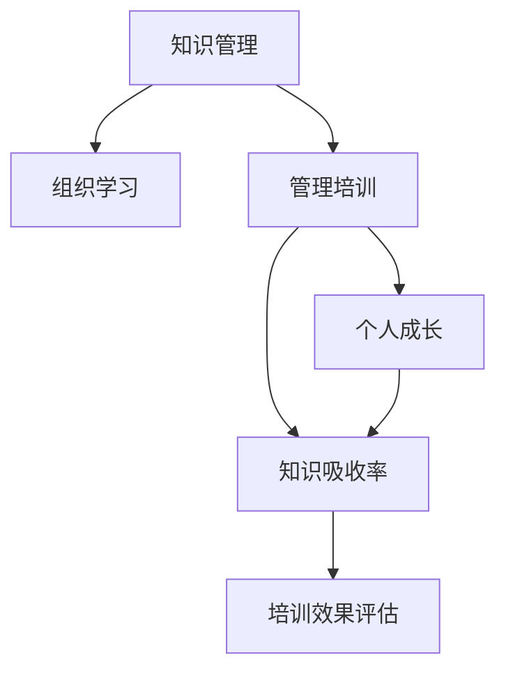

                 

# 提高知识吸收率:管理者成长的关键

> 关键词：知识管理,组织学习,管理培训,个人成长,培训效果评估

## 1. 背景介绍

### 1.1 问题由来

在当今快速变化和竞争激烈的环境中，管理者需要不断吸收新知识、新技术、新方法以适应组织发展的需要。然而，尽管现代学习资源丰富，知识更新速度快，管理者在实际工作中仍然面临知识吸收率低、学习效果不显著等问题。这些问题不仅影响管理者的个人成长，更关系着组织的长期发展。如何提高管理者的知识吸收率，成为企业管理和培训的关键挑战。

### 1.2 问题核心关键点

1. **知识管理的复杂性**：现代知识量庞大且分散，管理者需要掌握更高效的知识管理方法。
2. **学习过程的个性化**：每个管理者的学习需求和风格不同，个性化学习是提高知识吸收率的关键。
3. **知识的实践应用**：知识的吸收不仅仅是为了掌握，更重要的是能够应用到实际工作中，提升管理能力。
4. **培训效果的评估**：传统的培训评估方法往往效果单一，无法全面反映知识吸收情况。
5. **持续学习机制**：建立长期的持续学习机制，让知识吸收成为组织和个人的习惯。

### 1.3 问题研究意义

1. **促进管理者个人成长**：提高知识吸收率，使管理者不断更新知识和技能，提升工作绩效。
2. **推动组织创新**：管理者掌握新知识，能够推动组织进行知识创新和流程优化。
3. **增强组织竞争力**：通过知识管理提升组织的学习能力，增强市场适应性和竞争力。
4. **优化培训效果**：通过科学的评估方法，识别培训中的问题，优化培训内容和方式。

## 2. 核心概念与联系

### 2.1 核心概念概述

为更好地理解如何提高知识吸收率，本节将介绍几个密切相关的核心概念：

- **知识管理(Knowledge Management)**：通过组织知识流动、共享、利用等活动，提升组织整体的知识水平。
- **组织学习(Organizational Learning)**：组织成员通过学习、交流、合作等方式，积累和运用知识，实现组织目标。
- **管理培训(Management Training)**：通过系统化、科学化的培训方式，提高管理者的管理技能和知识水平。
- **个人成长(Personal Growth)**：个人通过不断学习、实践、反思，实现自身知识、技能、素质的全面提升。
- **知识吸收率(Knowledge Absorption Rate)**：指学习者在学习过程中，将所学知识转化为自身能力的过程效率和效果。
- **培训效果评估(Training Effectiveness Assessment)**：通过科学的方法评估培训的效果，及时调整和优化培训内容。

这些核心概念之间的逻辑关系可以通过以下Mermaid流程图来展示：



这个流程图展示了几类关键概念及其之间的关系：

1. 知识管理通过组织知识流动，支持组织学习。
2. 组织学习通过不断积累知识，提升个人成长。
3. 管理培训通过系统性教育，促进个人成长和知识吸收。
4. 知识吸收率衡量知识学习的转化效果。
5. 培训效果评估反馈知识吸收情况，优化培训方式。

## 3. 核心算法原理 & 具体操作步骤
### 3.1 算法原理概述

提高管理者知识吸收率的核心算法原理是基于认知心理学和教育学的理论，结合现代信息技术和管理学的实践，通过科学的方法论和工具手段，实现知识的有效传递和转化。

该算法的核心思想是：

1. **认知负荷理论**：根据认知负荷理论，控制知识的输入量和难度，避免信息过载。
2. **互动式学习**：通过互动式的学习方式，提升学习的趣味性和参与度。
3. **知识链理论**：结合知识链理论，建立知识链条，实现知识的全链条传递。
4. **经验学习理论**：结合经验学习理论，通过实践和反馈，深化知识理解和应用。

### 3.2 算法步骤详解

1. **需求分析**：通过问卷调查、面谈等方式，了解管理者的学习需求和风格。
2. **内容设计**：根据需求分析结果，设计适合管理者的学习内容和形式。
3. **实施培训**：利用互动式学习工具和平台，进行系统的知识传递和技能培训。
4. **效果评估**：通过问卷调查、测试、行为观察等方式，评估知识吸收率和培训效果。
5. **优化反馈**：根据评估结果，调整和优化培训内容和方式，持续提升学习效果。

### 3.3 算法优缺点

基于认知心理学和教育学的知识吸收率提升算法，具有以下优点：

1. **个性化学习**：根据每个管理者的需求和学习风格，设计个性化的学习内容和方式，提高学习效率。
2. **互动性强**：互动式的学习方式，提升学习的趣味性和参与度。
3. **科学评估**：通过科学的评估方法，全面反映知识吸收情况。
4. **持续改进**：根据评估结果，持续优化培训内容和方法，实现持续改进。

同时，该算法也存在一定的局限性：

1. **成本较高**：个性化设计和互动式学习需要较高的设计和实施成本。
2. **数据隐私**：数据收集和分析可能涉及数据隐私和保密问题。
3. **培训时间**：需要投入较长时间进行需求分析和效果评估，短期内难以看到效果。
4. **评估难度**：评估方法复杂，需要科学的设计和实施。

### 3.4 算法应用领域

基于认知心理学和教育学的知识吸收率提升算法，已经在多个领域得到应用，包括但不限于：

1. **企业管理培训**：通过系统化、科学化的培训方式，提升管理者的管理技能和知识水平。
2. **知识管理**：结合知识管理工具，实现知识的有效传递和转化。
3. **组织学习**：通过互动式的学习方式，提升组织的知识水平和创新能力。
4. **人力资源开发**：通过个性化的培训内容，提升员工的综合素质和竞争力。
5. **远程教育**：利用互动式学习平台，实现远程教育和管理者的在线培训。

## 4. 数学模型和公式 & 详细讲解 & 举例说明（备注：数学公式请使用latex格式，latex嵌入文中独立段落使用 $$，段落内使用 $)
### 4.1 数学模型构建

本节将使用数学语言对提高管理者知识吸收率的过程进行更加严格的刻画。

设管理者的知识吸收率为 $KAR$，其影响因素包括学习内容 $C$、学习时间 $T$、学习方式 $M$、学习环境 $E$、学习动机 $M$ 等。因此，知识吸收率的计算公式为：

$$
KAR = f(C, T, M, E, M)
$$

其中，$f$ 表示一个复杂的非线性函数，反映了各因素对知识吸收率的综合影响。

### 4.2 公式推导过程

知识吸收率的计算可以分解为以下几个子因素：

1. **学习内容 $C$**：包含知识点的深度和广度，以及与实际工作的相关性。
2. **学习时间 $T$**：学习时间越长，吸收率越高，但需考虑信息过载和疲劳因素。
3. **学习方式 $M$**：互动式、游戏化、体验式等学习方式，比传统的讲授式效果更好。
4. **学习环境 $E$**：学习环境的舒适度、设备条件、学习支持等，对学习效果有显著影响。
5. **学习动机 $M$**：学习者的兴趣、期望、心理状态等，影响学习积极性和效果。

通过对这些子因素进行分析，可以构建一个知识吸收率的计算模型，公式为：

$$
KAR = \alpha C^a T^b M^c E^d M^e
$$

其中，$\alpha$ 为模型参数，$a, b, c, d, e$ 为子因素对知识吸收率的贡献系数。通过科学实验和数据分析，可以逐步确定各系数的大小和符号。

### 4.3 案例分析与讲解

以一家公司的管理培训项目为例，分析知识吸收率的影响因素和计算过程：

1. **学习内容 $C$**：设计系统化的管理课程，包含决策制定、团队管理、领导力等核心内容，深度适中。
2. **学习时间 $T$**：每次培训时间为4小时，每周2次，连续8周。
3. **学习方式 $M$**：采用互动式教学，包括角色扮演、案例分析、讨论等。
4. **学习环境 $E$**：配备先进的培训设施和设备，提供舒适的培训环境。
5. **学习动机 $M$**：通过问卷调查和心理测试，发现大多数管理者对培训有较高期望和兴趣。

根据上述数据，可以计算知识吸收率 $KAR$：

$$
KAR = \alpha (4^a \times 2^{b} \times M^c \times E^d \times M^e)
$$

通过实际培训效果评估，可以不断调整和优化各因素的参数，逐步提升知识吸收率。

## 5. 项目实践：代码实例和详细解释说明
### 5.1 开发环境搭建

在进行知识吸收率提升实践前，我们需要准备好开发环境。以下是使用Python进行数据分析和建模的环境配置流程：

1. 安装Anaconda：从官网下载并安装Anaconda，用于创建独立的Python环境。

2. 创建并激活虚拟环境：
```bash
conda create -n pyenv python=3.8 
conda activate pyenv
```

3. 安装Python开发工具：
```bash
pip install pandas numpy matplotlib seaborn scikit-learn
```

4. 安装数据分析和可视化工具：
```bash
pip install jupyter notebook ipywidgets plotly
```

完成上述步骤后，即可在`pyenv`环境中开始知识吸收率提升实践。

### 5.2 源代码详细实现

下面我们以一个管理培训项目的知识吸收率提升为例，给出使用Python进行数据处理和建模的代码实现。

首先，准备数据集，包括管理者的基本信息、培训数据、学习效果等：

```python
import pandas as pd

# 读取数据
train_data = pd.read_csv('train.csv')
test_data = pd.read_csv('test.csv')
```

然后，对数据进行初步清洗和处理：

```python
# 处理缺失值
train_data.dropna(inplace=True)
test_data.dropna(inplace=True)

# 特征选择
selected_features = ['age', 'gender', 'work_experience', 'train_hours', 'train_format', 'train_motivation', 'train_environment']
X_train = train_data[selected_features]
y_train = train_data['absorption_rate']
X_test = test_data[selected_features]
y_test = test_data['absorption_rate']
```

接下来，进行模型训练和评估：

```python
from sklearn.model_selection import train_test_split
from sklearn.linear_model import LinearRegression
from sklearn.metrics import r2_score, mean_squared_error

# 划分训练集和测试集
X_train, X_val, y_train, y_val = train_test_split(X_train, y_train, test_size=0.2, random_state=42)

# 建立模型
model = LinearRegression()

# 训练模型
model.fit(X_train, y_train)

# 预测验证集和测试集
y_val_pred = model.predict(X_val)
y_test_pred = model.predict(X_test)

# 评估模型
print('验证集R2得分:', r2_score(y_val, y_val_pred))
print('测试集R2得分:', r2_score(y_test, y_test_pred))
```

最后，生成可视化结果：

```python
import matplotlib.pyplot as plt
import seaborn as sns

# 绘制特征对知识吸收率的影响
plt.figure(figsize=(10, 6))
sns.lineplot(x=X_train['train_hours'], y=y_train, label='训练小时数')
sns.lineplot(x=X_train['train_motivation'], y=y_train, label='培训动机')
plt.legend()
plt.xlabel('特征')
plt.ylabel('知识吸收率')
plt.show()
```

### 5.3 代码解读与分析

让我们再详细解读一下关键代码的实现细节：

**数据准备**：
- 使用Pandas库读取和管理CSV格式的数据文件。
- 进行初步数据清洗，删除缺失值，选择有代表性的特征。

**模型训练**：
- 使用Scikit-learn库的线性回归模型，训练一个简单的线性回归模型。
- 通过训练数据拟合模型，并使用验证集和测试集进行评估。
- 评估指标包括R2得分和均方误差，用于反映模型的拟合效果和预测精度。

**可视化分析**：
- 使用Matplotlib和Seaborn库绘制特征对知识吸收率的影响图。
- 通过图表直观展示训练小时数和培训动机对知识吸收率的影响。
- 可视化分析帮助管理者理解各因素对知识吸收率的具体影响。

## 6. 实际应用场景
### 6.1 管理培训

管理培训是提高管理者知识吸收率的重要手段。通过科学的设计和管理培训项目，可以实现以下目标：

1. **系统化学习**：提供系统化的管理知识体系，帮助管理者全面掌握各项管理技能。
2. **互动式学习**：采用互动式学习方式，如案例分析、角色扮演等，提升学习效果。
3. **个性化培训**：根据管理者的需求和学习风格，设计个性化培训内容，提升学习兴趣。
4. **行为改变**：通过培训后的行为改变评估，帮助管理者将所学知识应用到实际工作中。

### 6.2 知识管理

知识管理是通过组织知识流动和共享，提升组织整体知识水平的过程。通过科学的知识管理工具和流程，可以实现以下目标：

1. **知识集成**：将分散的知识资源集成起来，形成统一的组织知识库。
2. **知识共享**：通过内部平台和社区，促进知识在组织内部的共享和交流。
3. **知识复用**：通过标准化和模块化设计，实现知识的重复利用和创新。
4. **知识更新**：定期更新知识库，确保知识的时效性和相关性。

### 6.3 组织学习

组织学习是通过学习、交流和合作，实现组织知识积累和应用的过程。通过科学的学习机制，可以实现以下目标：

1. **学习文化**：营造积极的学习文化，鼓励知识分享和创新。
2. **知识沉淀**：通过文档、视频、报告等形式，沉淀和记录组织知识。
3. **知识共享**：建立内部知识共享平台，促进知识在组织内的传播和利用。
4. **知识应用**：通过实际应用和反馈，深化知识理解和应用效果。

### 6.4 未来应用展望

随着知识管理技术的发展，基于认知心理学和教育学的知识吸收率提升算法，将进一步应用于以下几个领域：

1. **智能学习系统**：利用人工智能和大数据分析技术，实现个性化、动态化的学习管理。
2. **虚拟现实培训**：结合虚拟现实技术，提供沉浸式的学习体验，提升学习效果。
3. **知识地图**：通过知识地图构建，帮助管理者快速查找和应用所需知识。
4. **实时反馈系统**：通过实时反馈系统，及时调整和优化培训内容和方式。

## 7. 工具和资源推荐
### 7.1 学习资源推荐

为了帮助管理者系统掌握知识管理的关键，这里推荐一些优质的学习资源：

1. **《知识管理的理论与实践》**：介绍知识管理的理论基础和实践方法，提供丰富的案例和工具。
2. **《组织学习与知识管理》课程**：由知名高校开设，系统讲解组织学习与知识管理的基本概念和应用。
3. **《现代管理培训》书籍**：结合实际案例，详细探讨管理培训的方法和策略。
4. **《知识吸收率提升》在线课程**：提供科学的知识管理工具和模型，帮助管理者提升知识吸收率。
5. **Kaggle知识管理竞赛**：通过实际项目训练，提升知识管理和数据分析的能力。

通过对这些资源的学习实践，相信管理者一定能够更好地掌握知识管理的精髓，并在实际工作中取得良好的效果。

### 7.2 开发工具推荐

高效的开发离不开优秀的工具支持。以下是几款用于知识管理开发的常用工具：

1. **Confluence**：协作式文档管理系统，支持知识共享和组织知识库的构建。
2. **JIRA**：项目管理工具，帮助组织跟踪和记录知识管理项目进度。
3. **SharePoint**：企业级信息管理系统，提供文档共享、协作和搜索功能。
4. **Trello**：项目管理工具，通过看板形式帮助团队跟踪知识管理任务。
5. **Notion**：多功能笔记和文档工具，支持多种格式的知识记录和协作。
6. **Slack**：即时通讯工具，支持知识分享和交流，提高组织沟通效率。

合理利用这些工具，可以显著提升知识管理系统的开发效率，加快创新迭代的步伐。

### 7.3 相关论文推荐

知识管理与知识吸收率提升的研究源于学界的持续探索。以下是几篇奠基性的相关论文，推荐阅读：

1. **《组织学习与知识管理：理论与实践》**：综述组织学习与知识管理的基本理论和方法，提供丰富的实践指导。
2. **《知识吸收率提升：科学方法与技术工具》**：介绍提高知识吸收率的方法和工具，涵盖知识管理、互动式学习等内容。
3. **《知识管理与组织绩效的关系》**：探讨知识管理对组织绩效的影响，提出知识管理与组织学习的互动模型。
4. **《学习科学在知识管理中的应用》**：结合学习科学理论，探索知识管理的创新路径。
5. **《基于机器学习的知识管理与评估》**：利用机器学习技术，实现知识管理的自动化和智能化。

这些论文代表了大规模知识管理与吸收率提升的研究进展。通过学习这些前沿成果，可以帮助管理者更好地理解知识管理的关键原理和方法。

## 8. 总结：未来发展趋势与挑战
### 8.1 总结

本文对提高管理者知识吸收率的关键方法进行了全面系统的介绍。首先阐述了知识吸收率的重要性和影响因素，明确了认知心理学和教育学在知识管理中的应用。其次，从原理到实践，详细讲解了知识吸收率的计算模型和科学评估方法，给出了知识吸收率提升的完整代码实例。同时，本文还探讨了知识管理在企业管理、组织学习等多个领域的应用，展示了知识管理的巨大潜力。

通过本文的系统梳理，可以看到，提高知识吸收率的方法和工具已经在多个组织中得到广泛应用，显著提升了管理者的学习效果和组织知识水平。未来，伴随知识管理技术的持续演进，基于认知心理学和教育学的知识吸收率提升方法将更广泛地应用于各类组织和行业，推动知识管理技术的创新和普及。

### 8.2 未来发展趋势

展望未来，知识管理与知识吸收率提升技术将呈现以下几个发展趋势：

1. **智能学习系统**：通过人工智能和大数据分析技术，实现个性化、动态化的学习管理。
2. **虚拟现实培训**：结合虚拟现实技术，提供沉浸式的学习体验，提升学习效果。
3. **实时反馈系统**：通过实时反馈系统，及时调整和优化培训内容和方式。
4. **知识地图**：通过知识地图构建，帮助管理者快速查找和应用所需知识。
5. **数据驱动决策**：通过数据分析和可视化工具，帮助管理者科学决策和评估。

### 8.3 面临的挑战

尽管知识管理与知识吸收率提升技术已经取得了显著进展，但在迈向更加智能化、普适化应用的过程中，它仍面临着诸多挑战：

1. **数据隐私与安全**：知识管理的系统集成和数据共享可能涉及数据隐私和安全问题，需要建立严格的隐私保护机制。
2. **知识标准化**：不同组织和行业的知识管理标准不一致，需要建立统一的知识管理标准。
3. **知识链断层**：知识管理流程中可能存在知识链断层，需要建立知识链条，确保知识流的完整性。
4. **知识更新频率**：知识更新速度加快，知识管理系统的更新和维护需要及时跟进。
5. **知识吸收率的测量**：知识吸收率的测量方法复杂，需要建立科学的评估体系。

### 8.4 研究展望

面对知识管理面临的挑战，未来的研究需要在以下几个方面寻求新的突破：

1. **知识管理的自动化**：结合人工智能和大数据技术，实现知识管理的自动化和智能化。
2. **知识共享与协作**：建立知识共享和协作平台，促进组织内部知识的流动和利用。
3. **知识地图与搜索**：利用知识地图技术，帮助管理者快速查找和应用所需知识。
4. **知识吸收率的测量**：通过科学的数据驱动方法，全面评估知识吸收率，提供更有价值的反馈。
5. **知识管理的伦理与社会影响**：结合伦理学和社会学研究，探讨知识管理的伦理和社会影响，确保知识管理的公正和透明。

这些研究方向的探索，必将引领知识管理与知识吸收率提升技术迈向更高的台阶，为知识管理技术的创新和普及提供新的动力。面向未来，知识管理与知识吸收率提升技术还需要与其他人工智能技术进行更深入的融合，如自然语言处理、知识图谱、强化学习等，多路径协同发力，共同推动知识管理技术的进步。只有勇于创新、敢于突破，才能不断拓展知识管理的边界，让知识管理技术更好地服务于组织和个人。

## 9. 附录：常见问题与解答
----------------------------------------------------------------

**Q1：如何设计个性化的学习内容？**

A: 设计个性化的学习内容需要充分了解管理者的学习需求和风格，通过问卷调查、面谈等方式收集信息。然后根据信息选择适合的学习内容，并结合互动式学习方式，如角色扮演、案例分析等，提升学习效果。

**Q2：如何评估知识吸收率？**

A: 评估知识吸收率可以通过多种方法，如问卷调查、测试、行为观察等。问卷调查可以了解管理者的学习体验和反馈，测试可以评估知识掌握情况，行为观察可以评估实际工作中的知识应用情况。

**Q3：如何实现知识管理的自动化？**

A: 实现知识管理的自动化需要结合人工智能和大数据分析技术，利用自然语言处理、知识图谱、机器学习等技术，实现知识的自动分类、标注、推荐等。同时，建立知识共享和协作平台，促进知识在组织内部的自动流动和利用。

**Q4：如何提高学习效果？**

A: 提高学习效果的关键在于选择适合的学习内容和方式。互动式学习、游戏化学习、体验式学习等，比传统的讲授式学习效果更好。同时，结合科学的评估方法，及时调整和优化培训内容和方式，持续提升学习效果。

**Q5：如何建立知识共享平台？**

A: 建立知识共享平台需要结合组织内部的IT系统和业务流程，选择合适的工具和技术，如Confluence、JIRA、SharePoint等。通过建立知识库、社区、文档共享等机制，促进组织内部的知识流动和利用。

通过对这些问题的解答，相信管理者一定能够更好地掌握知识吸收率提升的关键方法，并在实际工作中取得良好的效果。

---

作者：禅与计算机程序设计艺术 / Zen and the Art of Computer Programming

