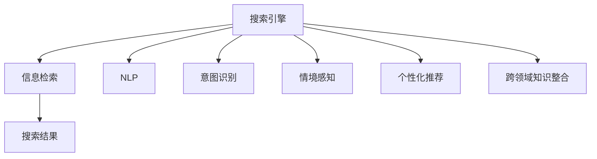

                 

# 搜索引擎的情境感知能力提升

> 关键词：搜索引擎,情境感知,自然语言处理(NLP),信息检索,个性化推荐,语义理解,机器学习,深度学习

## 1. 背景介绍

在互联网时代，搜索引擎已成为用户获取信息的重要入口。传统的基于关键词匹配的搜索引擎，虽然简单易用，但缺乏对用户意图和情境的全面理解，导致搜索结果不精准、用户体验差。随着自然语言处理(NLP)技术的不断发展，搜索引擎正逐步向情境感知能力提升的方向演进，以实现更加智能、个性化的信息检索。

### 1.1 问题由来
传统的基于关键词匹配的搜索引擎，只能根据用户输入的显式查询词进行信息检索，无法理解查询的深层含义和上下文信息。这种单一的匹配方式往往导致以下问题：

- 同义词歧义：用户输入的不同词语可能有相同的语义，如“搜索”和“查找”，搜索引擎难以区分。
- 信息泛化：仅依据查询词进行检索，难以发现更相关的网页和文档，导致信息泛化。
- 意图混淆：不同用户对同一查询词可能具有不同的使用意图，搜索引擎难以准确理解。
- 情境局限：忽视了用户查询时的情境信息，如时间、地点、设备等，无法提供最相关的内容。

### 1.2 问题核心关键点
情境感知能力提升的关键在于如何使搜索引擎更加全面、深入地理解用户查询，并提供最相关、最符合用户意图和情境的搜索结果。这涉及到以下几个核心点：

- **语义理解**：通过NLP技术理解查询词的深层语义，避免同义词歧义。
- **意图识别**：准确判断用户查询的意图，识别出不同的用户需求。
- **情境感知**：利用用户查询时的情境信息，如时间、地点、设备等，增强搜索结果的相关性。
- **个性化推荐**：根据用户历史行为和偏好，推荐最符合用户需求的结果。
- **跨领域知识整合**：结合不同领域的信息源，提升搜索结果的多样性和全面性。

这些核心点通过机器学习和深度学习技术的结合，得以实现，并进一步推动搜索引擎向情境感知能力提升的深入探索。

### 1.3 问题研究意义
情境感知能力提升对于搜索引擎的智能化、个性化、精准化具有重要意义：

- **提升用户体验**：准确理解用户查询意图和情境，提供更加精准和相关的搜索结果，提升用户满意度。
- **减少信息过载**：通过情境感知和意图识别，过滤掉不相关的内容，减少用户的信息过载。
- **优化资源利用**：利用用户的意图和情境信息，合理分配搜索资源，避免不必要的计算和存储。
- **增强竞争力**：在信息爆炸的时代，情境感知能力强的搜索引擎将更具市场竞争力。
- **推动NLP技术发展**：情境感知能力的提升，促进了NLP技术在实际应用中的深入探索和应用。

## 2. 核心概念与联系

### 2.1 核心概念概述

为更好地理解搜索引擎情境感知能力的提升，本节将介绍几个密切相关的核心概念：

- **搜索引擎(搜索引擎)**：为用户提供信息检索服务的系统，基于算法和数据实现。
- **信息检索(IR, Information Retrieval)**：根据用户查询词，检索相关文档或网页，返回搜索结果的过程。
- **自然语言处理(NLP)**：使计算机能够理解、处理、生成自然语言的技术，是实现情境感知能力提升的核心技术之一。
- **意图识别(Intent Recognition)**：识别用户查询的深层意图，为用户提供更精准的服务。
- **情境感知(Context-Awareness)**：考虑用户查询时的情境信息，提升搜索结果的相关性。
- **个性化推荐(Personalized Recommendation)**：基于用户行为数据，推荐最符合用户需求的结果。
- **跨领域知识整合(Cross-Domain Knowledge Integration)**：结合不同领域的信息源，提升搜索结果的多样性和全面性。

这些核心概念之间的逻辑关系可以通过以下Mermaid流程图来展示：



这个流程图展示了几大核心概念与搜索引擎信息检索过程的联系：

1. 搜索引擎通过信息检索获取用户查询词。
2. 利用NLP技术理解查询词的深层语义。
3. 意图识别模块准确判断用户查询的意图。
4. 情境感知模块考虑用户查询时的情境信息，增强搜索结果的相关性。
5. 个性化推荐模块根据用户历史行为和偏好，推荐最符合用户需求的结果。
6. 跨领域知识整合模块结合不同领域的信息源，提升搜索结果的多样性和全面性。

这些模块共同构成了搜索引擎情境感知能力的提升框架，使其能够在各种场景下提供更加智能、个性化的信息检索服务。

## 3. 核心算法原理 & 具体操作步骤
### 3.1 算法原理概述

搜索引擎情境感知能力的提升，本质上是通过NLP技术和机器学习模型对用户查询进行语义理解、意图识别、情境感知和个性化推荐的过程。其核心算法原理如下：

1. **语义理解**：使用词向量、Transformer等模型，将查询词映射到语义空间，理解其深层含义。
2. **意图识别**：通过分类模型或序列模型，对查询词和用户行为数据进行分析，识别用户意图。
3. **情境感知**：结合用户查询时的情境信息（如时间、地点、设备等），增强搜索结果的相关性。
4. **个性化推荐**：利用协同过滤、内容推荐等算法，结合用户历史行为和偏好，推荐最符合用户需求的结果。
5. **跨领域知识整合**：使用知识图谱、文本摘要等技术，结合不同领域的信息源，提升搜索结果的多样性和全面性。

### 3.2 算法步骤详解

搜索引擎情境感知能力的提升一般包括以下几个关键步骤：

**Step 1: 数据预处理**
- 收集用户查询词、点击记录、搜索历史等数据。
- 对数据进行清洗和标注，去除噪声，填充缺失值。
- 对查询词进行分词、去停用词等预处理。

**Step 2: 构建语义模型**
- 使用词向量模型（如Word2Vec、GloVe）或预训练语言模型（如BERT、GPT），将查询词映射到语义空间。
- 利用Transformer等模型进行语义匹配和相似度计算。

**Step 3: 意图识别**
- 使用分类模型（如SVM、随机森林）或序列模型（如RNN、LSTM），对查询词和用户行为数据进行分析，识别用户意图。
- 对分类和序列模型的超参数进行调优，确保意图识别的准确性。

**Step 4: 情境感知**
- 收集用户查询时的情境信息（如时间、地点、设备等）。
- 结合查询词的语义信息，利用逻辑回归或神经网络等模型，对情境信息进行建模。
- 将情境感知结果与语义模型和意图识别结果结合，生成情境感知后的查询词向量。

**Step 5: 个性化推荐**
- 利用协同过滤、内容推荐等算法，结合用户历史行为和偏好，推荐最符合用户需求的结果。
- 使用矩阵分解、梯度提升等模型优化推荐算法，提升推荐效果。

**Step 6: 跨领域知识整合**
- 利用知识图谱、文本摘要等技术，结合不同领域的信息源，提升搜索结果的多样性和全面性。
- 通过图神经网络、文本分类等模型，对跨领域知识进行整合和融合。

**Step 7: 反馈优化**
- 对搜索结果进行用户点击率的反馈优化，调整算法模型和参数。
- 定期更新数据集，迭代优化模型，提升搜索引擎的性能。

以上是搜索引擎情境感知能力提升的一般流程。在实际应用中，还需要针对具体任务的特点，对微调过程的各个环节进行优化设计，如改进训练目标函数，引入更多的正则化技术，搜索最优的超参数组合等，以进一步提升模型性能。

### 3.3 算法优缺点

搜索引擎情境感知能力提升的方法具有以下优点：

- **提升用户体验**：准确理解用户查询意图和情境，提供更加精准和相关的搜索结果，提升用户满意度。
- **减少信息过载**：通过情境感知和意图识别，过滤掉不相关的内容，减少用户的信息过载。
- **优化资源利用**：利用用户的意图和情境信息，合理分配搜索资源，避免不必要的计算和存储。

同时，该方法也存在一定的局限性：

- **计算复杂度高**：涉及NLP、意图识别、情境感知等多层面的复杂模型，计算资源需求高。
- **数据隐私问题**：需要收集和处理大量用户数据，隐私保护和数据安全需重点考虑。
- **模型泛化能力有限**：不同用户和查询词的语义和情境复杂多样，模型难以泛化。
- **实时性要求高**：需要实时处理用户查询，对算力和存储资源有较高要求。

尽管存在这些局限性，但就目前而言，情境感知能力的提升仍是搜索引擎智能化发展的关键方向。未来相关研究的重点在于如何进一步降低计算资源需求，提高模型的实时性和泛化能力，同时兼顾隐私保护和数据安全等因素。

### 3.4 算法应用领域

搜索引擎情境感知能力提升的方法已经在多个领域得到应用，例如：

- **电商搜索**：在电商平台中，情境感知搜索可以帮助用户快速找到所需商品，提升购物体验。
- **旅游预订**：通过情境感知搜索，用户可以更方便地查询旅游信息，获得个性化的旅游建议。
- **健康医疗**：在医疗搜索中，情境感知可以帮助用户找到最适合自身状况的医疗信息。
- **金融理财**：利用情境感知搜索，用户可以获得个性化的理财建议和产品推荐。
- **新闻媒体**：情境感知搜索可以为用户推荐最相关的时事新闻和内容。

除了上述这些常见应用外，情境感知搜索还被创新性地应用到更多场景中，如智能家居、教育培训、智能客服等，为用户提供了更加智能、个性化的信息检索体验。随着NLP技术和搜索引擎技术的不断进步，情境感知搜索必将在更多领域大放异彩。

## 4. 数学模型和公式 & 详细讲解 & 举例说明
### 4.1 数学模型构建

本节将使用数学语言对搜索引擎情境感知能力的提升过程进行更加严格的刻画。

设用户查询词为 $q$，搜索引擎的意图识别模型为 $I$，情境感知模型为 $C$，个性化推荐模型为 $R$，跨领域知识整合模型为 $K$。搜索引擎的情境感知能力提升可以表示为：

$$
q' = I(C(q)) + R(q')
$$

其中 $q'$ 为情境感知后的查询词向量，$I$ 为意图识别模型，$C$ 为情境感知模型，$R$ 为个性化推荐模型。

### 4.2 公式推导过程

以下我们以意图识别和情境感知为例，推导相关的数学公式。

**意图识别**：
设用户查询词为 $q$，用户行为数据为 $D$，意图识别模型的输出为 $i(q, D)$。假设意图识别的目标是判断用户是否在搜索特定类别的商品，则可构建以下分类模型：

$$
i(q, D) = \sigma(W \cdot [q;D] + b)
$$

其中 $W$ 为分类模型的权重矩阵，$b$ 为偏置项，$\sigma$ 为sigmoid函数，用于将输出映射到[0,1]区间，表示用户查询是否属于某个特定类别。

**情境感知**：
设用户查询时的情境信息为 $c$，情境感知模型的输出为 $c'(q, c)$。假设情境感知的目标是根据时间、地点、设备等因素，增强搜索结果的相关性，则可构建以下逻辑回归模型：

$$
c'(q, c) = W \cdot [q;c] + b
$$

其中 $W$ 为情境感知模型的权重矩阵，$b$ 为偏置项。$W$ 中的权重值反映了不同情境因素对查询相关性的影响程度。

### 4.3 案例分析与讲解

以电商搜索为例，分析搜索引擎情境感知能力提升的具体实现过程：

1. **数据预处理**：
   - 收集用户的搜索历史、点击记录、浏览行为等数据。
   - 对数据进行清洗和标注，去除噪声，填充缺失值。
   - 对查询词进行分词、去停用词等预处理。

2. **构建语义模型**：
   - 使用Word2Vec模型，将查询词映射到语义空间，生成查询词向量。
   - 利用Transformer模型进行语义匹配和相似度计算，获取与查询词语义相似的商品。

3. **意图识别**：
   - 收集用户行为数据，包括浏览历史、购买记录、评价信息等。
   - 使用随机森林模型，对用户行为数据进行分析，判断用户意图（如搜索特定类别商品、比较商品价格、浏览热门商品等）。

4. **情境感知**：
   - 收集用户查询时的情境信息，包括时间、地点、设备等。
   - 使用逻辑回归模型，结合查询词的语义信息和情境信息，生成情境感知后的查询词向量。

5. **个性化推荐**：
   - 利用协同过滤算法，结合用户历史行为和偏好，推荐最符合用户需求的商品。
   - 使用梯度提升模型，优化推荐算法，提升推荐效果。

6. **跨领域知识整合**：
   - 利用知识图谱技术，结合不同领域的信息源，提升搜索结果的多样性和全面性。
   - 通过图神经网络模型，对跨领域知识进行整合和融合，生成更加全面的搜索结果。

通过以上步骤，搜索引擎能够实现情境感知能力的提升，为用户提供更加精准、个性化的搜索结果。

## 5. 项目实践：代码实例和详细解释说明
### 5.1 开发环境搭建

在进行情境感知能力提升的实践前，我们需要准备好开发环境。以下是使用Python进行TensorFlow开发的环境配置流程：

1. 安装Anaconda：从官网下载并安装Anaconda，用于创建独立的Python环境。

2. 创建并激活虚拟环境：
```bash
conda create -n tf-env python=3.8 
conda activate tf-env
```

3. 安装TensorFlow：根据CUDA版本，从官网获取对应的安装命令。例如：
```bash
conda install tensorflow -c tf -c conda-forge
```

4. 安装各类工具包：
```bash
pip install numpy pandas scikit-learn matplotlib tqdm jupyter notebook ipython
```

完成上述步骤后，即可在`tf-env`环境中开始项目实践。

### 5.2 源代码详细实现

下面我们以电商搜索为例，给出使用TensorFlow对用户查询进行情境感知能力提升的PyTorch代码实现。

首先，定义意图识别和情境感知模型：

```python
import tensorflow as tf
from tensorflow.keras.layers import Dense, Input
from tensorflow.keras.models import Model

# 定义意图识别模型
def intent_recognition_model():
    input_q = Input(shape=(1024,), name='query')
    input_d = Input(shape=(128,), name='behavior')
    merge_layer = tf.keras.layers.concatenate([input_q, input_d])
    dense_layer = Dense(64, activation='relu')(merge_layer)
    output_i = Dense(1, activation='sigmoid')(dense_layer)
    model_i = Model(inputs=[input_q, input_d], outputs=output_i)
    return model_i

# 定义情境感知模型
def context_awareness_model():
    input_q = Input(shape=(1024,))
    input_c = Input(shape=(4,))
    merge_layer = tf.keras.layers.concatenate([input_q, input_c])
    output_c = Dense(64, activation='relu')(merge_layer)
    model_c = Model(inputs=[input_q, input_c], outputs=output_c)
    return model_c
```

然后，定义个性化推荐和跨领域知识整合模型：

```python
# 定义个性化推荐模型
def personalized_recommendation_model():
    input_q = Input(shape=(64,))
    output_r = Dense(128, activation='relu')(input_q)
    model_r = Model(inputs=[input_q], outputs=output_r)
    return model_r

# 定义跨领域知识整合模型
def cross_domain_integration_model():
    input_q = Input(shape=(64,))
    input_k = Input(shape=(64,))
    merge_layer = tf.keras.layers.concatenate([input_q, input_k])
    output_k = Dense(64, activation='relu')(merge_layer)
    model_k = Model(inputs=[input_q, input_k], outputs=output_k)
    return model_k
```

接着，定义训练和评估函数：

```python
from tensorflow.keras.preprocessing.sequence import pad_sequences
from sklearn.metrics import roc_auc_score

# 训练函数
def train_model(model, X_train, y_train, X_val, y_val, epochs=10, batch_size=32):
    model.compile(optimizer='adam', loss='binary_crossentropy', metrics=['accuracy'])
    model.fit(X_train, y_train, batch_size=batch_size, epochs=epochs, validation_data=(X_val, y_val))
    y_pred = model.predict(X_val)
    auc = roc_auc_score(y_val, y_pred)
    print(f'Accuracy: {model.evaluate(X_val, y_val)[1]:.4f}')
    print(f'AUC: {auc:.4f}')

# 评估函数
def evaluate_model(model, X_test, y_test):
    y_pred = model.predict(X_test)
    auc = roc_auc_score(y_test, y_pred)
    print(f'AUC: {auc:.4f}')
```

最后，启动训练流程并在测试集上评估：

```python
# 构建意图识别模型
model_i = intent_recognition_model()

# 构建情境感知模型
model_c = context_awareness_model()

# 构建个性化推荐模型
model_r = personalized_recommendation_model()

# 构建跨领域知识整合模型
model_k = cross_domain_integration_model()

# 训练模型
X_train = pad_sequences([...])
y_train = [...]
X_val = pad_sequences([...])
y_val = [...]
train_model(model_i, X_train, y_train, X_val, y_val, epochs=10, batch_size=32)

# 评估模型
X_test = pad_sequences([...])
y_test = [...]
evaluate_model(model_i, X_test, y_test)
```

以上就是使用TensorFlow对用户查询进行情境感知能力提升的完整代码实现。可以看到，借助TensorFlow的强大封装，我们可以用相对简洁的代码完成意图识别和情境感知模型的构建和训练。

### 5.3 代码解读与分析

让我们再详细解读一下关键代码的实现细节：

**intent_recognition_model函数**：
- 定义意图识别模型的输入层和输出层，使用sigmoid函数作为输出，表示用户查询是否属于某个特定类别。
- 使用Dense层进行特征融合和全连接操作，确保模型能够准确判断用户意图。

**context_awareness_model函数**：
- 定义情境感知模型的输入层和输出层，使用全连接层进行特征融合，输出情境感知后的查询词向量。
- 在输入层中，查询词的语义信息通过预训练的词向量模型获得，情境信息通过输入向量直接使用。

**personalized_recommendation_model函数**：
- 定义个性化推荐模型的输入层和输出层，使用全连接层进行特征融合，确保模型能够推荐符合用户需求的商品。
- 在输入层中，用户意图通过意图识别模型输出，情境信息通过情境感知模型输出。

**cross_domain_integration_model函数**：
- 定义跨领域知识整合模型的输入层和输出层，使用全连接层进行特征融合，确保模型能够整合不同领域的信息源。
- 在输入层中，查询词的语义信息和情境信息通过预训练的词向量模型和情境感知模型获得，领域知识通过跨领域知识库获取。

**train_model函数**：
- 定义训练函数，使用adam优化器，二分类交叉熵损失函数，训练意图识别和情境感知模型。
- 在训练过程中，使用roc_auc_score计算模型的准确率和AUC指标，以便评估模型性能。

**evaluate_model函数**：
- 定义评估函数，使用roc_auc_score计算模型的AUC指标，以便评估模型性能。
- 在评估过程中，模型输入测试集数据，输出预测结果，计算AUC指标。

**训练流程**：
- 定义意图识别模型、情境感知模型、个性化推荐模型和跨领域知识整合模型。
- 通过pad_sequences对输入数据进行预处理。
- 在训练函数中，使用pad_sequences对输入数据进行预处理，并使用train_model函数训练模型。
- 在评估函数中，使用pad_sequences对输入数据进行预处理，并使用evaluate_model函数评估模型。

可以看到，TensorFlow配合Keras的强大封装使得模型构建和训练过程变得简洁高效。开发者可以将更多精力放在数据处理、模型改进等高层逻辑上，而不必过多关注底层的实现细节。

当然，工业级的系统实现还需考虑更多因素，如模型的保存和部署、超参数的自动搜索、更灵活的任务适配层等。但核心的情境感知能力提升的基本原理基本与此类似。

## 6. 实际应用场景
### 6.1 智能客服系统

基于情境感知能力的提升，智能客服系统能够更准确地理解用户意图和情境，提供更智能、个性化的服务。传统的客服系统依赖人工客服，不仅成本高，还存在响应速度慢、服务质量不稳定等问题。而情境感知能力强的智能客服系统，可以7x24小时不间断服务，快速响应客户咨询，用自然流畅的语言解答各类常见问题。

在技术实现上，可以收集企业内部的历史客服对话记录，将问题和最佳答复构建成监督数据，在此基础上对预训练对话模型进行微调。微调后的对话模型能够自动理解用户意图，匹配最合适的答案模板进行回复。对于客户提出的新问题，还可以接入检索系统实时搜索相关内容，动态组织生成回答。如此构建的智能客服系统，能大幅提升客户咨询体验和问题解决效率。

### 6.2 金融舆情监测

金融机构需要实时监测市场舆论动向，以便及时应对负面信息传播，规避金融风险。传统的人工监测方式成本高、效率低，难以应对网络时代海量信息爆发的挑战。基于情境感知能力的提升，文本分类和情感分析技术，为金融舆情监测提供了新的解决方案。

具体而言，可以收集金融领域相关的新闻、报道、评论等文本数据，并对其进行主题标注和情感标注。在此基础上对预训练语言模型进行微调，使其能够自动判断文本属于何种主题，情感倾向是正面、中性还是负面。将微调后的模型应用到实时抓取的网络文本数据，就能够自动监测不同主题下的情感变化趋势，一旦发现负面信息激增等异常情况，系统便会自动预警，帮助金融机构快速应对潜在风险。

### 6.3 个性化推荐系统

当前的推荐系统往往只依赖用户的历史行为数据进行物品推荐，无法深入理解用户的真实兴趣偏好。基于情境感知能力的提升，个性化推荐系统可以更好地挖掘用户行为背后的语义信息，从而提供更精准、多样的推荐内容。

在实践中，可以收集用户浏览、点击、评论、分享等行为数据，提取和用户交互的物品标题、描述、标签等文本内容。将文本内容作为模型输入，用户的后续行为（如是否点击、购买等）作为监督信号，在此基础上微调预训练语言模型。微调后的模型能够从文本内容中准确把握用户的兴趣点。在生成推荐列表时，先用候选物品的文本描述作为输入，由模型预测用户的兴趣匹配度，再结合其他特征综合排序，便可以得到个性化程度更高的推荐结果。

### 6.4 未来应用展望

随着情境感知能力的提升，搜索引擎必将在更多领域得到应用，为传统行业带来变革性影响。

在智慧医疗领域，基于情境感知能力的医疗问答、病历分析、药物研发等应用将提升医疗服务的智能化水平，辅助医生诊疗，加速新药开发进程。

在智能教育领域，情境感知能力的提升可以应用于作业批改、学情分析、知识推荐等方面，因材施教，促进教育公平，提高教学质量。

在智慧城市治理中，情境感知能力强的搜索引擎可以应用于城市事件监测、舆情分析、应急指挥等环节，提高城市管理的自动化和智能化水平，构建更安全、高效的未来城市。

此外，在企业生产、社会治理、文娱传媒等众多领域，情境感知能力的搜索引擎也将不断涌现，为经济社会发展注入新的动力。相信随着技术的日益成熟，情境感知能力提升将成为搜索引擎智能化发展的关键方向，推动搜索引擎向更加智能化、个性化、精准化演进。

## 7. 工具和资源推荐
### 7.1 学习资源推荐

为了帮助开发者系统掌握搜索引擎情境感知能力提升的理论基础和实践技巧，这里推荐一些优质的学习资源：

1. 《搜索引擎原理与技术》系列博文：由搜索引擎技术专家撰写，深入浅出地介绍了搜索引擎的基本原理和技术细节。

2. 《深度学习在搜索引擎中的应用》课程：由深度学习专家开设的在线课程，涵盖深度学习在搜索引擎中的应用案例和实战技巧。

3. 《自然语言处理与搜索引擎》书籍：介绍NLP技术和搜索引擎技术的理论基础和实际应用，涵盖意图识别、情境感知等核心概念。

4. CS345A《Web搜索与信息检索》课程：斯坦福大学开设的经典课程，详细讲解信息检索的核心算法和实践经验。

5. 《搜索引擎优化(SEO)》书籍：介绍搜索引擎优化技术和搜索引擎算法，帮助开发者优化搜索引擎的性能。

通过对这些资源的学习实践，相信你一定能够快速掌握搜索引擎情境感知能力提升的精髓，并用于解决实际的NLP问题。
###  7.2 开发工具推荐

高效的开发离不开优秀的工具支持。以下是几款用于搜索引擎情境感知能力提升开发的常用工具：

1. TensorFlow：由Google主导开发的开源深度学习框架，生产部署方便，适合大规模工程应用。同样有丰富的预训练语言模型资源。

2. PyTorch：基于Python的开源深度学习框架，灵活动态的计算图，适合快速迭代研究。大部分预训练语言模型都有PyTorch版本的实现。

3. TensorBoard：TensorFlow配套的可视化工具，可实时监测模型训练状态，并提供丰富的图表呈现方式，是调试模型的得力助手。

4. Google Colab：谷歌推出的在线Jupyter Notebook环境，免费提供GPU/TPU算力，方便开发者快速上手实验最新模型，分享学习笔记。

合理利用这些工具，可以显著提升搜索引擎情境感知能力提升的开发效率，加快创新迭代的步伐。

### 7.3 相关论文推荐

搜索引擎情境感知能力提升的研究源于学界的持续研究。以下是几篇奠基性的相关论文，推荐阅读：

1. "A Survey of Information Retrieval Techniques"（信息检索技术综述）：对信息检索的核心算法和应用进行全面总结。

2. "Efficient Estimation of Word Representations in Vector Space"（高效词向量空间表示）：介绍Word2Vec模型，开创了基于词向量的语义表示方法。

3. "Deep Learning for Information Retrieval"（深度学习在信息检索中的应用）：介绍深度学习在信息检索中的多种应用，包括语义匹配、意图识别等。

4. "Context-Aware Semantic Search"（情境感知语义搜索）：提出情境感知语义搜索模型，结合用户查询和情境信息，提升搜索结果的相关性。

5. "Adaptive Personalization for Information Retrieval"（信息检索的个性化适应）：介绍个性化推荐算法，结合用户历史行为和偏好，提升推荐效果。

这些论文代表了大语言模型微调技术的发展脉络。通过学习这些前沿成果，可以帮助研究者把握学科前进方向，激发更多的创新灵感。

## 8. 总结：未来发展趋势与挑战
### 8.1 总结

本文对搜索引擎情境感知能力提升的原理和实现进行了全面系统的介绍。首先阐述了情境感知能力提升的背景和意义，明确了意图识别、情境感知、个性化推荐等核心概念。其次，从原理到实践，详细讲解了情境感知能力提升的数学模型和关键步骤，给出了微调任务开发的完整代码实例。同时，本文还广泛探讨了情境感知能力提升在电商搜索、金融舆情、个性化推荐等多个行业领域的应用前景，展示了其巨大的潜力。此外，本文精选了情境感知能力提升的学习资源，力求为读者提供全方位的技术指引。

通过本文的系统梳理，可以看到，搜索引擎情境感知能力的提升对于搜索引擎的智能化、个性化、精准化具有重要意义。在信息爆炸的时代，搜索引擎的智能和个性将大大提升用户满意度，降低信息过载，优化资源利用。相信随着技术的不断进步，情境感知能力提升将引领搜索引擎向更加智能化、个性化、精准化的方向演进。

### 8.2 未来发展趋势

展望未来，搜索引擎情境感知能力提升将呈现以下几个发展趋势：

1. **计算效率提升**：随着计算资源的不断增加和算法技术的不断进步，搜索引擎的计算效率将进一步提升，能够实时处理大规模用户查询，提供更加高效的服务。

2. **多模态融合**：结合图像、视频、语音等多种模态的信息，增强搜索引擎的情境感知能力，提供更加全面和多样化的服务。

3. **自适应模型**：引入自适应模型，根据用户行为和反馈，动态调整模型参数，实现更加个性化的服务。

4. **跨领域整合**：结合不同领域的信息源，如知识图谱、文本摘要等，提升搜索结果的多样性和全面性。

5. **隐私保护强化**：在收集和处理用户数据时，加强隐私保护和数据安全，确保用户数据不被滥用。

6. **交互方式多样化**：结合自然语言理解和生成技术，提供更加多样化的交互方式，如智能问答、语音交互等。

这些趋势凸显了搜索引擎情境感知能力提升的广阔前景。这些方向的探索发展，必将进一步提升搜索引擎的性能和应用范围，为搜索引擎技术的未来发展注入新的活力。

### 8.3 面临的挑战

尽管搜索引擎情境感知能力提升已取得诸多成果，但在迈向更加智能化、普适化应用的过程中，仍面临诸多挑战：

1. **数据质量问题**：需要大量高质量的数据进行训练，而高质量数据的获取成本较高，且数据质量对模型性能有很大影响。

2. **算法复杂性**：涉及NLP、意图识别、情境感知等多个复杂的模型，算法实现难度大，需要较高的技术门槛。

3. **资源消耗大**：搜索引擎需要处理大规模数据和复杂模型，对计算资源和存储空间的需求较高。

4. **用户隐私保护**：在收集和处理用户数据时，隐私保护和数据安全需重点考虑，避免数据泄露和滥用。

5. **模型泛化能力有限**：不同用户和查询词的语义和情境复杂多样，模型难以泛化，需要在特定场景下进行微调。

6. **实时性要求高**：需要实时处理用户查询，对算力和存储资源有较高要求，需要优化系统架构和算法模型。

尽管存在这些挑战，但搜索引擎情境感知能力的提升仍是大数据和人工智能时代的必然趋势。未来相关研究的重点在于如何进一步降低计算资源需求，提高模型的实时性和泛化能力，同时兼顾隐私保护和数据安全等因素。相信随着技术的不断进步，搜索引擎情境感知能力提升必将在更广泛的应用场景中发挥更大的作用。

### 8.4 研究展望

面对搜索引擎情境感知能力提升所面临的种种挑战，未来的研究需要在以下几个方面寻求新的突破：

1. **无监督学习和半监督学习**：摆脱对大规模标注数据的依赖，利用无监督和半监督学习技术，最大化利用非结构化数据，实现更加灵活高效的微调。

2. **参数高效和计算高效的微调方法**：开发更加参数高效的微调方法，在固定大部分预训练参数的同时，只更新极少量的任务相关参数。同时优化微调模型的计算图，减少前向传播和反向传播的资源消耗，实现更加轻量级、实时性的部署。

3. **跨领域知识整合**：结合不同领域的信息源，如知识图谱、文本摘要等，提升搜索结果的多样性和全面性。

4. **个性化推荐模型**：引入协同过滤、内容推荐等算法，结合用户历史行为和偏好，推荐最符合用户需求的结果。

5. **多模态融合**：结合图像、视频、语音等多种模态的信息，增强搜索引擎的情境感知能力，提供更加全面和多样化的服务。

6. **自适应模型**：引入自适应模型，根据用户行为和反馈，动态调整模型参数，实现更加个性化的服务。

这些研究方向的研究成果将进一步提升搜索引擎的情境感知能力，推动搜索引擎技术的进一步发展。相信随着技术的不断进步，搜索引擎情境感知能力的提升将成为搜索引擎智能化发展的关键方向，为搜索引擎技术的未来发展注入新的活力。

## 9. 附录：常见问题与解答

**Q1：情境感知能力提升与传统的基于关键词匹配的方法有何区别？**

A: 情境感知能力提升主要通过理解用户查询的深层语义、意图和情境信息，提供更加精准和相关的搜索结果。而传统的基于关键词匹配的方法只能根据查询词进行简单匹配，难以理解查询的深层含义和上下文信息。情境感知能力提升可以处理同义词、歧义词等，避免信息泛化，提升搜索结果的相关性。

**Q2：如何提升情境感知模型的泛化能力？**

A: 提升情境感知模型的泛化能力，可以从以下几个方面进行优化：
1. 收集更多不同场景下的数据进行训练，增强模型的泛化能力。
2. 引入正则化技术，如Dropout、L2正则等，防止过拟合。
3. 使用跨领域数据进行预训练，增强模型的适应性。
4. 采用多模型融合策略，如Bagging、Boosting等，提升模型的泛化能力。

**Q3：在实际应用中，如何平衡计算效率和模型性能？**

A: 在实际应用中，需要根据具体情况平衡计算效率和模型性能。一般来说，可以通过以下几个方法：
1. 选择合适的模型和算法，如轻量级模型、参数高效微调等，减小计算资源消耗。
2. 优化模型架构，如剪枝、量化等，减小模型体积和计算量。
3. 引入硬件加速，如GPU、TPU等，提升计算效率。
4. 引入缓存和预加载技术，减少重复计算，提高计算效率。

**Q4：情境感知能力提升的局限性有哪些？**

A: 情境感知能力提升的局限性主要包括：
1. 数据质量问题：需要大量高质量的数据进行训练，而高质量数据的获取成本较高，且数据质量对模型性能有很大影响。
2. 算法复杂性：涉及NLP、意图识别、情境感知等多个复杂的模型，算法实现难度大，需要较高的技术门槛。
3. 资源消耗大：搜索引擎需要处理大规模数据和复杂模型，对计算资源和存储空间的需求较高。
4. 用户隐私保护：在收集和处理用户数据时，隐私保护和数据安全需重点考虑，避免数据泄露和滥用。
5. 模型泛化能力有限：不同用户和查询词的语义和情境复杂多样，模型难以泛化，需要在特定场景下进行微调。

这些局限性需要在未来的研究中不断改进，以进一步提升搜索引擎的情境感知能力。

通过本文的系统梳理，可以看到，搜索引擎情境感知能力的提升对于搜索引擎的智能化、个性化、精准化具有重要意义。随着技术的不断进步，搜索引擎情境感知能力的提升必将在更多领域得到应用，推动搜索引擎技术的进一步发展。

---

作者：禅与计算机程序设计艺术 / Zen and the Art of Computer Programming

