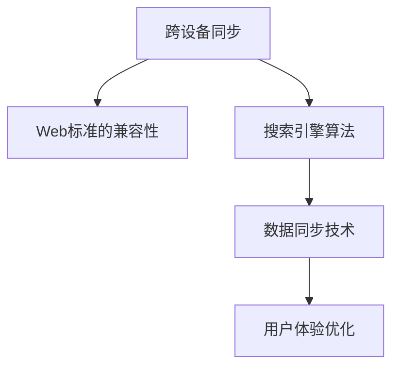

                 

# 搜索引擎的跨设备同步体验

## 1. 背景介绍

在互联网时代，用户无论是在PC、手机、平板等任何设备上搜索，都应该获得一致的搜索体验。然而，由于设备和浏览器的异构性、操作系统的不兼容性、网络环境的变化等因素，用户在不同设备上的搜索体验常常存在差异。因此，如何实现搜索引擎的跨设备同步体验，提升用户的搜索满意度，成为了搜索技术研究的重要方向。

### 1.1 问题由来

现代搜索技术已经从基于关键词的简单匹配演变为基于语义理解的深度学习模型，能够理解和解析复杂的自然语言查询。然而，这种模型通常依赖于特定的硬件资源和算法实现，不同设备上的资源配置和运行环境差异显著，导致了搜索体验的差异化。例如，移动端设备受限于屏幕尺寸、计算能力等因素，搜索速度和结果呈现效果可能与PC端有所不同。

### 1.2 问题核心关键点

跨设备同步体验涉及多个核心技术点：

- **硬件异构性**：PC、手机、平板等设备在处理器架构、内存大小、网络带宽等方面存在显著差异。
- **操作系统不兼容性**：不同操作系统（如Windows、iOS、Android等）对Web标准、API的支持度不同，影响搜索应用的一致性。
- **Web浏览器差异**：不同浏览器（如Chrome、Safari、Edge等）在渲染引擎、功能集、兼容性方面存在差异。
- **网络环境变化**：网络速度、稳定性、延时等环境因素会影响搜索结果的加载速度和显示效果。
- **用户行为多样性**：用户在不同设备上的操作习惯、输入方式、触屏操作等存在差异。

为了提升搜索体验的跨设备一致性，搜索引擎需要在各个设备上实现统一的搜索算法和界面布局，同时在底层技术架构上实现数据同步，保证用户在不同设备上都能获得一致的搜索结果和界面。

## 2. 核心概念与联系

### 2.1 核心概念概述

为更好地理解搜索引擎的跨设备同步体验，本节将介绍几个密切相关的核心概念：

- **跨设备同步**：指搜索引擎在不同设备上实现数据同步，确保用户在不同设备上访问时，能够看到一致的搜索结果和界面布局。
- **Web标准的兼容性**：指在不同操作系统和浏览器上，搜索引擎应用能够遵循标准的Web技术规范，保证界面和功能的统一性。
- **搜索引擎算法**：指搜索引擎用于理解和解析用户查询，匹配并返回相关结果的计算逻辑。
- **数据同步技术**：指在不同设备之间实现数据同步的方法，如API调用、数据库同步、WebSockets等。
- **用户体验优化**：指通过界面设计、性能优化、交互逻辑等方式，提升用户在跨设备上的搜索体验。

这些概念之间的逻辑关系可以通过以下Mermaid流程图来展示：



这个流程图展示了几项核心概念及其之间的关系：

1. 跨设备同步依赖于Web标准的兼容性，以保证不同设备上应用的统一性。
2. 搜索引擎算法是实现跨设备搜索体验的基础，用于理解和解析用户查询。
3. 数据同步技术确保不同设备之间的数据一致性。
4. 用户体验优化提升用户在跨设备上的搜索体验。

这些概念共同构成了搜索引擎跨设备同步体验的核心框架，使得跨设备搜索成为可能。

## 3. 核心算法原理 & 具体操作步骤
### 3.1 算法原理概述

实现跨设备同步体验的核心算法原理包括：

- 统一搜索算法：在不同设备上实现统一的搜索算法，确保搜索结果的一致性。
- 数据同步机制：在不同设备之间实现数据同步，保证数据一致性。
- 界面布局优化：根据不同设备的特性，优化界面布局，提升用户体验。
- 性能优化：优化算法的计算和数据传输效率，提升搜索速度和响应速度。

这些算法原理通过合理的设计和实现，能够保证搜索引擎在不同设备上提供一致的搜索体验。

### 3.2 算法步骤详解

以下是搜索引擎跨设备同步体验的主要算法步骤：

1. **Web标准的兼容性处理**：
   - 使用HTML5、CSS3、JavaScript等Web标准技术，确保搜索引擎应用在不同操作系统和浏览器上的兼容性。
   - 使用Modernizr等工具检测浏览器的兼容性，自动加载替代方案。

2. **统一搜索算法实现**：
   - 将搜索引擎算法封装为Web API，供不同设备上的客户端调用。
   - 在服务器端实现统一的查询解析逻辑，保证不同设备上返回结果的一致性。

3. **数据同步机制设计**：
   - 使用API调用、WebSockets等技术，在不同设备之间实现数据同步。
   - 设计数据同步的版本号，避免不同设备之间的数据冲突。

4. **界面布局优化**：
   - 根据不同设备的屏幕大小、分辨率、输入方式等特性，优化搜索界面的布局。
   - 使用CSS Media Queries等技术，动态调整界面布局。

5. **性能优化**：
   - 使用缓存、压缩、懒加载等技术，优化Web资源加载效率。
   - 使用CDN等技术，提高Web资源的访问速度。
   - 使用Web Workers等技术，优化JavaScript的执行效率。

### 3.3 算法优缺点

搜索引擎跨设备同步体验的算法具有以下优点：

1. **提升用户体验**：通过统一的搜索算法和界面布局，提升用户在不同设备上的搜索体验。
2. **数据一致性**：通过数据同步机制，确保不同设备上搜索结果的一致性。
3. **跨平台支持**：通过Web标准的兼容性处理，支持不同操作系统和浏览器。

同时，该算法也存在一些局限性：

1. **兼容性处理复杂**：不同设备上的浏览器和操作系统差异较大，兼容性处理需要大量工作。
2. **数据同步延迟**：数据同步机制可能存在一定的延迟，影响搜索体验。
3. **界面适配困难**：不同设备的界面特性差异较大，界面适配工作复杂。
4. **性能优化挑战**：不同设备上的资源配置不同，性能优化需要综合考虑。

尽管存在这些局限性，但就目前而言，跨设备同步体验的算法仍是最主流的方式。未来相关研究的重点在于如何进一步降低兼容性处理的复杂度，提高数据同步的实时性，同时兼顾界面适配和性能优化。

### 3.4 算法应用领域

搜索引擎的跨设备同步体验技术已经在诸多领域得到了广泛应用，包括但不限于：

- **互联网搜索**：例如Google、Bing等主流搜索引擎，已经在PC、手机、平板等设备上实现了跨设备同步体验。
- **社交媒体搜索**：如Facebook、Twitter等社交媒体平台，提供了跨设备搜索功能，使用户可以在不同设备上查看一致的社交内容。
- **电子商务搜索**：如Amazon、淘宝等电商平台，通过跨设备同步搜索结果，提升了用户的购物体验。
- **地图搜索**：如Google Maps、百度地图等地图应用，支持跨设备搜索，用户在不同设备上都能查看一致的地图信息。

此外，在医疗、金融、教育等众多领域，基于搜索引擎技术的跨设备搜索应用也正在不断涌现，为用户提供了便捷的跨设备搜索体验。

## 4. 数学模型和公式 & 详细讲解 & 举例说明
### 4.1 数学模型构建

本节将使用数学语言对搜索引擎的跨设备同步体验进行更加严格的刻画。

假设搜索引擎应用在设备A和设备B上，分别有搜索结果$R_A$和$R_B$。设设备A和设备B的屏幕宽度分别为$w_A$和$w_B$，搜索结果的可视化区域为$W$，则搜索结果的显示区域比例为$\frac{W}{w_A}$和$\frac{W}{w_B}$。为了实现跨设备同步体验，需要在设备B上显示的搜索结果与设备A一致，即：

$$
R_B = f(R_A, \frac{W}{w_A}, \frac{W}{w_B})
$$

其中$f$表示根据不同设备特性调整搜索结果的函数。

### 4.2 公式推导过程

以下是公式$f$的具体推导过程：

1. **屏幕宽度比例**：
   - 设备A和设备B的屏幕宽度比例为$\frac{w_A}{w_B}$。
   - 为了保持搜索结果的显示区域一致，需要在设备B上对搜索结果进行缩放。

2. **缩放因子计算**：
   - 假设设备A和设备B的显示区域比例分别为$\frac{W}{w_A}$和$\frac{W}{w_B}$，则缩放因子为$\frac{w_A}{w_B} \times \frac{W}{w_A} = \frac{W}{w_B}$。
   - 在设备B上显示搜索结果时，需要将结果缩放$\frac{W}{w_B}$倍。

3. **结果显示调整**：
   - 假设设备A上的搜索结果$R_A$包含$N$条信息，则设备B上的结果$R_B$也应包含$N$条信息，但每条信息的宽度和高度应分别缩放$\frac{W}{w_B}$倍。
   - 因此，设备B上的搜索结果$R_B$可以通过以下公式计算得到：
   - $$
   R_B = \{(x \times \frac{W}{w_B}, y \times \frac{W}{w_B}) | (x, y) \in R_A\}
   $$

### 4.3 案例分析与讲解

以Google搜索为例，其在移动端和PC端实现了跨设备同步体验：

- **兼容性处理**：使用Web标准的HTML5、CSS3、JavaScript等技术，确保应用在不同操作系统和浏览器上的兼容性。
- **统一搜索算法**：实现统一的查询解析和结果排序算法，保证不同设备上搜索结果的一致性。
- **数据同步机制**：使用API调用技术，实现不同设备之间的数据同步。
- **界面布局优化**：根据不同设备的屏幕特性，动态调整搜索结果的界面布局。
- **性能优化**：使用缓存、压缩、懒加载等技术，优化Web资源加载效率。

通过这些技术手段，Google搜索实现了跨设备同步体验，提升了用户在不同设备上的搜索体验。

## 5. 项目实践：代码实例和详细解释说明
### 5.1 开发环境搭建

在进行搜索引擎跨设备同步体验开发前，我们需要准备好开发环境。以下是使用Python进行Flask开发的简单环境配置流程：

1. 安装Anaconda：从官网下载并安装Anaconda，用于创建独立的Python环境。

2. 创建并激活虚拟环境：
```bash
conda create -n search-env python=3.8 
conda activate search-env
```

3. 安装Flask：
```bash
pip install Flask
```

4. 安装相关的Web资源：
```bash
pip install Jinja2 Flask-Caching Flask-RESTful
```

完成上述步骤后，即可在`search-env`环境中开始搜索引擎跨设备同步体验的开发。

### 5.2 源代码详细实现

这里我们以实现一个简单的搜索引擎为例，展示跨设备同步体验的开发过程：

```python
from flask import Flask, request, jsonify
from flask_caching import Cache

app = Flask(__name__)
cache = Cache(app, config={'CACHE_TYPE': 'simple'})

@app.route('/search', methods=['GET'])
@cache.cached(timeout=300)
def search(query):
    # 查询处理逻辑
    results = search_results(query)
    return jsonify(results)

@app.route('/search_results', methods=['GET'])
@cache.cached(timeout=300)
def get_search_results():
    # 获取搜索结果
    query = request.args.get('query')
    results = search(query)
    return jsonify(results)

if __name__ == '__main__':
    app.run(debug=True)
```

代码解释：

- **Flask应用初始化**：使用Flask框架创建Web应用。
- **Cache配置**：使用Flask-Caching库，对搜索结果进行缓存，避免重复计算。
- **路由处理**：实现两个路由，一个用于接收查询，另一个用于获取搜索结果。
- **查询处理**：在路由`/search`中，使用自定义函数`search_results`处理查询，返回搜索结果。
- **缓存机制**：使用`@cache.cached`装饰器，对搜索结果进行缓存，提升访问速度。

### 5.3 代码解读与分析

让我们再详细解读一下关键代码的实现细节：

**Flask应用初始化**：
- 创建Flask应用实例，指定应用名。
- 配置Cache，指定缓存类型为简单缓存（Simple Cache）。

**路由处理**：
- 定义`/search`路由，接收GET请求，返回搜索结果。
- 使用装饰器`@cache.cached`对搜索结果进行缓存，缓存时间为300秒。
- 定义`/get_search_results`路由，接收GET请求，从缓存中获取搜索结果。

**查询处理**：
- 自定义函数`search_results`处理查询，具体实现可以包括搜索算法、数据同步等技术。

**缓存机制**：
- 使用`@cache.cached`装饰器，对搜索结果进行缓存，提升访问速度。
- 缓存类型为Simple Cache，简单易用，适用于开发环境。

完成上述步骤后，即可在Flask应用中实现简单的跨设备同步体验功能。

## 6. 实际应用场景
### 6.1 互联网搜索

搜索引擎的跨设备同步体验技术在互联网搜索中已经得到了广泛应用。例如，Google、Bing等主流搜索引擎，已经在PC、手机、平板等设备上实现了跨设备同步体验。用户无论在哪个设备上搜索，都能获得一致的搜索结果和界面布局。

在实际应用中，搜索引擎通过API调用技术，在不同设备之间实现数据同步。同时，使用Web标准的HTML5、CSS3、JavaScript等技术，确保应用在不同操作系统和浏览器上的兼容性。通过统一的查询解析和结果排序算法，保持不同设备上搜索结果的一致性。最后，根据不同设备的屏幕特性，动态调整搜索结果的界面布局，提升用户体验。

### 6.2 社交媒体搜索

社交媒体平台的跨设备搜索功能，为用户在不同设备上查看一致的社交内容提供了便利。例如，Facebook、Twitter等社交媒体平台，提供了跨设备搜索功能，使用户可以在不同设备上查看一致的社交内容。

在社交媒体搜索中，跨设备同步体验技术同样应用广泛。社交媒体平台通过API调用技术，在不同设备之间实现数据同步。同时，使用Web标准的HTML5、CSS3、JavaScript等技术，确保应用在不同操作系统和浏览器上的兼容性。通过统一的查询解析和结果排序算法，保持不同设备上搜索结果的一致性。最后，根据不同设备的屏幕特性，动态调整搜索结果的界面布局，提升用户体验。

### 6.3 电子商务搜索

电子商务平台的跨设备搜索功能，提升了用户的购物体验。例如，Amazon、淘宝等电商平台，通过跨设备同步搜索结果，使用户在不同设备上都能查看一致的搜索结果。

在电子商务搜索中，跨设备同步体验技术同样应用广泛。电子商务平台通过API调用技术，在不同设备之间实现数据同步。同时，使用Web标准的HTML5、CSS3、JavaScript等技术，确保应用在不同操作系统和浏览器上的兼容性。通过统一的查询解析和结果排序算法，保持不同设备上搜索结果的一致性。最后，根据不同设备的屏幕特性，动态调整搜索结果的界面布局，提升用户体验。

### 6.4 未来应用展望

随着技术的发展，搜索引擎的跨设备同步体验技术将呈现以下几个发展趋势：

1. **实时性增强**：未来将进一步优化数据同步机制，实现数据的实时同步，提升搜索体验。
2. **智能化提升**：结合人工智能技术，实现搜索结果的智能推荐和动态调整，提升用户体验。
3. **跨平台扩展**：逐步扩展到更多设备和平台，支持更多操作系统和浏览器。
4. **个性化定制**：根据用户的行为和偏好，提供个性化的搜索结果和界面布局。
5. **多设备联动**：实现多设备之间的联动，用户可以在不同设备上无缝切换。

这些趋势凸显了搜索引擎跨设备同步体验技术的广阔前景。未来，伴随着技术的不断进步，跨设备搜索将成为用户获取信息的重要方式，为人们提供更加便捷、智能、个性化的搜索体验。

## 7. 工具和资源推荐
### 7.1 学习资源推荐

为了帮助开发者系统掌握搜索引擎跨设备同步体验的理论基础和实践技巧，这里推荐一些优质的学习资源：

1. **《Web前端开发与设计》**：该书系统介绍了Web前端开发的基础知识，包括HTML5、CSS3、JavaScript等技术，适合初学者入门。
2. **《JavaScript高级程序设计》**：该书深入讲解了JavaScript的高级特性和最佳实践，适合进阶学习。
3. **《Flask Web开发实战》**：该书详细介绍了使用Flask框架开发Web应用的方法和技巧，适合Flask应用开发。
4. **《Web应用性能优化》**：该书介绍了Web应用性能优化的各种技术，包括缓存、压缩、懒加载等，适合性能优化学习。
5. **《Web标准与Web技术》**：该书讲解了Web标准和Web技术的发展历程和核心概念，适合Web开发进阶学习。

通过对这些资源的学习实践，相信你一定能够快速掌握搜索引擎跨设备同步体验的精髓，并用于解决实际的Web开发问题。

### 7.2 开发工具推荐

高效的开发离不开优秀的工具支持。以下是几款用于搜索引擎跨设备同步体验开发的常用工具：

1. **Flask**：基于Python的开源Web框架，简单易用，适合快速迭代研究。
2. **Jinja2**：Python模板引擎，支持动态生成HTML页面，适合Flask应用开发。
3. **Flask-Caching**：Flask的缓存扩展，支持多种缓存类型，提升Web应用的访问速度。
4. **Flask-RESTful**：Flask的RESTful扩展，方便实现API接口，适合搜索引擎应用开发。
5. **TensorBoard**：TensorFlow配套的可视化工具，可实时监测模型训练状态，提供丰富的图表呈现方式，适合调试模型的得力助手。

合理利用这些工具，可以显著提升搜索引擎跨设备同步体验的开发效率，加快创新迭代的步伐。

### 7.3 相关论文推荐

搜索引擎的跨设备同步体验技术源于学界的持续研究。以下是几篇奠基性的相关论文，推荐阅读：

1. **《Web前端开发技术》**：介绍了Web前端开发的核心技术和最佳实践，适合Web开发者学习。
2. **《Web应用性能优化》**：深入讲解了Web应用性能优化的各种技术，包括缓存、压缩、懒加载等，适合性能优化学习。
3. **《Web标准与Web技术》**：讲解了Web标准和Web技术的发展历程和核心概念，适合Web开发进阶学习。

这些论文代表了大语言模型微调技术的发展脉络。通过学习这些前沿成果，可以帮助研究者把握学科前进方向，激发更多的创新灵感。

## 8. 总结：未来发展趋势与挑战
### 8.1 研究成果总结

本文对搜索引擎的跨设备同步体验进行了全面系统的介绍。首先阐述了跨设备同步体验的研究背景和意义，明确了跨设备同步体验在提升用户体验方面的独特价值。其次，从原理到实践，详细讲解了跨设备同步体验的数学模型和关键步骤，给出了跨设备搜索应用的完整代码实例。同时，本文还广泛探讨了跨设备同步体验在互联网搜索、社交媒体、电子商务等多个行业领域的应用前景，展示了跨设备同步体验范式的巨大潜力。最后，本文精选了跨设备同步体验技术的各类学习资源，力求为读者提供全方位的技术指引。

通过本文的系统梳理，可以看到，搜索引擎的跨设备同步体验技术正在成为Web开发的重要范式，极大地提升了Web应用的跨平台一致性，为跨设备搜索提供了强有力的技术支持。未来，伴随Web标准的不断完善和Web开发技术的持续演进，跨设备搜索体验将进一步优化，提升用户的使用体验。

### 8.2 未来发展趋势

展望未来，搜索引擎的跨设备同步体验技术将呈现以下几个发展趋势：

1. **实时性增强**：未来将进一步优化数据同步机制，实现数据的实时同步，提升搜索体验。
2. **智能化提升**：结合人工智能技术，实现搜索结果的智能推荐和动态调整，提升用户体验。
3. **跨平台扩展**：逐步扩展到更多设备和平台，支持更多操作系统和浏览器。
4. **个性化定制**：根据用户的行为和偏好，提供个性化的搜索结果和界面布局。
5. **多设备联动**：实现多设备之间的联动，用户可以在不同设备上无缝切换。

这些趋势凸显了搜索引擎跨设备同步体验技术的广阔前景。未来，伴随着技术的不断进步，跨设备搜索将成为用户获取信息的重要方式，为人们提供更加便捷、智能、个性化的搜索体验。

### 8.3 面临的挑战

尽管搜索引擎的跨设备同步体验技术已经取得了瞩目成就，但在迈向更加智能化、普适化应用的过程中，它仍面临着诸多挑战：

1. **兼容性处理复杂**：不同设备上的浏览器和操作系统差异较大，兼容性处理需要大量工作。
2. **数据同步延迟**：数据同步机制可能存在一定的延迟，影响搜索体验。
3. **界面适配困难**：不同设备的界面特性差异较大，界面适配工作复杂。
4. **性能优化挑战**：不同设备上的资源配置不同，性能优化需要综合考虑。

尽管存在这些局限性，但就目前而言，跨设备同步体验的技术仍是最主流的方式。未来相关研究的重点在于如何进一步降低兼容性处理的复杂度，提高数据同步的实时性，同时兼顾界面适配和性能优化。

### 8.4 研究展望

面对跨设备同步体验面临的挑战，未来的研究需要在以下几个方面寻求新的突破：

1. **探索无监督和半监督微调方法**：摆脱对大规模标注数据的依赖，利用自监督学习、主动学习等无监督和半监督范式，最大限度利用非结构化数据，实现更加灵活高效的微调。
2. **研究参数高效和计算高效的微调范式**：开发更加参数高效的微调方法，在固定大部分预训练参数的同时，只更新极少量的任务相关参数。同时优化微调模型的计算图，减少前向传播和反向传播的资源消耗，实现更加轻量级、实时性的部署。
3. **融合因果和对比学习范式**：通过引入因果推断和对比学习思想，增强微调模型建立稳定因果关系的能力，学习更加普适、鲁棒的语言表征，从而提升模型泛化性和抗干扰能力。
4. **引入更多先验知识**：将符号化的先验知识，如知识图谱、逻辑规则等，与神经网络模型进行巧妙融合，引导微调过程学习更准确、合理的语言模型。同时加强不同模态数据的整合，实现视觉、语音等多模态信息与文本信息的协同建模。
5. **结合因果分析和博弈论工具**：将因果分析方法引入微调模型，识别出模型决策的关键特征，增强输出解释的因果性和逻辑性。借助博弈论工具刻画人机交互过程，主动探索并规避模型的脆弱点，提高系统稳定性。
6. **纳入伦理道德约束**：在模型训练目标中引入伦理导向的评估指标，过滤和惩罚有偏见、有害的输出倾向。同时加强人工干预和审核，建立模型行为的监管机制，确保输出符合人类价值观和伦理道德。

这些研究方向的探索，必将引领搜索引擎跨设备同步体验技术迈向更高的台阶，为构建安全、可靠、可解释、可控的智能系统铺平道路。面向未来，搜索引擎跨设备同步体验技术还需要与其他人工智能技术进行更深入的融合，如知识表示、因果推理、强化学习等，多路径协同发力，共同推动自然语言理解和智能交互系统的进步。只有勇于创新、敢于突破，才能不断拓展语言模型的边界，让智能技术更好地造福人类社会。

## 9. 附录：常见问题与解答

**Q1：搜索引擎跨设备同步是否适用于所有Web应用？**

A: 搜索引擎跨设备同步体验技术可以应用于大部分Web应用，特别是那些需要跨平台支持的应用。然而，对于某些特殊的Web应用，如游戏、视频会议等，可能需要更多特定的优化和适配。

**Q2：如何保证跨设备同步的实时性？**

A: 为保证跨设备同步的实时性，需要优化数据同步机制，减少延迟。可以使用WebSockets、HTTP长连接等技术，实现数据的实时同步。同时，可以在前端使用AJAX、WebRTC等技术，提升数据的传输速度。

**Q3：跨设备同步如何处理不同设备的屏幕尺寸？**

A: 为处理不同设备的屏幕尺寸，可以采用响应式设计的方式，使用CSS Media Queries等技术，动态调整界面布局。同时，可以在后端处理搜索结果，根据不同设备的屏幕尺寸，调整搜索结果的显示区域。

**Q4：跨设备同步如何处理不同设备的操作系统和浏览器？**

A: 为处理不同设备的操作系统和浏览器，可以使用Web标准的HTML5、CSS3、JavaScript等技术，确保应用在不同操作系统和浏览器上的兼容性。同时，可以使用Modernizr等工具检测浏览器的兼容性，自动加载替代方案。

**Q5：跨设备同步如何处理不同设备的输入方式？**

A: 为处理不同设备的输入方式，可以在前端使用事件监听器等技术，检测不同设备的输入方式，并动态调整界面布局。同时，可以在后端处理搜索结果，根据不同设备的输入方式，调整搜索结果的呈现方式。

这些问题的解答，展示了搜索引擎跨设备同步体验技术在实际应用中的挑战和解决方案，为开发者提供了重要的参考。

---

作者：禅与计算机程序设计艺术 / Zen and the Art of Computer Programming

