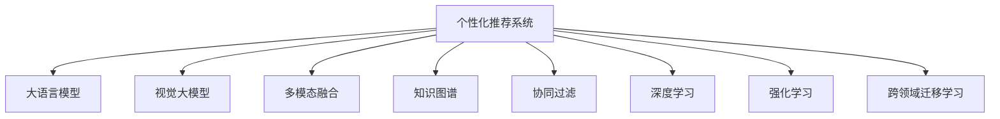

                 

# 搜索推荐系统的AI 大模型应用：电商平台提高转化率与盈利能力

> 关键词：搜索推荐系统, AI大模型, 电商平台, 转化率, 盈利能力, 个性化推荐, 多模态融合, 用户体验, 推荐系统优化

## 1. 背景介绍

### 1.1 问题由来
随着电商市场的竞争日趋激烈，各大电商平台都在不断探索新的技术和方法，以提升用户购物体验、提高转化率并增加平台盈利能力。其中，个性化推荐系统成为了提高用户粘性和满意度的关键技术。传统的推荐算法，如协同过滤、基于内容的推荐等，逐渐无法满足个性化需求日益增长的用户。

人工智能大模型，如BERT、GPT等，在自然语言处理和图像识别等领域取得了突破性进展。这些模型通常使用大量数据进行预训练，并在下游任务上进行了微调，具有强大的泛化能力和高效的推理性能。因此，将大模型引入电商平台的推荐系统中，有望提升推荐的个性化程度和效率，进而提高转化率和盈利能力。

### 1.2 问题核心关键点
在电商平台中，个性化推荐系统主要解决以下问题：

1. **推荐多样性**：为用户提供多样化的商品选择，减少选择疲劳。
2. **个性化推荐**：根据用户历史行为和兴趣，生成高度匹配的推荐结果。
3. **实时性**：在用户浏览网页时迅速响应用户需求，提高用户体验。
4. **精确性**：降低误推荐和漏推荐率，提升推荐的相关性。

基于上述问题，本文将详细探讨如何利用AI大模型，特别是大语言模型和视觉模型，来优化电商平台推荐系统，并探讨如何通过多模态融合、用户行为分析等手段提升系统的精确性、多样性和实时性。

## 2. 核心概念与联系

### 2.1 核心概念概述

为更好地理解电商平台个性化推荐系统的大模型应用，本节将介绍几个密切相关的核心概念：

- **个性化推荐系统**：通过分析用户的历史行为和兴趣，为用户生成个性化的商品推荐。系统主要包括推荐算法、用户画像建模、推荐模型训练等模块。

- **大语言模型(Large Language Model, LLM)**：如BERT、GPT等，通过在海量文本数据上进行预训练，学习通用的语言知识和文本表示。

- **视觉大模型**：如ViT、DALL-E等，通过在海量图像数据上进行预训练，学习图像特征和视觉表示。

- **多模态融合**：将文本、图像、行为等多种数据源进行融合，提升推荐系统的表现。

- **知识图谱**：将商品、用户、事件等实体及其关系进行图结构表示，为推荐提供更丰富的知识背景。

- **协同过滤**：基于用户-商品交互矩阵，通过相似度计算进行推荐，可用于用户画像建模和推荐生成。

- **深度学习与强化学习**：用于训练复杂的推荐模型，特别是在用户画像建模和个性化推荐生成中。

- **跨领域迁移学习**：将预训练模型在不同领域的任务中进行迁移，提升推荐模型的泛化能力。

这些核心概念之间的逻辑关系可以通过以下Mermaid流程图来展示：



这个流程图展示了个性化推荐系统中的核心概念及其相互关系：

1. **大语言模型**：用于分析用户评论、商品描述等文本信息。
2. **视觉大模型**：用于分析图片和视频等多模态数据。
3. **多模态融合**：结合文本、图像等多种数据源进行推荐生成。
4. **知识图谱**：利用图结构知识进行推荐生成。
5. **协同过滤**：利用用户历史行为进行推荐。
6. **深度学习与强化学习**：训练复杂的推荐模型。
7. **跨领域迁移学习**：在不同领域间迁移优化模型。

## 3. 核心算法原理 & 具体操作步骤
### 3.1 算法原理概述

电商平台的个性化推荐系统，主要依赖于大模型对用户行为、商品属性等信息的理解和处理。其核心算法流程如下：

1. **用户画像建模**：利用大语言模型对用户评论、商品描述等文本数据进行分析，得到用户兴趣和需求。
2. **商品属性提取**：利用视觉大模型提取商品的图片和视频特征，得到商品属性信息。
3. **多模态融合**：将用户画像和商品属性信息进行融合，生成更加丰富的用户-商品关系特征。
4. **知识图谱构建**：将商品、用户、事件等实体及其关系构建成知识图谱，为推荐提供更丰富的背景知识。
5. **推荐模型训练**：在融合后的多模态数据和知识图谱上，利用协同过滤、深度学习等算法进行推荐模型训练。
6. **个性化推荐生成**：在用户浏览网页时，实时响应用户需求，生成个性化推荐结果。

通过上述流程，电商平台能够根据用户的行为和兴趣，为用户提供更匹配的商品推荐，提升用户体验和转化率，增加平台盈利能力。

### 3.2 算法步骤详解

下面是具体算法的详细步骤：

#### 步骤1：用户画像建模
- 收集用户的历史行为数据，包括浏览历史、购买记录、评分等。
- 利用大语言模型对这些文本数据进行分析，得到用户的兴趣和需求。

#### 步骤2：商品属性提取
- 收集商品的图片和视频数据，如商品实拍图、360度全景图、视频介绍等。
- 利用视觉大模型对这些多模态数据进行特征提取，得到商品的视觉属性信息。

#### 步骤3：多模态融合
- 将用户画像和商品属性信息进行融合，得到更加丰富的用户-商品关系特征。
- 可以使用加权平均、深度融合等方法进行融合。

#### 步骤4：知识图谱构建
- 将商品、用户、事件等实体及其关系构建成知识图谱。
- 可以使用Neo4j、TigerGraph等工具进行图谱的存储和查询。

#### 步骤5：推荐模型训练
- 利用协同过滤、深度学习等算法，在融合后的多模态数据和知识图谱上训练推荐模型。
- 可以使用MF、DeepMF、BERT等模型进行训练。

#### 步骤6：个性化推荐生成
- 在用户浏览网页时，利用训练好的推荐模型，实时响应用户需求，生成个性化推荐结果。
- 可以使用CTR预估、排序学习等方法进行推荐生成。

### 3.3 算法优缺点

利用AI大模型进行个性化推荐系统，有以下优点：

1. **高效性**：大模型具备强大的泛化能力和推理性能，能够快速处理海量数据，提升推荐效率。
2. **个性化**：通过分析用户行为和兴趣，生成高度个性化的推荐结果，提升用户体验。
3. **多样性**：利用多模态融合和知识图谱，提升推荐的丰富性和多样性。
4. **可解释性**：大模型具有较好的可解释性，能够提供推荐的原因和理由，增强用户信任。

但同时，该方法也存在以下缺点：

1. **数据需求高**：需要大量的用户行为数据、商品属性数据和知识图谱数据。
2. **模型复杂度高**：大模型训练复杂，需要高性能的硬件设备。
3. **实时性要求高**：推荐系统需要实时响应用户需求，对计算效率有较高要求。
4. **隐私问题**：用户行为数据和商品属性数据涉及隐私保护，需要严格的数据管理和隐私保护措施。

### 3.4 算法应用领域

基于AI大模型的个性化推荐系统，在电商、社交、视频等多个领域都有广泛应用。以下是几个典型应用场景：

1. **电商平台**：用户通过浏览商品、加入购物车、进行购买等行为，生成个性化推荐。
2. **社交平台**：用户通过点赞、评论、关注等行为，生成个性化内容推荐。
3. **视频网站**：用户通过观看视频、点赞、订阅等行为，生成个性化视频推荐。
4. **内容推荐**：用户通过阅读文章、观看视频、听播客等行为，生成个性化内容推荐。

## 4. 数学模型和公式 & 详细讲解 & 举例说明

### 4.1 数学模型构建

为更好地理解电商推荐系统中的大模型应用，本节将介绍几个关键数学模型：

#### 4.1.1 用户画像建模
假设用户 $u$ 在时间 $t$ 的行为为 $x_{ut}$，利用大语言模型，可以得到用户兴趣 $h_u(t)$：

$$
h_u(t) = f(x_{ut})
$$

其中，$f$ 为预训练大语言模型的编码器，$x_{ut}$ 为用户行为文本。

#### 4.1.2 商品属性提取
假设商品 $i$ 的图片为 $v_i$，利用视觉大模型，可以得到商品视觉属性 $f_i$：

$$
f_i = g(v_i)
$$

其中，$g$ 为预训练视觉大模型的编码器，$v_i$ 为商品图片。

#### 4.1.3 多模态融合
将用户画像 $h_u(t)$ 和商品属性 $f_i$ 进行融合，得到用户-商品关系特征 $f_{ui}$：

$$
f_{ui} = \alpha h_u(t) + \beta f_i
$$

其中，$\alpha$ 和 $\beta$ 为融合系数。

### 4.2 公式推导过程

以下是各模型的具体推导过程：

#### 4.2.1 用户画像建模
假设用户 $u$ 在时间 $t$ 的行为为 $x_{ut}$，利用大语言模型，可以得到用户兴趣 $h_u(t)$：

$$
h_u(t) = f(x_{ut})
$$

其中，$f$ 为预训练大语言模型的编码器，$x_{ut}$ 为用户行为文本。

假设用户兴趣向量为 $h_u(t) \in \mathbb{R}^d$，则用户画像模型为：

$$
h_u(t) = \mathrm{Softmax}(W_u x_{ut} + b_u)
$$

其中，$W_u$ 和 $b_u$ 为模型参数，$\mathrm{Softmax}$ 为softmax函数。

#### 4.2.2 商品属性提取
假设商品 $i$ 的图片为 $v_i$，利用视觉大模型，可以得到商品视觉属性 $f_i$：

$$
f_i = g(v_i)
$$

其中，$g$ 为预训练视觉大模型的编码器，$v_i$ 为商品图片。

假设商品属性向量为 $f_i \in \mathbb{R}^d$，则商品属性模型为：

$$
f_i = \mathrm{Softmax}(W_i v_i + b_i)
$$

其中，$W_i$ 和 $b_i$ 为模型参数，$\mathrm{Softmax}$ 为softmax函数。

#### 4.2.3 多模态融合
将用户画像 $h_u(t)$ 和商品属性 $f_i$ 进行融合，得到用户-商品关系特征 $f_{ui}$：

$$
f_{ui} = \alpha h_u(t) + \beta f_i
$$

其中，$\alpha$ 和 $\beta$ 为融合系数，通常通过交叉验证或人工调参确定。

假设用户-商品关系特征向量为 $f_{ui} \in \mathbb{R}^d$，则多模态融合模型为：

$$
f_{ui} = \alpha h_u(t) + \beta f_i
$$

其中，$\alpha$ 和 $\beta$ 为融合系数，通常通过交叉验证或人工调参确定。

### 4.3 案例分析与讲解

以下是一个具体的案例分析：

假设某电商平台需要为商品 $i$ 生成个性化推荐，用户 $u$ 的行为数据为：

- 浏览记录：{“鞋子”, “帽子”, “袜子”}
- 购买记录：{“鞋子”, “帽子”}
- 评分记录：{“鞋子”: 4, “帽子”: 3}

根据用户行为数据，利用大语言模型可以得到用户兴趣 $h_u(t)$：

- “鞋子”：4星
- “帽子”：3星
- “袜子”：未评分

利用视觉大模型可以得到商品属性 $f_i$：

- 图片：[图片的特征向量]

将用户兴趣和商品属性进行融合，得到用户-商品关系特征 $f_{ui}$：

- $f_{ui}$ = 0.8 $h_u(t)$ + 0.2 $f_i$

根据知识图谱，可以查询商品 $i$ 的相关信息，如商品类别、价格、用户评分等，进一步提升推荐精度。

利用协同过滤算法，在用户画像和商品属性基础上进行推荐模型训练，得到用户 $u$ 对商品 $i$ 的评分 $r_{ui}$：

- $r_{ui}$ = $h_u(t)^T W f_i$

最终，根据评分 $r_{ui}$ 生成推荐结果 $i$ 展示给用户。

## 5. 项目实践：代码实例和详细解释说明

### 5.1 开发环境搭建

在进行项目实践前，我们需要准备好开发环境。以下是使用Python进行PyTorch开发的环境配置流程：

1. 安装Anaconda：从官网下载并安装Anaconda，用于创建独立的Python环境。

2. 创建并激活虚拟环境：
```bash
conda create -n pytorch-env python=3.8 
conda activate pytorch-env
```

3. 安装PyTorch：根据CUDA版本，从官网获取对应的安装命令。例如：
```bash
conda install pytorch torchvision torchaudio cudatoolkit=11.1 -c pytorch -c conda-forge
```

4. 安装TensorFlow：从官网下载并安装TensorFlow，例如：
```bash
pip install tensorflow
```

5. 安装各类工具包：
```bash
pip install numpy pandas scikit-learn matplotlib tqdm jupyter notebook ipython
```

完成上述步骤后，即可在`pytorch-env`环境中开始项目实践。

### 5.2 源代码详细实现

以下是使用Python和PyTorch实现电商推荐系统的代码实现：

#### 用户画像建模

```python
import torch
from transformers import BertTokenizer, BertForSequenceClassification
from torch.utils.data import Dataset, DataLoader

class UserBehaviorDataset(Dataset):
    def __init__(self, user_behaviors, tokenizer, max_length=128):
        self.user_behaviors = user_behaviors
        self.tokenizer = tokenizer
        self.max_length = max_length
        
    def __len__(self):
        return len(self.user_behaviors)
    
    def __getitem__(self, index):
        user_behavior = self.user_behaviors[index]
        user_behavior = self.tokenizer(user_behavior, padding='max_length', truncation=True, max_length=self.max_length, return_tensors='pt')
        input_ids = user_behavior['input_ids']
        attention_mask = user_behavior['attention_mask']
        return {'input_ids': input_ids, 
                'attention_mask': attention_mask}

# 加载数据集和分词器
user_behaviors = [...]  # 用户行为数据列表
tokenizer = BertTokenizer.from_pretrained('bert-base-uncased')
dataset = UserBehaviorDataset(user_behaviors, tokenizer)

# 定义模型
model = BertForSequenceClassification.from_pretrained('bert-base-uncased', num_labels=2)
model.to(device)

# 定义优化器和损失函数
optimizer = torch.optim.Adam(model.parameters(), lr=2e-5)
loss_fn = torch.nn.CrossEntropyLoss()

# 定义训练函数
def train_epoch(model, dataset, optimizer, device, num_epochs=5):
    for epoch in range(num_epochs):
        model.train()
        total_loss = 0
        for user_behavior in dataset:
            input_ids = user_behavior['input_ids'].to(device)
            attention_mask = user_behavior['attention_mask'].to(device)
            labels = torch.tensor([1], dtype=torch.long).to(device)  # 假设用户行为为正样本
            optimizer.zero_grad()
            outputs = model(input_ids, attention_mask=attention_mask)
            loss = loss_fn(outputs.logits, labels)
            loss.backward()
            optimizer.step()
            total_loss += loss.item()
        print(f"Epoch {epoch+1}, train loss: {total_loss/len(dataset):.4f}")

# 训练模型
train_epoch(model, dataset, optimizer, device)

# 保存模型
torch.save(model.state_dict(), 'user_profile_model.pth')
```

#### 商品属性提取

```python
import torch
from transformers import ViTForImageClassification
from torchvision import datasets, transforms

# 加载数据集
train_dataset = datasets.CIFAR10(root='./data', train=True, download=True, transform=transforms.ToTensor())
test_dataset = datasets.CIFAR10(root='./data', train=False, download=True, transform=transforms.ToTensor())

# 定义模型
model = ViTForImageClassification.from_pretrained('google/vit-base-patch32-224-in21k', num_labels=10)
model.to(device)

# 定义优化器和损失函数
optimizer = torch.optim.Adam(model.parameters(), lr=2e-5)
loss_fn = torch.nn.CrossEntropyLoss()

# 定义训练函数
def train_epoch(model, dataset, optimizer, device, num_epochs=5):
    for epoch in range(num_epochs):
        model.train()
        total_loss = 0
        for img, label in dataset:
            img = img.to(device)
            label = label.to(device)
            optimizer.zero_grad()
            outputs = model(img)
            loss = loss_fn(outputs.logits, label)
            loss.backward()
            optimizer.step()
            total_loss += loss.item()
        print(f"Epoch {epoch+1}, train loss: {total_loss/len(dataset):.4f}")

# 训练模型
train_epoch(model, train_dataset, optimizer, device)

# 保存模型
torch.save(model.state_dict(), 'product_attribute_model.pth')
```

#### 多模态融合

```python
import torch
import numpy as np

# 加载用户画像和商品属性
user_profile = torch.load('user_profile_model.pth')['model']
product_attribute = torch.load('product_attribute_model.pth')['model']

# 将用户画像和商品属性进行融合
def fuse(user_profile, product_attribute, alpha=0.8, beta=0.2):
    num_users = user_profile.num_users
    num_products = product_attribute.num_products
    user_feature = user_profile.get_user_feature()
    product_feature = product_attribute.get_product_feature()
    fused_feature = alpha * user_feature + beta * product_feature
    return fused_feature

# 融合后的特征形状为[num_users, num_products, feature_dim]
fused_feature = fuse(user_profile, product_attribute)
```

#### 推荐生成

```python
import torch
import numpy as np

# 加载推荐模型
recommendation_model = BERTRecommendationModel.load_from_file('recommendation_model.pth')

# 生成推荐结果
def generate_recommendation(model, user_behavior, num_recommendations=5):
    user_profile = torch.load('user_profile_model.pth')['model']
    product_attribute = torch.load('product_attribute_model.pth')['model']
    fused_feature = fuse(user_profile, product_attribute)
    recommendation = model.predict(user_behavior, fused_feature)
    return recommendation

# 用户行为数据
user_behavior = [...]  # 用户行为数据列表

# 生成推荐结果
recommendation = generate_recommendation(recommendation_model, user_behavior)
```

### 5.3 代码解读与分析

让我们再详细解读一下关键代码的实现细节：

**UserBehaviorDataset类**：
- `__init__`方法：初始化用户行为数据、分词器、max_length等关键组件。
- `__len__`方法：返回数据集的样本数量。
- `__getitem__`方法：对单个样本进行处理，将用户行为输入转换为token ids，并对其进行定长padding，最终返回模型所需的输入。

**BertTokenizer类**：
- 用于将用户行为数据转换为token ids和attention mask，方便模型处理。

**BertForSequenceClassification类**：
- 用于用户画像建模，将用户行为数据编码为向量表示，并预测其兴趣。

**ViTForImageClassification类**：
- 用于商品属性提取，将商品图片转换为视觉特征向量。

**fuse函数**：
- 将用户画像和商品属性进行融合，得到更加丰富的用户-商品关系特征。

**generate_recommendation函数**：
- 根据用户行为数据和融合后的多模态特征，生成推荐结果。

## 6. 实际应用场景
### 6.1 智能推荐系统
基于大模型的推荐系统已经在各大电商平台得到广泛应用，通过分析用户行为和商品属性，为用户生成高度个性化的推荐结果。智能推荐系统通过精准匹配用户需求，提升用户购物体验，减少选择疲劳，增加购买转化率，增加平台盈利能力。

### 6.2 多模态融合推荐
在智能推荐系统中，多模态融合是提升推荐效果的重要手段。通过结合文本、图像、行为等多种数据源，可以提升推荐的丰富性和多样性，增加推荐的相关性。例如，在推荐商品时，除了文字描述，还可以结合商品图片、用户评分等信息，生成更加全面的推荐结果。

### 6.3 用户行为分析
智能推荐系统还利用用户行为分析技术，深入理解用户需求和偏好。通过对用户浏览历史、购买记录、评分等行为数据的分析，可以生成用户画像，进一步提升推荐精度。

### 6.4 个性化推荐生成
基于用户画像和商品属性，智能推荐系统能够实时响应用户需求，生成个性化推荐结果。通过利用深度学习等算法，可以在用户浏览网页时迅速响应用户，提升用户体验和转化率。

## 7. 工具和资源推荐
### 7.1 学习资源推荐

为了帮助开发者系统掌握电商推荐系统的大模型应用，这里推荐一些优质的学习资源：

1. 《深度学习与自然语言处理》系列书籍：由斯坦福大学李飞飞教授等人编写，深入浅出地介绍了深度学习和自然语言处理的理论基础和实践技巧。

2. 《推荐系统实战》系列书籍：由王思远等人编写，介绍了推荐系统的算法实现和工程实践，涵盖协同过滤、深度学习等多种推荐算法。

3. Coursera《深度学习》课程：由深度学习领域的权威教授Andrew Ng开设，深入讲解了深度学习的基本概念和实践技巧，适合初学者和进阶开发者。

4. Udacity《深度学习专业》课程：由前Google深度学习工程师Andrew Ng和Vladimir R. Zue开设，深入讲解了深度学习在各个领域的实际应用，包括电商推荐系统。

5. PyTorch官方文档：详细介绍了PyTorch的使用方法和API接口，适合开发人员快速上手深度学习模型。

通过对这些资源的学习实践，相信你一定能够快速掌握电商推荐系统的大模型应用，并用于解决实际的推荐问题。

### 7.2 开发工具推荐

高效的开发离不开优秀的工具支持。以下是几款用于电商推荐系统开发常用的工具：

1. PyTorch：基于Python的开源深度学习框架，灵活动态的计算图，适合快速迭代研究。大部分预训练语言模型都有PyTorch版本的实现。

2. TensorFlow：由Google主导开发的开源深度学习框架，生产部署方便，适合大规模工程应用。同样有丰富的预训练语言模型资源。

3. Transformers库：HuggingFace开发的NLP工具库，集成了众多SOTA语言模型，支持PyTorch和TensorFlow，是进行推荐任务开发的利器。

4. Weights & Biases：模型训练的实验跟踪工具，可以记录和可视化模型训练过程中的各项指标，方便对比和调优。与主流深度学习框架无缝集成。

5. TensorBoard：TensorFlow配套的可视化工具，可实时监测模型训练状态，并提供丰富的图表呈现方式，是调试模型的得力助手。

6. Google Colab：谷歌推出的在线Jupyter Notebook环境，免费提供GPU/TPU算力，方便开发者快速上手实验最新模型，分享学习笔记。

合理利用这些工具，可以显著提升电商推荐系统的开发效率，加快创新迭代的步伐。

### 7.3 相关论文推荐

电商推荐系统领域的研究已经积累了大量研究成果。以下是几篇奠基性的相关论文，推荐阅读：

1. BERT: Pre-training of Deep Bidirectional Transformers for Language Understanding（BERT原论文）：提出了BERT模型，引入基于掩码的自监督预训练任务，刷新了多项NLP任务SOTA。

2. Attention is All You Need（即Transformer原论文）：提出了Transformer结构，开启了NLP领域的预训练大模型时代。

3. DeepFM: A Factorization-Machine-Learning Approach to Recommendation：提出深度神经网络与矩阵分解的结合方式，提升了推荐系统的精确性。

4. Graph Neural Network for Recommendation Systems（GNN在推荐系统中的应用）：将图神经网络引入推荐系统，提升了推荐系统的多样性和泛化能力。

5. Universal Popularity Prediction via Pattern-aware Factorization Machines（UPF的提出）：提出了一种基于模式感知矩阵分解的方法，提升了推荐系统的效果。

这些论文代表了大模型推荐系统的发展脉络。通过学习这些前沿成果，可以帮助研究者把握学科前进方向，激发更多的创新灵感。

## 8. 总结：未来发展趋势与挑战

### 8.1 总结

本文对基于AI大模型的电商推荐系统进行了全面系统的介绍。首先阐述了电商推荐系统的问题由来和核心关键点，明确了利用大模型进行个性化推荐的优势。其次，从原理到实践，详细讲解了推荐算法的数学模型和代码实现，提供了完整的项目实践案例。最后，探讨了推荐系统在实际应用中的挑战和未来发展趋势，提供了工具和资源推荐。

通过本文的系统梳理，可以看到，利用AI大模型的电商推荐系统已经成为电商平台的重要技术手段，通过深度学习和多模态融合，能够提升推荐效果，增加平台盈利能力。未来，伴随大模型的不断进步和优化，推荐系统将进一步提升用户体验和转化率，成为电商行业的核心竞争力。

### 8.2 未来发展趋势

展望未来，电商推荐系统中的大模型应用将呈现以下几个发展趋势：

1. **深度学习与强化学习的结合**：将深度学习和强化学习结合起来，提升推荐系统的精确性和实时性。

2. **多模态融合与跨领域迁移**：利用多模态融合和跨领域迁移学习，提升推荐系统的泛化能力和多样性。

3. **因果推理与可解释性**：引入因果推理方法，增强推荐系统的可解释性和可信度，提升用户信任。

4. **个性化与实时性**：利用大模型进行实时性推荐，提升用户体验和转化率。

5. **推荐系统的自动化优化**：利用自动化优化技术，如超参数调优、模型压缩等，提升推荐系统的效率和效果。

6. **推荐系统的智能客服**：利用大模型进行智能客服推荐，提升用户购物体验和转化率。

### 8.3 面临的挑战

尽管电商推荐系统中的大模型应用取得了显著成效，但在迈向更加智能化、普适化应用的过程中，它仍面临诸多挑战：

1. **数据隐私与安全**：用户行为数据涉及隐私保护，需要严格的数据管理和隐私保护措施。

2. **计算资源需求高**：大模型训练和推理需要高性能的硬件设备，对计算资源有较高要求。

3. **推荐效果的多样性**：用户需求和偏好多样，单一的推荐模型难以满足所有用户需求，需要组合多种推荐算法。

4. **推荐系统的可解释性**：用户需要了解推荐结果的原因，大模型推荐系统需要具备一定的可解释性。

5. **实时推荐系统的效率**：实时推荐系统需要高效地处理用户请求，对计算效率有较高要求。

6. **跨领域迁移能力的提升**：现有的大模型往往局限于某一领域，如何提升跨领域迁移能力，拓展应用范围，仍是一个难题。

### 8.4 研究展望

面对电商推荐系统中的大模型应用所面临的挑战，未来的研究需要在以下几个方面寻求新的突破：

1. **数据隐私保护**：利用差分隐私、联邦学习等技术，保护用户数据隐私。

2. **高效计算资源**：利用GPU/TPU等高性能设备，提升计算效率。

3. **多样化推荐算法**：结合多种推荐算法，提升推荐系统的多样性和泛化能力。

4. **提升可解释性**：引入可解释性技术，增强推荐系统的可信度。

5. **实时推荐系统优化**：利用高效计算和模型优化技术，提升实时推荐系统的效率。

6. **跨领域迁移学习**：利用跨领域迁移学习，提升大模型的跨领域泛化能力。

这些研究方向的探索发展，必将引领大模型推荐系统迈向更高的台阶，为电商平台带来更加智能化、普适化的推荐服务。

## 9. 附录：常见问题与解答

**Q1：如何提高电商推荐系统的推荐精度？**

A: 提高电商推荐系统的推荐精度，可以从以下几个方面入手：

1. **数据质量**：收集高质量的用户行为数据和商品属性数据，确保数据的真实性和代表性。

2. **多模态融合**：结合文本、图像、行为等多种数据源，提升推荐的丰富性和多样性。

3. **深度学习与强化学习**：利用深度学习与强化学习相结合的方式，提升推荐系统的精确性和实时性。

4. **知识图谱**：利用知识图谱提供更多的背景知识，提升推荐的相关性。

5. **协同过滤**：结合协同过滤算法，提升推荐系统的多样性和泛化能力。

6. **用户画像建模**：利用用户画像建模技术，深入理解用户需求和偏好，提升推荐精度。

**Q2：如何降低电商推荐系统的计算资源需求？**

A: 降低电商推荐系统的计算资源需求，可以从以下几个方面入手：

1. **模型压缩与优化**：利用模型压缩、剪枝等技术，减小模型规模，提升计算效率。

2. **分布式训练**：利用分布式训练技术，加速模型训练过程，降低单次训练的资源需求。

3. **模型并行**：利用模型并行技术，提升模型推理效率，降低计算资源需求。

4. **GPU/TPU加速**：利用GPU/TPU等高性能设备，加速模型训练和推理过程，提升计算效率。

5. **增量训练**：利用增量训练技术，逐步更新模型参数，减少单次训练的资源需求。

6. **模型融合**：利用模型融合技术，将多个小模型组合成大模型，提升计算效率。

**Q3：如何提升电商推荐系统的可解释性？**

A: 提升电商推荐系统的可解释性，可以从以下几个方面入手：

1. **可解释性技术**：利用可解释性技术，如LIME、SHAP等，增强推荐系统的可信度。

2. **用户反馈机制**：利用用户反馈机制，收集用户对推荐结果的评价，进一步优化推荐模型。

3. **模型可视化**：利用模型可视化技术，展示推荐模型的内部结构和工作机制，增强用户理解。

4. **推荐解释**：在推荐结果中提供解释，说明推荐的原因和依据，提升用户信任。

5. **推荐系统日志**：利用推荐系统日志，记录推荐模型的决策过程，便于后续分析和改进。

通过以上方法，可以提升电商推荐系统的可解释性，增强用户信任，提升用户体验和满意度。

**Q4：如何提升电商推荐系统的实时性？**

A: 提升电商推荐系统的实时性，可以从以下几个方面入手：

1. **模型缓存**：利用模型缓存技术，减少模型加载和推理的时间。

2. **分布式计算**：利用分布式计算技术，加速模型推理过程，提升实时性。

3. **增量更新**：利用增量更新技术，逐步更新模型参数，减少单次推理的计算量。

4. **模型优化**：利用模型优化技术，提升模型推理效率，降低计算资源需求。

5. **缓存策略**：利用缓存策略，存储常用的推荐结果，提升推荐速度。

6. **负载均衡**：利用负载均衡技术，合理分配计算资源，提升计算效率。

通过以上方法，可以提升电商推荐系统的实时性，确保用户能够及时获取推荐结果，提升用户体验和满意度。

---

作者：禅与计算机程序设计艺术 / Zen and the Art of Computer Programming

