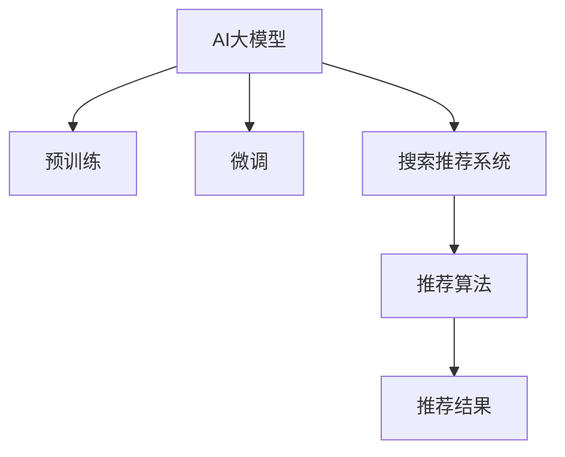

                 

# 搜索推荐系统的AI 大模型融合技术：电商平台提高竞争力的核心策略

## 1. 背景介绍

### 1.1 问题由来
随着电子商务行业的迅猛发展，电商平台的搜索推荐系统成为了用户获取信息和商品的最重要入口。传统的搜索推荐系统大多基于传统的机器学习算法，例如SVM、随机森林、协同过滤等，这些算法虽然能够达到不错的效果，但是面临数据量过大、特征维度高、实时性要求高等诸多挑战，难以完全满足现代电商平台的业务需求。

近年来，AI大模型如BERT、GPT、XLNet等，通过在大规模无标签数据上进行预训练，学习到了丰富的知识表示和语言理解能力。将AI大模型应用于搜索推荐系统，可以极大地提升搜索推荐系统的表现，帮助电商平台更好地满足用户需求，提升用户体验，增强竞争力。

### 1.2 问题核心关键点
AI大模型在电商搜索推荐系统中的应用，关键在于如何高效融合这些大模型与现有搜索推荐系统的技术架构。本文将介绍几种常见的融合技术，并详细分析其优缺点和适用范围，为电商平台提供可行的技术指导。

## 2. 核心概念与联系

### 2.1 核心概念概述

为了更好地理解AI大模型在搜索推荐系统中的应用，本文将介绍几个关键概念：

- **AI大模型（AI Large Models）**：指通过在大规模无标签数据上进行自监督预训练得到的强大语言模型，如BERT、GPT等。这些模型通过学习大量的语言知识，具备了强大的语言理解和生成能力。
- **预训练（Pre-training）**：指在大规模无标签数据上，通过自监督学习任务训练语言模型的过程。常见的预训练任务包括掩码语言模型、下一句预测等。
- **微调（Fine-tuning）**：指在大模型上进行有监督学习，通过特定任务的标注数据，优化模型在特定任务上的性能。
- **搜索推荐系统（Search and Recommendation System）**：指电商平台通过分析用户行为数据，为用户推荐相关商品和搜索建议的系统。传统的搜索推荐系统基于各种机器学习算法，而AI大模型融合技术，可以通过微调等方法提升系统的性能。

这些核心概念之间的联系可以通过以下Mermaid流程图来展示：



这个流程图展示了AI大模型与搜索推荐系统的关键技术联系：

1. AI大模型通过预训练学习语言知识。
2. 将AI大模型进行微调，适应特定任务（如电商推荐）。
3. 微调后的模型集成到搜索推荐系统中，优化推荐结果。

## 3. 核心算法原理 & 具体操作步骤
### 3.1 算法原理概述

AI大模型在搜索推荐系统中的应用，核心在于通过微调等方式，将大模型的知识表示能力引入推荐算法中，以提升推荐结果的相关性和多样性。常见的微调技术包括：

- **全参数微调（Fine-tuning）**：将预训练模型的全部参数都参与微调，适用于数据量较大、特征维度较高的场景。
- **参数高效微调（Parameter-Efficient Fine-Tuning, PEFT）**：只更新模型的一部分参数，保留预训练模型的权重不变，适用于数据量较小、特征维度较低的场景。

### 3.2 算法步骤详解

以下是使用AI大模型微调优化搜索推荐系统的具体步骤：

1. **数据准备**：收集电商平台的搜索记录、点击记录、用户画像等数据，划分为训练集、验证集和测试集。
2. **模型选择与预训练**：选择合适的AI大模型进行预训练，如BERT、GPT等。预训练过程包括自监督任务（如掩码语言模型）和大规模无标签数据的训练。
3. **微调模型**：在电商平台的特定推荐任务上，对预训练模型进行微调。例如，可以使用全参数微调或参数高效微调，适应电商平台的推荐场景。
4. **特征抽取与推荐算法**：将微调后的模型作为特征抽取器，提取用户和商品的表示。将提取的表示输入到推荐算法中，生成推荐结果。
5. **评估与优化**：在测试集上评估推荐模型的性能，根据评估结果进行优化调整，例如调整超参数、改变推荐算法等。

### 3.3 算法优缺点

AI大模型在搜索推荐系统中的应用，有以下优缺点：

**优点**：
- **性能提升**：通过引入AI大模型，显著提升推荐结果的相关性和多样性。
- **特征表达能力强**：AI大模型能够学习丰富的语言知识和上下文信息，有助于提升推荐效果。
- **通用性强**：AI大模型能够适应不同的推荐场景，如商品推荐、广告推荐等。

**缺点**：
- **计算资源需求高**：AI大模型需要大量的计算资源进行预训练和微调，可能面临计算资源的瓶颈。
- **数据依赖性强**：AI大模型对数据的依赖性较大，需要大量高质量的标注数据进行微调。
- **可解释性差**：AI大模型的内部结构复杂，难以解释其推荐决策过程。

### 3.4 算法应用领域

AI大模型融合技术在电商搜索推荐系统中的应用，主要涉及以下几个方面：

1. **商品推荐**：通过微调后的AI大模型，对用户的搜索历史、浏览记录等进行语义分析，生成个性化的商品推荐。
2. **广告推荐**：将广告内容和用户画像输入到微调后的AI大模型中，生成广告相关性评分，进行广告投放优化。
3. **搜索建议**：对用户的搜索词进行语义理解，生成相关搜索建议，提升用户搜索体验。

## 4. 数学模型和公式 & 详细讲解 & 举例说明

### 4.1 数学模型构建

假设电商平台上有$N$个商品，每个商品有一个唯一的ID $i$。用户输入的搜索查询为 $q$，搜索结果集为 $D$。定义 $f_i$ 为用户对商品 $i$ 的兴趣评分。根据AI大模型的微调结果，用户输入 $q$ 的表示为 $v_q$，商品 $i$ 的表示为 $v_i$。则推荐模型的目标是最小化预测误差 $e$，即：

$$
\min_{v_q, v_i} \|f_i - \langle v_q, v_i \rangle\|
$$

其中 $\langle v_q, v_i \rangle$ 表示向量内积。

### 4.2 公式推导过程

根据上述目标函数，推荐模型的优化过程可以通过迭代最小化内积误差实现。具体步骤如下：

1. **初始化**：将用户查询 $q$ 和商品 $i$ 的表示 $v_q$ 和 $v_i$ 初始化为随机向量。
2. **迭代优化**：对每一对用户查询和商品，计算内积误差 $e = |f_i - \langle v_q, v_i \rangle|$。
3. **更新表示**：根据误差 $e$ 和商品兴趣评分 $f_i$，更新用户查询 $q$ 和商品 $i$ 的表示 $v_q$ 和 $v_i$。

### 4.3 案例分析与讲解

假设电商平台上有以下用户查询和商品：

- 用户查询："运动鞋"
- 商品1：Nike Air Max
- 商品2：Adidas Boost
- 商品3：Reebok Trail

根据用户查询 "运动鞋"，通过微调后的AI大模型得到用户查询的表示 $v_q$ 和每个商品的表示 $v_i$。然后计算每个商品与用户查询的内积，得到推荐结果。

## 5. 项目实践：代码实例和详细解释说明

### 5.1 开发环境搭建

在进行搜索推荐系统的AI大模型融合技术开发前，需要搭建好开发环境。以下是具体的步骤：

1. **安装Python**：确保系统上已安装Python，版本在3.7以上。
2. **安装深度学习库**：安装TensorFlow或PyTorch等深度学习库，用于AI大模型的训练和微调。
3. **安装NLP库**：安装NLTK、spaCy等NLP库，用于处理文本数据。
4. **数据准备**：收集电商平台的搜索记录、点击记录等数据，并进行预处理。

### 5.2 源代码详细实现

以下是使用AI大模型进行电商推荐系统微调的示例代码：

```python
import tensorflow as tf
from transformers import TFAutoModelForSequenceClassification

# 加载预训练的BERT模型
model = TFAutoModelForSequenceClassification.from_pretrained('bert-base-uncased', num_labels=3)

# 加载用户查询和商品数据
user_queries = ["运动鞋", "男装", "女装"]
products = ["Nike Air Max", "Adidas Boost", "Reebok Trail"]

# 对用户查询和商品进行预处理
tokenizer = BertTokenizer.from_pretrained('bert-base-uncased')
encoded_input = tokenizer.encode_plus(user_queries, products, truncation=True, padding=True)

# 使用微调后的模型进行推荐
def get_recommendation(user_query, product):
    query = tokenizer.encode_plus(user_query, max_length=64, truncation=True, padding=True)
    product = tokenizer.encode_plus(product, max_length=64, truncation=True, padding=True)
    with tf.device('CPU:0'):
        inputs = {'input_ids': query['input_ids'], 'attention_mask': query['attention_mask'], 'labels': product['input_ids']}
        outputs = model(inputs)
        loss = outputs.loss
        logits = outputs.logits
    return logits

# 计算推荐结果
recommendations = []
for user_query in user_queries:
    logits = get_recommendation(user_query, products)
    # 计算推荐结果
    product_scores = tf.nn.softmax(logits, axis=1)
    product_recommends = [(product, score) for product, score in zip(products, product_scores[0].tolist())]
    recommendations.append(product_recommends)

# 输出推荐结果
for user_query, products in zip(user_queries, recommendations):
    print(f"用户查询：{user_query}")
    for product, score in products:
        print(f"商品：{product}，得分：{score}")
```

### 5.3 代码解读与分析

上述代码实现了使用微调后的BERT模型进行电商推荐系统的推荐过程。具体解读如下：

- **加载模型**：使用`TFAutoModelForSequenceClassification`加载预训练的BERT模型，指定标签数为3。
- **数据预处理**：使用`BertTokenizer`对用户查询和商品进行预处理，包括分词、编码、截断和填充。
- **推荐计算**：定义`get_recommendation`函数，计算用户查询和商品的内积，得到推荐结果。
- **结果输出**：根据计算结果，输出用户查询和每个商品的推荐得分，帮助用户选择商品。

## 6. 实际应用场景

### 6.1 电商平台商品推荐

基于AI大模型的推荐系统，可以显著提升电商平台的商品推荐效果。例如，对于用户查询 "运动鞋"，推荐系统可以根据微调后的BERT模型，快速生成Nike Air Max、Adidas Boost等商品的推荐结果。这不仅能够提升用户购物体验，还能增加商品曝光率和销售额。

### 6.2 广告推荐

广告推荐是电商平台的另一个重要应用场景。通过将用户查询和广告内容输入到微调后的BERT模型中，可以得到广告的相关性评分，帮助电商平台优化广告投放策略，提升广告点击率和转化率。

### 6.3 搜索建议

搜索建议功能可以帮助用户快速找到他们想要的商品。基于微调后的BERT模型，对用户的搜索词进行语义理解，生成相关的搜索建议，提升用户的搜索体验。

## 7. 工具和资源推荐

### 7.1 学习资源推荐

为了帮助开发者掌握AI大模型在搜索推荐系统中的应用，这里推荐一些优质的学习资源：

1. **TensorFlow官方文档**：TensorFlow的官方文档提供了详细的API文档和示例代码，适合初学者入门。
2. **PyTorch官方文档**：PyTorch的官方文档包括教程、API文档和社区资源，适合深度学习爱好者。
3. **Transformers官方文档**：Transformers库提供了预训练模型的API，适合进行模型微调和优化。
4. **自然语言处理课程**：Coursera上的自然语言处理课程，涵盖了NLP基础和高级技术，适合全面学习。

### 7.2 开发工具推荐

以下是一些常用的工具，用于搜索推荐系统的AI大模型融合开发：

1. **TensorBoard**：TensorFlow配套的可视化工具，用于监测模型训练和推理过程中的各项指标。
2. **Weights & Biases**：用于实验跟踪和模型评估的工具，可以帮助开发者快速迭代优化模型。
3. **NLP工具包**：如NLTK、spaCy等，用于处理文本数据和构建特征。
4. **深度学习框架**：如TensorFlow、PyTorch等，用于构建搜索推荐系统的AI大模型。

### 7.3 相关论文推荐

AI大模型在搜索推荐系统中的应用，近年来得到了广泛的关注和研究。以下是一些代表性的论文：

1. **Transformers in Industry**：详细介绍了AI大模型在搜索推荐系统中的应用，包括模型的构建和优化。
2. **BERT in Search and Recommendation Systems**：分析了BERT模型在电商搜索推荐系统中的应用，并提出了具体的优化方法。
3. **Semantic Similarity for Recommendation Systems**：讨论了基于语义相似性的推荐方法，利用AI大模型提取用户和商品的语义表示。

## 8. 总结：未来发展趋势与挑战

### 8.1 总结

本文介绍了AI大模型在搜索推荐系统中的应用，包括全参数微调和参数高效微调等技术。通过详细讲解数学模型和代码实例，展示了AI大模型如何优化电商平台的搜索推荐效果。同时，分析了AI大模型融合技术的优缺点和适用范围，为电商平台提供了可行的技术指导。

### 8.2 未来发展趋势

未来，搜索推荐系统的AI大模型融合技术将呈现以下几个发展趋势：

1. **多模态融合**：将视觉、语音等多模态信息与文本信息进行融合，提升推荐的准确性和多样性。
2. **跨领域迁移**：利用AI大模型的跨领域迁移能力，在不同领域进行搜索推荐优化。
3. **实时性增强**：通过优化模型结构和算法，提升搜索推荐系统的实时性和响应速度。
4. **模型压缩与量化**：采用模型压缩和量化技术，减少模型的大小和计算资源消耗，提升部署效率。
5. **可解释性增强**：利用模型解释工具，提供搜索推荐系统的可解释性和可视化效果，增强用户信任。

### 8.3 面临的挑战

尽管AI大模型在搜索推荐系统中的应用取得了一定的成功，但仍面临以下挑战：

1. **计算资源瓶颈**：大规模AI大模型的训练和微调需要大量的计算资源，可能面临计算资源的限制。
2. **数据质量问题**：电商平台的搜索推荐系统需要高质量的数据，但数据采集和标注可能存在偏差和噪声。
3. **用户隐私保护**：搜索推荐系统涉及用户的隐私数据，如何在保护用户隐私的前提下进行数据处理和模型训练，是一个重要问题。
4. **模型复杂性**：AI大模型的内部结构复杂，难以解释其推荐决策过程，需要进一步优化模型的可解释性。

### 8.4 研究展望

未来的研究将在以下几个方面寻求新的突破：

1. **模型压缩与量化**：开发更加高效的模型压缩和量化技术，提升模型的部署效率和实时性。
2. **模型优化与调参**：研究更高效的模型优化算法，提升模型训练速度和性能。
3. **跨领域迁移学习**：研究如何利用跨领域迁移学习技术，提升搜索推荐系统的泛化能力。
4. **用户隐私保护**：研究隐私保护技术，如差分隐私、联邦学习等，保护用户隐私和数据安全。
5. **可解释性增强**：研究模型解释工具，提升搜索推荐系统的可解释性和可视化效果。

## 9. 附录：常见问题与解答

### Q1：AI大模型在搜索推荐系统中如何进行微调？

A：AI大模型在搜索推荐系统中的微调过程，通常包括以下步骤：

1. **数据准备**：收集电商平台的搜索记录、点击记录等数据，划分为训练集、验证集和测试集。
2. **模型选择与预训练**：选择合适的AI大模型进行预训练，如BERT、GPT等。
3. **特征提取**：将用户查询和商品进行预处理，提取用户和商品的表示。
4. **微调模型**：在电商平台的特定推荐任务上，对预训练模型进行微调。例如，可以使用全参数微调或参数高效微调，适应电商平台的推荐场景。
5. **特征抽取与推荐算法**：将微调后的模型作为特征抽取器，提取用户和商品的表示。将提取的表示输入到推荐算法中，生成推荐结果。

### Q2：AI大模型在搜索推荐系统中的计算资源需求高，如何应对？

A：AI大模型在搜索推荐系统中的计算资源需求较高，可以考虑以下几种方法：

1. **分布式计算**：利用分布式计算框架，如Spark、TensorFlow分布式等，将计算任务分散到多个计算节点上，提升计算效率。
2. **模型压缩与量化**：采用模型压缩和量化技术，减少模型的大小和计算资源消耗，提升部署效率。
3. **模型剪枝**：通过剪枝技术，去除模型中冗余的参数，减少计算量和内存占用。

### Q3：AI大模型在搜索推荐系统中的可解释性差，如何解决？

A：AI大模型在搜索推荐系统中的可解释性较差，可以考虑以下几种方法：

1. **模型解释工具**：利用模型解释工具，如LIME、SHAP等，提供搜索推荐系统的可解释性和可视化效果，增强用户信任。
2. **部分微调**：只微调模型的一部分参数，保留预训练模型的权重不变，减小可解释性差的问题。
3. **特征工程**：通过特征工程，提取更具有解释性的特征，提升模型的可解释性。

### Q4：AI大模型在搜索推荐系统中的数据质量问题如何解决？

A：AI大模型在搜索推荐系统中的数据质量问题，可以考虑以下几种方法：

1. **数据清洗**：对数据进行清洗，去除噪声和异常值，提升数据质量。
2. **数据增强**：通过数据增强技术，如回译、近义替换等，扩充训练集，提高模型的泛化能力。
3. **多源数据融合**：将来自不同渠道的数据进行融合，提升数据的覆盖面和质量。

---

作者：禅与计算机程序设计艺术 / Zen and the Art of Computer Programming

