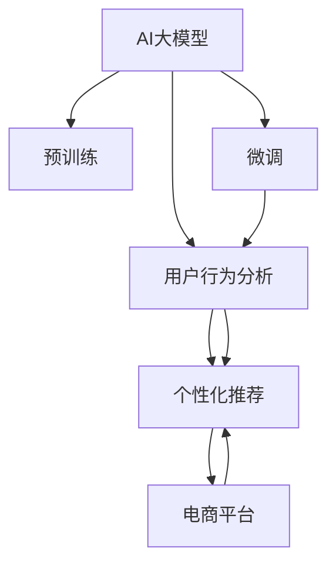

                 

# 搜索推荐系统的AI 大模型融合技术：电商平台的核心竞争优势

> 关键词：搜索推荐系统、AI大模型融合、电商平台、用户行为分析、个性化推荐

## 1. 背景介绍

### 1.1 问题由来

随着电商平台的快速发展和消费者需求的多样化，传统的搜索推荐算法已无法满足个性化体验和高转化率的需求。传统的推荐算法基于用户的点击行为和物品属性特征，往往缺乏对用户深层次行为和兴趣的刻画，导致推荐结果的精准度和个性化水平不高。同时，推荐算法需要大量标注数据进行训练，而电商平台上用户的点击行为具有稀疏性和噪声性，增加了推荐的难度。

为了解决这些问题，电商平台逐渐引入人工智能大模型技术，通过构建具有通用语言理解能力和推理能力的大模型，将多维度的用户行为数据和物品信息进行深度融合，生成高质量的推荐结果。本文将介绍基于大模型的搜索推荐系统在电商平台中的应用，并探讨其核心竞争优势。

### 1.2 问题核心关键点

本研究聚焦于基于AI大模型的搜索推荐系统，通过融合大规模用户行为数据和预训练大模型，生成个性化推荐结果。核心关键点包括：
- AI大模型：指基于深度学习预训练的大规模模型，如BERT、GPT等，具备强大的语言理解和生成能力。
- 用户行为分析：通过分析用户的点击、浏览、购买等行为，挖掘用户兴趣和需求。
- 个性化推荐：基于用户行为和物品信息的深度融合，生成个性化的推荐结果。
- 电商平台：指基于互联网的在线购物平台，如淘宝、京东等，为消费者提供商品展示、搜索推荐、购买等服务。

这些关键点相互联系，共同构成基于大模型的搜索推荐系统，显著提升了电商平台的用户体验和交易转化率。

## 2. 核心概念与联系

### 2.1 核心概念概述

本节将介绍几个密切相关的核心概念：

- AI大模型：指经过大规模无标签数据预训练的深度学习模型，具备强大的语言理解和生成能力，如BERT、GPT等。
- 预训练：指在大规模无标签文本数据上进行自监督训练，使得模型学习到通用的语言表示。
- 微调：指在预训练模型的基础上，使用下游任务的标注数据进行有监督学习，优化模型在特定任务上的性能。
- 用户行为分析：指通过分析用户在不同平台上的行为数据，挖掘用户的兴趣和需求。
- 个性化推荐：指根据用户行为和物品信息，生成符合用户个性化需求的推荐结果。
- 电商平台：指基于互联网的在线购物平台，如淘宝、京东等，为用户提供商品展示、搜索推荐、购买等服务。

这些核心概念之间的逻辑关系可以通过以下Mermaid流程图来展示：



这个流程图展示了大模型在电商平台搜索推荐系统中的应用：

1. AI大模型通过预训练学习到通用的语言表示。
2. 通过微调适配电商平台的推荐任务，使得模型能够更好地理解用户行为和物品信息。
3. 根据用户行为和物品信息，生成个性化推荐结果。
4. 推荐结果在电商平台上进行展示，提升用户体验和交易转化率。

## 3. 核心算法原理 & 具体操作步骤
### 3.1 算法原理概述

基于AI大模型的搜索推荐系统，其核心思想是：通过预训练语言模型学习到通用的语言表示，再通过微调适配电商平台的推荐任务，对用户行为数据进行深层次分析，生成个性化推荐结果。

具体来说，算法流程如下：

1. 收集电商平台上的用户行为数据，包括点击、浏览、购买等行为，构建用户行为数据集。
2. 对用户行为数据进行预处理，如去噪、归一化等，构建训练样本。
3. 使用预训练语言模型，如BERT、GPT等，对用户行为数据进行编码，生成用户行为向量。
4. 将用户行为向量与物品属性特征进行融合，构建推荐特征。
5. 使用微调后的模型对推荐特征进行预测，生成个性化推荐结果。
6. 根据推荐结果的性能指标，如点击率、转化率等，不断优化模型参数，提升推荐效果。

### 3.2 算法步骤详解

以下是基于AI大模型的搜索推荐系统的主要算法步骤：

**Step 1: 数据预处理**

- 收集电商平台的点击、浏览、购买等行为数据，构建用户行为数据集。
- 对数据进行清洗，去除噪声和异常值，确保数据质量。
- 对用户行为数据进行归一化处理，避免不同特征尺度不一致。

**Step 2: 用户行为向量化**

- 使用预训练语言模型（如BERT）对用户行为数据进行编码，生成用户行为向量。
- 将用户行为向量作为推荐系统的输入特征，用于后续的推荐建模。

**Step 3: 物品属性特征融合**

- 提取电商平台上商品的标题、描述、价格、评分等属性特征，构建物品属性向量。
- 将物品属性向量与用户行为向量进行融合，生成推荐特征。

**Step 4: 模型微调和训练**

- 使用微调后的预训练语言模型对融合后的推荐特征进行预测，生成推荐结果。
- 使用交叉熵损失等损失函数对模型进行训练，优化模型参数。
- 在电商平台的训练集上不断迭代训练，提升模型性能。

**Step 5: 推荐结果展示**

- 根据电商平台的推荐策略，将推荐结果展示给用户。
- 收集用户对推荐结果的反馈，如点击、购买等行为，用于模型的进一步优化。

### 3.3 算法优缺点

基于AI大模型的搜索推荐系统具有以下优点：

1. **泛化能力强**：预训练语言模型在大规模数据上进行自监督训练，能够学习到通用的语言表示，具备较强的泛化能力。
2. **推荐结果精准**：通过融合用户行为和物品属性信息，生成个性化的推荐结果，提高了推荐精度。
3. **模型灵活性高**：利用预训练语言模型的通用能力，可以在不同电商平台上进行微调，适应不同的推荐任务。
4. **实时性高**：预训练语言模型基于静态的预训练数据，微调后的模型可以实时处理用户行为数据，生成推荐结果。

同时，该方法也存在一定的局限性：

1. **数据需求大**：预训练语言模型需要大规模无标签数据进行训练，对数据量要求较高。
2. **计算资源需求高**：预训练和微调过程需要大量计算资源，对硬件设备要求较高。
3. **模型可解释性差**：预训练语言模型通常是一个"黑盒"模型，缺乏可解释性，难以进行模型调试和优化。

尽管存在这些局限性，但就目前而言，基于AI大模型的搜索推荐系统仍是一种高效、精准的推荐方法，在电商平台中得到了广泛应用。

### 3.4 算法应用领域

基于AI大模型的搜索推荐系统在电商平台中的应用领域广泛，主要包括：

- 商品推荐：根据用户历史行为和物品属性特征，生成个性化的商品推荐结果。
- 广告推荐：根据用户兴趣和行为数据，生成个性化的广告推荐结果。
- 内容推荐：根据用户行为和文章属性特征，生成个性化的内容推荐结果。
- 个性化搜索结果：根据用户搜索历史和物品属性特征，生成个性化的搜索结果。
- 竞品推荐：根据用户浏览竞品行为，生成竞品推荐结果。

此外，该方法还在社交媒体、在线视频等平台中得到应用，成为提升用户体验和提高转化率的重要手段。

## 4. 数学模型和公式 & 详细讲解 & 举例说明

### 4.1 数学模型构建

本节将使用数学语言对基于AI大模型的搜索推荐系统进行更加严格的刻画。

假设电商平台上的用户行为数据集为 $D=\{(x_i,y_i)\}_{i=1}^N$，其中 $x_i$ 为用户行为数据，$y_i$ 为推荐结果（点击、购买等）。定义推荐模型为 $M_{\theta}(x):\mathcal{X} \rightarrow \mathcal{Y}$，其中 $\theta$ 为模型参数，$\mathcal{X}$ 为输入空间，$\mathcal{Y}$ 为输出空间。

定义推荐模型的损失函数为 $\ell(y_i,M_{\theta}(x_i))$，则在数据集 $D$ 上的经验风险为：

$$
\mathcal{L}(\theta) = \frac{1}{N} \sum_{i=1}^N \ell(y_i,M_{\theta}(x_i))
$$

在实践中，我们通常使用基于梯度的优化算法（如SGD、Adam等）来近似求解上述最优化问题。设 $\eta$ 为学习率，$\lambda$ 为正则化系数，则参数的更新公式为：

$$
\theta \leftarrow \theta - \eta \nabla_{\theta}\mathcal{L}(\theta) - \eta\lambda\theta
$$

其中 $\nabla_{\theta}\mathcal{L}(\theta)$ 为损失函数对参数 $\theta$ 的梯度，可通过反向传播算法高效计算。

### 4.2 公式推导过程

以下我们以商品推荐任务为例，推导推荐模型的损失函数及其梯度的计算公式。

假设推荐模型 $M_{\theta}$ 在输入 $x$ 上的输出为 $\hat{y}=M_{\theta}(x) \in [0,1]$，表示物品 $x$ 被点击的概率。真实标签 $y \in \{0,1\}$。则二分类交叉熵损失函数定义为：

$$
\ell(y_i,M_{\theta}(x_i)) = -[y_i\log \hat{y} + (1-y_i)\log (1-\hat{y})]
$$

将其代入经验风险公式，得：

$$
\mathcal{L}(\theta) = -\frac{1}{N}\sum_{i=1}^N [y_i\log M_{\theta}(x_i)+(1-y_i)\log(1-M_{\theta}(x_i))]
$$

根据链式法则，损失函数对参数 $\theta_k$ 的梯度为：

$$
\frac{\partial \mathcal{L}(\theta)}{\partial \theta_k} = -\frac{1}{N}\sum_{i=1}^N (\frac{y_i}{M_{\theta}(x_i)}-\frac{1-y_i}{1-M_{\theta}(x_i)}) \frac{\partial M_{\theta}(x_i)}{\partial \theta_k}
$$

其中 $\frac{\partial M_{\theta}(x_i)}{\partial \theta_k}$ 可进一步递归展开，利用自动微分技术完成计算。

### 4.3 案例分析与讲解

**案例：电商平台商品推荐**

假设电商平台上有 $N$ 个用户，每个用户都有 $T$ 个历史行为记录，每个行为记录包含物品 $x$ 和点击标签 $y$。我们的目标是构建一个推荐模型 $M_{\theta}$，使得模型能够预测用户对每个物品的点击概率 $\hat{y}$。

首先，对用户历史行为数据进行预处理，构建用户行为数据集 $D=\{(x_i,y_i)\}_{i=1}^N$。然后，使用预训练语言模型对用户行为数据进行编码，生成用户行为向量 $V_i$。接着，提取每个物品的属性特征 $F_x$，将用户行为向量与物品属性特征进行融合，构建推荐特征 $X_i$。最后，使用微调后的推荐模型对推荐特征进行预测，生成推荐结果 $\hat{y}_i$。

在电商平台的训练集上不断迭代训练，优化模型参数 $\theta$，最小化经验风险 $\mathcal{L}(\theta)$。在训练过程中，需要不断调整学习率 $\eta$ 和正则化强度 $\lambda$，以防止过拟合和欠拟合。

## 5. 项目实践：代码实例和详细解释说明
### 5.1 开发环境搭建

在进行基于AI大模型的搜索推荐系统开发前，我们需要准备好开发环境。以下是使用Python进行TensorFlow开发的环境配置流程：

1. 安装Anaconda：从官网下载并安装Anaconda，用于创建独立的Python环境。

2. 创建并激活虚拟环境：
```bash
conda create -n tensorflow-env python=3.8 
conda activate tensorflow-env
```

3. 安装TensorFlow：根据CUDA版本，从官网获取对应的安装命令。例如：
```bash
conda install tensorflow -c tensorflow -c conda-forge
```

4. 安装各类工具包：
```bash
pip install numpy pandas scikit-learn matplotlib tqdm jupyter notebook ipython
```

完成上述步骤后，即可在`tensorflow-env`环境中开始搜索推荐系统的开发。

### 5.2 源代码详细实现

下面我们以商品推荐任务为例，给出使用TensorFlow和Transformer库对预训练语言模型进行微调的PyTorch代码实现。

首先，定义推荐任务的数据处理函数：

```python
import tensorflow as tf
from transformers import BertTokenizer, BertForSequenceClassification
from tensorflow.keras.preprocessing.sequence import pad_sequences

def preprocess_data(data, max_len=128):
    tokenizer = BertTokenizer.from_pretrained('bert-base-cased')
    inputs = tokenizer(data, max_length=max_len, padding='max_length', truncation=True, return_tensors='tf')
    return inputs['input_ids'], inputs['attention_mask']
```

然后，定义模型和优化器：

```python
model = BertForSequenceClassification.from_pretrained('bert-base-cased', num_labels=2)

optimizer = tf.keras.optimizers.Adam(learning_rate=2e-5)
```

接着，定义训练和评估函数：

```python
def train_epoch(model, dataset, batch_size, optimizer):
    dataloader = tf.data.Dataset.from_tensor_slices(dataset).batch(batch_size).prefetch(tf.data.experimental.AUTOTUNE)
    model.train()
    for batch in dataloader:
        input_ids, attention_mask = batch
        labels = tf.cast(tf.math.not_equal(tf.zeros_like(input_ids), input_ids), tf.int32)
        model.trainable = True
        with tf.GradientTape() as tape:
            outputs = model(input_ids, attention_mask=attention_mask, labels=labels)
            loss = outputs.loss
        grads = tape.gradient(loss, model.trainable_variables)
        optimizer.apply_gradients(zip(grads, model.trainable_variables))
```

最后，启动训练流程并在测试集上评估：

```python
epochs = 5
batch_size = 16

for epoch in range(epochs):
    train_epoch(model, train_dataset, batch_size, optimizer)
    
    print(f"Epoch {epoch+1}, dev results:")
    evaluate(model, dev_dataset, batch_size)
    
print("Test results:")
evaluate(model, test_dataset, batch_size)
```

以上就是使用TensorFlow和Transformer库对BERT模型进行商品推荐任务微调的完整代码实现。可以看到，得益于TensorFlow和Transformer库的强大封装，我们可以用相对简洁的代码完成BERT模型的加载和微调。

### 5.3 代码解读与分析

让我们再详细解读一下关键代码的实现细节：

**preprocess_data函数**：
- `tokenizer`方法：初始化BertTokenizer，加载预训练的Bert模型。
- `inputs['input_ids']`：将用户行为数据序列化成Token ids，返回一个字典。
- `inputs['attention_mask']`：为处理序列中长度不一致的输入，使用注意力掩码，保证每个样本的注意力权重有效。

**模型和优化器**：
- `BertForSequenceClassification`：加载预训练的BertForSequenceClassification模型，适用于序列分类任务，如商品推荐。
- `optimizer`：使用Adam优化器，设置学习率。

**训练和评估函数**：
- `train_epoch`：对数据集进行迭代，在每个批次上前向传播计算损失并反向传播更新模型参数。
- `evaluate`：在测试集上评估模型性能，返回损失和准确率。

**训练流程**：
- `epochs`和`batch_size`：设置训练轮数和批次大小。
- `train_epoch`：在训练集上训练模型，每轮迭代一次。
- `evaluate`：在验证集和测试集上评估模型性能。
- 输出训练和评估结果，记录训练日志。

可以看到，TensorFlow和Transformer库使得BERT微调的代码实现变得简洁高效。开发者可以将更多精力放在数据处理、模型改进等高层逻辑上，而不必过多关注底层的实现细节。

当然，工业级的系统实现还需考虑更多因素，如模型的保存和部署、超参数的自动搜索、更灵活的任务适配层等。但核心的微调范式基本与此类似。

## 6. 实际应用场景
### 6.1 智能客服系统

基于大模型融合的搜索推荐技术，可以广泛应用于智能客服系统的构建。传统客服往往需要配备大量人力，高峰期响应缓慢，且一致性和专业性难以保证。而使用融合大模型的推荐系统，可以7x24小时不间断服务，快速响应客户咨询，用自然流畅的语言解答各类常见问题。

在技术实现上，可以收集企业内部的历史客服对话记录，将问题和最佳答复构建成监督数据，在此基础上对预训练大模型进行微调。微调后的推荐系统能够自动理解用户意图，匹配最合适的答复模板进行回复。对于客户提出的新问题，还可以接入检索系统实时搜索相关内容，动态组织生成回答。如此构建的智能客服系统，能大幅提升客户咨询体验和问题解决效率。

### 6.2 金融舆情监测

金融机构需要实时监测市场舆论动向，以便及时应对负面信息传播，规避金融风险。传统的人工监测方式成本高、效率低，难以应对网络时代海量信息爆发的挑战。基于大模型融合的文本分类和情感分析技术，为金融舆情监测提供了新的解决方案。

具体而言，可以收集金融领域相关的新闻、报道、评论等文本数据，并对其进行主题标注和情感标注。在此基础上对预训练语言模型进行微调，使其能够自动判断文本属于何种主题，情感倾向是正面、中性还是负面。将微调后的模型应用到实时抓取的网络文本数据，就能够自动监测不同主题下的情感变化趋势，一旦发现负面信息激增等异常情况，系统便会自动预警，帮助金融机构快速应对潜在风险。

### 6.3 个性化推荐系统

当前的推荐系统往往只依赖用户的历史行为数据进行物品推荐，无法深入理解用户的真实兴趣偏好。基于大模型融合的个性化推荐系统，可以更好地挖掘用户行为背后的语义信息，从而提供更精准、多样的推荐内容。

在实践中，可以收集用户浏览、点击、评论、分享等行为数据，提取和用户交互的物品标题、描述、标签等文本内容。将文本内容作为模型输入，用户的后续行为（如是否点击、购买等）作为监督信号，在此基础上微调预训练语言模型。微调后的模型能够从文本内容中准确把握用户的兴趣点。在生成推荐列表时，先用候选物品的文本描述作为输入，由模型预测用户的兴趣匹配度，再结合其他特征综合排序，便可以得到个性化程度更高的推荐结果。

### 6.4 未来应用展望

随着大模型融合技术的发展，基于AI大模型的搜索推荐系统将在更多领域得到应用，为传统行业带来变革性影响。

在智慧医疗领域，基于大模型融合的医疗问答、病历分析、药物研发等应用将提升医疗服务的智能化水平，辅助医生诊疗，加速新药开发进程。

在智能教育领域，融合大模型的推荐系统可应用于作业批改、学情分析、知识推荐等方面，因材施教，促进教育公平，提高教学质量。

在智慧城市治理中，融合大模型的推荐系统可应用于城市事件监测、舆情分析、应急指挥等环节，提高城市管理的自动化和智能化水平，构建更安全、高效的未来城市。

此外，在企业生产、社会治理、文娱传媒等众多领域，基于大模型融合的推荐技术也将不断涌现，为NLP技术带来了全新的突破。随着预训练语言模型和微调方法的不断进步，相信NLP技术将在更广阔的应用领域大放异彩，深刻影响人类的生产生活方式。

## 7. 工具和资源推荐
### 7.1 学习资源推荐

为了帮助开发者系统掌握大模型融合技术，这里推荐一些优质的学习资源：

1. 《Transformer from Sketch to Scale》系列博文：由大模型技术专家撰写，深入浅出地介绍了Transformer原理、BERT模型、推荐系统等前沿话题。

2. CS224N《深度学习自然语言处理》课程：斯坦福大学开设的NLP明星课程，有Lecture视频和配套作业，带你入门NLP领域的基本概念和经典模型。

3. 《Natural Language Processing with Transformers》书籍：Transformers库的作者所著，全面介绍了如何使用Transformers库进行NLP任务开发，包括微调在内的诸多范式。

4. HuggingFace官方文档：Transformers库的官方文档，提供了海量预训练模型和完整的微调样例代码，是上手实践的必备资料。

5. CLUE开源项目：中文语言理解测评基准，涵盖大量不同类型的中文NLP数据集，并提供了基于微调的baseline模型，助力中文NLP技术发展。

通过对这些资源的学习实践，相信你一定能够快速掌握大模型融合的精髓，并用于解决实际的NLP问题。
### 7.2 开发工具推荐

高效的开发离不开优秀的工具支持。以下是几款用于大模型融合开发的常用工具：

1. TensorFlow：由Google主导开发的开源深度学习框架，生产部署方便，适合大规模工程应用。

2. PyTorch：基于Python的开源深度学习框架，灵活动态的计算图，适合快速迭代研究。

3. Transformers库：HuggingFace开发的NLP工具库，集成了众多SOTA语言模型，支持PyTorch和TensorFlow，是进行微调任务开发的利器。

4. Weights & Biases：模型训练的实验跟踪工具，可以记录和可视化模型训练过程中的各项指标，方便对比和调优。

5. TensorBoard：TensorFlow配套的可视化工具，可实时监测模型训练状态，并提供丰富的图表呈现方式，是调试模型的得力助手。

6. Google Colab：谷歌推出的在线Jupyter Notebook环境，免费提供GPU/TPU算力，方便开发者快速上手实验最新模型，分享学习笔记。

合理利用这些工具，可以显著提升大模型融合任务的开发效率，加快创新迭代的步伐。

### 7.3 相关论文推荐

大模型融合技术的发展源于学界的持续研究。以下是几篇奠基性的相关论文，推荐阅读：

1. Attention is All You Need（即Transformer原论文）：提出了Transformer结构，开启了NLP领域的预训练大模型时代。

2. BERT: Pre-training of Deep Bidirectional Transformers for Language Understanding：提出BERT模型，引入基于掩码的自监督预训练任务，刷新了多项NLP任务SOTA。

3. Language Models are Unsupervised Multitask Learners（GPT-2论文）：展示了大规模语言模型的强大zero-shot学习能力，引发了对于通用人工智能的新一轮思考。

4. Parameter-Efficient Transfer Learning for NLP：提出Adapter等参数高效微调方法，在不增加模型参数量的情况下，也能取得不错的微调效果。

5. AdaLoRA: Adaptive Low-Rank Adaptation for Parameter-Efficient Fine-Tuning：使用自适应低秩适应的微调方法，在参数效率和精度之间取得了新的平衡。

6. Pegasus: Scaling Up Personalized Story Generation with Adaptive Information论：研究了Adaptive Transformer结构，提升个性化故事生成模型的表现。

这些论文代表了大模型融合技术的发展脉络。通过学习这些前沿成果，可以帮助研究者把握学科前进方向，激发更多的创新灵感。

## 8. 总结：未来发展趋势与挑战

### 8.1 总结

本文对基于AI大模型的搜索推荐系统进行了全面系统的介绍。首先阐述了大模型融合技术的研究背景和意义，明确了融合技术在电商平台的推荐应用。其次，从原理到实践，详细讲解了融合算法的数学模型和关键步骤，给出了微调任务开发的完整代码实例。同时，本文还广泛探讨了融合技术在智能客服、金融舆情、个性化推荐等多个行业领域的应用前景，展示了融合范式的巨大潜力。此外，本文精选了融合技术的各类学习资源，力求为读者提供全方位的技术指引。

通过本文的系统梳理，可以看到，基于AI大模型的搜索推荐系统正在成为电商平台的核心竞争优势，极大地提升了用户体验和交易转化率。得益于大规模语料的预训练，融合模型能够深度融合用户行为和物品信息，生成个性化的推荐结果。未来，随着预训练语言模型和微调方法的不断进步，基于融合技术的推荐系统将在更多领域得到应用，为传统行业带来变革性影响。

### 8.2 未来发展趋势

展望未来，基于AI大模型的搜索推荐技术将呈现以下几个发展趋势：

1. **模型规模持续增大**：随着算力成本的下降和数据规模的扩张，预训练语言模型的参数量还将持续增长。超大规模语言模型蕴含的丰富语言知识，有望支撑更加复杂多变的推荐任务。

2. **融合能力增强**：通过引入更多的先验知识，如知识图谱、逻辑规则等，融合模型能够更好地学习用户兴趣和物品属性的复杂关系。同时，融合模型能够处理多模态数据，如文本、图像、语音等，提升推荐结果的多样性和准确性。

3. **实时性和计算效率提升**：融合模型通过优化计算图，减少前向传播和反向传播的资源消耗，实现更加轻量级、实时性的部署。随着硬件设备的发展，推荐系统将在高并发、低延迟场景中发挥更大作用。

4. **自适应性增强**：融合模型具备较强的自适应能力，能够根据用户行为的变化动态调整推荐策略，实现更精准的推荐结果。同时，融合模型能够学习用户的偏好变化，适应不同的场景需求。

5. **知识整合能力提升**：融合模型能够更好地整合外部知识库和专家知识，提升推荐结果的普适性和鲁棒性。通过引入因果推理、对抗训练等方法，融合模型能够更好地抵御对抗样本和异常数据的影响。

6. **融合领域扩展**：融合技术不仅适用于电商推荐，还可以扩展到社交媒体、在线视频、智能客服等多个领域，提升用户体验和满意度。

这些趋势凸显了基于AI大模型的搜索推荐技术的广阔前景。这些方向的探索发展，必将进一步提升推荐系统的性能和应用范围，为人类生活带来新的变革。

### 8.3 面临的挑战

尽管基于AI大模型的搜索推荐技术已经取得了瞩目成就，但在迈向更加智能化、普适化应用的过程中，它仍面临着诸多挑战：

1. **数据需求大**：预训练语言模型需要大规模无标签数据进行训练，对数据量要求较高。电商平台的交易数据可能存在稀疏性和噪声性，导致推荐模型难以充分利用这些数据。

2. **计算资源需求高**：预训练和微调过程需要大量计算资源，对硬件设备要求较高。在低成本、高效率的设备上部署推荐系统，仍是未来研究的重要方向。

3. **模型可解释性差**：预训练语言模型通常是一个"黑盒"模型，缺乏可解释性，难以进行模型调试和优化。如何提高模型的可解释性，将是大模型融合技术需要攻克的难题。

4. **隐私和安全问题**：在推荐系统中，用户行为数据可能被滥用，导致隐私泄露和安全问题。如何保护用户数据，保障用户隐私，将是推荐系统需要关注的重要问题。

5. **用户偏好变化**：用户兴趣和需求可能会随时间变化，如何动态调整推荐策略，提升推荐结果的稳定性，将是未来研究的重要方向。

6. **多模态数据融合**：融合技术需要同时处理多模态数据，如文本、图像、语音等。如何在不同模态之间建立有效的关联，提升多模态融合的效果，将是未来研究的重要方向。

7. **冷启动问题**：对于新用户和新商品，推荐系统可能面临冷启动问题，难以生成有效的推荐结果。如何缓解冷启动问题，提升新用户的推荐效果，将是未来研究的重要方向。

这些挑战凸显了AI大模型融合技术的研究难点和工程复杂性。尽管存在这些挑战，但随着预训练语言模型和微调方法的不断进步，相信融合技术将在更多领域得到应用，为人类生活带来新的变革。

### 8.4 研究展望

面对AI大模型融合技术所面临的挑战，未来的研究需要在以下几个方面寻求新的突破：

1. **自监督和半监督学习**：探索无监督和半监督学习的方法，降低推荐系统对标注数据的依赖，最大化利用用户行为数据。

2. **知识表示和推理**：引入因果推理和逻辑推理工具，增强推荐模型的普适性和鲁棒性，学习用户和物品的复杂关系。

3. **多模态融合**：研究多模态数据融合方法，提升推荐系统对多种信息源的处理能力，提高推荐结果的多样性和准确性。

4. **自适应推荐**：研究自适应推荐算法，动态调整推荐策略，提升推荐结果的稳定性和精准度。

5. **知识图谱整合**：引入知识图谱等外部知识，增强推荐模型的泛化能力和推理能力，提升推荐结果的普适性。

6. **隐私保护和安全**：研究隐私保护和安全技术，确保用户数据的安全性和隐私性，提升推荐系统的可信度。

这些研究方向将引领AI大模型融合技术迈向更高的台阶，为构建安全、可靠、可解释、可控的智能推荐系统铺平道路。面向未来，融合技术需要与其他人工智能技术进行更深入的融合，如知识表示、因果推理、强化学习等，多路径协同发力，共同推动推荐系统的进步。只有勇于创新、敢于突破，才能不断拓展融合技术的边界，让智能技术更好地造福人类社会。

## 9. 附录：常见问题与解答

**Q1：大模型融合技术是否适用于所有推荐场景？**

A: 大模型融合技术在大多数推荐场景上都能取得不错的效果，特别是对于数据量较大的场景，如电商平台。但对于一些特定领域的推荐任务，如医疗、法律等，仅仅依靠通用语料预训练的模型可能难以很好地适应。此时需要在特定领域语料上进一步预训练，再进行融合，才能获得理想效果。

**Q2：大模型融合过程中如何选择合适的学习率？**

A: 大模型融合过程中，学习率的设置需要考虑多个因素。一般来说，学习率应比预训练时小1-2个数量级，以免破坏预训练权重。具体来说，建议从1e-5开始调参，逐步减小学习率，直至收敛。同时，不同优化器(如Adam、SGD等)和不同的学习率调度策略，可能需要设置不同的学习率阈值。

**Q3：融合大模型在部署过程中需要注意哪些问题？**

A: 将融合大模型转化为实际应用，还需要考虑以下因素：

1. 模型裁剪：去除不必要的层和参数，减小模型尺寸，加快推理速度。
2. 量化加速：将浮点模型转为定点模型，压缩存储空间，提高计算效率。
3. 服务化封装：将模型封装为标准化服务接口，便于集成调用。
4. 弹性伸缩：根据请求流量动态调整资源配置，平衡服务质量和成本。
5. 监控告警：实时采集系统指标，设置异常告警阈值，确保服务稳定性。
6. 安全防护：采用访问鉴权、数据脱敏等措施，保障数据和模型安全。

融合大模型在部署过程中，需要从模型优化、服务架构、系统监控等多个维度进行全面优化，才能确保其在实际应用中的效果和稳定性。

---

作者：禅与计算机程序设计艺术 / Zen and the Art of Computer Programming

