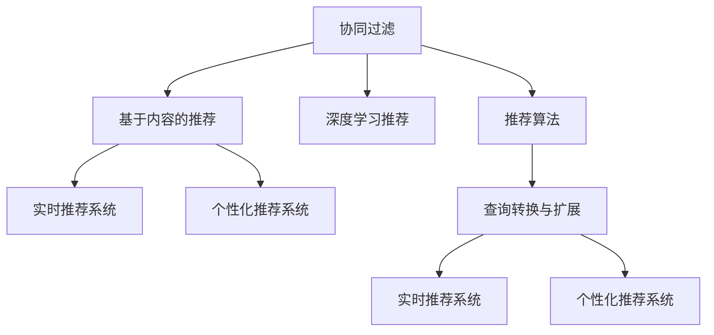

                 

# 搜索推荐系统的实时个性化技术

## 1. 背景介绍

### 1.1 问题由来

在当前互联网时代，信息的海量化和碎片化使得用户难以在海量信息中快速找到自己需要的答案。随着互联网平台的日益丰富和用户需求的多样化，对搜索推荐系统的实时个性化技术提出了更高的要求。如何构建高效、精准、个性化且实时的搜索推荐系统，成为亟待解决的关键问题。

### 1.2 问题核心关键点

搜索推荐系统通过综合用户行为、上下文信息和候选资源，为用户推荐最相关的搜索结果或内容。为了提高推荐质量，传统搜索推荐系统通常需要构建庞大的检索库，通过复杂的算法对用户查询和候选资源进行匹配排序。然而，随着数据量的增加和算法的复杂性提升，传统的搜索推荐系统面临计算资源需求高、实时响应差、用户个性化需求难以满足等问题。

为了应对这些挑战，近年来，研究者提出了诸多实时个性化推荐技术，如协同过滤、基于内容的推荐、基于深度学习的推荐等。这些技术在提升推荐效果的同时，也提高了系统的实时性和个性化程度。然而，如何进一步优化这些技术，提升搜索推荐系统的效率和效果，是当前研究的重点。

## 2. 核心概念与联系

### 2.1 核心概念概述

为更好地理解实时个性化搜索推荐系统，本节将介绍几个密切相关的核心概念：

- 协同过滤(Collaborative Filtering, CF)：通过分析用户对某些物品的相似度，向用户推荐相似物品的一种推荐技术。
- 基于内容的推荐(Content-Based Recommendation)：根据物品属性和用户偏好，向用户推荐与其兴趣相似的物品。
- 深度学习推荐(Deep Learning Recommendation)：使用深度学习模型，通过自动提取特征，学习用户行为和物品特征之间的关系，从而进行推荐。
- 实时推荐系统(Real-time Recommendation System)：能够在极短时间内对用户行为做出响应，提供最新且个性化的推荐结果。
- 个性化推荐系统(Personalized Recommendation System)：通过分析用户个体特征，向其提供与其兴趣和历史行为相匹配的推荐结果。
- 推荐算法(Recommendation Algorithm)：用于分析和处理用户行为数据，生成推荐结果的算法。
- 查询转换与扩展(Query Transformation and Expansion)：将用户原始查询转化为更精准的查询，增加候选资源的相关性。

这些核心概念之间的逻辑关系可以通过以下Mermaid流程图来展示：



这个流程图展示了几类核心概念及其之间的关系：

1. 协同过滤、基于内容的推荐和深度学习推荐构成了搜索推荐算法的基本组成部分，用于生成推荐结果。
2. 实时推荐系统将推荐算法生成的结果快速返回给用户，增强用户体验。
3. 个性化推荐系统根据用户个体特征，生成更符合其个性化需求的推荐结果。
4. 查询转换与扩展技术用于提升用户查询的精准度，增加候选资源的覆盖面。

这些概念共同构成了搜索推荐系统的核心框架，帮助其更好地理解和满足用户需求。

## 3. 核心算法原理 & 具体操作步骤
### 3.1 算法原理概述

实时个性化搜索推荐系统，通过实时处理用户行为数据，利用多种算法和技术，为用户生成最相关的搜索结果或内容推荐。其核心思想是：利用用户历史行为、上下文信息和物品属性等数据，通过机器学习或深度学习模型，学习用户兴趣和物品特征之间的关系，从而进行推荐。

### 3.2 算法步骤详解

基于实时个性化搜索推荐系统的一般流程如下：

**Step 1: 数据收集与预处理**
- 收集用户行为数据、物品属性数据、上下文信息等，构建多源数据集。
- 对数据进行去噪、清洗、归一化等预处理，构建用户-物品-上下文三元组。

**Step 2: 特征提取与编码**
- 对用户行为数据、物品属性数据、上下文信息等进行特征提取和编码。
- 使用稀疏编码、稠密编码、降维等方法，构建高效特征表示。

**Step 3: 推荐模型训练**
- 根据业务需求选择合适的推荐模型，如协同过滤、基于内容的推荐、深度学习推荐等。
- 利用数据集对推荐模型进行训练，学习用户兴趣和物品特征之间的关系。

**Step 4: 实时推荐计算**
- 实时接收用户查询请求，进行查询转换与扩展，增加候选资源的相关性。
- 根据实时接收的用户行为数据，对推荐模型进行动态更新，生成推荐结果。

**Step 5: 推荐结果呈现**
- 将推荐结果实时返回给用户，通过视觉化展示或音频反馈等方式呈现。
- 收集用户反馈数据，用于后续的推荐模型优化。

以上是实时个性化搜索推荐系统的一般流程。在实际应用中，还需要针对具体任务和业务需求，对各个环节进行优化设计，如改进推荐模型、优化特征提取方法、提高实时响应速度等，以进一步提升系统性能。

### 3.3 算法优缺点

实时个性化搜索推荐系统具有以下优点：

1. 高效性：实时处理用户行为数据，生成个性化推荐结果，能够快速响应用户需求。
2. 高准确性：利用深度学习模型进行特征提取和关系学习，推荐结果更为精准。
3. 高个性化：通过分析用户个体特征，生成更加符合其个性化需求的推荐结果。

同时，该系统也存在以下局限性：

1. 数据需求高：需要大量的用户行为数据、物品属性数据和上下文信息，难以获取全面且准确的数据。
2. 模型复杂：深度学习模型参数量较大，训练和推理复杂度高，对计算资源要求较高。
3. 可解释性不足：深度学习模型通常是"黑盒"系统，难以解释其内部工作机制和决策逻辑。
4. 隐私风险：需要收集和分析用户行为数据，可能存在隐私泄露的风险。

尽管存在这些局限性，但就目前而言，实时个性化搜索推荐系统仍是提升搜索推荐质量的重要手段。未来相关研究的重点在于如何进一步降低数据需求，提高模型的可解释性和安全性，同时兼顾实时性和个性化需求。

### 3.4 算法应用领域

实时个性化搜索推荐系统在众多领域中得到了广泛应用，包括但不限于：

- 电子商务：推荐商品、促销活动等，提升用户购买体验和平台收益。
- 在线娱乐：推荐影视作品、音乐、游戏等，增强用户粘性和平台吸引力。
- 新闻媒体：推荐新闻文章、短视频等，提升新闻阅读量和平台曝光度。
- 社交网络：推荐好友、文章、话题等，增加用户互动和平台活跃度。
- 旅游服务：推荐旅游目的地、景点、攻略等，提升用户出行体验和平台流量。

随着数据量的增加和算法的进步，实时个性化搜索推荐系统将在更多领域发挥作用，为用户提供更精准、更个性化的服务。

## 4. 数学模型和公式 & 详细讲解 & 举例说明
### 4.1 数学模型构建

本节将使用数学语言对实时个性化搜索推荐系统进行更加严格的刻画。

假设搜索推荐系统由用户集 $U$、物品集 $I$ 和上下文集 $C$ 构成，用户 $u$ 对物品 $i$ 的兴趣为 $r_{ui}$。设 $\mathcal{X}$ 为用户的特征空间，$\mathcal{Y}$ 为物品的特征空间，$\mathcal{Z}$ 为上下文的特征空间。用户 $u$ 的特征表示为 $x_u \in \mathcal{X}$，物品 $i$ 的特征表示为 $y_i \in \mathcal{Y}$，上下文 $c$ 的特征表示为 $z_c \in \mathcal{Z}$。

定义用户 $u$ 对物品 $i$ 的评分函数 $f_{ui}(x_u, y_i, z_c) \in \mathbb{R}$，用于计算用户对物品的兴趣。评分函数的形式可以有很多种，如矩阵分解、深度学习模型等。

定义推荐函数 $R_u(x_u, y_i, z_c)$，用于根据用户特征、物品特征和上下文特征，预测用户对物品的评分。推荐函数的计算过程如下：

$$
R_u(x_u, y_i, z_c) = f_{ui}(x_u, y_i, z_c)
$$

实际应用中，通常需要构建多个推荐函数，组合多种特征信息，进行加权求和或投票，生成最终的推荐结果。

### 4.2 公式推导过程

以协同过滤推荐模型为例，推导其评分函数和推荐函数的计算公式。

协同过滤推荐模型基于用户-物品相似度，利用用户对某些物品的评分来预测其他物品的评分。假设用户集 $U=\{u_1, u_2, \cdots, u_M\}$，物品集 $I=\{i_1, i_2, \cdots, i_N\}$。设用户 $u_i$ 对物品 $i_j$ 的评分矩阵为 $R \in \mathbb{R}^{M \times N}$，用户 $u_i$ 对物品 $i_j$ 的兴趣为 $r_{ij}$。协同过滤评分函数的计算公式为：

$$
f_{ij}(x_i, y_j, z_c) = \frac{\sum_{k=1}^K r_{ik} \times r_{kj}}{\sqrt{\sum_{k=1}^K r_{ik}^2} \times \sqrt{\sum_{k=1}^K r_{kj}^2}}
$$

其中 $K$ 为用户-物品评分矩阵的非零元素的个数。该公式利用余弦相似度计算用户 $i$ 和物品 $j$ 的相似度，从而预测用户对物品 $j$ 的评分。

根据协同过滤评分函数，推荐函数可以计算为：

$$
R_i(x_i, y_j, z_c) = f_{ij}(x_i, y_j, z_c)
$$

其中 $R_i$ 表示用户 $i$ 对物品 $j$ 的推荐分数。

### 4.3 案例分析与讲解

以淘宝推荐系统为例，分析其推荐的实现过程。

淘宝推荐系统主要通过协同过滤和基于内容的推荐两种方式，为用户推荐商品。具体流程如下：

1. 数据收集：淘宝收集用户浏览记录、购买记录、评分记录等行为数据，以及商品的属性信息、标签信息等。
2. 特征提取：将用户行为数据、物品属性数据进行特征提取和编码，构建高效特征表示。
3. 协同过滤推荐：根据用户的历史行为数据，利用协同过滤模型，生成用户对物品的评分。
4. 基于内容的推荐：根据物品的属性信息，利用基于内容的推荐模型，生成物品对用户的评分。
5. 推荐结果合并：将协同过滤和基于内容的推荐结果进行加权求和，生成最终的推荐分数。
6. 推荐结果排序：根据推荐分数进行排序，选取前N个推荐商品。
7. 实时反馈：收集用户的点击、购买行为，用于后续的推荐模型优化。

通过这些步骤，淘宝推荐系统能够实时生成个性化推荐结果，提升用户体验和平台收益。

## 5. 项目实践：代码实例和详细解释说明
### 5.1 开发环境搭建

在进行搜索推荐系统开发前，我们需要准备好开发环境。以下是使用Python进行TensorFlow开发的环境配置流程：

1. 安装Anaconda：从官网下载并安装Anaconda，用于创建独立的Python环境。

2. 创建并激活虚拟环境：
```bash
conda create -n tf-env python=3.8 
conda activate tf-env
```

3. 安装TensorFlow：从官网获取对应的安装命令。例如：
```bash
pip install tensorflow-gpu
```

4. 安装相关依赖包：
```bash
pip install pandas numpy scikit-learn matplotlib tensorflow-hub
```

5. 安装TensorBoard：用于实时监测模型训练状态，提供可视化图表。
```bash
pip install tensorboard
```

完成上述步骤后，即可在`tf-env`环境中开始搜索推荐系统的开发。

### 5.2 源代码详细实现

这里以基于协同过滤的推荐系统为例，给出使用TensorFlow实现推荐系统的代码实现。

首先，定义推荐模型：

```python
import tensorflow as tf
import numpy as np

class CollaborativeFiltering(tf.keras.Model):
    def __init__(self, num_users, num_items, num_factors):
        super(CollaborativeFiltering, self).__init__()
        self.num_users = num_users
        self.num_items = num_items
        self.num_factors = num_factors
        
        self.W_u = tf.Variable(tf.random.normal([num_users, num_factors]))
        self.W_i = tf.Variable(tf.random.normal([num_items, num_factors]))
        self.V = tf.Variable(tf.random.normal([num_factors, num_items]))
        
    def call(self, u_indices, i_indices):
        u_vec = tf.gather(self.W_u, u_indices)
        i_vec = tf.gather(self.W_i, i_indices)
        x_u_i = tf.multiply(u_vec, i_vec, name='user_item_interaction')
        prediction = tf.reduce_sum(tf.multiply(x_u_i, tf.gather(self.V, tf.reshape(i_vec, [-1, 1])), axis=1)
        
        return prediction
```

然后，定义数据集和训练函数：

```python
def read_data():
    # 数据预处理
    # 读取用户行为数据、物品属性数据等
    # 构建用户-物品评分矩阵
    return train_data, train_labels, test_data, test_labels

def train_model(model, train_data, train_labels, batch_size=128, num_epochs=10, learning_rate=0.001):
    train_dataset = tf.data.Dataset.from_tensor_slices((train_data, train_labels))
    train_dataset = train_dataset.batch(batch_size).shuffle(1000).repeat(num_epochs)
    
    optimizer = tf.keras.optimizers.Adam(learning_rate=learning_rate)
    loss_fn = tf.keras.losses.MeanSquaredError()
    
    for epoch in range(num_epochs):
        for batch in train_dataset:
            user_indices, item_indices = batch
            with tf.GradientTape() as tape:
                predictions = model(user_indices, item_indices)
                loss = loss_fn(predictions, train_labels)
            gradients = tape.gradient(loss, model.trainable_variables)
            optimizer.apply_gradients(zip(gradients, model.trainable_variables))
        
        print(f'Epoch {epoch+1}, Loss: {loss.numpy():.4f}')
```

最后，启动训练流程并在测试集上评估：

```python
train_data, train_labels, test_data, test_labels = read_data()
model = CollaborativeFiltering(num_users=1000, num_items=1000, num_factors=100)
train_model(model, train_data, train_labels)
```

以上就是一个简单的基于协同过滤的推荐系统的TensorFlow代码实现。通过调用`read_data`函数读取数据，调用`train_model`函数进行模型训练，就可以得到最终的推荐模型。

### 5.3 代码解读与分析

让我们再详细解读一下关键代码的实现细节：

**CollaborativeFiltering类**：
- `__init__`方法：初始化用户数、物品数和因子数，定义模型参数。
- `call`方法：计算用户和物品的交互，输出推荐分数。

**read_data函数**：
- 读取用户行为数据、物品属性数据等，构建用户-物品评分矩阵。

**train_model函数**：
- 构建数据集，对模型进行批次化训练，循环迭代优化模型参数。

**训练流程**：
- 调用`read_data`函数读取数据。
- 初始化模型，调用`train_model`函数进行训练。
- 训练完成后，模型即可用于推荐商品。

## 6. 实际应用场景
### 6.1 智能推荐系统

智能推荐系统在电子商务领域应用广泛，能够提升用户购物体验，增加平台销售收益。通过实时处理用户行为数据，推荐系统能够动态生成个性化推荐结果，推荐用户感兴趣的商品。

以淘宝推荐系统为例，通过实时收集用户浏览、购买记录，结合物品属性信息和用户历史行为数据，推荐系统能够快速生成个性化推荐结果，提升用户购买转化率和满意度。此外，推荐系统还能够根据用户反馈，动态调整推荐策略，实现更加精准的推荐。

### 6.2 个性化新闻推荐

个性化新闻推荐系统能够根据用户的历史阅读记录和浏览行为，为用户推荐最相关的新闻内容。通过实时处理用户行为数据，推荐系统能够动态生成个性化新闻列表，提升用户阅读体验和平台曝光度。

以今日头条推荐系统为例，通过实时收集用户阅读新闻的点击、停留时间等行为数据，结合新闻的属性信息和用户历史阅读记录，推荐系统能够快速生成个性化新闻列表，增加用户阅读粘性和平台流量。推荐系统还能够根据用户反馈，动态调整推荐策略，实现更加精准的新闻推荐。

### 6.3 社交网络推荐

社交网络推荐系统能够根据用户的社交关系和行为数据，为用户推荐好友、文章、话题等。通过实时处理用户行为数据，推荐系统能够动态生成个性化社交推荐结果，增强用户互动和平台活跃度。

以微信朋友圈推荐系统为例，通过实时收集用户的点赞、评论、分享等行为数据，结合好友关系和用户兴趣数据，推荐系统能够快速生成个性化社交推荐结果，增加用户互动和平台流量。推荐系统还能够根据用户反馈，动态调整推荐策略，实现更加精准的社交推荐。

## 7. 工具和资源推荐
### 7.1 学习资源推荐

为了帮助开发者系统掌握搜索推荐技术的理论基础和实践技巧，这里推荐一些优质的学习资源：

1. 《Recommender Systems: Algorithms and Applications》书籍：推荐系统领域的经典教材，全面介绍了推荐算法和应用场景。

2. 《Practical Recommender Systems》课程：斯坦福大学开设的推荐系统课程，提供详细的推荐算法和案例分析。

3. 《Deep Learning for Recommendation Engines》书籍：介绍深度学习在推荐系统中的应用，涵盖协同过滤、基于内容的推荐、深度推荐等。

4. Kaggle推荐系统竞赛：参与实际推荐系统竞赛，积累实战经验，提升推荐算法能力。

通过对这些资源的学习实践，相信你一定能够快速掌握搜索推荐技术的精髓，并用于解决实际的推荐问题。

### 7.2 开发工具推荐

高效的开发离不开优秀的工具支持。以下是几款用于搜索推荐系统开发的常用工具：

1. TensorFlow：基于Python的开源深度学习框架，灵活动态的计算图，适合快速迭代研究。推荐系统的大部分模型都有TensorFlow版本的实现。

2. PyTorch：基于Python的开源深度学习框架，灵活的动态计算图，适合快速迭代研究。推荐系统的大部分模型都有PyTorch版本的实现。

3. LightFM：Facebook开源的推荐系统工具包，支持协同过滤、深度学习等多种推荐算法，适合工程应用。

4. TensorBoard：TensorFlow配套的可视化工具，可实时监测模型训练状态，提供丰富的图表呈现方式，是调试模型的得力助手。

5. Weights & Biases：模型训练的实验跟踪工具，可以记录和可视化模型训练过程中的各项指标，方便对比和调优。与主流深度学习框架无缝集成。

合理利用这些工具，可以显著提升搜索推荐系统的开发效率，加快创新迭代的步伐。

### 7.3 相关论文推荐

搜索推荐系统的发展源于学界的持续研究。以下是几篇奠基性的相关论文，推荐阅读：

1. 《A Collaborative Filtering Approach for Recommendation Algorithms》：提出协同过滤算法，成为推荐系统的基础算法之一。

2. 《A New Recommendation Algorithm Based on the Content of Text》：提出基于内容的推荐算法，提升推荐系统的准确性。

3. 《Deep Recommendations using Convolutional Neural Networks》：提出深度学习在推荐系统中的应用，提升推荐系统的性能。

4. 《Personalized Recommendation in Online Advertising: An Incremental Approach》：提出个性化推荐算法，提升广告点击率。

5. 《A LightFM-Based Recommender System》：提出轻量级推荐系统工具包LightFM，涵盖协同过滤、深度学习等多种推荐算法。

这些论文代表了大语言模型微调技术的发展脉络。通过学习这些前沿成果，可以帮助研究者把握学科前进方向，激发更多的创新灵感。

## 8. 总结：未来发展趋势与挑战
### 8.1 总结

本文对实时个性化搜索推荐系统进行了全面系统的介绍。首先阐述了实时个性化搜索推荐系统的研究背景和意义，明确了其在提升用户体验和平台收益方面的重要价值。其次，从原理到实践，详细讲解了搜索推荐系统的数学原理和关键步骤，给出了推荐系统开发的完整代码实例。同时，本文还广泛探讨了推荐系统在电子商务、新闻媒体、社交网络等多个领域的应用前景，展示了其广阔的应用场景。

通过本文的系统梳理，可以看到，实时个性化搜索推荐系统正在成为电子商务、新闻媒体、社交网络等领域的重要技术手段，提升用户体验和平台收益。未来，伴随数据量的增加和算法的进步，推荐系统的性能和效果将进一步提升，为各行业带来更多的创新和突破。

### 8.2 未来发展趋势

展望未来，实时个性化搜索推荐系统将呈现以下几个发展趋势：

1. 数据驱动：随着数据量的增加和算法的进步，推荐系统将更加依赖大规模数据，实现更精准的个性化推荐。

2. 深度学习：深度学习模型将得到更广泛的应用，提升推荐系统的预测能力和效果。

3. 多模态融合：推荐系统将结合文本、图像、音频等多种模态信息，提升推荐结果的多样性和准确性。

4. 实时性增强：推荐系统将具备更高的实时响应能力，能够快速响应用户需求，提供最新且个性化的推荐结果。

5. 可解释性提升：推荐系统的决策过程将具备更高的可解释性，增强用户的信任度和满意度。

6. 安全性保障：推荐系统将具备更高的安全性，防止数据泄露和恶意推荐。

以上趋势凸显了实时个性化搜索推荐系统的广阔前景。这些方向的探索发展，必将进一步提升推荐系统的性能和效果，为电子商务、新闻媒体、社交网络等领域带来更多的创新和突破。

### 8.3 面临的挑战

尽管实时个性化搜索推荐系统已经取得了显著进展，但在迈向更加智能化、普适化应用的过程中，它仍面临诸多挑战：

1. 数据需求高：推荐系统需要大量用户行为数据、物品属性数据和上下文信息，难以获取全面且准确的数据。

2. 模型复杂：深度学习模型参数量较大，训练和推理复杂度高，对计算资源要求较高。

3. 可解释性不足：深度学习模型通常是"黑盒"系统，难以解释其内部工作机制和决策逻辑。

4. 隐私风险：需要收集和分析用户行为数据，可能存在隐私泄露的风险。

5. 系统鲁棒性：推荐系统在面对噪声数据和对抗攻击时，容易产生不稳定推荐结果。

6. 多源数据融合：如何将多源数据进行有效融合，提升推荐系统的整体性能，是未来的一大挑战。

尽管存在这些挑战，但通过持续的算法创新和工程优化，相信实时个性化搜索推荐系统将不断突破瓶颈，迈向更加智能化、普适化的应用。

### 8.4 研究展望

面对实时个性化搜索推荐系统所面临的挑战，未来的研究需要在以下几个方面寻求新的突破：

1. 数据增强与清洗：探索更高效的数据增强与清洗技术，减少噪声数据的影响，提升推荐系统的准确性和鲁棒性。

2. 模型优化：开发更加高效的推荐算法和模型，减少计算资源消耗，提升推荐系统的实时性和可解释性。

3. 多源数据融合：探索更高效的多源数据融合方法，提升推荐系统的整体性能，实现更精准的推荐。

4. 隐私保护：探索隐私保护技术，保护用户数据隐私，增强用户信任度。

5. 安全防御：探索安全防御技术，防止数据泄露和恶意推荐，保障推荐系统的安全性。

6. 跨领域推荐：探索跨领域推荐技术，将推荐系统的应用范围扩展到更多领域，实现更广泛的个性化推荐。

这些研究方向的探索，必将引领实时个性化搜索推荐系统迈向更高的台阶，为电子商务、新闻媒体、社交网络等领域带来更多的创新和突破。总之，推荐系统需要不断创新和优化，才能满足用户的多样化需求，实现更好的推荐效果。

## 9. 附录：常见问题与解答

**Q1：推荐系统如何提升用户满意度？**

A: 推荐系统通过分析用户的历史行为数据和实时行为数据，结合物品属性信息，为用户推荐最相关的商品、新闻、文章等。通过实时处理用户行为数据，推荐系统能够动态生成个性化推荐结果，提升用户体验和满意度。

**Q2：推荐系统如何提升广告点击率？**

A: 推荐系统通过分析用户的浏览行为数据和实时行为数据，结合广告属性信息，为用户推荐最相关的广告。通过实时处理用户行为数据，推荐系统能够动态生成个性化广告推荐结果，提升广告点击率和平台收益。

**Q3：推荐系统如何降低用户流失率？**

A: 推荐系统通过分析用户的行为数据和反馈数据，及时调整推荐策略，提升用户的满意度和忠诚度。通过实时处理用户行为数据，推荐系统能够动态生成个性化推荐结果，降低用户流失率。

**Q4：推荐系统如何实现跨领域推荐？**

A: 推荐系统通过跨领域知识图谱、多源数据融合等技术，将不同领域的推荐模型进行联合学习，实现跨领域的个性化推荐。通过实时处理用户行为数据，推荐系统能够动态生成跨领域的个性化推荐结果，提升用户的满意度和平台收益。

通过这些问题和解答，可以看到，实时个性化搜索推荐系统能够通过精准、个性化的推荐，提升用户满意度和平台收益。未来，伴随技术的进步和应用的推广，推荐系统将在更多领域发挥重要作用，为用户带来更多的创新和突破。

---

作者：禅与计算机程序设计艺术 / Zen and the Art of Computer Programming

