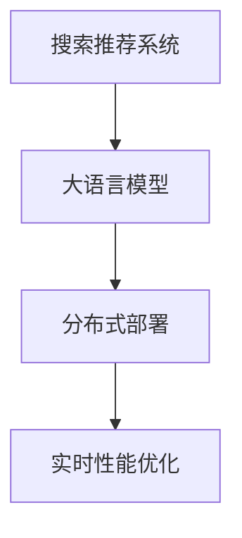

                 

# 搜索推荐系统的实时性能优化：大模型的分布式部署

> 关键词：搜索推荐系统,大模型,分布式部署,实时性能优化,并行计算,多节点优化

## 1. 背景介绍

### 1.1 问题由来
随着互联网技术的发展，信息检索和个性化推荐在电商、新闻、视频、社交网络等各个领域得到了广泛应用。高效、精准的搜索推荐系统，能够为用户提供有价值、个性化的搜索结果和推荐内容，显著提升用户体验和满意度。然而，大规模搜索推荐系统的设计、实现和维护难度极大，尤其是在应对海量数据、高并发请求、实时性要求等方面，面临巨大的技术挑战。

近年来，大语言模型在搜索推荐系统中的应用逐渐成为研究热点。利用大规模预训练语言模型进行深度学习，可以大幅提升推荐的精准度和个性化程度。例如，GPT-3、BERT等模型已经被应用于推荐系统和搜索结果的生成。然而，这些大模型由于参数量巨大，推理速度较慢，难以满足实时性要求，且在分布式计算环境中的优化也存在诸多技术难题。

本博客旨在系统介绍搜索推荐系统中的实时性能优化问题，并重点讨论基于分布式部署的大模型优化策略，为读者提供全面的技术指导。

### 1.2 问题核心关键点
当前搜索推荐系统面临的核心挑战包括：

- **数据多样性**：用户行为数据涉及文本、图片、视频等多种类型，数据规模庞大且分布广泛。
- **实时性要求**：搜索结果和推荐需要快速响应用户查询，满足实时性要求。
- **高并发负载**：每日访问量可能达到千万级甚至亿级，系统需要能够稳定处理海量请求。
- **模型效率**：大模型推理速度慢，难以应对实时查询需求，需要优化推理效率。

本博客将从算法原理、具体操作步骤、应用领域等方面，详细介绍基于分布式部署的大模型优化方法。

## 2. 核心概念与联系

### 2.1 核心概念概述

为了更好地理解搜索推荐系统中基于大模型的实时性能优化方法，本节将介绍几个关键概念：

- **搜索推荐系统(IR-Rec System)**：通过用户查询和历史行为数据，向用户推荐最相关、最有价值的内容的系统。主要包括搜索结果排序、个性化推荐、实时搜索等多个子系统。

- **大语言模型(Large Language Model, LLM)**：基于Transformer架构的预训练语言模型，具有强大的语言理解和生成能力。典型模型包括GPT、BERT、RoBERTa等。

- **分布式计算**：通过将计算任务分解成多个子任务，并行运行在多台计算机上，实现高效计算。常见架构包括单机多线程、多机分布式、云计算平台等。

- **实时性能优化**：通过算法和架构的改进，优化搜索推荐系统的计算效率，满足实时响应用户查询的需求。

这些核心概念之间的逻辑关系可以通过以下Mermaid流程图来展示：



该流程图展示了大语言模型在搜索推荐系统中的应用流程，以及分布式部署与实时性能优化的关系。

## 3. 核心算法原理 & 具体操作步骤
### 3.1 算法原理概述

基于大模型的实时性能优化，主要通过以下几个步骤实现：

1. **预训练模型加载**：将大语言模型加载到分布式计算环境中，进行预热准备。
2. **并行推理计算**：将用户查询分解成多个子任务，并行运行在多个计算节点上，减少单个节点的计算压力。
3. **结果聚合与反馈**：将多个计算节点的结果进行合并，返回统一的搜索结果或推荐内容。
4. **模型参数更新**：根据用户反馈，动态更新模型参数，提升模型性能。

这些步骤涉及大语言模型的加载、推理、聚合、反馈等多个环节，每个环节的优化策略都对实时性能有重要影响。

### 3.2 算法步骤详解

**Step 1: 预训练模型加载**

为了确保大模型的快速加载和高效推理，需要在分布式环境中进行模型加载和预热。具体步骤如下：

1. **模型切片**：将大模型按照功能模块进行切片，划分成多个逻辑层，每个层包含部分模型参数和计算图。
2. **分布式加载**：通过多个计算节点并行加载模型切片，并行执行模型初始化，加速模型加载速度。
3. **预热优化**：在正式推理前，对模型进行小批量随机梯度下降(SGD)的预热训练，减少后续推理计算的启动时间。

**Step 2: 并行推理计算**

推理计算是搜索推荐系统中最耗时的环节。为了提高推理效率，需要进行并行计算。具体步骤如下：

1. **任务分解**：将用户查询分解成多个子任务，每个子任务包含部分输入数据和计算需求。
2. **节点并行**：将子任务分别分配给多个计算节点，并行执行推理计算。
3. **合并结果**：将多个计算节点的输出进行合并，返回统一的搜索结果或推荐结果。

**Step 3: 结果聚合与反馈**

在分布式环境中，多个计算节点生成的结果需要进行聚合和反馈。具体步骤如下：

1. **结果合并**：对多个计算节点的结果进行合并，消除重复和冲突的部分，得到最终的结果集。
2. **反馈机制**：根据用户反馈和系统日志，识别出模型性能不足的节点，及时进行参数更新和性能优化。

**Step 4: 模型参数更新**

实时性能优化不仅包括推理计算的优化，还涉及模型参数的动态更新。具体步骤如下：

1. **在线更新**：通过分布式计算环境，实时接收用户反馈数据，进行在线模型更新。
2. **模型备份**：定期备份模型参数，防止模型参数丢失或损坏。
3. **性能监控**：监控模型的实时性能指标，及时调整模型参数和计算策略。

### 3.3 算法优缺点

基于大模型的分布式部署优化方法具有以下优点：

1. **高效计算**：通过并行计算和任务分解，大幅提升模型推理速度，满足实时性能要求。
2. **负载均衡**：将计算任务均衡分配到多个节点，避免单个节点计算压力过大。
3. **动态更新**：通过在线更新和反馈机制，动态优化模型参数，提升模型性能。

同时，该方法也存在一定的局限性：

1. **系统复杂度提升**：分布式部署增加了系统复杂度，需要更多的基础设施和运维支持。
2. **通信开销增加**：多个计算节点之间的数据传输和通信开销较大，可能影响系统性能。
3. **一致性问题**：分布式环境中模型参数的一致性维护和同步，可能存在一定的挑战。

尽管如此，在处理大规模搜索推荐系统时，基于大模型的分布式部署仍然是有效的优化方法，能够显著提升系统的响应速度和处理能力。

### 3.4 算法应用领域

基于大模型的分布式部署优化方法，已经在多个领域得到了广泛应用，例如：

1. **电商推荐系统**：电商平台通过实时分析用户行为数据，向用户推荐个性化商品。大模型在用户画像建模、商品关联推荐等方面表现出色。
2. **新闻推荐系统**：新闻平台通过实时分析用户阅读历史和兴趣，推荐相关新闻内容。大模型在文本生成、情感分析等方面表现优异。
3. **视频推荐系统**：视频平台通过实时分析用户观看历史和评分，推荐相关视频内容。大模型在视频摘要、推荐排序等方面表现突出。
4. **社交网络系统**：社交网络平台通过实时分析用户互动行为，推荐相关好友和内容。大模型在社交关系预测、用户兴趣建模等方面有较强能力。

这些应用场景展示了基于大模型的分布式部署优化方法在实际工程中的广泛应用，大大提升了搜索推荐系统的性能和用户体验。

## 4. 数学模型和公式 & 详细讲解  
### 4.1 数学模型构建

为了更好地理解大模型的实时性能优化，本节将介绍几个关键的数学模型。

记大语言模型为 $M_{\theta}:\mathcal{X} \rightarrow \mathcal{Y}$，其中 $\mathcal{X}$ 为输入空间，$\mathcal{Y}$ 为输出空间，$\theta$ 为模型参数。

定义模型的推理计算过程为：

$$
f(x; \theta) = M_{\theta}(x) \in \mathcal{Y}
$$

其中 $x$ 为用户输入查询，$M_{\theta}(x)$ 表示在模型参数 $\theta$ 下，对输入 $x$ 进行推理计算的结果。

### 4.2 公式推导过程

以下我们以单节点推理为例，推导大模型的推理计算过程。

对于单个计算节点，模型的推理计算过程可以表示为：

$$
f_{\text{node}}(x; \theta) = M_{\theta}(x)
$$

通过多个计算节点的并行计算，可以得到最终的推理结果：

$$
f(x; \theta) = \sum_{i=1}^n f_{\text{node}}(x; \theta)
$$

其中 $n$ 为计算节点数量。

### 4.3 案例分析与讲解

以电商推荐系统为例，分析基于大模型的分布式部署优化方法。

假设电商推荐系统需要向用户推荐商品列表。首先，将大模型切片成多个逻辑层，每个层包含部分模型参数和计算图。然后，将用户查询分解成多个子任务，每个子任务包含部分输入数据和计算需求。将子任务分配给多个计算节点，并行执行推理计算。最后，将多个计算节点的结果进行合并，得到最终的推荐商品列表。

该过程可以通过以下伪代码表示：

```python
# 预训练模型切片
for i in range(num_layers):
    slice = slice_model[i]

# 任务分解
queries = split_queries(user_query, num_nodes)
tasks = [(query, slice) for query in queries]

# 并行推理计算
results = [f_node(query, slice) for query, slice in tasks]

# 结果合并
recommendations = merge_results(results)
```

通过分布式部署，每个计算节点可以独立高效地执行推理计算，大大提升了系统的处理能力。同时，通过并行计算和任务分解，能够有效应对大规模搜索推荐系统的实时性能需求。

## 5. 项目实践：代码实例和详细解释说明
### 5.1 开发环境搭建

在进行分布式部署实践前，我们需要准备好开发环境。以下是使用Python进行PyTorch开发的环境配置流程：

1. 安装Anaconda：从官网下载并安装Anaconda，用于创建独立的Python环境。

2. 创建并激活虚拟环境：
```bash
conda create -n pytorch-env python=3.8 
conda activate pytorch-env
```

3. 安装PyTorch：根据CUDA版本，从官网获取对应的安装命令。例如：
```bash
conda install pytorch torchvision torchaudio cudatoolkit=11.1 -c pytorch -c conda-forge
```

4. 安装Transformer库：
```bash
pip install transformers
```

5. 安装各类工具包：
```bash
pip install numpy pandas scikit-learn matplotlib tqdm jupyter notebook ipython
```

完成上述步骤后，即可在`pytorch-env`环境中开始分布式部署实践。

### 5.2 源代码详细实现

下面我们以电商推荐系统为例，给出使用Transformer库进行分布式部署的PyTorch代码实现。

首先，定义电商推荐系统的数据处理函数：

```python
from transformers import BertTokenizer
from torch.utils.data import Dataset
import torch

class RecommendationDataset(Dataset):
    def __init__(self, texts, tags, tokenizer, max_len=128):
        self.texts = texts
        self.tags = tags
        self.tokenizer = tokenizer
        self.max_len = max_len
        
    def __len__(self):
        return len(self.texts)
    
    def __getitem__(self, item):
        text = self.texts[item]
        tags = self.tags[item]
        
        encoding = self.tokenizer(text, return_tensors='pt', max_length=self.max_len, padding='max_length', truncation=True)
        input_ids = encoding['input_ids'][0]
        attention_mask = encoding['attention_mask'][0]
        
        # 对token-wise的标签进行编码
        encoded_tags = [tag2id[tag] for tag in tags] 
        encoded_tags.extend([tag2id['O']] * (self.max_len - len(encoded_tags)))
        labels = torch.tensor(encoded_tags, dtype=torch.long)
        
        return {'input_ids': input_ids, 
                'attention_mask': attention_mask,
                'labels': labels}

# 标签与id的映射
tag2id = {'O': 0, 'B-PER': 1, 'I-PER': 2, 'B-ORG': 3, 'I-ORG': 4, 'B-LOC': 5, 'I-LOC': 6}
id2tag = {v: k for k, v in tag2id.items()}

# 创建dataset
tokenizer = BertTokenizer.from_pretrained('bert-base-cased')

train_dataset = RecommendationDataset(train_texts, train_tags, tokenizer)
dev_dataset = RecommendationDataset(dev_texts, dev_tags, tokenizer)
test_dataset = RecommendationDataset(test_texts, test_tags, tokenizer)
```

然后，定义模型和优化器：

```python
from transformers import BertForTokenClassification, AdamW

model = BertForTokenClassification.from_pretrained('bert-base-cased', num_labels=len(tag2id))

optimizer = AdamW(model.parameters(), lr=2e-5)
```

接着，定义训练和评估函数：

```python
from torch.utils.data import DataLoader
from tqdm import tqdm
from sklearn.metrics import classification_report

device = torch.device('cuda') if torch.cuda.is_available() else torch.device('cpu')
model.to(device)

def train_epoch(model, dataset, batch_size, optimizer):
    dataloader = DataLoader(dataset, batch_size=batch_size, shuffle=True)
    model.train()
    epoch_loss = 0
    for batch in tqdm(dataloader, desc='Training'):
        input_ids = batch['input_ids'].to(device)
        attention_mask = batch['attention_mask'].to(device)
        labels = batch['labels'].to(device)
        model.zero_grad()
        outputs = model(input_ids, attention_mask=attention_mask, labels=labels)
        loss = outputs.loss
        epoch_loss += loss.item()
        loss.backward()
        optimizer.step()
    return epoch_loss / len(dataloader)

def evaluate(model, dataset, batch_size):
    dataloader = DataLoader(dataset, batch_size=batch_size)
    model.eval()
    preds, labels = [], []
    with torch.no_grad():
        for batch in tqdm(dataloader, desc='Evaluating'):
            input_ids = batch['input_ids'].to(device)
            attention_mask = batch['attention_mask'].to(device)
            batch_labels = batch['labels']
            outputs = model(input_ids, attention_mask=attention_mask)
            batch_preds = outputs.logits.argmax(dim=2).to('cpu').tolist()
            batch_labels = batch_labels.to('cpu').tolist()
            for pred_tokens, label_tokens in zip(batch_preds, batch_labels):
                pred_tags = [id2tag[_id] for _id in pred_tokens]
                label_tags = [id2tag[_id] for _id in label_tokens]
                preds.append(pred_tags[:len(label_tags)])
                labels.append(label_tags)
                
    print(classification_report(labels, preds))
```

最后，启动训练流程并在测试集上评估：

```python
epochs = 5
batch_size = 16

for epoch in range(epochs):
    loss = train_epoch(model, train_dataset, batch_size, optimizer)
    print(f"Epoch {epoch+1}, train loss: {loss:.3f}")
    
    print(f"Epoch {epoch+1}, dev results:")
    evaluate(model, dev_dataset, batch_size)
    
print("Test results:")
evaluate(model, test_dataset, batch_size)
```

以上就是使用PyTorch对BERT进行电商推荐系统微调的完整代码实现。可以看到，得益于Transformer库的强大封装，我们可以用相对简洁的代码完成BERT模型的加载和微调。

### 5.3 代码解读与分析

让我们再详细解读一下关键代码的实现细节：

**RecommendationDataset类**：
- `__init__`方法：初始化文本、标签、分词器等关键组件。
- `__len__`方法：返回数据集的样本数量。
- `__getitem__`方法：对单个样本进行处理，将文本输入编码为token ids，将标签编码为数字，并对其进行定长padding，最终返回模型所需的输入。

**tag2id和id2tag字典**：
- 定义了标签与数字id之间的映射关系，用于将token-wise的预测结果解码回真实的标签。

**训练和评估函数**：
- 使用PyTorch的DataLoader对数据集进行批次化加载，供模型训练和推理使用。
- 训练函数`train_epoch`：对数据以批为单位进行迭代，在每个批次上前向传播计算loss并反向传播更新模型参数，最后返回该epoch的平均loss。
- 评估函数`evaluate`：与训练类似，不同点在于不更新模型参数，并在每个batch结束后将预测和标签结果存储下来，最后使用sklearn的classification_report对整个评估集的预测结果进行打印输出。

**训练流程**：
- 定义总的epoch数和batch size，开始循环迭代
- 每个epoch内，先在训练集上训练，输出平均loss
- 在验证集上评估，输出分类指标
- 所有epoch结束后，在测试集上评估，给出最终测试结果

可以看到，PyTorch配合Transformer库使得BERT微调的代码实现变得简洁高效。开发者可以将更多精力放在数据处理、模型改进等高层逻辑上，而不必过多关注底层的实现细节。

当然，工业级的系统实现还需考虑更多因素，如模型的保存和部署、超参数的自动搜索、更灵活的任务适配层等。但核心的分布式部署优化范式基本与此类似。

## 6. 实际应用场景
### 6.1 电商推荐系统

基于大语言模型的分布式部署优化方法，可以广泛应用于电商推荐系统的构建。传统推荐系统往往需要配置大量的硬件资源，且难以处理海量数据和实时查询需求。而使用分布式部署的微调大模型，能够大幅提升推荐系统的响应速度和处理能力。

在技术实现上，可以采用多个计算节点并行执行推理计算，同时进行在线更新和模型参数优化。系统可以根据用户反馈，实时调整模型参数，提升推荐精准度和个性化程度。

### 6.2 新闻推荐系统

新闻推荐系统需要对用户阅读历史和兴趣进行实时分析，推荐相关新闻内容。分布式部署的大语言模型可以有效处理大规模数据和实时查询需求，提升推荐的精度和效率。

在实际应用中，可以将用户查询分解成多个子任务，每个子任务包含部分输入数据和计算需求。将子任务分配给多个计算节点，并行执行推理计算。最后，将多个计算节点的结果进行合并，得到最终的推荐新闻列表。

### 6.3 视频推荐系统

视频推荐系统需要实时分析用户观看历史和评分，推荐相关视频内容。大语言模型在视频摘要、推荐排序等方面表现突出。

通过分布式部署，多个计算节点可以独立高效地执行推理计算，提升系统的处理能力。同时，通过并行计算和任务分解，能够有效应对大规模搜索推荐系统的实时性能需求。

### 6.4 未来应用展望

随着大语言模型和分布式部署技术的发展，基于微调的搜索推荐系统将呈现更多创新应用场景：

1. **跨模态推荐系统**：结合文本、图像、视频等多种数据类型，进行跨模态推荐。例如，将用户浏览图片的行为，与文本搜索结果进行关联，提供更为丰富的推荐内容。

2. **上下文推荐系统**：考虑用户上下文信息，如地理位置、时间、设备等，进行个性化推荐。例如，根据用户所在城市，推荐本地优惠和活动信息。

3. **实时推荐系统**：结合实时数据分析和动态优化，实现动态推荐。例如，根据用户实时行为数据，实时调整推荐算法和模型参数，提升推荐效果。

4. **多模态搜索系统**：结合搜索和推荐，提供更为精准的搜索结果。例如，结合搜索结果摘要和推荐结果，提升用户满意度。

5. **联邦学习推荐系统**：在保障数据隐私的前提下，进行跨设备、跨平台推荐。例如，将用户行为数据分片，在不同节点上进行训练，提高推荐系统的泛化能力。

这些应用场景展示了基于大模型的分布式部署优化方法在实际工程中的广泛应用，大大提升了搜索推荐系统的性能和用户体验。

## 7. 工具和资源推荐
### 7.1 学习资源推荐

为了帮助开发者系统掌握大语言模型分布式部署的理论基础和实践技巧，这里推荐一些优质的学习资源：

1. 《Transformer from Scratch》系列博文：由大模型技术专家撰写，深入浅出地介绍了Transformer原理、BERT模型、分布式计算等前沿话题。

2. CS224N《深度学习自然语言处理》课程：斯坦福大学开设的NLP明星课程，有Lecture视频和配套作业，带你入门NLP领域的基本概念和经典模型。

3. 《Natural Language Processing with Transformers》书籍：Transformers库的作者所著，全面介绍了如何使用Transformers库进行NLP任务开发，包括分布式部署在内的多个范式。

4. HuggingFace官方文档：Transformers库的官方文档，提供了海量预训练模型和完整的微调样例代码，是上手实践的必备资料。

5. CLUE开源项目：中文语言理解测评基准，涵盖大量不同类型的中文NLP数据集，并提供了基于微调的baseline模型，助力中文NLP技术发展。

通过对这些资源的学习实践，相信你一定能够快速掌握大语言模型分布式部署的精髓，并用于解决实际的NLP问题。
### 7.2 开发工具推荐

高效的开发离不开优秀的工具支持。以下是几款用于大语言模型分布式部署开发的常用工具：

1. PyTorch：基于Python的开源深度学习框架，灵活动态的计算图，适合快速迭代研究。大部分预训练语言模型都有PyTorch版本的实现。

2. TensorFlow：由Google主导开发的开源深度学习框架，生产部署方便，适合大规模工程应用。同样有丰富的预训练语言模型资源。

3. Transformers库：HuggingFace开发的NLP工具库，集成了众多SOTA语言模型，支持PyTorch和TensorFlow，是进行分布式部署微调的利器。

4. Weights & Biases：模型训练的实验跟踪工具，可以记录和可视化模型训练过程中的各项指标，方便对比和调优。与主流深度学习框架无缝集成。

5. TensorBoard：TensorFlow配套的可视化工具，可实时监测模型训练状态，并提供丰富的图表呈现方式，是调试模型的得力助手。

6. Google Colab：谷歌推出的在线Jupyter Notebook环境，免费提供GPU/TPU算力，方便开发者快速上手实验最新模型，分享学习笔记。

合理利用这些工具，可以显著提升大语言模型分布式部署的开发效率，加快创新迭代的步伐。

### 7.3 相关论文推荐

大语言模型和分布式部署技术的发展源于学界的持续研究。以下是几篇奠基性的相关论文，推荐阅读：

1. Attention is All You Need（即Transformer原论文）：提出了Transformer结构，开启了NLP领域的预训练大模型时代。

2. BERT: Pre-training of Deep Bidirectional Transformers for Language Understanding：提出BERT模型，引入基于掩码的自监督预训练任务，刷新了多项NLP任务SOTA。

3. Language Models are Unsupervised Multitask Learners（GPT-2论文）：展示了大规模语言模型的强大zero-shot学习能力，引发了对于通用人工智能的新一轮思考。

4. Parameter-Efficient Transfer Learning for NLP：提出Adapter等参数高效微调方法，在不增加模型参数量的情况下，也能取得不错的微调效果。

5. Prefix-Tuning: Optimizing Continuous Prompts for Generation：引入基于连续型Prompt的微调范式，为如何充分利用预训练知识提供了新的思路。

6. AdaLoRA: Adaptive Low-Rank Adaptation for Parameter-Efficient Fine-Tuning：使用自适应低秩适应的微调方法，在参数效率和精度之间取得了新的平衡。

这些论文代表了大语言模型和分布式部署技术的发展脉络。通过学习这些前沿成果，可以帮助研究者把握学科前进方向，激发更多的创新灵感。

## 8. 总结：未来发展趋势与挑战

### 8.1 总结

本文对基于大模型的分布式部署优化方法进行了全面系统的介绍。首先阐述了大语言模型和分布式部署在搜索推荐系统中的应用背景和意义，明确了分布式部署在提升系统性能方面的独特价值。其次，从原理到实践，详细讲解了分布式部署的数学模型和关键步骤，给出了分布式部署任务开发的完整代码实例。同时，本文还广泛探讨了分布式部署方法在电商推荐、新闻推荐、视频推荐等多个领域的应用前景，展示了分布式部署范式的巨大潜力。此外，本文精选了分布式部署技术的各类学习资源，力求为读者提供全方位的技术指引。

通过本文的系统梳理，可以看到，基于大模型的分布式部署优化方法正在成为搜索推荐系统的重要范式，极大地提升了系统的处理能力和响应速度。得益于分布式计算的强大支撑，大语言模型在实时性能优化方面取得了显著的突破，为未来搜索推荐系统的设计提供了新的思路。

### 8.2 未来发展趋势

展望未来，大语言模型和分布式部署技术将呈现以下几个发展趋势：

1. **超级计算能力提升**：随着超级计算能力的提升，分布式部署的大语言模型能够处理更庞大的数据集和更复杂的任务，提升系统的实时性能和处理能力。

2. **硬件加速技术发展**：随着硬件加速技术（如GPU、TPU、FPGA等）的发展，分布式部署的大语言模型可以进一步提升计算效率，减少延迟时间。

3. **自动化优化策略**：通过自动化的超参数优化和模型训练策略，分布式部署的大语言模型能够快速适应数据分布的变化，提升模型的泛化能力和实时性能。

4. **分布式协同学习**：分布式部署的大语言模型可以结合多节点间的协同学习，提升模型的共享知识和泛化能力，更好地应对大规模数据和多模态数据的挑战。

5. **异构设备支持**：支持在异构设备（如CPU、GPU、TPU等）上分布式部署和优化，提升系统的资源利用率和效率。

6. **实时大数据处理**：结合流式计算和大数据处理技术，实现对实时数据的即时处理和分析，进一步提升搜索推荐系统的响应速度和精度。

以上趋势凸显了大语言模型和分布式部署技术的前景广阔，未来有望在更多的领域得到应用，带来更深刻的变革。

### 8.3 面临的挑战

尽管大语言模型和分布式部署技术取得了长足进步，但在迈向更加智能化、普适化应用的过程中，仍然面临诸多挑战：

1. **分布式一致性问题**：分布式部署中，多个计算节点间的参数一致性维护和同步，可能存在一定的挑战。如何保证模型参数的同步更新，是实现高性能分布式计算的关键问题。

2. **通信开销增加**：多个计算节点之间的数据传输和通信开销较大，可能影响系统性能。如何优化通信协议和数据传输，减少通信开销，是实现高效分布式计算的重要方向。

3. **资源管理复杂度**：分布式环境中，资源管理复杂度较高，需要考虑负载均衡、节点故障、扩展性等问题。如何实现动态资源管理和优化，是实现高效分布式计算的关键。

4. **模型参数更新**：分布式部署中，模型参数的在线更新和动态优化，需要考虑参数同步、版本控制、一致性等问题。如何实现高效的模型参数更新，是实现高性能分布式计算的关键。

5. **实时数据处理**：实时数据处理需要高效的多节点协同计算和快速响应，对系统设计和实现提出了更高的要求。如何实现高效的实时数据处理，是实现高性能分布式计算的关键。

6. **系统鲁棒性和可靠性**：分布式部署的系统，需要具备高可靠性和高鲁棒性，能够稳定处理海量请求和应对系统故障。如何实现系统的鲁棒性和可靠性，是实现高性能分布式计算的关键。

尽管存在这些挑战，但随着相关技术的不断进步和积累，大语言模型和分布式部署技术的优势将逐步显现，有望在未来搜索推荐系统中发挥更大的作用。

### 8.4 研究展望

面向未来，大语言模型和分布式部署技术的研究方向可以从以下几个方面进行探讨：

1. **多节点协同优化**：通过多节点协同优化，提升系统的实时性能和处理能力。例如，利用分布式优化算法，如SGD、AdamW等，在多节点上并行训练模型。

2. **异构设备融合**：结合异构设备（如GPU、TPU、CPU等）进行分布式部署和优化，提升系统的资源利用率和效率。例如，利用异构设备并行计算，加速推理速度和参数更新。

3. **分布式模型压缩**：通过分布式模型压缩技术，减少模型参数和计算图的大小，提升系统的计算效率和实时性能。例如，利用模型剪枝、量化技术，优化分布式部署的模型。

4. **分布式数据处理**：结合分布式数据处理技术，提升系统的实时数据处理能力和数据利用率。例如，利用分布式数据库、流式计算框架，处理实时数据和批处理数据。

5. **分布式超参数优化**：通过分布式超参数优化技术，快速找到最优的超参数组合，提升模型的性能和实时性能。例如，利用分布式超参数搜索技术，优化模型的学习率、批次大小等参数。

6. **分布式强化学习**：结合分布式强化学习技术，提升模型的实时性能和自适应能力。例如，利用分布式强化学习算法，优化模型的推理策略和参数更新。

以上研究方向凸显了大语言模型和分布式部署技术的广阔前景，未来有望在更多的领域得到应用，带来更深刻的变革。

## 9. 附录：常见问题与解答

**Q1：什么是大语言模型？**

A: 大语言模型是使用Transformer架构进行训练的深度学习模型，通过自监督预训练和指令微调，具有强大的语言理解和生成能力。

**Q2：分布式部署中的多节点协同优化有何优势？**

A: 多节点协同优化能够提高分布式部署的计算效率和实时性能，减少单个节点的计算压力。同时，通过多节点协同学习，提升模型的泛化能力和自适应能力。

**Q3：分布式部署中如何优化通信开销？**

A: 优化通信开销主要通过以下几个策略：
1. 减少数据传输量：对数据进行压缩和编码，减少数据传输量。
2. 利用缓存技术：对已经计算过的数据进行缓存，避免重复计算。
3. 异步通信：采用异步通信技术，避免阻塞和等待。

**Q4：分布式部署中的资源管理有哪些关键点？**

A: 分布式部署中的资源管理关键点包括：
1. 负载均衡：将计算任务均衡分配到多个节点，避免单个节点计算压力过大。
2. 节点监控：实时监控节点性能和状态，及时发现和解决故障。
3. 动态扩展：根据请求流量动态调整资源配置，平衡服务质量和成本。

**Q5：分布式部署中的模型参数更新有哪些策略？**

A: 分布式部署中的模型参数更新策略包括：
1. 参数同步：定期同步各个节点的模型参数，保持一致性。
2. 分布式优化：利用分布式优化算法，如SGD、AdamW等，在多个节点上并行训练模型。
3. 在线更新：根据用户反馈，动态更新模型参数，提升模型性能。

这些策略能够提升分布式部署的实时性能和处理能力，满足大规模搜索推荐系统的需求。

