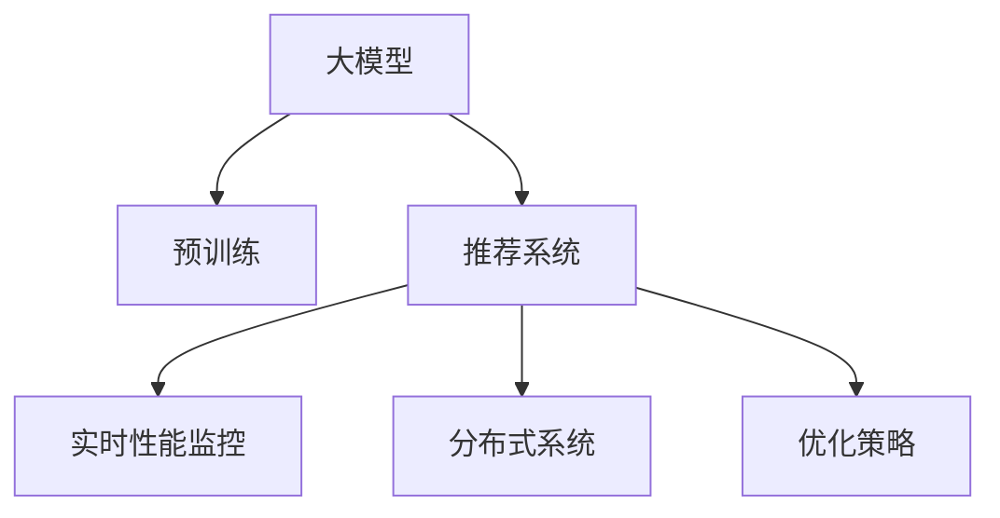

                 

# 搜索推荐系统的实时性能监控：大模型时代的新方法

> 关键词：搜索推荐系统,实时性能监控,大模型,分布式系统,优化策略

## 1. 背景介绍

### 1.1 问题由来

在现代社会，搜索引擎和推荐系统已成为人们获取信息和推荐内容的重要工具。传统的搜索引擎和推荐系统通常采用协同过滤、逻辑回归等模型，通过在大量用户行为数据上训练得到。然而，随着互联网用户数据量的爆炸式增长和深度学习技术的发展，大模型(如BERT, GPT-3等)在推荐系统中的应用越来越广泛。

大模型通过预训练获得丰富的语义信息，能够捕捉更复杂的用户行为模式，从而提供更精准的推荐。但大模型在实时性能监控上存在挑战，因为它们通常具有巨大的参数量和计算需求。如何在保证性能的同时，对大模型推荐系统进行实时监控和优化，成为了一个关键问题。

### 1.2 问题核心关键点

搜索推荐系统的实时性能监控需要考虑到以下几个关键点：

- **系统架构**：如何设计高效、可扩展的系统架构，以支持大模型的部署和运行。
- **实时性**：如何在毫秒级的时间内完成大模型的推理和结果返回。
- **可用性**：系统如何保证在高并发场景下的稳定性和可靠性。
- **效率**：如何优化模型推理和系统处理的效率，降低计算和存储开销。

本文章将通过系统阐述大模型推荐系统实时性能监控的核心概念、算法原理和具体步骤，展示实际应用中的优化策略，探讨未来的研究方向和挑战。

## 2. 核心概念与联系

### 2.1 核心概念概述

为了更好地理解大模型推荐系统的实时性能监控，本节将介绍几个密切相关的核心概念：

- **大模型**：如BERT, GPT等，通过在大量无标签文本数据上进行预训练，学习到丰富的语义信息。
- **推荐系统**：根据用户的历史行为和兴趣，向用户推荐可能感兴趣的内容。
- **实时性能监控**：在推荐系统中实时监控模型推理和系统处理的性能，以确保用户体验和系统稳定性。
- **分布式系统**：将大模型的推理和推荐任务分布到多台计算节点上，以提高系统的可扩展性和并发处理能力。
- **优化策略**：包括模型裁剪、混合精度训练、分布式缓存等，以提升系统的效率和性能。

这些核心概念之间的逻辑关系可以通过以下Mermaid流程图来展示：



这个流程图展示了大模型推荐系统实时性能监控的核心概念及其之间的关系：

1. 大模型通过预训练获得基础能力。
2. 推荐系统将大模型用于用户行为分析和内容推荐。
3. 实时性能监控实时监测推荐系统的性能。
4. 分布式系统实现大模型的并行计算和推荐任务的分布式处理。
5. 优化策略提高系统的效率和性能。

这些概念共同构成了大模型推荐系统实时性能监控的学习框架，使得系统能够在大模型推荐应用的实际场景中，提供高效、稳定的服务。

## 3. 核心算法原理 & 具体操作步骤

### 3.1 算法原理概述

大模型推荐系统的实时性能监控，本质上是一个多层次的优化问题。它涉及到大模型的推理效率、分布式系统的并行处理能力、以及实时监控的精度和可靠性。其核心思想是：通过设计高效的系统架构和优化策略，确保大模型的推理结果在实时场景中能够快速、准确地返回给用户。

具体而言，实时性能监控的过程可以分为以下几个步骤：

1. **系统架构设计**：构建可扩展、高并发的分布式系统，支持大模型的推理任务。
2. **模型优化**：通过模型裁剪、混合精度训练等策略，减小模型规模，提升推理速度。
3. **实时推理**：利用分布式系统对模型推理任务进行并行处理，实现低延迟的结果返回。
4. **性能监控**：实时监测系统的各项性能指标，如模型推理时间、系统响应时间等，确保系统稳定。

### 3.2 算法步骤详解

基于实时性能监控的大模型推荐系统，一般包括以下几个关键步骤：

**Step 1: 系统架构设计**

设计一个高可扩展、高并发的分布式系统是实时性能监控的第一步。常用的架构包括微服务架构、消息队列等，其中微服务架构将推荐系统拆分成多个独立的微服务模块，分别负责用户管理、推荐算法、实时监控等任务，提升系统的可扩展性和可靠性。

**Step 2: 模型优化**

优化模型以提升实时性能，主要有以下策略：

- **模型裁剪**：去除大模型中不必要的层和参数，减小模型规模，提高推理速度。
- **混合精度训练**：使用16位浮点数进行模型训练，减小模型参数存储需求，提升推理速度。
- **分布式缓存**：将模型中间结果缓存在分布式缓存中，减少模型推理的计算量。

**Step 3: 实时推理**

通过分布式系统对模型推理任务进行并行处理，实现低延迟的结果返回。常用的分布式系统包括Kubernetes、Apache Spark等，可以将推荐系统中的任务分布到多个计算节点上，以提高系统的处理能力和并发性能。

**Step 4: 性能监控**

实时监测系统的各项性能指标，如模型推理时间、系统响应时间等，确保系统稳定。常用的监控工具包括Prometheus、Grafana等，可以通过设置告警阈值，实时检测系统异常，及时进行干预。

### 3.3 算法优缺点

实时性能监控的大模型推荐系统具有以下优点：

1. **提升推荐精度**：通过优化模型和分布式系统，提升实时推荐系统的精度和准确度。
2. **提高系统稳定性**：通过性能监控和告警机制，确保系统在高并发场景下的稳定性和可靠性。
3. **降低计算成本**：通过模型裁剪和混合精度训练，减小模型规模和计算量，降低系统成本。

同时，该方法也存在一定的局限性：

1. **模型精度下降**：模型裁剪和混合精度训练可能会降低模型精度，需要平衡模型效率和精度之间的关系。
2. **系统复杂度增加**：分布式系统的设计和维护需要较高的技术门槛，增加了系统的复杂度。
3. **实时监控成本高**：性能监控和告警机制需要实时采集和处理系统数据，增加了系统的计算和存储成本。

尽管存在这些局限性，但就目前而言，实时性能监控仍然是大模型推荐系统的核心需求之一。未来相关研究的重点在于如何进一步降低实时监控的计算和存储开销，提高系统的效率和精度，同时兼顾模型的表现和系统的稳定性。

### 3.4 算法应用领域

实时性能监控的大模型推荐系统，在实际应用中已经得到了广泛的应用，覆盖了多个领域：

- **电商推荐**：通过实时推荐系统，提升用户的购物体验，增加销售转化率。
- **新闻推荐**：实时推荐新闻文章，提升用户的阅读体验和文章浏览量。
- **视频推荐**：实时推荐视频内容，提升用户的观看体验和视频观看量。
- **个性化广告**：实时推荐广告内容，提高广告的点击率和转化率。

除了这些经典应用外，实时性能监控技术还被创新性地应用到更多场景中，如智能客服、智能家居、智慧城市等，为不同领域带来了新的应用场景和价值提升。

## 4. 数学模型和公式 & 详细讲解 & 举例说明

### 4.1 数学模型构建

本节将使用数学语言对大模型推荐系统的实时性能监控过程进行更加严格的刻画。

记大模型为 $M_{\theta}$，其中 $\theta$ 为模型参数。假设推荐系统中的任务为 $T$，通过用户行为数据 $D$ 进行模型训练，得到推荐结果 $R_{T}(x)$。

定义模型 $M_{\theta}$ 在数据样本 $(x,y)$ 上的推理时间为 $t_{M_{\theta}}$，即 $t_{M_{\theta}} = \mathcal{T}(M_{\theta}(x))$，其中 $\mathcal{T}$ 为模型推理时间函数。

定义分布式系统 $S$ 的并行处理时间为 $t_{S}$，即 $t_{S} = \mathcal{T}_S(R_{T}(x))$，其中 $\mathcal{T}_S$ 为分布式系统推理时间函数。

定义系统的总推理时间为 $t_{total}$，即 $t_{total} = t_{M_{\theta}} + t_{S}$。

实时性能监控的目标是最大化系统的总推理时间 $t_{total}$，即：

$$
\mathop{\arg\min}_{\theta} \sum_{x \in D} \max(t_{M_{\theta}}, t_{S})
$$

### 4.2 公式推导过程

以下我们以电商推荐系统为例，推导实时性能监控的数学模型和优化目标。

假设电商推荐系统中有 $N$ 个推荐任务 $T_1, T_2, ..., T_N$，每个任务对应的推理时间为 $t_{M_{\theta}_i}$ 和 $t_{S_i}$。系统的总推理时间为：

$$
t_{total} = \sum_{i=1}^N (t_{M_{\theta}_i} + t_{S_i})
$$

优化目标为最小化系统总推理时间 $t_{total}$，即：

$$
\mathop{\arg\min}_{\theta} \sum_{i=1}^N (t_{M_{\theta}_i} + t_{S_i})
$$

为了实现这一目标，需要分别优化模型的推理时间和分布式系统的处理时间，从而得到：

$$
\mathop{\arg\min}_{\theta} \sum_{i=1}^N \min(t_{M_{\theta}_i}, t_{S_i})
$$

### 4.3 案例分析与讲解

电商推荐系统中，实时性能监控可以通过以下方式实现：

**Step 1: 系统架构设计**

将电商推荐系统拆分为用户管理、推荐算法、实时监控等微服务模块，提升系统的可扩展性和可靠性。

**Step 2: 模型优化**

- **模型裁剪**：去除大模型中不必要的层和参数，减小模型规模，提高推理速度。
- **混合精度训练**：使用16位浮点数进行模型训练，减小模型参数存储需求，提升推理速度。
- **分布式缓存**：将模型中间结果缓存在分布式缓存中，减少模型推理的计算量。

**Step 3: 实时推理**

利用分布式系统对推荐任务进行并行处理，实现低延迟的结果返回。常用的分布式系统包括Kubernetes、Apache Spark等。

**Step 4: 性能监控**

通过Prometheus和Grafana等工具，实时监测系统的各项性能指标，如模型推理时间、系统响应时间等，确保系统稳定。

## 5. 项目实践：代码实例和详细解释说明

### 5.1 开发环境搭建

在进行实时性能监控实践前，我们需要准备好开发环境。以下是使用Python进行微服务架构的开发环境配置流程：

1. 安装Docker：从官网下载并安装Docker，用于创建和管理容器化应用。

2. 安装Kubernetes：从官网下载并安装Kubernetes，用于管理分布式系统中的多个计算节点。

3. 安装Prometheus和Grafana：通过Docker下载并安装Prometheus和Grafana，用于性能监控和可视化。

4. 编写微服务代码：使用Python和Django等框架，编写用户管理、推荐算法、实时监控等微服务模块。

5. 部署微服务：使用Docker和Kubernetes将微服务打包成容器，部署到计算节点上。

完成上述步骤后，即可在Kubernetes集群中开始微服务架构的实时性能监控实践。

### 5.2 源代码详细实现

下面我们以电商推荐系统为例，给出使用Python和Django进行实时性能监控的代码实现。

首先，定义电商推荐系统的微服务模块：

```python
from flask import Flask, request, jsonify
from prometheus_client import Gauge

app = Flask(__name__)

@app.route('/recommend')
def recommend():
    user_id = request.args.get('user_id')
    item_id = request.args.get('item_id')
    
    # 从缓存中获取推荐结果
    recommendation = cache.get(user_id, item_id)
    
    if recommendation is None:
        # 调用推荐算法进行推理
        recommendation = recommendation_algorithm(user_id, item_id)
        
        # 将推荐结果缓存到分布式缓存中
        cache.set(user_id, item_id, recommendation, timeout=3600)
        
    return jsonify(recommendation)

@app.route('/monitor')
def monitor():
    # 获取推荐算法模块的推理时间
    monitoring_gauge.set()
    
    return jsonify({'total_time': total_time})

# 初始化Prometheus Gauge
monitoring_gauge = Gauge('monitoring', '推荐算法模块的推理时间')

# 初始化分布式缓存
cache = redis.StrictRedis(host='localhost', port=6379)
```

然后，编写推荐算法模块的代码：

```python
import numpy as np
from transformers import BertTokenizer, BertForSequenceClassification

tokenizer = BertTokenizer.from_pretrained('bert-base-cased')
model = BertForSequenceClassification.from_pretrained('bert-base-cased', num_labels=2)

def recommendation_algorithm(user_id, item_id):
    # 从缓存中获取用户行为数据
    user_behavior = cache.get(user_id)
    
    if user_behavior is None:
        # 从数据库中获取用户行为数据
        user_behavior = database.get_user_behavior(user_id)
        
        # 缓存用户行为数据
        cache.set(user_id, user_behavior, timeout=3600)
        
    # 预处理用户行为数据
    user_input = tokenizer(user_behavior, return_tensors='pt')
    
    # 进行模型推理
    outputs = model(**user_input)
    logits = outputs.logits
    probabilities = np.softmax(logits)
    
    # 选择推荐项
    selected_item = np.argmax(probabilities, axis=1)[0]
    
    return selected_item
```

最后，编写实时监控模块的代码：

```python
from prometheus_client import Counter

# 初始化Prometheus Counter
monitoring_counter = Counter('monitoring', '推荐算法模块的推理时间')

@app.route('/monitor')
def monitor():
    # 获取推荐算法模块的推理时间
    monitoring_counter.inc()
    
    # 返回总推理时间
    total_time = monitoring_gauge.get()
    
    return jsonify({'total_time': total_time})
```

以上代码实现了电商推荐系统的微服务架构，其中：

- **推荐算法模块**：利用BERT模型对用户行为数据进行推理，选择推荐项。
- **实时监控模块**：通过Prometheus Counter和Gauge，记录推荐算法模块的推理时间，并返回总推理时间。
- **缓存模块**：利用Redis缓存用户行为数据和推荐结果，提升系统效率。

### 5.3 代码解读与分析

让我们再详细解读一下关键代码的实现细节：

**微服务模块**：
- `@app.route('/recommend')`：定义推荐接口，接收用户ID和物品ID，返回推荐结果。
- `@app.route('/monitor')`：定义监控接口，记录推荐算法模块的推理时间，并返回总推理时间。

**推荐算法模块**：
- `BertTokenizer.from_pretrained('bert-base-cased')`：加载预训练的BERT模型和分词器。
- `BertForSequenceClassification.from_pretrained('bert-base-cased', num_labels=2)`：加载预训练的BERT模型，设置分类标签数量。
- `recommendation_algorithm(user_id, item_id)`：根据用户行为数据和物品ID，调用推荐算法模块进行推理，返回推荐结果。

**实时监控模块**：
- `prometheus_client.Gauge`：定义一个Prometheus Gauge，用于记录推荐算法模块的推理时间。
- `prometheus_client.Counter`：定义一个Prometheus Counter，用于记录推荐算法模块的推理次数。
- `monitoring_gauge.set()`：将当前推荐算法模块的推理时间记录到Gauge中。
- `monitoring_counter.inc()`：每进行一次推荐算法模块的推理，将推理次数记录到Counter中。

通过以上代码的实现，我们构建了一个完整的微服务架构，并通过Prometheus和Grafana等工具，实现了实时性能监控。开发者可以根据具体场景，进一步优化微服务模块的设计和性能监控的实现，以提升大模型推荐系统的实时性能。

## 6. 实际应用场景

### 6.1 电商推荐系统

电商推荐系统利用实时性能监控技术，可以显著提升用户的购物体验和购买转化率。实时推荐系统能够在用户浏览商品时，迅速提供个性化的推荐商品，提升用户满意度和购买率。

在实际应用中，电商推荐系统可以根据用户行为数据和历史交易记录，构建用户画像，并通过实时监控，动态调整推荐算法和模型参数，确保推荐结果的实时性和准确性。

### 6.2 新闻推荐系统

新闻推荐系统利用实时性能监控技术，可以提升用户的阅读体验和文章浏览量。实时推荐系统能够在用户访问新闻网站时，迅速提供个性化推荐文章，提升用户粘性和阅读量。

在实际应用中，新闻推荐系统可以根据用户的历史阅读行为和兴趣偏好，构建用户画像，并通过实时监控，动态调整推荐算法和模型参数，确保推荐结果的实时性和相关性。

### 6.3 视频推荐系统

视频推荐系统利用实时性能监控技术，可以提升用户的观看体验和视频观看量。实时推荐系统能够在用户观看视频时，迅速提供个性化推荐视频，提升用户满意度和观看量。

在实际应用中，视频推荐系统可以根据用户的历史观看行为和评分反馈，构建用户画像，并通过实时监控，动态调整推荐算法和模型参数，确保推荐结果的实时性和相关性。

### 6.4 未来应用展望

随着大模型推荐系统在各个领域的广泛应用，实时性能监控技术也将不断发展和演进，带来更多的应用场景和价值提升。

- **智能客服**：实时性能监控技术可以用于构建智能客服系统，提升客户咨询体验和问题解决效率。
- **智慧城市**：实时性能监控技术可以用于构建智慧城市管理系统，提升城市管理的自动化和智能化水平。
- **个性化广告**：实时性能监控技术可以用于个性化广告推荐，提升广告的点击率和转化率。
- **智能家居**：实时性能监控技术可以用于构建智能家居控制系统，提升用户的生活质量和便捷性。

未来，实时性能监控技术将在更多领域得到应用，为传统行业带来变革性影响。相信随着技术的不断进步，实时性能监控技术将成为大模型推荐系统的重要组成部分，推动人工智能技术的进一步发展。

## 7. 工具和资源推荐

### 7.1 学习资源推荐

为了帮助开发者系统掌握大模型推荐系统的实时性能监控的理论基础和实践技巧，这里推荐一些优质的学习资源：

1. **微服务架构：**《微服务架构：原理与实践》书籍，介绍了微服务架构的设计和实现，涵盖大模型推荐系统的系统架构设计。

2. **深度学习：**《深度学习》书籍，介绍了深度学习的基本概念和算法，涵盖模型裁剪、混合精度训练等模型优化技术。

3. **分布式系统：**《分布式系统：原理与设计》书籍，介绍了分布式系统的设计和实现，涵盖Kubernetes、Apache Spark等分布式系统的部署和优化。

4. **性能监控：**《Prometheus权威指南》书籍，介绍了Prometheus和Grafana等性能监控工具的使用，涵盖实时性能监控的实现和应用。

5. **微服务框架：**Flask、Django等Python微服务框架，提供了丰富的工具和库，方便微服务模块的开发和部署。

通过对这些资源的学习实践，相信你一定能够快速掌握大模型推荐系统的实时性能监控的精髓，并用于解决实际的推荐系统问题。

### 7.2 开发工具推荐

高效的开发离不开优秀的工具支持。以下是几款用于大模型推荐系统实时性能监控开发的常用工具：

1. **Docker**：用于创建和管理容器化应用，方便微服务模块的部署和扩展。

2. **Kubernetes**：用于管理分布式系统中的多个计算节点，提升系统的可扩展性和可靠性。

3. **Prometheus**：用于实时监测系统的各项性能指标，确保系统稳定。

4. **Grafana**：用于可视化系统的各项性能指标，帮助开发者快速定位和解决问题。

5. **Redis**：用于分布式缓存，提升系统的效率和性能。

6. **Flask**：用于构建微服务模块，方便模块的开发和部署。

合理利用这些工具，可以显著提升大模型推荐系统的开发效率，加快创新迭代的步伐。

### 7.3 相关论文推荐

大模型推荐系统实时性能监控的研究源于学界的持续研究。以下是几篇奠基性的相关论文，推荐阅读：

1. **分布式深度学习系统**：《Distributed Deep Learning: Challenges, Solutions, and Applications》论文，介绍了分布式深度学习系统的设计和实现，涵盖Kubernetes等分布式系统的部署和优化。

2. **实时性能监控技术**：《Real-Time Performance Monitoring: A Survey》论文，介绍了实时性能监控技术的研究进展和应用，涵盖Prometheus等监控工具的使用。

3. **微服务架构**：《Microservices: A Paradigm for Building Flexible and Scalable Web Applications》论文，介绍了微服务架构的设计和实现，涵盖Flask等微服务框架的使用。

4. **模型优化技术**：《Model Pruning: A Survey》论文，介绍了模型裁剪等模型优化技术的研究进展和应用。

5. **混合精度训练**：《Mixed-Precision Training of Deep Neural Networks》论文，介绍了混合精度训练技术的研究进展和应用。

这些论文代表了大模型推荐系统实时性能监控的研究进展，通过学习这些前沿成果，可以帮助研究者把握学科前进方向，激发更多的创新灵感。

## 8. 总结：未来发展趋势与挑战

### 8.1 总结

本文对大模型推荐系统的实时性能监控方法进行了全面系统的介绍。首先阐述了实时性能监控在大模型推荐系统中的应用背景和意义，明确了实时性能监控在提升系统效率和性能方面的重要作用。其次，从原理到实践，详细讲解了实时性能监控的数学原理和关键步骤，展示了微服务架构和分布式系统的设计和实现，以及模型优化和性能监控的策略。最后，本文还广泛探讨了实时性能监控技术在多个领域的应用前景，展示了其广阔的发展空间。

通过本文的系统梳理，可以看到，实时性能监控技术在大模型推荐系统中扮演了重要的角色，极大地提升了系统的性能和稳定性，为人工智能技术在推荐系统的应用打下了坚实的基础。未来，伴随技术的不断演进和应用场景的拓展，实时性能监控技术必将在更多领域得到应用，为人工智能技术的发展带来新的突破。

### 8.2 未来发展趋势

展望未来，实时性能监控技术将呈现以下几个发展趋势：

1. **系统架构优化**：未来的实时性能监控系统将进一步优化系统架构，支持更多的分布式计算和缓存技术，提升系统的可扩展性和效率。

2. **算法优化**：未来的实时性能监控算法将融合更多先进的优化策略，如因果推断、分布式缓存等，提高系统的推理速度和稳定性。

3. **多模态融合**：未来的实时性能监控系统将融合视觉、语音等多模态数据，实现更加全面、准确的用户行为建模。

4. **智能预测**：未来的实时性能监控系统将引入智能预测技术，预测系统负载和性能瓶颈，提前进行优化和调整。

5. **模型动态调整**：未来的实时性能监控系统将引入动态调整机制，根据系统负载和性能数据，动态调整模型参数和超参数，保持系统的高效运行。

6. **可视化分析**：未来的实时性能监控系统将引入可视化分析工具，提供更加直观的性能监控和问题排查手段，提升系统的可维护性。

以上趋势凸显了实时性能监控技术的广阔前景。这些方向的探索发展，必将进一步提升大模型推荐系统的性能和用户体验，为人工智能技术的落地应用提供有力支撑。

### 8.3 面临的挑战

尽管实时性能监控技术已经取得了显著进展，但在迈向更加智能化、普适化应用的过程中，它仍面临诸多挑战：

1. **系统复杂度增加**：分布式系统和微服务架构的引入，增加了系统的复杂度，需要更高的技术门槛和运维成本。

2. **实时监控成本高**：实时性能监控需要实时采集和处理系统数据，增加了系统的计算和存储成本。

3. **模型精度下降**：模型裁剪和混合精度训练可能会降低模型精度，需要平衡模型效率和精度之间的关系。

4. **系统稳定性不足**：高并发和分布式系统的设计，需要更高的稳定性和可靠性保证。

5. **可解释性不足**：实时性能监控系统的复杂性，使得模型的决策过程难以解释，难以进行调试和优化。

6. **安全性不足**：实时性能监控系统涉及大量的用户行为数据和推荐结果，需要更高的安全性和隐私保护。

正视实时性能监控面临的这些挑战，积极应对并寻求突破，将是大模型推荐系统走向成熟的必由之路。相信随着学界和产业界的共同努力，这些挑战终将一一被克服，实时性能监控技术必将在构建高效、可靠、安全的智能推荐系统方面发挥重要作用。

### 8.4 研究展望

未来的研究需要在以下几个方面寻求新的突破：

1. **多模态融合**：引入视觉、语音等多模态数据，实现更全面、准确的用户行为建模。

2. **智能预测**：引入智能预测技术，预测系统负载和性能瓶颈，提前进行优化和调整。

3. **动态调整**：引入动态调整机制，根据系统负载和性能数据，动态调整模型参数和超参数，保持系统的高效运行。

4. **可解释性增强**：引入可视化分析和可解释性技术，提高系统的可维护性和可解释性。

5. **安全性和隐私保护**：引入数据脱敏和隐私保护技术，确保用户行为数据和推荐结果的安全性。

这些研究方向的探索，必将引领实时性能监控技术迈向更高的台阶，为构建高效、可靠、安全的智能推荐系统铺平道路。面向未来，实时性能监控技术还需要与其他人工智能技术进行更深入的融合，如知识表示、因果推理、强化学习等，多路径协同发力，共同推动大模型推荐系统的发展。只有勇于创新、敢于突破，才能不断拓展大模型推荐系统的边界，让人工智能技术更好地造福人类社会。

## 9. 附录：常见问题与解答

**Q1: 如何优化大模型推荐系统的实时性能？**

A: 大模型推荐系统的实时性能优化需要从系统架构、模型设计、数据处理等多个方面入手。以下是一些优化策略：

1. **系统架构优化**：采用微服务架构和分布式系统，提升系统的可扩展性和并发处理能力。

2. **模型优化**：采用模型裁剪和混合精度训练等策略，减小模型规模和计算量，提高推理速度。

3. **数据处理优化**：使用分布式缓存和异步处理技术，提高数据处理效率，降低系统延迟。

4. **算法优化**：引入智能预测和动态调整机制，根据系统负载和性能数据，动态调整模型参数和超参数，保持系统的高效运行。

5. **可视化分析**：引入可视化分析工具，提供更加直观的性能监控和问题排查手段，提升系统的可维护性。

这些策略需要根据具体场景进行灵活组合，以实现大模型推荐系统的实时性能优化。

**Q2: 实时性能监控系统的核心组件有哪些？**

A: 实时性能监控系统的核心组件包括：

1. **微服务架构**：将推荐系统拆分成多个独立的微服务模块，分别负责用户管理、推荐算法、实时监控等任务。

2. **分布式系统**：将大模型的推理任务分布到多台计算节点上，提升系统的可扩展性和并发处理能力。

3. **分布式缓存**：使用Redis等分布式缓存技术，提高系统数据处理效率。

4. **性能监控工具**：使用Prometheus和Grafana等工具，实时监测系统的各项性能指标，确保系统稳定。

5. **智能预测和动态调整**：引入智能预测和动态调整机制，根据系统负载和性能数据，动态调整模型参数和超参数，保持系统的高效运行。

6. **可视化分析工具**：引入可视化分析工具，提供更加直观的性能监控和问题排查手段，提升系统的可维护性。

这些组件共同构成了实时性能监控系统的核心框架，确保大模型推荐系统的高效、可靠和可维护性。

**Q3: 大模型推荐系统实时性能监控的挑战有哪些？**

A: 大模型推荐系统实时性能监控面临以下挑战：

1. **系统复杂度增加**：分布式系统和微服务架构的引入，增加了系统的复杂度，需要更高的技术门槛和运维成本。

2. **实时监控成本高**：实时性能监控需要实时采集和处理系统数据，增加了系统的计算和存储成本。

3. **模型精度下降**：模型裁剪和混合精度训练可能会降低模型精度，需要平衡模型效率和精度之间的关系。

4. **系统稳定性不足**：高并发和分布式系统的设计，需要更高的稳定性和可靠性保证。

5. **可解释性不足**：实时性能监控系统的复杂性，使得模型的决策过程难以解释，难以进行调试和优化。

6. **安全性不足**：实时性能监控系统涉及大量的用户行为数据和推荐结果，需要更高的安全性和隐私保护。

正视这些挑战，积极应对并寻求突破，将是大模型推荐系统走向成熟的必由之路。

**Q4: 如何构建一个高效的实时性能监控系统？**

A: 构建一个高效的实时性能监控系统需要从多个方面入手，以下是一些关键步骤：

1. **系统架构设计**：采用微服务架构和分布式系统，提升系统的可扩展性和并发处理能力。

2. **性能监控工具选择**：使用Prometheus和Grafana等工具，实时监测系统的各项性能指标，确保系统稳定。

3. **模型优化**：采用模型裁剪和混合精度训练等策略，减小模型规模和计算量，提高推理速度。

4. **智能预测和动态调整**：引入智能预测和动态调整机制，根据系统负载和性能数据，动态调整模型参数和超参数，保持系统的高效运行。

5. **可视化分析工具**：引入可视化分析工具，提供更加直观的性能监控和问题排查手段，提升系统的可维护性。

6. **安全性和隐私保护**：引入数据脱敏和隐私保护技术，确保用户行为数据和推荐结果的安全性。

这些步骤需要根据具体场景进行灵活组合，以实现高效的实时性能监控系统。

通过以上步骤，我们能够构建一个高效、可靠、安全的实时性能监控系统，提升大模型推荐系统的性能和用户体验。

---

作者：禅与计算机程序设计艺术 / Zen and the Art of Computer Programming

