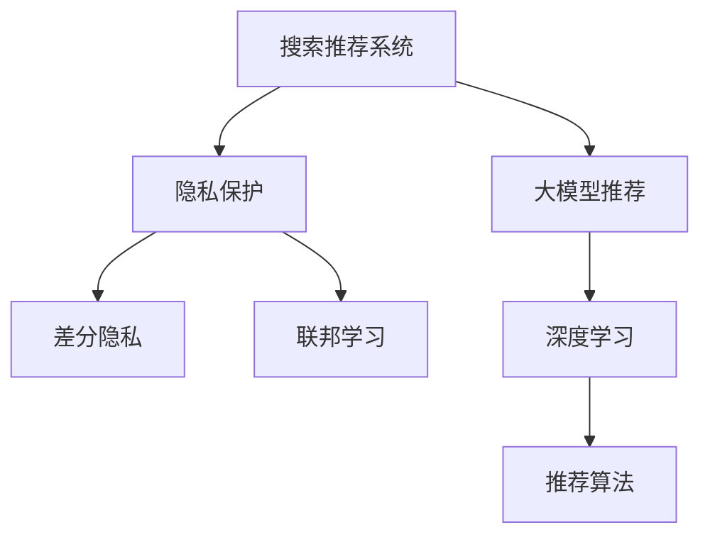

                 

# 搜索推荐系统的隐私保护：大模型新思路

> 关键词：搜索推荐系统, 隐私保护, 联邦学习, 差分隐私, 大模型, 深度学习

## 1. 背景介绍

随着互联网的蓬勃发展，搜索引擎和推荐系统已成为人们获取信息、商品和服务的重要途径。然而，这些系统在给用户带来便利的同时，也带来了隐私风险。传统的推荐算法依赖于用户的浏览和购买记录，但这些数据往往涉及个人隐私。如何在保护隐私的前提下，提升推荐系统的个性化推荐效果，成为当前亟待解决的问题。

近年来，基于深度学习的大模型推荐系统在推荐精度和用户体验方面取得了显著进展。大模型通过在海量数据上预训练，学习到丰富的语义信息，能够更好地理解用户需求和物品特性，从而提供更精准的推荐。但大模型推荐系统同样面临着隐私泄露的风险，用户的搜索历史、点击行为等数据可能被不当使用。如何在大模型推荐系统中实现隐私保护，同时提升推荐效果，成为数据科学家和工程师共同关注的焦点。

## 2. 核心概念与联系

### 2.1 核心概念概述

为更好地理解大模型推荐系统中的隐私保护技术，本节将介绍几个密切相关的核心概念：

- **搜索推荐系统**：包括搜索引擎和推荐系统，旨在根据用户的行为和需求，推荐最相关的信息或商品。传统的推荐系统依赖于用户的直接行为数据，而大模型推荐系统可以通过学习语义信息进行间接推理，提升推荐的普适性和隐私性。

- **隐私保护**：指在数据采集、存储、处理、传输等各个环节，采取技术和管理措施，保护用户数据不被不当使用和泄露。在大模型推荐系统中，隐私保护主要涉及用户数据的去标识化和差分隐私。

- **联邦学习**：指分布式数据场景下，本地模型在本地数据上训练，通过模型参数更新实现全局模型的协作学习，而不需将原始数据传输到中心服务器，从而保护数据隐私。

- **差分隐私**：指在数据查询或分析过程中，通过加入噪声或扰动，确保个体数据无法被单独识别出来，从而保护隐私。

- **大模型推荐系统**：指利用深度学习大模型对用户行为进行建模和推理，生成推荐结果的系统。大模型推荐系统可以更好地处理复杂语义和用户意图，但需注意隐私保护和性能优化。

- **深度学习**：一种基于神经网络的机器学习方法，通过多层次的特征提取和模型优化，实现高效的推荐预测。

这些核心概念之间的逻辑关系可以通过以下Mermaid流程图来展示：



这个流程图展示了大模型推荐系统中的核心概念及其之间的关系：

1. 大模型推荐系统通过深度学习模型提升推荐效果。
2. 隐私保护是大模型推荐系统的关键需求，涉及差分隐私和联邦学习等技术。
3. 差分隐私和联邦学习是大模型推荐系统中常用的隐私保护手段。
4. 深度学习是大模型推荐系统的核心技术。

这些概念共同构成了大模型推荐系统的工作原理和优化方向。通过理解这些核心概念，我们可以更好地把握大模型推荐系统的工作机制和隐私保护策略。

## 3. 核心算法原理 & 具体操作步骤

### 3.1 算法原理概述

基于大模型的推荐系统，其核心思想是利用深度学习模型对用户行为进行建模，生成推荐结果。在隐私保护方面，通过差分隐私和联邦学习等技术，保障用户数据的隐私性和安全性。

形式化地，假设推荐系统的大模型为 $M_{\theta}$，其中 $\theta$ 为模型参数。用户行为数据集为 $D=\{(x_i, y_i)\}_{i=1}^N$，其中 $x_i$ 为输入特征向量，$y_i$ 为推荐结果（如购买、点击等）。隐私保护的目标是设计损失函数 $\mathcal{L}_{\epsilon}$，使得模型输出的推荐结果 $y_i$ 对任何个体 $i$ 的隐私影响不超过 $\epsilon$（隐私预算）。

差分隐私和联邦学习通过在不同数据分布上设计损失函数，实现对模型参数的协同更新，同时保护数据隐私。差分隐私通过引入噪声或扰动，使任何个体数据的改变对模型输出的影响不超过 $\epsilon$。联邦学习则通过模型参数的迭代更新，在不共享数据的情况下，实现全局模型的优化。

### 3.2 算法步骤详解

基于差分隐私和联邦学习的推荐系统通常包括以下几个关键步骤：

**Step 1: 准备数据集和模型**

- 收集用户的浏览记录、点击行为等特征，作为模型输入 $x_i$。
- 对数据集 $D$ 进行划分，分为训练集 $D_{train}$ 和测试集 $D_{test}$。
- 选择合适的大模型 $M_{\theta}$ 作为初始化参数，如BERT、GPT等。

**Step 2: 设计差分隐私机制**

- 根据隐私预算 $\epsilon$，设计差分隐私机制，如Laplace噪声、高斯噪声等。
- 在每个用户的模型训练中，添加噪声或扰动项，确保隐私保护。

**Step 3: 设计联邦学习机制**

- 设计联邦学习算法，如 federated SGD、FedAvg 等，确保模型参数在本地更新。
- 在每个用户端，使用差分隐私机制更新本地模型参数，并通过联邦学习协议传输更新后的参数。

**Step 4: 执行全局模型训练**

- 在每个用户端，使用联邦学习算法对本地模型进行迭代优化。
- 通过联邦学习协议，将本地模型的参数更新传输到中央服务器，进行全局参数的更新。
- 在每个用户端，根据本地数据和全局模型参数，计算推荐结果 $y_i$。

**Step 5: 评估和部署**

- 在测试集 $D_{test}$ 上评估推荐结果的准确率和隐私性。
- 将训练好的模型部署到推荐系统中，进行实际应用。
- 持续收集用户反馈和行为数据，定期重新训练模型，以适应数据分布的变化。

以上是基于差分隐私和联邦学习的大模型推荐系统的一般流程。在实际应用中，还需要针对具体任务的特点，对算法进行优化设计，如改进差分隐私机制、优化联邦学习算法等，以进一步提升推荐系统的性能。

### 3.3 算法优缺点

基于差分隐私和联邦学习的大模型推荐系统，具有以下优点：

1. 保护隐私：通过差分隐私和联邦学习机制，能够有效保护用户数据隐私，防止数据泄露。
2. 提升推荐效果：大模型推荐系统能够充分利用深度学习模型的高精度和高泛化能力，提供更加个性化和准确的推荐结果。
3. 分布式训练：联邦学习能够实现分布式数据场景下的协同学习，降低计算成本和数据传输负担。
4. 可扩展性强：联邦学习支持大规模的分布式数据训练，适用于互联网公司的推荐系统。

同时，该方法也存在一些局限性：

1. 隐私预算限制：差分隐私机制需要设定隐私预算，限制了模型输出的准确性。
2. 联邦学习复杂度高：联邦学习算法设计复杂，需要考虑模型参数传输和本地计算等环节。
3. 数据异质性问题：不同用户的数据分布可能存在差异，影响全局模型的训练效果。
4. 通信成本高：联邦学习需要频繁的模型参数传输，带来较高的通信成本和延迟。
5. 硬件要求高：联邦学习需要高性能的计算资源和通信网络，对硬件配置提出了较高要求。

尽管存在这些局限性，但就目前而言，基于差分隐私和联邦学习的方法仍是大模型推荐系统中主要的隐私保护手段。未来相关研究的重点在于如何进一步降低通信成本，提高联邦学习算法的效率，同时在隐私保护和推荐效果之间取得新的平衡。

### 3.4 算法应用领域

基于大模型推荐系统的隐私保护方法，已经在多个实际应用场景中得到了广泛应用，例如：

- 电子商务推荐：根据用户的浏览和购买历史，为用户推荐商品。通过差分隐私机制，保障用户数据隐私。
- 新闻信息推荐：根据用户的阅读习惯和兴趣，为用户推荐新闻文章。联邦学习算法可在用户端协同训练，提高推荐精度。
- 社交媒体推荐：根据用户的点赞、评论等社交行为，为用户推荐相关内容。差分隐私机制保护用户隐私，联邦学习实现个性化推荐。
- 医疗健康推荐：根据用户的健康数据和历史行为，推荐个性化的健康建议。联邦学习算法可在本地医院协同训练，保护患者隐私。

除了上述这些经典应用外，大模型推荐系统还被创新性地应用于更多场景中，如教育推荐、旅游推荐、金融推荐等，为互联网公司和其他行业提供了全新的个性化解决方案。随着大模型推荐系统技术的不断进步，相信在更多领域将出现基于隐私保护的大模型推荐应用。

## 4. 数学模型和公式 & 详细讲解  

### 4.1 数学模型构建

本节将使用数学语言对基于差分隐私和联邦学习的大模型推荐系统进行更加严格的刻画。

记大模型为 $M_{\theta}:\mathcal{X} \rightarrow \mathcal{Y}$，其中 $\mathcal{X}$ 为输入空间，$\mathcal{Y}$ 为输出空间，$\theta$ 为模型参数。假设用户行为数据集为 $D=\{(x_i,y_i)\}_{i=1}^N$。

定义差分隐私机制为 $\mathcal{L}_{\epsilon}$，其形式为：

$$
\mathcal{L}_{\epsilon}(\theta) = \frac{1}{N}\sum_{i=1}^N \log \left[ e^{\epsilon} \left(1 + \frac{||y_i - M_{\theta}(x_i)||^2}{\epsilon^2} \right) \right]
$$

其中 $||y_i - M_{\theta}(x_i)||^2$ 为模型预测结果与实际标签之间的平方距离。$\epsilon$ 为隐私预算。

在联邦学习中，假设用户端有 $k$ 个本地模型 $M_i$，每个本地模型在本地数据集 $D_i$ 上进行训练，并上传更新后的模型参数。全局模型 $M_{\theta}$ 通过以下公式进行更新：

$$
\theta_{t+1} = \theta_t + \alpha \sum_{i=1}^k \frac{1}{n_i} \nabla_{\theta} \mathcal{L}_{i,\epsilon}(M_{\theta})
$$

其中 $n_i$ 为本地数据集的样本数，$\alpha$ 为学习率，$\nabla_{\theta} \mathcal{L}_{i,\epsilon}$ 为本地模型在本地数据集上的损失函数对模型参数的梯度。

### 4.2 公式推导过程

以下我们以二分类任务为例，推导差分隐私机制和联邦学习算法的详细步骤。

假设推荐系统的大模型为 $M_{\theta}$，用户行为数据集为 $D=\{(x_i,y_i)\}_{i=1}^N$。在差分隐私机制中，每个用户的模型训练目标为：

$$
\min_{\theta} \mathcal{L}_{\epsilon}(\theta) = \frac{1}{N}\sum_{i=1}^N [y_i \log M_{\theta}(x_i) + (1-y_i) \log (1-M_{\theta}(x_i))] + \frac{\epsilon}{2} \log (1+||M_{\theta}(x_i) - y_i||^2 / \epsilon^2)
$$

在联邦学习中，假设用户端有 $k$ 个本地模型 $M_i$，每个本地模型在本地数据集 $D_i$ 上进行训练，并上传更新后的模型参数。全局模型 $M_{\theta}$ 通过以下公式进行更新：

$$
\theta_{t+1} = \theta_t - \alpha \sum_{i=1}^k \frac{1}{n_i} \nabla_{\theta} \mathcal{L}_{i,\epsilon}(M_{\theta})
$$

其中 $n_i$ 为本地数据集的样本数，$\alpha$ 为学习率，$\nabla_{\theta} \mathcal{L}_{i,\epsilon}$ 为本地模型在本地数据集上的损失函数对模型参数的梯度。

通过上述步骤，全局模型 $M_{\theta}$ 在本地模型 $M_i$ 的协同训练下，不断更新参数，最终得到具有全局代表性的推荐结果。

## 5. 项目实践：代码实例和详细解释说明

### 5.1 开发环境搭建

在进行大模型推荐系统的隐私保护实践前，我们需要准备好开发环境。以下是使用Python进行TensorFlow开发的环境配置流程：

1. 安装Anaconda：从官网下载并安装Anaconda，用于创建独立的Python环境。

2. 创建并激活虚拟环境：
```bash
conda create -n tf-env python=3.8 
conda activate tf-env
```

3. 安装TensorFlow：根据CUDA版本，从官网获取对应的安装命令。例如：
```bash
pip install tensorflow
```

4. 安装各类工具包：
```bash
pip install numpy pandas scikit-learn matplotlib tqdm jupyter notebook ipython
```

完成上述步骤后，即可在`tf-env`环境中开始大模型推荐系统的隐私保护实践。

### 5.2 源代码详细实现

下面我们以基于差分隐私机制和联邦学习的大模型推荐系统为例，给出使用TensorFlow进行代码实现的完整流程。

首先，定义差分隐私机制：

```python
import tensorflow as tf
from tensorflow.keras.layers import Dense
from tensorflow.keras.optimizers import Adam
from tensorflow.keras.losses import BinaryCrossentropy

def difference_privacy_loss(y_true, y_pred, epsilon):
    delta = 1/N
    l1_norm = tf.norm(y_pred - y_true, axis=1)
    return -tf.reduce_mean(tf.log(1 + l1_norm**2 / (epsilon**2 * N))) + epsilon/2 * tf.reduce_mean(tf.log(1 + l1_norm**2 / (epsilon**2 * N)))
```

然后，定义全局模型和本地模型：

```python
class GlobalModel(tf.keras.Model):
    def __init__(self):
        super(GlobalModel, self).__init__()
        self.fc1 = Dense(64, activation='relu')
        self.fc2 = Dense(1, activation='sigmoid')
        
    def call(self, inputs):
        x = self.fc1(inputs)
        return self.fc2(x)

class LocalModel(tf.keras.Model):
    def __init__(self):
        super(LocalModel, self).__init__()
        self.fc1 = Dense(64, activation='relu')
        self.fc2 = Dense(1, activation='sigmoid')
        
    def call(self, inputs):
        x = self.fc1(inputs)
        return self.fc2(x)

global_model = GlobalModel()
local_models = [LocalModel() for _ in range(k)]
```

接着，定义联邦学习算法：

```python
def federated_learning(global_model, local_models, global_parameters, local_parameters, training_steps, batch_size):
    for step in range(training_steps):
        for i, local_model in enumerate(local_models):
            local_model.set_weights(local_parameters[i])
            local_model.compile(optimizer=Adam(learning_rate=0.01), loss='binary_crossentropy')
            local_model.fit(X_train[i], y_train[i], batch_size=batch_size, epochs=1, verbose=0)
            local_model.set_weights(local_model.get_weights())
            
        global_model.compile(optimizer=Adam(learning_rate=0.01), loss=difference_privacy_loss)
        global_model.fit(tf.concat(X_train, axis=0), y_train, batch_size=batch_size, epochs=1, verbose=0)
```

最后，启动联邦学习训练流程：

```python
X_train = [X_train[i] for i in range(k)]
y_train = [y_train[i] for i in range(k)]

federated_learning(global_model, local_models, global_model.get_weights(), [local_model.get_weights()[i] for i in range(k)], 100, 32)
```

以上就是使用TensorFlow对基于差分隐私和联邦学习的大模型推荐系统进行完整代码实现。可以看到，TensorFlow框架提供了丰富的模型和算法库，开发者可以快速实现隐私保护的大模型推荐系统。

### 5.3 代码解读与分析

让我们再详细解读一下关键代码的实现细节：

**difference_privacy_loss函数**：
- 定义了差分隐私机制的损失函数，包括模型预测结果和实际标签的平方距离，以及隐私预算 $\epsilon$。

**GlobalModel和LocalModel类**：
- 定义了全局模型和本地模型，包含两个全连接层。
- 全局模型使用联邦学习算法进行训练，本地模型独立训练后，更新全局模型的参数。

**federated_learning函数**：
- 定义了联邦学习算法的详细步骤，包括本地模型训练和全局模型更新。
- 在每个本地模型训练完成后，更新全局模型的参数，以协同学习全局模型。

**训练流程**：
- 将训练数据集 $D_{train}$ 分配到各个用户端，定义本地模型。
- 在每个用户端，定义全局模型和本地模型，并使用差分隐私机制训练本地模型。
- 在全局模型上执行联邦学习算法，更新全局模型参数。
- 通过联邦学习协议，将全局模型的参数更新传输到各个本地模型。
- 重复上述步骤，直至训练完成。

可以看到，TensorFlow框架提供了简洁高效的API，使得联邦学习和大模型推荐系统的实现变得相对容易。开发者可以将更多精力放在算法和模型的改进上，而不必过多关注底层细节。

当然，工业级的系统实现还需考虑更多因素，如联邦学习协议的优化、差分隐私机制的调参等，需要结合具体应用场景进行全面优化。但核心的算法思路基本与此类似。

## 6. 实际应用场景
### 6.1 电子商务推荐

基于大模型推荐系统的隐私保护方法，可以广泛应用于电子商务推荐场景。用户浏览历史和购买记录通常涉及隐私信息，但通过差分隐私和联邦学习，可以在保护隐私的前提下，为用户推荐个性化的商品。

在技术实现上，可以收集用户的浏览记录、点击行为等特征，作为模型输入。将模型在本地端训练，并通过联邦学习算法在用户端协同训练，得到更加精确的推荐结果。差分隐私机制确保用户数据在传输过程中的安全性，防止数据泄露。如此构建的电子商务推荐系统，能够提供更加个性化和安全的推荐服务。

### 6.2 新闻信息推荐

新闻信息推荐系统需要根据用户的阅读习惯和兴趣，推荐相关的新闻文章。传统的推荐系统依赖于用户的直接行为数据，但这些数据往往涉及隐私风险。通过差分隐私和联邦学习，可以在保护用户隐私的前提下，提升推荐系统的效果。

具体而言，可以收集用户的阅读历史、点赞记录等行为数据，作为模型输入。将模型在本地端训练，并通过联邦学习算法在用户端协同训练，得到更加精准的推荐结果。差分隐私机制确保用户数据在传输过程中的安全性，防止数据泄露。如此构建的新闻信息推荐系统，能够提供更加个性化和安全的推荐服务。

### 6.3 社交媒体推荐

社交媒体推荐系统需要根据用户的点赞、评论等社交行为，推荐相关的内容。传统的推荐系统依赖于用户的直接行为数据，但这些数据往往涉及隐私风险。通过差分隐私和联邦学习，可以在保护用户隐私的前提下，提升推荐系统的效果。

具体而言，可以收集用户的点赞、评论等社交数据，作为模型输入。将模型在本地端训练，并通过联邦学习算法在用户端协同训练，得到更加精准的推荐结果。差分隐私机制确保用户数据在传输过程中的安全性，防止数据泄露。如此构建的社交媒体推荐系统，能够提供更加个性化和安全的推荐服务。

### 6.4 医疗健康推荐

医疗健康推荐系统需要根据用户的健康数据和历史行为，推荐个性化的健康建议。传统的推荐系统依赖于用户的直接行为数据，但这些数据往往涉及隐私风险。通过差分隐私和联邦学习，可以在保护用户隐私的前提下，提升推荐系统的效果。

具体而言，可以收集用户的健康数据、治疗记录等行为数据，作为模型输入。将模型在本地端训练，并通过联邦学习算法在本地医院协同训练，得到更加精准的推荐结果。差分隐私机制确保用户数据在传输过程中的安全性，防止数据泄露。如此构建的医疗健康推荐系统，能够提供更加个性化和安全的健康建议。

## 7. 工具和资源推荐
### 7.1 学习资源推荐

为了帮助开发者系统掌握大模型推荐系统的隐私保护技术，这里推荐一些优质的学习资源：

1. 《联邦学习：理论与实践》系列博文：由联邦学习专家撰写，深入浅出地介绍了联邦学习的基本原理和应用场景。

2. 斯坦福大学《Machine Learning with Privacy in Mind》课程：斯坦福大学开设的隐私保护机器学习课程，有Lecture视频和配套作业，带你入门隐私保护的基本概念和前沿技术。

3. 《差分隐私：理论、算法与应用》书籍：详细介绍了差分隐私的理论基础和实际应用，包括隐私预算、差分隐私机制的设计等。

4. 谷歌《TensorFlow Privacy》文档：TensorFlow框架提供的隐私保护功能，包含丰富的隐私保护算法和样例代码，是实践隐私保护的重要工具。

5. IEEE Xplore：IEEE开源的论文库，包含大量隐私保护和联邦学习的经典论文，可供深度学习研究者参考学习。

通过对这些资源的学习实践，相信你一定能够快速掌握大模型推荐系统中的隐私保护技术，并应用于实际问题。

### 7.2 开发工具推荐

高效的开发离不开优秀的工具支持。以下是几款用于大模型推荐系统隐私保护开发的常用工具：

1. TensorFlow：由谷歌主导开发的开源深度学习框架，支持分布式训练和差分隐私机制，适用于大规模的联邦学习任务。

2. PyTorch：由Facebook主导的开源深度学习框架，支持动态图和分布式训练，适用于灵活的模型设计和联邦学习算法。

3. Apache Spark：由Apache基金会开发的分布式计算框架，支持大规模数据处理和联邦学习算法，适用于大数据场景下的联邦学习。

4. Weights & Biases：模型训练的实验跟踪工具，可以记录和可视化模型训练过程中的各项指标，方便对比和调优。与主流深度学习框架无缝集成。

5. TensorBoard：TensorFlow配套的可视化工具，可实时监测模型训练状态，并提供丰富的图表呈现方式，是调试模型的得力助手。

6. Kubernetes：开源的容器编排平台，支持大规模分布式应用的管理和调度，适用于联邦学习环境的部署和运维。

合理利用这些工具，可以显著提升大模型推荐系统隐私保护任务的开发效率，加快创新迭代的步伐。

### 7.3 相关论文推荐

大模型推荐系统中的隐私保护技术，已经在学界和工业界得到了广泛研究。以下是几篇奠基性的相关论文，推荐阅读：

1. Privacy-Preserving Deep Learning in the Cloud: A Tutorial （差分隐私）：介绍了差分隐私的基本概念和应用，并详细介绍了TensorFlow中的差分隐私机制。

2. Federated Learning for Recommender Systems （联邦学习）：提出了一种基于联邦学习的推荐系统，能够在保护用户隐私的前提下，实现协同训练和个性化推荐。

3. Model Privacy Protection: An Empirical Evaluation of Machine Learning Algorithms on Privacy Budgets （隐私预算）：通过对不同算法进行隐私预算评估，探讨了如何平衡隐私保护和模型效果。

4. Privacy-Preserving Online Learning for Recommender Systems （在线学习）：提出了一种在线学习的推荐系统，能够在保护用户隐私的同时，实现实时推荐。

5. Protecting Privacy in Machine Learning with Differential Privacy （差分隐私）：对差分隐私的理论基础和实际应用进行了详细介绍，包括隐私预算、差分隐私机制的设计等。

这些论文代表了大模型推荐系统中的隐私保护技术的进展，通过学习这些前沿成果，可以帮助研究者把握学科前进方向，激发更多的创新灵感。

## 8. 总结：未来发展趋势与挑战

### 8.1 总结

本文对基于差分隐私和联邦学习的大模型推荐系统进行了全面系统的介绍。首先阐述了大模型推荐系统的背景和重要性，明确了隐私保护在大模型推荐中的关键性。其次，从原理到实践，详细讲解了差分隐私和联邦学习的数学模型和算法流程，给出了完整的代码实现示例。同时，本文还广泛探讨了差分隐私和联邦学习在大模型推荐系统中的实际应用场景，展示了隐私保护技术的广泛应用。

通过本文的系统梳理，可以看到，差分隐私和联邦学习在大模型推荐系统中发挥了重要作用，为保护用户隐私、提升推荐效果提供了重要手段。未来，随着差分隐私和联邦学习技术的不断发展，基于大模型推荐系统的隐私保护将迎来更多创新和突破，为人工智能技术的普及和应用提供有力支持。

### 8.2 未来发展趋势

展望未来，差分隐私和联邦学习在推荐系统中的应用将呈现以下几个发展趋势：

1. 隐私预算动态调整：随着推荐系统不断更新，隐私预算也需动态调整，以适应新的数据分布和任务需求。如何设计自适应隐私预算算法，成为重要的研究方向。

2. 差分隐私机制优化：差分隐私机制设计复杂，未来的研究方向在于如何简化隐私预算的计算和参数优化，减少噪声引入的干扰，提高隐私保护的实用性。

3. 联邦学习算法改进：联邦学习算法设计复杂，未来的研究方向在于如何提高联邦学习算法的收敛速度和模型精度，减小通信成本和计算负担。

4. 差分隐私与联邦学习结合：差分隐私和联邦学习结合应用，可以有效提升数据隐私保护和推荐效果。未来的研究将更多关注两者的协同优化。

5. 分布式推荐系统设计：推荐系统需要处理海量用户数据，分布式计算和联邦学习成为重要技术支撑。未来的研究将更多关注分布式推荐系统的设计，实现高效、安全的推荐。

6. 联邦学习与区块链结合：区块链技术可以提供分布式存储和透明计算，与联邦学习结合，可以实现更加安全可靠的推荐系统。

以上趋势凸显了大模型推荐系统中的隐私保护技术的前景。这些方向的探索发展，必将进一步提升推荐系统的性能和应用范围，为人工智能技术的发展提供新的动力。

### 8.3 面临的挑战

尽管差分隐私和联邦学习在推荐系统中的应用取得了显著进展，但在实际落地过程中，仍面临着诸多挑战：

1. 通信成本高：联邦学习需要频繁的模型参数传输，带来较高的通信成本和延迟。如何优化通信协议，减小传输量，是未来重要的研究方向。

2. 模型性能下降：差分隐私机制通过引入噪声，可能会降低模型的性能。如何在隐私保护和模型效果之间取得平衡，是未来需要解决的问题。

3. 数据异质性问题：不同用户的数据分布可能存在差异，影响全局模型的训练效果。如何处理数据异质性，提高全局模型的泛化能力，是未来重要的研究方向。

4. 模型参数更新困难：联邦学习中，全局模型和本地模型的参数更新算法设计复杂，需考虑多轮迭代和同步策略。如何设计高效的参数更新算法，是未来重要的研究方向。

5. 硬件资源要求高：联邦学习需要高性能的计算资源和通信网络，对硬件配置提出了较高要求。如何设计低成本、高效的联邦学习算法，是未来重要的研究方向。

尽管存在这些挑战，但就目前而言，差分隐私和联邦学习仍是推荐系统中的重要隐私保护手段。未来相关研究的重点在于如何进一步降低通信成本，提高联邦学习算法的效率，同时在隐私保护和推荐效果之间取得新的平衡。

### 8.4 研究展望

面对差分隐私和联邦学习面临的挑战，未来的研究需要在以下几个方面寻求新的突破：

1. 差分隐私预算动态调整：随着推荐系统不断更新，隐私预算也需动态调整，以适应新的数据分布和任务需求。如何设计自适应隐私预算算法，成为重要的研究方向。

2. 联邦学习算法改进：联邦学习算法设计复杂，未来的研究方向在于如何提高联邦学习算法的收敛速度和模型精度，减小通信成本和计算负担。

3. 差分隐私与联邦学习结合：差分隐私和联邦学习结合应用，可以有效提升数据隐私保护和推荐效果。未来的研究将更多关注两者的协同优化。

4. 分布式推荐系统设计：推荐系统需要处理海量用户数据，分布式计算和联邦学习成为重要技术支撑。未来的研究将更多关注分布式推荐系统的设计，实现高效、安全的推荐。

5. 联邦学习与区块链结合：区块链技术可以提供分布式存储和透明计算，与联邦学习结合，可以实现更加安全可靠的推荐系统。

6. 联邦学习与智能合约结合：智能合约可以自动执行联邦学习协议，提高协议执行的自动化和安全性。

7. 差分隐私与知识图谱结合：知识图谱可以提供丰富的语义信息，与差分隐私结合，可以实现更加精准的隐私保护。

这些研究方向的探索，必将引领差分隐私和联邦学习技术迈向更高的台阶，为推荐系统的隐私保护和推荐效果提供新的突破点。面向未来，差分隐私和联邦学习技术还需要与其他人工智能技术进行更深入的融合，如因果推理、强化学习等，多路径协同发力，共同推动推荐系统的进步。只有勇于创新、敢于突破，才能不断拓展隐私保护和推荐系统的边界，让人工智能技术更好地造福人类社会。

## 9. 附录：常见问题与解答

**Q1：什么是差分隐私？**

A: 差分隐私是一种隐私保护技术，通过在数据查询或分析过程中加入噪声或扰动，确保个体数据无法被单独识别出来，从而保护隐私。差分隐私主要包含两个参数：隐私预算 $\epsilon$ 和敏感度 $\delta$。其中 $\epsilon$ 表示隐私预算，即单个数据点对查询结果的干扰程度。$\delta$ 表示错误概率，即在噪声干扰下，查询结果错误的概率。

**Q2：什么是联邦学习？**

A: 联邦学习是一种分布式机器学习技术，通过在本地数据上训练模型，通过模型参数更新实现全局模型的协作学习，而不需将原始数据传输到中心服务器，从而保护数据隐私。联邦学习包括几个关键步骤：本地模型训练、模型参数更新、全局模型优化等。

**Q3：如何平衡差分隐私和推荐效果？**

A: 差分隐私机制通过引入噪声或扰动，可能会降低模型的性能。如何在隐私保护和推荐效果之间取得平衡，是未来需要解决的问题。一种常见的做法是设计自适应的隐私预算算法，根据推荐系统不断更新的数据，动态调整隐私预算，以适应新的任务需求。此外，可以引入剪枝、特征选择等方法，减少噪声干扰，提高推荐效果。

**Q4：联邦学习中如何处理数据异质性？**

A: 联邦学习中，不同用户的数据分布可能存在差异，影响全局模型的训练效果。可以采用联邦平均算法(FedAvg)，通过权重调整，使各个本地模型对全局模型更新的贡献不同，减小数据异质性的影响。此外，可以引入领域自适应(federated learning with domain adaptation)技术，通过数据增强和模型迁移，提高全局模型的泛化能力。

**Q5：联邦学习中如何优化通信成本？**

A: 联邦学习需要频繁的模型参数传输，带来较高的通信成本和延迟。可以采用剪枝、量化、模型压缩等技术，减小模型参数的传输量。此外，可以设计更高效的联邦学习协议，如联邦学习混合通信模型(federated learning with hybrid communication)，减少通信次数和数据传输量。

这些回答解决了差分隐私和联邦学习中的一些常见问题，希望能帮助你在实践中更好地应用这些技术。

