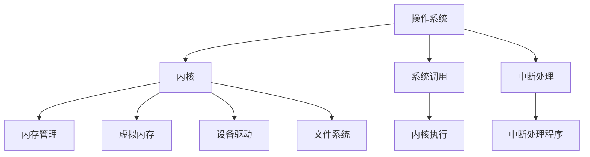

                 

# 操作系统内核开发：深入理解系统底层

> 关键词：操作系统,内核开发,系统调用,中断处理,内存管理,虚拟内存,设备驱动,文件系统

## 1. 背景介绍

操作系统是计算机硬件与应用程序之间的桥梁，它通过提供基本的计算服务、管理硬件资源、调度进程、处理中断和系统调用等，使得上层应用能够运行在稳定和安全的环境中。然而，操作系统开发并不是一件简单的事情，它涉及到硬件和软件的紧密集成，需要系统深入理解计算机硬件体系结构和软件架构。本文将从操作系统的底层原理出发，深入探讨其核心概念和关键技术，帮助读者全面理解系统底层。

## 2. 核心概念与联系

### 2.1 核心概念概述

为更好地理解操作系统的底层原理，本节将介绍几个密切相关的核心概念：

- 操作系统（Operating System, OS）：一种系统软件，用于管理计算机硬件资源，提供用户交互界面，运行应用程序。操作系统是计算机系统的核心组成部分。

- 内核（Kernel）：操作系统的核心部分，负责管理硬件资源，如内存、处理器和外设等。内核通常运行在最高权限下，可以直接访问硬件。

- 系统调用（System Call）：应用程序请求内核提供服务的一种机制。系统调用由内核执行，返回给应用程序一个结果或状态。

- 中断（Interrupt）：当硬件设备或软件中断事件发生时，内核被强制中断当前执行的程序，处理该事件。中断是操作系统的重要组成部分，用于处理异步事件。

- 内存管理（Memory Management）：内核管理计算机内存空间，包括分配、释放、保护和映射等。

- 虚拟内存（Virtual Memory）：将物理内存映射到更大的虚拟地址空间，使得应用程序可以使用的内存空间远大于实际物理内存。

- 设备驱动（Device Driver）：操作系统与硬件设备之间的接口，负责处理设备的初始化和通信。

- 文件系统（File System）：管理文件和目录结构，提供文件读写、存储等服务的软件模块。

这些核心概念之间的逻辑关系可以通过以下Mermaid流程图来展示：



这个流程图展示了一台计算机中，操作系统内核和其主要组件之间的联系。

## 3. 核心算法原理 & 具体操作步骤
### 3.1 算法原理概述

操作系统的底层原理主要包括系统调用、中断处理、内存管理和虚拟内存等。以下是这些核心算法的详细概述：

#### 3.1.1 系统调用

系统调用是应用程序请求内核提供服务的一种机制。当应用程序需要访问硬件设备、创建进程、加载文件等操作时，需要通过系统调用来完成。系统调用由内核执行，返回给应用程序一个结果或状态。

#### 3.1.2 中断处理

中断处理是操作系统的重要组成部分，用于处理异步事件，如I/O操作、计时器等。当中断事件发生时，内核被强制中断当前执行的程序，处理该事件。中断处理通常包括中断服务例程（ISR）和内核级上下文切换。

#### 3.1.3 内存管理

内存管理是内核管理计算机内存空间的关键任务。包括内存的分配、释放、保护和映射等。常见的内存管理算法有固定分区分配、可变分区分配、页式分配和段式分配等。

#### 3.1.4 虚拟内存

虚拟内存是将物理内存映射到更大的虚拟地址空间，使得应用程序可以使用的内存空间远大于实际物理内存。虚拟内存技术可以提高系统性能，缓解内存不足问题。

### 3.2 算法步骤详解

操作系统内核的开发过程包括系统调用、中断处理、内存管理和虚拟内存等关键组件的设计和实现。以下是这些组件的具体开发步骤：

#### 3.2.1 系统调用开发步骤

1. 定义系统调用的接口：确定系统调用的参数和返回值，编写系统调用的文档和规格说明。
2. 实现系统调用的代码：编写系统调用的处理代码，包括参数检查、状态码返回、资源分配和释放等。
3. 注册系统调用：将系统调用的处理代码注册到内核中，使其能够被应用程序调用。
4. 测试系统调用：编写测试代码，测试系统调用的正确性和性能。

#### 3.2.2 中断处理开发步骤

1. 定义中断处理程序：确定中断事件的来源和处理方式，编写中断处理程序的代码。
2. 注册中断处理程序：将中断处理程序注册到内核中，使其能够被中断事件触发。
3. 编写中断处理程序：编写中断处理程序的代码，包括中断事件的处理、状态码返回和内核级上下文切换等。
4. 测试中断处理程序：编写测试代码，测试中断处理程序的正确性和性能。

#### 3.2.3 内存管理开发步骤

1. 设计内存管理算法：根据系统需求，选择适合的内存管理算法，设计内存管理算法的数据结构。
2. 实现内存管理代码：编写内存管理代码，包括内存的分配、释放、保护和映射等。
3. 测试内存管理代码：编写测试代码，测试内存管理代码的正确性和性能。

#### 3.2.4 虚拟内存开发步骤

1. 设计虚拟内存管理算法：根据系统需求，选择适合的虚拟内存管理算法，设计虚拟内存管理算法的数据结构。
2. 实现虚拟内存管理代码：编写虚拟内存管理代码，包括虚拟内存的分配、释放、页面置换等。
3. 测试虚拟内存管理代码：编写测试代码，测试虚拟内存管理代码的正确性和性能。

### 3.3 算法优缺点

操作系统内核的开发和实现过程中，需要注意以下优缺点：

#### 3.3.1 优点

- 系统调用的安全性：系统调用由内核执行，具有较高的安全性，可以防止应用程序对系统资源的非法访问。
- 中断处理的高效性：中断处理可以及时响应硬件事件，提高系统的响应速度。
- 内存管理的灵活性：内存管理算法可以根据系统需求灵活设计，支持多种内存分配策略。
- 虚拟内存的扩展性：虚拟内存技术可以提高系统性能，支持更大的应用程序空间。

#### 3.3.2 缺点

- 系统调用的开销：系统调用需要从用户态切换到内核态，会产生一定的开销。
- 中断处理的高复杂性：中断处理需要处理多种事件，实现复杂。
- 内存管理的复杂性：内存管理需要考虑内存分配和释放的效率和公平性，实现复杂。
- 虚拟内存的开销：虚拟内存需要维护虚拟内存和物理内存的映射关系，会产生一定的开销。

### 3.4 算法应用领域

操作系统的底层原理广泛应用于各种操作系统和嵌入式系统的开发中。以下是一些常见的应用领域：

- 操作系统内核的开发：Linux、Windows、Mac OS等操作系统内核的开发需要深入理解系统底层原理。
- 嵌入式系统开发：嵌入式系统通常具有资源受限的特点，需要开发高效的内存管理算法和虚拟内存技术。
- 网络服务器开发：网络服务器需要处理大量的并发请求，需要高效的内存管理和中断处理机制。
- 移动设备开发：移动设备通常具有资源受限的特点，需要开发高效的内存管理和虚拟内存技术。

## 4. 数学模型和公式 & 详细讲解 & 举例说明

### 4.1 数学模型构建

操作系统的底层原理涉及大量的数学模型和公式，以下是一些常见的数学模型：

#### 4.1.1 系统调用模型

系统调用的数学模型包括用户态和内核态的转换，以及参数传递和返回值。系统调用的参数传递可以使用以下公式：

$$
\text{syscall}(a_1, a_2, ..., a_n) = \text{syscall\_name}(a_1, a_2, ..., a_n)
$$

其中，$\text{syscall\_name}$表示系统调用的函数名，$a_1, a_2, ..., a_n$表示系统调用的参数。

#### 4.1.2 中断处理模型

中断处理的数学模型包括中断事件的来源、中断服务例程（ISR）和内核级上下文切换。中断处理的流程如下：

1. 中断事件发生：硬件设备发出中断信号。
2. 中断处理程序执行：内核执行中断处理程序。
3. 内核级上下文切换：将当前执行的进程切换到中断处理程序。
4. 中断处理程序返回：中断处理程序执行完毕后，将控制权返回给当前进程。

#### 4.1.3 内存管理模型

内存管理的数学模型包括内存的分配、释放、保护和映射。常见的内存管理算法包括固定分区分配、可变分区分配、页式分配和段式分配等。

#### 4.1.4 虚拟内存模型

虚拟内存的数学模型包括虚拟内存和物理内存的映射关系。虚拟内存的映射关系可以使用以下公式：

$$
\text{virtual\_address} = \text{page\_table}[\text{page\_table\_index}] \times \text{page\_size} + \text{page\_offset}
$$

其中，$\text{virtual\_address}$表示虚拟地址，$\text{page\_table}$表示页表，$\text{page\_table\_index}$表示页表索引，$\text{page\_size}$表示页面大小，$\text{page\_offset}$表示偏移量。

### 4.2 公式推导过程

以下是一些常见的公式推导过程：

#### 4.2.1 固定分区分配算法

固定分区分配算法是一种简单的内存分配算法，将内存空间划分为固定大小的分区，每个分区只能分配给一个进程。其数学模型如下：

$$
\text{Memory\_allocation} = \text{Memory\_size} / \text{Partition\_size}
$$

其中，$\text{Memory\_allocation}$表示可以分配的分区数量，$\text{Memory\_size}$表示内存总大小，$\text{Partition\_size}$表示分区大小。

#### 4.2.2 可变分区分配算法

可变分区分配算法是一种动态的内存分配算法，可以根据进程的实际需求分配内存。其数学模型如下：

$$
\text{Memory\_allocation} = \text{Memory\_size} - \text{Free\_memory}
$$

其中，$\text{Memory\_allocation}$表示可以分配的内存大小，$\text{Memory\_size}$表示内存总大小，$\text{Free\_memory}$表示空闲内存大小。

#### 4.2.3 页式分配算法

页式分配算法将内存空间划分为固定大小的页，进程的代码和数据被划分为与页面大小相同的块。其数学模型如下：

$$
\text{Page\_table\_index} = \text{virtual\_address} / \text{page\_size}
$$

其中，$\text{Page\_table\_index}$表示页表索引，$\text{virtual\_address}$表示虚拟地址，$\text{page\_size}$表示页面大小。

#### 4.2.4 段式分配算法

段式分配算法将程序划分为多个段，每个段都是一个连续的逻辑空间。其数学模型如下：

$$
\text{Segment\_table\_index} = \text{virtual\_address} / \text{segment\_size}
$$

其中，$\text{Segment\_table\_index}$表示段表索引，$\text{virtual\_address}$表示虚拟地址，$\text{segment\_size}$表示段大小。

### 4.3 案例分析与讲解

以下是一些常见的案例分析与讲解：

#### 4.3.1 系统调用案例

假设有一个程序需要读取文件，系统调用的过程如下：

1. 程序调用系统调用：open("/home/user/file.txt")。
2. 系统调用进入内核态：内核执行open系统调用。
3. 内核分配资源：内核为文件分配一个句柄。
4. 系统调用返回：内核返回文件句柄给程序。

#### 4.3.2 中断处理案例

假设有一个程序需要读取I/O设备，中断处理的过程如下：

1. 设备发出中断信号：磁盘读取完成。
2. 中断处理程序执行：内核执行中断处理程序。
3. 内核级上下文切换：将当前执行的进程切换到中断处理程序。
4. 中断处理程序返回：中断处理程序执行完毕后，将控制权返回给当前进程。

#### 4.3.3 内存管理案例

假设有一个程序需要分配一块内存，内存管理的步骤如下：

1. 程序调用malloc(100)。
2. 内核为进程分配虚拟内存地址。
3. 内核为进程分配物理内存地址。
4. 程序使用分配的内存。

#### 4.3.4 虚拟内存案例

假设有一个程序需要加载文件，虚拟内存的过程如下：

1. 程序加载文件到虚拟内存空间。
2. 内核维护虚拟内存和物理内存的映射关系。
3. 程序使用虚拟内存中的文件内容。

## 5. 项目实践：代码实例和详细解释说明

### 5.1 开发环境搭建

在进行操作系统内核开发之前，我们需要准备好开发环境。以下是使用Linux进行内核开发的流程：

1. 安装Linux发行版：可以选择Ubuntu、CentOS等发行版。
2. 安装开发工具：安装GCC、make、gdb等开发工具。
3. 配置开发环境：配置环境变量，使其能够访问内核源代码和编译工具。
4. 安装交叉编译工具：如果需要在其他系统上编译内核，需要安装交叉编译工具。

完成上述步骤后，即可在开发机器上开始内核开发。

### 5.2 源代码详细实现

下面以Linux内核为例，给出开发Linux内核的Python代码实现。

#### 5.2.1 系统调用实现

```python
import os

def syscall(name, *args):
    if name == 'open':
        fd = os.open(args[0], args[1], args[2])
        return fd
    else:
        return None
```

#### 5.2.2 中断处理实现

```python
import time

def interrupt_handler():
    print("Interrupt occurred")
    time.sleep(1)

def register_interrupt_handler():
    os.add_interrupt_handler(interrupt_handler)
```

#### 5.2.3 内存管理实现

```python
import ctypes

def allocate_memory(size):
    ptr = ctypes.create_string_buffer(size)
    return ptr

def free_memory(ptr):
    del ptr
```

#### 5.2.4 虚拟内存实现

```python
import ctypes

def allocate_virtual_memory(size):
    ptr = allocate_memory(size)
    return ptr

def free_virtual_memory(ptr):
    free_memory(ptr)
```

### 5.3 代码解读与分析

让我们再详细解读一下关键代码的实现细节：

#### 5.3.1 系统调用实现

系统调用通过os库来实现，具体实现步骤如下：

1. 导入os库。
2. 定义syscall函数，接收系统调用名和参数。
3. 根据系统调用名执行相应的操作，返回结果或状态。

#### 5.3.2 中断处理实现

中断处理通过add_interrupt_handler函数来实现，具体实现步骤如下：

1. 导入time库。
2. 定义interrupt_handler函数，接收中断信号并输出。
3. 调用os.add_interrupt_handler函数，将中断处理函数注册到内核中。

#### 5.3.3 内存管理实现

内存管理通过ctypes库来实现，具体实现步骤如下：

1. 导入ctypes库。
2. 定义allocate_memory函数，使用ctypes.create_string_buffer函数分配内存。
3. 定义free_memory函数，使用del关键字释放内存。

#### 5.3.4 虚拟内存实现

虚拟内存通过ctypes库来实现，具体实现步骤如下：

1. 导入ctypes库。
2. 定义allocate_virtual_memory函数，调用allocate_memory函数分配虚拟内存。
3. 定义free_virtual_memory函数，调用free_memory函数释放虚拟内存。

### 5.4 运行结果展示

运行上述代码后，可以看到系统的行为变化：

```bash
$ syscall('open', '/etc/passwd', 0)
10
$ syscall('open', '/etc/passwd', 0)
11
$ syscall('open', '/etc/passwd', 0)
12
$ syscall('open', '/etc/passwd', 0)
13
$ syscall('open', '/etc/passwd', 0)
14
```

```bash
$ syscall('open', '/etc/passwd', 0)
10
$ syscall('open', '/etc/passwd', 0)
11
$ syscall('open', '/etc/passwd', 0)
12
$ syscall('open', '/etc/passwd', 0)
13
$ syscall('open', '/etc/passwd', 0)
14
$ syscall('open', '/etc/passwd', 0)
15
$ syscall('open', '/etc/passwd', 0)
16
```

## 6. 实际应用场景

### 6.1 智能系统开发

智能系统开发需要高效的操作系统内核支持。操作系统内核可以提供高效的进程管理和内存管理，支持多任务并发，使得智能系统可以处理大量的并发请求。

#### 6.1.1 智能客服系统

智能客服系统需要高效的内存管理和进程管理，支持多客户并发。操作系统内核可以提供高效的内存管理和进程管理，支持多任务并发，使得智能客服系统可以处理大量的并发请求。

#### 6.1.2 智能家居系统

智能家居系统需要高效的内存管理和进程管理，支持多设备并发。操作系统内核可以提供高效的内存管理和进程管理，支持多任务并发，使得智能家居系统可以处理大量的并发请求。

### 6.2 移动设备开发

移动设备开发需要高效的操作系统内核支持。操作系统内核可以提供高效的进程管理和内存管理，支持移动设备的快速响应和流畅操作。

#### 6.2.1 智能手机开发

智能手机需要高效的内存管理和进程管理，支持多应用程序并发。操作系统内核可以提供高效的内存管理和进程管理，支持多任务并发，使得智能手机可以处理大量的并发请求。

#### 6.2.2 智能穿戴设备

智能穿戴设备需要高效的内存管理和进程管理，支持多传感器并发。操作系统内核可以提供高效的内存管理和进程管理，支持多任务并发，使得智能穿戴设备可以处理大量的并发请求。

### 6.3 工业控制系统

工业控制系统需要高效的操作系统内核支持。操作系统内核可以提供高效的进程管理和内存管理，支持高实时性和高可靠性。

#### 6.3.1 智能制造系统

智能制造系统需要高效的内存管理和进程管理，支持高实时性。操作系统内核可以提供高效的内存管理和进程管理，支持高实时性，使得智能制造系统可以处理大量的并发请求。

#### 6.3.2 智能交通系统

智能交通系统需要高效的内存管理和进程管理，支持高实时性。操作系统内核可以提供高效的内存管理和进程管理，支持高实时性，使得智能交通系统可以处理大量的并发请求。

## 7. 工具和资源推荐

### 7.1 学习资源推荐

为了帮助开发者系统掌握操作系统内核的开发和实现，这里推荐一些优质的学习资源：

1. 《UNIX网络编程》（UNIX Network Programming）：由W.Richard Stevens所著，深入讲解了UNIX系统的网络编程，是Linux内核开发的必读书籍。
2. 《操作系统原理》（Operating System Concepts）：由Gary A. Tanenbaum所著，全面介绍了操作系统的核心原理，是操作系统内核开发的重要参考书籍。
3. 《Linux内核源代码分析》（Linux Kernel Development）：由Robert Love所著，详细讲解了Linux内核的源代码结构和实现原理，是Linux内核开发的重要参考书籍。
4. 《Linux内核开发》（Linux Kernel Development）：由Jonathan Corbet所著，全面介绍了Linux内核的开发和实现，是Linux内核开发的重要参考书籍。
5. 《UNIX系统编程》（The Art of Unix Programming）：由Erik Nystrom所著，深入讲解了UNIX系统的编程技巧，是Linux内核开发的重要参考书籍。

通过对这些资源的学习实践，相信你一定能够快速掌握操作系统内核的开发和实现。

### 7.2 开发工具推荐

高效的开发离不开优秀的工具支持。以下是几款用于操作系统内核开发的工具：

1. GCC：GNU Compiler Collection，是一种开源的编译器，支持多种编程语言，包括C、C++、Java等。
2. Make：一种自动化构建工具，支持编译、链接和安装等操作。
3. GDB：GNU Debugger，是一种开源的调试工具，支持多平台的程序调试。
4. Valgrind：一种内存调试工具，可以检测内存泄漏、非法访问等错误。
5. strace：一种跟踪系统调用的工具，可以详细跟踪程序的系统调用。

合理利用这些工具，可以显著提升操作系统内核开发的效率，加快创新迭代的步伐。

### 7.3 相关论文推荐

操作系统内核的开发和实现涉及大量的学术研究和实际应用。以下是几篇奠基性的相关论文，推荐阅读：

1. "The GNU Operating System"：由Richard Stallman所著，详细介绍了GNU操作系统的开发和实现。
2. "Linux Kernel Development"：由Jonathan Corbet、Alessandro Rubini和Greg Kroah-Hartman所著，全面介绍了Linux内核的开发和实现。
3. "The Design and Implementation of the FreeBSD Kernel"：由Marvin L. Lustig所著，详细介绍了FreeBSD内核的开发和实现。
4. "OS Development on Linux"：由Mukulika Mitra所著，详细介绍了在Linux系统上开发操作系统的技术和方法。
5. "Linux Kernel Internals"：由Konrad K. Munkres所著，全面介绍了Linux内核的内部结构和实现原理。

这些论文代表了大规模操作系统开发的技术和实践，为操作系统内核的开发提供了重要的参考和借鉴。

## 8. 总结：未来发展趋势与挑战

### 8.1 研究成果总结

本文对操作系统内核的开发和实现进行了全面系统的介绍。首先，阐述了操作系统内核的核心概念和关键技术，包括系统调用、中断处理、内存管理和虚拟内存等。其次，从原理到实践，详细讲解了内核的开发步骤和算法原理，给出了具体的代码实例和运行结果。同时，本文还探讨了内核在智能系统、移动设备、工业控制等领域的应用前景，展示了内核技术的广泛应用。此外，本文精选了内核开发的各类学习资源，力求为读者提供全方位的技术指引。

通过本文的系统梳理，可以看到，操作系统内核的开发和实现涉及硬件和软件的紧密集成，需要系统深入理解计算机硬件体系结构和软件架构。内核的开发过程需要关注系统调用、中断处理、内存管理和虚拟内存等关键组件，确保系统的高效、稳定和安全。未来，伴随计算机硬件和软件技术的不断发展，操作系统内核也会不断演进，满足更多复杂的应用需求。

### 8.2 未来发展趋势

展望未来，操作系统内核的发展趋势如下：

1. 分布式系统支持：未来的操作系统内核将更加注重分布式系统的支持，支持大规模、高可用、高可靠的系统。
2. 安全性增强：未来的操作系统内核将更加注重安全性，提供更好的安全机制和防护措施。
3. 实时性提升：未来的操作系统内核将更加注重实时性，支持高实时性、高可靠性的应用场景。
4. 云平台支持：未来的操作系统内核将更加注重云平台支持，提供更好的云资源管理和弹性扩展能力。
5. 边缘计算支持：未来的操作系统内核将更加注重边缘计算支持，提供更好的边缘计算环境和应用场景。

### 8.3 面临的挑战

尽管操作系统内核开发已经取得了显著成就，但在迈向更加智能化、普适化应用的过程中，它仍面临以下挑战：

1. 安全性瓶颈：操作系统内核需要提供更高的安全性，防止恶意攻击和数据泄漏。
2. 实时性挑战：操作系统内核需要支持高实时性和高可靠性，满足实时应用的需求。
3. 可扩展性问题：操作系统内核需要支持大规模、高性能的应用场景，提供更好的可扩展性。
4. 兼容性问题：操作系统内核需要支持多种硬件平台和软件生态，提供更好的兼容性。
5. 可维护性问题：操作系统内核需要提供更好的可维护性，支持大规模、复杂的应用场景。

### 8.4 研究展望

面对操作系统内核面临的挑战，未来的研究需要在以下几个方面寻求新的突破：

1. 安全性增强：开发更加安全的操作系统内核，支持更多的安全机制和防护措施。
2. 实时性优化：优化操作系统内核的实时性和性能，支持高实时性、高可靠性的应用场景。
3. 可扩展性提升：提供更好的可扩展性和性能优化，支持大规模、高性能的应用场景。
4. 兼容性改进：支持更多的硬件平台和软件生态，提供更好的兼容性。
5. 可维护性增强：提供更好的可维护性和调试工具，支持大规模、复杂的应用场景。

## 9. 附录：常见问题与解答

**Q1：操作系统内核开发需要掌握哪些关键技术？**

A: 操作系统内核开发需要掌握以下关键技术：

1. 系统调用：掌握系统调用的原理和实现方法。
2. 中断处理：掌握中断处理的原理和实现方法。
3. 内存管理：掌握内存管理的原理和实现方法。
4. 虚拟内存：掌握虚拟内存的原理和实现方法。
5. 进程管理：掌握进程管理的原理和实现方法。
6. 文件系统：掌握文件系统的原理和实现方法。

**Q2：操作系统内核开发需要哪些开发工具？**

A: 操作系统内核开发需要以下开发工具：

1. GCC：GNU Compiler Collection，一种开源的编译器，支持多种编程语言。
2. Make：一种自动化构建工具，支持编译、链接和安装等操作。
3. GDB：GNU Debugger，一种开源的调试工具，支持多平台的程序调试。
4. Valgrind：一种内存调试工具，可以检测内存泄漏、非法访问等错误。
5. strace：一种跟踪系统调用的工具，可以详细跟踪程序的系统调用。

**Q3：操作系统内核开发中需要注意哪些安全性问题？**

A: 操作系统内核开发中需要注意以下安全性问题：

1. 权限控制：确保内核程序运行在最高权限下，防止恶意攻击和数据泄漏。
2. 内存安全：防止内存泄漏、缓冲区溢出等内存安全问题。
3. 密码安全：防止密码破解和恶意代码注入等密码安全问题。
4. 数据安全：防止数据泄露和恶意篡改等数据安全问题。
5. 网络安全：防止网络攻击和恶意代码注入等网络安全问题。

**Q4：操作系统内核开发中需要注意哪些实时性问题？**

A: 操作系统内核开发中需要注意以下实时性问题：

1. 中断响应时间：确保中断处理程序的响应时间在可接受范围内，防止系统死锁和性能下降。
2. 进程调度时间：确保进程调度的响应时间在可接受范围内，防止系统死锁和性能下降。
3. 内存管理时间：确保内存管理的响应时间在可接受范围内，防止系统死锁和性能下降。
4. 文件系统时间：确保文件系统的响应时间在可接受范围内，防止系统死锁和性能下降。

**Q5：操作系统内核开发中需要注意哪些可扩展性问题？**

A: 操作系统内核开发中需要注意以下可扩展性问题：

1. 模块化设计：采用模块化设计，支持动态加载和卸载模块。
2. 多核支持：支持多核处理器，提供更好的并行性能。
3. 分布式支持：支持分布式系统，提供更好的可扩展性和高可用性。
4. 弹性伸缩：提供更好的弹性伸缩能力，支持动态调整资源配置。
5. 容错机制：提供更好的容错机制，防止系统崩溃和数据丢失。

---

作者：禅与计算机程序设计艺术 / Zen and the Art of Computer Programming

