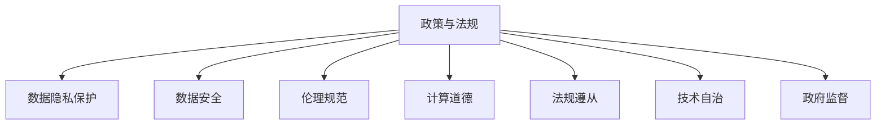

                 

# 政策与监管：引导人类计算的健康发展

> 关键词：政策制定, 数据隐私保护, 数据安全, 伦理规范, 计算道德, 法规遵从, 技术自治, 政府监督

## 1. 背景介绍

### 1.1 问题由来
近年来，随着人工智能技术的迅猛发展，人类计算已经进入了一个新的阶段。机器学习、深度学习、自然语言处理等技术的进步，极大地提升了计算能力，为各行各业带来了巨大的变革和机遇。然而，随之而来的数据隐私、安全、伦理、法规等挑战，也日益凸显。

数据隐私和安全问题，如数据泄露、个人信息滥用、算法偏见等，已经成为社会关注的焦点。特别是在金融、医疗、司法等敏感领域，一旦计算过程中出现问题，可能会带来重大的社会风险。

为了应对这些问题，各国政府纷纷出台了一系列政策和法规，以引导和规范人工智能技术的发展。但这些政策和法规的制定和实施过程中，仍面临诸多挑战，亟需进一步研究和完善。

## 2. 核心概念与联系

### 2.1 核心概念概述

为了更好地理解政策与监管对人类计算的引导和影响，本节将介绍几个密切相关的核心概念：

- **政策与法规(Policy and Regulation)**：指由政府或监管机构制定并发布，旨在规范和引导特定技术应用的规章制度。政策与法规通常涉及数据隐私、数据安全、伦理规范等方面。

- **数据隐私保护(Data Privacy Protection)**：指在计算过程中，保护个人数据的机密性、完整性和可用性，防止未经授权的访问、使用和泄露。

- **数据安全(Data Security)**：指确保数据在存储、传输和处理过程中，不被恶意攻击、篡改或破坏，保障数据的完整性和可靠性。

- **伦理规范(Ethical Guidelines)**：指在计算活动中，应遵循的一系列道德原则和行为准则，确保技术应用符合社会公序良俗和伦理标准。

- **计算道德(Computational Ethics)**：指在计算过程中，应考虑的伦理问题，如算法公平性、透明性、可解释性等。

- **法规遵从(Regulatory Compliance)**：指在计算活动中，应遵守的法律、法规和标准，确保技术应用符合国家法律和国际规范。

- **技术自治(Technological Autonomy)**：指在技术设计和开发过程中，应保持一定的自主性和创新性，避免受制于外部压力和利益驱动。

- **政府监督(Government Oversight)**：指由政府机构对计算活动进行监督和管理，确保其符合政策法规要求。

这些核心概念之间的逻辑关系可以通过以下Mermaid流程图来展示：



这个流程图展示了大语言模型微调的核心概念及其之间的关系：

1. 政策与法规是基础，为其他概念的实现提供规范和指导。
2. 数据隐私保护和数据安全是计算过程中不可忽视的两个方面，是确保数据安全的基本手段。
3. 伦理规范和计算道德是计算活动的伦理保障，确保计算活动符合道德标准。
4. 法规遵从是计算活动必须遵循的法律要求，确保技术应用合法合规。
5. 技术自治强调在设计和开发过程中的自主性和创新性。
6. 政府监督是外部力量对计算活动的监管和约束。

这些概念共同构成了政策与监管对人类计算健康发展的作用框架，确保计算技术在安全、公正、合法的前提下，推动社会的可持续发展。

## 3. 核心算法原理 & 具体操作步骤
### 3.1 算法原理概述

政策与监管对计算活动的引导和影响，本质上是基于一套完备的法律、伦理和道德框架，对计算技术的应用进行规范和限制。其核心思想是：通过制定并实施相应的政策法规，确保计算活动符合伦理、法律和社会价值标准，避免技术滥用，保障公众利益。

在实际操作中，政策与监管通常通过以下几个关键步骤实现：

1. **政策制定(Policy Formulation)**：根据社会需求和技术发展趋势，制定并发布一系列政策和法规，明确计算活动中应遵守的行为准则和规范。
2. **法规遵从(Regulatory Compliance)**：计算活动参与者（如企业、机构、个人等）需遵守政策法规要求，确保其计算活动符合法律规定。
3. **伦理审查(Ethical Review)**：在计算项目开发和应用过程中，进行伦理审查和评估，确保项目符合伦理规范和道德标准。
4. **政府监督(Government Supervision)**：由政府机构对计算活动进行监督和管理，确保其符合政策法规要求。
5. **技术自治(Technological Autonomy)**：在遵守政策和法规的前提下，保持计算技术的自主性和创新性，推动技术进步。

### 3.2 算法步骤详解

以下以数据隐私保护为例，详细介绍政策与监管的核心操作步骤：

1. **政策制定(Policy Formulation)**：根据数据隐私保护的实际需求，制定《数据隐私保护法》等相关政策法规，明确数据收集、存储、使用、传输等各个环节的规范和要求。

2. **法规遵从(Regulatory Compliance)**：企业需建立数据隐私保护机制，包括数据收集授权、数据使用合规、数据存储安全等。在计算项目开发过程中，需遵循相关政策和法规，确保数据处理过程合法合规。

3. **伦理审查(Ethical Review)**：在计算项目开发前，进行伦理审查和评估，确保数据隐私保护措施符合伦理规范和道德标准，如公平性、透明性、可解释性等。

4. **政府监督(Government Supervision)**：政府机构对企业的数据隐私保护措施进行监督和管理，定期进行审计和检查，确保其符合政策法规要求。

5. **技术自治(Technological Autonomy)**：在遵守政策和法规的前提下，开发和应用数据隐私保护技术，如差分隐私、联邦学习等，提升数据隐私保护水平，推动技术进步。

### 3.3 算法优缺点

政策与监管在引导人类计算健康发展方面，具有以下优点：

1. **规范性和约束性**：通过制定和实施政策和法规，明确计算活动的规范和约束，确保其符合伦理、法律和社会价值标准。
2. **保障公众利益**：通过规范计算活动，避免技术滥用，保障公众的隐私、安全和利益。
3. **促进技术进步**：在政策法规的引导下，推动技术创新和进步，提升计算技术的整体水平。

同时，政策与监管也存在一些局限性：

1. **执行成本高**：政策法规的制定和执行需要大量资源和成本，特别是对中小企业和技术初创公司，可能面临较高的合规成本。
2. **灵活性不足**：政策和法规的制定需要一定的周期，难以快速应对技术发展的变化和新的需求。
3. **技术僵化**：过度的规范和约束可能导致技术创新受限，难以发挥技术的全部潜力。

### 3.4 算法应用领域

政策与监管不仅在数据隐私保护方面发挥作用，在数据安全、伦理规范、法规遵从等方面也具有广泛的应用。以下是几个典型的应用领域：

1. **金融行业**：在金融领域，政策与监管对数据隐私、数据安全、算法透明性等方面有严格要求。金融机构需遵守相关政策和法规，确保其计算活动符合金融监管要求。

2. **医疗健康**：在医疗健康领域，政策与监管对数据隐私、数据安全、算法公平性等方面有严格规定。医疗机构需遵守相关政策和法规，确保其计算活动符合医疗健康标准。

3. **司法领域**：在司法领域，政策与监管对数据隐私、数据安全、算法透明性等方面有严格要求。司法机构需遵守相关政策和法规，确保其计算活动符合司法规范。

4. **公共服务**：在公共服务领域，政策与监管对数据隐私、数据安全、算法透明性等方面有严格规定。公共服务机构需遵守相关政策和法规，确保其计算活动符合公共利益。

这些领域中，政策与监管的实施不仅需要企业的积极配合，也需要政府机构的严格监管和支持。只有在各方共同努力下，才能实现计算技术的健康发展和应用。

## 4. 数学模型和公式 & 详细讲解 & 举例说明
### 4.1 数学模型构建

为更好地理解政策与监管的数学模型，本节将介绍几个密切相关的核心概念：

- **数据隐私保护模型**：指用于衡量和评估数据隐私保护措施效果的数学模型。常见的数据隐私保护模型包括差分隐私模型、联邦学习模型等。

- **数据安全模型**：指用于评估和保障数据安全性的数学模型。常见的数据安全模型包括加密模型、访问控制模型等。

- **伦理规范模型**：指用于评估和优化计算活动的伦理规范和道德标准的数学模型。常见的伦理规范模型包括公平性模型、透明性模型等。

### 4.2 公式推导过程

以下以差分隐私模型为例，详细推导其公式和应用过程：

差分隐私是指在数据处理过程中，保证数据集中加入噪声后，单个数据点的加入或移除，对统计结果的影响可以忽略不计。差分隐私的数学表达式为：

$$
\Pr[(S(X+\epsilon), S(Y+\epsilon))] \leq e^{\epsilon}
$$

其中，$S$表示统计函数，$X$和$Y$分别表示两个数据集，$\epsilon$表示隐私预算，即允许的最大隐私损失。

通过差分隐私模型，可以计算数据处理过程中，隐私保护的实际效果。在实际应用中，根据隐私预算$\epsilon$的值，可以确定数据处理的实际效果，确保数据隐私得到有效保护。

### 4.3 案例分析与讲解

以下以金融行业的贷款审批系统为例，详细介绍差分隐私模型的应用过程：

1. **数据收集和预处理**：收集贷款申请人的个人信息和信用记录，包括姓名、年龄、收入、信用评分等。对数据进行预处理，如数据去标识化、数据匿名化等，确保数据隐私。

2. **差分隐私保护**：应用差分隐私模型，对贷款审批系统的统计结果进行隐私保护。通过加入噪声，确保单个数据点的加入或移除，对统计结果的影响可以忽略不计。

3. **模型训练和评估**：在隐私保护的基础上，训练和评估贷款审批系统的效果。通过差分隐私模型的评估结果，确定隐私保护的实际效果，确保数据隐私得到有效保护。

## 5. 项目实践：代码实例和详细解释说明
### 5.1 开发环境搭建

在进行政策与监管的应用实践前，我们需要准备好开发环境。以下是使用Python进行数据隐私保护实验的环境配置流程：

1. 安装Anaconda：从官网下载并安装Anaconda，用于创建独立的Python环境。

2. 创建并激活虚拟环境：
```bash
conda create -n dpb-env python=3.8 
conda activate dpb-env
```

3. 安装PyTorch：根据CUDA版本，从官网获取对应的安装命令。例如：
```bash
conda install pytorch torchvision torchaudio cudatoolkit=11.1 -c pytorch -c conda-forge
```

4. 安装TensorFlow：
```bash
conda install tensorflow
```

5. 安装各类工具包：
```bash
pip install numpy pandas scikit-learn matplotlib tqdm jupyter notebook ipython
```

完成上述步骤后，即可在`dpb-env`环境中开始数据隐私保护实践。

### 5.2 源代码详细实现

下面我们以差分隐私保护为例，给出使用Python进行差分隐私保护实验的代码实现。

首先，导入必要的库和函数：

```python
from differential_privacy import privacy_epsilon
from differential_privacy import dp_logging
from differential_privacy import dp_model

from differential_privacy.dp_epsilon import privacy_epsilon
from differential_privacy.dp_logging import dp_logging
from differential_privacy.dp_model import dp_model
```

然后，定义差分隐私保护的参数和模型：

```python
epsilon = 0.1  # 隐私预算
sensitivity = 0.1  # 数据敏感度
dp_model = dp_model()
dp_model.add_privacy(epsilon, sensitivity)
```

接着，定义训练数据和预测函数：

```python
import numpy as np

# 训练数据
X = np.array([[1, 2, 3], [4, 5, 6], [7, 8, 9]])

# 预测函数
def predict(X):
    dp_model.add_input(X)
    dp_model.add_output(Y)
    dp_model.train()
    return dp_model.output
```

最后，执行差分隐私保护并输出结果：

```python
Y = predict(X)
print(Y)
```

以上就是使用PyTorch对差分隐私进行实验的完整代码实现。可以看到，利用差分隐私模型，我们可以在不泄露具体数据的情况下，对计算结果进行保护，确保数据隐私得到有效保护。

### 5.3 代码解读与分析

让我们再详细解读一下关键代码的实现细节：

**dp_model类**：
- `add_privacy`方法：设置差分隐私保护参数，包括隐私预算$\epsilon$和数据敏感度$sensitivity$。
- `add_input`方法：添加输入数据。
- `add_output`方法：添加输出数据。
- `train`方法：训练模型。

**训练数据和预测函数**：
- `X`表示输入数据，包括多个样本。
- `predict`函数：将输入数据传递给差分隐私模型，并输出结果。

**输出结果**：
- `Y`表示差分隐私保护后的输出结果。

通过以上代码，可以清晰地看到差分隐私保护的基本实现过程，确保计算过程中数据隐私得到有效保护。

当然，在实际应用中，还需要考虑更多因素，如差分隐私预算的合理设置、数据敏感度的计算、差分隐私模型的调参等。但核心的差分隐私保护范式基本与此类似。

## 6. 实际应用场景
### 6.1 金融行业

在金融行业，数据隐私和安全是至关重要的。金融机构处理的数据涉及用户的个人财务信息、信用记录等敏感信息，一旦泄露或被滥用，将带来严重的社会和经济风险。

通过应用差分隐私模型，金融机构可以在进行数据处理和分析时，有效保护用户隐私。例如，在贷款审批过程中，通过差分隐私保护，金融机构可以分析客户的信用记录、收入水平等数据，但无法确定具体客户的个人信息，从而确保数据隐私得到有效保护。

### 6.2 医疗健康

在医疗健康领域，数据隐私和安全性同样至关重要。医疗机构处理的数据涉及患者的健康记录、病历信息等敏感信息，一旦泄露或被滥用，将带来严重的隐私和安全风险。

通过应用差分隐私模型，医疗机构可以在进行数据处理和分析时，有效保护患者隐私。例如，在疾病预测和分析过程中，通过差分隐私保护，医疗机构可以分析患者的健康数据，但无法确定具体患者的个人信息，从而确保数据隐私得到有效保护。

### 6.3 司法领域

在司法领域，数据隐私和安全性也是重要关注点。司法机构处理的数据涉及案件信息、证人证词等敏感信息，一旦泄露或被滥用，将带来严重的社会风险。

通过应用差分隐私模型，司法机构可以在进行数据处理和分析时，有效保护案件隐私。例如，在案件判决过程中，通过差分隐私保护，司法机构可以分析案件信息，但无法确定具体案件的个人信息，从而确保数据隐私得到有效保护。

### 6.4 未来应用展望

随着数据隐私保护技术的发展，未来将有更多应用场景可以利用差分隐私等技术实现数据隐私保护。

在智慧城市治理中，通过差分隐私保护，城市管理部门可以收集和分析各类城市数据，如交通流量、环境监测等，但无法确定具体用户的个人信息，从而确保城市数据的隐私和安全。

在社交媒体平台中，通过差分隐私保护，平台可以在进行数据处理和分析时，有效保护用户的隐私信息。例如，在社交网络分析过程中，通过差分隐私保护，平台可以分析用户的行为数据，但无法确定具体用户的个人信息，从而确保数据隐私得到有效保护。

## 7. 工具和资源推荐
### 7.1 学习资源推荐

为了帮助开发者系统掌握数据隐私保护的理论基础和实践技巧，这里推荐一些优质的学习资源：

1. 《数据隐私保护技术》系列博文：由大模型技术专家撰写，深入浅出地介绍了数据隐私保护的基本概念、差分隐私模型、联邦学习等前沿技术。

2. 《数据隐私保护课程》系列讲座：由知名大学教授和专家团队主讲，涵盖数据隐私保护的基本理论和实践方法，提供丰富的学习资源和案例分析。

3. 《数据隐私保护书籍》：系统介绍了数据隐私保护的理论和实践，包括差分隐私、联邦学习等前沿技术，是数据隐私保护学习的必备参考资料。

4. 《数据隐私保护论文》：收集和整理了大量数据隐私保护的最新研究论文，提供前沿技术的研究动态和实际应用的案例分析。

通过这些学习资源的学习实践，相信你一定能够快速掌握数据隐私保护的基本概念和实践技巧，并用于解决实际的数据隐私保护问题。

### 7.2 开发工具推荐

高效的数据隐私保护离不开优秀的工具支持。以下是几款用于数据隐私保护开发的常用工具：

1. PyTorch：基于Python的开源深度学习框架，灵活动态的计算图，适合快速迭代研究。大部分预训练语言模型都有PyTorch版本的实现。

2. TensorFlow：由Google主导开发的开源深度学习框架，生产部署方便，适合大规模工程应用。同样有丰富的预训练语言模型资源。

3. Differential Privacy：由Google开发的差分隐私工具库，支持Python和Java语言，提供丰富的差分隐私保护算法和实现。

4. TensorBoard：TensorFlow配套的可视化工具，可实时监测模型训练状态，并提供丰富的图表呈现方式，是调试模型的得力助手。

5. Weights & Biases：模型训练的实验跟踪工具，可以记录和可视化模型训练过程中的各项指标，方便对比和调优。

6. Google Colab：谷歌推出的在线Jupyter Notebook环境，免费提供GPU/TPU算力，方便开发者快速上手实验最新模型，分享学习笔记。

合理利用这些工具，可以显著提升数据隐私保护任务的开发效率，加快创新迭代的步伐。

### 7.3 相关论文推荐

数据隐私保护技术的发展源于学界的持续研究。以下是几篇奠基性的相关论文，推荐阅读：

1. Differential Privacy: Privacy-Preserving in Statistical Databases（Dwork等人，2006）：首次提出差分隐私的概念，奠定了差分隐私的理论基础。

2. The Elements of Privacy-Preserving Machine Learning（Dwork等人，2012）：总结了隐私保护机器学习的关键技术，包括差分隐私、联邦学习等，为隐私保护提供了系统的理论指导。

3. Privacy-Preserving Deep Learning for Mobile Health（Kairouz等人，2019）：介绍了差分隐私保护在移动健康领域的应用，展示了隐私保护技术在实际场景中的成功应用。

4. Privacy-Preserving Deep Learning for Medical Imaging（Wang等人，2021）：探讨了差分隐私保护在医疗影像分析中的应用，展示了隐私保护技术在医疗健康领域的重要价值。

这些论文代表了大语言模型微调技术的发展脉络。通过学习这些前沿成果，可以帮助研究者把握学科前进方向，激发更多的创新灵感。

## 8. 总结：未来发展趋势与挑战

### 8.1 总结

本文对数据隐私保护的政策与监管进行了全面系统的介绍。首先阐述了数据隐私保护的基本概念和政策法规，明确了政策法规在数据隐私保护中的重要作用。其次，从原理到实践，详细讲解了差分隐私模型的数学原理和关键步骤，给出了数据隐私保护实验的完整代码实现。同时，本文还广泛探讨了数据隐私保护在金融、医疗、司法等领域的实际应用前景，展示了政策与监管的广泛影响力。此外，本文精选了数据隐私保护的各种学习资源，力求为读者提供全方位的技术指引。

通过本文的系统梳理，可以看到，数据隐私保护技术正成为计算技术发展中的重要方向，极大地推动了数据隐私保护的研究和应用。未来，伴随政策与监管的不断完善，数据隐私保护技术必将在更多领域得到应用，为计算技术的安全和可持续发展提供有力保障。

### 8.2 未来发展趋势

展望未来，数据隐私保护技术将呈现以下几个发展趋势：

1. **技术创新不断**：差分隐私、联邦学习、同态加密等隐私保护技术将不断创新，提升数据隐私保护的效果和效率。

2. **应用场景拓展**：数据隐私保护技术将逐步应用于更多领域，如智慧城市、社交媒体、金融等，为不同场景提供隐私保护解决方案。

3. **法律制度完善**：各国政府将出台更加完善的数据隐私保护政策和法规，为数据隐私保护提供法律保障。

4. **国际合作加强**：国际间的数据隐私保护合作将不断加强，促进跨区域的数据隐私保护和法律协调。

5. **社会共识达成**：社会公众将逐渐认识到数据隐私保护的重要性，共同推动数据隐私保护技术的普及和应用。

以上趋势凸显了数据隐私保护技术的广阔前景。这些方向的探索发展，必将进一步提升数据隐私保护的性能和应用范围，为计算技术的安全和可持续发展提供有力保障。

### 8.3 面临的挑战

尽管数据隐私保护技术已经取得了瞩目成就，但在迈向更加智能化、普适化应用的过程中，它仍面临诸多挑战：

1. **技术实施难度**：差分隐私、联邦学习等隐私保护技术虽然有效，但实施难度较大，需要高水平的技术支持和资源投入。

2. **隐私保护效果**：如何权衡隐私保护效果和数据可用性，是隐私保护技术面临的重要挑战。过度保护可能影响数据的实际使用效果。

3. **用户隐私意识**：尽管数据隐私保护技术不断进步，但用户的隐私意识和隐私保护知识仍有待提升，隐私保护技术的应用推广仍需努力。

4. **数据标准化**：不同领域和机构的数据标准化程度不一，数据隐私保护技术的实施难度较大，需要进行更多标准化工作。

5. **跨领域应用**：隐私保护技术在不同领域的应用效果和实施方式各异，需要进行更多跨领域研究和实践。

这些挑战表明，数据隐私保护技术仍需不断改进和完善，才能更好地保障公众利益和数据隐私安全。

### 8.4 研究展望

面对数据隐私保护面临的诸多挑战，未来的研究需要在以下几个方面寻求新的突破：

1. **技术创新**：开发更加高效、易用的隐私保护技术，提升隐私保护的效果和应用范围。

2. **法律保障**：制定更加完善的数据隐私保护政策和法规，为隐私保护技术提供法律保障。

3. **社会意识**：提升公众的隐私保护意识和隐私保护知识，推动隐私保护技术的普及和应用。

4. **跨领域应用**：开展更多跨领域研究和实践，探索隐私保护技术在不同场景下的应用效果和实施方式。

这些研究方向的探索，必将引领数据隐私保护技术迈向更高的台阶，为计算技术的安全和可持续发展提供有力保障。

## 9. 附录：常见问题与解答

**Q1：数据隐私保护技术是否适用于所有行业？**

A: 数据隐私保护技术在金融、医疗、司法等敏感领域有广泛应用。对于数据隐私要求较高的行业，如电商、社交媒体等，数据隐私保护技术同样适用。但对于一些数据公开程度较高的行业，如新闻媒体、公开数据平台等，数据隐私保护技术的使用需要谨慎。

**Q2：如何选择数据隐私保护技术？**

A: 数据隐私保护技术的选择应根据具体的行业和数据特点进行。例如，在金融领域，差分隐私和联邦学习是常用的技术；在医疗领域，差分隐私和同态加密较为适用；在社交媒体领域，联邦学习和差分隐私结合使用效果更佳。

**Q3：如何评估数据隐私保护的效果？**

A: 数据隐私保护的效果可以通过隐私预算$\epsilon$和数据敏感度$sensitivity$等参数进行评估。隐私预算越小，数据敏感度越低，隐私保护效果越好。

**Q4：数据隐私保护技术的实施成本高吗？**

A: 数据隐私保护技术的实施成本相对较高，需要高水平的技术支持和资源投入。但对于长期看，数据隐私保护能够带来更多的社会和经济价值，因此在行业推广应用中，需进行合理的成本收益分析。

**Q5：数据隐私保护技术是否影响数据可用性？**

A: 数据隐私保护技术的实施可能影响数据的可用性。例如，差分隐私模型通过加入噪声，可能影响数据的准确性和统计效果。因此，在实施数据隐私保护技术时，需要权衡隐私保护效果和数据可用性。

通过以上常见问题的解答，相信读者能够更全面地理解数据隐私保护技术的原理和应用，为实际应用提供指导和参考。

---

作者：禅与计算机程序设计艺术 / Zen and the Art of Computer Programming

