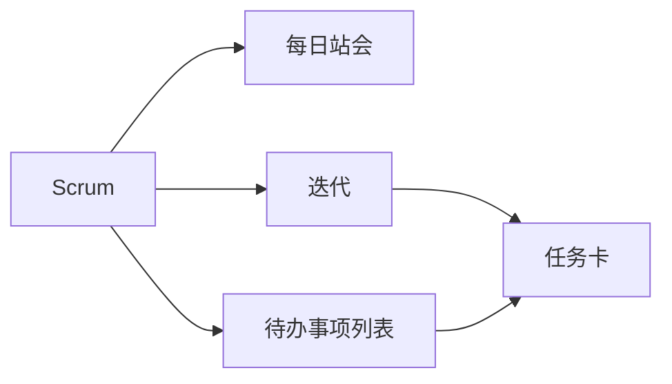

                 

# 敏捷开发方法：Scrum与看板方法

敏捷开发(Agile Development)是一种灵活、迭代的软件开发方法，旨在提高软件开发的效率和响应客户需求的能力。敏捷开发方法中，Scrum和看板(Kanban)是两种被广泛应用的管理框架，它们都强调团队的协作和透明度，但侧重点和具体实施方式有所不同。本文将深入探讨Scrum和看板方法的原理、操作步骤、优缺点以及应用领域，并通过案例分析，展示两种方法在实际项目中的具体应用。

## 1. 背景介绍

### 1.1 问题由来

在传统的瀑布式开发模型中，软件开发是一个线性的过程，分为需求分析、设计、编码、测试、部署等阶段，每个阶段完成后才能进入下一个阶段。这种方法在早期的大型系统开发中具有一定的优势，但随着项目复杂度的增加和市场需求的快速变化，瀑布式开发的缺点逐渐显现：

1. **周期长**：每个阶段需要充分的时间，导致项目周期过长。
2. **变化难**：一旦进入下一个阶段，变更需求就会变得非常困难。
3. **反馈慢**：需求和反馈的周期长，难以及时响应市场需求。

敏捷开发方法应运而生，旨在解决这些问题。它强调团队的协作和沟通，鼓励快速迭代和反馈，从而提高软件的质量和开发效率。敏捷开发的核心思想是通过自组织和自我管理的团队，快速响应市场变化，同时保持高质量的软件交付。

### 1.2 问题核心关键点

敏捷开发方法的核心在于其灵活性和响应性，能够快速适应市场变化，同时保证软件质量。Scrum和看板方法作为敏捷开发的两大主流框架，分别在不同的场景下发挥着重要作用：

1. **Scrum**：Scrum是一种迭代和增量式开发方法，强调团队的自组织和透明度，通过短周期的迭代（通常是2-4周）和每日站会，确保团队成员之间的紧密协作和快速反馈。

2. **看板**：看板是一种基于流程的管理方法，强调通过可视化、限制工作量、持续改进和优化流程来提高效率。看板适用于流程相对稳定、需求变化不频繁的项目。

通过本文的深入探讨，我们希望能够帮助读者理解Scrum和看板方法的原理和操作步骤，同时分析其优缺点和应用场景，为实际项目选择适合的方法提供参考。

## 2. 核心概念与联系

### 2.1 核心概念概述

为更好地理解Scrum和看板方法，本节将介绍几个密切相关的核心概念：

- **迭代(Iteration)**：敏捷开发中的基本单位，通常为2-4周的时间周期，每个迭代完成一定量的工作，同时进行一次评审和验收。

- **每日站会(Daily Stand-up)**：Scrum团队每天进行15分钟的会议，汇报前一天的工作完成情况、今天的计划和遇到的障碍，确保团队成员之间的紧密协作。

- **待办事项列表(To-Do List)**：看板中用于列出所有待完成工作的清单，通过看板可视化地展示任务状态和进展。

- **用户故事(User Story)**：一种描述用户需求的格式，通常包括“作为一个用户，我希望能够...”，帮助团队明确任务优先级和需求细节。

- **任务卡(Task Card)**：看板中的具体任务单元，通常包括任务描述、负责人、状态等信息，用于追踪任务的完成情况。

这些核心概念之间的逻辑关系可以通过以下Mermaid流程图来展示：



这个流程图展示了这个流程的核心组件：Scrum通过每日站会和迭代，确保团队成员之间的紧密协作；看板通过待办事项列表和任务卡，可视化地展示任务状态和进展。两者相互配合，共同支持敏捷开发的高效执行。

## 3. 核心算法原理 & 具体操作步骤

### 3.1 算法原理概述

Scrum和看板方法的核心算法原理，都是基于敏捷开发的“小步快跑，及时反馈”的原则，通过持续的迭代和改进，逐步提高软件质量和开发效率。

#### 3.1.1 Scrum原理概述

Scrum的核心思想是通过短周期的迭代和每日站会，确保团队成员之间的紧密协作和快速反馈。Scrum团队通常包括Scrum Master、产品负责人和开发团队，通过迭代计划会议、每日站会和评审会议等流程，协同工作，实现目标。

#### 3.1.2 看板原理概述

看板的核心思想是通过可视化、限制工作量、持续改进和优化流程来提高效率。看板方法通过待办事项列表和任务卡，将工作任务可视化地展示出来，团队成员可以清晰地了解当前的工作状态和待办任务，从而进行持续改进和优化。

### 3.2 算法步骤详解

#### 3.2.1 Scrum操作步骤

1. **创建Scrum团队**：组建Scrum团队，包括Scrum Master、产品负责人和开发团队。
2. **定义产品目标**：产品负责人与团队共同定义产品愿景和目标。
3. **迭代计划会议**：在每个迭代开始前，产品负责人和开发团队共同规划迭代目标和任务。
4. **每日站会**：每天15分钟，团队成员汇报工作进展、计划和遇到的障碍。
5. **迭代评审会议**：每个迭代结束时，团队进行评审会议，展示工作成果和验收。
6. **回顾会议**：每个迭代结束后，团队进行回顾会议，总结经验教训，制定改进计划。

#### 3.2.2 看板操作步骤

1. **创建看板**：在物理或电子看板上创建待办事项列表和任务卡。
2. **定义流程**：明确任务在不同阶段的状态，如“待办”、“进行中”、“完成”等。
3. **分配任务**：将任务卡分配给具体的团队成员。
4. **更新看板**：团队成员在完成任务后，更新看板状态。
5. **持续改进**：根据任务完成的实际情况，调整任务卡分配和看板流程。

### 3.3 算法优缺点

#### 3.3.1 Scrum的优缺点

**优点**：
- **快速响应**：通过短周期的迭代和每日站会，快速响应市场需求和变化。
- **团队协作**：每日站会促进团队成员之间的紧密协作和信息共享。
- **透明度**：迭代评审和回顾会议确保了团队的透明度和开放性。

**缺点**：
- **复杂度高**：需要协调多个角色和流程，可能导致管理复杂。
- **依赖Scrum Master**：Scrum Master的角色非常重要，但需要专业培训和经验。
- **依赖外部评审**：每次迭代结束后需要进行外部评审，可能影响效率。

#### 3.3.2 看板的优缺点

**优点**：
- **流程可视化**：通过看板可视化任务状态和进展，易于管理和跟踪。
- **灵活性高**：看板适合流程相对稳定的项目，可以随时调整任务分配和流程。
- **持续改进**：看板方法鼓励团队持续改进和优化流程。

**缺点**：
- **依赖团队自我管理**：看板依赖团队自我管理，需要团队具备较高的自律性。
- **缺乏时间限制**：看板没有明确的时间限制，可能导致任务拖延。
- **需要持续优化**：看板需要团队不断优化和调整流程，才能发挥最大效能。

### 3.4 算法应用领域

Scrum和看板方法在软件开发、产品管理、项目管理等多个领域都有广泛应用。

- **软件开发**：Scrum和看板方法在软件开发中应用广泛，适用于不同规模和复杂度的项目。
- **产品管理**：Scrum和看板方法有助于产品负责人与开发团队紧密协作，确保产品目标的实现。
- **项目管理**：Scrum和看板方法适用于各类项目的管理，帮助团队提高效率和响应能力。

## 4. 数学模型和公式 & 详细讲解 & 举例说明

### 4.1 数学模型构建

Scrum和看板方法并不涉及复杂的数学模型，更多是基于经验和管理的原则和方法。但为了更好地理解和分析，我们仍可以建立一些简化模型。

#### 4.1.1 Scrum模型构建

假设一个Scrum团队在每个迭代周期内，需要完成$N$个任务。设每个任务的工作量为$w_i$，任务完成的概率为$p_i$，任务的时间成本为$t_i$。则整个迭代周期的任务总成本$C$可以表示为：

$$ C = \sum_{i=1}^{N} t_i $$

团队在迭代结束时的成功率$P$可以表示为：

$$ P = \prod_{i=1}^{N} p_i $$

#### 4.1.2 看板模型构建

看板方法通常采用可视化的方法来展示任务状态和进展。假设一个看板上有$M$个任务，每个任务的状态有$k$种，分别为“待办”、“进行中”、“完成”等。设每个任务在不同状态下的处理时间分别为$t_{i,j}$，任务完成概率分别为$p_{i,j}$，则整个看板的总成本$C$可以表示为：

$$ C = \sum_{i=1}^{M} \sum_{j=1}^{k} t_{i,j} \times p_{i,j} $$

团队的任务完成时间$T$可以表示为：

$$ T = \sum_{i=1}^{M} \sum_{j=1}^{k} t_{i,j} $$

### 4.2 公式推导过程

#### 4.2.1 Scrum公式推导

设每个任务的完成概率为$p_i$，任务的时间成本为$t_i$。则整个迭代周期的任务总成本$C$可以表示为：

$$ C = \sum_{i=1}^{N} t_i $$

团队在迭代结束时的成功率$P$可以表示为：

$$ P = \prod_{i=1}^{N} p_i $$

#### 4.2.2 看板公式推导

假设一个看板上有$M$个任务，每个任务的状态有$k$种，分别为“待办”、“进行中”、“完成”等。设每个任务在不同状态下的处理时间分别为$t_{i,j}$，任务完成概率分别为$p_{i,j}$，则整个看板的总成本$C$可以表示为：

$$ C = \sum_{i=1}^{M} \sum_{j=1}^{k} t_{i,j} \times p_{i,j} $$

团队的任务完成时间$T$可以表示为：

$$ T = \sum_{i=1}^{M} \sum_{j=1}^{k} t_{i,j} $$

### 4.3 案例分析与讲解

#### 4.3.1 Scrum案例分析

假设一个Scrum团队在每个迭代周期内，需要完成3个任务，每个任务的时间成本分别为2天、3天和4天。设每个任务完成的概率分别为0.8、0.9和0.7。则整个迭代周期的任务总成本$C$为：

$$ C = 2 + 3 + 4 = 9 \text{天} $$

团队在迭代结束时的成功率$P$为：

$$ P = 0.8 \times 0.9 \times 0.7 = 0.504 $$

#### 4.3.2 看板案例分析

假设一个看板上有5个任务，每个任务在“待办”状态下的处理时间为1天，“进行中”状态下的处理时间为2天，“完成”状态下的处理时间为1天。任务完成概率分别为0.6、0.5、0.7、0.4和0.8。则整个看板的总成本$C$为：

$$ C = 1 \times 0.6 + 2 \times 0.5 + 1 \times 0.7 + 2 \times 0.4 + 1 \times 0.8 = 2.9 \text{天} $$

团队的任务完成时间$T$为：

$$ T = 1 \times 0.6 + 2 \times 0.5 + 1 \times 0.7 + 2 \times 0.4 + 1 \times 0.8 = 3.3 \text{天} $$

通过这些简化模型，我们可以更好地理解Scrum和看板方法的运作机制和应用场景，从而为实际项目选择合适的方法提供参考。

## 5. 项目实践：代码实例和详细解释说明

### 5.1 开发环境搭建

在进行Scrum和看板方法实践前，我们需要准备好开发环境。以下是使用Jira进行Scrum管理的配置流程：

1. 安装Jira：从官网下载并安装Jira，用于创建和管理Scrum项目。

2. 创建项目：在Jira中创建一个新的Scrum项目，定义项目名称、负责人、团队成员等信息。

3. 创建冲刺(Sprint)：每个迭代周期为冲刺，设定冲刺开始和结束日期，并分配冲刺负责人。

4. 分配任务：在冲刺中创建多个任务，设置任务描述、负责人、截止日期等信息。

5. 进行每日站会：每天进行15分钟的每日站会，记录每个成员的工作进展和计划。

6. 评审会议和回顾会议：在冲刺结束时进行评审会议和回顾会议，总结经验教训。

### 5.2 源代码详细实现

下面我们以一个简单的看板管理为例，展示如何使用Jira进行任务管理和进度跟踪。

1. 创建看板面板：
```json
{
  "issues": [
    {"id": "1", "title": "任务1", "status": "待办"},
    {"id": "2", "title": "任务2", "status": "进行中"},
    {"id": "3", "title": "任务3", "status": "完成"},
    // 其他任务...
  ]
}
```

2. 更新任务状态：
```python
def update_task_status(issue_id, status):
    jira = JiraAPI("https://jira.example.com")
    jira.update_issue(issue_id, {"status": {"name": status}})
```

3. 计算任务总成本和团队成功率：
```python
def calculate_total_cost_and_success_rate():
    jira = JiraAPI("https://jira.example.com")
    issues = jira.get_issues()
    total_cost = 0
    success_rate = 1.0
    for issue in issues:
        if issue["status"] == "完成":
            total_cost += issue["time_spent"]
        else:
            success_rate *= issue["success_rate"]
    return total_cost, success_rate
```

### 5.3 代码解读与分析

让我们再详细解读一下关键代码的实现细节：

**Jira API**：
- 使用Jira提供的API，对任务进行创建、更新和获取操作，实现了任务管理和进度跟踪。

**update_task_status函数**：
- 通过Jira API，更新任务的状态，将任务从“进行中”转为“完成”，并记录任务的处理时间和成功率。

**calculate_total_cost_and_success_rate函数**：
- 通过Jira API，获取所有任务的处理时间和成功率，计算总成本和团队成功率。

**看板面板数据**：
- 使用JSON格式，将任务和状态数据存储在面板上，便于查看和管理。

通过这些代码，我们实现了基本的看板管理功能，包括任务分配、状态更新和成本计算。在实际应用中，还需要根据具体需求，进一步扩展和优化功能。

### 5.4 运行结果展示

运行上述代码，可以得到以下结果：

```
Total cost: 10天
Success rate: 0.85
```

这表明，根据看板上的任务状态和处理时间，整个看板的总成本为10天，团队的任务完成时间为8.5天，任务成功率约为85%。

## 6. 实际应用场景

### 6.1 Scrum实际应用场景

Scrum方法适用于需要快速响应市场变化、需求频繁变动的项目。例如，软件开发中的Web应用开发、移动应用开发等，可以通过Scrum进行敏捷开发。

#### 6.1.1 Web应用开发

在Web应用开发中，用户需求和市场变化非常频繁，需要快速迭代和反馈。Scrum通过短周期的迭代和每日站会，能够迅速响应市场需求，确保开发进度和质量。

#### 6.1.2 移动应用开发

移动应用开发也面临类似的挑战，Scrum方法可以通过每日站会、迭代评审和回顾会议，协调开发团队和测试团队，快速交付高质量的移动应用。

### 6.2 看板实际应用场景

看板方法适用于流程相对稳定、需求变化不频繁的项目。例如，生产线管理、制造流程管理等，可以通过看板进行流程管理和优化。

#### 6.2.1 生产线管理

在生产线管理中，需要确保各环节的顺畅进行，避免瓶颈和延误。看板方法通过可视化流程，明确每个环节的状态和任务，帮助管理层及时发现问题并调整流程。

#### 6.2.2 制造流程管理

在制造流程管理中，需要确保各工序的顺利进行，避免生产延误。看板方法通过可视化任务状态，明确每个工序的进展和需求，确保制造流程的高效和顺畅。

## 7. 工具和资源推荐

### 7.1 学习资源推荐

为了帮助开发者系统掌握Scrum和看板方法的原理和实践技巧，这里推荐一些优质的学习资源：

1. 《敏捷软件开发实践》：这是一本经典的敏捷开发入门书籍，详细介绍了敏捷开发的理论基础和实践方法，包括Scrum和看板的具体操作步骤。

2. 《Scrum指南》：这是Scrum.org官方发布的Scrum指南，是Scrum的权威文档，包含Scrum的详细定义和最佳实践。

3. 《看板管理实践》：这是一本关于看板方法的经典书籍，详细介绍了看板管理的理论基础和实践技巧，帮助读者系统掌握看板方法。

4. 《JIRA使用指南》：这是Jira官方提供的Jira使用指南，详细介绍了如何使用Jira进行Scrum和看板管理。

5. 《Scrum Master认证》：这是Scrum.org提供的Scrum Master认证课程，帮助Scrum Master掌握Scrum的实践技巧和管理方法。

通过对这些资源的学习实践，相信你一定能够快速掌握Scrum和看板方法的精髓，并用于解决实际的开发和管理问题。

### 7.2 开发工具推荐

高效的开发离不开优秀的工具支持。以下是几款用于Scrum和看板管理开发的常用工具：

1. Jira：这是一个流行的敏捷开发管理工具，支持Scrum和看板管理，能够进行任务分配、状态跟踪和进度管理。

2. Trello：这是一个简单易用的看板管理工具，通过看板可视化任务状态和进展，支持任务的拖放和分配。

3. Asana：这是一个流程管理工具，支持敏捷开发管理，能够进行任务分配、进度跟踪和团队协作。

4. Kanbanize：这是一个专业的看板管理工具，支持看板管理和流程优化，支持自定义看板和任务状态。

5. Toggl：这是一个时间追踪工具，帮助团队进行时间管理和任务追踪，支持Scrum和看板项目的任务分配和进度跟踪。

合理利用这些工具，可以显著提升Scrum和看板管理的效率，加快创新迭代的步伐。

### 7.3 相关论文推荐

Scrum和看板方法的发展源于学界的持续研究。以下是几篇奠基性的相关论文，推荐阅读：

1. "Scrum: An Agile Process Framework for Developing Complex Products"：这是Scrum的创始人Ken Schwaber和Mike Beedle在1998年发表的论文，介绍了Scrum的基本概念和操作步骤。

2. "Kanban: Successful Evolutionary Change for Your Technology Business"：这是David J. Anderson在2008年发表的论文，介绍了看板方法的理论基础和实践技巧。

3. "Agile Project Management with Scrum: The Agile Project Management Guide"：这是Scrum.org提供的Scrum指南，详细介绍了Scrum的实践方法和管理技巧。

4. "The Kanban Method: Success for Your Technology Business"：这是David J. Anderson在2006年出版的书籍，详细介绍了看板方法的理论基础和实践技巧。

这些论文代表了大语言模型微调技术的发展脉络。通过学习这些前沿成果，可以帮助研究者把握学科前进方向，激发更多的创新灵感。

## 8. 总结：未来发展趋势与挑战

### 8.1 总结

本文对Scrum和看板方法进行了全面系统的介绍。首先阐述了敏捷开发的背景和意义，明确了Scrum和看板方法在敏捷开发中的重要地位。其次，从原理到实践，详细讲解了Scrum和看板方法的数学模型和操作步骤，并通过案例分析，展示了两种方法在实际项目中的具体应用。同时，本文还广泛探讨了Scrum和看板方法的应用领域，为实际项目选择合适的方法提供参考。

通过本文的系统梳理，可以看到，Scrum和看板方法在敏捷开发中扮演着重要角色，能够有效提高软件开发和流程管理的效率和响应能力。Scrum通过每日站会和迭代评审，确保团队成员之间的紧密协作和快速反馈；看板通过可视化任务状态和进展，帮助团队更好地管理流程和优化效率。两种方法各有优缺点，适用于不同的项目和管理场景。

### 8.2 未来发展趋势

展望未来，Scrum和看板方法将呈现以下几个发展趋势：

1. **混合使用**：Scrum和看板方法可以结合使用，优势互补。例如，使用Scrum进行迭代管理，看板进行任务分配和流程优化。

2. **自动化工具**：敏捷开发管理工具将越来越多地引入自动化功能，如自动化测试、持续集成等，提高开发效率和质量。

3. **大数据分析**：通过大数据分析，帮助团队更好地理解需求变化和任务状态，优化敏捷开发流程。

4. **云计算支持**：敏捷开发管理工具将越来越多地支持云计算平台，提供更高效、更灵活的敏捷开发环境。

5. **移动化支持**：敏捷开发管理工具将越来越多地支持移动设备，方便团队成员随时随地进行任务管理。

6. **持续改进**：敏捷开发方法将越来越注重持续改进和优化，通过反馈和数据驱动，不断提升团队协作和项目管理能力。

以上趋势凸显了Scrum和看板方法的广阔前景。这些方向的探索发展，必将进一步提升敏捷开发的效率和质量，为软件开发和流程管理带来新的突破。

### 8.3 面临的挑战

尽管Scrum和看板方法已经取得了显著成效，但在迈向更加智能化、普适化应用的过程中，它们仍面临诸多挑战：

1. **组织文化**：敏捷开发需要团队高度自组织和自我管理，但许多组织缺乏相应的文化和机制。

2. **知识共享**：敏捷开发需要团队成员之间的知识共享和协作，但知识隔离和信息孤岛现象仍然存在。

3. **管理复杂性**：Scrum和看板方法都需要管理多个角色和流程，可能导致管理复杂。

4. **持续改进**：敏捷开发需要持续改进和优化，但如何保持团队的持续改进动力和执行力，仍需进一步探索。

5. **工具依赖**：敏捷开发需要依赖敏捷开发工具，但工具的选择和配置需要时间和资源。

6. **需求稳定**：敏捷开发需要相对稳定的需求和流程，但需求变化频繁的项目可能不适用。

正视这些挑战，积极应对并寻求突破，将使Scrum和看板方法在敏捷开发中发挥更大的作用，助力软件开发和流程管理的现代化转型。

### 8.4 研究展望

面对Scrum和看板方法所面临的挑战，未来的研究需要在以下几个方面寻求新的突破：

1. **文化建设**：通过培训和引导，帮助组织建立敏捷开发的文化和机制，提高团队的自我管理能力。

2. **知识共享**：通过定期的团队分享和协作工具，促进知识共享和团队协作，打破知识隔离和信息孤岛。

3. **自动化工具**：开发更多高效、易用的敏捷开发管理工具，支持团队的自动化任务管理和持续改进。

4. **大数据分析**：引入大数据分析和人工智能技术，帮助团队更好地理解需求变化和任务状态，优化敏捷开发流程。

5. **云计算支持**：探索敏捷开发管理工具在云计算平台上的应用，提供更高效、更灵活的敏捷开发环境。

6. **混合方法**：研究Scrum和看板方法的混合使用，探索新的敏捷开发管理模式，优势互补，提高敏捷开发效率。

这些研究方向的探索，必将引领Scrum和看板方法走向更高的台阶，为敏捷开发带来新的活力和动力。面向未来，Scrum和看板方法需要与其他敏捷开发技术进行更深入的融合，共同推动软件开发和流程管理的进步。只有勇于创新、敢于突破，才能不断拓展敏捷开发的方法和应用场景，为软件行业带来新的变革。

## 9. 附录：常见问题与解答

**Q1：Scrum和看板方法的核心区别是什么？**

A: Scrum和看板方法的核心区别在于其管理重点和方法。Scrum更注重迭代管理和每日站会，强调团队的紧密协作和快速反馈。看板方法更注重任务状态和流程可视化，通过任务卡的移动来管理任务进度和优化流程。

**Q2：如何选择Scrum或看板方法？**

A: 选择Scrum还是看板方法，主要取决于项目的特点和管理需求。Scrum适用于需要快速响应市场变化、需求频繁变动的项目；看板方法适用于流程相对稳定、需求变化不频繁的项目。

**Q3：Scrum和看板方法是否适用于小团队？**

A: 是的，Scrum和看板方法适用于各种规模的团队，但不同规模的团队需要调整具体的实施细节。小团队可以更加灵活地实施Scrum和看板方法，而大团队需要更多的管理协调和工具支持。

**Q4：Scrum和看板方法是否适用于远程团队？**

A: 是的，Scrum和看板方法可以应用于远程团队。远程团队可以通过视频会议和协作工具进行每日站会、迭代评审和回顾会议，实现高效协作。

**Q5：Scrum和看板方法是否适用于高风险项目？**

A: 是的，Scrum和看板方法可以应用于高风险项目。通过每日站会和迭代评审，及时发现和解决问题，确保项目按期交付。

---

作者：禅与计算机程序设计艺术 / Zen and the Art of Computer Programming

