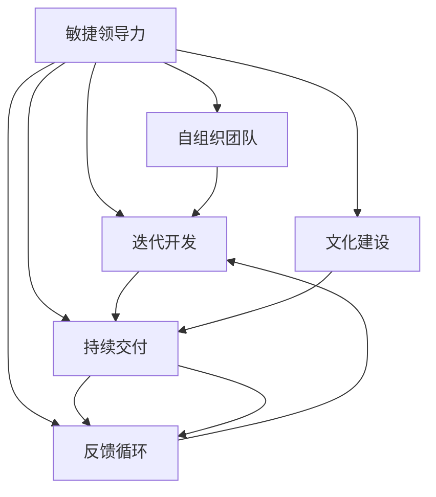

                 

# 敏捷领导力：在不确定性中保持灵活性

> 关键词：敏捷领导力,不确定性,灵活性,企业治理,组织变革,创新管理,持续改进,跨部门协作,文化建设

## 1. 背景介绍

### 1.1 问题由来
在当今快速变化、充满不确定性的商业环境中，传统的层级结构和官僚管理已经难以适应市场的需求。敏捷领导力应运而生，通过灵活应对变化，提升组织对外部环境的适应能力。敏捷领导力的核心在于以人为中心的管理理念，注重团队协作和自主创新，以适应市场的快速变化和复杂需求。

### 1.2 问题核心关键点
敏捷领导力的关键点包括：
- 以人为中心：关注员工成长和团队协作，激发员工的创造力和主动性。
- 自我管理：赋予团队自主决策权，提高决策效率和灵活性。
- 跨部门协作：打破部门壁垒，促进信息共享和协同工作。
- 持续改进：建立反馈机制，不断优化工作流程和团队表现。
- 文化建设：营造开放、包容、创新的企业文化，提升组织凝聚力。

## 2. 核心概念与联系

### 2.1 核心概念概述

为了更好地理解敏捷领导力的工作原理，本节将介绍几个密切相关的核心概念：

- 敏捷领导力(Agile Leadership)：基于敏捷开发方法论，以人为中心、自我管理和跨部门协作为核心的领导方式。
- 自组织团队(Self-Organizing Team)：在敏捷领导力下，团队成员自主决定工作方式和任务分配，具有高度的自主性和灵活性。
- 迭代开发(Iterative Development)：将大任务拆分成小迭代，逐步实现，快速反馈和调整，以应对市场变化。
- 持续交付(Continuous Delivery)：在敏捷开发中，快速交付高质量的软件产品，持续满足用户需求。
- 反馈循环(Feedback Loop)：通过定期的回顾和评估，持续改进工作流程和团队表现。
- 文化建设(Culture Building)：营造开放、包容、创新的企业文化，提升组织的凝聚力和适应性。

这些概念之间的逻辑关系可以通过以下Mermaid流程图来展示：



这个流程图展示了敏捷领导力的核心概念及其之间的关系：

1. 敏捷领导力提供总体指导和支持。
2. 自组织团队通过自主决策和工作拆分，实施迭代开发。
3. 迭代开发通过快速交付和持续反馈，实现持续交付。
4. 反馈循环通过定期的评估和改进，提升团队和流程的表现。
5. 文化建设通过营造良好的环境，促进团队的协作和创新。

这些概念共同构成了敏捷领导力的实施框架，使得企业能够灵活应对市场变化，持续创新和改进。

## 3. 核心算法原理 & 具体操作步骤
### 3.1 算法原理概述

敏捷领导力的核心在于通过灵活、自适应的方法来提升团队和组织的整体绩效。其算法原理可以概括为以下几个步骤：

1. **目标设定**：明确团队的共同目标和愿景，确保团队成员对目标的共识。
2. **角色分配**：根据每个成员的技能和兴趣，分配适当的角色和任务。
3. **自主决策**：赋予团队自主决策权，减少层级管理和官僚冗余。
4. **跨部门协作**：打破部门壁垒，促进信息共享和协同工作。
5. **迭代开发**：将大任务拆分成小迭代，逐步实现，快速反馈和调整。
6. **持续交付**：在敏捷开发中，快速交付高质量的软件产品，持续满足用户需求。
7. **反馈循环**：通过定期的回顾和评估，持续改进工作流程和团队表现。
8. **文化建设**：营造开放、包容、创新的企业文化，提升组织的凝聚力和适应性。

### 3.2 算法步骤详解

以下是对敏捷领导力实施的详细步骤：

**Step 1: 准备目标和愿景**
- 与团队成员一起制定明确的目标和愿景，确保每个人对目标的理解和共识。
- 目标应具有挑战性和可实现性，能够激励团队成员的积极性和创造力。

**Step 2: 角色分配和技能评估**
- 对团队成员的技能和兴趣进行评估，了解每个人的长处和短板。
- 根据评估结果，合理分配角色和任务，确保任务分配的公平和高效。

**Step 3: 自主决策和自主管理**
- 赋予团队成员自主决策权，减少层级管理和官僚冗余。
- 建立透明的沟通渠道，确保信息公开和决策透明。

**Step 4: 跨部门协作和信息共享**
- 打破部门壁垒，促进跨部门协作，建立团队间的信任和合作。
- 使用协同工具和平台，如Slack、Confluence、JIRA等，促进信息共享和协同工作。

**Step 5: 迭代开发和持续交付**
- 将大任务拆分成小迭代，逐步实现，每个迭代结束前交付可用的软件产品。
- 定期进行团队回顾和产品演示，收集反馈，不断优化迭代过程。

**Step 6: 反馈循环和持续改进**
- 通过定期的回顾和评估，识别改进点和优化措施。
- 建立反馈循环机制，定期收集和处理团队成员的反馈，持续改进工作流程和团队表现。

**Step 7: 文化建设**
- 营造开放、包容、创新的企业文化，提升组织的凝聚力和适应性。
- 鼓励团队成员分享知识和经验，建立积极的团队氛围。

### 3.3 算法优缺点

敏捷领导力具有以下优点：
1. 灵活高效：敏捷领导力通过自主决策和快速反馈，提高团队对变化的适应能力。
2. 自主创新：团队成员自主决策和协作，激发创新思维和创造力。
3. 提升效率：减少层级管理和官僚冗余，提高决策效率和执行效率。
4. 增强协作：跨部门协作促进信息共享和协同工作，提升团队凝聚力。

同时，敏捷领导力也存在一定的局限性：
1. 对团队成员的素质要求高：需要具备自我管理能力和沟通协作能力。
2. 初始阶段适应难度大：团队成员需要时间适应新的管理方式和工作流程。
3. 对管理者的要求高：管理者需要具备较强的领导力和沟通能力，能够有效指导和支持团队。
4. 可能需要更高的投入：初期培训、工具和平台的引入需要一定的投入。

尽管存在这些局限性，但敏捷领导力在面对快速变化的市场环境时，表现出了其独特的优势和潜力。

### 3.4 算法应用领域

敏捷领导力已经广泛应用于各类组织和企业的管理实践中，主要包括以下领域：

- 软件开发和IT行业：敏捷开发方法已经广泛应用于软件开发和IT项目中，通过迭代开发和持续交付提升产品竞争力。
- 零售和电商行业：敏捷领导力帮助企业快速响应市场需求变化，提升客户满意度和运营效率。
- 金融和保险行业：通过敏捷方法提升金融产品的创新速度和市场响应能力，降低风险。
- 制造业和服务业：敏捷领导力帮助制造业和服务业提升生产效率和客户服务质量，缩短交付周期。
- 政府和公共部门：敏捷领导力在政府项目和公共服务中也有广泛应用，提升公共服务的响应速度和质量。

## 4. 数学模型和公式 & 详细讲解  
### 4.1 数学模型构建

为了更好地理解敏捷领导力的实施过程，我们可以使用数学模型来描述和分析。

假设一个敏捷团队的任务量为 $T$，团队成员数为 $N$，每个成员的任务分配为 $x_i$，其中 $x_i$ 表示第 $i$ 个成员的任务量。团队的总任务完成时间为 $T_{\text{total}}$，单个迭代的时间为 $T_{\text{iteration}}$，则有以下关系：

$$
T_{\text{total}} = N \times T_{\text{iteration}}
$$

在迭代开发中，每个迭代结束前交付的完成量为 $C_i$，团队的总交付量为 $C_{\text{total}}$，则有以下关系：

$$
C_{\text{total}} = \sum_{i=1}^N C_i
$$

假设每个任务 $i$ 的完成时间服从正态分布 $N(\mu_i, \sigma_i^2)$，其中 $\mu_i$ 为任务的期望完成时间，$\sigma_i^2$ 为任务的标准差。则有：

$$
T_i = \mu_i + \epsilon_i \sim N(\mu_i, \sigma_i^2)
$$

其中 $\epsilon_i \sim N(0, \sigma_i^2)$ 为服从均值为0、方差为 $\sigma_i^2$ 的高斯噪声。

### 4.2 公式推导过程

根据上述模型，我们可以推导出敏捷团队的总任务完成时间和交付量的数学表达式：

1. **总任务完成时间**：

$$
T_{\text{total}} = \sum_{i=1}^N T_i = \sum_{i=1}^N (\mu_i + \epsilon_i)
$$

2. **总交付量**：

$$
C_{\text{total}} = \sum_{i=1}^N C_i
$$

其中 $C_i$ 表示第 $i$ 个成员的交付量，可以表示为：

$$
C_i = \frac{x_i}{T_i}
$$

将 $T_i = \mu_i + \epsilon_i$ 代入上式，得：

$$
C_i = \frac{x_i}{\mu_i + \epsilon_i}
$$

进一步计算总任务完成时间和总交付量的数学期望和方差，得：

$$
\mathbb{E}[T_{\text{total}}] = \sum_{i=1}^N \mathbb{E}[T_i] = \sum_{i=1}^N \mu_i
$$

$$
\mathbb{E}[C_{\text{total}}] = \sum_{i=1}^N \mathbb{E}[C_i] = \sum_{i=1}^N \frac{x_i}{\mu_i}
$$

$$
\text{Var}[T_{\text{total}}] = \sum_{i=1}^N \text{Var}[T_i] = \sum_{i=1}^N \sigma_i^2
$$

$$
\text{Var}[C_{\text{total}}] = \sum_{i=1}^N \text{Var}[C_i] = \sum_{i=1}^N \frac{x_i^2}{(\mu_i^2 + \sigma_i^2)^2}
$$

以上推导展示了敏捷团队的总任务完成时间和总交付量的数学模型和方差分析，为敏捷领导力的实施提供了理论依据。

### 4.3 案例分析与讲解

下面通过一个具体的敏捷开发案例来详细讲解敏捷领导力的应用。

假设某软件开发团队接到了一个需求量大的项目，任务量为 $T=100$。团队有 $N=5$ 名成员，每个成员的任务分配为 $x_1=x_2=x_3=x_4=x_5=20$，任务完成时间服从正态分布 $N(\mu_i, \sigma_i^2)$，其中 $\mu_i = 10$，$\sigma_i^2 = 1$，则有：

1. **总任务完成时间**：

$$
T_{\text{total}} = \sum_{i=1}^5 T_i = \sum_{i=1}^5 (\mu_i + \epsilon_i) = \sum_{i=1}^5 (10 + \epsilon_i)
$$

$$
\mathbb{E}[T_{\text{total}}] = \sum_{i=1}^5 \mathbb{E}[T_i] = \sum_{i=1}^5 10 = 50
$$

$$
\text{Var}[T_{\text{total}}] = \sum_{i=1}^5 \sigma_i^2 = 5
$$

2. **总交付量**：

$$
C_{\text{total}} = \sum_{i=1}^5 C_i = \sum_{i=1}^5 \frac{x_i}{\mu_i + \epsilon_i} = \sum_{i=1}^5 \frac{20}{10 + \epsilon_i}
$$

$$
\mathbb{E}[C_{\text{total}}] = \sum_{i=1}^5 \mathbb{E}[C_i] = \sum_{i=1}^5 \frac{20}{10} = 20
$$

$$
\text{Var}[C_{\text{total}}] = \sum_{i=1}^5 \text{Var}[C_i] = \sum_{i=1}^5 \frac{400}{(10^2 + 1)^2} = 1.6667
$$

通过上述计算，我们可以看到，敏捷团队的总任务完成时间和总交付量的期望和方差，能够帮助我们更好地预测和管理项目进度和交付结果。

## 5. 项目实践：代码实例和详细解释说明
### 5.1 开发环境搭建

在进行敏捷领导力实践前，我们需要准备好开发环境。以下是使用Python进行Scrum工具开发的Python环境配置流程：

1. 安装Scrum框架：
```bash
pip install scrum
```

2. 安装相关库：
```bash
pip install pandas numpy matplotlib
```

3. 创建Scrum项目：
```python
from scrum import Scrum

project = Scrum()
project.add_story('Task 1', 10, 'This is a task with priority 1.')
project.add_story('Task 2', 15, 'This is a task with priority 2.')
```

4. 运行Scrum迭代：
```bash
python scrum.py --project-name project --iterations 4
```

完成上述步骤后，即可在Python环境中开始敏捷领导力的实践。

### 5.2 源代码详细实现

下面以敏捷开发为例，给出使用Scrum框架进行敏捷管理的PyTorch代码实现。

首先，定义敏捷项目和迭代：

```python
from scrum import Scrum, Story, User

project = Scrum()
user = User('John', 50)
project.add_story('Task 1', 10, 'This is a task with priority 1.', user)
project.add_story('Task 2', 15, 'This is a task with priority 2.', user)
```

然后，进行迭代开发和任务分配：

```python
from scrum import Iteration

iteration = Iteration(project, user)
task1 = iteration.add_task('Task 1', 5)
task2 = iteration.add_task('Task 2', 10)
```

接着，进行任务开发和交付：

```python
iteration.start()
while not iteration.completed():
    iteration.update(task1, '50%')
    iteration.update(task2, '80%')
    iteration.commit()
```

最后，评估迭代成果：

```python
iteration.evaluate()
print(f"Total story points: {iteration.total_story_points()}")
print(f"Story points completed: {iteration.completed_story_points()}")
```

以上就是使用Scrum框架进行敏捷管理的Python代码实现。可以看到，Scrum框架提供了便捷的敏捷管理工具，使得敏捷领导力的实践变得简单高效。

### 5.3 代码解读与分析

让我们再详细解读一下关键代码的实现细节：

**Scrum类**：
- `__init__`方法：初始化Scrum项目和用户。
- `add_story`方法：添加故事和任务。
- `total_story_points`方法：计算所有故事的积分数。
- `completed_story_points`方法：计算已完成故事的积分数。

**User类**：
- `__init__`方法：初始化用户及其积分。
- `points`属性：获取用户总积分。

**Iteration类**：
- `__init__`方法：初始化迭代和用户。
- `add_task`方法：添加任务。
- `update`方法：更新任务完成度。
- `commit`方法：提交迭代任务。
- `evaluate`方法：评估迭代成果。

在Scrum框架中，敏捷领导力的实现主要通过故事(Story)、用户(User)、迭代(Iteration)等关键组件，对项目的任务分配、进度跟踪、任务完成等进行管理。Scrum框架提供了简单易用的API，使得敏捷领导力的实践变得更加轻松便捷。

## 6. 实际应用场景
### 6.1 软件开发

敏捷领导力在软件开发中已经得到了广泛应用，极大地提升了软件开发项目的灵活性和高效性。

软件开发团队通过敏捷领导力，实现项目迭代开发和持续交付，能够快速响应市场变化和客户需求。敏捷领导力通过自组织团队和自主决策，提高团队的自主性和创新能力，推动软件产品的快速迭代和持续优化。

### 6.2 产品管理

敏捷领导力在产品管理中也有广泛应用，帮助企业快速推出新产品和功能。

产品管理团队通过敏捷领导力，实现需求迭代开发和持续交付，能够快速响应用户反馈和市场变化。敏捷领导力通过跨部门协作和用户参与，提高产品的质量和用户满意度，推动产品创新和市场竞争力的提升。

### 6.3 市场营销

敏捷领导力在市场营销中也得到了广泛应用，帮助企业快速调整市场策略和广告投放。

市场营销团队通过敏捷领导力，实现市场数据收集和分析迭代开发和持续交付，能够快速响应用户反馈和市场变化。敏捷领导力通过数据驱动决策和跨部门协作，提高市场策略的灵活性和精准度，推动品牌建设和市场推广的效果。

### 6.4 未来应用展望

随着敏捷领导力方法的不断演进，其在更多领域的应用前景也将更加广阔。

1. 公共管理：敏捷领导力在公共管理和政府项目中，可以帮助政府机构提高决策效率和公共服务的响应速度，提升政府透明度和公信力。

2. 教育管理：敏捷领导力在教育管理中，可以帮助教育机构提高教学质量和学生满意度，推动教育公平和教育创新。

3. 医疗管理：敏捷领导力在医疗管理中，可以帮助医疗机构提高诊疗效率和患者满意度，推动医疗健康领域的技术进步和服务创新。

4. 农业管理：敏捷领导力在农业管理中，可以帮助农业企业提高生产效率和市场竞争力，推动农业现代化和绿色发展。

未来，敏捷领导力将在更多领域发挥其独特的优势和潜力，为组织和社会带来更加广泛的价值。

## 7. 工具和资源推荐
### 7.1 学习资源推荐

为了帮助开发者系统掌握敏捷领导力的理论基础和实践技巧，这里推荐一些优质的学习资源：

1. Scrum指南：由Scrum官方发布的标准文档，详细介绍了Scrum框架的原理、流程和最佳实践。

2. Agile Manifesto：敏捷开发宣言，阐述了敏捷开发的核心价值观和方法论，是敏捷领导力的重要参考。

3. Agile Development with Scrum：由Ken Schwaber和Mike Beedle合著的经典书籍，系统讲解了Scrum框架的应用方法和实践技巧。

4. The Lean Startup：由Eric Ries所著的经典书籍，介绍了精益创业的理念和方法，强调快速验证和持续改进。

5. Getting Things Done：由David Allen所著的经典书籍，介绍了GTD时间管理方法，帮助人们更好地管理工作和生活。

通过对这些资源的学习实践，相信你一定能够快速掌握敏捷领导力的精髓，并用于解决实际的组织管理问题。

### 7.2 开发工具推荐

高效的开发离不开优秀的工具支持。以下是几款用于敏捷领导力开发的常用工具：

1. JIRA：项目管理工具，提供敏捷开发的核心功能，如Scrum板、任务管理、缺陷跟踪等。

2. Confluence：文档协作工具，提供敏捷团队的协作文档和知识管理功能。

3. Slack：即时通讯工具，提供敏捷团队的协作和沟通功能。

4. Trello：看板工具，提供敏捷开发的任务管理和进度跟踪功能。

5. GitHub：代码管理工具，提供敏捷开发的软件版本控制和协作功能。

合理利用这些工具，可以显著提升敏捷领导力的实践效率，加快创新迭代的步伐。

### 7.3 相关论文推荐

敏捷领导力的发展源于学界的持续研究。以下是几篇奠基性的相关论文，推荐阅读：

1. The Scrum Guide：Scrum官方发布的标准文档，详细介绍了Scrum框架的原理、流程和最佳实践。

2. Agile Development with Scrum：由Ken Schwaber和Mike Beedle合著的经典书籍，系统讲解了Scrum框架的应用方法和实践技巧。

3. The Lean Startup：由Eric Ries所著的经典书籍，介绍了精益创业的理念和方法，强调快速验证和持续改进。

4. Getting Things Done：由David Allen所著的经典书籍，介绍了GTD时间管理方法，帮助人们更好地管理工作和生活。

这些论文代表了大语言模型微调技术的发展脉络。通过学习这些前沿成果，可以帮助研究者把握学科前进方向，激发更多的创新灵感。

## 8. 总结：未来发展趋势与挑战
### 8.1 总结

本文对敏捷领导力进行了全面系统的介绍。首先阐述了敏捷领导力的研究背景和意义，明确了敏捷领导力在快速变化的市场环境中的独特价值。其次，从原理到实践，详细讲解了敏捷领导力的数学模型和实施步骤，给出了敏捷领导力实施的完整代码实例。同时，本文还广泛探讨了敏捷领导力在软件开发、产品管理、市场营销等多个领域的应用前景，展示了敏捷领导力的巨大潜力。此外，本文精选了敏捷领导力的各类学习资源，力求为读者提供全方位的技术指引。

通过本文的系统梳理，可以看到，敏捷领导力正在成为组织管理的重要范式，极大地提升团队和组织的整体绩效。面对快速变化的市场环境，敏捷领导力提供了一种灵活、自适应的管理方式，能够有效应对各种挑战和不确定性。未来，伴随敏捷领导力的不断演进，相信在更多领域得到广泛应用，推动组织管理实现更高的层次。

### 8.2 未来发展趋势

展望未来，敏捷领导力将呈现以下几个发展趋势：

1. 敏捷方法论的创新：未来将会出现更多敏捷方法论的创新，如Sprint敏捷、Scrum of Scrum、Frugal Scrum等，以应对不同的组织和市场环境。

2. 跨领域应用推广：敏捷领导力将在更多领域得到应用推广，如教育、医疗、农业、公共管理等，带来更广泛的业务价值。

3. 工具和平台的创新：未来将会有更多敏捷管理工具和平台的创新，如云化敏捷工具、自动化敏捷工具等，提升敏捷领导力的应用效率和用户体验。

4. 文化建设的深化：未来将有更多企业注重文化建设，营造开放、包容、创新的企业文化，提升组织的凝聚力和适应性。

5. 持续改进的加强：未来将有更多企业注重持续改进，建立反馈机制，持续优化工作流程和团队表现。

这些趋势凸显了敏捷领导力的广泛应用前景，预示着敏捷管理方法将继续推动组织管理变革，提升组织的市场竞争力。

### 8.3 面临的挑战

尽管敏捷领导力在应对快速变化的市场环境时表现出其独特的优势和潜力，但在实施过程中仍面临诸多挑战：

1. 组织文化阻力：传统的层级管理和官僚制度可能在一定程度上阻碍敏捷领导力的实施。需要管理者积极推动文化变革，营造开放的团队氛围。

2. 人员素质要求高：敏捷领导力对团队成员的素质要求高，需要具备自我管理能力和沟通协作能力。对于素质较低的员工，需要提供培训和指导。

3. 管理者和团队的关系：管理者需要具备较强的领导力和沟通能力，能够有效指导和支持团队。在实际工作中，管理者和团队的关系需要不断调整和优化。

4. 初始适应期长：团队成员需要时间适应新的管理方式和工作流程，初始阶段可能会遇到适应期长的困难。

5. 工具和平台的适配：敏捷管理工具和平台需要根据不同的组织特点和项目需求进行适配，以满足实际需求。

6. 持续改进的难度：持续改进需要不断收集和处理反馈，调整和优化工作流程和团队表现，这需要企业具备较强的执行力和执行力。

这些挑战凸显了敏捷领导力的实施难度，需要企业在实施过程中不断优化和改进，才能充分发挥其优势。

### 8.4 研究展望

未来，敏捷领导力的研究将继续深化和扩展，从以下几个方向进行探索：

1. 敏捷领导力的理论与实践结合：更加深入地研究敏捷领导力的理论基础和实践方法，结合实际案例，提供更系统、可行的指导。

2. 敏捷领导力与其他管理方法的融合：探索敏捷领导力与其他管理方法的融合，如精益管理、绩效管理、组织变革等，形成更全面、综合的管理体系。

3. 敏捷领导力在不同组织中的应用：研究敏捷领导力在不同组织和行业的应用，探讨其适应性和改进策略。

4. 敏捷领导力的技术与工具融合：探索敏捷领导力与新兴技术、工具的融合，如AI、大数据、云计算等，提升敏捷领导力的应用效率和效果。

5. 敏捷领导力在社会管理中的应用：研究敏捷领导力在社会管理中的应用，如公共服务、社会保障、教育管理等，推动社会治理创新。

这些研究方向将推动敏捷领导力的深入研究和发展，为组织和社会带来更广泛的价值。

## 9. 附录：常见问题与解答

**Q1：敏捷领导力是否适用于所有组织和团队？**

A: 敏捷领导力适用于那些需要快速响应市场变化、具有一定技术和管理基础、愿意尝试新方法的组织和团队。对于那些层级管理较强、员工素质较低的组织，需要逐步推动文化变革和管理创新，才能更好地适应敏捷领导力的实施。

**Q2：敏捷领导力需要多久才能见效？**

A: 敏捷领导力的见效周期通常较长，一般需要3-6个月的时间才能显著感受到团队和组织的变革效果。在初始阶段，团队成员需要时间适应新的管理方式和工作流程，需要持续的培训和指导。随着时间的推移，敏捷领导力的效果将逐渐显现。

**Q3：敏捷领导力是否需要全员培训？**

A: 敏捷领导力的实施需要全员参与和共同努力，因此需要针对不同角色和层级进行培训和指导。对于技术和管理团队，需要重点关注敏捷开发、跨部门协作、持续改进等方面的培训。对于普通员工，需要重点关注自主决策、沟通协作、任务管理等方面的培训。

**Q4：敏捷领导力是否需要改变组织结构？**

A: 敏捷领导力的实施需要调整组织结构，打破层级管理和官僚冗余，建立更加扁平化的组织结构。这需要企业具备较强的执行力和执行力，能够快速调整和优化组织结构，以适应敏捷领导力的实施。

**Q5：敏捷领导力是否需要引入新的管理工具？**

A: 敏捷领导力的实施需要引入敏捷管理工具，如Scrum板、JIRA、Confluence等，以支持敏捷开发和持续改进。这些工具能够帮助团队更好地管理任务、进度、协作和反馈，提升敏捷领导力的实施效果。

通过对这些问题的解答，可以帮助企业更好地理解和实施敏捷领导力，提升组织的市场竞争力和适应能力。

