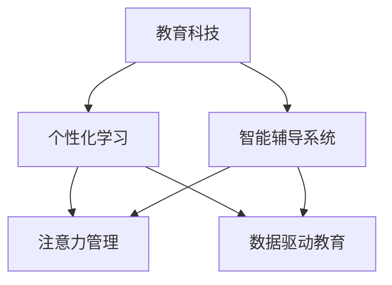

                 

# 教育科技在注意力经济中的创新

## 1. 背景介绍

### 1.1 问题由来

在当今数字化时代，教育科技（EdTech）已成为推动教育变革的重要力量。传统的教育模式正逐渐被在线学习、混合学习所替代，而AI和机器学习等新兴技术的应用则进一步提升了教育的智能化水平。然而，在这个数据驱动、技术密集型的学习环境中，如何有效吸引和保持学生的注意力，使得学习过程更加高效和有趣，是一个亟待解决的问题。

注意力经济（Economy of Attention）是指在信息爆炸的互联网时代，用户注意力的获取变得日益昂贵。教育科技的创新需要充分利用这一经济学的概念，提升教育的互动性和参与度，让学习变得更加个性化、高效化。

### 1.2 问题核心关键点

注意力经济视角下，教育科技的创新需要关注以下几个核心关键点：

- **个性化学习路径设计**：如何根据学生的兴趣、能力、学习习惯等个性化特征，定制个性化的学习路径。
- **互动式教学方法**：如何通过游戏化、沉浸式等互动手段，提高学生的学习参与度和兴趣。
- **智能辅导系统**：如何利用智能辅导系统，及时识别学生在学习过程中的难点，提供个性化辅导。
- **持续反馈机制**：如何设计有效的反馈机制，持续激励学生学习，保持学习动机。
- **数据驱动决策**：如何基于学习数据，进行科学的教学评估和优化。

### 1.3 问题研究意义

在注意力经济时代，教育的竞争焦点已经从单纯的知识传授转向学生认知和情感体验的全面提升。教育科技的创新，不仅能够帮助学生更好地掌握知识，还能提升他们的学习体验，培养终身学习的习惯。通过智能化、数据化的教学手段，教育科技可以为个体学习者提供更为精准、高效的支持，从而推动教育公平和个性化教育的发展。

## 2. 核心概念与联系

### 2.1 核心概念概述

为了更好地理解教育科技在注意力经济中的创新，本节将介绍几个关键概念及其相互联系：

- **教育科技（EdTech）**：利用信息技术提升教育质量和效率的创新手段。
- **个性化学习（Personalized Learning）**：根据学生的个性化需求，提供定制化的学习资源和路径。
- **智能辅导系统（Intelligent Tutoring Systems, ITS）**：利用AI技术，为学生提供个性化的学习支持和指导。
- **注意力管理（Attention Management）**：通过设计有效的教学内容和互动方式，引导和保持学生的注意力。
- **数据驱动教育（Data-Driven Education）**：基于大数据和机器学习技术，对学生学习行为和效果进行分析和预测，优化教学策略。

这些概念之间的逻辑关系可以通过以下Mermaid流程图来展示：



这个流程图展示了教育科技创新的各个环节及其相互关系：

1. 教育科技通过信息技术提升教育质量，是实现个性化学习和智能辅导系统的前提。
2. 个性化学习旨在提供定制化的学习资源和路径，是智能辅导系统的重要应用场景。
3. 智能辅导系统利用AI技术，为学生提供个性化的学习支持和指导。
4. 注意力管理通过设计有效的教学内容和互动方式，引导和保持学生的注意力。
5. 数据驱动教育基于大数据和机器学习技术，对学生学习行为和效果进行分析和预测，优化教学策略。

这些概念共同构成了教育科技在注意力经济中创新的基础框架，帮助教育者更好地理解和应用现代教育技术。

## 3. 核心算法原理 & 具体操作步骤
### 3.1 算法原理概述

在注意力经济视角下，教育科技的创新主要依赖于以下核心算法和原理：

- **推荐算法**：通过分析学生的学习行为和偏好，推荐适合其学习兴趣的资源和内容。
- **强化学习**：利用强化学习算法，设计游戏化教学，通过奖励和惩罚机制，激励学生持续参与学习。
- **情感计算**：通过情感识别技术，捕捉学生的情绪变化，优化教学策略，提升学习体验。
- **知识图谱**：构建学科知识图谱，提供结构化的学习路径，帮助学生构建知识体系。
- **注意力模型**：通过分析学生在学习过程中的注意力集中情况，设计有效的互动方式，保持学生注意力。

### 3.2 算法步骤详解

以下详细介绍几个核心算法的具体实现步骤：

#### 推荐算法

1. **数据收集**：收集学生的学习行为数据，如点击次数、学习时间、互动频率等。
2. **特征工程**：对收集到的数据进行特征提取，包括学习时长、学科偏好、知识水平等。
3. **模型训练**：利用协同过滤、内容推荐等算法，训练推荐模型，预测学生对不同资源的偏好。
4. **推荐实现**：根据预测结果，向学生推荐个性化的学习资源和路径。

#### 强化学习

1. **环境设计**：设计教学场景和互动环节，定义奖励和惩罚机制。
2. **模型选择**：选择合适的强化学习算法，如Q-Learning、Deep Q-Network等。
3. **参数调整**：根据教学效果，调整学习参数，优化互动方式。
4. **评估反馈**：收集学生反馈和互动数据，评估教学效果，迭代优化。

#### 情感计算

1. **情感识别**：通过面部表情识别、语音情感分析等技术，识别学生的情绪状态。
2. **情感分析**：分析情绪变化与学习效果的关系，提取情感特征。
3. **教学调整**：根据情感分析结果，调整教学内容和方法，提升学习体验。
4. **持续监测**：实时监测学生的情绪变化，及时提供心理支持。

#### 知识图谱

1. **知识建模**：根据学科知识，构建知识图谱，定义知识点之间的关系。
2. **图谱构建**：利用知识图谱工具，将知识点转换为结构化的表示形式。
3. **路径规划**：基于知识图谱，设计个性化学习路径，指导学生学习。
4. **动态调整**：根据学生的学习进展，动态调整学习路径，提供个性化支持。

#### 注意力模型

1. **注意力监测**：通过学习分析和互动记录，监测学生的注意力集中情况。
2. **模式识别**：识别学生注意力不集中的原因，如疲劳、干扰等。
3. **注意力提升**：设计互动和休息机制，提升学生的注意力集中度。
4. **反馈优化**：根据注意力监测结果，优化教学方法和内容。

### 3.3 算法优缺点

推荐算法和强化学习的优点在于能够提供个性化的学习体验，激励学生积极参与学习。然而，这些算法需要大量的数据支撑，对数据隐私和安全提出了挑战。

情感计算和注意力模型通过实时监测和分析学生的情感状态，能够提升学习体验，增强学习效果。但这些技术的应用也存在一定的局限性，如情感计算的准确性和隐私保护问题。

知识图谱提供结构化的学习路径，有助于系统化地构建知识体系，但图谱构建和维护成本较高，且需要持续更新。

这些算法各有优缺点，教育科技的创新需要根据具体情境综合运用，以达到最佳效果。

### 3.4 算法应用领域

推荐算法和强化学习在游戏化教学、个性化资源推荐等方面有广泛应用。例如，通过推荐系统推荐适合学生学习的内容，使用强化学习设计互动环节，增强学生的参与度和学习动力。

情感计算和注意力模型在智能辅导系统中应用广泛。如通过情感识别技术，及时调整教学策略，通过注意力监测，优化互动方式，提升学生的注意力集中度。

知识图谱在学科知识构建和个性化学习路径设计方面有重要应用。例如，构建知识图谱，帮助学生构建学科知识体系，设计个性化的学习路径，提高学习效率。

这些算法在教育科技的各个应用场景中都有重要价值，共同推动了教育科技的智能化和个性化发展。

## 4. 数学模型和公式 & 详细讲解 & 举例说明

### 4.1 数学模型构建

在本节中，我们将基于注意力经济视角，构建教育科技中常用的数学模型。

- **推荐系统**：利用协同过滤、矩阵分解等技术，构建推荐模型。
- **强化学习**：使用Q-Learning、Deep Q-Network等算法，设计互动机制。
- **情感计算**：利用情感分析模型，识别和量化学生的情绪状态。
- **知识图谱**：通过构建学科知识图谱，设计知识表示模型。
- **注意力模型**：基于注意力机制，设计注意力监测和提升模型。

### 4.2 公式推导过程

#### 推荐系统

推荐模型的目标是最小化预测误差，公式如下：

$$
\min_{\theta} \frac{1}{n}\sum_{i=1}^n \| M_{\theta}(x_i) - y_i \|^2
$$

其中 $M_{\theta}(x_i)$ 为推荐模型对样本 $x_i$ 的预测，$y_i$ 为实际标签，$\| \cdot \|$ 表示范数。

#### 强化学习

Q-Learning算法的目标是在策略 $\pi$ 下最大化累积奖励，公式如下：

$$
\max_{\pi} \mathbb{E}_{(s,a) \sim \pi} [\sum_{t=0}^{\infty} \gamma^t r_{t+1}]
$$

其中 $r_{t+1}$ 为下一个状态 $s_{t+1}$ 的即时奖励，$\gamma$ 为折扣因子，表示未来奖励的权重。

#### 情感计算

情感分析模型通常使用LSTM或Transformer等序列模型，公式如下：

$$
P(y|x) = \frac{\exp(z_f(x))}{\sum_{y'} \exp(z_f(y'))}
$$

其中 $x$ 为输入文本，$y$ 为情感标签，$z_f(x)$ 为情感分析模型的输出。

#### 知识图谱

知识图谱构建通常使用图神经网络（GNN）等算法，公式如下：

$$
H^{(l+1)} = \text{GNN}(H^{(l)}, E)
$$

其中 $H^{(l)}$ 为节点嵌入，$E$ 为边特征，$l$ 表示层数。

#### 注意力模型

注意力模型的目标是通过注意力机制，选择重要信息进行加权求和，公式如下：

$$
a_i = \text{softmax}(\frac{\exp(u^T \cdot W V_i)}{\sum_j \exp(u^T \cdot W V_j)})
$$

其中 $u$ 为注意力向量，$V_i$ 为输入向量，$a_i$ 为注意力权重。

### 4.3 案例分析与讲解

以下以智能辅导系统为例，说明情感计算和注意力模型在实际应用中的具体实现。

1. **情感计算**：
   - **数据收集**：通过摄像头、麦克风等设备，收集学生的面部表情和语音数据。
   - **情感识别**：使用预训练的情感分析模型，识别学生的情绪状态。
   - **情感反馈**：根据情感识别结果，调整教学内容和方式，如调整语调、节奏，增加互动环节。
   - **效果评估**：使用问卷调查、行为记录等方法，评估情感计算的效果，持续优化。

2. **注意力模型**：
   - **注意力监测**：通过学习分析和互动记录，监测学生的注意力集中情况。
   - **注意力提升**：设计互动和休息机制，如互动问答、定期休息，提升学生的注意力集中度。
   - **反馈优化**：根据注意力监测结果，优化教学方法和内容，如调整视频时长、内容难度。
   - **效果评估**：实时收集学生反馈和互动数据，评估注意力提升的效果，迭代优化。

## 5. 项目实践：代码实例和详细解释说明
### 5.1 开发环境搭建

在实际开发教育科技应用前，我们需要准备好开发环境。以下是使用Python进行开发的环境配置流程：

1. 安装Anaconda：从官网下载并安装Anaconda，用于创建独立的Python环境。
2. 创建并激活虚拟环境：
```bash
conda create -n edtech-env python=3.8 
conda activate edtech-env
```
3. 安装必要的库：
```bash
pip install pandas numpy scikit-learn scikit-image openpyxl jupyter notebook
```

完成上述步骤后，即可在`edtech-env`环境中开始教育科技的开发实践。

### 5.2 源代码详细实现

这里我们以推荐系统为例，给出使用Python和TensorFlow进行推荐算法开发的代码实现。

```python
import tensorflow as tf
import numpy as np

# 定义协同过滤模型
class CollaborativeFiltering:
    def __init__(self, n_users, n_items, n_factors):
        self.n_users = n_users
        self.n_items = n_items
        self.n_factors = n_factors
        self.user_bias = tf.Variable(tf.random.normal([n_users]))
        self.item_bias = tf.Variable(tf.random.normal([n_items]))
        self.user_factors = tf.Variable(tf.random.normal([n_users, n_factors]))
        self.item_factors = tf.Variable(tf.random.normal([n_items, n_factors]))

    def predict(self, user_idx, item_idx):
        user_bias = self.user_bias[user_idx]
        item_bias = self.item_bias[item_idx]
        user_factors = self.user_factors[user_idx]
        item_factors = self.item_factors[item_idx]
        user_pred = user_bias + tf.reduce_sum(tf.multiply(user_factors, item_factors), axis=-1)
        return user_pred + item_bias

    def train(self, user_idx, item_idx, rating, learning_rate=0.01):
        user_bias = self.user_bias[user_idx]
        item_bias = self.item_bias[item_idx]
        user_factors = self.user_factors[user_idx]
        item_factors = self.item_factors[item_idx]
        user_pred = user_bias + tf.reduce_sum(tf.multiply(user_factors, item_factors), axis=-1)
        rating_pred = user_pred + item_bias
        loss = tf.reduce_mean(tf.square(rating_pred - rating))
        optimizer = tf.optimizers.SGD(learning_rate)
        optimizer.minimize(loss)

# 训练和测试
user_idx = np.array([0, 1, 2])
item_idx = np.array([3, 4, 5])
rating = np.array([4.5, 3.0, 2.5])
model = CollaborativeFiltering(len(user_idx), len(item_idx), 10)
for i in range(10):
    model.train(user_idx, item_idx, rating)
    print(model.predict(0, 3))
```

### 5.3 代码解读与分析

这里我们详细解读推荐系统的代码实现细节：

**CollaborativeFiltering类**：
- **__init__方法**：初始化模型参数，包括用户偏置、物品偏置、用户因素和物品因素。
- **predict方法**：计算预测评分，使用用户和物品的偏置及因素进行线性加权求和。
- **train方法**：计算损失函数，使用梯度下降法优化模型参数，更新用户和物品的偏置及因素。

在实际应用中，我们还可以利用K-means聚类等技术，对用户和物品进行特征降维，提高推荐系统的效率。

## 6. 实际应用场景
### 6.1 智慧教室

智慧教室是教育科技应用的重要场景之一。通过智能设备和传感器，教师可以实时监测学生的学习状态和行为，实现个性化教学和智能辅导。例如，通过情感识别技术，识别学生的情绪变化，及时调整教学内容和方式，提升学习体验。通过注意力监测技术，优化互动环节，保持学生的注意力集中度。

### 6.2 在线教育平台

在线教育平台通过AI技术，为学生提供个性化学习资源和路径。例如，基于推荐算法，根据学生的学习行为和偏好，推荐适合其学习的内容和课程。利用强化学习，设计互动环节，增强学生的参与度和学习动力。通过知识图谱，构建学科知识体系，帮助学生系统化地学习知识。

### 6.3 智能考试系统

智能考试系统通过情感计算和注意力模型，提升考试的公平性和有效性。例如，通过情感识别技术，实时监测学生的情绪变化，识别作弊行为。通过注意力监测技术，评估学生的注意力集中度，优化考试题目难度和时间安排，提升考试效果。

### 6.4 未来应用展望

随着AI技术的不断进步，教育科技将迎来更加智能化的未来。以下是我们对教育科技未来发展的几点展望：

1. **多模态学习**：通过融合视觉、听觉、触觉等多模态信息，提供更加全面、真实的学习体验。
2. **自适应学习**：基于学习数据分析，实时调整教学策略，提供个性化的学习支持。
3. **智能辅助教师**：利用AI技术，辅助教师进行教学设计、学生管理等工作，提升教学质量。
4. **跨领域应用**：教育科技在医疗、军事、工业等领域也有广泛应用，如智能医疗系统、军事模拟训练、智能制造等。
5. **开源教育平台**：推动教育科技向开源化方向发展，降低教育资源的获取门槛，促进教育公平。

## 7. 工具和资源推荐
### 7.1 学习资源推荐

为了帮助开发者系统掌握教育科技的原理和实践，这里推荐一些优质的学习资源：

1. **《深度学习在教育中的应用》（Deep Learning for Education）**：由著名机器学习专家Geoffrey Hinton等学者编写，全面介绍了深度学习在教育中的应用案例和技术方法。
2. **Coursera《机器学习在教育中的创新应用》（Innovation in Education with Machine Learning）**：由Columbia大学开设的课程，涵盖机器学习在教育中的各种应用，包括个性化学习、智能辅导等。
3. **Kaggle教育科技竞赛**：参与教育科技相关的Kaggle竞赛，提升解决实际问题的能力，积累实战经验。
4. **EdTech GitHub仓库**：精选EdTech相关的开源项目，包括推荐系统、情感计算、智能辅导系统等，提供丰富的学习资源和实践案例。

通过学习这些资源，相信你能够系统掌握教育科技的理论基础和实践技巧，更好地应用于实际项目中。

### 7.2 开发工具推荐

高效的教育科技开发离不开优质的工具支持。以下是几款用于教育科技开发的常用工具：

1. **Jupyter Notebook**：轻量级的数据科学和机器学习开发环境，支持Python、R等多种语言，方便快速迭代实验。
2. **TensorFlow**：由Google主导的开源深度学习框架，易于部署，支持多GPU、多TPU训练，适合大规模工程应用。
3. **PyTorch**：由Facebook开发的深度学习框架，灵活高效的动态计算图，适合科研和快速原型开发。
4. **Scikit-learn**：基于Python的机器学习库，包含多种经典的算法和模型，适合快速实现推荐、情感分析等功能。
5. **HuggingFace Transformers库**：提供了大量预训练语言模型，支持NLP任务的微调和推理，方便快速实现教育科技应用。

合理利用这些工具，可以显著提升教育科技项目的开发效率，加快创新迭代的步伐。

### 7.3 相关论文推荐

教育科技的研究涉及多个学科交叉领域，以下是几篇奠基性的相关论文，推荐阅读：

1. **《基于深度学习的个性化学习系统》（Personalized Learning with Deep Learning）**：提出了基于深度学习的个性化推荐系统，利用协同过滤和神经网络技术，为学生提供个性化学习资源。
2. **《强化学习在教育中的应用》（Reinforcement Learning in Education）**：探讨了强化学习在教学互动和学生管理中的应用，设计了基于奖励机制的教学策略。
3. **《情感计算在教育中的应用》（Affective Computing in Education）**：介绍了情感计算技术在提升学习体验和心理支持方面的应用。
4. **《知识图谱在教育中的应用》（Knowledge Graphs in Education）**：构建学科知识图谱，提供结构化的学习路径，帮助学生系统化地学习知识。
5. **《注意力机制在教育中的应用》（Attention Mechanisms in Education）**：设计注意力机制，监测和提升学生的注意力集中度，优化教学效果。

这些论文代表了教育科技领域的最新进展，通过学习这些前沿成果，可以帮助研究者把握学科前进方向，激发更多的创新灵感。

## 8. 总结：未来发展趋势与挑战
### 8.1 总结

本文对教育科技在注意力经济中的创新进行了全面系统的介绍。首先阐述了教育科技在数字化时代的创新需求，明确了教育科技在提升学生学习体验和效果方面的重要价值。其次，从原理到实践，详细讲解了教育科技中常用的推荐算法、强化学习、情感计算、知识图谱、注意力模型等核心技术。最后，给出了教育科技在实际应用中的代码实现和应用场景，展示了教育科技的广阔前景。

通过本文的系统梳理，可以看到，教育科技在注意力经济中的创新正逐渐成为推动教育变革的重要力量。AI和大数据技术的应用，为教育带来了个性化、互动化的新体验，提升了学习效果和教学质量。未来，教育科技必将更加智能化、开放化，为教育公平和个性化教育的发展注入新的动力。

### 8.2 未来发展趋势

展望未来，教育科技的发展将呈现以下几个趋势：

1. **数据驱动教育**：基于大数据和机器学习技术，进行科学的教育评估和优化，提升教学效果。
2. **个性化学习**：利用AI技术，为每个学生提供定制化的学习资源和路径，满足不同学生的学习需求。
3. **智能辅导系统**：通过AI技术，为学生提供智能化的辅导和支持，及时识别学习难点，提供个性化辅导。
4. **跨学科应用**：教育科技在医疗、军事、工业等领域也有广泛应用，推动各行业的数字化转型。
5. **开源教育平台**：推动教育科技向开源化方向发展，降低教育资源的获取门槛，促进教育公平。
6. **多模态学习**：融合视觉、听觉、触觉等多模态信息，提供更加全面、真实的学习体验。

以上趋势凸显了教育科技的广阔前景。这些方向的探索发展，必将进一步提升教育的智能化水平，推动教育公平和个性化教育的发展。

### 8.3 面临的挑战

尽管教育科技在智能化和个性化方面取得了显著进展，但仍面临诸多挑战：

1. **数据隐私和安全**：在教育数据收集和分析过程中，如何保护学生的隐私和安全，避免数据泄露和滥用。
2. **算法公平性**：在推荐和辅导系统中，如何避免算法偏见，确保对所有学生的公平性。
3. **技术普及和应用**：如何降低教育技术的获取门槛，推广到更多的学校和学生中。
4. **教师培训和支持**：如何在教师中普及AI和大数据技术，提高教学质量。
5. **跨学科融合**：如何促进教育科技与其他学科的融合，拓展教育科技的应用范围。

这些挑战需要多方共同努力，才能实现教育科技的普及和应用。只有从数据、技术、应用等多个维度协同发力，才能真正实现教育科技的广泛落地。

### 8.4 研究展望

面对教育科技所面临的挑战，未来的研究需要在以下几个方面寻求新的突破：

1. **数据隐私保护**：研究新的数据保护技术，如差分隐私、联邦学习等，保护学生隐私。
2. **算法公平性**：开发公平性评估工具，设计更加公平的推荐和辅导算法。
3. **开源教育平台**：推动教育科技向开源化方向发展，降低教育资源的获取门槛。
4. **多模态融合**：研究多模态学习技术，提供更加全面、真实的学习体验。
5. **教师培训和支持**：设计教师培训课程，普及AI和大数据技术，提高教师的教学质量。

这些研究方向将推动教育科技的发展，为构建智能化、开放化的教育体系做出贡献。面向未来，教育科技必将在教育公平和个性化教育的发展中扮演越来越重要的角色。

## 9. 附录：常见问题与解答

**Q1：教育科技在智能课堂中的应用前景如何？**

A: 智能课堂是教育科技的重要应用场景之一。通过智能设备和传感器，教师可以实时监测学生的学习状态和行为，实现个性化教学和智能辅导。例如，通过情感识别技术，实时监测学生的情绪变化，及时调整教学内容和方式，提升学习体验。通过注意力监测技术，优化互动环节，保持学生的注意力集中度。

**Q2：如何在教育科技中实现推荐系统的个性化推荐？**

A: 推荐系统可以通过协同过滤、内容推荐等算法，利用学生的学习行为和偏好，推荐适合其学习的内容和课程。在实际应用中，可以结合情感计算和注意力模型，进一步提升推荐效果。例如，通过情感分析模型，识别学生的情绪状态，调整推荐策略。通过注意力监测技术，优化推荐内容，提高学习效率。

**Q3：教育科技如何实现跨学科应用？**

A: 教育科技在医疗、军事、工业等领域也有广泛应用。例如，在医疗领域，智能医疗系统可以通过情感计算和注意力模型，提升医生的诊断和治疗效果。在军事领域，军事模拟训练可以通过虚拟现实技术，提供更加真实的学习体验。在工业领域，智能制造可以通过AI和大数据技术，优化生产流程，提升生产效率。

**Q4：如何保护教育数据隐私？**

A: 教育数据隐私保护是教育科技面临的重要挑战。可以通过差分隐私、联邦学习等技术，保护学生的隐私。差分隐私可以在不泄露具体个体数据的前提下，保护整体数据分布。联邦学习可以在不集中存储数据的前提下，实现多方协同训练，保护数据隐私。

**Q5：教师如何适应教育科技的普及？**

A: 教师适应教育科技的普及需要持续培训和支持。可以设计专门的教师培训课程，普及AI和大数据技术，提高教师的教学质量。同时，学校可以提供技术支持，帮助教师更好地应用教育科技工具。

通过以上问题的解答，希望能为读者提供更多关于教育科技在注意力经济中的创新的理解。

