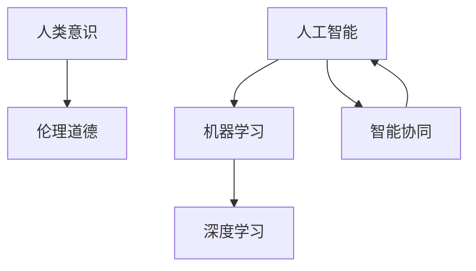

                 

# 数字世界中的人类意识：AI与现实的交织

在数字时代，人工智能（AI）与人类社会的交融已成为一种不可避免的趋势。AI技术正在改变我们的工作方式、生活方式以及思考方式。本文旨在探讨AI与现实世界的交织，揭示其中的人类意识以及未来的发展趋势与挑战。

## 1. 背景介绍

### 1.1 问题由来

随着科技的飞速发展，人工智能已经从科幻小说和科幻电影中走入现实生活。从语音识别、图像处理到自然语言处理，AI技术在各个领域中展现出了强大的应用潜力。然而，随着AI技术的不断深入，我们也逐渐认识到，AI并不是简单的工具或软件，它更像是与我们共生的新生物。AI的出现，正在重新定义人类的意识，并引发了广泛的社会讨论。

### 1.2 问题核心关键点

AI与现实世界的交织，核心在于人类意识与技术的关系。AI技术的快速发展，使得机器在处理数据、执行任务等方面表现出了与人类相似的智能水平。但与此同时，AI缺乏人类情感、道德、伦理等多方面的考量，无法完全理解和应对复杂的人类社会现象。因此，如何在AI技术中融入人类意识，成为当前AI研究的热点问题。

## 2. 核心概念与联系

### 2.1 核心概念概述

在探讨AI与现实的交织时，需要理解几个核心概念：

- **人工智能（AI）**：指由计算机系统执行的智能任务，可以模仿人类的认知和决策过程。
- **机器学习（ML）**：AI的一个分支，通过数据训练模型，使其能够自动识别和决策。
- **深度学习（DL）**：机器学习的一个子领域，利用多层神经网络模拟人类大脑的工作机制，进行复杂模式的识别和处理。
- **人类意识（Human Consciousness）**：指人类的思维、感知、情感等心理状态，包括自我认知、决策、语言表达等。
- **伦理道德（Ethics & Morality）**：指导人类行为的规范和标准，确保AI行为符合人类社会的价值观。
- **智能协同（Intelligent Collaboration）**：AI与人类共同工作的模式，实现互利共赢。

### 2.2 核心概念原理和架构的 Mermaid 流程图



这个流程图展示了AI与现实世界交织的核心概念及其之间的关系。AI通过机器学习和深度学习处理数据，模拟人类意识，并在伦理道德的指导下，与人类进行智能协同。

## 3. 核心算法原理 & 具体操作步骤

### 3.1 算法原理概述

AI与现实世界交织的核心算法原理，主要体现在以下几个方面：

- **数据驱动的决策**：AI通过大量数据训练模型，学习复杂的模式和规律，从而在特定场景中做出决策。
- **仿生模拟**：深度学习通过模仿人类大脑的神经网络结构，实现了对复杂问题的处理。
- **伦理道德引导**：在AI的训练和应用过程中，需要引入伦理道德规范，确保AI的行为符合人类的价值观。
- **智能协同**：AI与人类共同完成任务，实现优势互补。

### 3.2 算法步骤详解

AI与现实世界交织的算法步骤，可以分为以下几个关键步骤：

1. **数据收集与预处理**：收集数据，并进行清洗、标注等预处理工作。
2. **模型训练**：使用机器学习和深度学习算法，对数据进行模型训练。
3. **模型评估**：通过测试数据集，评估模型的性能和准确度。
4. **模型应用**：将训练好的模型应用于实际场景中，实现特定任务。
5. **反馈迭代**：根据应用反馈，对模型进行优化和调整。

### 3.3 算法优缺点

AI与现实世界交织的算法，具有以下优点：

- **高效性**：AI可以在短时间内处理大量数据，执行复杂任务。
- **准确性**：通过大量数据训练，AI在特定场景中表现出较高的准确度。
- **智能协同**：AI与人类共同工作，可以提升工作效率和质量。

同时，也存在以下缺点：

- **缺乏情感和道德**：AI缺乏人类的情感和道德考量，可能无法理解复杂的人类情感和社会现象。
- **隐私和安全风险**：AI在处理数据时，可能存在隐私泄露和数据安全风险。
- **依赖数据质量**：AI模型的性能高度依赖于数据的质量和数量。

### 3.4 算法应用领域

AI与现实世界的交织，已经在多个领域得到了广泛应用，包括：

- **医疗**：AI在医疗诊断、治疗方案推荐等方面，提升了医疗服务的质量和效率。
- **金融**：AI在风险评估、投资决策等方面，帮助金融机构更好地管理风险。
- **教育**：AI在个性化教育、智能辅导等方面，提升了教育服务的针对性和效果。
- **交通**：AI在交通规划、智能驾驶等方面，提升了交通系统的安全性和效率。

## 4. 数学模型和公式 & 详细讲解 & 举例说明

### 4.1 数学模型构建

AI与现实世界交织的数学模型，可以从以下几个方面进行构建：

- **输入输出模型**：定义输入和输出变量，建立数据流图。
- **决策树模型**：利用决策树算法，对数据进行分类和决策。
- **神经网络模型**：利用多层神经网络，模拟人类大脑的神经网络结构，进行复杂模式的识别和处理。
- **强化学习模型**：通过奖励和惩罚机制，训练AI进行最优决策。

### 4.2 公式推导过程

以神经网络模型为例，其核心公式如下：

$$
\text{输出} = \text{softmax}(\text{线性变换}(\text{激活函数}(\text{权重矩阵} \times \text{输入向量} + \text{偏置向量})))
$$

其中，线性变换表示对输入向量进行加权和，激活函数表示对加权和进行非线性处理，softmax函数表示对激活函数的输出进行归一化处理。

### 4.3 案例分析与讲解

以图像识别为例，神经网络模型通过大量标注数据进行训练，学习将输入图像映射到不同的类别。模型的训练过程如下：

1. **数据收集**：收集包含不同类别图像的数据集。
2. **数据预处理**：对图像进行归一化、旋转、缩放等预处理。
3. **模型训练**：使用神经网络模型，对数据进行训练，调整权重和偏置。
4. **模型评估**：在测试数据集上评估模型性能，使用准确率、召回率等指标。
5. **模型应用**：将训练好的模型应用于新的图像识别任务，实现高效准确识别。

## 5. 项目实践：代码实例和详细解释说明

### 5.1 开发环境搭建

在进行AI与现实世界交织的实践时，需要以下开发环境：

1. **Python**：作为主要的编程语言。
2. **TensorFlow**：用于深度学习模型的构建和训练。
3. **PyTorch**：用于深度学习模型的构建和训练。
4. **Jupyter Notebook**：用于交互式编程和数据分析。
5. **Git**：用于代码版本控制。

### 5.2 源代码详细实现

以图像识别为例，以下是使用TensorFlow进行模型训练的Python代码：

```python
import tensorflow as tf
from tensorflow.keras import layers

# 定义神经网络模型
model = tf.keras.Sequential([
    layers.Conv2D(32, (3, 3), activation='relu', input_shape=(28, 28, 1)),
    layers.MaxPooling2D((2, 2)),
    layers.Flatten(),
    layers.Dense(10, activation='softmax')
])

# 编译模型
model.compile(optimizer='adam', loss='sparse_categorical_crossentropy', metrics=['accuracy'])

# 训练模型
model.fit(train_images, train_labels, epochs=10, validation_data=(test_images, test_labels))
```

### 5.3 代码解读与分析

上述代码中，首先定义了一个包含卷积层、池化层和全连接层的神经网络模型。然后编译模型，指定优化器、损失函数和评估指标，最后使用训练数据进行模型训练。在训练过程中，模型会根据输入数据和标签进行反向传播，调整权重和偏置，以提高模型的准确性。

## 6. 实际应用场景

### 6.1 智能医疗

AI在医疗领域的应用，可以大大提升医疗服务的效率和质量。例如，AI可以通过分析病历、影像等数据，辅助医生进行疾病诊断和治疗方案推荐。AI还可以通过自然语言处理技术，帮助患者进行智能问答，提供健康管理建议。

### 6.2 智能金融

AI在金融领域的应用，可以提升风险评估和投资决策的准确性。例如，AI可以通过分析市场数据，预测股票价格走势。AI还可以进行信用评估，提升贷款审批的效率和准确性。

### 6.3 智能教育

AI在教育领域的应用，可以提供个性化学习体验。例如，AI可以通过分析学生的学习行为，推荐个性化的学习资源。AI还可以通过自然语言处理技术，进行智能辅导，提高学习效率。

### 6.4 智能交通

AI在交通领域的应用，可以提升交通系统的安全性和效率。例如，AI可以通过分析交通数据，优化交通流量。AI还可以通过自动驾驶技术，提升行车安全。

## 7. 工具和资源推荐

### 7.1 学习资源推荐

为了帮助开发者掌握AI与现实世界的交织技术，以下是一些推荐的学习资源：

1. **《深度学习》**：Ian Goodfellow等人所著，全面介绍了深度学习的基本概念和算法。
2. **《人工智能：一种现代方法》**：Stuart Russell和Peter Norvig所著，介绍了AI的基本概念和应用。
3. **Coursera和Udacity**：提供大量AI相关的在线课程，适合初学者和进阶者。
4. **Kaggle**：提供大量数据科学和机器学习竞赛，可以锻炼实战能力。
5. **GitHub**：提供大量开源AI项目和代码，可以借鉴和学习。

### 7.2 开发工具推荐

为了提高AI与现实世界交织的开发效率，以下是一些推荐的开发工具：

1. **TensorFlow**：由Google开发的深度学习框架，支持分布式训练和推理。
2. **PyTorch**：由Facebook开发的深度学习框架，易于使用且灵活。
3. **Jupyter Notebook**：用于交互式编程和数据分析。
4. **Git**：用于代码版本控制。
5. **VSCode**：支持多种编程语言和框架，适合AI开发。

### 7.3 相关论文推荐

以下是一些关于AI与现实世界交织的推荐论文：

1. **《人类和机器的协同进化》**：探讨了AI与人类的协同进化关系。
2. **《AI的伦理和道德问题》**：探讨了AI伦理道德问题的现状和挑战。
3. **《AI与现实世界的交织》**：探讨了AI与现实世界的融合和应用。

## 8. 总结：未来发展趋势与挑战

### 8.1 研究成果总结

AI与现实世界的交织，已经取得了显著的成果，主要体现在以下几个方面：

- **效率提升**：AI在处理数据、执行任务等方面表现出高效性。
- **智能协同**：AI与人类共同工作，提升了工作效率和质量。
- **多领域应用**：AI在医疗、金融、教育、交通等多个领域得到广泛应用。

### 8.2 未来发展趋势

AI与现实世界的交织，未来将呈现以下几个发展趋势：

- **自动化和智能化**：AI将更加自动化和智能化，实现更加复杂和高效的任务。
- **跨领域融合**：AI与其他领域的融合，如医疗、金融、教育等，将带来新的应用场景。
- **伦理道德规范**：AI的伦理道德问题将受到更多关注，规范将更加完善。

### 8.3 面临的挑战

AI与现实世界的交织，也面临着以下挑战：

- **数据隐私和安全**：AI在处理数据时，可能存在隐私泄露和数据安全风险。
- **伦理道德困境**：AI在决策过程中，可能存在伦理道德困境。
- **技术复杂性**：AI技术的复杂性和多样性，增加了开发和应用难度。

### 8.4 研究展望

未来，AI与现实世界的交织研究将从以下几个方面进行探索：

- **跨领域融合**：探索AI与其他领域的融合，实现跨领域智能协同。
- **伦理道德规范**：制定AI伦理道德规范，确保AI行为符合人类价值观。
- **自动化和智能化**：实现AI的自动化和智能化，提升工作效率和质量。

## 9. 附录：常见问题与解答

**Q1：AI与现实世界的交织是否会对人类产生威胁？**

A: AI与现实世界的交织，一方面可以提升人类生活质量和工作效率，另一方面也可能对人类产生威胁。例如，AI可能取代部分人类工作岗位，导致失业问题。因此，需要在技术发展的同时，加强对AI的伦理道德规范和监管，确保AI的行为符合人类价值观。

**Q2：AI与现实世界的交织是否会影响人类意识？**

A: AI与现实世界的交织，可能会影响人类意识。例如，AI的自动化和智能化，可能导致人类依赖性增加，思考能力和创新能力下降。因此，需要加强对AI技术的监督和管理，确保AI的发展符合人类利益。

**Q3：AI与现实世界的交织如何保证数据隐私和安全？**

A: 为了保证数据隐私和安全，AI技术需要采用以下措施：

1. **数据加密**：对数据进行加密处理，防止数据泄露。
2. **隐私保护**：采用隐私保护技术，如差分隐私、联邦学习等，防止数据泄露。
3. **数据匿名化**：对数据进行匿名化处理，保护个人隐私。
4. **安全审计**：定期进行安全审计，发现和修复安全漏洞。

**Q4：AI与现实世界的交织如何实现智能协同？**

A: AI与现实世界的交织，可以通过以下方式实现智能协同：

1. **协同决策**：AI通过分析数据，提供决策建议，与人类共同做出决策。
2. **协作学习**：AI通过学习人类经验，提升自身能力，与人类共同完成任务。
3. **智能辅导**：AI通过自然语言处理技术，进行智能辅导，提高学习效率。

**Q5：AI与现实世界的交织如何处理伦理道德问题？**

A: AI与现实世界的交织，需要从以下几个方面处理伦理道德问题：

1. **伦理规范制定**：制定AI伦理规范，确保AI行为符合人类价值观。
2. **透明度和可解释性**：提升AI的透明度和可解释性，确保AI决策过程透明。
3. **伦理培训**：对AI开发者和应用者进行伦理培训，提升其伦理意识。

---

作者：禅与计算机程序设计艺术 / Zen and the Art of Computer Programming

