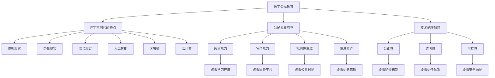

                 

# 数字公民教育:元宇宙时代的公民素养培养

> 关键词：数字公民教育, 元宇宙, 公民素养, 技术伦理, 数字化转型

## 1. 背景介绍

在迈向数字化的过程中，元宇宙的兴起带来了全新的教育方式和社会结构。随着虚拟现实(VR)、增强现实(AR)和混合现实(MR)技术的发展，人们开始探索基于虚拟空间的教育模式。数字公民教育作为培养新一代具有科技素养和伦理责任感的公民的重要手段，需要与时俱进，拥抱元宇宙时代的全新变革。

### 1.1 数字公民教育的重要性

数字公民教育不仅仅是关于计算机技能的培养，更是关于理解和适应数字时代的社会、经济、文化及伦理的全面教育。元宇宙时代的到来，赋予了数字公民教育新的挑战和机遇，对公民的沟通能力、数据素养、网络安全意识、道德规范等多方面提出了更高的要求。

### 1.2 元宇宙时代的特点

元宇宙是一个由虚拟和现实交织而成的数字空间，它集成了虚拟现实、增强现实、混合现实、人工智能、区块链、云计算等多种技术。这个时代的教育者需要重新思考如何培养学生在这样一个多维度和动态环境中高效、安全和创造性地进行互动和学习。

## 2. 核心概念与联系

### 2.1 核心概念概述

- **数字公民教育(Digital Civic Education)**：是指通过教育手段提升公民在数字时代的知识、技能、价值观和责任感，使他们在数字化环境中能够安全、有效和负责任地参与社会生活。
- **元宇宙(Metaverse)**：由虚拟现实、增强现实、混合现实、人工智能、区块链、云计算等技术构成的数字空间，提供了一个沉浸式、交互式的学习环境。
- **公民素养(Civic Literacy)**：指公民在政治、经济、社会和文化等方面的素养，包括阅读、写作、批判性思维、信息素养等。
- **技术伦理(Ethics in Technology)**：关注技术发展对社会伦理的影响，探讨如何在技术应用中实现公正、透明、可控，避免对个体和社会的负面影响。
- **数字化转型(Digital Transformation)**：通过应用数字技术来改变和优化现有的业务流程、组织结构和运营模式，以实现更高效、更智能的运营。

### 2.2 核心概念原理和架构的 Mermaid 流程图



这个图展示了数字公民教育与元宇宙时代各种核心概念之间的联系：

- 数字公民教育通过对公民素养的全面培养，使他们在元宇宙中更好地适应新的学习环境。
- 元宇宙技术通过VR、AR、MR、AI、区块链、云计算等手段，提供了一个全新的学习平台。
- 公民素养包括阅读、写作、批判性思维和信息素养，是教育的主要内容。
- 技术伦理涉及公正性、透明度和可控性，指导着元宇宙中技术应用的原则和规范。

## 3. 核心算法原理 & 具体操作步骤

### 3.1 算法原理概述

在元宇宙中，数字公民教育的核心算法可以概括为以下步骤：

1. **数据采集与分析**：收集元宇宙中的各种数据，包括用户行为、社会互动、内容生成等，分析这些数据以揭示学习行为模式和效果。
2. **智能推荐系统**：根据分析结果，通过智能推荐算法为不同用户定制个性化学习内容，提升学习效率和效果。
3. **虚拟现实沉浸式学习**：使用VR、AR、MR技术创造沉浸式学习环境，使学生能够通过身体感知和互动进行学习。
4. **社会化学习与协作**：构建虚拟学习社区，鼓励学生之间的互动和协作，增强社会化技能。
5. **伦理与法律教育**：在虚拟环境中引入伦理和法律课程，教育学生如何在数字世界中做出负责任的决策。
6. **安全与隐私保护**：通过技术手段保障虚拟学习环境的安全性和隐私性，避免数据滥用和网络攻击。

### 3.2 算法步骤详解

#### 3.2.1 数据采集与分析

- **用户行为数据**：记录用户在虚拟环境中的活动轨迹、互动频率、内容偏好等。
- **社会互动数据**：分析用户之间的交流记录、合作项目、竞争关系等，了解社会互动模式。
- **内容生成数据**：收集用户创作的文章、视频、作品等，分析创作主题和风格。

#### 3.2.2 智能推荐系统

- **用户画像构建**：通过机器学习算法构建用户画像，分析用户兴趣、能力、需求等。
- **个性化推荐**：根据用户画像，推荐个性化的学习资源和任务，如VR课程、AR体验、MR游戏等。
- **学习效果评估**：通过用户反馈和成绩数据，不断优化推荐算法，提升学习体验和效果。

#### 3.2.3 虚拟现实沉浸式学习

- **虚拟课堂设计**：创建虚拟教室，提供沉浸式的学习环境，如虚拟实验室、虚拟图书馆等。
- **互动式学习**：使用手势识别、虚拟现实头戴设备等技术，实现学生与学习内容的互动。
- **沉浸式游戏学习**：开发虚拟游戏，通过游戏化学习提升学生参与度和兴趣。

#### 3.2.4 社会化学习与协作

- **虚拟学习社区**：构建虚拟社区，使学生可以自由交流和协作。
- **团队项目合作**：设计团队项目，鼓励学生在虚拟环境中合作完成任务。
- **社区讨论与辩论**：组织虚拟讨论和辩论，培养学生的批判性思维和表达能力。

#### 3.2.5 伦理与法律教育

- **伦理课程设计**：开发虚拟课程，教授学生在虚拟世界中的伦理规范。
- **模拟伦理情景**：通过虚拟情景模拟，让学生体验和反思伦理问题。
- **法律知识教育**：讲解虚拟世界的法律法规，教育学生遵守规则。

#### 3.2.6 安全与隐私保护

- **数据加密**：使用加密技术保护用户数据，防止数据泄露和滥用。
- **访问控制**：设置权限控制，确保只有授权用户可以访问敏感内容。
- **安全监控**：部署安全监控系统，检测和防止网络攻击和恶意行为。

### 3.3 算法优缺点

#### 3.3.1 优点

1. **个性化学习**：智能推荐系统和数据采集分析，使学习内容更加贴合学生的兴趣和需求。
2. **沉浸式体验**：通过VR、AR、MR技术，提供更直观、更深入的学习体验。
3. **社会化协作**：虚拟社区和团队项目合作，提升学生的社会化技能和协作能力。
4. **伦理法律教育**：在虚拟环境中引入伦理和法律课程，培养学生的责任感。
5. **安全隐私保障**：通过技术手段保护学生的数据安全和个人隐私。

#### 3.3.2 缺点

1. **技术门槛高**：虚拟现实和增强现实技术需要高质量的设备支持，可能带来较高的成本。
2. **学生适应期长**：学生需要时间来适应虚拟学习环境，初期学习效果可能不如传统课堂。
3. **内容资源不足**：高质量的虚拟学习内容需要时间和资源投入，难以快速普及。
4. **网络安全挑战**：虚拟环境可能面临更高的网络攻击和数据泄露风险。

### 3.4 算法应用领域

数字公民教育与元宇宙技术结合，适用于以下多个领域：

1. **基础教育**：通过虚拟现实和增强现实技术，提供沉浸式的数学、科学、语言等基础课程学习。
2. **职业培训**：开发虚拟工作环境，进行职业技能培训和模拟练习。
3. **公共服务**：在政府和公共机构中，进行数字素养和伦理教育的培训。
4. **医疗健康**：在医疗教育中，利用虚拟现实和增强现实进行手术模拟和患者护理训练。
5. **商业与企业**：培养员工在数字世界中的工作技能和伦理责任感。
6. **社区建设**：在社区中，通过虚拟学习环境进行科普、社区服务培训等。

## 4. 数学模型和公式 & 详细讲解 & 举例说明

### 4.1 数学模型构建

数字公民教育的数学模型可以抽象为以下框架：

- **输入数据**：用户行为、社会互动、内容生成等数据。
- **处理过程**：数据采集、数据分析、智能推荐、虚拟现实学习、社会化学习、伦理法律教育、安全隐私保护等步骤。
- **输出结果**：个性化学习资源、沉浸式学习体验、社会化协作能力、伦理法律素养、数据安全保障等。

### 4.2 公式推导过程

以智能推荐系统为例，假设用户画像向量为 $u$，学习资源向量为 $i$，推荐矩阵为 $M$，推荐系数为 $w$。推荐公式为：

$$
r = w^T M u
$$

其中 $r$ 为推荐分数，$w$ 为推荐系数向量，$M$ 为推荐矩阵。

在实际操作中，可以采用协同过滤、内容推荐、混合推荐等算法进行推荐。例如，协同过滤算法通过分析用户之间的相似度，推荐与用户历史行为相似的其他用户的推荐列表。

### 4.3 案例分析与讲解

**案例一：VR科学实验室**

某中学开发了一个虚拟现实科学实验室，让学生在虚拟环境中进行物理、化学和生物实验。通过传感器捕捉学生的操作，实时反馈实验结果，提供详细的实验说明和交互式教程。教师可以通过虚拟教室监控学生的实验过程，随时提供指导和帮助。

**案例二：AR历史课堂**

某小学引入了增强现实技术，通过AR设备将历史场景带入课堂。学生可以通过AR头盔看到历史人物的动画展示和互动讲解，参与历史事件的重现和讨论。教师可以使用AR投影设备展示历史文物和地图，进行生动有趣的历史教学。

**案例三：MR社会模拟**

某大学开发了一个混合现实社会模拟平台，模拟了虚拟城市中的社会互动和经济活动。学生可以通过MR设备参与虚拟社会活动，如商业交易、法律诉讼、公共服务。教师可以设计社会实验，引导学生分析社会问题和进行伦理讨论。

## 5. 项目实践：代码实例和详细解释说明

### 5.1 开发环境搭建

- **虚拟现实平台**：如Unity、Unreal Engine等，开发虚拟课堂和实验室。
- **增强现实平台**：如ARKit、ARCore等，开发AR历史课堂和模拟环境。
- **混合现实平台**：如Microsoft HoloLens、Magic Leap等，开发MR社会模拟平台。
- **数据采集工具**：如数据采集器、传感器等，记录用户行为和互动数据。
- **智能推荐系统**：如TensorFlow、PyTorch等，实现个性化推荐算法。

### 5.2 源代码详细实现

以下是使用Python和Unity3D开发虚拟现实科学实验室的示例代码：

```python
# 导入Unity3D的Python API
import clr
clr.AddReference('UnityEditor')
clr.AddReference('UnityPlayer')
from UnityEditor import UnityEditor, Selection, EditorUtility, SceneView
from UnityEngine import GameObject, GameObject.Find, Application, Input

# 定义虚拟实验设备类
class VirtualLabDevice:
    def __init__(self, obj, is_valid=True):
        self.obj = obj
        self.is_valid = is_valid

    def set_valid(self, is_valid):
        self.is_valid = is_valid

    def update(self):
        if self.is_valid:
            if Input.GetMouseButtonDown(0):
                self.obj.SetActive(True)
            else:
                self.obj.SetActive(False)

# 定义虚拟实验场景类
class VirtualLabScene:
    def __init__(self, scene_name):
        self.scene = UnityEditor.SceneManagement.FindSceneByName(scene_name)
        self.devices = {}

    def add_device(self, obj, is_valid=True):
        device = VirtualLabDevice(obj, is_valid)
        self.devices[obj.name] = device

    def remove_device(self, obj_name):
        if obj_name in self.devices:
            del self.devices[obj_name]

    def update(self):
        for device in self.devices.values():
            device.update()

# 初始化虚拟实验室
def init_virtual_lab():
    scene_name = "VirtualLabScene"
    if UnityEditor.SceneManagement.GetActiveScene().name == scene_name:
        UnityEditor.EditorUtility.CloseProjectWindow()
        return

    if not UnityEditor.SceneManagement.FindSceneByName(scene_name):
        scene = UnityEditor.SceneManagement.AddScene("Packed/Products/VirtualLabScene.unity")
        UnityEditor.SceneManagement.SaveCurrentSceneAs("VirtualLabScene")
        UnityEditor.SceneManagement.SetActiveScene(scene)

# 运行虚拟实验
def run_virtual_experiment():
    if UnityEditor.EditorUtility.IsProjectOpen():
        init_virtual_lab()
        unityEditor = UnityEditor.Editor
        while unityEditor.IsPlaying() or unityEditor.isPaused:
            unityEditor.Update()
```

### 5.3 代码解读与分析

在上述代码中，我们使用了Unity3D和Python开发了一个简单的虚拟实验室。主要步骤如下：

1. **虚拟实验设备类(VirtualLabDevice)**：记录设备的有效性，根据用户操作激活或关闭设备。
2. **虚拟实验场景类(VirtualLabScene)**：记录设备对象，并根据设备状态更新场景状态。
3. **初始化虚拟实验室(init_virtual_lab)**：判断当前场景是否为虚拟实验室场景，如果是则直接进入场景，否则创建一个新的虚拟实验室场景。
4. **运行虚拟实验(run_virtual_experiment)**：进入虚拟实验室场景后，不断更新设备状态，直到用户退出场景。

## 6. 实际应用场景

### 6.1 基础教育

- **虚拟课堂**：学生可以在虚拟教室中进行各种学科的学习，如数学、科学、语言等。
- **虚拟实验室**：利用虚拟现实和增强现实技术，进行实验操作和探究。
- **虚拟图书馆**：学生可以自由浏览虚拟图书馆中的各种书籍和资料。

### 6.2 职业培训

- **虚拟工作环境**：在虚拟环境中进行职业技能培训，如编程、设计、操作等。
- **模拟操作训练**：通过模拟设备操作，提高学生的实际动手能力。
- **反馈与评估**：实时记录和分析学生的训练效果，提供针对性的反馈和改进建议。

### 6.3 公共服务

- **数字素养培训**：为公民提供基础的数字技能培训，如使用互联网、数字设备等。
- **伦理法律教育**：在虚拟环境中进行伦理和法律课程教学，培养公民的责任感和法律意识。
- **信息素养教育**：教授公民如何高效地利用数字资源，获取和评估信息。

### 6.4 未来应用展望

未来，随着技术的进一步发展，数字公民教育将更加智能化和普及化。元宇宙时代的学习环境将更加丰富和多样，覆盖更多学科和领域。同时，随着虚拟现实和增强现实技术的普及，数字公民教育将更加便捷和高效，成为每个公民必备的终身学习方式。

## 7. 工具和资源推荐

### 7.1 学习资源推荐

1. **Coursera《数字公民教育与元宇宙》课程**：由教育技术专家开设的课程，系统介绍了数字公民教育与元宇宙时代的学习模式。
2. **MIT《未来教育与数字技术》课程**：通过麻省理工学院的在线课程，了解未来教育技术的发展趋势和应用案例。
3. **《数字公民教育手册》**：一本详细介绍数字公民教育理论与实践的书籍，涵盖伦理、法律、安全等多个方面。
4. **《元宇宙：未来教育的新范式》**：讨论元宇宙技术在教育中的潜在应用和影响。
5. **《数字素养教育指南》**：提供了全面的数字素养教育资源和实践指南，适用于各个年龄段的教育者和学生。

### 7.2 开发工具推荐

1. **Unity3D**：开发虚拟现实和增强现实项目的首选引擎。
2. **Unreal Engine**：提供高级的渲染和图形处理能力，适合开发高质量的虚拟环境。
3. **ARKit**：苹果公司的增强现实开发平台，支持iOS设备上的AR应用开发。
4. **ARCore**：谷歌公司的增强现实开发平台，支持Android设备上的AR应用开发。
5. **Microsoft HoloLens**：微软的混合现实设备，提供高质量的MR应用开发环境。

### 7.3 相关论文推荐

1. **《数字公民教育与元宇宙时代》**：探讨数字公民教育在元宇宙中的机遇与挑战。
2. **《增强现实技术在教育中的应用》**：分析增强现实技术在教育中的各种应用场景。
3. **《虚拟现实在职业培训中的应用》**：讨论虚拟现实在职业培训中的优势和效果。
4. **《元宇宙中的伦理与法律教育》**：分析元宇宙环境下的伦理和法律教育问题。
5. **《数字素养教育的未来展望》**：讨论数字素养教育的未来趋势和关键技术。

## 8. 总结：未来发展趋势与挑战

### 8.1 研究成果总结

数字公民教育与元宇宙技术的结合，为教育模式的创新提供了新的可能性。通过虚拟现实、增强现实和混合现实技术，数字公民教育能够提供沉浸式、互动性的学习体验，培养学生的高阶思维和综合素养。同时，伦理法律教育和安全隐私保护等关键技术也得到了进一步的提升。

### 8.2 未来发展趋势

1. **技术融合加速**：数字公民教育将更多地与人工智能、区块链、大数据等前沿技术融合，实现更加智能化和个性化。
2. **泛在学习普及**：虚拟学习环境将更加普及，学生可以在任何时间和地点进行学习，不受地域限制。
3. **社会化学习深化**：虚拟社区和协作平台将成为学习的重要组成部分，提升学生的社会化技能和协作能力。
4. **伦理法律教育强化**：元宇宙环境下的伦理和法律教育将成为关键，培养学生的责任感和社会责任感。
5. **数据安全与隐私保护**：随着数据量的增加，数据安全和隐私保护将变得更加重要，需要不断完善相关技术。

### 8.3 面临的挑战

1. **技术门槛高**：虚拟现实和增强现实技术需要高质量的设备支持，可能带来较高的成本。
2. **学生适应期长**：学生需要时间来适应虚拟学习环境，初期学习效果可能不如传统课堂。
3. **内容资源不足**：高质量的虚拟学习内容需要时间和资源投入，难以快速普及。
4. **网络安全挑战**：虚拟环境可能面临更高的网络攻击和数据泄露风险。
5. **伦理法律问题**：在元宇宙中如何定义伦理和法律规范，教育者需要不断探索和实践。

### 8.4 研究展望

未来，数字公民教育与元宇宙技术将进一步融合，为人类社会带来新的变革。通过对技术、内容、伦理等方面的全面创新，数字公民教育将培养出更多具有全球视野和责任感的数字时代公民。同时，研究者需要关注技术发展的社会影响，确保教育模式的可持续性和普惠性。

## 9. 附录：常见问题与解答

### 9.1 常见问题

**Q1: 数字公民教育与传统教育有何不同？**

A: 数字公民教育强调在数字时代的知识和技能，如信息技术、网络安全、数据素养、伦理法律等。传统教育更多关注学术知识和技能，如数学、语文、科学等。

**Q2: 元宇宙对教育有何影响？**

A: 元宇宙提供了沉浸式、互动性的学习环境，使学生能够更直观地理解复杂概念和操作。同时，元宇宙可以打破时间和地域的限制，实现泛在学习和个性化学习。

**Q3: 数字公民教育如何培养学生的伦理责任感？**

A: 通过虚拟环境和模拟情景，让学生体验和反思伦理问题，理解行为后果。同时，在课程中引入伦理法律教育，培养学生的责任感。

**Q4: 数字公民教育的安全和隐私如何保障？**

A: 通过数据加密、访问控制、安全监控等技术手段，保护学生的数据安全和隐私。同时，教育者需要加强对学生的信息素养教育，提高其防范网络攻击的能力。

### 9.2 解答

**A1: 数字公民教育与传统教育的重要区别在于培养目标和内容的不同。数字公民教育更注重培养学生在数字时代的综合素养和技能，如信息技术、网络安全、数据素养、伦理法律等。这些技能在数字社会中具有重要的实用价值，是传统教育难以覆盖的。**

**A2: 元宇宙对教育产生了深远影响。虚拟现实、增强现实和混合现实技术提供了沉浸式、互动性的学习环境，使学生能够更直观地理解复杂概念和操作。同时，元宇宙可以打破时间和地域的限制，实现泛在学习和个性化学习，极大地提升了教育效果。**

**A3: 数字公民教育通过虚拟环境和模拟情景，让学生体验和反思伦理问题，理解行为后果。同时，在课程中引入伦理法律教育，培养学生的责任感。这种体验式和案例式教学方法，使得学生更易于理解和内化伦理法律知识。**

**A4: 数字公民教育的安全和隐私保护主要依靠技术手段。通过数据加密、访问控制、安全监控等技术，可以有效地保护学生的数据安全和隐私。同时，教育者需要加强对学生的信息素养教育，提高其防范网络攻击的能力。**

作者：禅与计算机程序设计艺术 / Zen and the Art of Computer Programming

