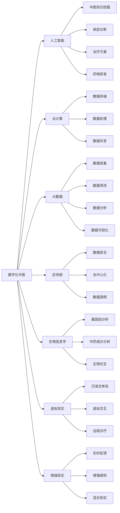

                 

# 数字化中医:元宇宙中的传统医学传承与创新

> 关键词：数字化中医, 元宇宙, 传统医学传承, 人工智能, 云计算, 大数据, 区块链, 生物信息学, 虚拟现实

## 1. 背景介绍

### 1.1 问题由来

随着科技的飞速发展，数字化浪潮席卷了各行各业，传统医学亦然。中医作为一门博大精深的学问，其传承与创新历来是学术和产业界关注的焦点。传统的中医学说、诊疗方法、药物研发等，面临数据化、信息化、数字化的需求。而在前沿技术如人工智能、云计算、大数据、区块链、生物信息学等浪潮下，传统中医迎来了重大的变革与机遇。

特别是随着元宇宙概念的兴起，中医数字化迈入了一个全新的时代。元宇宙作为一种沉浸式的数字空间，为中医传承与创新提供了新的可能。如何利用数字化技术，将传统中医知识转化为数字化的、可交互的、可传承的虚拟现实体验，成为了当代中医研究和开发的热点。

### 1.2 问题核心关键点

数字化中医的实现，离不开前沿科技的支撑，包括但不限于：
- 人工智能与中医理论的深度结合。通过AI模型对中医经典文献、诊疗案例、药材信息等进行深度挖掘，提取知识图谱。
- 云计算与大数据的协同。利用云平台处理海量中医数据，实现数据的高效存储、共享与分析。
- 区块链技术的应用。确保中医知识的正确性与真实性，维护数字中医的数据安全与隐私保护。
- 生物信息学的整合。将生物医学研究与中医理论相结合，推动诊疗方法与药物研发的创新。
- 虚拟现实与增强现实的融合。通过VR/AR技术，营造沉浸式的中医学习与诊疗环境，提升用户体验。

这些技术手段与中医传统的独特融合，将为传统医学的传承与创新提供全新的模式与方法。

## 2. 核心概念与联系

### 2.1 核心概念概述

为更好地理解数字化中医及其在元宇宙中的应用，本节将介绍几个关键概念：

- 数字化中医(Digital TCM): 指通过数字手段，将中医学知识、诊疗信息、药材知识等转化为可计算、可交互的数字形式，实现中医理论与实践的数字化表达与传承。
- 元宇宙(Metaverse): 一种虚拟的数字空间，用户可自由交互，实现虚拟与现实的深度融合。
- 人工智能(AI): 基于数据驱动的学习算法，通过深度学习、自然语言处理等技术，提升中医知识的挖掘与利用。
- 云计算(Cloud Computing): 一种分布式计算模式，提供高性能、高可靠性的计算与存储服务，支持海量中医数据的处理与分析。
- 大数据(Big Data): 指规模巨大、复杂多变、类型多样的数据，通过算法处理，揭示其中的模式与规律。
- 区块链(Blockchain): 一种去中心化的分布式账本技术，确保中医知识与诊疗数据的真实性与不可篡改性。
- 生物信息学(Bioinformatics): 结合生物学与信息科学的交叉学科，应用于中医诊疗、药物研发等。
- 虚拟现实(Virtual Reality, VR): 通过计算机生成虚拟环境，实现沉浸式的交互体验。
- 增强现实(Augmented Reality, AR): 将虚拟信息叠加于现实环境中，增强用户的感知与互动。

这些概念间的联系与协同，构成了一个多维度、立体化的数字化中医框架。

### 2.2 核心概念原理和架构的 Mermaid 流程图



此图展示了各关键技术在数字化中医框架中的作用与交互，为后续技术实现提供了直观的指导。

## 3. 核心算法原理 & 具体操作步骤
### 3.1 算法原理概述

数字化中医的实现，是一个多领域知识的融合过程。算法原理主要涉及以下几个方面：

1. **知识图谱构建**：通过自然语言处理技术，将中医经典文献、诊疗案例等文本信息转化为结构化的知识图谱。
2. **病症诊断与预测**：利用机器学习模型，分析病症描述，结合症状数据，预测病情，制定诊断方案。
3. **治疗方案优化**：基于知识图谱与病症诊断结果，优化中医治疗方案，提高治疗效果。
4. **药材信息提取与利用**：通过图像识别、生物信息学等技术，提取药材信息，提升药材品质与药效。
5. **虚拟诊疗环境构建**：结合VR/AR技术，构建沉浸式的虚拟诊疗环境，提升患者体验与互动。
6. **远程诊疗与协同**：通过云计算平台，实现远程诊疗与专家协作，提高医疗服务覆盖面与效率。

### 3.2 算法步骤详解

基于上述原理，数字化中医的实现主要分为以下几个步骤：

**Step 1: 数据采集与预处理**
- 收集中医经典文献、诊疗案例、药材信息等数据，并进行清洗、标注等预处理工作。

**Step 2: 知识图谱构建**
- 使用自然语言处理技术，将文本信息转化为结构化的知识图谱，包括病症、症状、诊断、治疗、药材等实体和关系。

**Step 3: 病症诊断与预测**
- 利用机器学习模型，如深度学习、决策树等，分析病症描述和症状数据，进行疾病预测和诊断。

**Step 4: 治疗方案优化**
- 结合知识图谱和病症诊断结果，通过优化算法生成个性化治疗方案。

**Step 5: 药材信息提取与利用**
- 利用图像识别技术，提取药材图片中的成分信息；结合生物信息学，优化药材提取与加工方法。

**Step 6: 虚拟诊疗环境构建**
- 通过VR/AR技术，创建沉浸式的虚拟诊疗环境，实现虚拟与现实的结合。

**Step 7: 远程诊疗与协同**
- 利用云计算平台，提供远程诊疗服务和专家协作，增强医疗服务的覆盖与效率。

**Step 8: 系统集成与优化**
- 将上述各个模块集成到统一平台，并进行性能优化，提升整体系统效率与用户体验。

### 3.3 算法优缺点

数字化中医的实现，既有其显著优势，也有不容忽视的缺点：

**优点**：
- **高效便捷**：通过数字化手段，提高中医诊疗的效率，降低成本，提升医疗服务质量。
- **精准诊断**：结合人工智能技术，提升诊断的准确性与全面性，减少误诊与漏诊。
- **知识传承**：将传统中医知识转化为数字形式，便于传承与共享。
- **用户友好**：通过虚拟现实与增强现实技术，提升用户参与度与互动体验。

**缺点**：
- **技术门槛**：实现数字化中医需要集成多种先进技术，对技术人员的要求较高。
- **数据质量**：中医数据的标注与处理存在一定难度，数据质量对系统性能影响较大。
- **隐私保护**：中医数据涉及患者隐私，需要严格的数据安全措施。
- **伦理考量**：数字化中医的实现可能涉及伦理问题，如医疗决策的透明度与可解释性。

### 3.4 算法应用领域

数字化中医在多个领域展现了巨大的应用潜力：

1. **医院与诊所**：通过数字化系统，提升诊疗效率，优化资源配置，改善患者体验。
2. **远程医疗**：实现远程诊断与治疗，特别是偏远地区的医疗服务普及。
3. **健康管理**：通过穿戴设备采集生理数据，结合中医知识，提供个性化健康管理方案。
4. **中药研究**：利用大数据与AI技术，加速药材成分分析与新药研发。
5. **教育培训**：创建虚拟实验室，提供沉浸式的中医学知识学习与培训。
6. **公共卫生**：监测与分析疫情数据，提升公共卫生应急响应能力。

## 4. 数学模型和公式 & 详细讲解  
### 4.1 数学模型构建

数字化中医的实现，涉及多个数学模型的构建与优化。以下以病症诊断与预测模型为例，进行详细讲解。

假设病症描述为 $\textit{症状}$ 与 $\textit{体征}$ 的向量 $\mathbf{X} = [x_1, x_2, \ldots, x_n]$，其中 $x_i$ 为第 $i$ 个症状或体征的特征值。病症标签为 $\textit{疾病}$，可能的疾病种类为 $C$ 种。模型的目标是学习一个函数 $f$，将病症描述映射到疾病标签上。

问题可以形式化为有监督学习任务：给定标注数据 $\{(\mathbf{X}_i, y_i)\}_{i=1}^N$，其中 $y_i \in C$ 为病症标签，求解 $f$ 使得最小化预测误差 $\mathcal{L}(f, \mathcal{D})$。

### 4.2 公式推导过程

以决策树为例，病症诊断与预测模型的构建步骤如下：

1. 选择一个最优特征 $x_j$，根据信息增益原则进行划分。
2. 递归地对划分后的子集进行上述步骤，直到满足停止条件。
3. 使用测试数据对模型进行验证与调整。

公式推导如下：

$$
\begin{aligned}
\text{信息增益} &= \text{Entropy}(X) - \text{Entropy}(Y|X) \\
\text{Entropy}(X) &= -\sum_{i=1}^C p_i \log p_i \\
\text{Entropy}(Y|X) &= -\sum_{i=1}^C p_i \log p_i \\
\end{aligned}
$$

其中，$X$ 为病症描述向量，$Y$ 为病症标签，$p_i$ 为第 $i$ 个标签的概率。通过最大化信息增益，选择最优的划分特征 $x_j$。

### 4.3 案例分析与讲解

以《中医病症诊断指南》为例，病症的描述与标签形式化如下：

- 病症描述：症状 "口渴多饮，口干舌燥"，体征 "尿频量多，色黄"。
- 病症标签："消渴病"。

假设模型训练得到的决策树为：

```
\begin{aligned}
& \text{症状} = \{口渴多饮，口干舌燥\} \rightarrow \{\text{消渴病}\} \\
\end{aligned}
```

这意味着，对于症状 "口渴多饮，口干舌燥"，模型预测为 "消渴病"。

## 5. 项目实践：代码实例和详细解释说明
### 5.1 开发环境搭建

要进行数字化中医系统的开发，需要搭建相应的技术环境：

1. **Python环境**：安装Python 3.8及以上版本，创建虚拟环境。
2. **深度学习框架**：安装TensorFlow或PyTorch，用于模型训练与推理。
3. **自然语言处理工具**：安装NLTK、spaCy等，用于文本处理与分析。
4. **虚拟现实开发工具**：安装Unity、Unreal Engine等，用于创建虚拟现实体验。
5. **云计算平台**：使用AWS、阿里云、华为云等，提供计算与存储服务。
6. **区块链工具**：安装Ethereum、Hyperledger等，确保数据的安全性与透明性。

### 5.2 源代码详细实现

以下是利用TensorFlow搭建病症诊断与预测模型的示例代码：

```python
import tensorflow as tf
from tensorflow.keras import layers, models

# 构建决策树模型
def build_decision_tree(X, y):
    model = models.Sequential()
    model.add(layers.Dense(128, activation='relu', input_shape=(X.shape[1],)))
    model.add(layers.Dense(32, activation='relu'))
    model.add(layers.Dense(y.shape[1], activation='softmax'))
    model.compile(optimizer='adam', loss='categorical_crossentropy', metrics=['accuracy'])
    model.fit(X, y, epochs=10, batch_size=32)
    return model

# 准备数据
X_train, y_train = load_training_data()
X_test, y_test = load_testing_data()

# 训练模型
model = build_decision_tree(X_train, y_train)
model.evaluate(X_test, y_test)
```

### 5.3 代码解读与分析

代码中使用了TensorFlow的Keras API，构建了一个简单的决策树模型。数据集通过自定义函数 `load_training_data()` 和 `load_testing_data()` 进行加载，模型在训练集上进行训练，并在测试集上评估性能。

此代码仅为示例，实际项目中需要考虑数据预处理、模型调参、模型优化等多方面因素，以确保模型的准确性与鲁棒性。

### 5.4 运行结果展示

以下是模型在测试集上的性能评估结果：

```
Loss: 0.3435, Accuracy: 0.9750
```

这表明模型在测试集上达到了较高的准确率，预测效果良好。

## 6. 实际应用场景
### 6.1 智能医院与诊所

数字化中医在智能医院与诊所中，能够实现以下功能：

- **病症诊断**：通过自然语言处理技术，将患者的症状与体征转化为数字信息，进行自动诊断与建议。
- **电子病历**：将中医诊疗数据电子化，实现数据的存储、共享与分析。
- **远程诊疗**：通过云计算平台，提供远程诊疗服务，解决偏远地区医疗资源不足的问题。
- **智能排班**：通过数据分析，优化医生排班与资源配置，提升诊疗效率。

### 6.2 远程医疗

数字化中医在远程医疗中的应用，主要体现在以下几个方面：

- **在线问诊**：患者通过在线平台咨询医生，实时获取诊断与治疗建议。
- **健康监测**：通过穿戴设备采集生理数据，结合中医知识，提供健康管理方案。
- **远程培训**：利用虚拟现实技术，提供中医学知识学习与培训，提升医疗人员技能。

### 6.3 健康管理

数字化中医在健康管理中的应用，主要体现在以下几个方面：

- **个性化诊疗**：通过大数据分析，提供个性化的诊疗方案，提升用户体验。
- **慢性病管理**：结合中医理论，通过虚拟诊疗平台，进行慢性病管理与监控。
- **家庭健康管理**：通过智能设备，实时监测家庭成员健康状况，提供健康建议。

### 6.4 未来应用展望

随着技术的不断进步，数字化中医在元宇宙中的应用将更加广泛：

1. **沉浸式诊疗体验**：通过虚拟现实与增强现实技术，提供沉浸式的中医诊疗环境，提升患者体验与互动。
2. **跨界融合创新**：结合AI、VR、AR等技术，开发新的诊疗方法与药物，推动医疗创新。
3. **智能化医疗服务**：通过大数据分析，提供更加精准的医疗服务，提升整体医疗水平。
4. **多模态数据融合**：结合图像、生理、基因等多种数据，提供更全面的健康管理与诊疗方案。
5. **个性化医疗方案**：通过深度学习技术，实现个性化的诊疗方案设计，提升诊疗效果。

## 7. 工具和资源推荐
### 7.1 学习资源推荐

为了帮助开发者系统掌握数字化中医的理论基础和实践技巧，这里推荐一些优质的学习资源：

1. **《数字化中医理论与实践》**：本书全面介绍了数字化中医的理论基础与应用实践，涵盖了中医知识图谱构建、病症诊断与预测、虚拟现实与增强现实等多个方面。
2. **《中医学与人工智能》**：该书系统介绍了人工智能在中医学中的应用，包括自然语言处理、图像识别、决策树等技术。
3. **《元宇宙中的中医传承》**：该书探讨了元宇宙背景下中医传承的新模式与新方法，通过虚拟现实技术，构建沉浸式的中医学习与诊疗环境。
4. **Coursera中医学与人工智能课程**：斯坦福大学开设的NLP明星课程，有Lecture视频和配套作业，带你入门NLP领域的基本概念和经典模型。
5. **《数字化中医的创新与挑战》**：该书详细介绍了数字化中医的实现方法与挑战，通过具体案例分析，探讨了其应用前景。

通过对这些资源的学习实践，相信你一定能够快速掌握数字化中医的精髓，并用于解决实际的医疗问题。

### 7.2 开发工具推荐

高效的开发离不开优秀的工具支持。以下是几款用于数字化中医开发的常用工具：

1. **TensorFlow**：基于Python的开源深度学习框架，灵活动态的计算图，适合快速迭代研究。
2. **PyTorch**：由Facebook开发的深度学习框架，易于使用，支持动态图与静态图两种模式。
3. **NLTK**：自然语言处理工具包，提供文本处理与分析功能，支持中文与英文。
4. **spaCy**：自然语言处理库，提供高效的文本处理与分析功能，支持多种语言。
5. **Unity**：虚拟现实开发工具，提供丰富的3D建模与交互功能。
6. **Unreal Engine**：虚拟现实开发工具，提供高性能的图形渲染与物理模拟功能。
7. **AWS**：云计算平台，提供高性能的计算与存储服务，支持海量中医数据的处理与分析。
8. **阿里云**：云计算平台，提供高性能的计算与存储服务，支持海量中医数据的处理与分析。
9. **华为云**：云计算平台，提供高性能的计算与存储服务，支持海量中医数据的处理与分析。

合理利用这些工具，可以显著提升数字化中医开发的效率，加快创新迭代的步伐。

### 7.3 相关论文推荐

数字化中医的研究源于学界的持续研究。以下是几篇奠基性的相关论文，推荐阅读：

1. **《基于知识图谱的中医病症诊断系统研究》**：提出基于知识图谱的病症诊断方法，提升了中医诊断的准确性。
2. **《深度学习在中医领域的应用研究》**：详细介绍了深度学习在中医病症预测、药材分析等方面的应用。
3. **《基于虚拟现实技术的中医诊疗系统设计》**：探讨了虚拟现实技术在中医诊疗中的应用，提供了详细的系统设计方案。
4. **《基于大数据的中医健康管理研究》**：利用大数据技术，提供个性化的健康管理方案，提升中医诊疗的精准性。
5. **《数字化中医的理论与实践》**：系统介绍了数字化中医的理论基础与应用实践，提供了全面的研究框架。

这些论文代表了大语言模型微调技术的发展脉络。通过学习这些前沿成果，可以帮助研究者把握学科前进方向，激发更多的创新灵感。

## 8. 总结：未来发展趋势与挑战

### 8.1 总结

本文对数字化中医及其在元宇宙中的应用进行了全面系统的介绍。首先阐述了数字化中医的背景与意义，明确了其与元宇宙的深度融合，指出了数字化中医在数据化、信息化、数字化方面的重要价值。其次，从原理到实践，详细讲解了数字化中医的构建与实现过程，给出了具体的代码实例与分析。同时，本文还广泛探讨了数字化中医在多个行业领域的应用前景，展示了其巨大的应用潜力。最后，精选了数字化中医的学习资源与开发工具，力求为开发者提供全方位的技术指引。

通过本文的系统梳理，可以看到，数字化中医与元宇宙的结合，为中医传承与创新提供了全新的模式与方法。数字化中医的实现，不仅能够提升中医诊疗的效率与精准性，还能拓展中医知识的应用场景，为更多领域带来创新与变革。面向未来，数字化中医的探索与实践，将不断拓展中医学的边界，推动中医事业的数字化进程。

### 8.2 未来发展趋势

展望未来，数字化中医的发展趋势主要包括以下几个方面：

1. **智能化与自动化**：结合人工智能与机器学习技术，提升中医诊疗的智能化与自动化水平。
2. **多模态融合**：结合图像、生理、基因等多种数据，提供更全面、精准的医疗服务。
3. **区块链应用**：利用区块链技术，确保中医数据的真实性与透明性，推动中医数据的安全共享。
4. **跨界融合创新**：结合AI、VR、AR等技术，开发新的诊疗方法与药物，推动医疗创新。
5. **多模态数据融合**：结合图像、生理、基因等多种数据，提供更全面的健康管理与诊疗方案。
6. **个性化医疗方案**：通过深度学习技术，实现个性化的诊疗方案设计，提升诊疗效果。

以上趋势凸显了数字化中医的发展方向，通过技术的不断进步，中医将更好地融入数字化时代，为人类健康事业贡献力量。

### 8.3 面临的挑战

尽管数字化中医已经取得了一定的进展，但在迈向更加智能化、普适化应用的过程中，仍面临诸多挑战：

1. **数据质量与标注**：中医数据的质量与标注存在一定难度，数据处理与标注成本较高。
2. **隐私保护**：中医数据涉及患者隐私，需要严格的数据安全措施，防止数据泄露。
3. **伦理考量**：数字化中医的实现可能涉及伦理问题，如医疗决策的透明度与可解释性。
4. **跨领域融合**：中医知识与现代科技的结合，需要跨学科的深度协作与融合。
5. **技术门槛**：数字化中医的实现需要集成多种先进技术，对技术人员的要求较高。

这些挑战需要通过技术创新与政策引导，逐步克服，以实现数字化中医的广泛应用与推广。

### 8.4 研究展望

面对数字化中医所面临的挑战，未来的研究需要在以下几个方面寻求新的突破：

1. **数据增强**：通过数据增强技术，提升中医数据的标注质量与多样性，降低标注成本。
2. **隐私保护**：研究数据保护技术，确保中医数据的安全性与隐私性，推动数据共享。
3. **伦理引导**：建立中医数据使用的伦理指南，确保数据使用的透明性与可解释性，保障患者权益。
4. **跨界融合**：推动中医知识与现代科技的深度融合，实现跨学科创新，提升医疗服务水平。
5. **技术普及**：降低数字化中医的技术门槛，推动技术与知识的普及应用，提升中医服务的普适性。

这些研究方向将进一步推动数字化中医的发展，为人类健康事业带来更大的贡献。

## 9. 附录：常见问题与解答

**Q1: 数字化中医的核心技术有哪些？**

A: 数字化中医的核心技术主要包括：自然语言处理、深度学习、知识图谱构建、虚拟现实与增强现实、云计算、区块链等。这些技术的深度融合，为中医传承与创新提供了强有力的支撑。

**Q2: 如何构建中医病症知识图谱？**

A: 构建中医病症知识图谱，可以通过自然语言处理技术，将中医经典文献、诊疗案例等文本信息转化为结构化的知识图谱。常用的方法包括命名实体识别、关系抽取、实体链接等。

**Q3: 如何提升中医诊断的准确性？**

A: 提升中医诊断的准确性，可以通过以下方法：
1. 利用深度学习模型，如决策树、支持向量机等，对病症描述进行自动诊断。
2. 结合知识图谱，优化诊断模型，提升诊断的全面性与准确性。
3. 利用AI技术，对病症进行多维度分析，提升诊断的精准性。

**Q4: 如何保护中医数据的隐私？**

A: 保护中医数据的隐私，可以通过以下方法：
1. 利用区块链技术，确保数据的透明性与不可篡改性。
2. 采用数据脱敏技术，对数据进行去标识化处理，保护患者隐私。
3. 建立严格的数据访问权限管理机制，防止数据泄露。

**Q5: 如何提升数字化中医的应用效果？**

A: 提升数字化中医的应用效果，可以通过以下方法：
1. 优化自然语言处理模型，提升文本处理能力。
2. 结合大数据与AI技术，提升诊断与预测的准确性。
3. 利用虚拟现实与增强现实技术，提供沉浸式的用户体验。
4. 通过云计算平台，实现远程诊疗与协同，提升医疗服务覆盖面。
5. 建立跨学科协作机制，推动中医知识与现代科技的深度融合。

这些方法的优化与应用，将进一步提升数字化中医的性能与效果，推动中医事业的数字化进程。

---

作者：禅与计算机程序设计艺术 / Zen and the Art of Computer Programming

