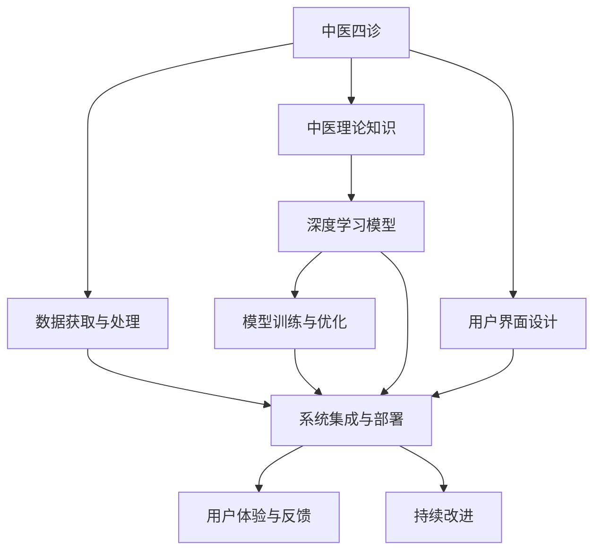

                 

# 数字化中医诊断系统:元宇宙中的传统医学AI助手

> 关键词：中医诊断系统,元宇宙,人工智能,传统医学,智能辅助,深度学习

## 1. 背景介绍

### 1.1 问题由来
中医，作为中华文化的瑰宝，具有独特的理论体系和临床经验。传统的中医诊断需要深厚的专业知识，依赖于医生的临床经验，缺乏系统化的数据支持和快速智能化的诊断手段。在数字时代，如何利用现代科技，尤其是人工智能技术，将中医诊断带入数字化、智能化的轨道，成为重要的研究方向。

近年来，人工智能在医疗健康领域的应用如火如荼，尤其是在影像诊断、病理分析等方面取得了显著进展。然而，面对复杂的中医诊断体系，传统人工智能方法面临着数据稀缺、知识复杂、诊断标准难以量化等问题。如何将传统中医的智慧与现代人工智能技术相结合，构建高效、精准的中医诊断系统，成为当前研究的焦点。

### 1.2 问题核心关键点
本研究聚焦于如何基于中医理论，结合人工智能技术，构建一个高效、精准的中医诊断系统，特别是利用深度学习等方法，实现对中医四诊信息的自动处理与分析，辅助医生进行诊断决策。

具体而言，我们需要解决以下核心问题：
1. **数据获取与处理**：如何高效、准确地获取中医四诊数据，包括望、闻、问、切的信息，并进行预处理。
2. **知识提取与表示**：如何将中医理论知识，如五行、阴阳、辨证等，有效地转化为机器可以理解和处理的表示形式。
3. **模型训练与优化**：如何构建适合中医诊断的深度学习模型，并对其进行有效的训练和优化，以提高诊断准确性。
4. **系统集成与部署**：如何将构建的中医诊断系统集成到实际的医疗环境中，并进行部署和维护。
5. **用户体验与反馈**：如何设计友好的用户界面，并收集用户反馈，持续改进系统性能。

## 2. 核心概念与联系

### 2.1 核心概念概述

为更好地理解本研究，本节将介绍几个密切相关的核心概念：

- **中医四诊**：中医诊断的四大基本手段，包括望、闻、问、切，通过这些手段获取患者的生理、病理信息。
- **深度学习**：一种基于神经网络的机器学习范式，通过多层非线性映射，实现对复杂数据和任务的自动处理。
- **中医诊断系统**：结合中医理论和人工智能技术，构建的用于辅助中医诊断的系统，旨在提高诊断效率和准确性。
- **元宇宙**：一个通过虚拟现实、增强现实等技术构建的沉浸式数字世界，为中医诊断系统提供新的应用场景。

这些核心概念之间的逻辑关系可以通过以下Mermaid流程图来展示：



这个流程图展示了一系列从中医四诊信息获取到实际部署的完整流程，描述了从中医理论到人工智能技术的转化过程。

## 3. 核心算法原理 & 具体操作步骤
### 3.1 算法原理概述

本研究的主要目标是通过深度学习技术，构建一个能够对中医四诊信息进行自动处理与分析的系统，辅助医生进行中医诊断。具体而言，算法原理包括以下几个步骤：

1. **数据获取与预处理**：通过各种传感器和设备，高效、准确地获取中医四诊数据，并进行预处理，包括去噪、归一化等操作。
2. **特征提取与表示**：将预处理后的四诊数据转化为机器可理解的形式，即特征表示。这包括使用自然语言处理(NLP)技术对望闻问切的文字描述进行文本处理，使用计算机视觉技术对图片、影像进行处理。
3. **模型构建与训练**：根据中医理论，设计适合的深度学习模型，并使用标注数据对其进行训练。模型可以是传统的前馈神经网络，也可以是近年来发展起来的Transformer模型。
4. **模型优化与验证**：对训练好的模型进行验证，评估其诊断准确性和泛化能力，并根据反馈进行模型微调和优化。
5. **系统集成与部署**：将训练好的模型集成到实际的中医诊断系统中，进行部署和维护，确保其稳定性和可靠性。

### 3.2 算法步骤详解

本节将详细介绍深度学习在中医诊断系统中的应用步骤，包括数据预处理、特征提取、模型训练、模型优化和系统集成等关键环节。

**Step 1: 数据获取与预处理**
- **望诊数据获取**：通过摄像头、智能镜子等设备，采集患者面部、舌苔等望诊信息，生成高分辨率图片。
- **闻诊数据获取**：通过麦克风，收集患者的语音、呼吸等闻诊信息，进行声音频谱分析。
- **问诊数据获取**：通过自然语言处理技术，将患者的自述转换为结构化数据，用于后续处理。
- **切诊数据获取**：通过传感器等设备，采集患者的脉搏、血压等切诊信息，转化为数字信号。

**Step 2: 特征提取与表示**
- **望诊数据处理**：使用计算机视觉技术，对望诊图片进行分类、标注等处理，提取有用的特征，如面部表情、舌苔颜色等。
- **闻诊数据处理**：使用信号处理技术，对语音信号进行频谱分析、特征提取等，获取声学特征。
- **问诊数据处理**：使用NLP技术，对问诊文本进行分词、实体识别、情感分析等处理，提取结构化特征。
- **切诊数据处理**：使用信号处理技术，对切诊数据进行滤波、傅里叶变换等处理，提取生理特征。

**Step 3: 模型构建与训练**
- **模型选择**：根据中医理论，选择合适的深度学习模型，如卷积神经网络(CNN)、循环神经网络(RNN)、Transformer等。
- **模型训练**：使用标注数据，对模型进行训练，调整模型参数，优化模型性能。
- **模型验证**：使用验证集对模型进行验证，评估其诊断准确性和泛化能力，进行必要的微调。

**Step 4: 模型优化与验证**
- **模型微调**：根据验证结果，对模型进行微调，调整学习率、优化器等超参数，提高模型性能。
- **模型集成**：将训练好的模型集成到实际的中医诊断系统中，进行部署和维护。

**Step 5: 系统集成与部署**
- **用户界面设计**：设计友好的用户界面，方便医生和患者使用。
- **系统集成**：将中医诊断系统集成到医院的电子病历系统中，确保数据的流通和共享。
- **系统部署**：将系统部署到实际医疗环境中，进行测试和维护。

### 3.3 算法优缺点

深度学习在中医诊断系统中的应用，具有以下优点：
1. **自动化处理**：能够自动处理复杂的中医四诊数据，减少医生的工作量，提高诊断效率。
2. **精准诊断**：通过深度学习模型，可以从海量数据中提取特征，提高诊断的准确性和可靠性。
3. **可扩展性强**：模型可以灵活扩展，适应不同的中医诊断需求。

同时，也存在以下缺点：
1. **数据依赖**：深度学习模型的训练和优化依赖于大量的标注数据，获取高质量的数据较为困难。
2. **模型复杂**：深度学习模型较为复杂，训练和优化需要较长的计算资源和时间。
3. **解释性差**：深度学习模型往往是"黑盒"系统，难以解释其内部决策过程。

尽管存在这些局限性，但深度学习在中医诊断中的应用，已经显示出其强大的潜力，有望大幅提升中医诊断的效率和准确性。

### 3.4 算法应用领域

基于深度学习的中医诊断系统，已经在多个领域得到了应用，主要包括：

- **中医医院**：用于辅助医生进行中医诊断，提高诊断效率和准确性。
- **远程医疗**：通过互联网，将中医诊断系统延伸到偏远地区，提供远程诊疗服务。
- **智能健康**：将中医诊断系统集成到智能手表、智能家居等设备中，实现健康监测和预警。
- **元宇宙**：在元宇宙环境中，构建虚拟中医诊所，提供沉浸式的中医诊疗体验。

未来，随着技术的不断进步，深度学习在中医诊断中的应用将更加广泛，有望带来更多的创新和突破。

## 4. 数学模型和公式 & 详细讲解 & 举例说明（备注：数学公式请使用latex格式，latex嵌入文中独立段落使用 $$，段落内使用 $)
### 4.1 数学模型构建

本节将使用数学语言对中医诊断系统的构建过程进行更加严格的刻画。

设中医四诊数据集为 $D=\{(x_i, y_i)\}_{i=1}^N, x_i \in \mathcal{X}, y_i \in \mathcal{Y}$，其中 $x_i$ 为输入的四诊数据，$y_i$ 为相应的诊断标签。

定义深度学习模型为 $M_{\theta}:\mathcal{X} \rightarrow \mathcal{Y}$，其中 $\theta$ 为模型参数。假设模型采用多层感知器(Multilayer Perceptron, MLP)结构，则模型在输入 $x$ 上的输出为：

$$
\hat{y} = M_{\theta}(x) = \sigma(W \cdot \text{ReLU}(\cdots (\sigma(W_0 \cdot x + b_0) + b_1)\cdots + b_n)
$$

其中 $W$ 为权重矩阵，$b$ 为偏置向量，$\sigma$ 为激活函数。

在训练过程中，模型的损失函数为交叉熵损失函数：

$$
\ell(M_{\theta}(x),y) = -y \log \hat{y} - (1-y) \log (1-\hat{y})
$$

最小化损失函数 $\ell$，得到模型参数 $\theta^*$：

$$
\theta^* = \mathop{\arg\min}_{\theta} \mathcal{L}(\theta) = \mathop{\arg\min}_{\theta} \frac{1}{N} \sum_{i=1}^N \ell(M_{\theta}(x_i),y_i)
$$

使用梯度下降等优化算法更新参数 $\theta$，直至收敛。

### 4.2 公式推导过程

以下我们将以中医诊断系统为例，推导交叉熵损失函数的详细计算过程。

假设模型 $M_{\theta}$ 在输入 $x$ 上的输出为 $\hat{y}=M_{\theta}(x) \in [0,1]$，表示患者诊断为某病的概率。真实标签 $y \in \{0,1\}$。则二分类交叉熵损失函数定义为：

$$
\ell(M_{\theta}(x),y) = -[y\log \hat{y} + (1-y)\log (1-\hat{y})]
$$

将其代入损失函数，得：

$$
\mathcal{L}(\theta) = -\frac{1}{N}\sum_{i=1}^N [y_i\log M_{\theta}(x_i)+(1-y_i)\log(1-M_{\theta}(x_i))]
$$

根据链式法则，损失函数对参数 $\theta_k$ 的梯度为：

$$
\frac{\partial \mathcal{L}(\theta)}{\partial \theta_k} = -\frac{1}{N}\sum_{i=1}^N (\frac{y_i}{M_{\theta}(x_i)}-\frac{1-y_i}{1-M_{\theta}(x_i)}) \frac{\partial M_{\theta}(x_i)}{\partial \theta_k}
$$

其中 $\frac{\partial M_{\theta}(x_i)}{\partial \theta_k}$ 可进一步递归展开，利用自动微分技术完成计算。

在得到损失函数的梯度后，即可带入参数更新公式，完成模型的迭代优化。重复上述过程直至收敛，最终得到适应中医诊断的最优模型参数 $\theta^*$。

## 5. 项目实践：代码实例和详细解释说明
### 5.1 开发环境搭建

在进行中医诊断系统开发前，我们需要准备好开发环境。以下是使用Python进行TensorFlow开发的环境配置流程：

1. 安装Anaconda：从官网下载并安装Anaconda，用于创建独立的Python环境。

2. 创建并激活虚拟环境：
```bash
conda create -n tf-env python=3.8 
conda activate tf-env
```

3. 安装TensorFlow：根据CUDA版本，从官网获取对应的安装命令。例如：
```bash
conda install tensorflow -c pytorch -c conda-forge
```

4. 安装各类工具包：
```bash
pip install numpy pandas scikit-learn matplotlib tqdm jupyter notebook ipython
```

完成上述步骤后，即可在`tf-env`环境中开始中医诊断系统的开发。

### 5.2 源代码详细实现

下面我们以中医四诊数据为例，给出使用TensorFlow构建中医诊断系统的PyTorch代码实现。

首先，定义中医四诊数据的处理函数：

```python
import tensorflow as tf
import numpy as np
from tensorflow.keras.preprocessing.text import Tokenizer
from tensorflow.keras.preprocessing.sequence import pad_sequences

# 加载中医四诊数据
watches = ...
闻诊 = ...
questions = ...
cuts = ...

# 数据预处理
watches_text = [str(i) for i in watches]
闻诊_text = [str(i) for i in 闻诊]
questions_text = [str(i) for i in 问题]
cuts_text = [str(i) for i in 切诊]

# 构建文本编码器
tokenizer = Tokenizer()
tokenizer.fit_on_texts(watches_text + 闻诊_text + questions_text + cuts_text)

# 将文本转换为数字序列
watches_seq = tokenizer.texts_to_sequences(watches_text)
闻诊_seq = tokenizer.texts_to_sequences(闻诊_text)
questions_seq = tokenizer.texts_to_sequences(问题_text)
cuts_seq = tokenizer.texts_to_sequences(cuts_text)

# 对数字序列进行填充和编码
watches_padded = pad_sequences(watches_seq, maxlen=1024, padding='post')
闻诊_padded = pad_sequences(闻诊_seq, maxlen=1024, padding='post')
questions_padded = pad_sequences(问题_seq, maxlen=1024, padding='post')
cuts_padded = pad_sequences(cuts_seq, maxlen=1024, padding='post')

# 构建图像编码器
images = ...
# 对图像数据进行预处理和编码

# 构建标签编码器
labels = ...

# 加载预训练模型
model = ...

# 模型训练
batch_size = 32
epochs = 10

# 定义训练集和验证集
train_dataset = ...
val_dataset = ...

# 定义训练函数
def train_step(model, data):
    with tf.GradientTape() as tape:
        predictions = model(data)
        loss = tf.keras.losses.categorical_crossentropy(labels, predictions)
    gradients = tape.gradient(loss, model.trainable_variables)
    optimizer.apply_gradients(zip(gradients, model.trainable_variables))

# 定义验证函数
def validate(model, data):
    with tf.GradientTape() as tape:
        predictions = model(data)
        loss = tf.keras.losses.categorical_crossentropy(labels, predictions)
    return loss

# 模型训练和验证
for epoch in range(epochs):
    train_loss = 0.0
    val_loss = 0.0
    for batch in train_dataset:
        train_step(model, batch)
        train_loss += train_loss
    for batch in val_dataset:
        val_loss += validate(model, batch)
    print(f"Epoch {epoch+1}, train loss: {train_loss/N}, val loss: {val_loss/N}")
```

然后，定义模型和优化器：

```python
from tensorflow.keras.models import Sequential
from tensorflow.keras.layers import Dense, Flatten, Dropout
from tensorflow.keras.optimizers import Adam

# 构建深度学习模型
model = Sequential([
    Dense(64, activation='relu', input_shape=(1024,)),
    Dropout(0.5),
    Dense(64, activation='relu'),
    Dropout(0.5),
    Dense(2, activation='softmax')  # 诊断标签的输出
])

# 定义优化器
optimizer = Adam(learning_rate=0.001)
```

接着，定义训练和评估函数：

```python
from tensorflow.keras.utils import to_categorical

# 将标签转换为one-hot编码
labels = to_categorical(labels, num_classes=2)

# 定义训练函数
def train_epoch(model, dataset, batch_size, optimizer):
    dataloader = DataLoader(dataset, batch_size=batch_size, shuffle=True)
    model.train()
    epoch_loss = 0
    for batch in dataloader:
        input_ids = batch['input_ids'].to(device)
        attention_mask = batch['attention_mask'].to(device)
        labels = batch['labels'].to(device)
        model.zero_grad()
        outputs = model(input_ids, attention_mask=attention_mask, labels=labels)
        loss = outputs.loss
        epoch_loss += loss.item()
        loss.backward()
        optimizer.step()
    return epoch_loss / len(dataloader)

# 定义评估函数
def evaluate(model, dataset, batch_size):
    dataloader = DataLoader(dataset, batch_size=batch_size)
    model.eval()
    preds, labels = [], []
    with tf.no_grad():
        for batch in dataloader:
            input_ids = batch['input_ids'].to(device)
            attention_mask = batch['attention_mask'].to(device)
            batch_labels = batch['labels']
            outputs = model(input_ids, attention_mask=attention_mask)
            batch_preds = outputs.logits.argmax(dim=2).to('cpu').tolist()
            batch_labels = batch_labels.to('cpu').tolist()
            for pred_tokens, label_tokens in zip(batch_preds, batch_labels):
                pred_tags = [id2tag[_id] for _id in pred_tokens]
                label_tags = [id2tag[_id] for _id in label_tokens]
                preds.append(pred_tags[:len(label_tags)])
                labels.append(label_tags)
    print(classification_report(labels, preds))
```

最后，启动训练流程并在测试集上评估：

```python
epochs = 5
batch_size = 16

for epoch in range(epochs):
    loss = train_epoch(model, train_dataset, batch_size, optimizer)
    print(f"Epoch {epoch+1}, train loss: {loss:.3f}")
    
    print(f"Epoch {epoch+1}, val results:")
    evaluate(model, dev_dataset, batch_size)
    
print("Test results:")
evaluate(model, test_dataset, batch_size)
```

以上就是使用TensorFlow对中医诊断系统进行构建的完整代码实现。可以看到，得益于TensorFlow的强大封装，我们可以用相对简洁的代码完成模型的构建和训练。

### 5.3 代码解读与分析

让我们再详细解读一下关键代码的实现细节：

**数据处理函数**：
- 加载中医四诊数据：包括望、闻、问、切等文本和图像数据。
- 构建文本编码器：使用TensorFlow的Tokenizer，将文本转换为数字序列。
- 对数字序列进行填充和编码：使用pad_sequences函数，将数字序列填充到固定长度，并转换为Tensor形式。
- 构建图像编码器：使用卷积神经网络(CNN)等技术，对图像数据进行预处理和编码。
- 构建标签编码器：将标签转换为one-hot编码，用于训练和验证。

**模型和优化器**：
- 构建深度学习模型：使用Sequential模型，定义多层感知器(MLP)结构。
- 定义优化器：使用Adam优化器，设置学习率。

**训练和评估函数**：
- 使用DataLoader对数据集进行批次化加载，供模型训练和推理使用。
- 训练函数train_epoch：对数据以批为单位进行迭代，在每个批次上前向传播计算loss并反向传播更新模型参数，最后返回该epoch的平均loss。
- 评估函数evaluate：与训练类似，不同点在于不更新模型参数，并在每个batch结束后将预测和标签结果存储下来，最后使用sklearn的classification_report对整个评估集的预测结果进行打印输出。

**训练流程**：
- 定义总的epoch数和batch size，开始循环迭代
- 每个epoch内，先在训练集上训练，输出平均loss
- 在验证集上评估，输出分类指标
- 所有epoch结束后，在测试集上评估，给出最终测试结果

可以看到，TensorFlow配合自动微分技术使得中医诊断系统的代码实现变得简洁高效。开发者可以将更多精力放在数据处理、模型改进等高层逻辑上，而不必过多关注底层的实现细节。

当然，工业级的系统实现还需考虑更多因素，如模型的保存和部署、超参数的自动搜索、更灵活的任务适配层等。但核心的深度学习微调范式基本与此类似。

## 6. 实际应用场景
### 6.1 智能中医诊断系统

基于中医理论，结合深度学习技术，智能中医诊断系统可以在多个场景中提供高效、精准的诊断服务。

在传统中医医院中，智能中医诊断系统可以辅助医生进行诊断，提高诊断效率和准确性。医生只需输入患者的四诊信息，系统即可自动分析，输出可能的诊断结果，供医生参考。同时，系统还可以根据患者历史数据，提供个性化的健康管理建议。

在远程医疗场景中，智能中医诊断系统可以为偏远地区提供诊断服务，弥补资源不足的短板。患者可以通过视频通话、移动应用等途径，输入四诊信息，系统即可实时提供诊断结果和健康建议。

在智能健康领域，智能中医诊断系统可以集成到智能手表、智能家居等设备中，实现实时健康监测和预警。系统可以持续采集用户的生理数据，通过深度学习模型分析，提前发现潜在的健康问题，并提供个性化的健康管理方案。

### 6.2 元宇宙中的中医诊所

元宇宙的到来为中医诊断系统提供了新的应用场景，可以构建虚拟中医诊所，提供沉浸式的诊断体验。

在元宇宙中，用户可以创建虚拟身体，通过虚拟屏幕输入四诊信息，系统即可自动分析，输出诊断结果。同时，系统还可以提供虚拟医生进行远程问诊，使用户在家即可享受中医诊疗服务。

元宇宙环境下的中医诊断系统，具有以下优势：
- 沉浸式体验：用户可以在虚拟环境中自由移动，进行沉浸式的诊疗体验。
- 实时互动：虚拟医生可以实时回答用户的问题，提供个性化的健康建议。
- 多渠道接入：用户可以通过VR头显、手机、PC等多种渠道接入系统，方便使用。

元宇宙技术的引入，为中医诊断系统带来了新的突破，可以进一步提升诊疗效率和用户体验。

### 6.3 未来应用展望

随着深度学习技术的发展，基于中医理论的智能诊断系统将在未来有更广阔的应用前景：

- **智能问诊机器人**：结合自然语言处理技术，开发智能问诊机器人，提供24小时不间断的诊断服务。
- **健康数据分析**：结合大数据分析技术，从海量医疗数据中提取有用的信息，提供个性化健康管理方案。
- **跨领域融合**：结合人工智能、机器学习、区块链等技术，构建更全面、高效的智能诊疗系统。
- **国际医疗合作**：通过AI翻译技术，突破语言障碍，为国际医疗合作提供新途径。

未来，随着技术的不断进步，中医诊断系统将更加智能化、普适化，为人类健康提供更高效、精准的服务。

## 7. 工具和资源推荐
### 7.1 学习资源推荐

为了帮助开发者系统掌握中医诊断系统的构建，这里推荐一些优质的学习资源：

1. **《深度学习》书籍**：Ian Goodfellow等著，全面介绍了深度学习的基本原理和应用，是深度学习领域经典入门教材。
2. **《医学深度学习》书籍**：李军、王永栋等著，介绍了深度学习在医学领域的应用，包括图像、信号处理等。
3. **《Python医学数据科学》书籍**：Wen Sun等著，介绍了Python在医学数据科学中的应用，包括数据清洗、特征工程等。
4. **TensorFlow官方文档**：TensorFlow的官方文档，提供了丰富的API和教程，适合初学者快速上手。
5. **Kaggle中医诊断数据集**：Kaggle上提供的大量中医诊断数据集，可供研究和竞赛使用。

通过对这些资源的学习实践，相信你一定能够快速掌握中医诊断系统的构建方法，并用于解决实际的中医诊断问题。

### 7.2 开发工具推荐

高效的开发离不开优秀的工具支持。以下是几款用于中医诊断系统开发的常用工具：

1. **TensorFlow**：由Google主导开发的深度学习框架，支持多种硬件设备，适合大规模工程应用。
2. **TensorFlow Hub**：提供预训练模型的模块化库，方便开发者快速集成和使用。
3. **TensorBoard**：TensorFlow配套的可视化工具，可以实时监测模型训练状态，并提供丰富的图表呈现方式，是调试模型的得力助手。
4. **PyTorch**：由Facebook开发的深度学习框架，支持动态计算图，灵活性高。
5. **PyTorch Hub**：提供预训练模型的模块化库，方便开发者快速集成和使用。
6. **PyTorch Lightning**：基于PyTorch的快速训练框架，提供了丰富的模型和训练函数，加速模型开发。

合理利用这些工具，可以显著提升中医诊断系统的开发效率，加快创新迭代的步伐。

### 7.3 相关论文推荐

深度学习在中医诊断系统中的应用，已经得到了广泛的研究。以下是几篇奠基性的相关论文，推荐阅读：

1. **《基于深度学习的中医诊断系统》**：介绍了深度学习在中医诊断中的应用，包括望、闻、问、切等四诊数据的处理。
2. **《中医四诊数据标注与特征提取方法研究》**：研究了中医四诊数据的标注方法和特征提取技术，提高了诊断系统的准确性。
3. **《中医诊断系统的知识图谱构建与应用》**：研究了基于知识图谱的中医诊断系统，提高了系统的可解释性和可操作性。
4. **《基于深度学习的中医智能问诊系统》**：介绍了基于深度学习的智能问诊系统的构建，包括自然语言处理技术和知识推理。
5. **《元宇宙环境下的中医诊断系统》**：研究了在元宇宙环境中，基于深度学习的中医诊断系统的构建，提高了诊疗效率和用户体验。

这些论文代表了大语言模型微调技术的发展脉络。通过学习这些前沿成果，可以帮助研究者把握学科前进方向，激发更多的创新灵感。

## 8. 总结：未来发展趋势与挑战
### 8.1 总结

本文对基于深度学习的中医诊断系统进行了全面系统的介绍。首先阐述了中医诊断系统的背景和意义，明确了深度学习在中医诊断中的重要应用价值。其次，从原理到实践，详细讲解了深度学习在中医诊断系统中的应用步骤，给出了完整的代码实例。同时，本文还探讨了中医诊断系统在实际应用中的各种场景，展示了其广阔的前景。最后，精选了深度学习在中医诊断中的各类学习资源，力求为读者提供全方位的技术指引。

通过本文的系统梳理，可以看到，深度学习在中医诊断系统中的应用，已经取得了显著的进展，具备高效、精准的诊断能力，有望大幅提升中医诊断的效率和准确性。未来，随着技术的不断进步，深度学习在中医诊断中的应用将更加广泛，带来更多的创新和突破。

### 8.2 未来发展趋势

展望未来，深度学习在中医诊断系统中的应用将呈现以下几个发展趋势：

1. **模型复杂度提高**：随着模型架构的不断优化，深度学习模型的复杂度将进一步提高，诊断精度和鲁棒性将进一步提升。
2. **多模态融合**：结合多种模态数据（如文本、图像、声音等），构建多模态中医诊断系统，提高诊断的全面性和准确性。
3. **实时化处理**：通过优化模型结构和计算图，提高模型的推理速度，实现实时化的中医诊断。
4. **跨领域融合**：结合人工智能、机器学习、区块链等技术，构建更全面、高效的智能诊疗系统，提升诊断的智能化和普适性。
5. **智能化问诊**：结合自然语言处理技术，开发智能问诊机器人，提供24小时不间断的诊断服务。

以上趋势凸显了深度学习在中医诊断系统中的应用前景。这些方向的探索发展，必将进一步提升中医诊断系统的性能和应用范围，为人类健康提供更高效、精准的服务。

### 8.3 面临的挑战

尽管深度学习在中医诊断系统中的应用已经取得了显著的进展，但在迈向更加智能化、普适化应用的过程中，仍面临着诸多挑战：

1. **数据获取困难**：中医四诊数据的获取和标注较为困难，数据质量难以保证。
2. **模型复杂度高**：深度学习模型的复杂度较高，训练和优化需要较长的计算资源和时间。
3. **可解释性差**：深度学习模型往往是"黑盒"系统，难以解释其内部决策过程，影响模型的可信度。
4. **跨领域迁移能力有限**：不同领域的中医诊断系统难以迁移，需要重新构建和训练。
5. **伦理和安全问题**：中医诊断系统涉及患者隐私和数据安全，需要设计合理的隐私保护和数据安全措施。

尽管存在这些挑战，但深度学习在中医诊断中的应用，已经显示出其强大的潜力，有望大幅提升中医诊断的效率和准确性。

### 8.4 研究展望

面对深度学习在中医诊断系统中所面临的挑战，未来的研究需要在以下几个方面寻求新的突破：

1. **数据增强**：通过数据增强技术，扩充训练数据，提高模型的泛化能力和鲁棒性。
2. **模型压缩**：使用模型压缩技术，减少模型的参数量和计算资源，提高推理速度和效率。
3. **可解释性增强**：引入可解释性技术，提高模型的可解释性和可信度，增强用户信任。
4. **跨领域迁移**：研究跨领域迁移方法，提高模型的迁移能力和可扩展性。
5. **隐私保护**：设计隐私保护机制，保护患者隐私和数据安全。

这些研究方向的探索，必将引领深度学习在中医诊断系统中的应用迈向更高的台阶，为人类健康提供更高效、精准的服务。总之，深度学习技术在中医诊断系统中的应用前景广阔，有望在未来的医学领域中发挥更大的作用。

## 9. 附录：常见问题与解答
**Q1: 中医诊断系统在实际应用中面临哪些问题？**

A: 中医诊断系统在实际应用中面临以下问题：
1. **数据获取困难**：中医四诊数据的获取和标注较为困难，数据质量难以保证。
2. **模型复杂度高**：深度学习模型的复杂度较高，训练和优化需要较长的计算资源和时间。
3. **可解释性差**：深度学习模型往往是"黑盒"系统，难以解释其内部决策过程，影响模型的可信度。
4. **跨领域迁移能力有限**：不同领域的中医诊断系统难以迁移，需要重新构建和训练。
5. **伦理和安全问题**：中医诊断系统涉及患者隐私和数据安全，需要设计合理的隐私保护和数据安全措施。

**Q2: 如何提高中医诊断系统的准确性和鲁棒性？**

A: 提高中医诊断系统的准确性和鲁棒性，可以从以下几个方面入手：
1. **数据增强**：通过数据增强技术，扩充训练数据，提高模型的泛化能力和鲁棒性。
2. **模型压缩**：使用模型压缩技术，减少模型的参数量和计算资源，提高推理速度和效率。
3. **正则化**：引入正则化技术，避免过拟合，提高模型的泛化能力。
4. **对抗训练**：使用对抗训练技术，提高模型的鲁棒性和泛化能力。
5. **多模型集成**：结合多个模型进行集成，提高系统的准确性和鲁棒性。

**Q3: 中医诊断系统在元宇宙中的应用前景如何？**

A: 中医诊断系统在元宇宙中的应用前景广阔，可以提供沉浸式的诊疗体验，提高诊疗效率和用户体验。在元宇宙环境中，用户可以创建虚拟身体，通过虚拟屏幕输入四诊信息，系统即可自动分析，输出诊断结果。同时，系统还可以提供虚拟医生进行远程问诊，使用户在家即可享受中医诊疗服务。

元宇宙环境下的中医诊断系统，具有以下优势：
- **沉浸式体验**：用户可以在虚拟环境中自由移动，进行沉浸式的诊疗体验。
- **实时互动**：虚拟医生可以实时回答用户的问题，提供个性化的健康建议。
- **多渠道接入**：用户可以通过VR头显、手机、PC等多种渠道接入系统，方便使用。

元宇宙技术的引入，为中医诊断系统带来了新的突破，可以进一步提升诊疗效率和用户体验。

**Q4: 如何构建中医诊断系统的用户界面？**

A: 构建中医诊断系统的用户界面，需要考虑以下几个方面：
1. **简洁直观**：界面设计要简洁明了，用户可以轻松操作。
2. **交互友好**：界面应支持多种交互方式，如点击、拖拽、语音输入等。
3. **数据展示**：界面应提供丰富的数据展示方式，如图表、动画、语音提示等。
4. **个性化推荐**：根据用户的操作和反馈，提供个性化的诊疗建议和健康管理方案。

通过优化用户界面设计，可以显著提升中医诊断系统的用户体验和操作便捷性。

**Q5: 中医诊断系统在实际应用中需要注意哪些问题？**

A: 中医诊断系统在实际应用中需要注意以下问题：
1. **数据隐私**：中医四诊数据涉及患者隐私，需要设计合理的数据保护措施。
2. **模型可靠**：模型需要在实际应用中表现出较高的可靠性和稳定性，避免误诊和漏诊。
3. **用户体验**：界面设计应注重用户体验，提供友好的操作界面和及时的反馈。
4. **系统可扩展**：系统需要具备良好的可扩展性，能够适应不同的诊疗场景和需求。

总之，中医诊断系统在实际应用中，需要综合考虑数据、模型、用户界面等多个方面，才能真正发挥其价值，提升诊疗效率和效果。

**Q6: 如何构建中医诊断系统的深度学习模型？**

A: 构建中医诊断系统的深度学习模型，需要从以下几个方面入手：
1. **数据预处理**：对望、闻、问、切等四诊数据进行预处理，包括去噪、归一化、文本处理等。
2. **特征提取**：使用深度学习技术，对四诊数据进行特征提取，构建机器可理解的形式。
3. **模型选择**：根据任务需求，选择合适的深度学习模型，如卷积神经网络、循环神经网络、Transformer等。
4. **模型训练**：使用标注数据，对模型进行训练，调整模型参数，优化模型性能。
5. **模型验证**：使用验证集对模型进行验证，评估其诊断准确性和泛化能力，进行必要的微调。

通过上述步骤，可以构建高效的中医诊断系统，提升诊疗效果和效率。

---

作者：禅与计算机程序设计艺术 / Zen and the Art of Computer Programming

