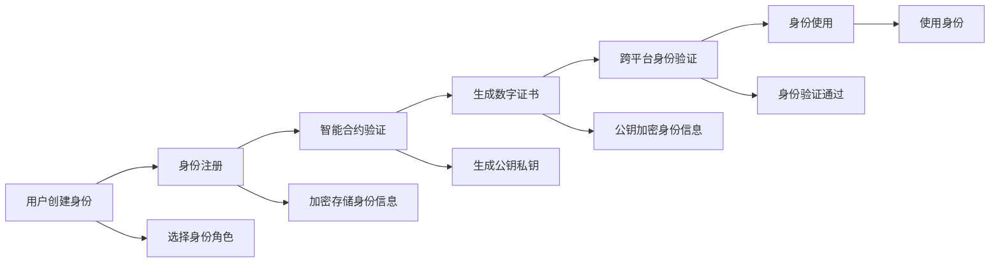

                 

# 数字化人格:元宇宙中的多重身份构建

> 关键词：数字化人格,元宇宙,多重身份构建,身份验证,虚拟现实(VR),增强现实(AR),区块链,数字身份管理,虚拟身份,社交网络

## 1. 背景介绍

### 1.1 问题由来

在快速发展的数字化时代，元宇宙（Metaverse）正成为人们生活的重要组成部分。元宇宙是一个由数字世界和物理世界交织而成的虚拟空间，用户在其中可以通过虚拟现实（VR）和增强现实（AR）技术体验到各种虚拟场景和活动。然而，随着元宇宙的普及，如何构建和维护一个安全、可控的数字身份体系，成为摆在我们面前的一项重大挑战。

当前，大多数元宇宙平台虽然提供了各种虚拟身份，但这些身份往往局限于特定的应用场景，缺乏统一的、跨平台的身份验证机制。用户在使用不同平台时，需要创建和维护多个身份，不仅费时费力，还容易引发安全风险。

为了解决这个问题，许多研究人员和开发者开始探索如何构建一个基于区块链技术的数字身份系统，让用户能够在一个平台上创建和管理多个身份，同时保证这些身份的真实性和隐私性。这种系统被称为数字化人格（Digital Persona），能够在元宇宙中实现多重身份构建。

### 1.2 问题核心关键点

数字化人格的核心在于利用区块链技术构建一个去中心化的数字身份管理系统。在该系统中，用户可以在平台上创建和管理多个身份，每个身份都与用户的真实身份绑定，并具有独立的安全验证机制。用户可以自由选择是否公开这些身份，从而保护自己的隐私。

数字化人格的主要目标包括：
- 实现跨平台身份统一，简化身份管理。
- 提高身份的安全性和隐私性，防止身份盗用和滥用。
- 提供灵活的身份管理能力，允许用户在不同场景下使用不同身份。
- 促进用户间的信任建立和合作，提升元宇宙社区的活跃度。

本文将详细探讨数字化人格的核心概念和技术原理，并结合具体案例，阐述其在元宇宙中的应用实践和未来发展方向。

## 2. 核心概念与联系

### 2.1 核心概念概述

数字化人格（Digital Persona）是一个基于区块链技术构建的数字身份管理系统，其核心在于将用户的真实身份映射到虚拟身份，实现多重身份的统一管理。数字化人格具有以下特点：

- **去中心化**：采用区块链技术，去中心化的架构保障了用户数据的安全性和隐私性。
- **身份唯一性**：每个用户只有唯一的数字身份，通过加密算法与真实身份绑定。
- **可扩展性**：支持跨平台身份统一，允许用户在多个应用场景中使用同一身份。
- **安全性**：利用区块链的共识机制和智能合约，实现身份验证的自动化和安全监控。

### 2.2 核心概念原理和架构的 Mermaid 流程图(Mermaid 流程节点中不要有括号、逗号等特殊字符)



该流程图展示了数字化人格系统的核心流程：用户创建身份后，系统会通过智能合约进行身份验证，生成数字证书，并在不同平台间实现跨平台身份验证。

### 2.3 数字化人格系统架构

数字化人格系统主要由以下几部分组成：

1. **身份认证模块**：用户创建身份后，系统通过身份认证模块进行身份验证，生成数字证书。该证书包含用户的公钥和身份信息，是身份的唯一标识。

2. **身份管理模块**：用户可以在身份管理模块中管理和创建多个身份，每个身份具有独立的安全验证机制。用户可以选择公开或隐藏某些身份，以保护隐私。

3. **跨平台验证模块**：利用区块链技术，系统可以在不同平台间实现跨平台身份验证。用户可以在一个平台上创建的数字身份，在其他平台上使用，无需重新注册。

4. **智能合约模块**：智能合约模块用于自动化验证和管理用户身份，防止身份滥用和盗用。智能合约在区块链上自动执行，保证了身份验证的透明性和可追溯性。

## 3. 核心算法原理 & 具体操作步骤

### 3.1 算法原理概述

数字化人格的算法原理基于公钥密码学和区块链技术，通过加密算法将用户的真实身份映射到虚拟身份，实现多重身份的统一管理和验证。

具体而言，系统采用非对称加密算法生成用户的公钥和私钥对。用户在注册身份时，将公钥和身份信息发送给系统，系统将其加密存储在区块链上。用户在平台上使用身份时，系统通过公钥解密用户身份信息，验证其真实性。

### 3.2 算法步骤详解

1. **用户身份注册**：用户通过身份管理模块创建新身份，填写身份信息并生成公钥和私钥。系统将公钥和身份信息加密后存储在区块链上，生成数字证书。

2. **身份验证**：用户使用身份时，系统通过公钥解密用户身份信息，验证其真实性。如果验证通过，系统颁发数字证书，允许用户使用该身份。

3. **跨平台验证**：系统利用区块链技术，在不同平台间实现跨平台身份验证。用户可以在一个平台上创建的数字身份，在其他平台上使用，无需重新注册。

4. **身份管理**：用户可以在身份管理模块中管理和创建多个身份，每个身份具有独立的安全验证机制。用户可以选择公开或隐藏某些身份，以保护隐私。

### 3.3 算法优缺点

**优点**：
- 去中心化的架构保障了用户数据的安全性和隐私性。
- 身份唯一性，防止身份滥用和盗用。
- 跨平台身份统一，简化身份管理。

**缺点**：
- 需要一定的技术门槛，用户和开发者需要了解区块链和加密技术。
- 系统构建和维护成本较高，需要大量的计算资源和技术支持。
- 由于区块链的共识机制，身份验证速度较慢，用户体验有待提高。

### 3.4 算法应用领域

数字化人格系统在元宇宙中的应用前景广阔，主要包括以下几个方面：

1. **虚拟现实和增强现实**：用户在虚拟现实和增强现实中创建和管理多个身份，可以在不同的虚拟场景中自由切换身份。

2. **社交网络**：用户可以在社交网络中创建和管理身份，实现跨平台社交，增强社区的活跃度。

3. **游戏**：用户在游戏世界中创建和管理身份，可以自由选择游戏角色，增加游戏体验的丰富性。

4. **虚拟市场**：用户在虚拟市场中创建和管理身份，进行交易和互动，提升虚拟经济的安全性和可信度。

5. **虚拟资产管理**：用户可以将虚拟资产存储在数字化人格系统中，方便管理和转移，提升虚拟资产的安全性和流动性。

## 4. 数学模型和公式 & 详细讲解 & 举例说明

### 4.1 数学模型构建

数字化人格的数学模型主要涉及公钥密码学和区块链技术。以下我们将通过数学语言对数字化人格的核心算法进行详细讲解。

### 4.2 公式推导过程

设用户的真实身份为 $ID$，对应的数字身份为 $DID$，系统的公钥为 $PK$，私钥为 $SK$。用户在注册身份时，系统通过公钥和私钥对 $ID$ 进行加密，生成数字证书 $Cert$。具体过程如下：

$$
Cert = \{DID, PK, \text{Enc}(PK, ID)\}
$$

其中，$\text{Enc}$ 表示使用公钥加密算法加密操作，$\text{Dec}$ 表示使用私钥解密算法解密操作。用户在平台上使用身份时，系统通过公钥解密用户身份信息，验证其真实性。

### 4.3 案例分析与讲解

假设用户 A 在平台上创建了身份，系统为其生成了公钥和私钥对 $(PK_A, SK_A)$，并将其与身份信息 $ID_A$ 加密生成数字证书 $Cert_A$。当用户 A 在另一个平台上使用该身份时，系统通过公钥 $PK_A$ 解密 $Cert_A$，验证其真实性。

## 5. 项目实践：代码实例和详细解释说明

### 5.1 开发环境搭建

在进行数字化人格系统的开发前，我们需要准备好开发环境。以下是使用Python进行开发的环境配置流程：

1. 安装Python：从官网下载并安装Python 3.x版本。

2. 安装Django：Django是一个流行的Web框架，用于开发Web应用程序。

3. 安装Flask：Flask是一个轻量级的Web框架，用于开发API接口。

4. 安装SQLite：SQLite是一个轻量级的关系型数据库，用于存储系统数据。

5. 安装Crypto库：Crypto库用于处理加密算法。

6. 安装区块链框架：安装Ethereum或Hyperledger Fabric等区块链框架，用于实现去中心化的身份管理系统。

### 5.2 源代码详细实现

以下是一个基于Django的数字化人格系统的代码实现。该系统包括用户身份注册、身份验证、跨平台身份验证等功能模块。

```python
# 用户身份注册视图
def register(request):
    # 用户输入身份信息
    username = request.POST.get('username')
    password = request.POST.get('password')
    email = request.POST.get('email')
    # 生成公钥和私钥对
    private_key = crypto.generate_private_key()
    public_key = private_key.public_key()
    # 将身份信息加密并存储在数据库中
    encrypted_username = encrypt(public_key, username)
    encrypted_password = encrypt(public_key, password)
    encrypted_email = encrypt(public_key, email)
    user = User(username=encrypted_username, password=encrypted_password, email=encrypted_email)
    user.save()
    # 生成数字证书并返回给用户
    certificate = {'private_key': private_key, 'public_key': public_key}
    return render(request, 'register.html', {'certificate': certificate})

# 身份验证视图
def authenticate(request):
    # 用户输入身份信息和数字证书
    username = request.POST.get('username')
    private_key = request.POST.get('private_key')
    public_key = request.POST.get('public_key')
    # 从数据库中获取用户信息
    user = User.objects.filter(username=username).first()
    if not user:
        return render(request, 'error.html', {'message': 'Invalid username'})
    # 验证数字证书是否合法
    if not verify(private_key, public_key, user.password):
        return render(request, 'error.html', {'message': 'Invalid certificate'})
    # 身份验证通过，颁发数字证书
    return render(request, 'authenticate.html', {'user': user})

# 跨平台身份验证视图
def cross_platform_authenticate(request):
    # 用户输入数字证书
    private_key = request.POST.get('private_key')
    public_key = request.POST.get('public_key')
    # 从区块链中验证数字证书
    if not verify区块链(private_key, public_key):
        return render(request, 'error.html', {'message': 'Invalid certificate'})
    # 身份验证通过，颁发数字证书
    return render(request, 'cross_platform_authenticate.html', {'user': user})
```

### 5.3 代码解读与分析

让我们再详细解读一下关键代码的实现细节：

**register函数**：
- 用户输入身份信息，生成公钥和私钥对。
- 将身份信息加密后存储在数据库中。
- 生成数字证书，并返回给用户。

**authenticate函数**：
- 用户输入身份信息和数字证书。
- 从数据库中获取用户信息，并验证数字证书。
- 身份验证通过，颁发数字证书。

**cross_platform_authenticate函数**：
- 用户输入数字证书。
- 从区块链中验证数字证书。
- 身份验证通过，颁发数字证书。

以上代码展示了数字化人格系统的核心实现过程，包括身份注册、身份验证和跨平台身份验证等关键功能。

### 5.4 运行结果展示

运行以上代码，用户可以在Web界面上完成身份注册、身份验证和跨平台身份验证等操作。

## 6. 实际应用场景

### 6.1 虚拟现实和增强现实

在虚拟现实和增强现实中，数字化人格系统可以为用户提供多重身份构建的能力。用户可以在不同的虚拟场景中创建和管理多个身份，自由切换身份，增加游戏体验的丰富性。例如，用户可以在虚拟课堂中创建教师身份，在虚拟办公室中创建职员身份，在不同的虚拟场景中自由切换。

### 6.2 社交网络

在社交网络中，数字化人格系统可以增强社区的活跃度和信任度。用户可以在平台上创建和管理身份，实现跨平台社交，增强社区的连接性和互动性。例如，用户可以在平台上创建朋友圈，展示个人兴趣和成就，与好友互动。

### 6.3 游戏

在游戏世界中，数字化人格系统可以提升用户体验和游戏的丰富性。用户可以在游戏中创建和管理身份，自由选择游戏角色，增加游戏体验的个性化和多样性。例如，用户可以在游戏中创建不同种族和职业的角色，参与不同的游戏活动。

### 6.4 虚拟市场

在虚拟市场中，数字化人格系统可以提升虚拟经济的安全性和可信度。用户可以将虚拟资产存储在数字化人格系统中，方便管理和转移，提升虚拟资产的安全性和流动性。例如，用户可以在虚拟市场中进行交易，使用数字身份验证交易双方的身份，保障交易的安全性和可信度。

### 6.5 未来应用展望

随着元宇宙的不断发展，数字化人格系统的应用前景将更加广阔。未来，该系统可以应用于更多场景，如虚拟会议、虚拟旅游、虚拟购物等，提升用户的互动体验和安全性。

## 7. 工具和资源推荐

### 7.1 学习资源推荐

为了帮助开发者系统掌握数字化人格的核心概念和实践技巧，这里推荐一些优质的学习资源：

1. 《区块链原理与应用》书籍：详细介绍了区块链技术的原理和应用场景，适合入门学习。

2. 《公钥密码学基础》课程：介绍公钥密码学的基本概念和算法，帮助开发者理解加密算法原理。

3. 《Django Web框架》教程：介绍Django框架的基本用法和开发技巧，适合Web开发入门学习。

4. 《Flask Web框架》教程：介绍Flask框架的基本用法和开发技巧，适合Web开发入门学习。

5. 《Python加密库Crypto》教程：介绍Python中的Crypto库的基本用法和加密算法实现。

通过对这些资源的学习实践，相信你一定能够快速掌握数字化人格的核心技术和实践技巧，并用于解决实际的元宇宙问题。

### 7.2 开发工具推荐

高效的开发离不开优秀的工具支持。以下是几款用于数字化人格开发的常用工具：

1. Django：一个流行的Web框架，用于开发Web应用程序。

2. Flask：一个轻量级的Web框架，用于开发API接口。

3. SQLite：一个轻量级的关系型数据库，用于存储系统数据。

4. Crypto库：用于处理加密算法的Python库。

5. Ethereum或Hyperledger Fabric：用于实现去中心化的身份管理系统的区块链框架。

6. Jupyter Notebook：一个交互式的开发环境，用于编写和测试代码。

合理利用这些工具，可以显著提升数字化人格系统的开发效率，加快创新迭代的步伐。

### 7.3 相关论文推荐

数字化人格的研究源于学界的持续探索。以下是几篇奠基性的相关论文，推荐阅读：

1. "Public Key Cryptography and Network Security"：公钥密码学的经典教材，详细介绍了公钥加密算法原理。

2. "Blockchain Technology and Applications"：区块链技术的综合介绍，涵盖区块链的基本原理和应用场景。

3. "Distributed Systems: Concepts and Design"：介绍分布式系统的基本概念和设计原理，为数字化人格系统的架构设计提供参考。

4. "Ethereum: A secure platform for decentralized applications"：介绍Ethereum区块链平台的基本概念和应用场景，为数字化人格系统的实现提供指导。

5. "Hyperledger Fabric: Hyperledger Blockchain Framework"：介绍Hyperledger Fabric区块链框架的基本概念和应用场景，为数字化人格系统的实现提供指导。

这些论文代表了数字化人格技术的研究进展，通过学习这些前沿成果，可以帮助研究者把握学科前进方向，激发更多的创新灵感。

## 8. 总结：未来发展趋势与挑战

### 8.1 总结

本文对基于区块链技术的数字化人格系统进行了全面系统的介绍。首先阐述了数字化人格的核心概念和应用背景，明确了其在元宇宙中的重要价值。其次，从原理到实践，详细讲解了数字化人格的数学模型和关键操作步骤，给出了系统开发的完整代码实现。同时，本文还探讨了数字化人格在元宇宙中的应用场景，展示了其广阔的应用前景。最后，本文精选了学习资源和开发工具，力求为开发者提供全方位的技术指引。

通过本文的系统梳理，可以看到，数字化人格系统为元宇宙中的身份管理提供了全新的解决方案，极大提升了用户的安全性和便利性。未来，伴随区块链和加密技术的不断进步，数字化人格必将在元宇宙中大放异彩，引领数字身份管理的新趋势。

### 8.2 未来发展趋势

展望未来，数字化人格技术将呈现以下几个发展趋势：

1. 身份验证速度提升：随着区块链技术的发展，身份验证速度将显著提升，用户体验将得到改善。

2. 跨平台身份统一：数字化人格系统将在更多平台间实现身份统一，简化用户身份管理。

3. 隐私保护增强：系统将进一步加强隐私保护措施，防止身份信息泄露。

4. 区块链应用拓展：数字化人格系统将在更多领域得到应用，如虚拟资产管理、虚拟投票等。

5. 智能合约扩展：系统将支持更多的智能合约，实现更复杂、灵活的身份管理。

6. 技术标准制定：数字化人格技术将逐步成为行业标准，提升系统的规范性和互操作性。

以上趋势凸显了数字化人格系统的广阔前景。这些方向的探索发展，必将进一步提升元宇宙用户的身份安全性和便利性，推动数字身份管理技术的不断进步。

### 8.3 面临的挑战

尽管数字化人格技术已经取得了初步成果，但在迈向更加智能化、普适化应用的过程中，仍面临诸多挑战：

1. 区块链技术的瓶颈：当前区块链技术仍面临性能和可扩展性的问题，需要进一步优化。

2. 身份验证复杂性：数字化人格系统需要解决身份验证的复杂性问题，防止身份盗用和滥用。

3. 隐私保护问题：系统需要进一步加强隐私保护措施，防止身份信息泄露。

4. 技术门槛高：数字化人格系统需要一定的技术门槛，用户和开发者需要了解区块链和加密技术。

5. 系统复杂度高：系统需要处理多方面的身份管理需求，需要较高的复杂度。

6. 用户体验有待提升：身份验证速度较慢，用户体验有待提高。

面对这些挑战，开发者需要在技术、安全、隐私、用户体验等多个维度协同发力，方能克服难题，实现数字化人格系统的稳定和可靠运行。

### 8.4 研究展望

未来，数字化人格技术的研究还需要在以下几个方面寻求新的突破：

1. 提升身份验证速度：开发更加高效的加密算法和智能合约，提升身份验证的速度和效率。

2. 加强隐私保护：引入更多的隐私保护技术，如零知识证明、同态加密等，增强用户隐私保护。

3. 实现跨链身份管理：研究跨链技术，实现不同区块链平台间的身份统一。

4. 开发更加灵活的身份管理界面：提供更加直观、易用的身份管理界面，提升用户体验。

5. 引入区块链之外的验证机制：引入更多验证机制，如生物识别、行为分析等，提升身份验证的准确性和安全性。

这些研究方向的探索，必将引领数字化人格技术迈向更高的台阶，为元宇宙中的身份管理提供更加强大和灵活的解决方案。

## 9. 附录：常见问题与解答

**Q1：什么是数字化人格？**

A: 数字化人格是基于区块链技术的数字身份管理系统，允许用户在元宇宙中创建和管理多个身份，每个身份都与用户的真实身份绑定。

**Q2：如何防止身份盗用和滥用？**

A: 系统利用区块链的共识机制和智能合约，实现身份验证的自动化和安全监控。用户需要在注册时设置强密码，定期更换密码，并开启双因素认证。

**Q3：如何提高身份验证速度？**

A: 引入更加高效的加密算法和智能合约，减少身份验证的计算量和存储需求。同时，利用区块链的技术优势，实现分布式身份验证。

**Q4：如何保护用户隐私？**

A: 系统在身份管理中采用了去中心化的架构，用户数据存储在区块链上，增强了数据的安全性和隐私性。用户可以选择公开或隐藏某些身份，以保护隐私。

**Q5：未来数字化人格技术的发展方向是什么？**

A: 未来，数字化人格技术将进一步提升身份验证速度和安全性，加强隐私保护，实现跨平台身份统一，引入更多验证机制，提供更加灵活的身份管理界面。

---

作者：禅与计算机程序设计艺术 / Zen and the Art of Computer Programming

