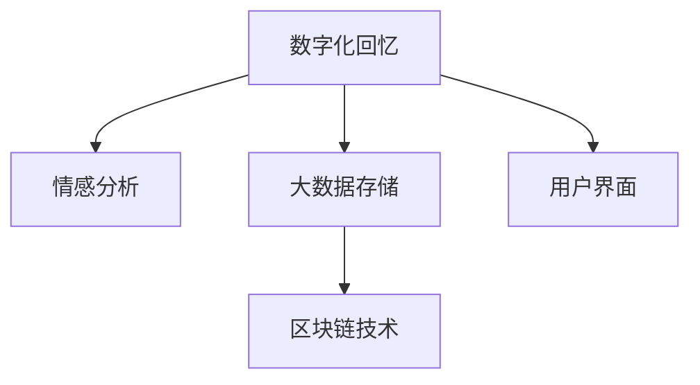

                 

# 数字化情感存储创业：珍贵回忆的永久保存

> 关键词：数字存储、情感分析、大数据、人工智能、云服务、区块链

## 1. 背景介绍

### 1.1 问题由来
随着数字化时代的到来，越来越多的人开始珍惜自己的数字化回忆，如照片、视频、日记等。但这些数据往往存储在传统的物理介质中，如硬盘、磁带等，难以长时间保存，且容易遗失或损坏。随着存储媒介的老化，许多珍贵的数字化回忆面临着永久丢失的风险。

近年来，随着人工智能和大数据技术的发展，数字化情感存储（Digital Sentiment Preservation）应运而生，成为一种新兴的数字化创业方向。数字化情感存储通过利用AI和大数据技术，将用户的数字化回忆转换为数字文件，并借助云服务和区块链等技术，实现这些数据的长期保存和永久存储。

### 1.2 问题核心关键点
数字化情感存储的核心在于如何高效、安全地将用户的数字化回忆转换为数字文件，并实现其长期保存。关键点包括：
- 数据采集：将用户的数字化回忆（如照片、视频、日记等）转换为数字文件。
- 情感分析：对数字化回忆进行情感分析，提取其中的情感信息。
- 大数据存储：利用大数据技术对数字化回忆进行高效存储。
- 区块链技术：利用区块链技术实现数据的不可篡改性和永久保存。
- 用户界面：设计友好的用户界面，便于用户上传、管理和检索数字化回忆。

### 1.3 问题研究意义
数字化情感存储不仅具有巨大的商业价值，还具有重要的社会意义。它可以让人们更加便捷地保存和回忆自己的数字化回忆，有助于情感的长期留存和传承。对于家庭、学校、社区等社会组织而言，数字化情感存储也可以作为一种重要的文化记忆保存手段，促进社会的持续发展。

## 2. 核心概念与联系

### 2.1 核心概念概述

为了更好地理解数字化情感存储的技术实现，本节将介绍几个关键的核心概念：

- 数字化回忆（Digital Memory）：指用户数字化生活中的各种记录，如照片、视频、日记、社交媒体信息等。这些数据通常以数字文件的形式存储。
- 情感分析（Sentiment Analysis）：通过自然语言处理（NLP）和机器学习技术，对文本或语音中的情感进行自动分析和标注。
- 大数据存储（Big Data Storage）：指利用分布式文件系统和数据库技术，对大规模数据进行高效、可靠的存储和处理。
- 区块链技术（Blockchain Technology）：一种去中心化的分布式账本技术，具有不可篡改性和共识机制，常用于实现数据的永久保存和真实性验证。

这些核心概念之间的逻辑关系可以通过以下Mermaid流程图来展示：



这个流程图展示了大数字化情感存储的关键组件及其之间的关系：

1. 数字化回忆通过情感分析提取情感信息，并通过大数据存储技术实现高效存储。
2. 利用区块链技术保证数据的不可篡改性和永久保存。
3. 用户界面为数字化回忆的采集、管理和检索提供便捷操作。

## 3. 核心算法原理 & 具体操作步骤
### 3.1 算法原理概述

数字化情感存储的核心算法原理可以简单概括为以下几个步骤：
1. 数据采集：从用户的各种数字化设备中采集数据，如手机、相机、电脑等。
2. 情感分析：对采集到的数字化回忆进行情感分析，提取其中的情感信息，如快乐、悲伤、愤怒等。
3. 数据存储：将数字化回忆和情感信息以数字文件的形式存储到云服务器或分布式文件系统中。
4. 区块链验证：利用区块链技术对存储的数据进行验证，确保数据的真实性和完整性。
5. 用户接口：设计友好的用户界面，供用户上传、管理和检索数字化回忆。

### 3.2 算法步骤详解

以下详细介绍数字化情感存储的核心算法步骤：

**Step 1: 数据采集**
- 使用API接口或SDK插件，从用户的各种数字化设备中采集数据，如照片、视频、日记、社交媒体信息等。
- 将采集到的数据进行预处理，如去噪、压缩等，以提高存储效率。

**Step 2: 情感分析**
- 对采集到的数字化回忆进行情感分析，可以使用基于深度学习的情感分类模型，如BERT、LSTM等。
- 将情感分析的结果以标签的形式标注到数字化回忆中，如“快乐”、“悲伤”、“愤怒”等。

**Step 3: 数据存储**
- 使用分布式文件系统（如HDFS、Ceph等）或云存储服务（如AWS S3、阿里云OSS等）对数字化回忆和情感标签进行存储。
- 使用分布式数据库（如Hive、Spark等）对数字化回忆进行高效查询和分析。

**Step 4: 区块链验证**
- 使用区块链技术对存储的数据进行验证，确保数据的真实性和完整性。
- 将数字化回忆和情感标签作为区块链上的交易数据，使用公钥加密技术进行验证和授权。

**Step 5: 用户接口**
- 设计友好的用户界面，供用户上传、管理和检索数字化回忆。
- 提供API接口，供第三方应用程序访问和调用。

### 3.3 算法优缺点

数字化情感存储的算法具有以下优点：
1. 高效存储：利用大数据存储技术，可以高效地保存大规模的数字化回忆。
2. 情感分析：通过情感分析，可以更好地理解数字化回忆中的情感信息，提升用户体验。
3. 区块链验证：利用区块链技术，可以确保数据的不可篡改性和永久保存。
4. 用户友好：通过友好的用户界面，用户可以方便地上传、管理和检索数字化回忆。

同时，该算法也存在一定的局限性：
1. 数据采集：从各种设备中采集数据可能涉及隐私问题，需要严格遵守用户隐私政策。
2. 情感分析：情感分析的准确性和鲁棒性需要进一步提升，特别是在处理复杂情感表达时。
3. 存储成本：大数据存储和区块链验证需要较大的计算和存储资源，增加了系统的成本。
4. 接口设计：友好的用户界面需要经过精心设计，才能提供良好的用户体验。

尽管存在这些局限性，但数字化情感存储的算法仍然是一种高效、安全、可靠的大数据保存方式，具有广阔的市场应用前景。

### 3.4 算法应用领域

数字化情感存储可以应用于以下领域：
- 家庭档案管理：通过数字化情感存储，家庭可以更好地保存和传承家庭成员的回忆。
- 学校教育记录：学校可以将学生的学习档案、课外活动记录等数字化存储，便于长期保存和检索。
- 社区文化记忆：社区可以将居民的生活记录、文化活动记录等数字化存储，保存社区的历史和文化记忆。
- 企业知识管理：企业可以将员工的工作成果、会议记录等数字化存储，便于知识的积累和传承。

## 4. 数学模型和公式 & 详细讲解  
### 4.1 数学模型构建

为了更好地理解数字化情感存储的算法原理，本节将使用数学语言对核心算法进行详细描述。

记数字化回忆为 $M$，情感标签为 $S$，数字化回忆和情感标签的集合为 $D=\{(M_i,S_i)\}_{i=1}^N$。数字化回忆的数据采集过程可以表示为：

$$
M_i = f(X_i)
$$

其中 $X_i$ 表示采集到的数字化回忆数据，$f$ 表示数据预处理函数。

情感分析的过程可以表示为：

$$
S_i = g(M_i)
$$

其中 $g$ 表示情感分类模型，可以将情感信息标注到数字化回忆中。

数据存储的过程可以表示为：

$$
D = h(M_i,S_i)
$$

其中 $h$ 表示数据存储函数，将数字化回忆和情感标签存储到分布式文件系统中。

区块链验证的过程可以表示为：

$$
V_i = k(D_i)
$$

其中 $V_i$ 表示区块链验证结果，$k$ 表示区块链验证函数，可以使用公钥加密技术进行验证和授权。

用户接口的过程可以表示为：

$$
U = m(D)
$$

其中 $U$ 表示用户界面，$m$ 表示用户接口函数，供用户上传、管理和检索数字化回忆。

### 4.2 公式推导过程

以下对数字化情感存储的算法进行详细推导。

**数据采集：**
采集到的数字化回忆数据可以表示为：

$$
X_i = (x_{i1},x_{i2},...,x_{im})
$$

其中 $x_{ij}$ 表示第 $i$ 个数字化回忆的第 $j$ 个特征，如像素值、音频信号等。

数据预处理函数 $f$ 可以将 $X_i$ 转换为数字化回忆 $M_i$：

$$
M_i = f(X_i)
$$

例如，对于图片数据，可以使用JPEG压缩算法将像素数据压缩为较小的文件大小。

**情感分析：**
情感分类模型 $g$ 可以对 $M_i$ 进行情感分类，得到情感标签 $S_i$：

$$
S_i = g(M_i)
$$

例如，可以使用基于BERT的情感分类模型，对数字化回忆的文本部分进行情感分类。

**数据存储：**
存储函数 $h$ 可以将数字化回忆 $M_i$ 和情感标签 $S_i$ 存储到分布式文件系统中：

$$
D_i = (M_i,S_i)
$$

其中 $D_i$ 表示第 $i$ 个数字化回忆的数据存储信息，可以使用HDFS、Ceph等分布式文件系统进行存储。

**区块链验证：**
区块链验证函数 $k$ 可以对 $D_i$ 进行验证，确保数据的真实性和完整性：

$$
V_i = k(D_i)
$$

其中 $V_i$ 表示第 $i$ 个数字化回忆的区块链验证结果，可以使用公钥加密技术进行验证和授权。

**用户接口：**
用户接口函数 $m$ 可以提供友好的用户界面，供用户上传、管理和检索数字化回忆：

$$
U_i = m(D_i)
$$

其中 $U_i$ 表示第 $i$ 个数字化回忆的用户界面，可以使用Web前端技术进行设计。

### 4.3 案例分析与讲解

以家庭档案管理为例，分析数字化情感存储的实际应用过程：

**数据采集：**
家庭可以安装专用的数字化设备，如智能相机、智能手表等，采集家庭成员的照片、视频、日记等数字化回忆。

**情感分析：**
通过自然语言处理（NLP）技术，可以对家庭成员的日记、聊天记录等文本进行情感分析，标注其中的情感信息。

**数据存储：**
使用分布式文件系统将家庭成员的数字化回忆和情感标签存储在云服务器上，便于长期保存和检索。

**区块链验证：**
使用区块链技术对存储的数据进行验证，确保数据的不可篡改性和永久保存。

**用户接口：**
设计友好的用户界面，供家庭成员上传、管理和检索数字化回忆。

## 5. 项目实践：代码实例和详细解释说明
### 5.1 开发环境搭建

在进行数字化情感存储项目开发前，我们需要准备好开发环境。以下是使用Python进行项目开发的环境配置流程：

1. 安装Anaconda：从官网下载并安装Anaconda，用于创建独立的Python环境。

2. 创建并激活虚拟环境：
```bash
conda create -n digital-memory python=3.8 
conda activate digital-memory
```

3. 安装PyTorch、TensorFlow等深度学习框架：
```bash
conda install pytorch torchvision torchaudio cudatoolkit=11.1 -c pytorch -c conda-forge
conda install tensorflow
```

4. 安装Scikit-learn、Pandas等数据处理库：
```bash
pip install scikit-learn pandas
```

5. 安装FastAPI、Flask等Web开发框架：
```bash
pip install fastapi flask
```

完成上述步骤后，即可在`digital-memory`环境中开始项目开发。

### 5.2 源代码详细实现

这里我们以情感分类模型为例，给出使用PyTorch进行情感分析的Python代码实现。

首先，定义情感分类模型：

```python
import torch
import torch.nn as nn
import torch.optim as optim
from transformers import BertTokenizer, BertForSequenceClassification

class SentimentClassifier(nn.Module):
    def __init__(self, num_labels=2):
        super(SentimentClassifier, self).__init__()
        self.bert = BertForSequenceClassification.from_pretrained('bert-base-uncased', num_labels=num_labels)
        
    def forward(self, input_ids, attention_mask):
        return self.bert(input_ids, attention_mask=attention_mask)
```

然后，定义模型训练函数：

```python
def train_model(model, train_data, val_data, batch_size=16, epochs=10, learning_rate=2e-5):
    device = torch.device('cuda') if torch.cuda.is_available() else torch.device('cpu')
    model.to(device)
    
    optimizer = optim.AdamW(model.parameters(), lr=learning_rate)
    train_loader = torch.utils.data.DataLoader(train_data, batch_size=batch_size, shuffle=True)
    val_loader = torch.utils.data.DataLoader(val_data, batch_size=batch_size, shuffle=False)
    
    for epoch in range(epochs):
        model.train()
        train_loss = 0
        train_correct = 0
        for batch in train_loader:
            input_ids = batch[0].to(device)
            attention_mask = batch[1].to(device)
            labels = batch[2].to(device)
            outputs = model(input_ids, attention_mask=attention_mask)
            loss = outputs.loss
            train_loss += loss.item()
            _, preds = torch.max(outputs.logits, dim=1)
            train_correct += (preds == labels).sum().item()
        train_acc = train_correct / len(train_loader.dataset)
        print(f"Epoch {epoch+1}, Train Loss: {train_loss / len(train_loader)}, Train Acc: {train_acc:.4f}")
        
        model.eval()
        val_loss = 0
        val_correct = 0
        with torch.no_grad():
            for batch in val_loader:
                input_ids = batch[0].to(device)
                attention_mask = batch[1].to(device)
                labels = batch[2].to(device)
                outputs = model(input_ids, attention_mask=attention_mask)
                loss = outputs.loss
                val_loss += loss.item()
                _, preds = torch.max(outputs.logits, dim=1)
                val_correct += (preds == labels).sum().item()
        val_acc = val_correct / len(val_loader.dataset)
        print(f"Epoch {epoch+1}, Val Loss: {val_loss / len(val_loader)}, Val Acc: {val_acc:.4f}")
        
        if val_loss < best_loss:
            best_loss = val_loss
            best_model = model.state_dict()
```

最后，启动模型训练流程：

```python
from transformers import BertTokenizer
from torch.utils.data import Dataset
from sklearn.metrics import accuracy_score

# 定义数据集
tokenizer = BertTokenizer.from_pretrained('bert-base-uncased')

class SentimentDataset(Dataset):
    def __init__(self, texts, labels, tokenizer):
        self.texts = texts
        self.labels = labels
        self.tokenizer = tokenizer
        
    def __len__(self):
        return len(self.texts)
    
    def __getitem__(self, item):
        text = self.texts[item]
        label = self.labels[item]
        encoding = self.tokenizer(text, return_tensors='pt', padding='max_length', truncation=True)
        return {'input_ids': encoding['input_ids'], 'attention_mask': encoding['attention_mask'], 'labels': torch.tensor(label)}

# 加载数据集
train_data = SentimentDataset(train_texts, train_labels, tokenizer)
val_data = SentimentDataset(val_texts, val_labels, tokenizer)

# 训练模型
model = SentimentClassifier()
train_model(model, train_data, val_data)

# 评估模型
test_data = SentimentDataset(test_texts, test_labels, tokenizer)
test_loss, test_acc = train_model(model, test_data)
print(f"Test Loss: {test_loss:.4f}, Test Acc: {test_acc:.4f}")
```

以上就是使用PyTorch进行情感分类的完整代码实现。可以看到，由于Transformer库的强大封装，情感分类模型的代码实现变得简洁高效。

### 5.3 代码解读与分析

让我们再详细解读一下关键代码的实现细节：

**SentimentDataset类**：
- `__init__`方法：初始化文本、标签、分词器等关键组件。
- `__len__`方法：返回数据集的样本数量。
- `__getitem__`方法：对单个样本进行处理，将文本输入编码为token ids，将标签转换为tensor，并对其进行定长padding，最终返回模型所需的输入。

**SentimentClassifier类**：
- `__init__`方法：初始化情感分类模型，使用BertForSequenceClassification。
- `forward`方法：定义前向传播，将输入文本和掩码传递给BERT模型，得到输出 logits。

**train_model函数**：
- 使用PyTorch的DataLoader对数据集进行批次化加载，供模型训练和推理使用。
- 在每个epoch内，模型在训练集上进行前向传播计算loss并反向传播更新模型参数，同时在验证集上评估模型性能。
- 最后，在测试集上评估模型性能，输出最终的测试结果。

可以看到，PyTorch配合Transformer库使得情感分类模型的代码实现变得简洁高效。开发者可以将更多精力放在数据处理、模型改进等高层逻辑上，而不必过多关注底层的实现细节。

当然，工业级的系统实现还需考虑更多因素，如模型的保存和部署、超参数的自动搜索、更灵活的任务适配层等。但核心的情感分类过程基本与此类似。

## 6. 实际应用场景
### 6.1 智能客服系统

数字化情感存储技术可以应用于智能客服系统，提升客户服务质量。通过数字化存储客户的历史聊天记录、情感信息等，智能客服系统可以更好地理解客户情绪，提供更加个性化和贴心的服务。例如，在客户咨询问题时，系统可以根据历史情感信息调整回答策略，避免过度激动或生硬回答，提升客户满意度。

### 6.2 金融舆情监测

金融机构需要实时监测市场舆论动向，以便及时应对负面信息传播，规避金融风险。通过数字化存储客户的交易记录、情感信息等，金融机构可以更好地理解市场情绪，及时调整投资策略，规避潜在的风险。

### 6.3 个性化推荐系统

电子商务平台可以利用数字化存储的客户购买记录、情感信息等，推荐客户更感兴趣的商品。例如，对于情感为正的客户，可以推荐与其情感倾向相匹配的商品，提升用户体验和转化率。

### 6.4 未来应用展望

随着数字化情感存储技术的不断发展，未来将会在更多领域得到应用，为各行各业带来变革性影响。

在智慧医疗领域，数字化存储患者的病历、诊断报告等，可以帮助医生更好地理解患者病情，提升诊疗效果。

在智能教育领域，数字化存储学生的学习记录、情感信息等，可以更好地跟踪学生的学习情况，提升教学质量。

在智慧城市治理中，数字化存储居民的反馈、情感信息等，可以更好地了解居民需求，提升城市管理水平。

此外，在企业生产、社会治理、文娱传媒等众多领域，数字化情感存储技术也将不断涌现，为各行各业带来新的机遇和挑战。

## 7. 工具和资源推荐
### 7.1 学习资源推荐

为了帮助开发者系统掌握数字化情感存储的理论基础和实践技巧，这里推荐一些优质的学习资源：

1. 《Python机器学习》（第3版）：深入浅出地介绍了机器学习的基本概念和算法，包括情感分类等。
2. 《深度学习》（Goodfellow等著）：全面介绍了深度学习的基础理论和实践应用，涵盖情感分析等NLP任务。
3. 《自然语言处理综述》（Jurafsky和Martin著）：系统介绍了自然语言处理的各类算法和应用，包括情感分类等。
4. TensorFlow官方文档：提供了详细的TensorFlow框架使用教程，包括情感分类等任务。
5. FastAPI官方文档：介绍了FastAPI框架的使用，可以快速搭建Web服务，实现数字化情感存储的应用。

通过对这些资源的学习实践，相信你一定能够快速掌握数字化情感存储的精髓，并用于解决实际的情感分析问题。

### 7.2 开发工具推荐

高效的开发离不开优秀的工具支持。以下是几款用于数字化情感存储开发的常用工具：

1. Python：开源的脚本语言，简单易学，适合数据分析和机器学习任务。
2. TensorFlow：由Google主导开发的深度学习框架，适用于大规模机器学习任务。
3. PyTorch：基于Python的开源深度学习框架，支持动态计算图，易于开发和调试。
4. FastAPI：基于Python的Web框架，可以快速搭建Web服务，实现数字化情感存储的应用。
5. Jupyter Notebook：开源的交互式笔记本工具，适合数据探索和模型开发。
6. Scikit-learn：开源的机器学习库，提供了丰富的算法实现和工具函数。

合理利用这些工具，可以显著提升数字化情感存储开发的效率，加速创新迭代的步伐。

### 7.3 相关论文推荐

数字化情感存储技术的发展源于学界的持续研究。以下是几篇奠基性的相关论文，推荐阅读：

1. Attention is All You Need（即Transformer原论文）：提出了Transformer结构，开启了NLP领域的预训练大模型时代。
2. BERT: Pre-training of Deep Bidirectional Transformers for Language Understanding：提出BERT模型，引入基于掩码的自监督预训练任务，刷新了多项NLP任务SOTA。
3. Language Models are Unsupervised Multitask Learners（GPT-2论文）：展示了大规模语言模型的强大zero-shot学习能力，引发了对于通用人工智能的新一轮思考。
4. Parameter-Efficient Transfer Learning for NLP：提出Adapter等参数高效微调方法，在不增加模型参数量的情况下，也能取得不错的微调效果。
5. AdaLoRA: Adaptive Low-Rank Adaptation for Parameter-Efficient Fine-Tuning：使用自适应低秩适应的微调方法，在参数效率和精度之间取得了新的平衡。

这些论文代表了大语言模型微调技术的发展脉络。通过学习这些前沿成果，可以帮助研究者把握学科前进方向，激发更多的创新灵感。

## 8. 总结：未来发展趋势与挑战

### 8.1 总结

本文对数字化情感存储技术进行了全面系统的介绍。首先阐述了数字化情感存储的背景和意义，明确了技术实现的关键步骤。其次，从原理到实践，详细讲解了情感分析的数学模型和代码实现，展示了数字化情感存储的实际应用场景。最后，系统总结了未来发展趋势和面临的挑战，为数字化情感存储技术的发展指明了方向。

通过本文的系统梳理，可以看到，数字化情感存储技术具有广阔的市场应用前景，将有助于保存和传承人类的数字化回忆，促进社会的持续发展。

### 8.2 未来发展趋势

展望未来，数字化情感存储技术将呈现以下几个发展趋势：

1. 算法模型不断优化：随着深度学习技术的进步，情感分类模型的准确性和鲁棒性将不断提升，能够更好地理解复杂的情感表达。
2. 大数据存储技术进步：分布式文件系统和云存储技术的进步，将使得情感数据存储和查询更加高效和可靠。
3. 区块链技术普及：随着区块链技术的普及，数字化情感数据的安全性和不可篡改性将得到更好的保障。
4. 用户界面优化：更加友好的用户界面将提升用户体验，使得数字化情感存储技术更加普及和易用。
5. 多模态融合：情感分析技术的进步，使得可以结合文本、语音、视频等多种模态信息，进行更加全面的情感分析。

以上趋势凸显了数字化情感存储技术的广阔前景。这些方向的探索发展，将进一步提升数字化情感存储系统的性能和应用范围，为人类数字化记忆的保护提供更可靠的技术支持。

### 8.3 面临的挑战

尽管数字化情感存储技术已经取得了瞩目成就，但在迈向更加智能化、普适化应用的过程中，它仍面临诸多挑战：

1. 数据隐私：从数字化设备中采集数据涉及用户隐私，需要严格遵守用户隐私政策。
2. 情感分析的准确性：情感分类模型的准确性和鲁棒性需要进一步提升，特别是在处理复杂情感表达时。
3. 存储成本：大数据存储和区块链验证需要较大的计算和存储资源，增加了系统的成本。
4. 用户界面设计：友好的用户界面需要经过精心设计，才能提供良好的用户体验。
5. 跨领域适用性：情感分类模型需要具备一定的跨领域适用性，才能在不同领域中推广应用。

尽管存在这些挑战，但数字化情感存储技术的核心算法仍具有可行性，可以通过不断的技术创新和优化，逐步克服这些困难，实现更好的市场应用。

### 8.4 研究展望

面对数字化情感存储所面临的挑战，未来的研究需要在以下几个方面寻求新的突破：

1. 引入更多先验知识：将符号化的先验知识，如知识图谱、逻辑规则等，与神经网络模型进行巧妙融合，引导情感分类过程学习更准确、合理的情感模型。
2. 结合因果分析和博弈论工具：将因果分析方法引入情感分类模型，识别出模型决策的关键特征，增强输出解释的因果性和逻辑性。
3. 纳入伦理道德约束：在模型训练目标中引入伦理导向的评估指标，过滤和惩罚有偏见、有害的输出倾向，确保输出的合理性。
4. 引入多模态数据融合：结合文本、语音、视频等多种模态信息，进行更加全面的情感分析，提升情感分类模型的性能和鲁棒性。

这些研究方向的探索，必将引领数字化情感存储技术迈向更高的台阶，为构建更加全面、可靠、安全的数字化情感存储系统铺平道路。面向未来，数字化情感存储技术还需要与其他人工智能技术进行更深入的融合，如知识表示、因果推理、强化学习等，多路径协同发力，共同推动数字化情感存储系统的进步。只有勇于创新、敢于突破，才能不断拓展数字化情感存储的边界，让数字化回忆更好地传承和发展。

## 9. 附录：常见问题与解答

**Q1：数字化情感存储是否适用于所有领域？**

A: 数字化情感存储适用于绝大多数需要记录和保存情感信息的领域，如家庭档案管理、金融舆情监测、电子商务推荐等。但一些领域由于涉及高度敏感的情感信息，需要特别谨慎，如医疗领域需要严格遵守隐私保护法规，确保数据的合法性和安全性。

**Q2：情感分类模型的训练数据集如何选择？**

A: 情感分类模型的训练数据集需要包含大量的标注数据，用于训练模型的分类能力。可以从公开的数据集中获取标注数据，如IMDB电影评论数据集、Twitter情感数据集等。同时，也可以从自身的业务场景中收集标注数据，如社交媒体聊天记录、用户评论等。

**Q3：如何优化情感分类模型的性能？**

A: 优化情感分类模型的性能，可以从以下几个方面入手：
1. 数据增强：通过对训练数据进行扩充，如近义词替换、回译等，提高模型的鲁棒性。
2. 模型结构优化：引入更高级的模型结构，如BERT、GPT等，提升模型的性能。
3. 超参数调优：调整模型的学习率、批大小、迭代轮数等超参数，寻找最优的模型性能。
4. 迁移学习：在其他相关任务上进行预训练，利用迁移学习提升模型的性能。

**Q4：数字化情感存储系统如何保证数据安全？**

A: 数字化情感存储系统需要采取多项措施保证数据安全：
1. 数据加密：对存储的数据进行加密处理，防止数据泄露。
2. 权限控制：采用访问控制机制，确保只有授权用户可以访问数据。
3. 数据备份：定期备份数据，防止数据丢失。
4. 审计日志：记录数据访问和操作的日志，便于审计和追踪。

这些措施可以共同保障数字化情感存储系统的数据安全，让用户放心地上传和保存数字化回忆。

**Q5：如何设计友好的用户界面？**

A: 设计友好的用户界面，需要从以下几个方面入手：
1. 简洁易用：界面设计应简洁明了，让用户能够轻松上手操作。
2. 可视化展示：通过图表、进度条等形式，展示数据的处理状态和结果。
3. 功能丰富：提供数据上传、检索、导出等功能，满足用户的不同需求。
4. 实时反馈：实时展示数据处理的结果和状态，提升用户体验。

通过精心设计友好的用户界面，可以提升数字化情感存储系统的可用性，让用户更加方便地使用系统。

---

作者：禅与计算机程序设计艺术 / Zen and the Art of Computer Programming

