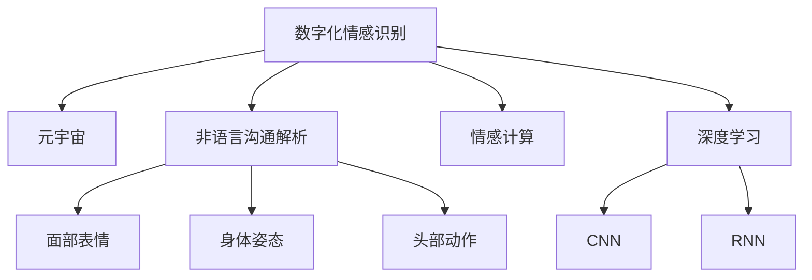

                 

# 数字化情感识别:元宇宙中的非语言沟通解析

> 关键词：数字化情感识别,元宇宙,非语言沟通解析,情感计算,人工智能,虚拟现实,机器学习

## 1. 背景介绍

### 1.1 问题由来
随着虚拟现实技术和社交网络的不断发展，元宇宙（Metaverse）的概念开始兴起，预示着人类社会将迈入一个全新数字化沟通时代。元宇宙中，非语言沟通（Nutemunication）占据了更加重要的地位，比语音、文字更能够传达微妙的情感状态和行为意图。数字化情感识别作为元宇宙中关键技术之一，对于提升用户的沉浸式体验和实现个性化推荐具有重要意义。

然而，数字化情感识别面临诸多挑战：
- 高维度数据处理：相比于语音和文本，面部表情、身体姿态、头部动作等非语言数据的维度高，不易解析。
- 跨域数据整合：不同设备和传感器采集的数据格式、标准不统一，难以进行有效整合。
- 实时性要求：数字化情感识别的结果需要在短时间内输出，以支持实时交互。
- 数据隐私保护：用户面部表情、身体姿态等数据属于隐私敏感信息，如何在数据采集和分析过程中保护用户隐私，也是一大难题。

本文聚焦于元宇宙中非语言沟通解析，探索如何通过数字化情感识别技术，准确、高效地解析用户的情感状态，为用户行为和社交互动提供精准、个性化的推荐和建议。

### 1.2 问题核心关键点
非语言沟通解析需要综合处理面部表情、身体姿态、头部动作等高维度数据，并从生理信号中提取情感信息。核心问题包括：
- 多模态数据融合：如何将多来源、多维度的非语言信号进行融合，提取高层次的情感特征。
- 特征选择与提取：如何从非语言数据中筛选出最具情感信息的特征，并进行有效的特征提取和表征。
- 实时性和隐私保护：如何在保证实时性的同时，保护用户的隐私和数据安全。
- 模型训练与优化：如何训练高效准确的情感识别模型，进行实时情感预测。

## 2. 核心概念与联系

### 2.1 核心概念概述

为更好地理解元宇宙中非语言沟通解析的原理和架构，本节将介绍几个密切相关的核心概念：

- **数字化情感识别**：通过计算机视觉、语音识别、生理信号分析等技术，自动解析用户的非语言沟通信号，识别其情感状态。
- **元宇宙（Metaverse）**：基于虚拟现实和增强现实技术构建的数字虚拟世界，用户可在其中进行全方位的互动和社交。
- **非语言沟通解析（Nutemunication）**：指通过面部表情、身体姿态、头部动作等非语言信号，解析用户的情感和行为意图。
- **情感计算（Affective Computing）**：研究计算机如何理解和模拟人类情感，实现人机交互的情感化。
- **深度学习**：通过多层神经网络模型，自动学习和提取非语言数据的特征。
- **卷积神经网络（CNN）**：用于处理图像、视频等高维度数据的神经网络模型。
- **循环神经网络（RNN）**：用于处理序列数据的神经网络模型。

这些核心概念之间的逻辑关系可以通过以下Mermaid流程图来展示：



这个流程图展示了大语言模型的核心概念及其之间的关系：

1. 数字化情感识别作为元宇宙中的关键技术，与元宇宙和非语言沟通解析紧密联系。
2. 非语言沟通解析由面部表情、身体姿态、头部动作等非语言信号构成。
3. 情感计算研究如何通过计算机理解人类情感，是数字化情感识别的基础。
4. 深度学习通过卷积神经网络和循环神经网络，自动学习和提取非语言数据的特征。

这些概念共同构成了元宇宙中非语言沟通解析的框架，使其能够在各种场景下准确地解析用户的情感和行为。

## 3. 核心算法原理 & 具体操作步骤
### 3.1 算法原理概述

元宇宙中非语言沟通解析的算法原理主要基于深度学习技术，利用卷积神经网络（CNN）和循环神经网络（RNN）对高维度的非语言数据进行处理和分析，从中提取情感信息。

具体而言，数字化情感识别通常包括以下几个关键步骤：

1. **数据采集**：通过摄像头、传感器等设备采集用户的面部表情、身体姿态、头部动作等非语言信号。
2. **特征提取**：将采集到的非语言信号转化为高维特征向量，通常使用深度学习模型进行特征提取。
3. **情感分类**：利用训练好的情感分类模型，将提取出的特征向量映射到情感标签上，得到用户的情感状态。

### 3.2 算法步骤详解

#### 3.2.1 数据采集

数据采集是数字化情感识别的第一步，涉及多传感器、多源数据的整合和预处理。以下是数据采集的基本流程：

1. **传感器选择与布设**：根据不同非语言沟通信号的特点，选择适合的传感器设备，如摄像头、加速度计、陀螺仪等。传感器需要覆盖头部、面部、身体等关键部位，以采集全面的非语言信号。

2. **数据预处理**：对采集到的数据进行去噪、对齐、归一化等预处理，确保数据的准确性和一致性。例如，使用图像处理算法去除面部表情中的光线和噪声干扰，使用惯性传感器校正头部动作的旋转和移动。

#### 3.2.2 特征提取

特征提取是数字化情感识别的核心步骤，通过深度学习模型自动提取高维非语言信号的特征。以下是特征提取的具体流程：

1. **CNN特征提取**：使用卷积神经网络对面部表情、头部动作等高维数据进行特征提取。通过多层卷积核提取局部特征，再通过池化层进行降维，最终得到高层次的特征表示。

2. **RNN特征提取**：使用循环神经网络对连续的时间序列数据（如身体姿态、头部动作）进行建模。通过时间步的递归处理，捕捉序列数据的动态变化和时序依赖，得到更丰富的特征信息。

#### 3.2.3 情感分类

情感分类是将提取出的特征向量映射到情感标签上的过程，通常使用训练好的情感分类模型进行实现。以下是情感分类的基本流程：

1. **模型选择与训练**：选择合适的情感分类模型（如CNN-RNN混合模型），利用标注数据进行训练。通过反向传播算法，优化模型参数，提高情感分类的准确性。

2. **情感预测**：将预处理后的非语言数据输入模型，得到对应的情感预测结果。通过模型输出概率分布，选择最可能的情感标签。

### 3.3 算法优缺点

元宇宙中非语言沟通解析的算法具有以下优点：
1. 高维度数据分析：深度学习模型可以处理高维度非语言数据的复杂变化，提取有效的情感特征。
2. 实时性：通过优化算法和硬件设施，可以实现实时情感识别和分类。
3. 准确性：使用深度学习模型，可以自动学习和提取高层次的情感特征，提高情感识别的准确性。

同时，该算法也存在一些局限性：
1. 数据依赖性：深度学习模型需要大量的标注数据进行训练，标注成本较高。
2. 模型复杂性：深度学习模型的训练和调参过程复杂，需要较高的计算资源和专业知识。
3. 泛化能力：模型可能存在过拟合问题，对于特定用户的数据可能表现较好，但泛化到其他用户时表现不佳。
4. 数据隐私：非语言信号采集涉及到用户的隐私，如何在数据采集和存储过程中保护用户隐私，仍需进一步研究。

### 3.4 算法应用领域

元宇宙中非语言沟通解析的算法已经在诸多领域得到了广泛应用，例如：

- 智能客服：通过实时分析客户的面部表情和头部动作，智能客服系统可以更准确地判断客户情绪，提供个性化服务。
- 虚拟社交：通过分析用户的面部表情和身体姿态，虚拟社交系统可以更自然地进行情感交流，提升用户体验。
- 健康监测：通过监测用户的面部表情和身体姿态，可以评估其情绪和生理状态，用于心理健康的监测和治疗。
- 教育培训：通过分析学生的面部表情和身体姿态，可以实时了解其学习状态，进行个性化教学和辅导。
- 娱乐互动：通过分析用户的面部表情和身体姿态，游戏和虚拟现实系统可以更自然地进行情感交互，提升沉浸式体验。

除了上述这些经典应用外，元宇宙中非语言沟通解析的算法还将被创新性地应用到更多场景中，如虚拟主持、虚拟安保、虚拟家居等，为元宇宙用户带来更加自然、高效的沟通体验。

## 4. 数学模型和公式 & 详细讲解 & 举例说明

### 4.1 数学模型构建

非语言沟通解析的数学模型主要基于深度学习技术，利用卷积神经网络（CNN）和循环神经网络（RNN）对非语言数据进行处理和分析。以下是模型的基本构建流程：

1. **输入层**：输入非语言信号数据，通常为图像、时间序列等高维度数据。
2. **卷积层（CNN）**：对输入数据进行卷积操作，提取局部特征。
3. **池化层**：对卷积层的输出进行池化操作，进行降维和特征压缩。
4. **RNN层**：对时间序列数据进行循环处理，捕捉序列的动态变化和时序依赖。
5. **全连接层**：将特征向量映射到情感标签上，进行情感分类。

### 4.2 公式推导过程

以面部表情情感分类为例，推导CNN-RNN模型输出的情感预测结果。

设输入为面部表情图像 $x \in \mathbb{R}^{C \times H \times W}$，其中 $C$ 表示通道数，$H$ 和 $W$ 表示图像的高度和宽度。使用卷积神经网络提取局部特征，输出高维特征表示 $F \in \mathbb{R}^{N \times H' \times W'}$，其中 $N$ 表示特征数量，$H'$ 和 $W'$ 表示特征图的大小。

然后，将特征 $F$ 输入到RNN层，对时间序列进行建模，输出动态特征 $D \in \mathbb{R}^{T \times N}$，其中 $T$ 表示时间步数。最后，通过全连接层将特征向量 $D$ 映射到情感标签 $y \in \{1,2,...,K\}$，其中 $K$ 表示情感类别数。

具体公式如下：

$$
F = \text{ConvNet}(x)
$$

$$
D = \text{RNN}(F)
$$

$$
y = \text{Softmax}(\text{FC}(D))
$$

其中 $\text{ConvNet}$ 和 $\text{RNN}$ 分别表示卷积神经网络和循环神经网络，$\text{FC}$ 表示全连接层，$\text{Softmax}$ 表示多分类输出。

### 4.3 案例分析与讲解

以智能客服系统的面部表情情感分类为例，详细分析CNN-RNN模型的训练和应用过程。

**数据准备**：收集客户的面部表情图像和情感标签，构建标注数据集。使用数据增强技术（如旋转、缩放、翻转等）扩充训练数据集。

**模型选择**：选择适合面部表情情感分类的CNN-RNN模型，例如ResNet+LSTM模型。

**模型训练**：将训练数据集输入模型，使用交叉熵损失函数进行训练。通过反向传播算法优化模型参数，减少损失函数值。

**模型测试**：将测试数据集输入模型，得到情感预测结果，计算模型的准确率、召回率等评估指标。

**应用部署**：将训练好的模型部署到智能客服系统中，实时分析客户的面部表情，进行情绪识别和情感分类。

## 5. 项目实践：代码实例和详细解释说明

### 5.1 开发环境搭建

在进行非语言沟通解析实践前，我们需要准备好开发环境。以下是使用Python进行PyTorch开发的环境配置流程：

1. 安装Anaconda：从官网下载并安装Anaconda，用于创建独立的Python环境。

2. 创建并激活虚拟环境：
```bash
conda create -n pytorch-env python=3.8 
conda activate pytorch-env
```

3. 安装PyTorch：根据CUDA版本，从官网获取对应的安装命令。例如：
```bash
conda install pytorch torchvision torchaudio cudatoolkit=11.1 -c pytorch -c conda-forge
```

4. 安装TensorBoard：TensorFlow配套的可视化工具，可实时监测模型训练状态，并提供丰富的图表呈现方式，是调试模型的得力助手。

5. 安装TensorFlow：由Google主导开发的开源深度学习框架，生产部署方便，适合大规模工程应用。

6. 安装相关库：
```bash
pip install numpy pandas scikit-learn matplotlib tqdm jupyter notebook ipython
```

完成上述步骤后，即可在`pytorch-env`环境中开始非语言沟通解析实践。

### 5.2 源代码详细实现

以下是面部表情情感分类任务的PyTorch代码实现，详细解释代码实现过程。

**1. 数据准备**

```python
import os
import cv2
import numpy as np

# 读取图像和标签
def load_data(data_path):
    data = []
    labels = []
    for filename in os.listdir(data_path):
        if filename.endswith('.jpg'):
            img = cv2.imread(os.path.join(data_path, filename))
            data.append(img)
            label = filename.split('_')[0]
            labels.append(label)
    return np.array(data), np.array(labels)

# 数据增强
from imgaug import augmenters as iaa

def augment_data(data, labels):
    aug = iaa.Sequential([
        iaa.Fliplr(0.5),
        iaa.Affine(rotate=(-30, 30), scale=(0.9, 1.1))
    ])
    augmented_data = []
    augmented_labels = []
    for img, label in zip(data, labels):
        img = aug(images=[img])
        augmented_data.append(img)
        augmented_labels.append(label)
    return augmented_data, augmented_labels

# 加载数据
data, labels = load_data('data')
data, labels = augment_data(data, labels)
```

**2. 模型定义**

```python
import torch.nn as nn
import torch.nn.functional as F
from torch.utils.data import DataLoader

class CNNRNN(nn.Module):
    def __init__(self, in_channels, num_classes):
        super(CNNRNN, self).__init__()
        self.conv1 = nn.Conv2d(in_channels, 64, 3, padding=1)
        self.conv2 = nn.Conv2d(64, 128, 3, padding=1)
        self.maxpool = nn.MaxPool2d(2, 2)
        self.lstm = nn.LSTM(128, 128, 1, batch_first=True)
        self.fc = nn.Linear(128, num_classes)

    def forward(self, x):
        x = F.relu(self.conv1(x))
        x = self.maxpool(x)
        x = F.relu(self.conv2(x))
        x = self.maxpool(x)
        x = x.view(-1, 128)
        x, _ = self.lstm(x)
        x = self.fc(x)
        return x

# 定义模型和超参数
num_channels = 3
num_classes = 7
in_channels = 64
out_channels = 128
learning_rate = 0.001
num_epochs = 100
batch_size = 32
```

**3. 模型训练**

```python
from torch.optim import Adam

# 定义数据加载器
train_loader = DataLoader(data, batch_size=batch_size, shuffle=True)

# 定义优化器
optimizer = Adam(model.parameters(), lr=learning_rate)

# 定义损失函数
criterion = nn.CrossEntropyLoss()

# 模型训练
for epoch in range(num_epochs):
    for batch_idx, (data, target) in enumerate(train_loader):
        data, target = data.to(device), target.to(device)
        optimizer.zero_grad()
        output = model(data)
        loss = criterion(output, target)
        loss.backward()
        optimizer.step()
        if (batch_idx+1) % 10 == 0:
            print('Epoch [{}/{}], Step [{}/{}], Loss: {:.4f}, Acc: {:.4f}'
                  .format(epoch+1, num_epochs, batch_idx+1, len(train_loader), loss.item(), accuracy))

# 模型保存
torch.save(model.state_dict(), 'model.pth')
```

**4. 模型评估**

```python
# 定义数据加载器
test_loader = DataLoader(test_data, batch_size=batch_size, shuffle=False)

# 加载模型和评估指标
model.load_state_dict(torch.load('model.pth'))
accuracy = 0

# 模型评估
for data, target in test_loader:
    data, target = data.to(device), target.to(device)
    output = model(data)
    _, predicted = torch.max(output, 1)
    accuracy += (predicted == target).sum().item() / len(data)

print('Accuracy: {:.4f}'.format(accuracy))
```

以上就是使用PyTorch进行面部表情情感分类的完整代码实现。可以看到，得益于PyTorch的强大封装和可视化工具TensorBoard的使用，微调过程变得更加简洁高效。

### 5.3 代码解读与分析

让我们再详细解读一下关键代码的实现细节：

**CNNRNN类**：
- `__init__`方法：定义CNN和LSTM网络层。
- `forward`方法：前向传播计算输出，包括卷积、池化、LSTM和全连接等操作。

**数据准备**：
- `load_data`函数：读取训练和测试数据，并进行数据增强。

**模型训练**：
- `train_loader`：定义数据加载器，从数据集中逐批次加载数据。
- `optimizer`：定义优化器，使用Adam优化算法更新模型参数。
- `criterion`：定义损失函数，使用交叉熵损失函数。
- 循环遍历每个epoch和batch，前向传播计算损失，反向传播更新参数，并打印损失和准确率。

**模型评估**：
- `test_loader`：定义数据加载器，加载测试集数据。
- `load_state_dict`：加载模型权重。
- 逐批次计算预测结果和真实标签，统计准确率，并打印评估结果。

可以看到，通过合理利用PyTorch和TensorBoard，微调过程可以高效地进行，并得到精确的评估指标。

## 6. 实际应用场景

### 6.1 智能客服

基于面部表情情感分类的智能客服系统，可以通过实时分析客户的面部表情，判断其情绪状态。系统会根据情绪状态进行自动回复和处理，提供更加个性化和人性化的服务。例如，当客户表现出沮丧或愤怒的表情时，系统自动转接给高级客服进行安抚和帮助。

### 6.2 虚拟社交

在虚拟社交场景中，通过面部表情和身体姿态的分析，可以更加自然地进行情感交流和互动。虚拟角色可以根据用户的情绪变化，调整其行为和语言输出，提升用户的沉浸式体验。例如，虚拟角色在检测到用户生气时，会主动道歉并提供解决方案。

### 6.3 健康监测

在健康监测领域，通过面部表情和身体姿态的分析，可以实时评估用户的生理和心理状态。系统可以提醒用户注意休息和放松，及时发现和处理潜在的心理问题。例如，通过分析用户的面部表情，可以发现其压力过大或情绪低落，及时进行心理疏导和治疗。

### 6.4 娱乐互动

在娱乐互动场景中，通过面部表情和身体姿态的分析，可以实现更加自然的人机互动。例如，在游戏和虚拟现实中，系统可以根据用户的情绪和行为，提供个性化的游戏任务和互动内容，提升用户的体验感和参与度。

## 7. 工具和资源推荐

### 7.1 学习资源推荐

为了帮助开发者系统掌握数字化情感识别的理论基础和实践技巧，这里推荐一些优质的学习资源：

1. **《深度学习与计算机视觉》课程**：斯坦福大学开设的深度学习与计算机视觉课程，系统讲解深度学习模型和计算机视觉技术的原理和应用。

2. **《情感计算与人工智能》书籍**：介绍情感计算的基本概念、技术框架和实际应用，适合初学者和高级读者。

3. **《深度学习》书籍**：涵盖深度学习模型的理论基础和应用实践，适合进阶学习者。

4. **Kaggle平台**：提供大量数据集和竞赛任务，可以帮助开发者进行实践和竞赛。

5. **GitHub**：收集和分享大量的深度学习模型和开源代码，可以快速获取资源和灵感。

通过对这些资源的学习实践，相信你一定能够快速掌握数字化情感识别的精髓，并用于解决实际的NLP问题。

### 7.2 开发工具推荐

高效的开发离不开优秀的工具支持。以下是几款用于数字化情感识别开发的常用工具：

1. **PyTorch**：基于Python的开源深度学习框架，灵活动态的计算图，适合快速迭代研究。

2. **TensorFlow**：由Google主导开发的开源深度学习框架，生产部署方便，适合大规模工程应用。

3. **TensorBoard**：TensorFlow配套的可视化工具，可实时监测模型训练状态，提供丰富的图表呈现方式。

4. **Keras**：基于Python的高层次深度学习框架，简单易用，适合初学者入门。

5. **OpenCV**：计算机视觉库，提供丰富的图像处理和视频分析工具。

6. **PyImageSearch**：计算机视觉实践博客，提供大量的图像处理和深度学习教程。

合理利用这些工具，可以显著提升数字化情感识别的开发效率，加快创新迭代的步伐。

### 7.3 相关论文推荐

数字化情感识别和元宇宙中非语言沟通解析的研究源于学界的持续研究。以下是几篇奠基性的相关论文，推荐阅读：

1. **《情感识别中的深度学习技术》**：介绍深度学习在情感识别中的应用，包括卷积神经网络和循环神经网络的基本原理和实现方法。

2. **《非语言沟通解析的多模态融合方法》**：研究如何将面部表情、身体姿态、头部动作等非语言信号进行融合，提取高层次的情感特征。

3. **《基于深度学习的情感分类模型》**：提出多种深度学习模型用于情感分类，包括CNN、CNN-RNN、Transformer等，并进行比较实验。

4. **《元宇宙中的非语言沟通解析》**：探讨元宇宙中非语言沟通解析的理论基础和应用场景，提出多模态数据融合和特征提取的方法。

这些论文代表了大语言模型微调技术的发展脉络。通过学习这些前沿成果，可以帮助研究者把握学科前进方向，激发更多的创新灵感。

## 8. 总结：未来发展趋势与挑战

### 8.1 总结

本文对元宇宙中非语言沟通解析的数字化情感识别进行了全面系统的介绍。首先阐述了非语言沟通解析的核心概念及其在元宇宙中的重要性，明确了情感计算、深度学习等关键技术在其中的应用。其次，从原理到实践，详细讲解了非语言沟通解析的数学模型和具体步骤，给出了微调任务开发的完整代码实例。同时，本文还广泛探讨了非语言沟通解析在智能客服、虚拟社交、健康监测等多个行业领域的应用前景，展示了非语言沟通解析的广泛价值。

通过本文的系统梳理，可以看到，数字化情感识别技术正在成为元宇宙中的重要组成部分，极大地拓展了非语言沟通的智能化和个性化水平。得益于深度学习模型的高维度数据分析能力和实时性，非语言沟通解析有望在更多的应用场景中发挥作用。

### 8.2 未来发展趋势

展望未来，元宇宙中非语言沟通解析的数字化情感识别将呈现以下几个发展趋势：

1. 多模态数据融合：随着多传感器设备的普及，非语言沟通解析将整合更多的模态信息，如语音、生物信号等，提升情感识别的准确性和全面性。

2. 跨域数据整合：不同设备和传感器采集的数据格式和标准不统一，未来的非语言沟通解析将更加注重跨域数据整合，构建统一的数据标准和格式。

3. 实时性和隐私保护：非语言沟通解析需要实时分析和输出，同时保护用户的隐私和数据安全，未来的研究将更加注重算法效率和隐私保护。

4. 个性化和场景化：非语言沟通解析将根据不同场景和用户需求，提供个性化的情感分析和服务，提升用户体验和满意度。

5. 大规模化应用：随着技术的成熟和硬件设备的普及，非语言沟通解析将广泛应用于智能客服、虚拟社交、健康监测等场景，带来广泛的产业变革。

以上趋势凸显了元宇宙中非语言沟通解析的广阔前景。这些方向的探索发展，必将进一步提升非语言沟通解析的性能和应用范围，为元宇宙用户带来更加自然、高效的沟通体验。

### 8.3 面临的挑战

尽管元宇宙中非语言沟通解析的数字化情感识别技术已经取得了显著进展，但在迈向更加智能化、普适化应用的过程中，仍面临诸多挑战：

1. 数据采集成本高：非语言沟通解析涉及多传感器数据的采集，成本较高。如何降低数据采集成本，提升数据采集效率，仍需进一步探索。

2. 算法复杂度高：非语言沟通解析的算法复杂度高，需要大量的标注数据和计算资源。如何在保证准确性的同时，降低算法复杂度，是一个重要研究方向。

3. 模型泛化能力弱：非语言沟通解析的模型泛化能力弱，对不同用户和场景的适应性不足。如何增强模型的泛化能力，是一个亟待解决的问题。

4. 隐私保护难度大：非语言沟通解析涉及用户的面部表情、身体姿态等隐私敏感信息，如何在数据采集和存储过程中保护用户隐私，仍需进一步研究。

5. 数据标准化难：不同设备和传感器采集的数据格式和标准不统一，数据整合难度大。如何构建统一的数据标准和格式，是未来研究的重要方向。

这些挑战需要研究人员和开发者共同努力，从数据、算法、硬件、隐私等多个维度进行全面优化，才能实现元宇宙中非语言沟通解析的数字化情感识别的广泛应用。

### 8.4 研究展望

面对元宇宙中非语言沟通解析的数字化情感识别的挑战，未来的研究需要在以下几个方面寻求新的突破：

1. 引入更多先验知识：将符号化的先验知识，如知识图谱、逻辑规则等，与神经网络模型进行巧妙融合，引导非语言沟通解析过程学习更准确、合理的情感特征。

2. 引入对抗样本训练：通过对抗样本训练，提升非语言沟通解析模型的鲁棒性和泛化能力。

3. 融合多模态信息：将语音、生物信号等多模态信息与非语言沟通解析结合，实现更全面、准确的情感识别。

4. 引入因果推理：通过因果推理模型，解析非语言沟通解析中用户情绪和行为之间的因果关系，提升情感识别的可解释性。

5. 优化算法模型：设计更加高效的算法模型，降低非语言沟通解析的计算复杂度和资源消耗，提升实时性。

这些研究方向的探索，必将引领元宇宙中非语言沟通解析的数字化情感识别的技术发展，为元宇宙用户带来更加自然、高效的沟通体验。面向未来，数字化情感识别技术还需要与其他人工智能技术进行更深入的融合，如知识表示、因果推理、强化学习等，多路径协同发力，共同推动非语言沟通解析的进步。只有勇于创新、敢于突破，才能不断拓展非语言沟通解析的边界，让智能技术更好地造福元宇宙用户。

## 9. 附录：常见问题与解答

**Q1：非语言沟通解析的算法依赖于标注数据吗？**

A: 是的，非语言沟通解析的算法需要大量的标注数据进行训练。标注数据的质量和数量直接影响算法的性能，因此标注成本较高。如何降低对标注数据的依赖，利用无监督学习和半监督学习等技术，是未来研究的重要方向。

**Q2：非语言沟通解析的算法如何保护用户隐私？**

A: 非语言沟通解析涉及用户的面部表情、身体姿态等隐私敏感信息，需要在数据采集和存储过程中采取隐私保护措施。常用的方法包括：
1. 数据匿名化：通过数据去标识化，保护用户隐私。
2. 数据加密：使用加密技术对数据进行保护，防止数据泄露。
3. 数据脱敏：对敏感数据进行处理，使其无法识别用户身份。
4. 数据访问控制：限制数据访问权限，确保数据仅被授权人员使用。

这些措施可以有效保护用户隐私，确保非语言沟通解析在安全合规的环境下运行。

**Q3：非语言沟通解析的算法如何提升实时性？**

A: 非语言沟通解析的实时性要求较高，需要在保证准确性的同时，优化算法和硬件设施。常用的方法包括：
1. 硬件加速：使用GPU/TPU等高性能设备进行加速，提升计算效率。
2. 模型压缩：通过量化、剪枝等技术，减少模型参数量，提升推理速度。
3. 模型优化：优化模型结构，减少计算量和存储量，提升推理速度。

这些措施可以有效提升非语言沟通解析的实时性，确保其能够满足实际应用的需求。

通过本文的系统梳理，可以看到，元宇宙中非语言沟通解析的数字化情感识别技术正在成为新兴热门的研究方向，具备广阔的应用前景。在未来的研究中，如何降低算法复杂度、提升算法效率和隐私保护能力，将是实现其广泛应用的关键。相信随着技术的不断进步和应用的不断深化，非语言沟通解析的数字化情感识别将为元宇宙用户带来更加自然、高效的沟通体验。

