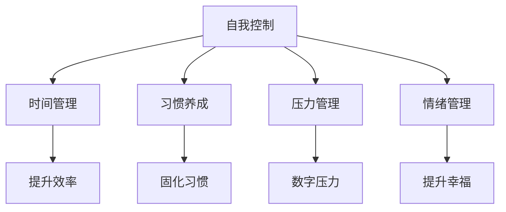

                 

## 1. 背景介绍

### 1.1 问题由来
在快速发展的数字化时代，个人效率提升、自我管理能力的需求愈发迫切。为了克服拖延、分散注意力、自我控制能力不足等常见问题，数字时代孕育出诸多技术解决方案，如番茄工作法、时间管理应用、习惯追踪器等。但这些方法在应用过程中，往往难以适应个体差异，且难以结合实时数据反馈进行调整。

### 1.2 问题核心关键点
本文聚焦于利用人工智能技术，对个体自我控制能力进行精确量化、实时监测和个性化训练的数字化技术应用。具体而言，将利用AI增强工具对个体时间管理、任务执行、习惯养成、压力管理等关键维度的数字化训练，通过科学量化与个性化训练方案，帮助个体提升自我控制与时间管理能力。

### 1.3 问题研究意义
研究AI增强的自我控制训练技术，对促进个体高效工作、提升生产力和生活质量具有重要意义：

1. **提升生产效率**：帮助个体克服拖延症，高效安排时间和任务，提升工作效率。
2. **改善生活习惯**：通过量化分析与智能建议，帮助个体形成良好习惯，改善生活质量。
3. **增强自我控制**：借助AI分析个体行为模式，提供实时反馈和训练建议，增强自我控制能力。
4. **应对数字压力**：通过智能监测与预警，帮助个体应对数字化工作中的信息过载与压力问题。
5. **促进健康发展**：在提升工作效率的同时，强化心理健康与情绪管理，促进个体健康全面发展。

## 2. 核心概念与联系

### 2.1 核心概念概述

为更好理解AI增强的自我控制训练方法，本节将介绍几个关键概念：

- **自我控制(自我管理)**：指个体在面对各种诱惑与干扰时，能够自律地管理时间和行为的能力。
- **时间管理**：通过合理规划和分配时间，以提高生产效率和达成目标的能力。
- **习惯养成**：通过重复执行特定行为，逐步形成并固化为自动反应的能力。
- **压力管理**：通过心理调节和行为干预，减轻和缓解心理压力的能力。
- **数字压力**：数字化工作环境中，信息过载、多任务处理等压力源导致的心理负担。
- **情绪管理**：通过有效应对和管理情绪，提升心理韧性与幸福感的能力。

这些核心概念之间的关系可以通过以下Mermaid流程图来展示：



此流程图展示了自我控制与其他相关概念之间的联系：

1. **时间管理**：自我控制能力体现在时间管理上，合理规划时间能提升生产效率。
2. **习惯养成**：通过重复执行良好习惯，自我控制能力逐步固化，形成良性循环。
3. **压力管理**：有效应对压力能增强自我控制，避免因压力失控导致的低效行为。
4. **情绪管理**：情绪稳定是自我控制的保障，能够提升工作效率和生活质量。
5. **数字压力**：数字化环境中存在的信息过载和多重任务，可能削弱自我控制能力。

## 3. 核心算法原理 & 具体操作步骤
### 3.1 算法原理概述

AI增强的自我控制训练，本质上是对个体行为数据进行科学量化、实时监测与个性化训练的过程。核心思想是：

1. **行为量化**：通过各种传感器、日志、问卷等手段，收集个体的时间使用、任务执行、习惯养成、情绪状态等数据。
2. **智能分析**：利用AI技术对收集到的数据进行智能分析，识别出行为模式、趋势与异常。
3. **个性化训练**：基于智能分析结果，设计个性化训练方案，引导个体进行自我调整与优化。

具体而言，该方法主要包括以下几个步骤：

- **数据收集**：利用多种设备与工具收集个体行为数据。
- **智能分析**：使用机器学习与深度学习模型对行为数据进行分析，识别行为模式与趋势。
- **反馈与干预**：根据分析结果，提供实时反馈与训练建议，引导个体进行自我调整。

### 3.2 算法步骤详解

以下详细描述AI增强自我控制训练的具体步骤：

**Step 1: 数据收集**

利用各种设备和工具，收集个体的行为数据。这些数据包括：

- **时间日志**：记录个体每天的时间使用情况，包括工作、休息、娱乐、睡眠等。
- **任务日志**：记录个体完成的任务类型、难度、时间等，反映任务执行情况。
- **习惯追踪**：记录个体每天的习惯养成情况，如阅读、锻炼、饮食等。
- **情绪监测**：通过情绪监测设备或应用，记录个体的情绪状态与波动情况。
- **生理数据**：通过可穿戴设备，监测个体的心率、睡眠深度、体温等生理参数。

**Step 2: 智能分析**

对收集到的数据进行智能分析，主要包括以下步骤：

1. **行为模式识别**：使用机器学习算法，如聚类分析、时间序列分析等，识别出个体的时间使用模式、习惯养成模式与情绪波动模式。
2. **趋势与异常检测**：通过数据分析与模型预测，识别出行为数据的趋势与异常。例如，长时间不休息可能预示疲劳积累，某时间段内情绪剧烈波动可能预示压力。
3. **量化评估**：利用量化指标，如时间利用效率、任务完成度、习惯养成率等，综合评估个体的自我控制能力。

**Step 3: 反馈与干预**

根据智能分析结果，提供实时反馈与个性化训练建议，引导个体进行自我调整：

1. **实时反馈**：通过移动应用、智能手环等设备，实时显示行为数据与分析结果，提供即时反馈。例如，显示当前时间利用效率、任务进度与习惯养成情况。
2. **训练建议**：基于智能分析结果，设计个性化训练方案。例如，根据分析出的疲劳模式，建议适当增加休息时间；根据任务完成度，建议优化时间分配策略。

### 3.3 算法优缺点

AI增强的自我控制训练方法具有以下优点：

1. **实时监测与反馈**：通过智能设备实时收集与分析行为数据，提供实时反馈与训练建议。
2. **个性化训练**：基于数据分析结果，提供个性化训练方案，提升自我控制与时间管理能力。
3. **科学量化**：利用科学量化指标评估个体自我控制能力，避免主观评估偏差。
4. **多维度支持**：覆盖时间管理、习惯养成、压力管理、情绪管理等多个维度，全面提升个体自我控制能力。

同时，该方法也存在一些局限性：

1. **隐私问题**：行为数据收集可能涉及隐私问题，需要严格的数据保护与伦理审查。
2. **依赖设备**：训练效果高度依赖于设备的准确性、完备性与使用频率。
3. **模型误差**：AI模型可能存在误差，分析结果可能不完全准确，影响训练效果。
4. **用户体验**：过度依赖技术可能导致个体对设备的依赖性强，影响自主性。

### 3.4 算法应用领域

AI增强的自我控制训练技术在多个领域具有广泛应用，具体如下：

1. **企业员工培训**：通过数据分析与训练建议，帮助员工提升工作效率，改善时间管理能力。
2. **教育培训**：利用数据分析，个性化调整学习计划，提升学生学习效率与习惯养成。
3. **医疗健康**：通过智能监测与干预，帮助患者管理情绪与压力，促进健康康复。
4. **心理辅导**：结合心理测评与数据分析，提供个性化辅导建议，提升心理韧性。
5. **数字化产品**：将训练技术与数字化产品结合，提升产品用户体验，增强产品附加价值。

## 4. 数学模型和公式 & 详细讲解
### 4.1 数学模型构建

本节将使用数学语言对AI增强自我控制训练过程进行更加严格的刻画。

记个体的行为数据为 $D=\{(x_i,y_i)\}_{i=1}^N$，其中 $x_i$ 为行为数据，$y_i$ 为对应标签或时间戳。假设计算模型为 $M_{\theta}$，其中 $\theta$ 为模型参数。

定义行为数据在时间序列上的表示为 $T=\{t_i\}_{i=1}^N$，其中 $t_i$ 为时间戳。

### 4.2 公式推导过程

以下是基于AI增强自我控制训练的数学模型推导过程：

1. **行为数据建模**：
   假设个体的时间使用情况为 $t_i$，任务完成情况为 $y_i$，习惯养成情况为 $z_i$，情绪状态为 $w_i$。
   $$
   \begin{aligned}
   t_i &\sim \mathcal{N}(\mu_t, \sigma_t^2) \\
   y_i &\sim \mathcal{B}(\mu_y, \sigma_y^2) \\
   z_i &\sim \mathcal{B}(\mu_z, \sigma_z^2) \\
   w_i &\sim \mathcal{N}(\mu_w, \sigma_w^2)
   \end{aligned}
   $$

2. **行为模式识别**：
   利用聚类算法识别时间使用模式、任务完成模式、习惯养成模式与情绪波动模式。
   $$
   K = \min_k \sum_{i=1}^N ||x_i - \mu_k||^2
   $$

3. **趋势与异常检测**：
   通过时间序列分析，检测行为数据的趋势与异常。
   $$
   \begin{aligned}
   \Delta_i &= t_i - t_{i-1} \\
   \dot{\Delta}_i &= \frac{\Delta_i - \bar{\Delta}}{\sigma_{\Delta}} \\
   \end{aligned}
   $$

4. **量化评估**：
   利用量化指标，如时间利用效率 $\eta$、任务完成度 $p$、习惯养成率 $r$ 等，综合评估个体的自我控制能力。
   $$
   \eta = \frac{1}{N} \sum_{i=1}^N \frac{y_i}{\sigma_y} \\
   p = \frac{1}{N} \sum_{i=1}^N \frac{z_i}{\sigma_z} \\
   r = \frac{1}{N} \sum_{i=1}^N \frac{w_i}{\sigma_w}
   $$

### 4.3 案例分析与讲解

以情绪管理为例，说明AI增强自我控制训练的实际应用：

1. **数据收集**：通过智能手环收集个体的情绪数据 $w_i$，记录情绪变化情况。
2. **智能分析**：利用时间序列分析，检测情绪变化的趋势与异常。
3. **实时反馈**：通过移动应用实时显示情绪变化情况，提供实时反馈。
4. **训练建议**：根据情绪变化情况，建议采取深呼吸、短暂休息等策略，缓解情绪压力。

## 5. 项目实践：代码实例和详细解释说明
### 5.1 开发环境搭建

在进行AI增强自我控制训练实践前，需要准备好开发环境。以下是使用Python进行TensorFlow开发的环境配置流程：

1. 安装Anaconda：从官网下载并安装Anaconda，用于创建独立的Python环境。

2. 创建并激活虚拟环境：
```bash
conda create -n self-control-env python=3.8 
conda activate self-control-env
```

3. 安装TensorFlow：根据CUDA版本，从官网获取对应的安装命令。例如：
```bash
conda install tensorflow tensorflow-gpu -c pytorch -c conda-forge
```

4. 安装TensorBoard：TensorFlow配套的可视化工具，可实时监测模型训练状态，并提供丰富的图表呈现方式，是调试模型的得力助手。

5. 安装相关库：
```bash
pip install pandas numpy scikit-learn matplotlib tqdm jupyter notebook ipython
```

完成上述步骤后，即可在`self-control-env`环境中开始训练实践。

### 5.2 源代码详细实现

下面我们以情绪管理任务为例，给出使用TensorFlow进行AI增强自我控制训练的代码实现。

首先，定义情绪数据处理函数：

```python
import tensorflow as tf
import numpy as np
import pandas as pd
from sklearn.preprocessing import MinMaxScaler

def preprocess_data(data):
    scaler = MinMaxScaler(feature_range=(0, 1))
    scaled_data = scaler.fit_transform(data)
    return scaled_data

def read_data(file_path):
    data = pd.read_csv(file_path)
    return data

def load_data(file_path):
    data = read_data(file_path)
    X = data.drop('target', axis=1)
    y = data['target']
    return X, y

def train_model(X, y, model, epochs=100, batch_size=32, verbose=0):
    model.compile(loss='mse', optimizer='adam', metrics=['mse'])
    history = model.fit(X, y, epochs=epochs, batch_size=batch_size, verbose=verbose)
    return history

def evaluate_model(model, X_test, y_test):
    loss, mse = model.evaluate(X_test, y_test)
    return loss, mse
```

然后，定义训练与评估函数：

```python
def train_model(X, y, model, epochs=100, batch_size=32, verbose=0):
    model.compile(loss='mse', optimizer='adam', metrics=['mse'])
    history = model.fit(X, y, epochs=epochs, batch_size=batch_size, verbose=verbose)
    return history

def evaluate_model(model, X_test, y_test):
    loss, mse = model.evaluate(X_test, y_test)
    return loss, mse
```

接着，定义训练流程：

```python
X_train, y_train = load_data('train.csv')
X_test, y_test = load_data('test.csv')

model = tf.keras.Sequential([
    tf.keras.layers.Dense(64, input_shape=(X_train.shape[1],), activation='relu'),
    tf.keras.layers.Dense(1)
])

history = train_model(X_train, y_train, model, epochs=100, batch_size=32, verbose=0)

loss, mse = evaluate_model(model, X_test, y_test)
print(f'Test loss: {loss:.4f}')
print(f'Test mse: {mse:.4f}')
```

以上就是使用TensorFlow进行情绪管理任务AI增强自我控制训练的完整代码实现。可以看到，TensorFlow提供的高级API使得模型训练和评估过程非常简单。

### 5.3 代码解读与分析

让我们再详细解读一下关键代码的实现细节：

**preprocess_data函数**：
- 将情绪数据进行标准化处理，使其在[0,1]之间。

**read_data函数**：
- 从CSV文件中读取情绪数据，并返回数据集。

**load_data函数**：
- 将数据集分割为特征与标签，返回特征与标签。

**train_model函数**：
- 定义训练函数，通过模型编译、模型训练与模型评估，完成训练过程。

**evaluate_model函数**：
- 定义模型评估函数，评估模型在测试集上的表现。

**训练流程**：
- 加载训练集和测试集数据。
- 定义模型结构。
- 调用训练函数进行模型训练。
- 调用评估函数评估模型在测试集上的表现。

以上代码展示了使用TensorFlow进行情绪管理任务AI增强自我控制训练的基本流程，通过不断优化模型结构和训练参数，可以获得更好的情绪管理效果。

## 6. 实际应用场景
### 6.1 智能办公室环境

AI增强的自我控制训练技术可以应用于智能办公室环境，提升员工的工作效率与生活质量。具体而言，可以构建智能办公室管理系统，实现以下功能：

1. **时间管理**：实时监测员工的时间使用情况，自动提醒任务截止时间，优化时间分配策略。
2. **任务执行**：根据任务完成度，动态调整任务优先级，帮助员工合理规划工作任务。
3. **习惯养成**：记录员工的日常习惯，提供个性化建议，帮助员工养成健康的生活习惯。
4. **情绪管理**：实时监测员工的情绪状态，提供情绪调节建议，缓解工作压力。

通过智能办公室管理系统，员工能够更好地管理自己的时间和工作，提升工作效率与生活质量。

### 6.2 教育培训平台

在教育培训领域，AI增强的自我控制训练技术可以用于个性化学习方案的制定，提升学生的学习效率与习惯养成能力。具体而言，可以构建个性化学习平台，实现以下功能：

1. **时间管理**：记录学生的学习时间与效率，提供个性化学习建议。
2. **任务执行**：根据学生的学习进度与难度，动态调整学习任务与难度。
3. **习惯养成**：记录学生的学习习惯，提供习惯养成建议，帮助学生形成良好的学习习惯。
4. **情绪管理**：监测学生的情绪状态，提供情绪调节建议，提升学习积极性。

通过个性化学习平台，学生能够更好地管理自己的学习时间与任务，提升学习效率与习惯养成能力，促进全面发展。

### 6.3 企业员工辅导

在企业员工培训中，AI增强的自我控制训练技术可以用于员工的职业发展规划与心理健康管理。具体而言，可以构建员工辅导系统，实现以下功能：

1. **时间管理**：监测员工的时间使用情况，提供个性化时间管理建议。
2. **任务执行**：根据员工的任务完成度，动态调整任务与优先级，优化工作安排。
3. **习惯养成**：记录员工的工作习惯，提供个性化习惯养成建议，提升工作效率。
4. **情绪管理**：监测员工的情绪状态，提供情绪调节建议，缓解工作压力。

通过员工辅导系统，员工能够更好地管理自己的工作与时间，提升工作效率与生活质量，促进职业发展。

### 6.4 未来应用展望

随着AI技术的不断进步，AI增强的自我控制训练技术将在更多领域得到应用，为个人效率提升与生活质量改善带来新突破。

在智慧城市治理中，AI增强的自我控制训练技术可以用于提升市民的自我管理能力，提升城市治理的智能化水平。

在医疗健康领域，AI增强的自我控制训练技术可以用于患者的健康管理，提升患者的自我控制与心理健康水平。

在金融领域，AI增强的自我控制训练技术可以用于金融从业人员的职业规划与心理压力管理，提升金融行业的整体效率与安全性。

未来，随着技术的不断进步，AI增强的自我控制训练技术将在更多领域得到应用，为人类生活与工作带来更多便利与效率提升。

## 7. 工具和资源推荐
### 7.1 学习资源推荐

为了帮助开发者系统掌握AI增强的自我控制训练的理论基础和实践技巧，这里推荐一些优质的学习资源：

1. **TensorFlow官方文档**：TensorFlow的官方文档，提供了丰富的模型训练与优化方法，适合深入学习。
2. **TensorBoard教程**：TensorBoard的官方教程，提供了实时监测与调试模型的工具。
3. **《深度学习入门》书籍**：涵盖深度学习基础知识与模型训练技巧，适合初学者学习。
4. **《机器学习实战》书籍**：提供实用的机器学习案例，适合实战学习。
5. **在线课程**：如Coursera、Udacity等平台提供的深度学习与机器学习课程。

通过对这些资源的学习实践，相信你一定能够快速掌握AI增强的自我控制训练的精髓，并用于解决实际的自我管理问题。

### 7.2 开发工具推荐

高效的开发离不开优秀的工具支持。以下是几款用于AI增强自我控制训练开发的常用工具：

1. **TensorFlow**：由Google主导开发的开源深度学习框架，生产部署方便，适合大规模工程应用。
2. **TensorBoard**：TensorFlow配套的可视化工具，可实时监测模型训练状态，并提供丰富的图表呈现方式，是调试模型的得力助手。
3. **TensorFlow Addons**：TensorFlow的官方扩展库，提供了更多的深度学习工具与组件。
4. **Jupyter Notebook**：开源的Python笔记本环境，方便进行交互式开发与数据可视化。
5. **PyTorch**：基于Python的开源深度学习框架，灵活动态的计算图，适合快速迭代研究。

合理利用这些工具，可以显著提升AI增强自我控制训练任务的开发效率，加快创新迭代的步伐。

### 7.3 相关论文推荐

AI增强的自我控制训练技术的发展源于学界的持续研究。以下是几篇奠基性的相关论文，推荐阅读：

1. **Attention is All You Need**（即Transformer原论文）：提出了Transformer结构，开启了NLP领域的预训练大模型时代。
2. **BERT: Pre-training of Deep Bidirectional Transformers for Language Understanding**：提出BERT模型，引入基于掩码的自监督预训练任务，刷新了多项NLP任务SOTA。
3. **Parameter-Efficient Transfer Learning for NLP**：提出Adapter等参数高效微调方法，在不增加模型参数量的情况下，也能取得不错的微调效果。
4. **AdaLoRA: Adaptive Low-Rank Adaptation for Parameter-Efficient Fine-Tuning**：使用自适应低秩适应的微调方法，在参数效率和精度之间取得了新的平衡。
5. **Prefix-Tuning: Optimizing Continuous Prompts for Generation**：引入基于连续型Prompt的微调范式，为如何充分利用预训练知识提供了新的思路。

这些论文代表了大模型微调技术的发展脉络。通过学习这些前沿成果，可以帮助研究者把握学科前进方向，激发更多的创新灵感。

## 8. 总结：未来发展趋势与挑战
### 8.1 总结

本文对AI增强的自我控制训练方法进行了全面系统的介绍。首先阐述了AI增强的自我控制训练技术的研究背景和意义，明确了其在提升个体效率、改善生活质量方面的独特价值。其次，从原理到实践，详细讲解了行为量化、智能分析、反馈与干预等关键步骤，给出了完整的训练代码实例。同时，本文还广泛探讨了AI增强训练技术在智能办公室、教育培训、企业员工辅导等领域的实际应用，展示了其广泛的应用前景。

通过本文的系统梳理，可以看到，AI增强的自我控制训练技术正在成为提升个体效率与生活质量的重要手段，极大地拓展了个人管理能力的提升路径。未来，伴随AI技术的不断进步，该技术将在更多领域得到应用，为个人效率提升与生活质量改善带来新突破。

### 8.2 未来发展趋势

展望未来，AI增强的自我控制训练技术将呈现以下几个发展趋势：

1. **多模态融合**：结合情绪监测、生理数据等，实现多模态信息的整合与分析，提升训练效果。
2. **实时反馈与干预**：利用物联网设备，实现全天候、全场景的实时监测与反馈，增强训练的及时性。
3. **个性化训练**：基于大数据与深度学习技术，提供更加个性化、精准的训练方案，提升训练效果。
4. **跨领域应用**：从提升个体效率与生活质量出发，拓展应用场景，涵盖企业、教育、医疗等多个领域。
5. **自动化优化**：引入自动化优化技术，如超参数调优、模型剪枝等，提升训练效率与模型性能。

这些趋势凸显了AI增强自我控制训练技术的广阔前景。这些方向的探索发展，必将进一步提升个体效率与生活质量，推动人工智能技术的深度应用。

### 8.3 面临的挑战

尽管AI增强的自我控制训练技术已经取得了瞩目成就，但在迈向更加智能化、普适化应用的过程中，它仍面临着诸多挑战：

1. **数据隐私与伦理问题**：行为数据收集可能涉及隐私问题，需要严格的数据保护与伦理审查。
2. **设备依赖性**：训练效果高度依赖于设备的准确性、完备性与使用频率。
3. **模型误差**：AI模型可能存在误差，分析结果可能不完全准确，影响训练效果。
4. **用户体验**：过度依赖技术可能导致个体对设备的依赖性强，影响自主性。
5. **技术融合**：技术与业务融合过程中，可能存在技术复杂度、稳定性等问题。

正视这些挑战，积极应对并寻求突破，将是大模型微调走向成熟的必由之路。相信随着学界和产业界的共同努力，这些挑战终将一一被克服，AI增强的自我控制训练技术必将在构建人机协同的智能时代中扮演越来越重要的角色。

### 8.4 研究展望

面向未来，AI增强的自我控制训练技术需要在以下几个方面寻求新的突破：

1. **跨领域应用**：从提升个体效率与生活质量出发，拓展应用场景，涵盖企业、教育、医疗等多个领域。
2. **多模态融合**：结合情绪监测、生理数据等，实现多模态信息的整合与分析，提升训练效果。
3. **实时反馈与干预**：利用物联网设备，实现全天候、全场景的实时监测与反馈，增强训练的及时性。
4. **个性化训练**：基于大数据与深度学习技术，提供更加个性化、精准的训练方案，提升训练效果。
5. **自动化优化**：引入自动化优化技术，如超参数调优、模型剪枝等，提升训练效率与模型性能。

这些研究方向的探索，必将引领AI增强自我控制训练技术迈向更高的台阶，为构建安全、可靠、可解释、可控的智能系统铺平道路。面向未来，该技术还需要与其他人工智能技术进行更深入的融合，如知识表示、因果推理、强化学习等，多路径协同发力，共同推动自然语言理解和智能交互系统的进步。只有勇于创新、敢于突破，才能不断拓展语言模型的边界，让智能技术更好地造福人类社会。

## 9. 附录：常见问题与解答

**Q1：AI增强的自我控制训练是否适用于所有人群？**

A: AI增强的自我控制训练方法适用于大部分人群，但仍需考虑个体的年龄、健康状况等因素。例如，儿童、老年人等特殊人群，可能需根据其特点进行适应性调整。

**Q2：AI增强的自我控制训练需要多大的数据量？**

A: 数据量越大，训练效果越好。但在大数据训练过程中，数据隐私与伦理问题需得到充分考虑。同时，数据质量与多样性也对训练效果有重要影响。

**Q3：AI增强的自我控制训练需要多少设备支持？**

A: AI增强的自我控制训练需要借助各类设备，如智能手环、可穿戴设备、情绪监测设备等，设备的多样性与完备性直接影响训练效果。

**Q4：AI增强的自我控制训练是否需要专业人员的指导？**

A: 在初期使用过程中，可能需要专业人员的指导，帮助理解使用方式与数据分析结果。但随着技术的不断成熟与普及，普通用户也能自行使用。

**Q5：AI增强的自我控制训练是否安全可靠？**

A: 使用AI增强的自我控制训练，需注意数据隐私与伦理问题，确保数据安全与使用合规。同时，需关注AI模型的可靠性与稳定性，避免因模型误差导致的误导性建议。

总之，AI增强的自我控制训练技术为提升个体效率与生活质量提供了新的可能性，但其应用过程需综合考虑技术、隐私、伦理等多方面因素。只有在技术的不断进步与完善下，该技术才能更好地服务于人类社会，实现个体与机器的协同共进。

