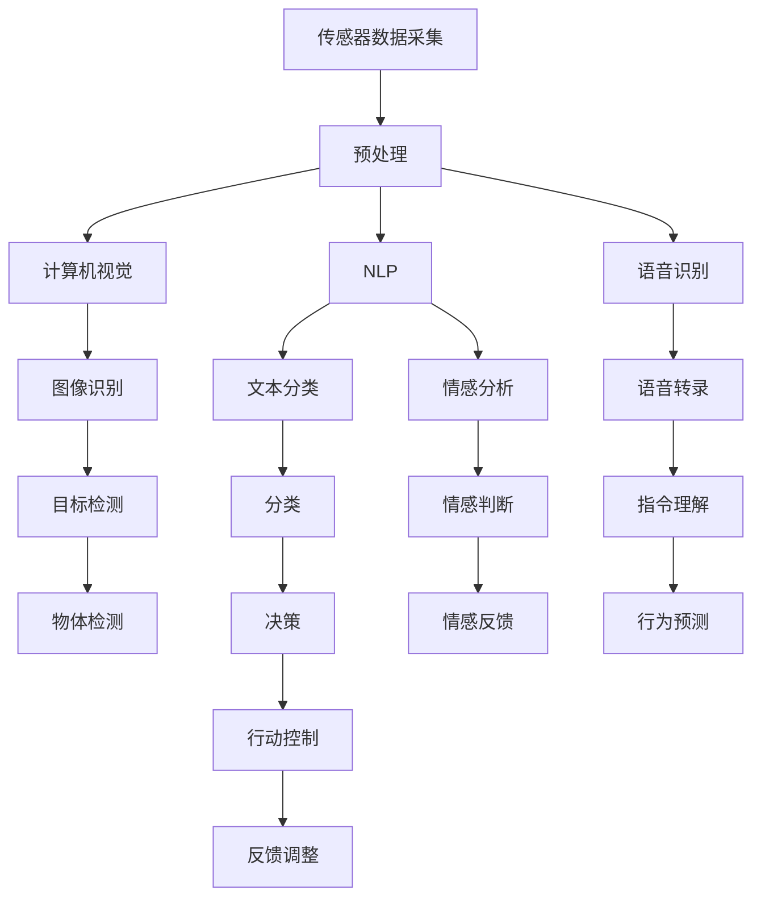

                 

## 1. 背景介绍

### 1.1 问题由来

随着数字化转型的深入，企业对于数据感知的需求日益增长。传统的感知方式依赖于传感器和人类观察者，这在处理复杂场景时存在诸多局限性。例如，复杂的自然环境、高频交易、多变的人员行为等，单一或有限的传感器难以全面捕捉。而AI技术，特别是计算机视觉、语音识别和自然语言处理等领域的技术进步，正在为企业提供全新的数据感知手段。

AI技术不仅能够在更广泛的场景中实现自动化数据采集，还能提供更加精准的数据分析，帮助企业实现更高效的决策。数字化感知的扩展，将为企业的智能化转型提供坚实的技术基础，开辟新的商业机会。

### 1.2 问题核心关键点

数字化感知的扩展，本质上是利用AI技术，通过传感器和智能算法，将原本难以量化的信息转化为可处理的数据。这一过程的关键点在于：

- **数据采集的多样性**：AI系统可以基于不同类型的数据源进行数据采集，如视频、音频、文本、图像等，实现全方位、多层次的数据感知。
- **算法模型的精度**：AI系统通过深度学习、增强学习等算法，提升数据处理的精度和效率，增强数据的可用性。
- **数据融合与整合**：AI系统能够将来自不同来源和格式的数据进行融合和整合，形成更全面、更准确的信息感知图景。
- **人机协作的智能化**：通过AI与人类观察者的协作，实现更高效、更智能的数据感知和分析，提升整体数据处理能力。

这些关键点决定了数字化感知扩展的可行性和应用前景。AI技术将为企业的数据处理能力带来质的提升，促进企业智能化转型。

### 1.3 问题研究意义

数字化感知的扩展，对于企业智能化转型具有重要意义：

1. **提升决策效率**：AI系统能够实时、全面地处理海量数据，提供决策支持，帮助企业快速响应市场变化。
2. **降低运营成本**：通过自动化数据采集和处理，减少对人力资源的依赖，降低运营成本。
3. **开拓新业务模式**：AI技术可以在众多领域（如智能制造、智慧城市、智能农业等）中提供新应用，开辟新的商业模式。
4. **增强竞争优势**：借助AI技术，企业能够更深入地理解市场和消费者需求，提升产品和服务的差异化能力。
5. **促进跨行业协同**：数字化感知技术能够跨行业应用，促进不同行业之间的协同创新。

数字化感知的扩展，将成为推动企业智能化转型，实现高质量发展的重要驱动力。

## 2. 核心概念与联系

### 2.1 核心概念概述

为更好地理解数字化感知扩展，本节将介绍几个关键概念及其相互联系：

- **计算机视觉(Computer Vision)**：通过图像处理和模式识别技术，使计算机能够“看”和“理解”图像，从而实现图像的识别、分类、检测等任务。
- **自然语言处理(Natural Language Processing, NLP)**：使计算机能够理解、解释和生成人类语言，实现文本的分类、情感分析、机器翻译等任务。
- **语音识别(Speech Recognition)**：将语音信号转化为文本，使计算机能够“听”和“理解”语音，实现语音指令的识别和转录。
- **数据融合(Data Fusion)**：将来自不同传感器和信息源的数据进行整合，形成一个全面的数据感知图景，提升数据处理的综合能力。
- **增强学习(Reinforcement Learning, RL)**：通过智能体与环境的互动，使机器能够学习最优决策策略，在复杂的动态环境中实现智能感知和决策。

这些概念通过智能算法和数据处理技术，共同构成了数字化感知的完整框架，使得AI系统能够在不同场景中实现全方位的数据感知。

### 2.2 核心概念原理和架构的 Mermaid 流程图



该流程图展示了从数据采集到最终决策的全流程，每个环节都通过AI技术进行处理和优化，形成一个智能化、全息化的数据感知系统。

## 3. 核心算法原理 & 具体操作步骤

### 3.1 算法原理概述

数字化感知扩展的核心算法原理，基于AI技术的深度学习、强化学习等方法，实现数据的自动化采集、处理和分析。主要包括以下几个步骤：

1. **数据采集**：通过各类传感器（如摄像头、麦克风、传感器）采集图像、音频、文本等数据。
2. **预处理**：对采集到的数据进行去噪、归一化、标准化等预处理，以提升后续处理效果。
3. **特征提取**：通过特征提取算法，将原始数据转化为可处理的特征表示。
4. **模型训练**：使用深度学习模型（如CNN、RNN、Transformer等）对特征进行训练，学习数据规律和模式。
5. **数据融合**：将来自不同传感器和信息源的数据进行融合，形成一个全面的数据感知图景。
6. **模型优化**：通过增强学习等方法，不断优化模型参数，提升感知精度和鲁棒性。
7. **决策支持**：将感知数据输入决策系统，辅助或替代人类进行决策。

### 3.2 算法步骤详解

以下是数字化感知扩展的详细操作步骤：

**Step 1: 数据采集与预处理**

1. **传感器部署**：根据感知需求，选择适合的传感器设备，并安装在相应的位置。例如，在智能工厂中使用摄像头监控生产线和设备状态。
2. **数据采集**：通过传感器设备实时采集数据，例如图像、音频、文本等。
3. **数据预处理**：对采集到的数据进行去噪、归一化、标准化等预处理，以提升后续处理效果。

**Step 2: 特征提取与模型训练**

1. **特征提取**：使用特征提取算法，如卷积神经网络（CNN）、循环神经网络（RNN）、Transformer等，将原始数据转化为可处理的特征表示。例如，使用CNN对图像进行特征提取，使用RNN对文本进行分词和向量表示。
2. **模型训练**：将提取到的特征输入到深度学习模型中，进行训练。例如，使用BERT模型对文本进行情感分析，使用YOLO模型对图像进行目标检测。

**Step 3: 数据融合与模型优化**

1. **数据融合**：将来自不同传感器和信息源的数据进行融合，形成一个全面的数据感知图景。例如，将视频和音频数据结合，使用深度学习模型进行融合特征提取。
2. **模型优化**：使用增强学习等方法，不断优化模型参数，提升感知精度和鲁棒性。例如，使用强化学习算法，优化目标检测模型的决策边界，提升检测准确率。

**Step 4: 决策支持**

1. **决策支持**：将感知数据输入决策系统，辅助或替代人类进行决策。例如，在智能制造中，使用计算机视觉对生产线进行实时监控，辅助工人进行异常检测和维护。

### 3.3 算法优缺点

数字化感知扩展的算法具有以下优点：

1. **高效自动化**：AI技术能够自动完成数据采集和处理，减少对人力资源的依赖，提高数据处理效率。
2. **高精度**：深度学习和增强学习等算法能够提升数据处理的精度和鲁棒性，提供更可靠的数据支持。
3. **跨模态融合**：能够将来自不同传感器和信息源的数据进行融合，形成一个全面的数据感知图景。
4. **实时响应**：AI系统能够实时处理数据，快速响应市场变化，提升决策效率。

同时，该算法也存在以下局限性：

1. **数据依赖**：数据采集和预处理需要高质量的传感器和设备，对数据的依赖性较高。
2. **模型复杂性**：深度学习等算法模型复杂度较高，训练和优化需要大量计算资源。
3. **隐私风险**：在数据采集和处理过程中，需要保护数据隐私，避免数据泄露和滥用。

### 3.4 算法应用领域

数字化感知扩展的应用领域非常广泛，以下是几个典型应用场景：

1. **智能制造**：通过计算机视觉和传感器技术，实现生产线的自动化监控、异常检测和故障预测，提升生产效率和产品质量。
2. **智慧城市**：使用摄像头和传感器数据，实现交通流量监控、环境污染监测、公共安全监控等功能，提升城市管理水平。
3. **智能农业**：通过图像和传感器数据，实现作物生长状态监测、病虫害识别、土壤湿度监测等功能，提高农业生产效率。
4. **金融风控**：使用文本和音频数据，进行情感分析、语音指令识别等，提升金融风险预警和欺诈检测能力。
5. **智能医疗**：通过图像和传感器数据，实现疾病诊断、手术辅助、健康监测等功能，提升医疗服务水平。

## 4. 数学模型和公式 & 详细讲解 & 举例说明

### 4.1 数学模型构建

数字化感知扩展的数学模型构建，主要涉及图像处理、语音识别、自然语言处理等领域。以下是几个关键数学模型的介绍：

- **图像处理**：使用卷积神经网络（CNN）进行图像分类、目标检测等任务。
- **语音识别**：使用循环神经网络（RNN）或卷积神经网络（CNN）进行语音转录、指令理解等任务。
- **自然语言处理**：使用Transformer模型进行文本分类、情感分析、机器翻译等任务。

### 4.2 公式推导过程

以下是几个关键数学模型的推导过程：

**图像分类模型**：

$$
\text{softmax}(\mathbf{z}) = \frac{\exp(\mathbf{z})}{\sum_{i=1}^n \exp(\mathbf{z}_i)}
$$

其中，$\mathbf{z} = \mathbf{W} \mathbf{h} + \mathbf{b}$，$\mathbf{h}$为卷积层的输出，$\mathbf{W}$和$\mathbf{b}$为可训练参数。

**语音识别模型**：

$$
\mathbf{h}_t = \mathbf{R} \mathbf{h}_{t-1} + \mathbf{u}_t
$$

其中，$\mathbf{h}_t$为当前时间步的隐藏状态，$\mathbf{R}$为转移矩阵，$\mathbf{u}_t$为输入特征向量。

**自然语言处理模型**：

$$
\mathbf{z} = \mathbf{W} \mathbf{x} + \mathbf{b}
$$

其中，$\mathbf{z}$为输出向量，$\mathbf{x}$为输入向量，$\mathbf{W}$和$\mathbf{b}$为可训练参数。

### 4.3 案例分析与讲解

**智能制造中的视觉识别**：

在智能制造中，使用计算机视觉技术进行生产线监控和异常检测。例如，使用摄像头采集生产线上机器人的图像，使用CNN进行特征提取，然后使用softmax函数进行分类，判断机器是否正常工作。

**智慧城市中的交通监控**：

在智慧城市中，使用摄像头和传感器数据进行交通流量监控和事故预测。例如，使用传感器采集交通流量数据，使用RNN进行时间序列分析，预测交通拥堵情况，并提供决策支持。

## 5. 项目实践：代码实例和详细解释说明

### 5.1 开发环境搭建

在进行数字化感知扩展的实践前，我们需要准备好开发环境。以下是使用Python进行PyTorch开发的环境配置流程：

1. 安装Anaconda：从官网下载并安装Anaconda，用于创建独立的Python环境。

2. 创建并激活虚拟环境：
```bash
conda create -n pytorch-env python=3.8 
conda activate pytorch-env
```

3. 安装PyTorch：根据CUDA版本，从官网获取对应的安装命令。例如：
```bash
conda install pytorch torchvision torchaudio cudatoolkit=11.1 -c pytorch -c conda-forge
```

4. 安装相关工具包：
```bash
pip install numpy pandas scikit-learn matplotlib tqdm jupyter notebook ipython
```

完成上述步骤后，即可在`pytorch-env`环境中开始数字化感知扩展的实践。

### 5.2 源代码详细实现

这里我们以智能制造中的视觉识别为例，给出使用PyTorch进行CNN模型训练的代码实现。

首先，定义CNN模型：

```python
import torch.nn as nn
import torch.nn.functional as F

class CNNModel(nn.Module):
    def __init__(self, num_classes):
        super(CNNModel, self).__init__()
        self.conv1 = nn.Conv2d(3, 64, kernel_size=3, stride=1, padding=1)
        self.pool = nn.MaxPool2d(kernel_size=2, stride=2)
        self.conv2 = nn.Conv2d(64, 128, kernel_size=3, stride=1, padding=1)
        self.pool2 = nn.MaxPool2d(kernel_size=2, stride=2)
        self.fc1 = nn.Linear(128*14*14, 512)
        self.fc2 = nn.Linear(512, num_classes)
        self.dropout = nn.Dropout(0.5)

    def forward(self, x):
        x = F.relu(self.conv1(x))
        x = self.pool(x)
        x = F.relu(self.conv2(x))
        x = self.pool2(x)
        x = x.view(-1, 128*14*14)
        x = F.relu(self.fc1(x))
        x = self.dropout(x)
        x = self.fc2(x)
        return F.log_softmax(x, dim=1)
```

然后，定义模型训练函数：

```python
from torch.utils.data import DataLoader
from torchvision.datasets import CIFAR10
from torchvision.transforms import ToTensor

# 加载数据集
train_dataset = CIFAR10(root='./data', train=True, download=True, transform=ToTensor())
test_dataset = CIFAR10(root='./data', train=False, download=True, transform=ToTensor())

# 创建数据加载器
train_loader = DataLoader(train_dataset, batch_size=64, shuffle=True)
test_loader = DataLoader(test_dataset, batch_size=64, shuffle=False)

# 定义优化器和损失函数
model = CNNModel(num_classes=10)
optimizer = torch.optim.Adam(model.parameters(), lr=0.001)
criterion = nn.CrossEntropyLoss()

# 训练模型
device = torch.device('cuda' if torch.cuda.is_available() else 'cpu')
model.to(device)
num_epochs = 10
for epoch in range(num_epochs):
    model.train()
    for i, (images, labels) in enumerate(train_loader):
        images = images.to(device)
        labels = labels.to(device)
        optimizer.zero_grad()
        outputs = model(images)
        loss = criterion(outputs, labels)
        loss.backward()
        optimizer.step()
    print(f'Epoch {epoch+1}/{num_epochs}, loss: {loss.item()}')
```

最后，进行模型测试：

```python
with torch.no_grad():
    correct = 0
    total = 0
    model.eval()
    for images, labels in test_loader:
        images = images.to(device)
        labels = labels.to(device)
        outputs = model(images)
        _, predicted = torch.max(outputs.data, 1)
        total += labels.size(0)
        correct += (predicted == labels).sum().item()
    print(f'Accuracy: {(100 * correct / total):.2f}%')
```

以上就是使用PyTorch进行CNN模型训练的完整代码实现。可以看到，通过简单的代码和数据预处理，即可构建并训练出基本的计算机视觉模型。

### 5.3 代码解读与分析

让我们再详细解读一下关键代码的实现细节：

**CNNModel类**：
- `__init__`方法：定义CNN模型的网络结构，包括卷积层、池化层、全连接层等。
- `forward`方法：实现前向传播，将输入数据输入模型，并输出预测结果。

**训练函数**：
- 使用PyTorch的DataLoader对数据集进行批次化加载，供模型训练和推理使用。
- 在每个epoch内，循环迭代训练数据集，计算损失函数并反向传播更新模型参数。

**测试函数**：
- 使用PyTorch的DataLoader对测试数据集进行批次化加载，评估模型性能。
- 在每个batch结束后，计算模型预测准确率，输出测试结果。

通过这些代码的实现，可以更好地理解数字化感知扩展的基本流程和关键技术。

## 6. 实际应用场景

### 6.1 智能制造

智能制造是数字化感知扩展的重要应用场景之一。通过计算机视觉和传感器技术，实现生产线的自动化监控、异常检测和故障预测，提升生产效率和产品质量。例如，使用摄像头采集生产线上机器人的图像，使用CNN进行特征提取，然后使用softmax函数进行分类，判断机器是否正常工作。

### 6.2 智慧城市

智慧城市是数字化感知扩展的另一个重要应用场景。通过摄像头和传感器数据，实现交通流量监控、环境污染监测、公共安全监控等功能，提升城市管理水平。例如，使用传感器采集交通流量数据，使用RNN进行时间序列分析，预测交通拥堵情况，并提供决策支持。

### 6.3 智能农业

智能农业是数字化感知扩展在农业领域的应用。通过图像和传感器数据，实现作物生长状态监测、病虫害识别、土壤湿度监测等功能，提高农业生产效率。例如，使用无人机采集农田图像，使用CNN进行作物识别，判断是否发生病虫害，并及时采取措施。

## 7. 工具和资源推荐

### 7.1 学习资源推荐

为了帮助开发者系统掌握数字化感知扩展的理论基础和实践技巧，这里推荐一些优质的学习资源：

1. **《计算机视觉：模型、学习和推理》**：由斯坦福大学李飞飞教授等编著，全面介绍了计算机视觉的原理、算法和应用。
2. **《深度学习与自然语言处理》**：北京大学邱锡鹏教授的在线课程，讲解深度学习在自然语言处理中的应用。
3. **《强化学习：算法和理论》**：由加州大学伯克利分校李飞飞教授等编著，全面介绍了强化学习的原理、算法和应用。
4. **Google AI Blog**：谷歌AI博客，定期发布AI领域的最新研究成果和技术动态。
5. **Kaggle**：数据科学竞赛平台，提供了大量实际应用场景的竞赛数据集和解决方案。

通过对这些资源的学习实践，相信你一定能够快速掌握数字化感知扩展的精髓，并用于解决实际的AI问题。

### 7.2 开发工具推荐

高效的开发离不开优秀的工具支持。以下是几款用于数字化感知扩展开发的常用工具：

1. **PyTorch**：基于Python的开源深度学习框架，灵活动态的计算图，适合快速迭代研究。
2. **TensorFlow**：由Google主导开发的开源深度学习框架，生产部署方便，适合大规模工程应用。
3. **Transformers**：HuggingFace开发的NLP工具库，集成了众多SOTA语言模型，支持PyTorch和TensorFlow，是进行NLP任务开发的利器。
4. **Jupyter Notebook**：交互式数据科学工作环境，支持多种编程语言和库，适合编写和测试代码。
5. **GitHub**：代码托管平台，提供版本控制和协作开发功能，适合团队协作和开源共享。

合理利用这些工具，可以显著提升数字化感知扩展任务的开发效率，加快创新迭代的步伐。

### 7.3 相关论文推荐

数字化感知扩展的研究源于学界的持续研究。以下是几篇奠基性的相关论文，推荐阅读：

1. **《ImageNet Classification with Deep Convolutional Neural Networks》**：AlexNet论文，提出了深度卷积神经网络在图像分类任务中的应用。
2. **《Attention is All You Need》**：Transformer论文，提出了Transformer模型，开启了预训练大模型时代。
3. **《Speech and Language Processing》**：自然语言处理领域的经典教材，由Daniel Jurafsky和James H. Martin编著，讲解自然语言处理的原理和应用。
4. **《Reinforcement Learning: An Introduction》**：由Richard S. Sutton和Andrew G. Barto编著，全面介绍了强化学习的原理和应用。
5. **《Deep Learning》**：由Ian Goodfellow、Yoshua Bengio和Aaron Courville编著，讲解深度学习的原理和应用。

这些论文代表了大规模数字化感知扩展技术的进展脉络。通过学习这些前沿成果，可以帮助研究者把握学科前进方向，激发更多的创新灵感。

## 8. 总结：未来发展趋势与挑战

### 8.1 研究成果总结

数字化感知扩展技术，通过深度学习、增强学习等AI技术，实现了数据的自动化采集、处理和分析，广泛应用于智能制造、智慧城市、智能农业等领域。这一技术显著提升了数据处理效率和精度，推动了企业智能化转型，带来了广泛的应用前景。

### 8.2 未来发展趋势

展望未来，数字化感知扩展技术将呈现以下几个发展趋势：

1. **多模态感知融合**：未来的数字化感知系统将融合视觉、听觉、触觉等多种模态数据，实现更全面、更准确的信息感知。
2. **实时动态优化**：通过实时动态优化算法，提升数字化感知系统的响应速度和精度，支持更复杂的决策任务。
3. **跨领域应用拓展**：数字化感知技术将在更多领域（如医疗、金融、智能家居等）中得到应用，推动各行各业的智能化发展。
4. **自主学习与推理**：未来的数字化感知系统将具备更强的自主学习能力，能够不断学习新知识和技能，提升决策能力。
5. **人机协同与智能交互**：通过人机协同和智能交互技术，提升数字化感知系统的灵活性和可用性，增强用户体验。

这些趋势将进一步推动数字化感知技术的成熟和应用，为智能化社会的构建提供坚实基础。

### 8.3 面临的挑战

尽管数字化感知扩展技术已经取得了瞩目成就，但在迈向更加智能化、普适化应用的过程中，它仍面临着诸多挑战：

1. **数据隐私与伦理**：在数据采集和处理过程中，需要保护数据隐私，避免数据泄露和滥用。如何确保数据隐私和安全，将是重要的研究课题。
2. **计算资源消耗**：深度学习等算法的复杂度较高，需要大量的计算资源和存储空间。如何优化算法，降低计算资源消耗，将是重要的研究方向。
3. **模型泛化能力**：在实际应用中，模型泛化能力不足的问题仍较为普遍。如何提升模型的泛化能力，减少对训练数据的依赖，将是重要的研究课题。
4. **技术融合与集成**：数字化感知技术需要与其他AI技术（如知识图谱、逻辑推理等）进行深度融合，实现更全面、更准确的信息感知。如何集成多种技术，提升系统性能，将是重要的研究课题。

解决这些挑战，将有助于数字化感知技术在更广泛的场景中得到应用，推动智能化社会的构建。

### 8.4 研究展望

面对数字化感知扩展技术所面临的挑战，未来的研究需要在以下几个方面寻求新的突破：

1. **数据隐私保护**：开发更高效的数据加密和隐私保护技术，确保数据隐私和安全。例如，使用差分隐私技术、联邦学习等方法，保护数据隐私。
2. **模型压缩与优化**：开发更高效的模型压缩和优化算法，降低计算资源消耗，提升模型泛化能力。例如，使用剪枝、量化、知识蒸馏等方法，优化模型结构。
3. **跨领域知识融合**：将符号化的先验知识（如知识图谱、逻辑规则等）与神经网络模型进行融合，提升数字化感知系统的性能。例如，使用知识蒸馏、图神经网络等方法，实现跨领域知识融合。
4. **人机协同交互**：开发更高效的人机交互界面，提升数字化感知系统的用户体验。例如，使用自然语言处理技术，实现智能对话系统，增强人机协同能力。
5. **实时动态优化**：开发更高效的实时动态优化算法，提升数字化感知系统的响应速度和精度。例如，使用在线学习、实时预测等方法，实现动态优化。

这些研究方向的探索，将推动数字化感知扩展技术迈向更高的台阶，为构建更全面、更智能的信息感知系统铺平道路。面向未来，数字化感知扩展技术还需要与其他AI技术进行更深入的融合，如知识表示、因果推理、强化学习等，多路径协同发力，共同推动智能化社会的进步。只有勇于创新、敢于突破，才能不断拓展数字化感知扩展的边界，让智能技术更好地造福人类社会。

## 9. 附录：常见问题与解答

**Q1：数字化感知扩展是否适用于所有行业？**

A: 数字化感知扩展技术适用于大多数行业，尤其是需要大量数据支持的领域，如智能制造、智慧城市、智能农业等。但一些特定领域（如医疗、金融等），由于数据隐私和安全等方面的限制，数字化感知扩展技术的应用需要谨慎考虑。

**Q2：如何在数字化感知扩展中保护数据隐私？**

A: 数据隐私保护是数字化感知扩展中的一个重要课题。以下是一些常见的数据隐私保护方法：
1. **差分隐私**：通过添加噪声，保护数据隐私，同时保证数据的可用性。例如，使用Laplacian噪声等方法，保护数据隐私。
2. **联邦学习**：将数据分布式存储在多个设备上，通过分布式训练保护数据隐私。例如，使用TensorFlow Federated等框架，实现联邦学习。
3. **数据匿名化**：通过对数据进行去标识化处理，保护数据隐私。例如，使用K-匿名化、L-多样性等方法，保护数据隐私。

这些方法可以在数字化感知扩展中有效保护数据隐私，提升系统的安全性和可靠性。

**Q3：数字化感知扩展的计算资源消耗问题如何解决？**

A: 计算资源消耗是数字化感知扩展中的另一个重要课题。以下是一些常见的计算资源优化方法：
1. **模型压缩**：通过剪枝、量化等方法，优化模型结构，降低计算资源消耗。例如，使用TensorFlow Lite等工具，实现模型压缩。
2. **分布式计算**：通过分布式计算框架，将计算任务分布到多个设备上，提升计算效率。例如，使用TensorFlow、PyTorch等框架，实现分布式计算。
3. **硬件加速**：使用GPU、TPU等硬件设备，加速计算任务。例如，使用NVIDIA GPU、Google TPU等硬件设备，提升计算效率。

这些方法可以在数字化感知扩展中有效降低计算资源消耗，提升系统的效率和可用性。

**Q4：如何提升数字化感知扩展的模型泛化能力？**

A: 模型泛化能力是数字化感知扩展中的关键问题。以下是一些常见的模型泛化方法：
1. **数据增强**：通过数据增强技术，扩充训练数据集，提升模型泛化能力。例如，使用图像翻转、随机裁剪等方法，扩充数据集。
2. **正则化**：通过正则化技术，防止模型过拟合，提升模型泛化能力。例如，使用L2正则、Dropout等方法，防止过拟合。
3. **迁移学习**：通过迁移学习技术，将预训练模型的知识迁移到新任务中，提升模型泛化能力。例如，使用预训练模型进行微调，提升模型泛化能力。

这些方法可以在数字化感知扩展中有效提升模型泛化能力，减少对训练数据的依赖，提升系统的性能和可靠性。

**Q5：如何优化数字化感知扩展的实时动态优化算法？**

A: 实时动态优化是数字化感知扩展中的重要问题。以下是一些常见的实时动态优化方法：
1. **在线学习**：通过在线学习算法，实时更新模型参数，提升系统响应速度和精度。例如，使用在线梯度下降等方法，实现在线学习。
2. **强化学习**：通过强化学习算法，不断优化模型参数，提升系统性能。例如，使用DQN等方法，实现强化学习。
3. **增量学习**：通过增量学习算法，实时更新模型参数，提升系统响应速度和精度。例如，使用增量学习算法，实现增量学习。

这些方法可以在数字化感知扩展中有效优化实时动态优化算法，提升系统的响应速度和精度，满足实际应用需求。

---

作者：禅与计算机程序设计艺术 / Zen and the Art of Computer Programming

