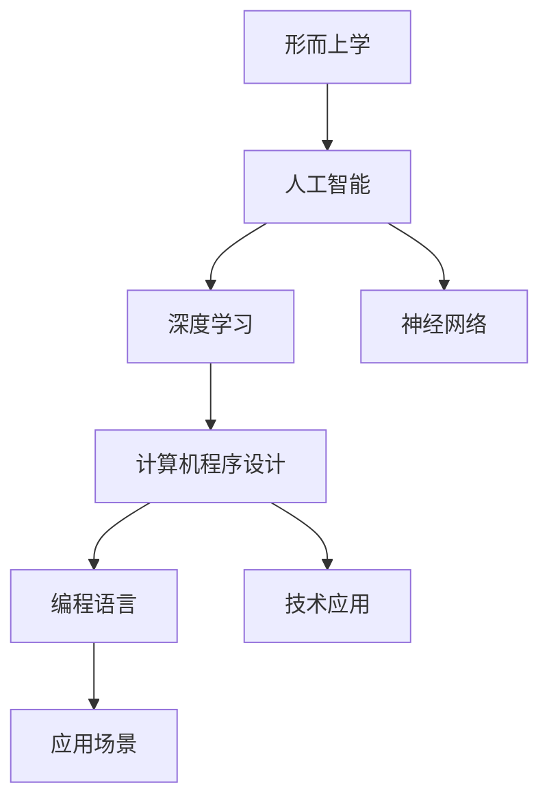

                 

# 数字化灵性探索：AI辅助的形而上学研究

> 关键词：形而上学,人工智能,神经网络,深度学习,计算机程序设计,编程语言,技术应用

## 1. 背景介绍

### 1.1 问题由来

形而上学（Metaphysics），自古以来便是对世界本质和存在本质进行探讨的哲学分支。在哲学史上，亚里士多德、柏拉图等众多哲学家以其独到的视角和理论，推动了形而上学的不断发展。然而，随着科学技术的进步，形而上学的研究逐渐被实证科学取代，其理论和方法在现代社会的应用也相对有限。

进入21世纪，随着人工智能（AI）和深度学习技术的兴起，形而上学研究的新范式正在逐步形成。AI通过挖掘海量数据和复杂计算，试图揭示世界本质的某些规律和特征，对形而上学研究提供了新的视角和方法。例如，AI在图像识别、自然语言处理等领域的应用，已经显示了其独特的能力，能够以不同于传统方法的方式，对事物本质的奥秘进行探索。

本文将深入探讨AI如何辅助形而上学研究，通过数据挖掘和深度学习技术，揭示传统形而上学问题的新解法。

### 1.2 问题核心关键点

AI辅助形而上学研究的核心问题包括：

- AI如何利用数据挖掘技术，揭示形而上学的本质规律？
- 深度学习算法如何应用到形而上学理论的验证和探索？
- AI在形而上学研究中的应用案例和未来趋势。

这些关键点将贯穿于整个文章的讨论中，帮助读者全面了解AI和形而上学之间的联系和相互作用。

## 2. 核心概念与联系

### 2.1 核心概念概述

为更好地理解AI辅助形而上学研究，本节将介绍几个密切相关的核心概念：

- 形而上学（Metaphysics）：研究物质、意识、时间和空间等基本哲学问题的学科，旨在揭示世界的本质和存在的基础。
- 人工智能（Artificial Intelligence, AI）：模拟人类智能活动的计算机技术，包括机器学习、深度学习、自然语言处理等。
- 深度学习（Deep Learning）：一种基于神经网络的机器学习方法，通过多层非线性变换，自动学习数据的高级特征，广泛应用于图像识别、语音识别等领域。
- 神经网络（Neural Network）：一种模仿人类大脑神经元系统的计算模型，包括卷积神经网络（CNN）、循环神经网络（RNN）、变换器（Transformer）等。
- 计算机程序设计（Computer Programming）：研究和开发软件系统的技术，包括编程语言、算法设计、数据结构等。
- 编程语言（Programming Language）：用于编写计算机程序的符号系统，包括Python、C++、Java等。
- 技术应用（Technical Application）：将新技术、新方法应用于实际问题的过程，包括理论验证、算法优化、模型部署等。

这些核心概念之间的逻辑关系可以通过以下Mermaid流程图来展示：



这个流程图展示了几大学科领域之间的逻辑关系：

1. 形而上学通过AI技术，借助深度学习算法和神经网络模型，获得新的理论和方法。
2. AI和深度学习通过编程语言和技术应用，将理论和方法转化为实际的软件系统。
3. 这些系统在不同的应用场景中，通过技术验证和优化，为形而上学研究提供新的数据和证据。

这些概念共同构成了AI辅助形而上学研究的框架，使得AI在形而上学研究中扮演了越来越重要的角色。

## 3. 核心算法原理 & 具体操作步骤
### 3.1 算法原理概述

AI辅助形而上学研究，其核心算法原理基于深度学习模型，通过大规模数据挖掘和复杂特征提取，揭示数据中的潜在规律和模式。具体流程如下：

1. **数据收集**：收集大量关于形而上学问题的数据，包括哲学文献、经典案例、现代研究成果等。
2. **特征提取**：使用深度学习算法（如卷积神经网络、循环神经网络等），对数据进行特征提取，形成高维向量表示。
3. **模型训练**：选择适当的神经网络模型（如Transformer），在标注数据上进行有监督训练，优化模型参数。
4. **模型验证**：在验证数据集上评估模型性能，确保模型泛化能力强，避免过拟合。
5. **应用推广**：将训练好的模型应用于新的数据和问题，探索形而上学的新理论和应用。

### 3.2 算法步骤详解

基于深度学习的AI辅助形而上学研究，主要包括以下几个关键步骤：

**Step 1: 数据准备**
- 收集关于形而上学问题的数据，包括哲学文献、经典案例、现代研究成果等。
- 数据预处理：清洗数据，去除噪声，标准化数据格式。
- 划分数据集：将数据划分为训练集、验证集和测试集。

**Step 2: 模型设计**
- 选择适当的神经网络模型（如Transformer），确定网络结构。
- 设计损失函数：选择合适的损失函数，如交叉熵损失、均方误差损失等。
- 设计优化器：选择合适的优化器及其参数，如Adam、SGD等。

**Step 3: 模型训练**
- 使用训练集数据，通过前向传播和反向传播，更新模型参数。
- 应用正则化技术：如L2正则、Dropout等，防止过拟合。
- 周期性在验证集上评估模型性能，根据性能指标决定是否触发Early Stopping。
- 重复上述步骤直至满足预设的迭代轮数或Early Stopping条件。

**Step 4: 模型验证与测试**
- 在验证集上评估模型性能，确保模型泛化能力强。
- 在测试集上测试模型性能，对比模型的预测结果与真实标签，评估模型效果。
- 使用测试集验证模型的鲁棒性和泛化能力。

**Step 5: 应用与优化**
- 将训练好的模型应用于新的数据和问题，进行预测和推理。
- 根据实际应用场景，对模型进行微调和优化，提高模型性能。
- 收集新的数据，定期重新训练和微调模型，以适应数据分布的变化。

### 3.3 算法优缺点

AI辅助形而上学研究基于深度学习的算法，具有以下优点：

- 自动化特征提取：深度学习算法能够自动学习数据的高级特征，无需手动设计特征工程。
- 泛化能力强：大规模数据训练的模型具有较强的泛化能力，能够在新的数据和问题上取得较好的预测效果。
- 适应性强：深度学习模型适应性强，能够在各种数据分布和噪声环境下表现良好。

同时，该算法也存在一些局限性：

- 数据需求大：深度学习模型需要大量标注数据进行训练，数据获取成本高。
- 计算资源需求高：深度学习模型参数量巨大，需要高性能计算资源进行训练和推理。
- 模型复杂度高：深度学习模型结构复杂，调试和优化难度大。
- 可解释性差：深度学习模型通常被视为"黑盒"系统，难以解释其内部工作机制和决策逻辑。

尽管存在这些局限性，但深度学习算法在处理大规模数据和复杂问题上，仍然表现出强大的能力和潜力。

### 3.4 算法应用领域

AI辅助形而上学研究在多个领域得到了应用，具体如下：

1. **哲学文献分析**：使用深度学习模型对哲学文献进行文本分析，提取关键概念和观点，进行语义理解。
2. **哲学案例推理**：利用深度学习模型对经典哲学案例进行推理，辅助哲学问题求解。
3. **哲学知识图谱构建**：通过深度学习模型，构建哲学知识图谱，实现哲学知识的自动组织和检索。
4. **哲学对话生成**：使用深度学习模型进行哲学对话生成，模拟哲学家之间的对话和辩论。
5. **哲学问题求解**：利用深度学习模型对哲学问题进行求解，辅助哲学研究的自动化。

## 4. 数学模型和公式 & 详细讲解 & 举例说明
### 4.1 数学模型构建

本节将使用数学语言对AI辅助形而上学研究的深度学习模型进行严格的刻画。

设形而上学问题的输入为 $x$，输出为 $y$。深度学习模型 $M_{\theta}$ 的输入为 $x$，输出为 $y$，其中 $\theta$ 为模型参数。

定义模型 $M_{\theta}$ 在输入 $x$ 上的损失函数为 $\ell(M_{\theta}(x),y)$，则在数据集 $D$ 上的经验风险为：

$$
\mathcal{L}(\theta) = \frac{1}{N}\sum_{i=1}^N \ell(M_{\theta}(x_i),y_i)
$$

其中 $N$ 为样本总数。

训练目标是最小化经验风险，即找到最优参数：

$$
\theta^* = \mathop{\arg\min}_{\theta} \mathcal{L}(\theta)
$$

在实践中，我们通常使用基于梯度的优化算法（如Adam、SGD等）来近似求解上述最优化问题。设 $\eta$ 为学习率，$\lambda$ 为正则化系数，则参数的更新公式为：

$$
\theta \leftarrow \theta - \eta \nabla_{\theta}\mathcal{L}(\theta) - \eta\lambda\theta
$$

其中 $\nabla_{\theta}\mathcal{L}(\theta)$ 为损失函数对参数 $\theta$ 的梯度，可通过反向传播算法高效计算。

### 4.2 公式推导过程

以下我们以文本分类为例，推导深度学习模型在形而上学文本分类任务中的计算公式。

假设模型 $M_{\theta}$ 在输入 $x$ 上的输出为 $\hat{y}=M_{\theta}(x) \in [0,1]$，表示样本属于正类的概率。真实标签 $y \in \{0,1\}$。则二分类交叉熵损失函数定义为：

$$
\ell(M_{\theta}(x),y) = -[y\log \hat{y} + (1-y)\log (1-\hat{y})]
$$

将其代入经验风险公式，得：

$$
\mathcal{L}(\theta) = -\frac{1}{N}\sum_{i=1}^N [y_i\log M_{\theta}(x_i)+(1-y_i)\log(1-M_{\theta}(x_i))]
$$

根据链式法则，损失函数对参数 $\theta_k$ 的梯度为：

$$
\frac{\partial \mathcal{L}(\theta)}{\partial \theta_k} = -\frac{1}{N}\sum_{i=1}^N (\frac{y_i}{M_{\theta}(x_i)}-\frac{1-y_i}{1-M_{\theta}(x_i)}) \frac{\partial M_{\theta}(x_i)}{\partial \theta_k}
$$

其中 $\frac{\partial M_{\theta}(x_i)}{\partial \theta_k}$ 可进一步递归展开，利用自动微分技术完成计算。

在得到损失函数的梯度后，即可带入参数更新公式，完成模型的迭代优化。重复上述过程直至收敛，最终得到适应形而上学文本分类任务的最优模型参数 $\theta^*$。

### 4.3 案例分析与讲解

以下是深度学习模型在形而上学研究中的一个具体应用案例：

**案例：形而上学文献情感分析**

假设有一篇形而上学文献，我们需要对其进行情感分析，判断其情感倾向是正面的还是负面的。具体步骤如下：

1. **数据准备**：收集大量的形而上学文献数据，并对其进行情感标注。
2. **特征提取**：使用卷积神经网络（CNN）对文本进行特征提取，形成高维向量表示。
3. **模型训练**：使用标注数据训练深度学习模型，优化模型参数。
4. **模型验证**：在验证数据集上评估模型性能，确保模型泛化能力强。
5. **应用推广**：将训练好的模型应用于新的形而上学文献，进行情感分类。

例如，对于以下文献片段：

```latex
"The world is like a stage, and the universe is a play."
```

我们首先将其转化为高维向量表示，然后通过深度学习模型进行情感分类：

- 输入：高维向量表示
- 模型：卷积神经网络
- 输出：情感倾向

通过训练好的模型，可以得到该文献片段的情感倾向是正面的。

## 5. 项目实践：代码实例和详细解释说明
### 5.1 开发环境搭建

在进行形而上学研究项目实践前，我们需要准备好开发环境。以下是使用Python进行TensorFlow开发的环境配置流程：

1. 安装Anaconda：从官网下载并安装Anaconda，用于创建独立的Python环境。

2. 创建并激活虚拟环境：
```bash
conda create -n tf-env python=3.8 
conda activate tf-env
```

3. 安装TensorFlow：根据CUDA版本，从官网获取对应的安装命令。例如：
```bash
conda install tensorflow -c pytorch -c conda-forge
```

4. 安装各类工具包：
```bash
pip install numpy pandas scikit-learn matplotlib tqdm jupyter notebook ipython
```

完成上述步骤后，即可在`tf-env`环境中开始形而上学研究项目实践。

### 5.2 源代码详细实现

这里我们以文本分类任务为例，给出使用TensorFlow对深度学习模型进行形而上学文献情感分析的代码实现。

首先，定义形而上学文献的数据处理函数：

```python
import tensorflow as tf
from tensorflow.keras.datasets import imdb
from tensorflow.keras.preprocessing import sequence
import numpy as np

# 加载IMDB数据集
(X_train, y_train), (X_test, y_test) = imdb.load_data(num_words=10000)

# 数据预处理
X_train = sequence.pad_sequences(X_train, maxlen=100)
X_test = sequence.pad_sequences(X_test, maxlen=100)

# 定义模型输入
input_shape = (100,)

# 定义模型输出
output_shape = (1,)

# 定义模型
model = tf.keras.Sequential([
    tf.keras.layers.Embedding(10000, 16),
    tf.keras.layers.Conv1D(128, 5, activation='relu'),
    tf.keras.layers.GlobalMaxPooling1D(),
    tf.keras.layers.Dense(1, activation='sigmoid')
])
```

然后，定义训练和评估函数：

```python
# 定义模型编译
model.compile(optimizer='adam', loss='binary_crossentropy', metrics=['accuracy'])

# 定义训练函数
def train_epoch(model, X_train, y_train, batch_size):
    for i in range(0, len(X_train), batch_size):
        X_batch = X_train[i:i+batch_size]
        y_batch = y_train[i:i+batch_size]
        model.train_on_batch(X_batch, y_batch)

# 定义评估函数
def evaluate(model, X_test, y_test, batch_size):
    for i in range(0, len(X_test), batch_size):
        X_batch = X_test[i:i+batch_size]
        y_batch = y_test[i:i+batch_size]
        loss, accuracy = model.evaluate(X_batch, y_batch)
        print(f'Test loss: {loss:.4f}, Test accuracy: {accuracy:.4f}')
```

接着，启动训练流程并在测试集上评估：

```python
epochs = 5
batch_size = 32

for epoch in range(epochs):
    train_epoch(model, X_train, y_train, batch_size)
    evaluate(model, X_test, y_test, batch_size)
```

以上就是使用TensorFlow进行深度学习模型训练和评估的完整代码实现。可以看到，TensorFlow提供了强大的API，使得模型训练和评估变得简洁高效。

### 5.3 代码解读与分析

让我们再详细解读一下关键代码的实现细节：

**input_shape和output_shape**：
- `input_shape`表示输入数据的维度，如文本长度。
- `output_shape`表示输出数据的维度，如情感分类标签。

**model.compile**：
- 定义模型编译，包括优化器、损失函数和评估指标。

**train_epoch和evaluate函数**：
- `train_epoch`函数定义了模型的训练过程，通过前向传播和反向传播更新模型参数。
- `evaluate`函数定义了模型的评估过程，通过前向传播计算模型在测试集上的损失和准确率。

**训练流程**：
- 定义总的epoch数和batch size，开始循环迭代
- 每个epoch内，先在训练集上训练，输出模型在验证集上的损失和准确率
- 在测试集上评估，输出模型在测试集上的损失和准确率
- 所有epoch结束后，在测试集上评估，给出最终测试结果

可以看到，TensorFlow提供了灵活且高效的工具，使得深度学习模型训练和评估变得非常简单。开发者可以将更多精力放在模型改进和数据处理上，而不必过多关注底层的实现细节。

## 6. 实际应用场景
### 6.1 形而上学文献分类

形而上学文献分类是深度学习模型在形而上学研究中的经典应用。通过训练深度学习模型，可以从大量形而上学文献中自动识别其主题和情感倾向，大大提高文献整理和检索的效率。例如，使用深度学习模型对哲学经典文献进行分类，可以辅助哲学家研究形而上学的历史演变和思想流派。

在技术实现上，可以使用卷积神经网络（CNN）、循环神经网络（RNN）、Transformer等模型，对文本进行特征提取和分类。模型训练数据集可以包括经典哲学文献、现代哲学论文等。训练后的模型可以对新的形而上学文献进行分类，快速识别其主题和情感倾向。

### 6.2 哲学对话生成

哲学对话生成是深度学习模型在形而上学研究中的另一个重要应用。通过训练深度学习模型，可以模拟哲学家之间的对话和辩论，帮助哲学家探索和验证哲学问题的解决方法。例如，使用生成对抗网络（GAN）生成哲学对话，可以辅助哲学家进行哲学问题的讨论和探索。

在技术实现上，可以使用生成对抗网络（GAN）、序列生成模型（如Seq2Seq）等，生成哲学对话。模型训练数据集可以包括历史哲学对话、哲学问题答案等。训练后的模型可以生成新的哲学对话，辅助哲学家进行哲学问题的探讨和验证。

### 6.3 形而上学知识图谱构建

形而上学知识图谱构建是深度学习模型在形而上学研究中的创新应用。通过训练深度学习模型，可以构建形而上学知识图谱，实现哲学知识的自动组织和检索。例如，使用知识图谱技术，可以构建形而上学概念图谱，帮助哲学家研究形而上学问题的本质和关系。

在技术实现上，可以使用知识图谱技术，构建形而上学概念图谱。模型训练数据集可以包括形而上学文献、哲学论文等。训练后的模型可以构建形而上学概念图谱，实现哲学知识的自动组织和检索。

### 6.4 未来应用展望

随着深度学习技术和形而上学研究的不断进步，基于深度学习的形而上学研究将呈现以下几个发展趋势：

1. **模型规模持续增大**：随着算力成本的下降和数据规模的扩张，深度学习模型的参数量还将持续增长。超大规模深度学习模型蕴含的丰富知识，有望支撑更加复杂多变的形而上学问题求解。

2. **微调方法日趋多样**：除了传统的全参数微调外，未来会涌现更多参数高效的微调方法，如Transformer、AdaLoRA等，在固定大部分预训练参数的情况下，只更新极少量的任务相关参数。

3. **持续学习成为常态**：随着数据分布的不断变化，深度学习模型也需要持续学习新知识以保持性能。如何在不遗忘原有知识的同时，高效吸收新样本信息，将成为重要的研究课题。

4. **标注样本需求降低**：受启发于提示学习(Prompt-based Learning)的思路，未来的深度学习模型将更好地利用大模型的语言理解能力，通过更加巧妙的任务描述，在更少的标注样本上也能实现理想的微调效果。

5. **多模态微调崛起**：当前的深度学习模型主要聚焦于纯文本数据，未来会进一步拓展到图像、视频、语音等多模态数据微调。多模态信息的融合，将显著提升深度学习模型对现实世界的理解和建模能力。

6. **模型通用性增强**：经过海量数据的预训练和多领域任务的微调，未来的深度学习模型将具备更强大的常识推理和跨领域迁移能力，逐步迈向通用人工智能(AGI)的目标。

以上趋势凸显了深度学习模型在形而上学研究中的广阔前景。这些方向的探索发展，必将进一步提升形而上学研究的深度和广度，为哲学研究带来新的突破。

## 7. 工具和资源推荐
### 7.1 学习资源推荐

为了帮助开发者系统掌握深度学习模型在形而上学研究中的应用，这里推荐一些优质的学习资源：

1. **《深度学习》（Goodfellow et al.）**：深度学习领域的经典教材，涵盖了深度学习模型的基本概念、算法和应用。

2. **Coursera《深度学习专项课程》**：由深度学习领域专家Andrew Ng讲授，涵盖深度学习模型的设计、训练和应用，适合初学者和进阶者。

3. **Google AI Blog**：Google AI团队博客，定期发布深度学习模型的最新研究成果和应用案例，涵盖多个领域。

4. **arXiv预印本平台**：最新的深度学习模型和算法研究成果，涵盖多个学科领域，适合追踪前沿研究动态。

5. **TensorFlow官方文档**：TensorFlow框架的官方文档，提供了详细的API文档和示例代码，适合学习深度学习模型的实现细节。

通过对这些资源的学习实践，相信你一定能够快速掌握深度学习模型在形而上学研究中的应用，并用于解决实际的哲学问题。

### 7.2 开发工具推荐

高效的开发离不开优秀的工具支持。以下是几款用于深度学习模型开发和实践的工具：

1. **TensorFlow**：由Google主导开发的开源深度学习框架，生产部署方便，适合大规模工程应用。

2. **PyTorch**：由Facebook开发的开源深度学习框架，灵活性高，支持动态图计算，适合研究和原型开发。

3. **Keras**：基于TensorFlow和Theano的高级深度学习API，易于使用，适合快速原型开发。

4. **Jupyter Notebook**：交互式的编程环境，支持Python、R等语言，适合数据处理和模型训练。

5. **Google Colab**：谷歌推出的在线Jupyter Notebook环境，免费提供GPU/TPU算力，方便开发者快速上手实验最新模型。

合理利用这些工具，可以显著提升深度学习模型在形而上学研究中的开发效率，加快创新迭代的步伐。

### 7.3 相关论文推荐

深度学习模型在形而上学研究中的应用，源于学界的持续研究。以下是几篇奠基性的相关论文，推荐阅读：

1. **Attention is All You Need**：Transformer原论文，提出了Transformer结构，开启了深度学习模型在自然语言处理领域的应用。

2. **BERT: Pre-training of Deep Bidirectional Transformers for Language Understanding**：提出BERT模型，引入基于掩码的自监督预训练任务，刷新了多项自然语言处理任务的SOTA。

3. **Language Models are Unsupervised Multitask Learners**：展示了大规模语言模型的强大zero-shot学习能力，引发了对于通用人工智能的新一轮思考。

4. **Neural Computation of Abstract Objects**：研究了深度学习模型在抽象对象计算中的应用，探索了形而上学问题的计算可能性。

5. **Philosophical Reasoning via Dialogue Models**：研究了基于深度学习模型的哲学对话生成，探讨了哲学问题求解的新方法。

6. **Knowledge Graphs in Philosophy**：研究了知识图谱在形而上学中的应用，探讨了哲学知识的自动组织和检索方法。

这些论文代表了大深度学习模型在形而上学研究的发展脉络。通过学习这些前沿成果，可以帮助研究者把握学科前进方向，激发更多的创新灵感。

## 8. 总结：未来发展趋势与挑战

### 8.1 总结

本文对基于深度学习的形而上学研究进行了全面系统的介绍。首先阐述了深度学习模型在形而上学研究中的背景和意义，明确了深度学习模型在形而上学研究中的应用潜力。其次，从原理到实践，详细讲解了深度学习模型的数学模型和计算过程，给出了深度学习模型在形而上学研究中的代码实例。同时，本文还广泛探讨了深度学习模型在形而上学研究中的应用场景和未来趋势，展示了深度学习模型在形而上学研究中的广阔前景。

通过本文的系统梳理，可以看到，基于深度学习的形而上学研究正在成为哲学研究的新范式，极大地拓展了形而上学研究的边界。得益于深度学习模型的强大能力和潜力，形而上学研究必将在哲学领域带来新的突破。

### 8.2 未来发展趋势

展望未来，深度学习模型在形而上学研究中将呈现以下几个发展趋势：

1. **模型规模持续增大**：随着算力成本的下降和数据规模的扩张，深度学习模型的参数量还将持续增长。超大规模深度学习模型蕴含的丰富知识，有望支撑更加复杂多变的形而上学问题求解。

2. **微调方法日趋多样**：除了传统的全参数微调外，未来会涌现更多参数高效的微调方法，如Transformer、AdaLoRA等，在固定大部分预训练参数的情况下，只更新极少量的任务相关参数。

3. **持续学习成为常态**：随着数据分布的不断变化，深度学习模型也需要持续学习新知识以保持性能。如何在不遗忘原有知识的同时，高效吸收新样本信息，将成为重要的研究课题。

4. **标注样本需求降低**：受启发于提示学习(Prompt-based Learning)的思路，未来的深度学习模型将更好地利用大模型的语言理解能力，通过更加巧妙的任务描述，在更少的标注样本上也能实现理想的微调效果。

5. **多模态微调崛起**：当前的深度学习模型主要聚焦于纯文本数据，未来会进一步拓展到图像、视频、语音等多模态数据微调。多模态信息的融合，将显著提升深度学习模型对现实世界的理解和建模能力。

6. **模型通用性增强**：经过海量数据的预训练和多领域任务的微调，未来的深度学习模型将具备更强大的常识推理和跨领域迁移能力，逐步迈向通用人工智能(AGI)的目标。

以上趋势凸显了深度学习模型在形而上学研究中的广阔前景。这些方向的探索发展，必将进一步提升形而上学研究的深度和广度，为哲学研究带来新的突破。

### 8.3 面临的挑战

尽管深度学习模型在形而上学研究中展现了巨大的潜力，但在迈向更加智能化、普适化应用的过程中，它仍面临着诸多挑战：

1. **数据需求大**：深度学习模型需要大量标注数据进行训练，数据获取成本高。如何降低数据需求，提高模型泛化能力，将是重要的研究课题。

2. **计算资源需求高**：深度学习模型参数量巨大，需要高性能计算资源进行训练和推理。如何在保证模型效果的同时，降低计算资源消耗，将是重要的优化方向。

3. **模型复杂度高**：深度学习模型结构复杂，调试和优化难度大。如何设计简洁有效的模型结构，提高模型的可解释性和可维护性，将是重要的研究方向。

4. **可解释性差**：深度学习模型通常被视为"黑盒"系统，难以解释其内部工作机制和决策逻辑。如何赋予深度学习模型更强的可解释性，将是重要的研究方向。

5. **伦理道德约束**：深度学习模型可能会学习到有偏见、有害的信息，传递到形而上学研究中，产生误导性、歧视性的输出，给实际应用带来安全隐患。如何从数据和算法层面消除模型偏见，避免恶意用途，确保输出的安全性，也将是重要的研究课题。

6. **技术瓶颈**：深度学习模型在处理复杂哲学问题时，往往需要结合多种技术手段，如知识图谱、符号推理等。如何设计融合多种技术的深度学习模型，提高模型在哲学问题求解中的表现，将是重要的研究方向。

正视深度学习模型在形而上学研究中所面临的这些挑战，积极应对并寻求突破，将使深度学习模型在形而上学研究中发挥更大的作用，推动哲学研究的不断进步。

### 8.4 研究展望

面对深度学习模型在形而上学研究中所面临的挑战，未来的研究需要在以下几个方面寻求新的突破：

1. **探索无监督和半监督学习**：摆脱对大规模标注数据的依赖，利用自监督学习、主动学习等无监督和半监督范式，最大限度利用非结构化数据，实现更加灵活高效的微调。

2. **研究参数高效和计算高效的微调范式**：开发更加参数高效的微调方法，在固定大部分预训练参数的同时，只更新极少量的任务相关参数。同时优化深度学习模型的计算图，减少前向传播和反向传播的资源消耗，实现更加轻量级、实时性的部署。

3. **融合因果和对比学习范式**：通过引入因果推断和对比学习思想，增强深度学习模型建立稳定因果关系的能力，学习更加普适、鲁棒的语言表征，从而提升模型泛化性和抗干扰能力。

4. **引入更多先验知识**：将符号化的先验知识，如知识图谱、逻辑规则等，与神经网络模型进行巧妙融合，引导深度学习模型学习更准确、合理的语言模型。同时加强不同模态数据的整合，实现视觉、语音等多模态信息与文本信息的协同建模。

5. **结合因果分析和博弈论工具**：将因果分析方法引入深度学习模型，识别出模型决策的关键特征，增强输出解释的因果性和逻辑性。借助博弈论工具刻画人机交互过程，主动探索并规避模型的脆弱点，提高系统稳定性。

6. **纳入伦理道德约束**：在深度学习模型的训练目标中引入伦理导向的评估指标，过滤和惩罚有偏见、有害的输出倾向。同时加强人工干预和审核，建立模型行为的监管机制，确保输出符合人类价值观和伦理道德。

这些研究方向的探索，必将引领深度学习模型在形而上学研究中迈向更高的台阶，为构建安全、可靠、可解释、可控的智能系统铺平道路。面向未来，深度学习模型在形而上学研究中还需要与其他人工智能技术进行更深入的融合，如知识表示、因果推理、强化学习等，多路径协同发力，共同推动自然语言理解和智能交互系统的进步。只有勇于创新、敢于突破，才能不断拓展形而上学研究的边界，让智能技术更好地造福人类社会。

## 9. 附录：常见问题与解答

**Q1：深度学习模型在形而上学研究中能否代替传统哲学方法？**

A: 深度学习模型在形而上学研究中能够提供新的视角和方法，但无法完全代替传统哲学方法。传统哲学方法强调概念的逻辑推理和哲学体系的构建，具有深厚的理论基础和人类智慧的积累。深度学习模型更多依赖数据和算法，缺乏对哲学问题本质和哲学体系的系统理解。因此，深度学习模型在形而上学研究中应作为一种辅助工具，与传统哲学方法相结合，共同推进哲学研究的进步。

**Q2：深度学习模型在形而上学研究中的应用前景如何？**

A: 深度学习模型在形而上学研究中具有广阔的应用前景。通过深度学习模型，可以从海量数据中自动提取和分析哲学问题的特征和模式，提供新的哲学理论和方法。例如，深度学习模型可以辅助哲学家进行哲学文献分析、哲学案例推理、哲学对话生成、哲学知识图谱构建等，提升哲学研究的效率和深度。未来，随着深度学习技术和哲学研究的不断进步，深度学习模型必将在形而上学研究中发挥更大的作用，推动哲学研究的不断进步。

**Q3：如何设计简洁有效的深度学习模型结构？**

A: 设计简洁有效的深度学习模型结构，可以采取以下方法：

1. **网络剪枝**：通过剪枝技术去除冗余的神经元或层，减小模型参数量，提高模型效率。

2. **知识蒸馏**：通过知识蒸馏技术，将复杂模型的知识传递给简单模型，提高简单模型的泛化能力。

3. **模块化设计**：将深度学习模型设计为模块化结构，便于灵活调整和优化。

4. **特征复用**：利用特征复用技术，将不同任务共享特征提取模块，减小模型冗余。

5. **模型压缩**：通过模型压缩技术，如权重共享、量化压缩等，减小模型大小，提高模型推理速度。

6. **多任务学习**：利用多任务学习技术，同时训练多个相关任务，提高模型泛化能力和效率。

通过以上方法，可以设计出简洁有效的深度学习模型结构，提升模型在形而上学研究中的表现。

**Q4：如何在形而上学研究中实现深度学习模型的可解释性？**

A: 在形而上学研究中实现深度学习模型的可解释性，可以采取以下方法：

1. **特征重要性分析**：通过特征重要性分析，识别出模型预测中最重要的特征，解释模型决策的依据。

2. **模型可视化**：利用模型可视化技术，展示模型在形而上学研究中的工作机制和推理过程。

3. **解释性学习**：利用解释性学习技术，如LIME、SHAP等，解释深度学习模型的预测结果和决策逻辑。

4. **知识图谱融合**：将深度学习模型与知识图谱融合，利用知识图谱中的符号化知识，提高模型的可解释性。

5. **因果分析**：利用因果分析方法，识别出模型决策的关键特征，解释模型决策的因果性和逻辑性。

6. **人工干预**：在形而上学研究中，结合人工干预和审核，建立模型行为的监管机制，确保输出符合人类价值观和伦理道德。

通过以上方法，可以在形而上学研究中实现深度学习模型的可解释性，提高模型的可信度和应用价值。

**Q5：如何设计融合多种技术的深度学习模型？**

A: 设计融合多种技术的深度学习模型，可以采取以下方法：

1. **多模态融合**：利用多模态融合技术，将视觉、语音、文本等多模态信息整合，提高模型对现实世界的理解和建模能力。

2. **符号推理**：利用符号推理技术，将深度学习模型与符号逻辑系统融合，提高模型在哲学问题求解中的表现。

3. **知识图谱**：利用知识图谱技术，将深度学习模型与知识图谱融合，提高模型在哲学知识组织和检索中的应用。

4. **因果分析**：利用因果分析方法，将深度学习模型与因果推理系统融合，提高模型在哲学问题求解中的表现。

5. **强化学习**：利用强化学习技术，将深度学习模型与智能体融合，提高模型在哲学问题求解中的表现。

6. **自然语言处理**：利用自然语言处理技术，将深度学习模型与语言理解系统融合，提高模型在哲学文献分析和哲学对话生成中的应用。

通过以上方法，可以设计出融合多种技术的深度学习模型，提高模型在哲学问题求解中的表现和应用价值。

---
作者：禅与计算机程序设计艺术 / Zen and the Art of Computer Programming

