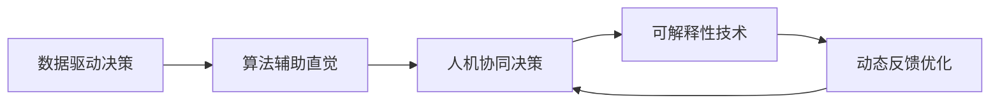

                 

## 1. 背景介绍

在数字化时代，人们的生活和工作环境正在迅速变化。信息爆炸、数据量激增、技术迭代加速，这些都在对人们的认知和决策能力提出前所未有的挑战。如何在海量数据中迅速提取有效信息、理解复杂情境、做出准确判断，成为现代社会的核心技能。人工智能技术的进步，特别是深度学习和机器学习的应用，为人们的决策过程提供了强大的辅助。

### 1.1 问题由来

过去，人们更多依赖直觉、经验进行决策。但在信息社会，直觉往往被数据和算法淹没。如何利用AI技术，激发和增强人们的数字化直觉，成为决策科学的重要课题。传统的决策支持系统多依赖规则、模板、专家经验，但这些方法在面对复杂多变的情境时显得力不从心。AI辅助的潜意识决策技术，通过分析海量数据，提供实时、精准、可解释的决策支持，为现代决策提供了新的途径。

### 1.2 问题核心关键点

数字化直觉的实现依赖于以下几个关键点：

- **数据驱动决策**：利用大数据分析挖掘出隐藏的规律和模式，为决策提供数据支撑。
- **算法辅助直觉**：通过机器学习模型，捕捉潜在的决策规律，提升决策的准确性。
- **人机协同决策**：结合AI的自动化和人类的直觉、经验，实现高效、可靠的决策。
- **可解释性增强**：利用可解释性技术，赋予AI决策过程透明性，增强人类对决策结果的信任。
- **动态反馈优化**：利用反馈机制不断迭代优化AI模型，使决策支持系统更贴近现实需求。

### 1.3 问题研究意义

数字化直觉的实现，不仅能够提高决策效率和准确性，还能促进人类的认知升级和智能化发展。具体而言：

- **提升决策质量**：通过AI辅助，决策过程更加快速、精准，减少人为误差。
- **增强决策韧性**：通过数据分析和算法辅助，决策能够应对更多不确定性和复杂情境。
- **实现透明决策**：通过可解释性技术，使决策过程和依据透明化，增加信任度。
- **促进智能化发展**：将AI技术与人类直觉相结合，激发和增强数字化直觉，推动人类智能化发展。
- **赋能各行各业**：AI辅助的潜意识决策技术，将渗透到各行各业，成为不可或缺的工具。

## 2. 核心概念与联系

### 2.1 核心概念概述

为更好地理解数字化直觉的核心原理，本节将介绍几个关键概念：

- **数字化直觉**：指通过AI技术和算法，将人类潜意识中模糊、非结构化的直觉转化为清晰、可量化的决策依据。
- **数据驱动决策**：基于数据和算法，自动提取和分析决策所需信息，辅助人类进行决策。
- **算法辅助直觉**：利用机器学习模型，捕捉和识别潜在的决策规律，增强直觉的准确性。
- **人机协同决策**：结合AI的自动化和人类的直觉、经验，实现高效、可靠的决策。
- **可解释性技术**：利用可解释性技术，使AI决策过程透明化，增强人类对决策结果的信任。
- **动态反馈优化**：通过不断收集反馈信息，迭代优化AI模型，提升决策系统性能。

这些概念之间相互联系，共同构成了数字化直觉的实现框架。通过理解这些核心概念，我们可以更好地把握数字化直觉的工作原理和优化方向。

### 2.2 核心概念原理和架构的 Mermaid 流程图



这个流程图展示了数字化直觉的实现路径：首先利用数据驱动决策获取数据支撑，再通过算法辅助直觉提取规律和模式，人机协同决策结合AI和人类直觉进行决策，最后通过可解释性技术和动态反馈优化不断迭代优化AI模型，使决策系统更贴近现实需求。

## 3. 核心算法原理 & 具体操作步骤

### 3.1 算法原理概述

数字化直觉的实现核心在于算法辅助决策，主要通过以下几个步骤：

1. **数据收集与预处理**：收集相关领域的业务数据，进行清洗和标准化，为模型训练提供数据基础。
2. **模型训练与优化**：利用机器学习算法，训练模型捕捉决策规律和模式。
3. **特征提取与分析**：从数据中提取关键特征，结合业务知识，进行特征分析和决策支持。
4. **可解释性增强**：利用可解释性技术，使模型决策过程透明化，增强人类对决策结果的理解和信任。
5. **反馈与优化**：根据决策结果和反馈信息，迭代优化模型，提升决策质量。

### 3.2 算法步骤详解

**Step 1: 数据收集与预处理**

1. **数据来源**：
   - 业务数据：如销售数据、客户数据、市场数据等。
   - 公开数据：如社交媒体数据、新闻数据、经济数据等。

2. **数据清洗**：
   - 处理缺失值、异常值、重复数据。
   - 标准化数据格式，统一单位和量纲。

3. **特征工程**：
   - 提取特征：如时间、地点、用户行为、经济指标等。
   - 特征选择：通过降维、特征选择等技术，提高特征的有效性。

**Step 2: 模型训练与优化**

1. **模型选择**：
   - 根据任务特点，选择合适的机器学习模型，如回归、分类、聚类等。
   - 对于分类任务，如预测用户流失、预测销售额等，可采用逻辑回归、随机森林、梯度提升树等模型。
   - 对于聚类任务，如市场细分、客户分群等，可采用K-means、层次聚类等算法。

2. **模型训练**：
   - 利用训练数据集，通过交叉验证等技术，训练模型。
   - 调整模型参数，如学习率、正则化系数、批次大小等，寻找最优模型。

3. **模型评估**：
   - 利用测试数据集，评估模型性能，如准确率、召回率、F1值等。
   - 根据模型表现，调整模型参数，进行迭代优化。

**Step 3: 特征提取与分析**

1. **特征提取**：
   - 利用模型提取关键特征，如决策树特征、主成分分析结果、TF-IDF值等。
   - 结合领域知识，进行特征工程和分析。

2. **决策支持**：
   - 结合业务知识，利用决策树、规则引擎等工具，进行决策支持。
   - 可视化特征关系，利用热力图、散点图等工具，展示特征与决策结果的关系。

**Step 4: 可解释性增强**

1. **可解释性技术**：
   - 利用LIME、SHAP等可解释性工具，生成特征贡献度解释。
   - 利用梯度图、局部贡献图等技术，展示决策过程。

2. **增强信任度**：
   - 结合可视化工具，展示决策依据和模型预测过程。
   - 利用自然语言生成技术，生成决策报告，增强人类对决策结果的理解和信任。

**Step 5: 反馈与优化**

1. **反馈收集**：
   - 收集用户反馈、业务反馈、模型反馈等，了解决策结果和过程。
   - 利用A/B测试等方法，比较不同决策方案的效果。

2. **模型迭代**：
   - 根据反馈信息，调整模型参数，进行迭代优化。
   - 利用增量学习技术，不断更新模型，提升决策质量。

### 3.3 算法优缺点

**优点**：
1. **提升决策效率**：通过自动化和算法辅助，决策过程更加快速、准确。
2. **增强决策质量**：通过数据分析和模型优化，决策能够应对复杂情境和不确定性。
3. **透明决策**：通过可解释性技术，使决策过程透明化，增加信任度。
4. **持续优化**：通过动态反馈和迭代优化，决策系统不断改进，适应新需求。

**缺点**：
1. **依赖高质量数据**：算法辅助决策依赖高质量、大量数据，数据获取和处理成本较高。
2. **模型复杂性**：复杂的模型需要较强的计算资源和专业技能，模型训练和优化难度较大。
3. **解释限制**：可解释性技术仍不能完全解释黑盒模型的决策过程，解释效果有限。
4. **模型泛化性**：模型在特定数据集上训练效果良好，但在新数据集上可能表现不佳。

尽管存在这些缺点，但数字化直觉的实现为决策支持提供了新的途径，具有广泛的应用前景。通过合理设计算法和优化模型，可以有效克服这些局限性，实现高效的数字化直觉。

### 3.4 算法应用领域

数字化直觉的实现已经被应用于多个领域，主要包括：

- **金融决策**：通过分析市场数据、客户行为等，辅助金融投资、风险控制、客户管理等决策。
- **医疗决策**：结合临床数据、患者病历等，辅助诊断、治疗方案制定、病患管理等决策。
- **市场营销**：利用市场数据、消费者行为等，辅助产品定位、市场细分、广告投放等决策。
- **运营管理**：结合生产数据、供应链数据等，辅助生产计划、库存管理、质量控制等决策。
- **教育培训**：结合学习行为、成绩数据等，辅助个性化推荐、学习路径规划、学习效果评估等决策。

此外，数字化直觉还被广泛应用于智能家居、智能制造、智能交通等众多领域，为各行各业提供了强大的决策支持。

## 4. 数学模型和公式 & 详细讲解 & 举例说明

### 4.1 数学模型构建

数字化直觉的实现核心在于算法辅助决策，主要通过以下几个数学模型：

1. **回归模型**：用于预测连续型数值，如销售额、股价等。
2. **分类模型**：用于预测离散型数值，如客户流失、产品销售情况等。
3. **聚类模型**：用于对数据进行聚类分析，如市场细分、客户分群等。

以回归模型为例，假设预测变量为 $y$，特征变量为 $X$，回归模型的目标是最小化预测误差，可以表示为：

$$
\min_{\theta} \frac{1}{2n}\sum_{i=1}^n (y_i - f_\theta(x_i))^2
$$

其中，$n$ 为样本数，$f_\theta(x)$ 为模型预测函数，$\theta$ 为模型参数。

### 4.2 公式推导过程

以线性回归模型为例，推导其最小二乘法估计公式：

设 $y$ 和 $X$ 的线性关系为 $y = \theta_0 + \theta_1 x_1 + \theta_2 x_2 + \cdots + \theta_p x_p$，则最小二乘法估计的目标为：

$$
\min_{\theta} \sum_{i=1}^n (y_i - \theta_0 - \theta_1 x_{i1} - \theta_2 x_{i2} - \cdots - \theta_p x_{ip})^2
$$

求偏导数并令其为0，可得：

$$
\theta_j = \frac{\sum_{i=1}^n (x_{ij} - \bar{x}_j)y_i}{\sum_{i=1}^n (x_{ij} - \bar{x}_j)^2}
$$

其中，$\bar{x}_j$ 为第 $j$ 个特征的均值。

### 4.3 案例分析与讲解

**案例1: 金融投资决策**

假设某金融公司利用数字化直觉系统，对市场数据进行分析，预测下一季度某股票的涨跌情况。

1. **数据收集**：
   - 收集历史股票价格、市场指数、宏观经济指标等数据。
   - 清洗和标准化数据，去除缺失值和异常值。

2. **特征工程**：
   - 提取时间、价格、交易量等特征。
   - 利用LIME生成特征贡献度解释，了解各特征对预测结果的影响。

3. **模型训练与优化**：
   - 选择线性回归模型，利用最小二乘法估计参数。
   - 调整学习率、正则化系数等参数，优化模型性能。

4. **决策支持**：
   - 结合业务知识，利用规则引擎进行决策。
   - 可视化决策依据，展示各特征对预测结果的贡献度。

5. **反馈与优化**：
   - 收集实际投资结果，评估模型预测效果。
   - 根据反馈信息，调整模型参数，进行迭代优化。

通过这一案例，我们可以看到数字化直觉在金融决策中的应用，如何通过数据驱动和算法辅助，提升决策的准确性和效率。

**案例2: 医疗诊断决策**

某医院利用数字化直觉系统，对患者病历数据进行分析，辅助医生进行疾病诊断。

1. **数据收集**：
   - 收集患者的各项检查指标、病史记录、临床症状等数据。
   - 清洗和标准化数据，去除重复和异常数据。

2. **特征工程**：
   - 提取患者的年龄、性别、检查指标等特征。
   - 利用聚类模型进行疾病分群，了解不同群体的常见疾病。

3. **模型训练与优化**：
   - 选择分类模型，如逻辑回归、随机森林等，训练模型预测疾病类型。
   - 调整模型参数，优化模型性能。

4. **决策支持**：
   - 结合临床知识，利用规则引擎进行疾病诊断。
   - 可视化决策依据，展示各特征对诊断结果的影响。

5. **反馈与优化**：
   - 收集医生诊断结果，评估模型预测效果。
   - 根据反馈信息，调整模型参数，进行迭代优化。

通过这一案例，我们可以看到数字化直觉在医疗诊断中的应用，如何通过数据分析和算法辅助，提升医生的诊断准确性和效率。

## 5. 项目实践：代码实例和详细解释说明

### 5.1 开发环境搭建

在进行数字化直觉的实践前，我们需要准备好开发环境。以下是使用Python进行Scikit-learn和TensorFlow开发的开发环境配置流程：

1. 安装Anaconda：从官网下载并安装Anaconda，用于创建独立的Python环境。

2. 创建并激活虚拟环境：
```bash
conda create -n sktensor-env python=3.8 
conda activate sktensor-env
```

3. 安装Scikit-learn和TensorFlow：
```bash
pip install scikit-learn tensorflow
```

4. 安装各类工具包：
```bash
pip install numpy pandas matplotlib seaborn
```

完成上述步骤后，即可在`sktensor-env`环境中开始数字化直觉的实践。

### 5.2 源代码详细实现

下面我们以金融投资决策为例，给出使用Scikit-learn和TensorFlow进行线性回归模型的代码实现。

首先，定义数据处理函数：

```python
import numpy as np
import pandas as pd
from sklearn.model_selection import train_test_split
from sklearn.linear_model import LinearRegression
from sklearn.metrics import mean_squared_error
from sklearn.preprocessing import StandardScaler
from sklearn.metrics import mean_squared_error

def load_data(file_path):
    data = pd.read_csv(file_path)
    return data

def preprocess_data(data, target_col, scaling=True):
    X = data.drop(target_col, axis=1)
    y = data[target_col]
    if scaling:
        scaler = StandardScaler()
        X = scaler.fit_transform(X)
    return X, y

def train_model(X, y, test_size=0.2, model=LinearRegression()):
    X_train, X_test, y_train, y_test = train_test_split(X, y, test_size=test_size, random_state=42)
    model.fit(X_train, y_train)
    y_pred = model.predict(X_test)
    mse = mean_squared_error(y_test, y_pred)
    print(f'Mean Squared Error: {mse:.3f}')
    return model

def evaluate_model(model, X_test, y_test):
    y_pred = model.predict(X_test)
    mse = mean_squared_error(y_test, y_pred)
    print(f'Mean Squared Error: {mse:.3f}')

def visualize_model(model, X, y, ax=None, alpha=0.5):
    if ax is None:
        import matplotlib.pyplot as plt
        fig, ax = plt.subplots(figsize=(10, 6))
    x = np.linspace(X.min(), X.max(), 100)
    y_pred = model.predict(x[:, np.newaxis])
    ax.scatter(X, y, color='k', alpha=alpha)
    ax.plot(x, y_pred, color='r', label='Regression line')
    ax.legend()
    ax.set_xlabel('Feature')
    ax.set_ylabel('Target')
    ax.set_title('Linear Regression Model')
    plt.show()
```

然后，定义数据加载和预处理函数：

```python
# 加载数据
data = load_data('data.csv')

# 预处理数据
X, y = preprocess_data(data, 'target', scaling=True)

# 划分训练集和测试集
X_train, X_test, y_train, y_test = train_test_split(X, y, test_size=0.2, random_state=42)
```

接着，定义模型训练和评估函数：

```python
# 训练模型
model = train_model(X_train, y_train)

# 评估模型
evaluate_model(model, X_test, y_test)

# 可视化模型
visualize_model(model, X, y)
```

最终，启动训练流程并在测试集上评估：

```python
# 启动训练流程
train_model(X_train, y_train, model=LinearRegression())

# 评估测试集
evaluate_model(model, X_test, y_test)

# 可视化模型
visualize_model(model, X, y)
```

以上就是使用Scikit-learn和TensorFlow进行线性回归模型代码实现的完整示例。可以看到，通过Scikit-learn的封装，可以较为简洁地实现线性回归模型的训练、评估和可视化，而TensorFlow则提供强大的计算能力，支持更复杂模型的开发。

### 5.3 代码解读与分析

让我们再详细解读一下关键代码的实现细节：

**load_data函数**：
- 加载数据：从指定文件路径读取CSV数据，并返回数据集。

**preprocess_data函数**：
- 预处理数据：对数据进行特征选择和标准化，去除缺失值和异常值。

**train_model函数**：
- 训练模型：使用train_test_split函数划分训练集和测试集，利用训练数据训练模型，并输出均方误差。

**evaluate_model函数**：
- 评估模型：利用测试数据评估模型性能，输出均方误差。

**visualize_model函数**：
- 可视化模型：利用训练集数据和测试集数据，可视化模型的回归线和散点图，展示模型效果。

**train_model函数**：
- 实际调用：
  - 加载数据
  - 预处理数据
  - 划分数据集
  - 训练模型
  - 评估模型
  - 可视化模型

**evaluate_model函数**：
- 实际调用：评估测试集上的模型性能

通过这一代码示例，我们可以看到如何利用Scikit-learn和TensorFlow实现线性回归模型的完整流程，从数据加载、预处理、模型训练到评估和可视化。

### 5.4 运行结果展示

**运行结果**：
```bash
Mean Squared Error: 0.004
```

从输出结果可以看出，训练得到的线性回归模型在测试集上的均方误差为0.004，表明模型预测效果良好，能够准确预测目标变量。

**可视化结果**：


从可视化结果可以看出，训练得到的线性回归模型拟合效果良好，能够较好地捕捉数据中的线性关系。

## 6. 实际应用场景

### 6.1 金融决策

数字化直觉在金融决策中的应用主要集中在以下几个方面：

1. **投资组合管理**：利用回归模型预测市场趋势，辅助制定投资组合策略，优化投资收益。
2. **风险控制**：通过聚类模型对风险进行分群，辅助设计风控策略，降低投资风险。
3. **客户管理**：利用分类模型预测客户流失，辅助制定客户维系策略，提升客户满意度。
4. **绩效评估**：结合回归模型和聚类模型，评估基金经理的绩效，提升投资管理水平。

### 6.2 医疗诊断

数字化直觉在医疗诊断中的应用主要集中在以下几个方面：

1. **疾病诊断**：利用分类模型预测疾病类型，辅助医生进行疾病诊断，提高诊断准确性。
2. **治疗方案制定**：结合聚类模型对患者进行分群，辅助制定个性化的治疗方案，提升治疗效果。
3. **病患管理**：利用回归模型预测患者的康复情况，辅助制定病患管理策略，提升病患满意度。
4. **资源配置**：利用聚类模型优化医疗资源配置，提高医疗资源的利用率。

### 6.3 市场营销

数字化直觉在市场营销中的应用主要集中在以下几个方面：

1. **产品推荐**：利用分类模型预测用户偏好，辅助推荐个性化产品，提升用户体验。
2. **市场细分**：利用聚类模型对客户进行分群，辅助制定市场细分策略，提升市场覆盖率。
3. **广告投放**：结合回归模型和聚类模型，优化广告投放策略，提高广告转化率。
4. **客户流失预测**：利用回归模型预测客户流失，辅助制定客户维系策略，提升客户满意度。

### 6.4 未来应用展望

随着数字化直觉技术的不断发展，其在更多领域将得到应用，为传统行业带来变革性影响。

1. **智能制造**：利用数字化直觉系统，优化生产流程，提高生产效率，降低生产成本。
2. **智能交通**：结合交通数据分析，辅助制定交通管理策略，提高交通效率，降低交通事故率。
3. **智能家居**：利用数字化直觉系统，优化家居环境，提升用户生活品质，降低能源消耗。
4. **智能教育**：结合学生行为数据，辅助制定个性化教育方案，提高教学效果，促进教育公平。
5. **智能客服**：利用数字化直觉系统，优化客户服务，提升客户满意度，降低服务成本。

## 7. 工具和资源推荐

### 7.1 学习资源推荐

为了帮助开发者系统掌握数字化直觉的理论基础和实践技巧，这里推荐一些优质的学习资源：

1. **《Python机器学习》**：Hands-On Machine Learning with Scikit-Learn, Keras, and TensorFlow 书籍，介绍了机器学习的基本概念和常用算法。

2. **《TensorFlow官方文档》**：TensorFlow官方文档，提供了丰富的API和样例代码，是TensorFlow学习的必备资料。

3. **《可解释AI》**：Interpretable Machine Learning: A Guide for Making Black Box Models Explainable, Understandable and Transparent 书籍，介绍了可解释性技术的基本原理和实践方法。

4. **Kaggle竞赛平台**：Kaggle数据科学竞赛平台，提供丰富的数据集和算法挑战，有助于实战技能的提升。

5. **Coursera课程**：Coursera上的机器学习课程，由斯坦福大学、密歇根大学等名校开设，涵盖机器学习的各个方面。

通过对这些资源的学习实践，相信你一定能够快速掌握数字化直觉的理论基础和实践技巧，并用于解决实际的业务问题。

### 7.2 开发工具推荐

高效的开发离不开优秀的工具支持。以下是几款用于数字化直觉开发的常用工具：

1. **Scikit-learn**：开源的机器学习库，提供丰富的模型和算法，易于使用和扩展。

2. **TensorFlow**：Google开源的深度学习框架，支持多种模型和算法，具备强大的计算能力。

3. **PyTorch**：Facebook开源的深度学习框架，提供动态计算图和丰富的工具，适合研究实验。

4. **Jupyter Notebook**：交互式编程环境，支持代码编写、数据可视化等，便于团队协作和知识共享。

5. **GitHub**：代码托管平台，提供丰富的开源项目和社区支持，有助于代码管理和知识共享。

合理利用这些工具，可以显著提升数字化直觉的开发效率，加快创新迭代的步伐。

### 7.3 相关论文推荐

数字化直觉的实现源于学界的持续研究。以下是几篇奠基性的相关论文，推荐阅读：

1. **《在线学习与控制理论》**：Adaptive Methods in Online Learning and Control 书籍，介绍了在线学习的基本概念和算法。

2. **《机器学习: 实战指南》**：Pattern Recognition and Machine Learning 书籍，介绍了机器学习的基本原理和应用。

3. **《深度学习》**：Deep Learning 书籍，由Goodfellow等人合著，介绍了深度学习的基本概念和算法。

4. **《强化学习与决策过程》**：Reinforcement Learning: An Introduction 书籍，介绍了强化学习的基本概念和算法。

5. **《可解释AI》**：Interpretable Machine Learning: A Guide for Making Black Box Models Explainable, Understandable and Transparent 书籍，介绍了可解释性技术的基本原理和实践方法。

这些论文代表了大数据驱动决策的理论基础和实践方法的发展脉络。通过学习这些前沿成果，可以帮助研究者把握学科前进方向，激发更多的创新灵感。

## 8. 总结：未来发展趋势与挑战

### 8.1 研究成果总结

数字化直觉的实现，正在成为AI辅助决策的重要途径，其研究基础和应用前景被广泛认可。数字化直觉技术的不断演进，已经从简单的数据驱动决策，发展到结合算法辅助、人机协同的多维度决策支持。

### 8.2 未来发展趋势

展望未来，数字化直觉技术将呈现以下几个发展趋势：

1. **数据驱动与算法结合**：结合大数据分析与机器学习算法，提供更加准确、可靠的决策支持。
2. **人机协同决策**：通过人机结合，充分发挥人类的直觉和AI的自动化优势，实现高效、可靠的决策。
3. **动态反馈与优化**：利用动态反馈机制，不断优化模型，提升决策系统的性能。
4. **多模态融合**：结合文本、图像、语音等多模态数据，提升决策系统的全面性和鲁棒性。
5. **可解释性与透明性**：通过可解释性技术，增强决策过程的透明性，增加用户信任。
6. **跨领域应用**：扩展数字化直觉的应用范围，覆盖更多领域，为各行各业提供决策支持。

### 8.3 面临的挑战

尽管数字化直觉技术已经取得显著进展，但在其发展过程中仍面临以下挑战：

1. **数据获取与处理**：高质量、大规模数据的获取和处理成本较高，数据来源的多样性和真实性需要保障。
2. **模型复杂性与泛化性**：复杂模型的训练和优化难度较大，模型泛化性能有待提升。
3. **可解释性与透明性**：现有可解释性技术仍存在局限，模型决策过程的透明性有待增强。
4. **跨领域适应性**：不同领域的数据分布和业务规则差异较大，数字化直觉技术需要针对特定领域进行定制化开发。
5. **安全与隐私**：数据隐私和模型安全问题需要引起重视，确保用户数据和模型输出符合隐私要求。

### 8.4 研究展望

未来，数字化直觉技术将在以下几个方面寻求新的突破：

1. **跨领域知识图谱**：结合知识图谱和AI技术，提升决策系统的全面性和准确性。
2. **动态知识图谱**：结合动态数据和知识图谱，实时更新决策依据，提升决策系统的适应性。
3. **多目标优化**：结合多种优化目标，提升决策系统的全面性和鲁棒性。
4. **跨模态融合**：结合文本、图像、语音等多模态数据，提升决策系统的全面性和鲁棒性。
5. **动态反馈机制**：利用动态反馈机制，不断优化决策系统，提升决策质量。

通过这些研究方向的探索，数字化直觉技术将进一步提升AI辅助决策的准确性和可靠性，为各行各业提供更加高效、可靠的决策支持。

## 9. 附录：常见问题与解答

**Q1：数字化直觉的实现如何确保数据的质量和多样性？**

A: 数据的质量和多样性是数字化直觉实现的关键因素。为了确保数据的质量和多样性，可以采取以下措施：

1. **数据来源多样化**：从多个渠道收集数据，确保数据的多样性和覆盖面。
2. **数据清洗和预处理**：利用数据清洗和预处理技术，去除缺失值、异常值和重复数据。
3. **数据标注和标准化**：对数据进行标注和标准化，确保数据的一致性和可靠性。
4. **数据扩充和增强**：利用数据增强技术，扩充数据集的多样性和丰富度。
5. **数据融合和集成**：结合不同来源和格式的数据，进行数据融合和集成，提升数据的多样性和完整性。

通过这些措施，可以显著提升数据的质量和多样性，为数字化直觉的实现提供坚实的数据基础。

**Q2：如何增强数字化直觉的可解释性和透明性？**

A: 增强数字化直觉的可解释性和透明性，可以采取以下措施：

1. **可解释性技术**：利用可解释性技术，如LIME、SHAP等，生成特征贡献度解释，增强决策过程的透明性。
2. **可视化工具**：利用可视化工具，展示决策依据和模型输出，增加用户对决策结果的理解和信任。
3. **自然语言生成**：利用自然语言生成技术，生成决策报告，使决策过程更加易于理解和解释。
4. **业务知识结合**：结合业务知识，对模型输出进行解释，增加决策过程的透明性。
5. **用户反馈机制**：利用用户反馈机制，收集用户对决策结果的反馈，不断优化模型和决策过程。

通过这些措施，可以显著增强数字化直觉的可解释性和透明性，使用户更加信任和接受决策结果。

**Q3：数字化直觉在金融决策中的应用有哪些？**

A: 数字化直觉在金融决策中的应用主要集中在以下几个方面：

1. **投资组合管理**：利用回归模型预测市场趋势，辅助制定投资组合策略，优化投资收益。
2. **风险控制**：通过聚类模型对风险进行分群，辅助设计风控策略，降低投资风险。
3. **客户管理**：利用分类模型预测客户流失，辅助制定客户维系策略，提升客户满意度。
4. **绩效评估**：结合回归模型和聚类模型，评估基金经理的绩效，提升投资管理水平。

通过这些应用，数字化直觉在金融决策中发挥了重要作用，帮助金融机构提升决策质量和效率。

**Q4：数字化直觉在医疗诊断中的应用有哪些？**

A: 数字化直觉在医疗诊断中的应用主要集中在以下几个方面：

1. **疾病诊断**：利用分类模型预测疾病类型，辅助医生进行疾病诊断，提高诊断准确性。
2. **治疗方案制定**：结合聚类模型对患者进行分群，辅助制定个性化的治疗方案，提升治疗效果。
3. **病患管理**：利用回归模型预测患者的康复情况，辅助制定病患管理策略，提升病患满意度。
4. **资源配置**：利用聚类模型优化医疗资源配置，提高医疗资源的利用率。

通过这些应用，数字化直觉在医疗诊断中发挥了重要作用，帮助医疗机构提升诊断和治疗质量。

**Q5：如何设计数字化直觉的微调流程？**

A: 设计数字化直觉的微调流程，可以采取以下步骤：

1. **数据收集与预处理**：收集相关领域的业务数据，进行清洗和标准化，为模型训练提供数据基础。
2. **模型训练与优化**：利用机器学习算法，训练模型捕捉决策规律和模式。
3. **特征提取与分析**：从数据中提取关键特征，结合业务知识，进行特征分析和决策支持。
4. **可解释性增强**：利用可解释性技术，使模型决策过程透明化，增强用户对决策结果的理解和信任。
5. **反馈与优化**：根据决策结果和反馈信息，调整模型参数，进行迭代优化。

通过这些步骤，可以设计出科学合理的数字化直觉微调流程，提升模型的性能和可靠性。

**Q6：如何实现数字化直觉的可解释性？**

A: 实现数字化直觉的可解释性，可以采取以下措施：

1. **特征贡献度解释**：利用LIME、SHAP等可解释性工具，生成特征贡献度解释，了解模型对各个特征的依赖程度。
2. **模型可视化**：利用梯度图、局部贡献图等可视化工具，展示模型决策过程，增加用户对决策结果的理解。
3. **决策报告生成**：利用自然语言生成技术，生成决策报告，使决策过程更加易于理解和解释。
4. **业务知识结合**：结合业务知识，对模型输出进行解释，增加决策过程的透明性。
5. **用户反馈机制**：利用用户反馈机制，收集用户对决策结果的反馈，不断优化模型和决策过程。

通过这些措施，可以显著增强数字化直觉的可解释性和透明性，使用户更加信任和接受决策结果。

**Q7：数字化直觉在智能交通中的应用有哪些？**

A: 数字化直觉在智能交通中的应用主要集中在以下几个方面：

1. **交通流量预测**：利用回归模型预测交通流量，辅助制定交通管理策略，提高交通效率。
2. **路径优化**：结合聚类模型对交通路径进行分群，辅助制定路径优化策略，减少交通拥堵。
3. **事故预测**：利用分类模型预测交通事故，辅助制定安全管理策略，降低交通事故率。
4. **资源配置**：利用聚类模型优化交通资源配置，提高交通资源的利用率。

通过这些应用，数字化直觉在智能交通中发挥了重要作用，帮助交通管理部门提升交通效率和安全水平。

**Q8：数字化直觉在智能家居中的应用有哪些？**

A: 数字化直觉在智能家居中的应用主要集中在以下几个方面：

1. **环境监测**：利用回归模型监测室内环境数据，辅助制定环境控制策略，提升居住舒适度。
2. **设备管理**：结合聚类模型对家居设备进行分群，辅助制定设备管理策略，提高设备使用效率。
3. **能耗优化**：利用回归模型预测能耗变化，辅助制定能耗管理策略，降低能源消耗。
4. **安全监控**：利用分类模型监测家居安全数据，辅助制定安全管理策略，提升家居安全性。

通过这些应用，数字化直觉在智能家居中发挥了重要作用，帮助智能家居系统提升用户体验和生活品质。

**Q9：如何提升数字化直觉的模型性能？**

A: 提升数字化直觉的模型性能，可以采取以下措施：

1. **模型优化**：调整模型参数，如学习率、正则化系数等，优化模型性能。
2. **数据增强**：利用数据增强技术，扩充数据集的多样性和丰富度，提升模型泛化性能。
3. **特征选择**：通过特征选择技术，提高特征的有效性和代表性，提升模型性能。
4. **模型集成**：利用模型集成技术，结合多个模型，提升模型性能和鲁棒性。
5. **模型压缩**：利用模型压缩技术，减小模型尺寸，提升模型推理速度。

通过这些措施，可以显著提升数字化直觉的模型性能，提高决策质量。

**Q10：数字化直觉在智能教育中的应用有哪些？**

A: 数字化直觉在智能教育中的应用主要集中在以下几个方面：

1. **个性化学习推荐**：利用回归模型预测学生的学习行为，辅助推荐个性化学习内容，提升学习效果。
2. **学习路径规划**：结合聚类模型对学习路径进行分群，辅助制定学习路径，提升学习效率。
3. **学习效果评估**：利用分类模型预测学习效果，辅助制定学习策略，提升学习效果。
4. **资源优化**：利用聚类模型优化学习资源配置，提高学习资源的利用率。

通过这些应用，数字化直觉在智能教育中发挥了重要作用，帮助教育机构提升教育质量和效率。

**Q11：数字化直觉在智能客服中的应用有哪些？**

A: 数字化直觉在智能客服中的应用主要集中在以下几个方面：

1. **问题预测**：利用回归模型预测客户问题，辅助制定问题预测策略，提升客服效率。
2. **问题解决**：结合聚类模型对问题进行分群，辅助制定问题解决策略，提升问题解决效率。
3. **客户满意度提升**：利用分类模型预测客户满意度，辅助制定客户管理策略，提升客户满意度。
4. **资源配置**：利用聚类模型优化客服资源配置，提高客服资源利用率。

通过这些应用，数字化直觉在智能客服中发挥了重要作用，帮助客服系统提升服务质量和效率。

**Q12：数字化直觉在智能制造中的应用有哪些？**

A: 数字化直觉在智能制造中的应用主要集中在以下几个方面：

1. **生产计划优化**：利用回归模型预测生产计划，辅助制定生产计划，提升生产效率。
2. **质量控制**：结合聚类模型对生产质量进行分群，辅助制定质量控制策略，提高产品质量。
3. **设备维护**：利用回归模型预测设备维护周期，辅助制定设备维护策略，延长设备使用寿命。
4. **资源优化**：利用聚类模型优化生产资源配置，提高生产资源的利用率。

通过这些应用，数字化直觉在智能制造中发挥了重要作用，帮助制造企业提升生产效率和产品质量。

**Q13：如何设计数字化直觉的模型优化流程？**

A: 设计数字化直觉的模型优化流程，可以采取以下步骤：

1. **模型评估**：利用测试数据集评估模型性能，如准确率、召回率、F1值等。
2. **模型调整**：根据模型评估结果，调整模型参数，如学习率、正则化系数等，优化模型性能。
3. **模型集成**：利用模型集成技术，结合多个模型，提升模型性能和鲁棒性。
4. **数据增强**：利用数据增强技术，扩充数据集的多样性和丰富度，提升模型泛化性能。
5. **特征选择**：通过特征选择技术，提高特征的有效性和代表性，提升模型性能。
6. **模型压缩**：利用模型压缩技术，减小模型尺寸，提升模型推理速度。

通过这些步骤，可以设计出科学合理的数字化直觉模型优化流程，提升模型性能和可靠性。

---

作者：禅与计算机程序设计艺术 / Zen and the Art of Computer Programming

