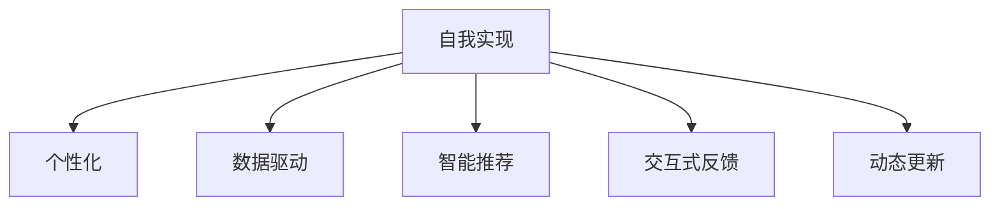

                 

# 数字化自我实现助手开发者：AI辅助的个人成长教练设计师

## 1. 背景介绍

### 1.1 问题由来
数字化时代的到来，让我们面临前所未有的机遇和挑战。在这个高速发展的时代，知识更新日新月异，个人的自我实现和成长也变得更加重要。然而，在这个信息爆炸、知识碎片化的时代，如何高效、系统地进行自我实现，成为一个值得深思的问题。传统的教育方式已经难以满足现代人的需求，我们迫切需要一个更为智能、个性化的自我实现工具。

### 1.2 问题核心关键点
为了解决这一问题，AI辅助的个人成长教练设计师应运而生。该系统旨在通过智能算法和大数据分析，帮助用户系统性地规划个人成长路径，提供个性化的学习资源和成长建议，从而实现自我实现的目标。关键点如下：

- **系统智能化：**利用AI技术实现个性化学习路径推荐、智能资源推荐和动态反馈。
- **数据驱动：**基于用户的自我描述、行为数据和成长目标，动态生成个性化的成长计划。
- **交互性：**通过与用户的互动，获取用户的实时反馈，动态调整成长策略。
- **动态更新：**结合用户的反馈和最新研究成果，实时更新学习资源和成长建议。

### 1.3 问题研究意义
通过构建数字化自我实现助手，我们有望为个人成长提供更高效、更智能的解决方案。其研究意义主要体现在以下几个方面：

- **提升个人成长效率：**通过智能推荐和动态反馈，帮助用户系统性地规划和执行个人成长计划，提升学习效率。
- **个性化成长建议：**利用AI技术，根据用户的个性化需求，提供量身定制的学习资源和成长策略。
- **促进知识共享与合作：**通过系统化、结构化的成长平台，促进知识的共享和交流，推动社区成长。
- **推动教育创新：**为传统教育模式提供补充，探索新的教育方法和工具，推动教育创新。

## 2. 核心概念与联系

### 2.1 核心概念概述

在构建数字化自我实现助手的过程中，需要处理和利用多个核心概念，这些概念相互联系，共同构成了系统的核心框架。

- **自我实现(Realization)：**通过系统的引导和帮助，用户实现自身的潜能和目标。
- **个性化(Personalization)：**根据用户的个性化需求，提供量身定制的成长计划和学习资源。
- **数据驱动(Datadriven)：**利用数据分析技术，动态调整成长策略和学习路径。
- **智能推荐(Intelligent Recommendation)：**利用AI算法，推荐最适合用户的学习资源和成长路径。
- **交互式反馈(Interactive Feedback)：**通过与用户的实时互动，获取反馈，动态调整成长计划。
- **动态更新(Dynamic Update)：**根据用户反馈和最新研究成果，实时更新系统内容。

这些概念之间的逻辑关系可以通过以下Mermaid流程图来展示：



这个流程图展示了各个核心概念之间的联系：

1. 自我实现是整个系统的目标和核心。
2. 个性化和数据驱动是实现自我实现的基础和手段。
3. 智能推荐和交互式反馈是支持个性化和数据驱动的关键技术。
4. 动态更新是系统适应用户需求和变化的基础能力。

## 3. 核心算法原理 & 具体操作步骤
### 3.1 算法原理概述

数字化自我实现助手的核心算法原理可以归纳为以下两点：

- **推荐算法：**通过用户的行为数据和自我描述，利用协同过滤、内容过滤、矩阵分解等算法，推荐最适合用户的学习资源和成长策略。
- **动态反馈算法：**根据用户的反馈和成长进度，利用强化学习、贝叶斯网络和深度学习等技术，动态调整成长路径和学习内容。

这些算法共同作用，实现了系统的智能化和个性化，从而更好地支持用户的自我实现。

### 3.2 算法步骤详解

1. **数据收集：**从用户注册开始，系统收集用户的个人信息、行为数据、学习记录和自我描述，形成用户的“数字化档案”。
2. **路径规划：**利用数据驱动算法，根据用户的“数字化档案”，生成个性化的成长路径和学习计划。
3. **资源推荐：**根据用户的行为数据和成长进度，利用推荐算法，动态推荐最适合的学习资源。
4. **反馈互动：**通过交互式反馈算法，实时获取用户的反馈，动态调整成长路径和学习内容。
5. **更新优化：**根据用户的反馈和最新研究成果，利用动态更新算法，实时更新系统的学习资源和成长策略。

### 3.3 算法优缺点

数字化自我实现助手的推荐算法具有以下优点：

- **高个性化：**通过用户的行为数据和自我描述，实现高度个性化的推荐。
- **动态适应：**利用动态更新算法，实时调整推荐内容和成长策略。
- **高效性：**基于用户行为数据，避免大量数据收集和预处理，提升推荐效率。

同时，该算法也存在一些缺点：

- **数据依赖：**高度依赖用户的行为数据和自我描述，数据质量直接影响推荐效果。
- **冷启动问题：**对于新用户，缺少行为数据，初始推荐效果可能不理想。
- **隐私问题：**用户数据的安全和隐私保护需要得到充分保障。

### 3.4 算法应用领域

数字化自我实现助手的推荐算法已经在多个领域得到广泛应用，例如：

- **教育领域：**推荐适合用户的学习资源和课程，个性化定制学习路径。
- **职业发展：**根据用户的职业目标和技能需求，推荐适合的培训课程和职业发展路径。
- **健康管理：**推荐适合用户的健康计划和运动建议，动态调整健康目标。
- **个人成长：**推荐适合用户的学习资源和成长策略，帮助用户实现自我实现。

## 4. 数学模型和公式 & 详细讲解  
### 4.1 数学模型构建

数字化自我实现助手的核心数学模型包括推荐算法和动态反馈算法，这些算法分别构建在协同过滤、内容过滤、矩阵分解、强化学习、贝叶斯网络和深度学习等基础之上。

- **协同过滤算法：**基于用户的历史行为数据，推荐类似用户喜欢的学习资源。
- **内容过滤算法：**根据学习资源的特征，推荐适合用户的学习资源。
- **矩阵分解算法：**利用矩阵分解技术，预测用户对学习资源的评分。
- **强化学习算法：**通过用户的学习进度和反馈，动态调整推荐策略。
- **贝叶斯网络算法：**利用贝叶斯网络，实现学习资源和成长目标之间的关联推理。
- **深度学习算法：**利用深度神经网络，预测用户的成长进度和学习效果。

### 4.2 公式推导过程

以协同过滤算法为例，假设用户集为 $U$，物品集为 $I$，用户对物品的评分矩阵为 $R_{UI}$。协同过滤算法的目标是找到一个低秩矩阵分解 $R_{UI} \approx \hat{R}_{UI}$，使得 $\hat{R}_{UI}$ 尽量逼近 $R_{UI}$。低秩矩阵分解的公式如下：

$$
\hat{R}_{UI} = \mathbf{P} \mathbf{Q}^T
$$

其中 $\mathbf{P} \in \mathbb{R}^{n \times k}, \mathbf{Q} \in \mathbb{R}^{k \times m}$，$n$ 和 $m$ 分别为用户数和物品数，$k$ 为分解的秩。协同过滤的目标函数为：

$$
\min_{\mathbf{P}, \mathbf{Q}} || \hat{R}_{UI} - R_{UI} ||_F^2 + \lambda || \mathbf{P} ||_F^2 + \lambda || \mathbf{Q} ||_F^2
$$

其中 $|| \cdot ||_F$ 表示矩阵的 Frobenius 范数，$\lambda$ 为正则化参数。

### 4.3 案例分析与讲解

假设用户 $u$ 对物品 $i$ 的评分未知，协同过滤算法通过找到最相似的 $k$ 个用户 $u_1, u_2, \ldots, u_k$，并计算出这些用户对物品 $i$ 的评分预测值 $\hat{r}_{ui}$，再根据加权平均公式计算出用户 $u$ 对物品 $i$ 的评分预测值：

$$
\hat{r}_{ui} = \frac{1}{k} \sum_{j=1}^k \alpha_j \hat{r}_{uj_i}
$$

其中 $\alpha_j$ 为加权系数，可以通过用户对物品的交互频率来计算。

## 5. 项目实践：代码实例和详细解释说明
### 5.1 开发环境搭建

在进行数字化自我实现助手项目开发前，需要配置相应的开发环境。以下是具体的配置流程：

1. **环境配置：**安装Python 3.x、PyTorch、TensorFlow、Numpy、Pandas等常用库。
2. **数据处理：**准备用户行为数据、自我描述数据和推荐资源数据，并存储到数据库或文件系统中。
3. **模型部署：**搭建模型训练和推理的服务器环境，确保GPU、TPU等高性能计算资源的可用性。

### 5.2 源代码详细实现

以下是一个基于TensorFlow的协同过滤推荐系统的示例代码：

```python
import tensorflow as tf
import pandas as pd

# 准备数据
ratings = pd.read_csv('ratings.csv')
items = pd.read_csv('items.csv')
users = pd.read_csv('users.csv')

# 构建用户-物品评分矩阵
R = ratings.pivot(index='user_id', columns='item_id', values='rating')

# 构建用户特征矩阵
user_features = pd.get_dummies(users['item_id'].map(lambda x: 'user-' + x))

# 构建物品特征矩阵
item_features = pd.get_dummies(items['item_id'].map(lambda x: 'item-' + x))

# 构建特征矩阵
X = pd.concat([user_features, item_features], axis=1)

# 构建用户评分预测模型
model = tf.keras.Sequential([
    tf.keras.layers.Dense(64, activation='relu', input_shape=(len(X.columns),)),
    tf.keras.layers.Dense(1)
])

# 编译模型
model.compile(optimizer='adam', loss='mse')

# 训练模型
model.fit(X, R.values, epochs=10, validation_split=0.2)

# 模型评估
test_data = pd.read_csv('test_data.csv')
test_X = pd.get_dummies(test_data['item_id'].map(lambda x: 'item-' + x))
predictions = model.predict(test_X)
```

以上代码展示了基于TensorFlow的协同过滤推荐系统的基本实现流程。具体步骤如下：

1. **数据准备：**准备用户行为数据、物品特征数据和用户特征数据，构建用户-物品评分矩阵 $R$。
2. **特征提取：**利用Pandas库，将用户和物品特征数据转换为特征矩阵 $X$。
3. **模型构建：**使用TensorFlow构建一个简单的线性回归模型，用于预测用户对物品的评分。
4. **模型训练：**使用用户行为数据和特征矩阵 $X$ 训练模型，并使用验证集进行评估。
5. **模型评估：**使用测试集数据评估模型性能，并输出预测结果。

### 5.3 代码解读与分析

**数据准备部分：**

- `ratings.csv`：用户对物品的评分数据。
- `items.csv`：物品的特征数据。
- `users.csv`：用户的特征数据。

**特征提取部分：**

- `pd.get_dummies`：将分类特征转换为独热编码。
- `user_features` 和 `item_features`：用户和物品的特征矩阵。
- `len(X.columns)`：特征矩阵的列数，即特征维数。

**模型构建部分：**

- `tf.keras.Sequential`：搭建一个线性回归模型。
- `Dense`：全连接层，用于构建特征映射关系。
- `activation='relu'`：激活函数为ReLU。
- `input_shape=(len(X.columns),)`：输入特征的维数，即用户和物品特征矩阵的列数。
- `model.compile`：编译模型，设置优化器和损失函数。
- `model.fit`：训练模型，并使用验证集进行评估。

**模型评估部分：**

- `test_data.csv`：测试集数据。
- `pd.get_dummies`：将测试集中的物品特征转换为独热编码。
- `model.predict`：使用模型预测用户对物品的评分。

## 6. 实际应用场景

### 6.1 教育领域

数字化自我实现助手在教育领域的应用主要体现在以下两个方面：

1. **个性化学习资源推荐：**根据学生的学习行为和成绩，推荐最适合的学习资源和课程，帮助学生高效学习。
2. **动态调整学习路径：**利用学生的反馈和成长进度，动态调整学习路径和课程，提升学习效果。

### 6.2 职业发展

数字化自我实现助手在职业发展领域的应用主要体现在以下两个方面：

1. **技能提升推荐：**根据员工的职业目标和技能需求，推荐适合的培训课程和职业发展路径，帮助员工提升技能。
2. **职业发展规划：**利用员工的反馈和职业成长进度，动态调整职业发展路径，帮助员工实现职业目标。

### 6.3 健康管理

数字化自我实现助手在健康管理领域的应用主要体现在以下两个方面：

1. **健康计划推荐：**根据用户的健康目标和数据，推荐最适合的健康计划和运动建议，帮助用户保持健康。
2. **健康进度跟踪：**利用用户的反馈和健康数据，动态调整健康计划，提升健康效果。

### 6.4 未来应用展望

随着技术的不断进步，数字化自我实现助手的应用场景将进一步拓展，未来可能涉及以下几个方面：

1. **智能健身教练：**结合AI技术和传感器数据，实现智能健身训练和进度跟踪。
2. **职业规划系统：**结合职业市场数据和人工智能分析，提供职业路径和机会推荐。
3. **心理健康辅导：**利用情感分析和大数据分析，提供心理健康建议和支持。
4. **个人成长平台：**结合个性化推荐和社区互动，构建全面的个人成长平台。

## 7. 工具和资源推荐
### 7.1 学习资源推荐

为了帮助开发者系统掌握数字化自我实现助手的核心技术和应用方法，推荐以下学习资源：

1. **《Python深度学习》（第二版）：**由深度学习领域专家编写，系统介绍了深度学习的基础和应用，包括推荐系统、强化学习等内容。
2. **《数据科学导论》：**介绍数据科学的基本概念和应用，涵盖了数据收集、数据处理、模型构建和评估等内容。
3. **Coursera《推荐系统》课程：**斯坦福大学开设的推荐系统课程，涵盖了协同过滤、矩阵分解等推荐算法。
4. **Kaggle推荐系统竞赛：**通过参与实际推荐系统竞赛，提升实战经验和算法能力。
5. **《强化学习：一种现代方法》：**介绍强化学习的基本概念和应用，包括强化学习在推荐系统中的应用。

### 7.2 开发工具推荐

以下推荐几款常用的开发工具，帮助开发者高效开发数字化自我实现助手：

1. **Jupyter Notebook：**基于Web的交互式编程环境，支持Python、R等多种语言，方便实时调试和分享代码。
2. **TensorFlow：**由Google主导开发的深度学习框架，支持分布式计算和GPU/TPU加速。
3. **PyTorch：**由Facebook开发的深度学习框架，支持动态计算图和GPU/TPU加速。
4. **scikit-learn：**Python数据科学库，提供了多种机器学习算法和工具。
5. **Pandas：**Python数据处理库，提供了多种数据处理和分析功能。

### 7.3 相关论文推荐

数字化自我实现助手的核心技术涉及多个前沿领域，推荐以下几篇相关论文：

1. **《Netflix Prize 竞赛论文》：**介绍协同过滤算法在推荐系统中的应用。
2. **《Matrix Factorization Techniques for Recommender Systems》：**介绍矩阵分解算法在推荐系统中的应用。
3. **《Deep Reinforcement Learning for Personalized Recommendation》：**介绍强化学习算法在推荐系统中的应用。
4. **《A Survey of Recommender Systems》：**综述推荐系统的发展历程和技术应用。
5. **《Item-based Collaborative Filtering Recommendation Algorithms》：**介绍协同过滤算法的基本原理和实现方法。

## 8. 总结：未来发展趋势与挑战
### 8.1 研究成果总结

数字化自我实现助手的发展离不开数据科学、机器学习和人工智能等多学科的交叉融合。目前，数字化自我实现助手已经在多个领域得到了广泛应用，展示了其在提升个人成长效率和智能化水平方面的巨大潜力。

### 8.2 未来发展趋势

展望未来，数字化自我实现助手的发展趋势主要体现在以下几个方面：

1. **智能化水平提升：**随着深度学习和强化学习技术的不断发展，数字化自我实现助手的智能化水平将进一步提升，能够提供更加个性化和精准的推荐和建议。
2. **跨领域应用扩展：**数字化自我实现助手将逐步扩展到更多领域，如医疗、金融、教育等，为不同领域用户提供智能化的自我实现解决方案。
3. **数据驱动的持续改进：**利用用户的实时反馈和行为数据，不断优化推荐策略和成长计划，实现动态更新和持续改进。
4. **多模态数据融合：**结合文本、图像、视频等多模态数据，提供更加全面和精准的推荐和建议。
5. **伦理和隐私保护：**随着数字化自我实现助手的广泛应用，数据隐私和伦理问题将受到更多关注，需要在算法设计和应用过程中充分考虑。

### 8.3 面临的挑战

数字化自我实现助手的发展仍面临一些挑战：

1. **数据隐私和安全：**用户数据的安全和隐私保护是数字化自我实现助手发展的首要问题，需要采取多种措施保障数据安全。
2. **冷启动问题：**对于新用户，缺少行为数据，初始推荐效果可能不理想，需要采取措施解决冷启动问题。
3. **算法复杂性：**推荐算法和动态反馈算法较为复杂，需要深入理解算法原理和实现细节。
4. **用户交互体验：**需要不断优化用户界面和交互设计，提升用户体验，增加用户粘性。
5. **系统稳定性：**需要优化系统架构和资源配置，确保系统稳定性，避免服务中断。

### 8.4 研究展望

针对上述挑战，未来的研究需要在以下几个方面取得新的突破：

1. **数据隐私保护技术：**开发更加安全、高效的数据隐私保护技术，确保用户数据的安全和隐私。
2. **冷启动算法：**开发更加高效的冷启动算法，帮助新用户快速适应系统，提升初始推荐效果。
3. **算法简化：**简化推荐算法和动态反馈算法的实现过程，降低开发难度，提高算法性能。
4. **用户界面设计：**优化用户界面和交互设计，提升用户体验，增加用户粘性。
5. **系统可靠性保障：**优化系统架构和资源配置，确保系统稳定性和可靠性，避免服务中断。

## 9. 附录：常见问题与解答

**Q1：数字化自我实现助手如何实现个性化推荐？**

A: 数字化自我实现助手利用协同过滤、内容过滤、矩阵分解等算法，根据用户的行为数据和自我描述，动态推荐最适合的学习资源和成长策略。具体实现过程中，系统通过收集用户的行为数据，构建用户-物品评分矩阵 $R$，并通过特征提取和矩阵分解算法，计算用户对物品的评分预测值 $\hat{r}_{ui}$，再根据加权平均公式计算用户对物品的评分预测值，从而实现个性化推荐。

**Q2：如何保障数字化自我实现助手的用户数据安全？**

A: 保障数字化自我实现助手的用户数据安全，需要采取多种措施：

1. **数据加密：**对用户数据进行加密存储和传输，防止数据泄露和篡改。
2. **访问控制：**采用严格的访问控制机制，限制数据的访问权限，防止未经授权的访问。
3. **数据匿名化：**对用户数据进行匿名化处理，防止个人隐私信息泄露。
4. **隐私政策透明：**公开透明的用户隐私政策，告知用户数据的收集和使用情况，并取得用户同意。
5. **安全审计：**定期进行安全审计，发现并修复安全漏洞，确保系统的安全性。

**Q3：如何优化数字化自我实现助手的推荐算法？**

A: 优化数字化自我实现助手的推荐算法，需要采取以下措施：

1. **算法改进：**改进协同过滤、内容过滤、矩阵分解等推荐算法，提升推荐精度和效率。
2. **特征工程：**优化特征提取和特征选择过程，提升特征的解释能力和推荐效果。
3. **数据清洗：**清洗和预处理用户数据，提升数据质量和推荐效果。
4. **模型调参：**优化推荐模型的参数设置，提升模型性能。
5. **在线学习：**利用在线学习技术，动态更新推荐策略，提升推荐效果。

**Q4：如何优化数字化自我实现助手的用户界面设计？**

A: 优化数字化自我实现助手的用户界面设计，需要采取以下措施：

1. **简洁易用：**界面设计要简洁明了，易于用户理解和操作。
2. **交互友好：**提供友好的交互体验，使用户能够方便地与系统进行互动。
3. **个性化定制：**根据用户的个性化需求，定制个性化的界面和功能，提升用户体验。
4. **实时反馈：**提供实时反馈机制，使用户能够及时了解系统的推荐结果和建议。
5. **视觉设计：**采用美观的视觉设计，提升用户的使用体验和满意度。

---

作者：禅与计算机程序设计艺术 / Zen and the Art of Computer Programming

