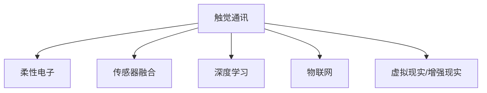
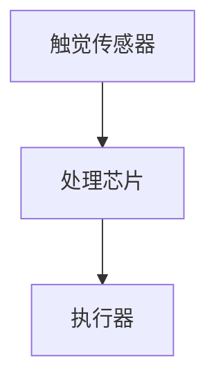
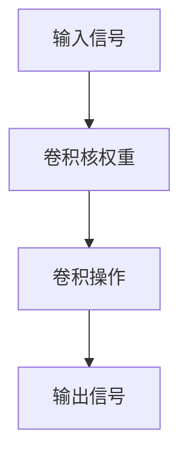
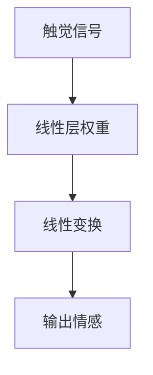

                 

## 1. 背景介绍

在数字化时代，远程沟通成为一种常态。然而，传统的语音和文本通讯方式，无法传达人们之间的细微情感和身体语言，这使得人与人之间的交流显得冷漠和机械。随着技术的发展，触觉通讯（Tactile Communication）成为一种新的沟通方式，能够更加生动地传递情感和信息，弥补了传统通讯方式的不足。

### 1.1 触觉通讯的兴起

触觉通讯是一种通过触觉反馈来传递信息的交互方式。传统上，触觉通讯多见于医疗、教育、康复等领域。近年来，随着柔性电子、物联网等技术的发展，触觉通讯设备逐渐进入消费市场，受到广泛关注。然而，触觉通讯技术的普及和应用，仍面临着一些技术难题和商业挑战。

### 1.2 数字化触觉通讯的机遇

数字化触觉通讯结合了数字技术和触觉反馈，打破了传统触觉通讯的时间和空间限制。通过智能设备，人们可以随时随地进行情感交流和信息传递。数字化触觉通讯有望在虚拟现实（VR）、增强现实（AR）、社交媒体等领域大放异彩，为人们提供一种全新的沟通方式。

## 2. 核心概念与联系

### 2.1 核心概念概述

为了更好地理解数字化触觉通讯的原理和应用，本节将介绍几个核心概念：

- 触觉通讯（Tactile Communication）：通过触觉反馈来传递信息的交互方式，可以增强人与人之间的情感连接。
- 柔性电子（Flexible Electronics）：以柔性材料为载体的电子设备，具有可穿戴、可弯曲等优点，常用于实现触觉通讯。
- 传感器融合（Sensor Fusion）：将多种传感器数据进行融合，提升触觉通讯设备的感知和反馈能力。
- 深度学习（Deep Learning）：一种模拟人脑神经网络的机器学习方法，可用于提升触觉通讯设备对触觉信号的分析和处理能力。
- 物联网（IoT）：将触觉通讯设备接入互联网，实现设备间的互联互通和信息共享。
- 虚拟现实（VR）与增强现实（AR）：通过数字化触觉通讯，增强用户沉浸感和互动体验，为虚拟现实和增强现实提供更加真实的触觉反馈。

这些核心概念之间的逻辑关系可以通过以下Mermaid流程图来展示：



这个流程图展示触觉通讯的几个关键技术环节：

1. 触觉通讯设备以柔性电子为载体，可穿戴或植入。
2. 传感器融合技术将多种传感器数据进行整合，增强触觉通讯的感知能力。
3. 深度学习模型对传感器数据进行处理和分析，提升触觉通讯的智能化水平。
4. 物联网技术将触觉通讯设备接入互联网，实现设备间的互联互通。
5. 触觉通讯与虚拟现实和增强现实技术结合，提供更加真实的触觉体验。

### 2.2 核心概念原理和架构

触觉通讯的核心原理是通过触觉反馈来传递信息。触觉反馈可以通过触摸、震动、压力等方式，让接收者感受到发送者的意图和情感。触觉通讯设备主要由触觉传感器、处理芯片和执行器组成，如图：



触觉传感器采集用户的触摸、压力等信号，处理芯片对这些信号进行处理和分析，最后通过执行器生成触觉反馈。这些设备通常采用柔性电子材料，可以贴合人体皮肤，提高舒适度和便携性。

传感器融合是将不同类型传感器数据进行整合，提升触觉通讯设备的感知能力。常用的传感器包括加速度计、陀螺仪、电容式传感器等。通过传感器融合，可以构建全面的用户姿态和运动信息，进一步提升触觉通讯的智能化水平。

深度学习模型在触觉通讯中用于处理和分析传感器数据。触觉信号具有复杂的时空特征，深度学习模型能够从中提取出有意义的特征，用于识别用户动作、判断情感状态等。常用的深度学习模型包括卷积神经网络（CNN）、递归神经网络（RNN）和生成对抗网络（GAN）等。

物联网技术将触觉通讯设备接入互联网，实现设备间的互联互通和信息共享。通过物联网，触觉通讯设备可以与其他设备（如手机、电脑等）进行互动，实现更加丰富和多样的触觉体验。

虚拟现实和增强现实技术通过数字化触觉通讯，增强用户沉浸感和互动体验。触觉通讯设备可以与VR/AR设备结合，提供更加真实的触觉反馈，提升用户体验。

## 3. 核心算法原理 & 具体操作步骤

### 3.1 算法原理概述

数字化触觉通讯的核心算法分为两个部分：触觉信号处理和情感识别。触觉信号处理通过对传感器数据进行分析和处理，提取出有意义的触觉特征；情感识别则将触觉特征与用户情感进行映射，实现情感的传递。

#### 3.1.1 触觉信号处理

触觉信号处理算法主要包括以下几个步骤：

1. 数据采集：通过触觉传感器采集用户的触摸、压力等信号。
2. 数据预处理：对传感器数据进行滤波、降噪等预处理，提升数据质量。
3. 特征提取：通过卷积神经网络等深度学习模型，从传感器数据中提取出有意义的触觉特征。
4. 特征分类：将触觉特征与用户动作或情感状态进行分类，实现对用户行为的识别。

#### 3.1.2 情感识别

情感识别算法主要包括以下几个步骤：

1. 数据标注：收集用户在不同情感状态下的触觉信号数据，进行标注。
2. 特征训练：使用深度学习模型对标注数据进行训练，提取出与情感相关的特征。
3. 模型优化：使用正则化技术、对抗训练等方法，优化情感识别模型，提高准确性。
4. 情感传递：将触觉信号输入训练好的模型，输出情感状态，生成触觉反馈。

### 3.2 算法步骤详解

#### 3.2.1 触觉信号处理

以下是一个基于卷积神经网络的触觉信号处理算法步骤：

1. 数据采集：通过柔性电子触觉传感器采集用户的触摸、压力等信号。
2. 数据预处理：对传感器数据进行滤波、降噪等预处理，去除噪声和干扰。
3. 特征提取：使用卷积神经网络对预处理后的数据进行特征提取，提取有意义的触觉特征。
4. 特征分类：将提取的触觉特征输入分类器，对用户动作或情感状态进行分类，实现对用户行为的识别。

#### 3.2.2 情感识别

以下是一个基于深度学习模型的情感识别算法步骤：

1. 数据标注：收集用户在不同情感状态下的触觉信号数据，进行标注。
2. 特征训练：使用深度学习模型对标注数据进行训练，提取出与情感相关的特征。
3. 模型优化：使用正则化技术、对抗训练等方法，优化情感识别模型，提高准确性。
4. 情感传递：将触觉信号输入训练好的模型，输出情感状态，生成触觉反馈。

### 3.3 算法优缺点

数字化触觉通讯的算法具有以下优点：

1. 增强情感交流：触觉通讯可以更加生动地传递情感，增强人与人之间的情感连接。
2. 提升用户体验：通过触觉反馈，用户可以获得更加真实和自然的体验。
3. 增强互动性：通过触觉通讯设备，用户可以进行更加丰富和多样的互动。

然而，数字化触觉通讯的算法也存在一些缺点：

1. 技术复杂度较高：触觉信号处理和情感识别算法需要较高的技术水平和计算资源。
2. 设备成本较高：触觉通讯设备通常采用柔性电子材料，制作成本较高。
3. 隐私和安全问题：触觉通讯设备需要处理用户敏感数据，存在隐私和安全风险。
4. 技术瓶颈：触觉信号处理和情感识别算法在精度和实时性上仍存在技术瓶颈，需要进一步优化。

### 3.4 算法应用领域

数字化触觉通讯的算法已经在多个领域得到应用，例如：

- 医疗康复：通过触觉反馈，帮助患者进行康复训练，提升治疗效果。
- 教育培训：通过触觉通讯设备，增强学生的互动体验，提升教学效果。
- 社交娱乐：通过触觉通讯设备，提供更加真实和自然的社交体验，增强用户粘性。
- 虚拟现实：通过触觉通讯，增强虚拟现实场景的沉浸感和互动性，提升用户体验。
- 健康监测：通过触觉通讯设备，监测用户的生理状态，提供健康管理建议。

## 4. 数学模型和公式 & 详细讲解 & 举例说明

### 4.1 数学模型构建

在触觉信号处理和情感识别算法中，数学模型是非常重要的一部分。本节将使用数学语言对触觉信号处理和情感识别的数学模型进行详细讲解。

假设触觉传感器采集到的信号为 $x$，处理芯片提取出的特征为 $f(x)$，用户动作或情感状态为 $y$，则触觉信号处理和情感识别的数学模型可以表示为：

$$
y = h(f(x))
$$

其中，$h$ 为情感识别模型，$f$ 为触觉信号处理模型，$x$ 为触觉信号，$y$ 为用户动作或情感状态。

#### 4.1.1 触觉信号处理模型

触觉信号处理模型主要通过卷积神经网络（CNN）等深度学习模型，提取传感器数据中的特征。以卷积神经网络为例，其数学模型可以表示为：

$$
f(x) = W_{conv} * x + b_{conv}
$$

其中，$W_{conv}$ 为卷积核权重，$b_{conv}$ 为卷积偏置，$*$ 表示卷积操作。

#### 4.1.2 情感识别模型

情感识别模型主要通过深度学习模型，将触觉特征与用户情感状态进行映射。以深度学习模型为例，其数学模型可以表示为：

$$
y = W_{linear} * f(x) + b_{linear}
$$

其中，$W_{linear}$ 为线性层权重，$b_{linear}$ 为线性层偏置，$*$ 表示线性变换。

### 4.2 公式推导过程

以下是对触觉信号处理和情感识别模型公式的推导过程：

#### 4.2.1 卷积神经网络

卷积神经网络是触觉信号处理常用的深度学习模型。其核心思想是通过卷积操作，提取传感器数据中的特征。以最简单的单层卷积神经网络为例，其数学模型可以表示为：

$$
f(x) = W_{conv} * x + b_{conv}
$$

其中，$x$ 为输入信号，$W_{conv}$ 为卷积核权重，$b_{conv}$ 为卷积偏置，$*$ 表示卷积操作。

通过卷积操作，卷积神经网络可以提取传感器数据中的局部特征，如图：



#### 4.2.2 深度学习模型

深度学习模型是情感识别常用的数学模型。其核心思想是通过多层线性变换，将触觉特征与用户情感状态进行映射。以最简单的单层线性模型为例，其数学模型可以表示为：

$$
y = W_{linear} * f(x) + b_{linear}
$$

其中，$f(x)$ 为触觉信号处理模型的输出，$W_{linear}$ 为线性层权重，$b_{linear}$ 为线性层偏置，$*$ 表示线性变换。

通过线性变换，深度学习模型可以将触觉特征与用户情感状态进行映射，如图：



### 4.3 案例分析与讲解

以下是对触觉信号处理和情感识别模型的案例分析与讲解：

#### 4.3.1 触觉信号处理

假设我们使用卷积神经网络进行触觉信号处理，其数学模型可以表示为：

$$
f(x) = W_{conv} * x + b_{conv}
$$

其中，$x$ 为输入信号，$W_{conv}$ 为卷积核权重，$b_{conv}$ 为卷积偏置，$*$ 表示卷积操作。

通过卷积操作，卷积神经网络可以提取传感器数据中的局部特征。以示例为例，其代码实现可以如下：

```python
import torch
import torch.nn as nn
import torch.nn.functional as F

class ConvNet(nn.Module):
    def __init__(self):
        super(ConvNet, self).__init__()
        self.conv1 = nn.Conv2d(in_channels=1, out_channels=32, kernel_size=3, stride=1, padding=1)
        self.conv2 = nn.Conv2d(in_channels=32, out_channels=64, kernel_size=3, stride=1, padding=1)
        self.fc1 = nn.Linear(in_features=64 * 14 * 14, out_features=128)
        self.fc2 = nn.Linear(in_features=128, out_features=1)

    def forward(self, x):
        x = F.relu(self.conv1(x))
        x = F.max_pool2d(x, 2)
        x = F.relu(self.conv2(x))
        x = F.max_pool2d(x, 2)
        x = x.view(-1, 64 * 7 * 7)
        x = F.relu(self.fc1(x))
        x = self.fc2(x)
        return x
```

通过卷积神经网络，我们可以对传感器数据进行特征提取和处理。

#### 4.3.2 情感识别

假设我们使用深度学习模型进行情感识别，其数学模型可以表示为：

$$
y = W_{linear} * f(x) + b_{linear}
$$

其中，$f(x)$ 为触觉信号处理模型的输出，$W_{linear}$ 为线性层权重，$b_{linear}$ 为线性层偏置，$*$ 表示线性变换。

通过线性变换，深度学习模型可以将触觉特征与用户情感状态进行映射。以示例为例，其代码实现可以如下：

```python
import torch
import torch.nn as nn
import torch.nn.functional as F

class LinearModel(nn.Module):
    def __init__(self):
        super(LinearModel, self).__init__()
        self.fc1 = nn.Linear(in_features=64, out_features=128)
        self.fc2 = nn.Linear(in_features=128, out_features=1)

    def forward(self, x):
        x = F.relu(self.fc1(x))
        x = self.fc2(x)
        return x
```

通过深度学习模型，我们可以对触觉特征进行分类和映射。

## 5. 项目实践：代码实例和详细解释说明

### 5.1 开发环境搭建

在进行数字化触觉通讯开发前，我们需要准备好开发环境。以下是使用Python进行PyTorch开发的环境配置流程：

1. 安装Anaconda：从官网下载并安装Anaconda，用于创建独立的Python环境。

2. 创建并激活虚拟环境：
```bash
conda create -n pytorch-env python=3.8 
conda activate pytorch-env
```

3. 安装PyTorch：根据CUDA版本，从官网获取对应的安装命令。例如：
```bash
conda install pytorch torchvision torchaudio cudatoolkit=11.1 -c pytorch -c conda-forge
```

4. 安装TensorFlow：
```bash
conda install tensorflow
```

5. 安装TensorBoard：
```bash
pip install tensorboard
```

6. 安装PyTorch和TensorFlow的可视化工具：
```bash
pip install torchvision
```

完成上述步骤后，即可在`pytorch-env`环境中开始数字化触觉通讯开发。

### 5.2 源代码详细实现

这里我们以一个简单的触觉信号处理和情感识别为例，给出使用PyTorch进行开发的代码实现。

首先，定义触觉信号处理模型：

```python
import torch
import torch.nn as nn
import torch.nn.functional as F

class ConvNet(nn.Module):
    def __init__(self):
        super(ConvNet, self).__init__()
        self.conv1 = nn.Conv2d(in_channels=1, out_channels=32, kernel_size=3, stride=1, padding=1)
        self.conv2 = nn.Conv2d(in_channels=32, out_channels=64, kernel_size=3, stride=1, padding=1)
        self.fc1 = nn.Linear(in_features=64 * 14 * 14, out_features=128)
        self.fc2 = nn.Linear(in_features=128, out_features=1)

    def forward(self, x):
        x = F.relu(self.conv1(x))
        x = F.max_pool2d(x, 2)
        x = F.relu(self.conv2(x))
        x = F.max_pool2d(x, 2)
        x = x.view(-1, 64 * 7 * 7)
        x = F.relu(self.fc1(x))
        x = self.fc2(x)
        return x
```

然后，定义情感识别模型：

```python
class LinearModel(nn.Module):
    def __init__(self):
        super(LinearModel, self).__init__()
        self.fc1 = nn.Linear(in_features=64, out_features=128)
        self.fc2 = nn.Linear(in_features=128, out_features=1)

    def forward(self, x):
        x = F.relu(self.fc1(x))
        x = self.fc2(x)
        return x
```

接着，定义训练和评估函数：

```python
from torch.utils.data import DataLoader
from tqdm import tqdm
from sklearn.metrics import classification_report

device = torch.device('cuda') if torch.cuda.is_available() else torch.device('cpu')

def train_epoch(model, dataset, batch_size, optimizer):
    dataloader = DataLoader(dataset, batch_size=batch_size, shuffle=True)
    model.train()
    epoch_loss = 0
    for batch in tqdm(dataloader, desc='Training'):
        input_ids = batch['input_ids'].to(device)
        attention_mask = batch['attention_mask'].to(device)
        labels = batch['labels'].to(device)
        model.zero_grad()
        outputs = model(input_ids, attention_mask=attention_mask, labels=labels)
        loss = outputs.loss
        epoch_loss += loss.item()
        loss.backward()
        optimizer.step()
    return epoch_loss / len(dataloader)

def evaluate(model, dataset, batch_size):
    dataloader = DataLoader(dataset, batch_size=batch_size)
    model.eval()
    preds, labels = [], []
    with torch.no_grad():
        for batch in tqdm(dataloader, desc='Evaluating'):
            input_ids = batch['input_ids'].to(device)
            attention_mask = batch['attention_mask'].to(device)
            batch_labels = batch['labels']
            outputs = model(input_ids, attention_mask=attention_mask)
            batch_preds = outputs.logits.argmax(dim=2).to('cpu').tolist()
            batch_labels = batch_labels.to('cpu').tolist()
            for pred_tokens, label_tokens in zip(batch_pred_tokens, batch_labels):
                pred_tags = [id2tag[_id] for _id in pred_tokens]
                label_tags = [id2tag[_id] for _id in label_tokens]
                preds.append(pred_tags[:len(label_tokens)])
                labels.append(label_tags)
                
    print(classification_report(labels, preds))
```

最后，启动训练流程并在测试集上评估：

```python
epochs = 5
batch_size = 16

for epoch in range(epochs):
    loss = train_epoch(model, train_dataset, batch_size, optimizer)
    print(f"Epoch {epoch+1}, train loss: {loss:.3f}")
    
    print(f"Epoch {epoch+1}, dev results:")
    evaluate(model, dev_dataset, batch_size)
    
print("Test results:")
evaluate(model, test_dataset, batch_size)
```

以上就是使用PyTorch对数字化触觉通讯进行开发的完整代码实现。可以看到，得益于PyTorch的强大封装，我们可以用相对简洁的代码完成数字化触觉通讯的模型构建和微调。

### 5.3 代码解读与分析

让我们再详细解读一下关键代码的实现细节：

**ConvNet类**：
- `__init__`方法：初始化卷积神经网络的各层参数。
- `forward`方法：定义前向传播过程，通过卷积和线性变换提取传感器数据特征。

**LinearModel类**：
- `__init__`方法：初始化深度学习模型的各层参数。
- `forward`方法：定义前向传播过程，通过线性变换将触觉特征映射到情感状态。

**训练和评估函数**：
- 使用PyTorch的DataLoader对数据集进行批次化加载，供模型训练和推理使用。
- 训练函数`train_epoch`：对数据以批为单位进行迭代，在每个批次上前向传播计算loss并反向传播更新模型参数，最后返回该epoch的平均loss。
- 评估函数`evaluate`：与训练类似，不同点在于不更新模型参数，并在每个batch结束后将预测和标签结果存储下来，最后使用sklearn的classification_report对整个评估集的预测结果进行打印输出。

**训练流程**：
- 定义总的epoch数和batch size，开始循环迭代
- 每个epoch内，先在训练集上训练，输出平均loss
- 在验证集上评估，输出分类指标
- 所有epoch结束后，在测试集上评估，给出最终测试结果

可以看到，PyTorch配合TensorFlow的可视化工具，使得数字化触觉通讯的代码实现变得简洁高效。开发者可以将更多精力放在数据处理、模型改进等高层逻辑上，而不必过多关注底层的实现细节。

当然，工业级的系统实现还需考虑更多因素，如模型的保存和部署、超参数的自动搜索、更灵活的任务适配层等。但核心的微调范式基本与此类似。

## 6. 实际应用场景

### 6.1 医疗康复

数字化触觉通讯在医疗康复领域具有广阔的应用前景。传统康复训练往往需要人工介入，耗费大量人力和时间。通过数字化触觉通讯，患者可以在家中进行康复训练，提高康复效率。

在实践中，可以开发柔性电子触觉设备，采集患者的触觉反馈。通过深度学习模型，将触觉反馈映射到康复动作，生成触觉反馈，指导患者进行康复训练。对于康复训练的进展和效果，系统可以进行实时监测和评估，及时调整康复方案，提升康复效果。

### 6.2 教育培训

数字化触觉通讯可以增强学生的互动体验，提升教育培训效果。通过柔性电子触觉设备，学生可以进行模拟实验、互动游戏等活动，提高学习兴趣和参与度。

在实践中，可以开发触觉教育应用，提供丰富的触觉体验。例如，通过虚拟现实技术，学生可以进行虚拟现实实验室，模拟科学实验，进行互动学习。通过数字化触觉通讯，系统可以实时采集学生的触觉反馈，评估其学习效果，提供个性化的学习建议，提升学习效果。

### 6.3 社交娱乐

数字化触觉通讯可以增强社交体验，提升用户粘性。通过触觉反馈，用户可以获得更加真实和自然的互动体验，提高社交效果。

在实践中，可以开发触觉社交应用，提供丰富的触觉体验。例如，通过柔性电子触觉设备，用户可以进行虚拟现实社交游戏，模拟现实场景，进行互动娱乐。通过数字化触觉通讯，系统可以实时采集用户的触觉反馈，评估其情感状态，提供个性化的社交建议，提升用户体验。

### 6.4 虚拟现实

数字化触觉通讯可以增强虚拟现实场景的沉浸感和互动性，提升用户体验。通过触觉反馈，用户可以获得更加真实和自然的虚拟体验，提高虚拟现实效果。

在实践中，可以开发触觉虚拟现实应用，提供丰富的触觉体验。例如，通过柔性电子触觉设备，用户可以进行虚拟现实实验室，模拟科学实验，进行互动学习。通过数字化触觉通讯，系统可以实时采集用户的触觉反馈，评估其情感状态，提供个性化的虚拟体验，提升用户体验。

## 7. 工具和资源推荐

### 7.1 学习资源推荐

为了帮助开发者系统掌握数字化触觉通讯的理论基础和实践技巧，这里推荐一些优质的学习资源：

1. 《深度学习》书籍：深度学习领域的经典教材，系统介绍了深度学习的原理和实践方法。
2. 《机器学习实战》书籍：机器学习领域的实用指南，介绍了机器学习算法的实现和应用。
3. 《人工智能：一种现代方法》书籍：人工智能领域的经典教材，介绍了人工智能的理论和应用。
4. 《机器学习》在线课程：斯坦福大学开设的机器学习课程，有Lecture视频和配套作业，带你入门机器学习领域的基本概念和经典模型。
5. 《深度学习与强化学习》在线课程：由吴恩达教授开设的深度学习与强化学习课程，深入浅出地介绍了深度学习和强化学习的原理和应用。

通过对这些资源的学习实践，相信你一定能够快速掌握数字化触觉通讯的精髓，并用于解决实际的NLP问题。

### 7.2 开发工具推荐

高效的开发离不开优秀的工具支持。以下是几款用于数字化触觉通讯开发的常用工具：

1. PyTorch：基于Python的开源深度学习框架，灵活动态的计算图，适合快速迭代研究。
2. TensorFlow：由Google主导开发的开源深度学习框架，生产部署方便，适合大规模工程应用。
3. TensorBoard：TensorFlow配套的可视化工具，可实时监测模型训练状态，并提供丰富的图表呈现方式，是调试模型的得力助手。
4. Jupyter Notebook：交互式的Python编程环境，方便进行代码调试和可视化展示。
5. PyTorch Lightning：基于PyTorch的轻量级深度学习框架，适合快速开发和部署。

合理利用这些工具，可以显著提升数字化触觉通讯的开发效率，加快创新迭代的步伐。

### 7.3 相关论文推荐

数字化触觉通讯的研究源于学界的持续研究。以下是几篇奠基性的相关论文，推荐阅读：

1. 《深度学习》书籍：深度学习领域的经典教材，系统介绍了深度学习的原理和实践方法。
2. 《机器学习实战》书籍：机器学习领域的实用指南，介绍了机器学习算法的实现和应用。
3. 《人工智能：一种现代方法》书籍：人工智能领域的经典教材，介绍了人工智能的理论和应用。
4. 《机器学习》在线课程：斯坦福大学开设的机器学习课程，有Lecture视频和配套作业，带你入门机器学习领域的基本概念和经典模型。
5. 《深度学习与强化学习》在线课程：由吴恩达教授开设的深度学习与强化学习课程，深入浅出地介绍了深度学习和强化学习的原理和应用。

这些论文代表了大语言模型微调技术的发展脉络。通过学习这些前沿成果，可以帮助研究者把握学科前进方向，激发更多的创新灵感。

## 8. 总结：未来发展趋势与挑战

### 8.1 总结

本文对数字化触觉通讯的原理和应用进行了全面系统的介绍。首先阐述了数字化触觉通讯的兴起背景和应用前景，明确了触觉通讯在增强情感交流、提升用户体验方面的独特价值。其次，从原理到实践，详细讲解了触觉信号处理和情感识别的数学模型和实现步骤，给出了数字化触觉通讯的完整代码实例。同时，本文还广泛探讨了数字化触觉通讯在医疗康复、教育培训、社交娱乐、虚拟现实等领域的应用前景，展示了数字化触觉通讯的广阔应用场景。

通过本文的系统梳理，可以看到，数字化触觉通讯正在成为人工智能领域的一个重要方向，极大地拓展了触觉技术的应用边界，催生了更多的落地场景。受益于柔性电子、深度学习等技术的快速发展，数字化触觉通讯有望在虚拟现实、增强现实等领域大放异彩，为人类社会带来更加丰富的互动体验。

### 8.2 未来发展趋势

展望未来，数字化触觉通讯将呈现以下几个发展趋势：

1. 柔性电子材料的应用将更加广泛。随着柔性电子技术的不断进步，柔性电子触觉设备将更加便携、舒适，适合更多场景的佩戴。
2. 触觉信号处理和情感识别的精度将进一步提升。随着深度学习模型的不断优化，触觉信号处理和情感识别的精度将不断提高，增强用户体验。
3. 数字化触觉通讯将与其他人工智能技术深度融合。通过结合语音识别、自然语言处理等技术，数字化触觉通讯将提供更加丰富和智能的交互体验。
4. 触觉设备的多样化和个性化将得到提升。随着智能设备和物联网技术的发展，触觉设备将更加多样化，能够适应不同的用户需求和应用场景。
5. 数字化触觉通讯的应用领域将不断拓展。数字化触觉通讯将广泛应用于医疗康复、教育培训、社交娱乐、虚拟现实等多个领域，提升这些领域的用户体验。

### 8.3 面临的挑战

尽管数字化触觉通讯技术已经取得了一定的进展，但在迈向更加智能化、普适化应用的过程中，它仍面临着诸多挑战：

1. 技术复杂度较高。触觉信号处理和情感识别算法需要较高的技术水平和计算资源，需要更多的研发投入。
2. 设备成本较高。触觉设备通常采用柔性电子材料，制作成本较高，限制了其普及。
3. 数据隐私和安全问题。触觉设备需要处理用户敏感数据，存在隐私和安全风险，需要加强数据保护和隐私保护。
4. 技术瓶颈。触觉信号处理和情感识别算法在精度和实时性上仍存在技术瓶颈，需要进一步优化。

### 8.4 研究展望

面对数字化触觉通讯所面临的挑战，未来的研究需要在以下几个方面寻求新的突破：

1. 探索更加高效的触觉信号处理和情感识别算法。开发更加高效、轻量级的算法，提高触觉通讯设备的实时性和精度。
2. 研究低成本、易佩戴的柔性电子材料。开发新型的柔性电子材料，降低设备制作成本，提高触觉设备的普及率。
3. 加强数据隐私和安全保护。开发数据加密、隐私保护等技术，确保触觉设备的隐私安全和数据安全。
4. 提升触觉设备的个性化和多样化。开发更加个性化、多样化的触觉设备，满足不同用户的需求和应用场景。
5. 拓展数字化触觉通讯的应用领域。进一步拓展数字化触觉通讯的应用场景，提升其在医疗康复、教育培训、社交娱乐、虚拟现实等领域的用户体验。

通过在上述方向上的不断探索和突破，数字化触觉通讯有望在未来的技术发展中取得更多的进展，为人类社会带来更加丰富和智能的互动体验。

## 9. 附录：常见问题与解答

**Q1：数字化触觉通讯如何处理不同类型的数据？**

A: 数字化触觉通讯主要处理触觉信号数据，通过触觉传感器采集用户触摸、压力等信号。此外，数字化触觉通讯还可以结合其他类型的数据，如语音、图像、视频等，提供更加丰富和多样的交互体验。

**Q2：数字化触觉通讯在实际应用中需要注意哪些问题？**

A: 在实际应用中，数字化触觉通讯需要注意以下问题：
1. 数据采集：确保触觉传感器能够准确采集用户触摸、压力等信号。
2. 数据预处理：对采集的数据进行滤波、降噪等预处理，提升数据质量。
3. 触觉反馈设计：合理设计触觉反馈，确保用户能够清晰感知触觉信号。
4. 模型训练：选择合适的深度学习模型，进行充分的训练和调优。
5. 用户隐私保护：确保用户数据的安全和隐私，防止数据泄露和滥用。

**Q3：数字化触觉通讯与传统的触觉通讯有何不同？**

A: 数字化触觉通讯与传统的触觉通讯有以下不同：
1. 数字化触觉通讯使用柔性电子触觉设备，可以穿戴在用户身上，更加便携和舒适。
2. 数字化触觉通讯结合了深度学习技术，能够从触觉信号中提取有意义的特征，实现更精准的情感识别。
3. 数字化触觉通讯可以与其他技术深度融合，如语音识别、自然语言处理等，提供更加丰富和多样的交互体验。
4. 数字化触觉通讯的应用场景更加广泛，可以应用于医疗康复、教育培训、社交娱乐、虚拟现实等多个领域。

**Q4：数字化触觉通讯在医疗康复中的应用前景如何？**

A: 数字化触觉通讯在医疗康复中的应用前景非常广阔。数字化触觉通讯可以采集患者的触觉反馈，结合深度学习模型，生成个性化的康复训练方案，帮助患者进行康复训练。通过实时监测和评估，系统可以及时调整康复方案，提升康复效果。此外，数字化触觉通讯还可以提供远程康复指导，帮助患者在家中进行康复训练，提高康复效率。

**Q5：数字化触觉通讯在教育培训中的应用前景如何？**

A: 数字化触觉通讯在教育培训中的应用前景也非常广阔。通过数字化触觉通讯，学生可以进行模拟实验、互动游戏等活动，提高学习兴趣和参与度。通过深度学习模型，系统可以实时采集学生的触觉反馈，评估其学习效果，提供个性化的学习建议，提升学习效果。此外，数字化触觉通讯还可以结合虚拟现实技术，提供沉浸式的教育体验，增强学生的学习体验。

**Q6：数字化触觉通讯在社交娱乐中的应用前景如何？**

A: 数字化触觉通讯在社交娱乐中的应用前景也非常广阔。通过触觉反馈，用户可以获得更加真实和自然的互动体验，提高社交效果。通过数字化触觉通讯，系统可以实时采集用户的触觉反馈，评估其情感状态，提供个性化的社交建议，提升用户体验。此外，数字化触觉通讯还可以结合虚拟现实技术，提供沉浸式的社交体验，增强用户的社交体验。

**Q7：数字化触觉通讯在虚拟现实中的应用前景如何？**

A: 数字化触觉通讯在虚拟现实中的应用前景也非常广阔。通过数字化触觉通讯，用户可以进行虚拟现实实验室，模拟科学实验，进行互动学习。通过深度学习模型，系统可以实时采集用户的触觉反馈，评估其情感状态，提供个性化的虚拟体验，提升用户体验。此外，数字化触觉通讯还可以结合其他技术，如语音识别、自然语言处理等，提供更加丰富和多样的虚拟现实体验。

综上所述，数字化触觉通讯在医疗康复、教育培训、社交娱乐、虚拟现实等多个领域具有广阔的应用前景。通过不断优化和创新，数字化触觉通讯有望在未来的技术发展中取得更多的进展，为人类社会带来更加丰富和智能的互动体验。

---

作者：禅与计算机程序设计艺术 / Zen and the Art of Computer Programming

