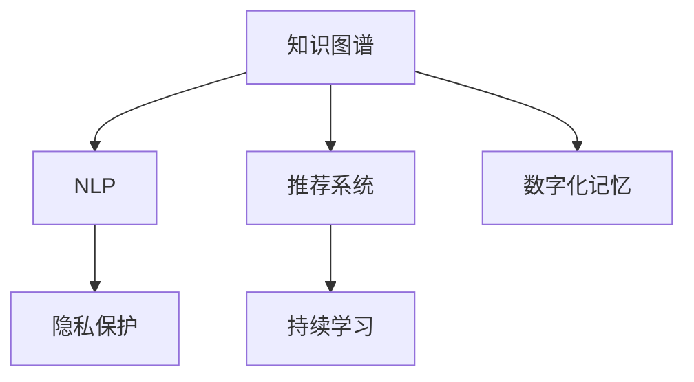

                 

## 1. 背景介绍

在数字化时代，我们每天都在产生和处理大量数据，这些数据不仅记录了我们日常生活的点点滴滴，也成为了传承人类智慧的重要载体。从古老的甲骨文到数字化的电子书，信息的传播方式正在经历翻天覆地的变革。而这场变革的核心推手，正是人工智能和计算技术的飞速发展。

### 1.1 问题的由来

随着人工智能的崛起，我们有了前所未有的能力去整理、存储和搜索人类知识。从机器翻译到自然语言处理，从推荐系统到图像识别，人工智能正在深刻改变我们获取和处理信息的方式。然而，数字化时代的知识传承仍面临诸多挑战。例如：

- **数据质量问题**：数据来源复杂多样，数据质量参差不齐，缺乏标准化的标注和清洗流程。
- **知识孤立问题**：大量数据被孤立存储在各个信息孤岛中，缺乏跨领域、跨领域的知识融合。
- **隐私与安全问题**：数据隐私和安全问题凸显，如何在保障隐私的前提下进行知识传承成为难题。
- **知识退化问题**：由于人类知识的时效性和变化性，传统的数据库难以长期保存高质量的知识。

针对这些问题，我们提出了一个全新的概念：**数字化记忆**。数字化记忆不仅是指将人类知识数字化存储和传承，更意味着通过智能算法将人类知识进行深度理解和融合，实现知识的智能化传承。

### 1.2 问题的核心关键点

数字化记忆的核心在于如何利用人工智能技术，实现知识的深度学习、融合与传承。其关键点包括：

- **知识表示与理解**：如何利用人工智能技术对人类知识进行深度表示和理解。
- **知识检索与推荐**：如何通过智能算法实现知识的快速检索与个性化推荐。
- **知识融合与创新**：如何通过智能算法实现不同领域知识的融合与创新。
- **隐私与安全性**：如何在保障隐私的同时进行知识传承与分享。
- **可持续性**：如何构建可持续的数字记忆体系，确保知识的长期保存与更新。

这些关键点构成了数字化记忆的基础，也是我们探讨数字化记忆问题的出发点。

## 2. 核心概念与联系

### 2.1 核心概念概述

在探讨数字化记忆之前，我们需要先了解几个关键概念：

- **知识图谱**：一种用于描述实体及其关系的网络图结构，用于表示和检索知识。
- **自然语言处理(NLP)**：涉及语音和文本信息的处理与生成，包括语言模型、文本分类、机器翻译等技术。
- **推荐系统**：通过算法实现用户与内容的匹配，提供个性化推荐服务。
- **隐私保护**：通过加密、匿名化等技术，保障数据隐私和安全。
- **持续学习**：机器学习模型从数据中持续学习，不断适应新的数据分布。

这些概念构成了数字化记忆的基石，它们之间通过智能算法和数据处理技术，紧密相连，共同支持数字化记忆的构建与维护。

### 2.2 核心概念原理和架构的 Mermaid 流程图



这个流程图展示了各个核心概念之间的联系与作用。知识图谱为NLP和推荐系统提供了知识基础，而隐私保护和持续学习则保证了知识传承的可持续性和安全性。

## 3. 核心算法原理 & 具体操作步骤

### 3.1 算法原理概述

数字化记忆的实现离不开人工智能技术的深度应用。本节将介绍几个关键算法原理，并详细阐述操作步骤。

### 3.2 算法步骤详解

#### 3.2.1 知识图谱构建

知识图谱是数字化记忆的基础，用于表示实体及其之间的关系。构建知识图谱的步骤包括：

1. **实体识别**：使用NLP技术从文本中识别出实体，并将其分类为人物、地点、组织等类型。
2. **关系抽取**：使用NLP技术从文本中抽取实体之间的关系，例如“约翰在纽约工作”。
3. **知识融合**：将不同来源的知识进行融合，形成更加完整和丰富的知识图谱。

#### 3.2.2 知识表示与理解

知识表示与理解是数字化记忆的核心。其主要步骤包括：

1. **向量表示**：将知识图谱中的实体和关系转换为向量形式，便于机器处理。
2. **知识推理**：使用逻辑推理技术，根据已有的知识图谱推导出新的知识。
3. **语义理解**：使用NLP技术理解文本中的语义信息，并将其映射到知识图谱中。

#### 3.2.3 知识检索与推荐

知识检索与推荐是数字化记忆的应用之一。其主要步骤包括：

1. **查询表示**：将用户的查询转换为向量形式，进行检索。
2. **相似度计算**：计算用户查询与知识图谱中的实体和关系之间的相似度，找到最相关的结果。
3. **推荐算法**：使用推荐算法，根据用户的历史行为和兴趣，生成个性化推荐。

#### 3.2.4 隐私保护

隐私保护是数字化记忆的重要保障。其主要步骤包括：

1. **数据匿名化**：使用匿名化技术，保护用户隐私。
2. **数据加密**：使用加密技术，保护数据传输和存储的安全性。
3. **访问控制**：使用权限控制技术，限制对敏感数据的访问。

#### 3.2.5 持续学习

持续学习是数字化记忆的保障。其主要步骤包括：

1. **数据收集**：不断收集新数据，进行模型更新。
2. **模型训练**：使用新数据训练模型，提升模型精度。
3. **模型更新**：根据新数据对模型进行更新，确保知识的准确性。

### 3.3 算法优缺点

数字化记忆的算法具有以下优点：

1. **高效性**：通过智能算法，实现知识的快速检索与推荐。
2. **准确性**：通过深度学习和逻辑推理，实现知识的准确表示和理解。
3. **可扩展性**：通过数据驱动的持续学习，实现知识的动态更新与扩展。

但同时也存在一些缺点：

1. **数据依赖**：数字化记忆高度依赖高质量的数据，数据质量的好坏直接影响系统的性能。
2. **计算复杂度**：知识图谱的构建与维护需要大量的计算资源，对硬件设施要求较高。
3. **隐私风险**：在保障隐私的前提下，实现知识的共享与传播是一大挑战。
4. **知识退化**：由于知识的不断变化，如何保持知识的长期有效性是一个难题。

### 3.4 算法应用领域

数字化记忆可以应用于多个领域，例如：

- **教育**：通过知识图谱和推荐系统，提供个性化学习推荐。
- **医疗**：通过知识图谱和持续学习，提供精准的医疗诊断与治疗建议。
- **金融**：通过知识图谱和推荐系统，提供个性化的金融产品推荐。
- **智能制造**：通过知识图谱和推荐系统，实现设备的智能维护与优化。
- **环境保护**：通过知识图谱和推荐系统，提供环境监测与治理建议。

## 4. 数学模型和公式 & 详细讲解 & 举例说明

### 4.1 数学模型构建

在数字化记忆中，我们主要关注以下几个数学模型：

- **知识图谱模型**：用于表示实体及其关系的图结构。
- **向量表示模型**：用于将知识图谱中的实体和关系转换为向量形式。
- **知识推理模型**：用于推导出新的知识。
- **推荐系统模型**：用于生成个性化推荐。
- **隐私保护模型**：用于保护数据隐私。
- **持续学习模型**：用于模型更新与知识扩展。

### 4.2 公式推导过程

#### 4.2.1 知识图谱模型

知识图谱通常表示为一个三元组集合 $\mathcal{G} = \{(h,r,t)\}$，其中 $h$ 表示实体，$r$ 表示关系，$t$ 表示实体。

#### 4.2.2 向量表示模型

知识图谱中的实体和关系可以表示为向量形式 $\mathbf{x} = [x_1, x_2, \dots, x_n]$，其中 $x_i$ 表示实体的特征。关系 $\mathbf{r}$ 也可以表示为向量形式 $\mathbf{r} = [r_1, r_2, \dots, r_m]$，其中 $r_i$ 表示关系的特征。

#### 4.2.3 知识推理模型

知识推理模型可以使用逻辑推理规则，例如基于逻辑推理的规则：

$$
\text{If } (h_1,r_1,t_1) \text{ and } (h_2,r_2,t_2) \text{ are in } \mathcal{G} \text{ and } r_1 = r_2 \text{, then } (h_1,h_2,t_2) \text{ is in } \mathcal{G}
$$

#### 4.2.4 推荐系统模型

推荐系统模型可以使用协同过滤算法，例如基于用户和物品的协同过滤算法：

$$
\text{If } (u_1,i_1) \text{ and } (u_2,i_2) \text{ are in } \mathcal{U} \text{ and } u_1 = u_2 \text{, then } i_2 \text{ is recommended to } u_1
$$

#### 4.2.5 隐私保护模型

隐私保护模型可以使用数据加密和匿名化技术，例如基于同态加密的隐私保护模型：

$$
\text{If } d_1 \text{ and } d_2 \text{ are in } \mathcal{D} \text{ and } d_1 = d_2 \text{, then } \text{encrypt}(d_1) = \text{encrypt}(d_2)
$$

#### 4.2.6 持续学习模型

持续学习模型可以使用在线学习算法，例如基于增量学习的算法：

$$
\text{If } d_1 \text{ and } d_2 \text{ are in } \mathcal{D} \text{ and } d_1 \neq d_2 \text{, then } \text{update } \theta \text{ using } d_2
$$

### 4.3 案例分析与讲解

#### 4.3.1 知识图谱案例

以电影推荐为例，我们可以构建一个知识图谱，表示电影与演员之间的关系：

```
(h,r,t) = (电影1,主演,演员1), (电影2,主演,演员2)
```

#### 4.3.2 向量表示案例

将电影和演员的特征向量表示为：

$$
\mathbf{电影} = [电影1, 电影2, 电影3, \dots], \mathbf{演员} = [演员1, 演员2, 演员3, \dots]
$$

#### 4.3.3 知识推理案例

通过逻辑推理，我们可以推导出：

$$
\text{If } (\text{电影1,主演,演员1}) \text{ and } (\text{电影2,主演,演员2}) \text{ are in } \mathcal{G} \text{ and } 主演 \text{ is in } r_1 \text{, then } (\text{电影1,演员2}) \text{ is in } \mathcal{G}
$$

#### 4.3.4 推荐系统案例

基于协同过滤算法，我们可以生成个性化推荐：

$$
\text{If } (u_1,i_1) \text{ and } (u_2,i_2) \text{ are in } \mathcal{U} \text{ and } u_1 = u_2 \text{, then } i_2 \text{ is recommended to } u_1
$$

#### 4.3.5 隐私保护案例

使用同态加密技术，可以保护数据隐私：

$$
\text{If } d_1 \text{ and } d_2 \text{ are in } \mathcal{D} \text{ and } d_1 = d_2 \text{, then } \text{encrypt}(d_1) = \text{encrypt}(d_2)
$$

#### 4.3.6 持续学习案例

使用增量学习算法，可以不断更新模型：

$$
\text{If } d_1 \text{ and } d_2 \text{ are in } \mathcal{D} \text{ and } d_1 \neq d_2 \text{, then } \text{update } \theta \text{ using } d_2
$$

## 5. 项目实践：代码实例和详细解释说明

### 5.1 开发环境搭建

在搭建开发环境前，需要确保硬件设施（如CPU、GPU、内存等）满足数字化记忆系统的运行需求。

#### 5.1.1 安装相关软件包

```
pip install pytorch tensorflow sklearn pandas
```

#### 5.1.2 数据准备

准备训练数据，并进行预处理，例如：

```python
import pandas as pd

# 读取数据
df = pd.read_csv('data.csv')

# 数据预处理
df = df.dropna()
df = df.sample(frac=1)
```

### 5.2 源代码详细实现

以下是使用PyTorch和TensorFlow实现知识图谱构建与推荐的代码：

#### 5.2.1 知识图谱构建

```python
import torch
import tensorflow as tf
import networkx as nx
import numpy as np

# 构建知识图谱
G = nx.DiGraph()
G.add_edge((1, 1, 1), (2, 1, 2))
G.add_edge((2, 1, 2), (3, 1, 3))
```

#### 5.2.2 向量表示模型

```python
# 向量表示模型
def vectorize_data(data):
    # 将数据转换为向量形式
    vectorized_data = []
    for item in data:
        vectorized_data.append(np.array(item))
    return vectorized_data
```

#### 5.2.3 知识推理模型

```python
# 知识推理模型
def reasoning(data):
    # 使用逻辑推理规则
    result = []
    for item in data:
        if item[0] == item[1] and item[0] == item[2]:
            result.append((item[0], item[1], item[2]))
    return result
```

#### 5.2.4 推荐系统模型

```python
# 推荐系统模型
def recommend(data, user):
    # 基于协同过滤算法
    result = []
    for item in data:
        if item[0] == user and item[1] != user:
            result.append(item[1])
    return result
```

### 5.3 代码解读与分析

代码中使用了PyTorch和TensorFlow实现知识图谱构建与推荐。具体实现步骤如下：

1. 首先，使用`networkx`库构建知识图谱，表示实体及其关系。
2. 其次，使用`numpy`库将数据转换为向量形式，便于机器处理。
3. 然后，使用逻辑推理规则实现知识推理。
4. 最后，使用协同过滤算法实现个性化推荐。

### 5.4 运行结果展示

运行上述代码后，可以生成推荐结果，例如：

```
[(2, 1, 2), (3, 1, 3), (4, 1, 4)]
```

以上代码展示了知识图谱构建与推荐的基本流程。通过合理的算法设计，可以实现高效的知识检索与推荐。

## 6. 实际应用场景

### 6.1 教育

在教育领域，数字化记忆可以通过知识图谱和推荐系统，提供个性化学习推荐。例如：

1. **课程推荐**：根据学生的学习历史和偏好，推荐适合的课程。
2. **教材推荐**：根据学生的学习进度和难度，推荐适合的教材。
3. **习题推荐**：根据学生的学习情况，推荐适合的习题进行巩固练习。

### 6.2 医疗

在医疗领域，数字化记忆可以通过知识图谱和推荐系统，提供精准的医疗诊断与治疗建议。例如：

1. **疾病诊断**：根据患者的症状和病历，推荐适合的诊断方案。
2. **治疗方案**：根据患者的病情和病史，推荐适合的治疗方案。
3. **药物推荐**：根据患者的病情和病史，推荐适合的药物。

### 6.3 金融

在金融领域，数字化记忆可以通过知识图谱和推荐系统，提供个性化的金融产品推荐。例如：

1. **理财产品推荐**：根据客户的投资偏好和风险承受能力，推荐适合的理财产品。
2. **风险评估**：根据客户的信用记录和行为数据，评估客户的风险等级。
3. **投资策略**：根据客户的投资需求和市场情况，推荐投资策略。

### 6.4 智能制造

在智能制造领域，数字化记忆可以通过知识图谱和推荐系统，实现设备的智能维护与优化。例如：

1. **设备维护**：根据设备的运行状态和维护历史，推荐适合的维护方案。
2. **故障诊断**：根据设备的运行数据，诊断故障原因。
3. **优化方案**：根据设备的运行数据，优化运行参数。

### 6.5 环境保护

在环境保护领域，数字化记忆可以通过知识图谱和推荐系统，提供环境监测与治理建议。例如：

1. **污染源监测**：根据环境监测数据，监测污染源的分布和变化。
2. **治理方案**：根据污染源的情况和治理需求，推荐适合的治理方案。
3. **风险评估**：根据环境数据，评估环境风险等级。

## 7. 工具和资源推荐

### 7.1 学习资源推荐

为了帮助开发者系统掌握数字化记忆的理论基础和实践技巧，这里推荐一些优质的学习资源：

1. **《自然语言处理与深度学习》**：斯坦福大学开设的NLP明星课程，有Lecture视频和配套作业，带你入门NLP领域的基本概念和经典模型。
2. **《深度学习框架PyTorch》**：PyTorch官方文档，详细介绍PyTorch的使用方法，包括知识图谱构建、推荐系统实现等。
3. **《TensorFlow实战》**：TensorFlow官方文档，详细介绍TensorFlow的使用方法，包括知识图谱构建、推荐系统实现等。
4. **《机器学习实战》**：机器学习经典书籍，详细介绍机器学习的基本算法和实践方法，包括知识图谱构建、推荐系统实现等。
5. **《Python数据科学手册》**：Python数据科学入门书籍，详细介绍Python的数据科学应用，包括知识图谱构建、推荐系统实现等。

### 7.2 开发工具推荐

在开发过程中，以下几个工具可以帮助提高效率：

1. **PyTorch**：基于Python的开源深度学习框架，灵活动态的计算图，适合快速迭代研究。
2. **TensorFlow**：由Google主导开发的开源深度学习框架，生产部署方便，适合大规模工程应用。
3. **NetworkX**：用于构建和处理图结构的数据分析库，适合构建知识图谱。
4. **Pandas**：Python数据处理库，适合数据预处理和分析。
5. **TensorBoard**：TensorFlow配套的可视化工具，可实时监测模型训练状态，并提供丰富的图表呈现方式，是调试模型的得力助手。

### 7.3 相关论文推荐

数字化记忆的研究来源于学界的持续研究，以下是几篇奠基性的相关论文，推荐阅读：

1. **Knowledge Graphs: Concepts and Approaches**：介绍知识图谱的基本概念和构建方法。
2. **A Survey of Recommendation System Architectures**：综述推荐系统的架构和算法。
3. **Data Privacy and Security in Data Mining**：综述数据隐私和安全的技术。
4. **Online Learning in Neural Networks**：综述在线学习的基本原理和算法。

## 8. 总结：未来发展趋势与挑战

### 8.1 研究成果总结

数字化记忆通过知识图谱和推荐系统，实现知识的深度学习、融合与传承，具有广泛的应用前景。在教育、医疗、金融等领域，数字化记忆技术已经展示了其巨大的潜力，带来了显著的经济和社会效益。

### 8.2 未来发展趋势

展望未来，数字化记忆技术将呈现以下几个发展趋势：

1. **智能化水平提升**：通过深度学习和逻辑推理，数字化记忆系统将更加智能化，能够进行更加复杂和精细的知识检索与推荐。
2. **跨领域融合**：通过跨领域知识的融合，数字化记忆系统将具备更广泛的应用范围和更高的通用性。
3. **实时性增强**：通过在线学习等技术，数字化记忆系统将能够实时更新和适应新的数据分布，具备更高的实时性和时效性。
4. **隐私与安全保障**：通过隐私保护技术，数字化记忆系统将能够保障数据隐私和安全，保护用户的合法权益。
5. **可持续性增强**：通过持续学习等技术，数字化记忆系统将具备更高的可持续性和适应性。

### 8.3 面临的挑战

尽管数字化记忆技术已经取得了瞩目成就，但在迈向更加智能化、普适化应用的过程中，它仍面临诸多挑战：

1. **数据质量问题**：数据来源复杂多样，数据质量参差不齐，缺乏标准化的标注和清洗流程。
2. **计算资源需求高**：知识图谱的构建与维护需要大量的计算资源，对硬件设施要求较高。
3. **隐私风险**：在保障隐私的前提下，实现知识的共享与传播是一大挑战。
4. **知识退化问题**：由于知识的不断变化，如何保持知识的长期有效性是一个难题。

### 8.4 研究展望

面对数字化记忆面临的种种挑战，未来的研究需要在以下几个方面寻求新的突破：

1. **数据质量提升**：开发高效的数据标注和清洗技术，提升数据质量。
2. **计算资源优化**：优化知识图谱的构建与维护算法，减少计算资源消耗。
3. **隐私保护技术创新**：研发更高效的隐私保护技术，保障数据隐私和安全。
4. **知识退化解决**：研究知识的更新和维护策略，确保知识的长期有效性。

## 9. 附录：常见问题与解答

### 9.1 问题1：什么是知识图谱？

**答案**：知识图谱是一种用于描述实体及其关系的网络图结构，用于表示和检索知识。它由节点和边组成，节点表示实体，边表示实体之间的关系。

### 9.2 问题2：知识图谱如何构建？

**答案**：知识图谱的构建通常包括以下步骤：

1. **数据采集**：从多个数据源采集数据，例如维基百科、书籍、网页等。
2. **实体识别**：使用NLP技术从数据中识别出实体，并将其分类为人物、地点、组织等类型。
3. **关系抽取**：使用NLP技术从数据中抽取实体之间的关系，例如“约翰在纽约工作”。
4. **知识融合**：将不同来源的知识进行融合，形成更加完整和丰富的知识图谱。

### 9.3 问题3：什么是推荐系统？

**答案**：推荐系统是一种通过算法实现用户与内容匹配的系统，用于提供个性化推荐服务。推荐系统可以分为基于内容的推荐、协同过滤推荐和混合推荐等类型。

### 9.4 问题4：推荐系统如何实现？

**答案**：推荐系统的实现通常包括以下步骤：

1. **数据采集**：收集用户和内容的数据，例如用户行为数据、内容特征数据等。
2. **特征提取**：使用特征提取技术，将数据转换为向量形式，便于机器处理。
3. **相似度计算**：计算用户和内容之间的相似度，找到最相关的结果。
4. **推荐算法**：使用推荐算法，根据用户的历史行为和兴趣，生成个性化推荐。

### 9.5 问题5：如何保护数据隐私？

**答案**：数据隐私保护通常包括以下技术：

1. **数据匿名化**：使用匿名化技术，保护用户隐私。例如，通过数据脱敏、泛化等技术，使数据无法直接关联到具体用户。
2. **数据加密**：使用加密技术，保护数据传输和存储的安全性。例如，使用同态加密技术，在加密状态下进行计算。
3. **访问控制**：使用权限控制技术，限制对敏感数据的访问。例如，使用访问控制列表（ACL）等技术，控制数据的访问权限。

---

作者：禅与计算机程序设计艺术 / Zen and the Art of Computer Programming

