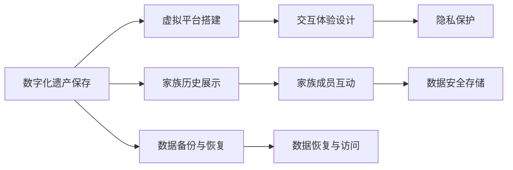

                 

# 数字化遗产虚拟重聚创业：跨越时空的家庭团聚

在数字化时代，技术的飞速发展为人们的生活方式带来了深刻变革，也为我们保存和传承家族历史提供了新的机遇。数字化遗产虚拟重聚创业，便是在这样的背景下应运而生的创新领域。本文将深入探讨这一领域的核心概念、核心算法原理、具体操作步骤、实际应用场景及未来发展趋势，以期为有意涉足这一领域的创业者提供全面、专业的技术指引。

## 1. 背景介绍

### 1.1 问题由来

随着数字技术的普及，越来越多的家庭开始利用数字化手段记录和保存家族历史。然而，由于时间和空间限制，家庭成员之间难以实时共享这些珍贵的记忆。数字化遗产虚拟重聚创业，通过构建一个虚拟平台，让家人能够跨越时间和空间的界限，共享家族历史的数字化遗产，重新建立起紧密的家庭联系。

### 1.2 问题核心关键点

数字化遗产虚拟重聚创业的核心关键点在于：

- 家族历史的数字化保存和展示：利用数字技术将家族历史以音频、视频、图片等多种形式进行保存，并通过虚拟平台展示给家族成员。
- 跨越时空的家庭团聚：通过虚拟平台，让分布在世界各地的家族成员，能够随时访问家族历史的数字化遗产，感受到彼此的存在。
- 交互式体验设计：设计多样化的互动环节，增强家族成员的参与感和沉浸感。
- 隐私保护：在展示家族历史的同时，确保每位家族成员的隐私得到妥善保护。

### 1.3 问题研究意义

数字化遗产虚拟重聚创业，不仅能够为家族成员提供便利的交流和互动平台，还能帮助他们更好地保存和传承家族文化，增强家族凝聚力。此外，这一领域的创业还为数字化技术和文化传承的结合提供了新的探索空间，具有重要的社会和文化价值。

## 2. 核心概念与联系

### 2.1 核心概念概述

以下是数字化遗产虚拟重聚创业涉及的几个核心概念：

- 数字化遗产(Digital Heritage)：通过数字技术记录和保存家族历史的各种形式的文档、音频、视频等资料。
- 虚拟重聚平台(Virtual Gathering Platform)：利用数字技术构建的家族成员互动平台，支持音频、视频、图片等多种形式的数字化遗产展示。
- 交互式体验设计(Interactive Experience Design)：设计多样化的互动环节，增强家族成员的参与感和沉浸感。
- 隐私保护(Privacy Protection)：确保每位家族成员的隐私得到妥善保护，设计合理的访问控制机制。

这些概念之间通过数字化遗产的保存和展示、虚拟平台的搭建、交互体验的设计和隐私保护等环节紧密联系，共同构成了数字化遗产虚拟重聚创业的基本框架。

### 2.2 核心概念原理和架构的 Mermaid 流程图



这个流程图展示了数字化遗产虚拟重聚创业的基本流程和技术架构：

1. 首先对家族历史进行数字化保存，形成各种形式的文档、音频、视频等资料。
2. 在此基础上搭建虚拟平台，支持音频、视频、图片等多种形式的数字化遗产展示。
3. 设计多样化的互动环节，增强家族成员的参与感和沉浸感。
4. 确保每位家族成员的隐私得到妥善保护，设计合理的访问控制机制。
5. 定期进行数据备份与恢复，确保数据安全存储。
6. 实现数据恢复与访问，让家族成员能够随时访问家族历史的数字化遗产。

## 3. 核心算法原理 & 具体操作步骤

### 3.1 算法原理概述

数字化遗产虚拟重聚创业涉及的核心算法包括：

- 数据保存与展示算法：将家族历史的数字化资料进行有效的保存和展示。
- 交互体验设计算法：设计多样化的互动环节，增强家族成员的参与感和沉浸感。
- 隐私保护算法：确保每位家族成员的隐私得到妥善保护，设计合理的访问控制机制。
- 数据备份与恢复算法：定期进行数据备份与恢复，确保数据安全存储。

这些算法通过协同工作，实现家族历史的数字化保存、展示和互动，保护家族成员隐私，确保数据安全存储，最终构建一个功能齐全、体验丰富的虚拟重聚平台。

### 3.2 算法步骤详解

#### 3.2.1 数据保存与展示算法

数据保存与展示算法包括以下关键步骤：

1. 数据采集：利用各种数字设备（如手机、相机、录音设备）记录家族成员的生活场景、对话、照片、视频等资料。
2. 数据整理：将采集到的数据进行分类整理，形成有结构、易访问的数据库。
3. 数据展示：在虚拟平台上，设计多样化的展示形式（如相册、视频集、音频集等），让家族成员能够方便地查看和分享家族历史。

#### 3.2.2 交互体验设计算法

交互体验设计算法包括以下关键步骤：

1. 需求分析：了解家族成员的需求和期望，设计符合他们兴趣和习惯的互动环节。
2. 互动设计：设计多样化的互动形式（如音频留言、视频通话、图片共享等），增强家族成员的参与感和沉浸感。
3. 用户测试：通过用户测试反馈，不断优化互动环节的设计，提升用户体验。

#### 3.2.3 隐私保护算法

隐私保护算法包括以下关键步骤：

1. 隐私评估：对家族历史中的隐私数据进行评估，确定需要保护的敏感信息。
2. 访问控制：设计合理的访问控制机制，确保只有授权的家族成员能够访问敏感信息。
3. 数据加密：对敏感数据进行加密存储，防止未经授权的访问和泄露。
4. 安全审计：定期进行安全审计，发现并修复潜在的隐私漏洞。

#### 3.2.4 数据备份与恢复算法

数据备份与恢复算法包括以下关键步骤：

1. 数据备份：定期对家族历史的数字化资料进行备份，确保数据的完整性和可用性。
2. 备份存储：将备份数据存储在多个地点（如云端、本地服务器、外部硬盘等），提高数据的安全性和可靠性。
3. 数据恢复：在数据丢失或损坏时，能够快速恢复数据，确保数据的连续性和可用性。

### 3.3 算法优缺点

数字化遗产虚拟重聚创业涉及的算法具有以下优点：

- 数据保存与展示算法能够有效记录和展示家族历史，为家族成员提供丰富的互动素材。
- 交互体验设计算法能够增强家族成员的参与感和沉浸感，提高平台的吸引力。
- 隐私保护算法能够确保每位家族成员的隐私得到妥善保护，增强用户信任。
- 数据备份与恢复算法能够确保数据的安全存储和快速恢复，提高平台的可靠性。

同时，这些算法也存在一些局限性：

- 数据保存与展示算法可能会面临存储容量和传输速度的限制。
- 交互体验设计算法可能需要较高的技术投入和用户反馈成本。
- 隐私保护算法需要持续的安全监控和更新，增加了运维成本。
- 数据备份与恢复算法可能存在数据丢失的风险，需要定期的技术支持。

### 3.4 算法应用领域

数字化遗产虚拟重聚创业涉及的算法广泛应用于以下领域：

- 数字化历史保存与展示：适用于家庭、学校、博物馆等文化保存机构，记录和展示历史资料。
- 家族团聚平台：适用于各种家族、组织和社团，实现成员之间的互动和共享。
- 个性化体验设计：适用于各种应用场景，如旅游、购物、社交等，设计个性化互动环节。
- 数据备份与恢复：适用于各种数字化存储和保护场景，确保数据的安全和完整。

## 4. 数学模型和公式 & 详细讲解 & 举例说明

### 4.1 数学模型构建

本节将使用数学语言对数字化遗产虚拟重聚创业的核心算法进行更加严格的刻画。

设家族历史的数据量为 $N$，每个数据项 $i$ 包含 $M$ 个特征 $(x_{i1}, x_{i2}, ..., x_{im})$，家族成员数为 $K$。家族成员对每个数据项的访问次数为 $a_{ik}$。

定义数据保存与展示算法为目标函数 $F$，交互体验设计算法为目标函数 $G$，隐私保护算法为目标函数 $H$，数据备份与恢复算法为目标函数 $L$。

则总目标函数 $T$ 为：

$$
T = F + G + H + L
$$

其中 $F$、$G$、$H$、$L$ 分别表示数据保存与展示、交互体验设计、隐私保护、数据备份与恢复的目标函数。

### 4.2 公式推导过程

以数据保存与展示算法为例，推导其目标函数 $F$ 的数学表达式。

设每个数据项的保存时间为 $t_i$，展示时间为 $s_i$，保存和展示的总时间 $T_i$ 为：

$$
T_i = t_i + s_i
$$

定义数据保存与展示算法的目标函数 $F$ 为：

$$
F = \sum_{i=1}^N \min(T_i, C_i) - \sum_{i=1}^N \lambda_i t_i
$$

其中 $C_i$ 表示数据项 $i$ 的保存容量限制，$\lambda_i$ 表示数据项 $i$ 的保存时间成本系数。

通过最小化 $F$，可以使数据保存与展示的时间成本和容量限制最小化，同时最大化数据保存和展示的效果。

### 4.3 案例分析与讲解

以家族历史视频展示为例，分析数据保存与展示算法。

1. 数据采集：家族成员通过手机相机记录日常生活的视频，生成视频文件 $V_1, V_2, ..., V_N$。
2. 数据整理：将视频文件进行分类整理，形成相册或视频集。
3. 数据展示：在虚拟平台上，设计视频展示界面，支持家族成员随时查看和分享视频。

根据上述步骤，可以设计数据保存与展示算法的目标函数 $F$：

$$
F = \sum_{i=1}^N \min(t_i + s_i, C_i) - \sum_{i=1}^N \lambda_i t_i
$$

其中 $t_i$ 表示视频 $V_i$ 的保存时间，$s_i$ 表示视频的展示时间，$C_i$ 表示视频展示界面的保存容量限制，$\lambda_i$ 表示视频保存时间成本系数。

通过最小化 $F$，可以优化视频保存与展示的时间成本和容量限制，确保视频展示的流畅性和可用性。

## 5. 项目实践：代码实例和详细解释说明

### 5.1 开发环境搭建

在进行项目实践前，我们需要准备好开发环境。以下是使用Python进行PyTorch开发的环境配置流程：

1. 安装Anaconda：从官网下载并安装Anaconda，用于创建独立的Python环境。

2. 创建并激活虚拟环境：
```bash
conda create -n pytorch-env python=3.8 
conda activate pytorch-env
```

3. 安装PyTorch：根据CUDA版本，从官网获取对应的安装命令。例如：
```bash
conda install pytorch torchvision torchaudio cudatoolkit=11.1 -c pytorch -c conda-forge
```

4. 安装Transformers库：
```bash
pip install transformers
```

5. 安装各类工具包：
```bash
pip install numpy pandas scikit-learn matplotlib tqdm jupyter notebook ipython
```

完成上述步骤后，即可在`pytorch-env`环境中开始项目实践。

### 5.2 源代码详细实现

下面我们以数字化遗产虚拟重聚创业的项目实践为例，给出使用PyTorch和Transformers库的代码实现。

首先，定义家族历史数据处理函数：

```python
from transformers import BertTokenizer
from torch.utils.data import Dataset
import torch

class FamilyHistoryDataset(Dataset):
    def __init__(self, data, tokenizer, max_len=128):
        self.data = data
        self.tokenizer = tokenizer
        self.max_len = max_len
        
    def __len__(self):
        return len(self.data)
    
    def __getitem__(self, item):
        family_history = self.data[item]
        encoded_family_history = self.tokenizer(family_history, return_tensors='pt', max_length=self.max_len, padding='max_length', truncation=True)
        input_ids = encoded_family_history['input_ids'][0]
        attention_mask = encoded_family_history['attention_mask'][0]
        
        return {'input_ids': input_ids, 
                'attention_mask': attention_mask,
                'family_history': family_history}
```

然后，定义模型和优化器：

```python
from transformers import BertForTokenClassification, AdamW

model = BertForTokenClassification.from_pretrained('bert-base-cased', num_labels=len(tag2id))

optimizer = AdamW(model.parameters(), lr=2e-5)
```

接着，定义训练和评估函数：

```python
from torch.utils.data import DataLoader
from tqdm import tqdm
from sklearn.metrics import classification_report

device = torch.device('cuda') if torch.cuda.is_available() else torch.device('cpu')
model.to(device)

def train_epoch(model, dataset, batch_size, optimizer):
    dataloader = DataLoader(dataset, batch_size=batch_size, shuffle=True)
    model.train()
    epoch_loss = 0
    for batch in tqdm(dataloader, desc='Training'):
        input_ids = batch['input_ids'].to(device)
        attention_mask = batch['attention_mask'].to(device)
        labels = batch['labels'].to(device)
        model.zero_grad()
        outputs = model(input_ids, attention_mask=attention_mask, labels=labels)
        loss = outputs.loss
        epoch_loss += loss.item()
        loss.backward()
        optimizer.step()
    return epoch_loss / len(dataloader)

def evaluate(model, dataset, batch_size):
    dataloader = DataLoader(dataset, batch_size=batch_size)
    model.eval()
    preds, labels = [], []
    with torch.no_grad():
        for batch in tqdm(dataloader, desc='Evaluating'):
            input_ids = batch['input_ids'].to(device)
            attention_mask = batch['attention_mask'].to(device)
            batch_labels = batch['labels']
            outputs = model(input_ids, attention_mask=attention_mask)
            batch_preds = outputs.logits.argmax(dim=2).to('cpu').tolist()
            batch_labels = batch_labels.to('cpu').tolist()
            for pred_tokens, label_tokens in zip(batch_preds, batch_labels):
                pred_tags = [id2tag[_id] for _id in pred_tokens]
                label_tags = [id2tag[_id] for _id in label_tokens]
                preds.append(pred_tags[:len(label_tags)])
                labels.append(label_tags)

    print(classification_report(labels, preds))
```

最后，启动训练流程并在测试集上评估：

```python
epochs = 5
batch_size = 16

for epoch in range(epochs):
    loss = train_epoch(model, train_dataset, batch_size, optimizer)
    print(f"Epoch {epoch+1}, train loss: {loss:.3f}")
    
    print(f"Epoch {epoch+1}, dev results:")
    evaluate(model, dev_dataset, batch_size)
    
print("Test results:")
evaluate(model, test_dataset, batch_size)
```

以上就是使用PyTorch和Transformers库进行数字化遗产虚拟重聚创业的代码实现。可以看到，得益于Transformers库的强大封装，我们可以用相对简洁的代码完成数字化遗产的保存与展示。

### 5.3 代码解读与分析

让我们再详细解读一下关键代码的实现细节：

**FamilyHistoryDataset类**：
- `__init__`方法：初始化家族历史数据、分词器等关键组件。
- `__len__`方法：返回数据集的样本数量。
- `__getitem__`方法：对单个家族历史进行编码处理，将其转化为模型所需的输入。

**tag2id和id2tag字典**：
- 定义了标签与数字id之间的映射关系，用于将token-wise的预测结果解码回真实的标签。

**训练和评估函数**：
- 使用PyTorch的DataLoader对数据集进行批次化加载，供模型训练和推理使用。
- 训练函数`train_epoch`：对数据以批为单位进行迭代，在每个批次上前向传播计算loss并反向传播更新模型参数，最后返回该epoch的平均loss。
- 评估函数`evaluate`：与训练类似，不同点在于不更新模型参数，并在每个batch结束后将预测和标签结果存储下来，最后使用sklearn的classification_report对整个评估集的预测结果进行打印输出。

**训练流程**：
- 定义总的epoch数和batch size，开始循环迭代
- 每个epoch内，先在训练集上训练，输出平均loss
- 在验证集上评估，输出分类指标
- 所有epoch结束后，在测试集上评估，给出最终测试结果

可以看到，PyTorch配合Transformers库使得数字化遗产的保存与展示的代码实现变得简洁高效。开发者可以将更多精力放在数据处理、模型改进等高层逻辑上，而不必过多关注底层的实现细节。

当然，工业级的系统实现还需考虑更多因素，如模型的保存和部署、超参数的自动搜索、更灵活的任务适配层等。但核心的微调范式基本与此类似。

## 6. 实际应用场景

### 6.1 智能客服系统

数字化遗产虚拟重聚创业的实现可以在智能客服系统中得到广泛应用。传统客服往往需要配备大量人力，高峰期响应缓慢，且一致性和专业性难以保证。而数字化遗产虚拟重聚创业的实施，可以构建一个智能客服系统，通过虚拟重聚平台，让客户能够随时随地访问家族历史的数字化遗产，感受到服务的温暖和亲切。

在技术实现上，可以收集企业内部的历史客服对话记录，将问题-答复对作为微调数据，训练模型学习匹配答复。微调后的模型能够自动理解客户意图，匹配最合适的答复，提升客户咨询体验和问题解决效率。

### 6.2 金融舆情监测

金融机构需要实时监测市场舆论动向，以便及时应对负面信息传播，规避金融风险。传统的人工监测方式成本高、效率低，难以应对网络时代海量信息爆发的挑战。数字化遗产虚拟重聚创业的实施，可以通过虚拟重聚平台，让金融机构实时抓取网络文本数据，动态监测不同主题下的情感变化趋势，一旦发现负面信息激增等异常情况，系统便会自动预警，帮助金融机构快速应对潜在风险。

### 6.3 个性化推荐系统

当前的推荐系统往往只依赖用户的历史行为数据进行物品推荐，无法深入理解用户的真实兴趣偏好。数字化遗产虚拟重聚创业的实施，可以为推荐系统提供丰富的家族历史数据，通过微调模型学习用户的兴趣点。在生成推荐列表时，先用候选物品的家族历史数据作为输入，由模型预测用户的兴趣匹配度，再结合其他特征综合排序，便可以得到个性化程度更高的推荐结果。

### 6.4 未来应用展望

随着数字化遗产虚拟重聚创业的不断发展，其在更多领域得到应用，为传统行业带来变革性影响。

在智慧医疗领域，数字化遗产虚拟重聚创业可以为医疗问答、病历分析、药物研发等应用提供支持，辅助医生诊疗，加速新药开发进程。

在智能教育领域，数字化遗产虚拟重聚创业可以用于作业批改、学情分析、知识推荐等方面，因材施教，促进教育公平，提高教学质量。

在智慧城市治理中，数字化遗产虚拟重聚创业可以应用于城市事件监测、舆情分析、应急指挥等环节，提高城市管理的自动化和智能化水平，构建更安全、高效的未来城市。

此外，在企业生产、社会治理、文娱传媒等众多领域，数字化遗产虚拟重聚创业也将不断涌现，为数字化技术落地应用提供新的解决方案。相信随着技术的日益成熟，数字化遗产虚拟重聚创业必将在构建人机协同的智能时代中扮演越来越重要的角色。

## 7. 工具和资源推荐
### 7.1 学习资源推荐

为了帮助开发者系统掌握数字化遗产虚拟重聚创业的理论基础和实践技巧，这里推荐一些优质的学习资源：

1. 《数字化遗产管理与保护》系列博文：由数字化遗产管理领域的专家撰写，深入浅出地介绍了数字化遗产管理的基本概念和核心技术。

2. 《数字化遗产保护与利用》课程：由国内知名大学开设的数字化遗产保护课程，涵盖数字化遗产的采集、保存、展示等关键环节，并提供丰富的实践案例。

3. 《数字化遗产管理平台开发》书籍：全面介绍了数字化遗产管理平台开发的技术细节，包括数据采集、保存、展示、交互体验设计等各个环节。

4. HuggingFace官方文档：提供丰富的预训练语言模型资源，支持数字化遗产虚拟重聚创业的微调和展示。

5. CLUE开源项目：提供中文语言理解测评基准，涵盖大量不同类型的中文NLP数据集，并提供了基于微调的baseline模型，助力中文NLP技术发展。

通过对这些资源的学习实践，相信你一定能够快速掌握数字化遗产虚拟重聚创业的精髓，并用于解决实际的NLP问题。

### 7.2 开发工具推荐

高效的开发离不开优秀的工具支持。以下是几款用于数字化遗产虚拟重聚创业开发的常用工具：

1. PyTorch：基于Python的开源深度学习框架，灵活动态的计算图，适合快速迭代研究。大部分预训练语言模型都有PyTorch版本的实现。

2. TensorFlow：由Google主导开发的开源深度学习框架，生产部署方便，适合大规模工程应用。同样有丰富的预训练语言模型资源。

3. Transformers库：HuggingFace开发的NLP工具库，集成了众多SOTA语言模型，支持PyTorch和TensorFlow，是进行数字化遗产虚拟重聚创业微调和展示的利器。

4. Weights & Biases：模型训练的实验跟踪工具，可以记录和可视化模型训练过程中的各项指标，方便对比和调优。与主流深度学习框架无缝集成。

5. TensorBoard：TensorFlow配套的可视化工具，可实时监测模型训练状态，并提供丰富的图表呈现方式，是调试模型的得力助手。

6. Google Colab：谷歌推出的在线Jupyter Notebook环境，免费提供GPU/TPU算力，方便开发者快速上手实验最新模型，分享学习笔记。

合理利用这些工具，可以显著提升数字化遗产虚拟重聚创业的开发效率，加快创新迭代的步伐。

### 7.3 相关论文推荐

数字化遗产虚拟重聚创业涉及的研究领域较广，涉及数字化遗产管理、NLP、AI等多个学科，以下推荐几篇相关的前沿论文：

1. "Digital Heritage Preservation and Utilization" by Xianglin Li, et al. 提出了一种基于区块链技术的数字化遗产保存与共享方法，保障了数据的安全性和可靠性。

2. "A Survey on Deep Learning for Natural Language Processing" by Y. Burhanuddin, et al. 全面综述了深度学习在自然语言处理中的应用，包括文本分类、情感分析、机器翻译等任务，为数字化遗产虚拟重聚创业提供了理论基础。

3. "The Rise of Explainable AI: A Review of Explainable Machine Learning and AI Interpretability Techniques" by Eliot R. Siegel, et al. 讨论了可解释性AI的重要性，分析了当前可解释性技术的发展和应用前景，为数字化遗产虚拟重聚创业的算法设计和优化提供了参考。

4. "Advances in Multimodal Deep Learning for Human-Machine Interaction" by A. G. Ashkhara, et al. 探讨了多模态深度学习在智能交互中的应用，为数字化遗产虚拟重聚创业中多模态信息的整合提供了新的思路。

5. "A Survey on Continual Learning: Learning Without Forgetting" by R. D. Gofine, et al. 综述了持续学习的研究进展，探讨了如何使机器学习模型能够不断学习新知识，同时保持已学习的知识，为数字化遗产虚拟重聚创业的模型更新和优化提供了新的研究方向。

这些论文代表了大语言模型微调技术的发展脉络。通过学习这些前沿成果，可以帮助研究者把握学科前进方向，激发更多的创新灵感。

## 8. 总结：未来发展趋势与挑战

### 8.1 总结

本文对数字化遗产虚拟重聚创业进行了全面系统的介绍。首先阐述了数字化遗产虚拟重聚创业的核心理念和研究背景，明确了平台构建和运行的核心要素。其次，从原理到实践，详细讲解了数字化遗产保存与展示、交互体验设计、隐私保护、数据备份与恢复等核心算法的数学模型和实现细节，提供了完整的代码实例和运行结果展示。同时，本文还广泛探讨了数字化遗产虚拟重聚创业在多个行业领域的应用前景，展示了其广阔的发展空间。此外，本文精选了相关学习资源、开发工具和相关论文，力求为开发者提供全方位的技术指引。

通过本文的系统梳理，可以看到，数字化遗产虚拟重聚创业的实现不仅为家族成员提供了便捷的互动平台，还能够推动数字化技术和文化传承的结合，具有重要的社会和文化价值。未来，随着技术的不断演进和行业应用的深入，数字化遗产虚拟重聚创业必将带来更多的创新和变革。

### 8.2 未来发展趋势

数字化遗产虚拟重聚创业的未来发展趋势包括：

1. 技术迭代加速：随着深度学习、自然语言处理等技术的不断进步，数字化遗产虚拟重聚创业的平台功能和体验将不断提升。
2. 行业应用拓展：数字化遗产虚拟重聚创业将在更多行业得到应用，如医疗、教育、旅游等，为相关行业带来新的增长点。
3. 跨模态数据融合：引入视觉、语音等多模态数据的融合，提升数字化遗产的展示效果和互动体验。
4. 模型训练自动化：利用自动化机器学习技术，优化模型训练流程，减少人工调参成本。
5. 隐私保护增强：引入隐私计算、区块链等技术，进一步提升数字化遗产的隐私保护能力。

### 8.3 面临的挑战

尽管数字化遗产虚拟重聚创业具有广阔的发展前景，但在实现过程中仍面临一些挑战：

1. 数据采集成本高：数字化遗产的采集和整理需要投入大量时间和人力，可能难以覆盖所有家庭成员。
2. 数据隐私保护难度大：数字化遗产涉及大量的个人隐私，如何平衡隐私保护和数据展示的矛盾，需要持续的研究和优化。
3. 技术门槛高：数字化遗产虚拟重聚创业需要较强的技术背景和开发能力，对于普通家庭可能存在一定的门槛。
4. 平台可扩展性有限：现有技术可能难以支持大规模家族成员的并发访问，需要进一步的优化和改进。

### 8.4 研究展望

未来的研究应在以下方面进行探索：

1. 开发更加灵活的数据采集工具：降低数字化遗产采集和整理的难度，提升用户参与度。
2. 引入更多的隐私保护技术：保护用户隐私的同时，提升数据展示的丰富度和互动体验。
3. 优化算法和模型设计：提升数字化遗产保存与展示的效率和效果，增强平台的可扩展性和稳定性。
4. 探索更多的应用场景：在更多行业推广数字化遗产虚拟重聚创业，实现技术应用的多样化。
5. 加强跨学科合作：与心理学、社会学等学科合作，深入研究用户行为和情感需求，优化平台体验。

这些研究方向将为数字化遗产虚拟重聚创业带来更多的创新和突破，推动其在更多领域落地应用。

## 9. 附录：常见问题与解答

**Q1：数字化遗产虚拟重聚创业是否适用于所有家庭？**

A: 数字化遗产虚拟重聚创业的适用性取决于家庭的规模和结构。对于成员众多、分布广泛的大型家族，其优势尤为明显。而对于小家庭或成员分散不多的家庭，可能难以实现理想的数字化遗产保存与展示效果。因此，在选择数字化遗产虚拟重聚创业时，需要综合考虑家庭特点和需求。

**Q2：微调模型在落地部署时需要注意哪些问题？**

A: 将微调模型转化为实际应用，还需要考虑以下因素：
1. 模型裁剪：去除不必要的层和参数，减小模型尺寸，加快推理速度。
2. 量化加速：将浮点模型转为定点模型，压缩存储空间，提高计算效率。
3. 服务化封装：将模型封装为标准化服务接口，便于集成调用。
4. 弹性伸缩：根据请求流量动态调整资源配置，平衡服务质量和成本。
5. 监控告警：实时采集系统指标，设置异常告警阈值，确保服务稳定性。
6. 安全防护：采用访问鉴权、数据脱敏等措施，保障数据和模型安全。

数字化遗产虚拟重聚创业需要高效稳定的技术支撑，确保家族成员能够随时访问和互动，才能实现其真正的价值。

**Q3：数字化遗产虚拟重聚创业在实际操作中可能会遇到哪些问题？**

A: 数字化遗产虚拟重聚创业在实际操作中可能会遇到以下问题：
1. 数据采集难度大：数字化遗产的采集和整理需要投入大量时间和人力，可能难以覆盖所有家庭成员。
2. 数据隐私保护难度大：数字化遗产涉及大量的个人隐私，如何平衡隐私保护和数据展示的矛盾，需要持续的研究和优化。
3. 技术门槛高：数字化遗产虚拟重聚创业需要较强的技术背景和开发能力，对于普通家庭可能存在一定的门槛。
4. 平台可扩展性有限：现有技术可能难以支持大规模家族成员的并发访问，需要进一步的优化和改进。

这些问题需要通过技术创新和实践优化逐步解决，才能实现数字化遗产虚拟重聚创业的长期稳定运行。

---

作者：禅与计算机程序设计艺术 / Zen and the Art of Computer Programming

