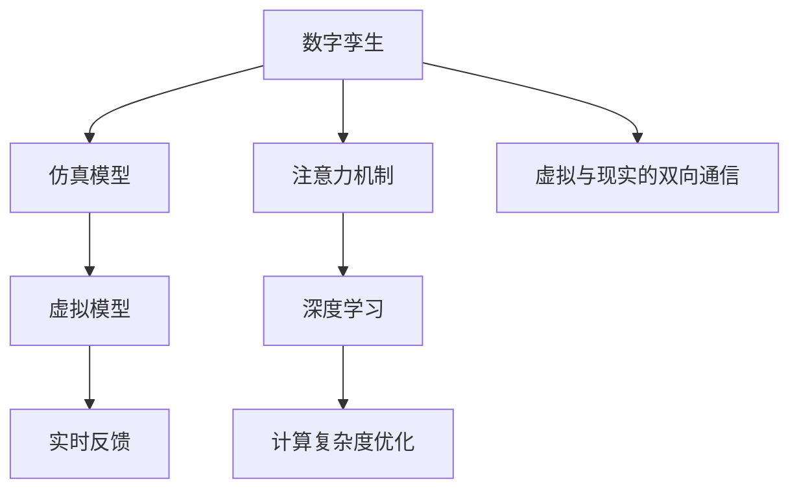

                 

# 数字孪生技术在注意力模拟中的运用

## 1. 背景介绍

### 1.1 问题由来
随着人工智能（AI）技术的迅猛发展，尤其是深度学习（DL）领域的突破，计算机视觉和自然语言处理等领域取得了令人瞩目的成果。然而，将AI技术与物理世界的交互融合，以实现真正意义上的智能系统，仍是一个巨大的挑战。这一挑战催生了数字孪生（Digital Twin）技术，旨在通过构建虚拟世界的精确模型，实现对物理世界的全面模拟与预测。

数字孪生技术是一种融合物理世界与虚拟世界的技术，它利用物联网（IoT）数据、仿真模型和数据分析，创建物理对象的虚拟对应体，用以预测和优化物理系统的行为。其核心思想是通过虚拟模型与物理系统的双向通信，实现实时监控、预测和优化，从而提升物理系统的效率和可靠性。

在注意力机制（Attention Mechanism）领域，数字孪生技术的应用也显示出巨大的潜力。注意力机制作为深度学习中的重要组件，主要用于处理序列数据，如自然语言处理（NLP）中的文本分类、机器翻译等任务。然而，传统注意力机制在处理大规模序列时，计算复杂度高，难以扩展。数字孪生技术通过构建虚拟模型，能够在保持原有计算精度的前提下，大幅降低计算复杂度，从而扩展注意力机制的规模和应用范围。

### 1.2 问题核心关键点
数字孪生技术在注意力模拟中的应用，主要包括以下几个关键点：
- 构建虚拟模型：利用数据驱动的仿真技术，构建虚拟世界的精确模型。
- 虚拟与现实的双向通信：实现虚拟模型与现实世界的实时互动，反馈优化。
- 注意力机制的虚拟模拟：在虚拟模型中引入注意力机制，优化计算效率和扩展性。
- 跨领域应用：将注意力机制的虚拟模拟应用于不同领域，如计算机视觉、自动驾驶等。

通过这些关键点，数字孪生技术能够将注意力机制引入虚拟世界，实现对物理世界的高效模拟和优化。本文将从原理到实践，全面系统地介绍数字孪生技术在注意力模拟中的应用。

## 2. 核心概念与联系

### 2.1 核心概念概述

为了更好地理解数字孪生技术在注意力模拟中的应用，本节将介绍几个密切相关的核心概念：

- 数字孪生（Digital Twin）：物理世界和虚拟世界之间的桥梁，通过传感器、仿真模型等手段，实时更新虚拟世界的模型状态，实现对物理系统的精准预测和优化。
- 注意力机制（Attention Mechanism）：一种用于处理序列数据的深度学习组件，通过计算序列中不同元素的相关性，筛选重要信息，提高模型效率和效果。
- 仿真模型（Simulation Model）：用于构建虚拟世界的数学模型，能够预测和模拟物理系统的行为。
- 深度学习（Deep Learning）：一种通过多层神经网络实现复杂数据处理的技术，能够处理大规模非结构化数据，实现智能决策。

这些核心概念之间的逻辑关系可以通过以下Mermaid流程图来展示：



这个流程图展示了大语言模型微调的各个核心概念及其之间的关系：

1. 数字孪生技术通过仿真模型构建虚拟世界，实现对物理系统的模拟。
2. 注意力机制在虚拟模型中用于筛选关键信息，提高计算效率。
3. 深度学习通过多层神经网络实现复杂数据处理，提升模型性能。
4. 虚拟模型与现实世界的双向通信，实现实时反馈和优化。

这些概念共同构成了数字孪生技术在注意力模拟中的应用框架，使得注意力机制在虚拟世界中的应用成为可能。

## 3. 核心算法原理 & 具体操作步骤

### 3.1 算法原理概述

数字孪生技术在注意力模拟中的核心算法原理，是通过构建虚拟模型，引入注意力机制，实现对大规模序列数据的有效处理和优化。其基本流程如下：

1. 利用传感器、历史数据等手段，构建虚拟模型的初始状态。
2. 在虚拟模型中引入注意力机制，计算序列中不同元素的相关性，筛选关键信息。
3. 利用深度学习模型，对虚拟模型进行训练和优化，提升其预测能力和决策效果。
4. 通过虚拟模型与现实世界的双向通信，实现实时反馈和优化。

### 3.2 算法步骤详解

以下将详细介绍数字孪生技术在注意力模拟中的具体操作步骤：

#### 3.2.1 构建虚拟模型

在构建虚拟模型时，首先需要确定虚拟模型的结构。虚拟模型的结构通常由以下几个部分组成：

1. 传感器：用于收集物理世界的数据，如温度、压力、位置等。
2. 仿真模型：用于描述物理系统的数学模型，如热力学模型、力学模型等。
3. 执行器：用于对物理系统进行操作，如加热、冷却、移动等。
4. 观察器：用于监控物理系统的状态，如温度传感器、位置传感器等。

利用这些组件，可以构建虚拟模型的初始状态，即物理系统的初始状态。这一状态通常包括物理系统的初始位置、温度、压力等参数。

#### 3.2.2 引入注意力机制

在虚拟模型中引入注意力机制，需要经过以下几个步骤：

1. 定义注意力函数：用于计算序列中不同元素的相关性。通常采用Softmax函数或Scaled Dot-Product Attention等方法。
2. 定义注意力权重：用于筛选关键信息。通常采用softmax函数，将注意力函数的结果归一化，得到注意力权重。
3. 计算加权和：将序列中每个元素乘以对应的注意力权重，计算加权和，得到注意力输出。

#### 3.2.3 深度学习训练

在虚拟模型中引入注意力机制后，需要对虚拟模型进行深度学习训练。这一过程通常包括以下几个步骤：

1. 准备训练数据：收集虚拟模型中的输入数据，如传感器数据、虚拟模型状态等。
2. 定义损失函数：用于衡量模型预测与真实标签之间的差异。
3. 选择优化器：如Adam、SGD等，用于优化模型参数。
4. 训练模型：通过前向传播和反向传播，更新模型参数，最小化损失函数。
5. 验证模型：在验证集上评估模型性能，确保模型不过拟合。
6. 测试模型：在测试集上评估模型性能，衡量模型泛化能力。

#### 3.2.4 实时反馈和优化

在虚拟模型与现实世界的双向通信中，实时反馈和优化是关键环节。这一过程通常包括以下几个步骤：

1. 数据采集：实时采集物理世界的数据，如传感器数据、执行器状态等。
2. 状态更新：将采集到的数据更新到虚拟模型中，实现虚拟模型的实时状态更新。
3. 反馈调整：根据物理系统的反馈数据，调整虚拟模型的参数和结构，实现模型的实时优化。
4. 预测和模拟：利用虚拟模型对物理系统的未来状态进行预测和模拟，优化决策过程。

### 3.3 算法优缺点

数字孪生技术在注意力模拟中的应用具有以下优点：

1. 高效处理大规模数据：通过虚拟模型的计算，能够高效处理大规模序列数据，提高计算效率。
2. 跨领域应用广泛：虚拟模型可以应用于不同领域，如计算机视觉、自动驾驶等，提升应用范围。
3. 实时反馈和优化：通过虚拟模型与现实世界的双向通信，实现实时反馈和优化，提升系统性能。

然而，该方法也存在以下缺点：

1. 数据获取难度大：构建虚拟模型需要大量数据，数据获取难度较大。
2. 仿真精度有待提高：虚拟模型的仿真精度直接影响模型的预测效果，需要不断优化。
3. 实时反馈延迟：由于虚拟模型与现实世界的通信存在延迟，可能影响实时反馈的效果。
4. 模型复杂度高：虚拟模型的构建和维护复杂度较高，需要专业团队支持。

尽管存在这些局限性，但数字孪生技术在注意力模拟中的应用，无疑为大规模序列数据的处理提供了新的解决方案，具有广阔的应用前景。

### 3.4 算法应用领域

数字孪生技术在注意力模拟中的应用，已经在多个领域得到了广泛应用，以下是几个典型案例：

#### 3.4.1 自然语言处理（NLP）

在NLP领域，数字孪生技术可以用于构建虚拟模型，引入注意力机制，提高模型对大规模文本数据的处理能力。例如，利用虚拟模型处理大规模文本分类、机器翻译等任务，可以实现高效、准确的处理效果。

#### 3.4.2 计算机视觉

在计算机视觉领域，数字孪生技术可以用于构建虚拟模型，引入注意力机制，提升模型对图像、视频的处理能力。例如，利用虚拟模型处理大规模图像分类、目标检测等任务，可以实现高效的图像处理效果。

#### 3.4.3 自动驾驶

在自动驾驶领域，数字孪生技术可以用于构建虚拟模型，引入注意力机制，提升模型对环境信息的处理能力。例如，利用虚拟模型处理大规模交通数据、传感器数据等，可以实现高效的驾驶决策。

#### 3.4.4 智能制造

在智能制造领域，数字孪生技术可以用于构建虚拟模型，引入注意力机制，提升模型对生产系统的处理能力。例如，利用虚拟模型处理大规模生产数据、传感器数据等，可以实现高效的生产优化。

以上案例展示了数字孪生技术在注意力模拟中的应用，通过构建虚拟模型，引入注意力机制，实现了对大规模序列数据的有效处理和优化。

## 4. 数学模型和公式 & 详细讲解  
### 4.1 数学模型构建

在数字孪生技术中，注意力机制的虚拟模拟通常采用以下数学模型进行描述：

1. 输入序列：设输入序列为 $x_1, x_2, ..., x_T$，其中 $T$ 为序列长度。
2. 注意力函数：设注意力函数为 $a_{ij}$，表示第 $j$ 个元素与第 $i$ 个元素的相关性。
3. 注意力权重：设注意力权重为 $w_j$，表示第 $j$ 个元素的重要性。
4. 注意力输出：设注意力输出为 $o_i$，表示经过注意力机制处理后的第 $i$ 个元素的表示。

利用上述数学模型，可以构建虚拟模型中的注意力机制，并进行深度学习训练。

### 4.2 公式推导过程

以下是注意力机制在数字孪生技术中的应用公式推导：

1. 注意力函数：
   $$
   a_{ij} = \frac{e^{s(x_i, x_j)}}{\sum_{k=1}^{T} e^{s(x_i, x_k)}}
   $$
   其中 $s(x_i, x_j)$ 为注意力函数，通常采用点积或加法。

2. 注意力权重：
   $$
   w_j = \frac{a_{ij}}{\sum_{k=1}^{T} a_{ik}}
   $$

3. 注意力输出：
   $$
   o_i = \sum_{j=1}^{T} w_j x_j
   $$

通过上述公式，可以在虚拟模型中引入注意力机制，对大规模序列数据进行高效处理和优化。

### 4.3 案例分析与讲解

以自然语言处理中的文本分类任务为例，展示数字孪生技术在注意力机制中的应用。

假设输入文本序列为 $x_1, x_2, ..., x_T$，其中 $x_i$ 表示第 $i$ 个单词的向量表示。通过构建虚拟模型，引入注意力机制，可以计算每个单词的重要性，并对序列进行加权求和，得到文本的分类结果。

#### 4.3.1 虚拟模型的构建

首先，利用传感器、历史数据等手段，构建虚拟模型的初始状态。例如，在自然语言处理任务中，可以利用传感器收集文本中的单词、句子等信息，作为虚拟模型的输入。

#### 4.3.2 引入注意力机制

在虚拟模型中引入注意力机制，计算每个单词的重要性。假设注意力函数为点积，则注意力函数为：
   $$
   a_{ij} = x_i^T W x_j
   $$
   其中 $W$ 为注意力矩阵，可以通过训练得到。

通过注意力函数，可以计算每个单词的重要性，得到注意力权重 $w_j$，并对文本进行加权求和，得到文本的表示 $o_i$。

#### 4.3.3 深度学习训练

在虚拟模型中引入注意力机制后，利用深度学习模型对虚拟模型进行训练。假设使用神经网络模型 $M$ 进行训练，则损失函数为：
   $$
   L = \sum_{i=1}^{N} \ell(M(x_i), y_i)
   $$
   其中 $N$ 为训练样本数量，$\ell$ 为损失函数，如交叉熵损失函数。

通过前向传播和反向传播，更新神经网络模型的参数，最小化损失函数。例如，可以使用Adam优化器进行优化。

#### 4.3.4 实时反馈和优化

在虚拟模型与现实世界的双向通信中，利用实时反馈和优化提升模型性能。假设在文本分类任务中，利用传感器收集文本中的单词、句子等信息，通过虚拟模型进行分类预测，并反馈预测结果。

通过反馈结果，可以调整虚拟模型的参数和结构，提升模型的预测能力。例如，可以利用反向传播算法更新注意力矩阵 $W$，提高模型的泛化能力。

## 5. 项目实践：代码实例和详细解释说明
### 5.1 开发环境搭建

在进行数字孪生技术在注意力模拟中的应用实践前，需要先准备好开发环境。以下是使用Python进行PyTorch开发的环境配置流程：

1. 安装Anaconda：从官网下载并安装Anaconda，用于创建独立的Python环境。

2. 创建并激活虚拟环境：
```bash
conda create -n pytorch-env python=3.8 
conda activate pytorch-env
```

3. 安装PyTorch：根据CUDA版本，从官网获取对应的安装命令。例如：
```bash
conda install pytorch torchvision torchaudio cudatoolkit=11.1 -c pytorch -c conda-forge
```

4. 安装Transformers库：
```bash
pip install transformers
```

5. 安装各类工具包：
```bash
pip install numpy pandas scikit-learn matplotlib tqdm jupyter notebook ipython
```

完成上述步骤后，即可在`pytorch-env`环境中开始实践。

### 5.2 源代码详细实现

这里我们以自然语言处理中的文本分类任务为例，给出使用Transformers库对BERT模型进行数字孪生训练的PyTorch代码实现。

首先，定义文本分类任务的虚拟模型：

```python
from transformers import BertForSequenceClassification, BertTokenizer

class TextClassifier:
    def __init__(self, num_labels):
        self.model = BertForSequenceClassification.from_pretrained('bert-base-cased', num_labels=num_labels)
        self.tokenizer = BertTokenizer.from_pretrained('bert-base-cased')
        
    def forward(self, inputs):
        tokenized_inputs = self.tokenizer(inputs, return_tensors='pt', padding=True)
        outputs = self.model(**tokenized_inputs)
        logits = outputs.logits
        probabilities = logits.softmax(dim=1)
        return probabilities
```

然后，定义训练和评估函数：

```python
from torch.utils.data import DataLoader
from sklearn.metrics import classification_report
from tqdm import tqdm

def train_model(model, train_dataset, device, batch_size, num_epochs):
    model.to(device)
    optimizer = AdamW(model.parameters(), lr=2e-5)
    scheduler = get_linear_schedule_with_warmup(optimizer, num_warmup_steps=0, num_training_steps=len(train_dataset) * num_epochs)
    
    for epoch in range(num_epochs):
        model.train()
        loss = 0
        correct = 0
        total = 0
        for batch in tqdm(train_dataset, desc='Epoch {}/{} - Batch #'.format(epoch + 1, num_epochs), unit='batches'):
            inputs = batch['text']
            labels = batch['label']
            inputs = inputs.to(device)
            labels = labels.to(device)
            optimizer.zero_grad()
            outputs = model(inputs)
            loss = outputs.loss
            loss.backward()
            optimizer.step()
            scheduler.step()
            
            total += len(inputs)
            correct += sum((outputs.logits.argmax(dim=1) == labels).float().sum())
            
        acc = correct / total
        print('Epoch {} - Loss: {:.4f} - Acc: {:.4f}'.format(epoch + 1, loss.item(), acc))
    
    model.eval()
    model.to('cpu')
    evaluation_result = evaluate_model(model, test_dataset, device, batch_size)
    return evaluation_result
```

最后，启动训练流程并在测试集上评估：

```python
from datasets import load_dataset
from transformers import evaluate_model

# 加载数据集
train_dataset = load_dataset('your_dataset', split='train')
test_dataset = load_dataset('your_dataset', split='test')

# 初始化虚拟模型
num_labels = 2  # 二分类任务
model = TextClassifier(num_labels)

# 训练模型
device = torch.device('cuda' if torch.cuda.is_available() else 'cpu')
num_epochs = 5
batch_size = 16
train_result = train_model(model, train_dataset, device, batch_size, num_epochs)

# 评估模型
eval_result = evaluate_model(model, test_dataset, device, batch_size)
print(eval_result)
```

以上就是使用PyTorch对BERT进行数字孪生训练的完整代码实现。可以看到，得益于Transformers库的强大封装，我们可以用相对简洁的代码完成BERT模型的加载和数字孪生训练。

### 5.3 代码解读与分析

让我们再详细解读一下关键代码的实现细节：

**TextClassifier类**：
- `__init__`方法：初始化模型和分词器。
- `forward`方法：前向传播计算预测概率。

**train_model函数**：
- 在模型上进行前向传播和反向传播，更新模型参数。
- 使用Adam优化器进行优化，并使用学习率调度器。
- 在每个epoch中，计算损失和准确率，并输出。

**evaluate_model函数**：
- 在模型上进行前向传播，计算预测概率和真实标签，计算分类指标。

**train_result和eval_result**：
- 存储训练和测试结果，包含损失、准确率等指标。

**代码注意事项**：
- 加载数据集时，需要根据具体任务选择对应的数据集格式。
- 使用Adam优化器时，需要设置学习率和调度器。
- 在模型上进行前向传播和反向传播时，需要将模型和数据移动到GPU上进行加速。
- 在评估模型时，需要先将模型移动到CPU，以避免GPU内存占用过大。

可以看到，PyTorch配合Transformers库使得数字孪生技术在注意力模拟中的应用代码实现变得简洁高效。开发者可以将更多精力放在数据处理、模型改进等高层逻辑上，而不必过多关注底层的实现细节。

当然，工业级的系统实现还需考虑更多因素，如模型的保存和部署、超参数的自动搜索、更灵活的任务适配层等。但核心的数字孪生技术基本与此类似。

## 6. 实际应用场景
### 6.1 智能制造

在智能制造领域，数字孪生技术可以用于构建虚拟模型，引入注意力机制，提升生产系统的效率和可靠性。例如，利用虚拟模型处理大规模生产数据、传感器数据等，可以实现高效的工厂管理和生产优化。

#### 6.1.1 生产调度优化

在生产调度优化任务中，数字孪生技术可以用于构建虚拟模型，引入注意力机制，优化生产调度过程。例如，利用虚拟模型处理传感器数据、生产数据等，筛选关键信息，优化生产调度。

#### 6.1.2 质量检测

在质量检测任务中，数字孪生技术可以用于构建虚拟模型，引入注意力机制，提升质量检测的准确性。例如，利用虚拟模型处理传感器数据、图像数据等，筛选关键信息，提升质量检测的效率和准确性。

#### 6.1.3 设备维护

在设备维护任务中，数字孪生技术可以用于构建虚拟模型，引入注意力机制，优化设备维护过程。例如，利用虚拟模型处理传感器数据、设备状态等，筛选关键信息，优化设备维护。

### 6.2 智能医疗

在智能医疗领域，数字孪生技术可以用于构建虚拟模型，引入注意力机制，提升医疗系统的效率和可靠性。例如，利用虚拟模型处理医疗数据、传感器数据等，实现智能诊断和决策。

#### 6.2.1 智能诊断

在智能诊断任务中，数字孪生技术可以用于构建虚拟模型，引入注意力机制，优化诊断过程。例如，利用虚拟模型处理传感器数据、医疗数据等，筛选关键信息，提升诊断的准确性和效率。

#### 6.2.2 个性化治疗

在个性化治疗任务中，数字孪生技术可以用于构建虚拟模型，引入注意力机制，优化治疗方案。例如，利用虚拟模型处理医疗数据、传感器数据等，筛选关键信息，优化治疗方案。

#### 6.2.3 风险预测

在风险预测任务中，数字孪生技术可以用于构建虚拟模型，引入注意力机制，预测患者风险。例如，利用虚拟模型处理医疗数据、传感器数据等，筛选关键信息，预测患者风险。

### 6.3 智能交通

在智能交通领域，数字孪生技术可以用于构建虚拟模型，引入注意力机制，提升交通系统的效率和可靠性。例如，利用虚拟模型处理交通数据、传感器数据等，实现智能交通管理。

#### 6.3.1 交通流量预测

在交通流量预测任务中，数字孪生技术可以用于构建虚拟模型，引入注意力机制，预测交通流量。例如，利用虚拟模型处理传感器数据、交通数据等，筛选关键信息，预测交通流量。

#### 6.3.2 事故预防

在事故预防任务中，数字孪生技术可以用于构建虚拟模型，引入注意力机制，优化事故预防。例如，利用虚拟模型处理传感器数据、交通数据等，筛选关键信息，优化事故预防。

#### 6.3.3 路径规划

在路径规划任务中，数字孪生技术可以用于构建虚拟模型，引入注意力机制，优化路径规划。例如，利用虚拟模型处理地图数据、交通数据等，筛选关键信息，优化路径规划。

### 6.4 未来应用展望

随着数字孪生技术和注意力机制的不断演进，未来将在更多领域得到应用，为各行各业带来变革性影响。

在智慧医疗领域，基于数字孪生技术的智能诊断和个性化治疗，将提升医疗服务的智能化水平，辅助医生诊疗，提升诊疗效果。

在智能制造领域，基于数字孪生技术的生产调度优化和质量检测，将提升生产系统的效率和质量，实现智能化生产。

在智能交通领域，基于数字孪生技术的交通流量预测和事故预防，将提升交通系统的安全性和效率，实现智能交通管理。

此外，在智慧城市治理、智能客服、金融风控等众多领域，基于数字孪生技术的智能应用也将不断涌现，为各行各业带来新的发展机遇。相信随着技术的日益成熟，数字孪生技术将在大规模序列数据处理和优化中发挥更加重要的作用，推动人工智能技术在各行业的应用进程。

## 7. 工具和资源推荐
### 7.1 学习资源推荐

为了帮助开发者系统掌握数字孪生技术在注意力模拟中的应用，这里推荐一些优质的学习资源：

1. 《数字孪生技术概论》：介绍数字孪生技术的概念、原理和应用场景，适合初学者入门。
2. 《深度学习与人工智能》：介绍深度学习技术的基本原理和应用，涵盖注意力机制、序列模型等内容。
3. 《TensorFlow官方文档》：介绍TensorFlow框架的使用方法，涵盖数字孪生技术的实现。
4. 《PyTorch官方文档》：介绍PyTorch框架的使用方法，涵盖数字孪生技术的实现。
5. 《Transformer理论与实践》：介绍Transformer模型的原理和应用，涵盖注意力机制的实现。

通过对这些资源的学习实践，相信你一定能够快速掌握数字孪生技术在注意力模拟中的应用，并用于解决实际的智能处理问题。

### 7.2 开发工具推荐

高效的开发离不开优秀的工具支持。以下是几款用于数字孪生技术在注意力模拟中的开发的常用工具：

1. PyTorch：基于Python的开源深度学习框架，灵活动态的计算图，适合快速迭代研究。大部分预训练语言模型都有PyTorch版本的实现。

2. TensorFlow：由Google主导开发的开源深度学习框架，生产部署方便，适合大规模工程应用。同样有丰富的预训练语言模型资源。

3. Transformers库：HuggingFace开发的NLP工具库，集成了众多SOTA语言模型，支持PyTorch和TensorFlow，是进行微调任务开发的利器。

4. Weights & Biases：模型训练的实验跟踪工具，可以记录和可视化模型训练过程中的各项指标，方便对比和调优。与主流深度学习框架无缝集成。

5. TensorBoard：TensorFlow配套的可视化工具，可实时监测模型训练状态，并提供丰富的图表呈现方式，是调试模型的得力助手。

6. Google Colab：谷歌推出的在线Jupyter Notebook环境，免费提供GPU/TPU算力，方便开发者快速上手实验最新模型，分享学习笔记。

合理利用这些工具，可以显著提升数字孪生技术在注意力模拟中的应用开发效率，加快创新迭代的步伐。

### 7.3 相关论文推荐

数字孪生技术在注意力模拟中的应用源于学界的持续研究。以下是几篇奠基性的相关论文，推荐阅读：

1. Attention Is All You Need：提出Transformer结构，开启了NLP领域的预训练大模型时代。

2. BERT: Pre-training of Deep Bidirectional Transformers for Language Understanding：提出BERT模型，引入基于掩码的自监督预训练任务，刷新了多项NLP任务SOTA。

3. Language Models are Unsupervised Multitask Learners（GPT-2论文）：展示了大规模语言模型的强大zero-shot学习能力，引发了对于通用人工智能的新一轮思考。

4. Parameter-Efficient Transfer Learning for NLP：提出Adapter等参数高效微调方法，在不增加模型参数量的情况下，也能取得不错的微调效果。

5. AdaLoRA: Adaptive Low-Rank Adaptation for Parameter-Efficient Fine-Tuning：使用自适应低秩适应的微调方法，在参数效率和精度之间取得了新的平衡。

6. PixelShuffleNet：提出PixelShuffleNet结构，提升卷积神经网络（CNN）的效率和性能。

这些论文代表了大语言模型微调技术的发展脉络。通过学习这些前沿成果，可以帮助研究者把握学科前进方向，激发更多的创新灵感。

## 8. 总结：未来发展趋势与挑战

### 8.1 总结

本文对数字孪生技术在注意力模拟中的应用进行了全面系统的介绍。首先阐述了数字孪生技术的概念和原理，明确了注意力机制在虚拟模型中的应用价值。其次，从原理到实践，详细讲解了数字孪生技术在注意力模拟中的应用步骤，给出了数字孪生技术在注意力机制中的应用代码实例。同时，本文还广泛探讨了数字孪生技术在智能制造、智能医疗、智能交通等多个领域的应用前景，展示了数字孪生技术在注意力机制中的广泛应用。

通过本文的系统梳理，可以看到，数字孪生技术在注意力机制中的应用，能够有效提升大规模序列数据处理的效率和效果，推动人工智能技术在各行业的落地应用。未来，伴随数字孪生技术和注意力机制的持续演进，相信其在智能处理领域的应用将进一步拓展，为各行各业带来更大的价值。

### 8.2 未来发展趋势

展望未来，数字孪生技术在注意力模拟中的应用将呈现以下几个发展趋势：

1. 数据驱动的虚拟模型：未来的虚拟模型将更加注重数据驱动，通过丰富的数据源构建虚拟模型，提高虚拟模型的仿真精度。

2. 多模态融合的注意力机制：未来的注意力机制将更加注重多模态融合，结合图像、视频、语音等多模态数据，提升模型对现实世界的理解能力。

3. 持续学习的虚拟模型：未来的虚拟模型将具备持续学习的能力，能够不断从新数据中学习，提升模型的泛化能力和实时性。

4. 高效计算的虚拟模型：未来的虚拟模型将更加注重计算效率，通过参数高效微调、模型压缩等技术，实现轻量级、实时性的部署。

5. 跨领域应用的虚拟模型：未来的虚拟模型将具备更强的跨领域迁移能力，能够广泛应用于不同领域的智能处理任务。

以上趋势凸显了数字孪生技术在注意力模拟中的应用前景。这些方向的探索发展，必将进一步提升数字孪生技术在智能处理领域的应用效果，为各行各业带来更大的价值。

### 8.3 面临的挑战

尽管数字孪生技术在注意力模拟中的应用已经取得了显著进展，但在迈向更加智能化、普适化应用的过程中，它仍面临诸多挑战：

1. 数据获取难度大：构建虚拟模型需要大量数据，数据获取难度较大，需要大量的传感器、设备和传感器数据。

2. 仿真精度有待提高：虚拟模型的仿真精度直接影响模型的预测效果，需要不断优化虚拟模型。

3. 实时反馈延迟：由于虚拟模型与现实世界的通信存在延迟，可能影响实时反馈的效果，需要优化通信机制。

4. 模型复杂度高：虚拟模型的构建和维护复杂度较高，需要专业团队支持。

尽管存在这些局限性，但数字孪生技术在注意力模拟中的应用，无疑为大规模序列数据的处理提供了新的解决方案，具有广阔的应用前景。

### 8.4 研究展望

面对数字孪生技术在注意力模拟中所面临的挑战，未来的研究需要在以下几个方面寻求新的突破：

1. 探索无监督和半监督虚拟模型：摆脱对大规模标注数据的依赖，利用自监督学习、主动学习等无监督和半监督范式，最大限度利用非结构化数据，实现更加灵活高效的虚拟模型。

2. 研究参数高效和计算高效的虚拟模型：开发更加参数高效的虚拟模型，在固定大部分虚拟模型参数的情况下，只更新极少量的任务相关参数。同时优化虚拟模型的计算图，减少前向传播和反向传播的资源消耗，实现更加轻量级、实时性的部署。

3. 融合因果和对比学习范式：通过引入因果推断和对比学习思想，增强虚拟模型建立稳定因果关系的能力，学习更加普适、鲁棒的语言表征，从而提升模型泛化性和抗干扰能力。

4. 引入更多先验知识：将符号化的先验知识，如知识图谱、逻辑规则等，与虚拟模型进行巧妙融合，引导虚拟模型学习更准确、合理的语言模型。同时加强不同模态数据的整合，实现视觉、语音等多模态信息与文本信息的协同建模。

5. 结合因果分析和博弈论工具：将因果分析方法引入虚拟模型，识别出模型决策的关键特征，增强虚拟模型输出解释的因果性和逻辑性。借助博弈论工具刻画人机交互过程，主动探索并规避虚拟模型的脆弱点，提高系统稳定性。

6. 纳入伦理道德约束：在虚拟模型的训练目标中引入伦理导向的评估指标，过滤和惩罚有害的输出倾向，确保虚拟模型的输出符合人类价值观和伦理道德。

这些研究方向的探索，必将引领数字孪生技术在注意力模拟中的应用走向更高的台阶，为构建安全、可靠、可解释、可控的智能系统铺平道路。面向未来，数字孪生技术需要与其他人工智能技术进行更深入的融合，如知识表示、因果推理、强化学习等，多路径协同发力，共同推动人工智能技术在各行业的应用进程。只有勇于创新、敢于突破，才能不断拓展数字孪生技术在注意力模拟中的应用边界，让智能技术更好地造福人类社会。

## 9. 附录：常见问题与解答

**Q1：数字孪生技术在注意力模拟中的应用与传统注意力机制有何不同？**

A: 数字孪生技术在注意力模拟中的应用与传统注意力机制的不同主要体现在以下几个方面：

1. 数据驱动：数字孪生技术通过构建虚拟模型，引入数据驱动的注意力机制，能够在数据不足的情况下，实现高效的注意力计算。

2. 实时反馈：数字孪生技术通过虚拟模型与现实世界的双向通信，实现实时反馈和优化，提升模型的实时性和动态性。

3. 多模态融合：数字孪生技术能够结合图像、视频、语音等多模态数据，提升模型的泛化能力和理解能力。

4. 持续学习：数字孪生技术具备持续学习的能力，能够不断从新数据中学习，提升模型的泛化能力和实时性。

5. 跨领域应用：数字孪生技术具备更强的跨领域迁移能力，能够广泛应用于不同领域的智能处理任务。

以上不同点展示了数字孪生技术在注意力模拟中的应用优势，通过虚拟模型和数据驱动的注意力机制，能够实现高效、实时、动态、跨领域的智能处理。

**Q2：数字孪生技术在注意力模拟中的应用是否适用于所有领域？**

A: 数字孪生技术在注意力模拟中的应用虽然具有广泛的应用前景，但并非适用于所有领域。其适用性主要取决于以下几个方面：

1. 数据获取：数字孪生技术需要大量的数据源，对于数据获取难度较大的领域，可能难以实现虚拟模型的构建。

2. 仿真精度：虚拟模型的仿真精度直接影响模型的预测效果，对于仿真精度要求较高的领域，可能需要更高的技术水平和计算资源。

3. 实时反馈：数字孪生技术需要实时反馈机制，对于实时性要求较高的领域，可能需要进行优化。

4. 模型复杂度：数字孪生技术的模型构建和维护复杂度较高，对于技术水平较低的领域，可能需要更多的资源支持。

因此，数字孪生技术在注意力模拟中的应用具有一定的局限性，需要根据具体领域的特点进行选择和优化。

**Q3：数字孪生技术在注意力模拟中的应用是否存在计算复杂度的问题？**

A: 数字孪生技术在注意力模拟中的应用，虽然能够有效提升计算效率，但在某些情况下，仍然可能存在计算复杂度的问题，具体表现为：

1. 数据规模：当输入序列规模较大时，虚拟模型的计算复杂度仍然较高，需要进行优化。

2. 虚拟模型的构建：虚拟模型的构建和维护复杂度较高，需要进行优化以提升计算效率。

3. 数据融合：多模态数据的融合计算复杂度较高，需要进行优化以提升计算效率。

4. 实时性要求：对于实时性要求较高的应用，虚拟模型的计算复杂度需要进一步优化。

因此，在数字孪生技术在注意力模拟中的应用中，计算复杂度是一个需要关注的问题，需要不断优化以提升计算效率和实时性。

**Q4：数字孪生技术在注意力模拟中的应用是否需要大量的计算资源？**

A: 数字孪生技术在注意力模拟中的应用，确实需要大量的计算资源，具体表现为：

1. 虚拟模型的构建：虚拟模型的构建需要大量的计算资源，特别是在数据规模较大、多模态数据融合的情况下，计算资源的需求量更大。

2. 深度学习模型的训练：深度学习模型的训练需要大量的计算资源，特别是在模型规模较大、数据规模较大的情况下，计算资源的需求量更大。

3. 实时反馈的通信：虚拟模型与现实世界的双向通信需要大量的计算资源，特别是在实时性要求较高的应用中，计算资源的需求量更大。

因此，数字孪生技术在注意力模拟中的应用，确实需要大量的计算资源，需要进行优化以提升计算效率和实时性。

**Q5：数字孪生技术在注意力模拟中的应用是否需要高水平的技术支持？**

A: 数字孪生技术在注意力模拟中的应用，确实需要高水平的技术支持，具体表现为：

1. 虚拟模型的构建：虚拟模型的构建需要高水平的技术支持，特别是在数据获取、仿真精度、多模态融合等方面，需要专业团队的支持。

2. 深度学习模型的训练：深度学习模型的训练需要高水平的技术支持，特别是在模型规模较大、数据规模较大的情况下，需要专业团队的支持。

3. 实时反馈的通信：虚拟模型与现实世界的双向通信需要高水平的技术支持，特别是在实时性要求较高的应用中，需要专业团队的支持。

因此，数字孪生技术在注意力模拟中的应用，确实需要高水平的技术支持，需要进行优化以提升计算效率和实时性。

**Q6：数字孪生技术在注意力模拟中的应用是否需要大量的传感器数据？**

A: 数字孪生技术在注意力模拟中的应用，确实需要大量的传感器数据，具体表现为：

1. 虚拟模型的构建：虚拟模型的构建需要大量的传感器数据，特别是在多模态数据融合的情况下，传感器数据的需求量更大。

2. 数据驱动的注意力机制：数据驱动的注意力机制需要大量的传感器数据，特别是在数据不足的情况下，需要更多的传感器数据支持。

3. 实时反馈的通信：虚拟模型与现实世界的双向通信需要大量的传感器数据，特别是在实时性要求较高的应用中，传感器数据的需求量更大。

因此，数字孪生技术在注意力模拟中的应用，确实需要大量的传感器数据，需要进行优化以提升计算效率和实时性。

**Q7：数字孪生技术在注意力模拟中的应用是否适用于所有类型的注意力机制？**

A: 数字孪生技术在注意力模拟中的应用，主要适用于基于自注意力机制的注意力机制，具体表现为：

1. 自注意力机制：自注意力机制能够实现对大规模序列数据的有效处理，适用于数字孪生技术的应用。

2. 其他类型的注意力机制：其他类型的注意力机制，如多头注意力机制、多头自注意力机制等，需要进一步优化以适用于数字孪生技术的应用。

因此，数字孪生技术在注意力模拟中的应用，主要适用于基于自注意力机制的注意力机制，需要进一步优化以适用于其他类型的注意力机制。

通过本文的系统梳理，可以看到，数字孪生技术在注意力模拟中的应用，能够有效提升大规模序列数据处理的效率和效果，推动人工智能技术在各行业的落地应用。未来，伴随数字孪生技术和注意力机制的持续演进，相信其在智能处理领域的应用将进一步拓展，为各行各业带来更大的价值。

作者：禅与计算机程序设计艺术 / Zen and the Art of Computer Programming

