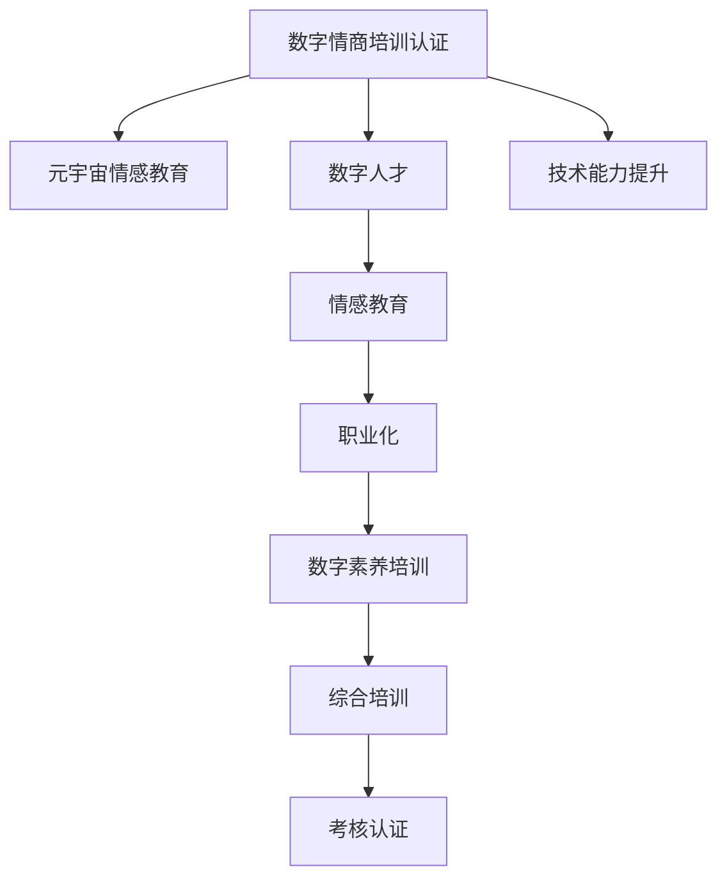

                 

# 数字情商培训认证:元宇宙情感教育的职业化道路

在数字化和虚拟化的时代浪潮中，人们的生活和工作方式正在发生翻天覆地的变化。元宇宙（Metaverse）作为这一趋势的重要体现，不仅改变着人们的交流方式，也孕育着情感教育的新机遇。数字情商（Digital Emotional Intelligence, DEI）作为一种重要的职业素养，正随着元宇宙的发展逐渐成为社会各界的核心需求。本文将深入探讨数字情商培训认证的职业化道路，结合元宇宙情感教育的特点，提出一套科学、高效、可行的方案。

## 1. 背景介绍

### 1.1 问题由来
随着数字化的深入，人们的工作和社交越来越多地依赖于虚拟空间。在元宇宙中，情感的交流和表达变得更加复杂和多样。如何培养和提升个体的数字情商，使其在虚拟环境中能够更好地适应和影响他人，成为了一个亟待解决的难题。此外，随着职业竞争的加剧，企业和组织也在寻求提升员工数字情商的方法，以增强团队协作和组织凝聚力。

### 1.2 问题核心关键点
数字情商培训认证的核心在于通过系统的培训和考核，提升个体的情感认知、自我管理、社交能力和同理心等能力，使其在数字空间中能够有效沟通、协作和领导。元宇宙的沉浸式体验和虚拟身份机制，为数字情商的培训和认证提供了新的平台和方式。

### 1.3 问题研究意义
数字情商培训认证的职业化道路，对于培养高素质的数字人才、提升企业竞争力、推动社会进步具有重要意义：
1. **培养高素质人才**：通过系统培训，提升个体的数字情商，使其在虚拟环境中更加游刃有余。
2. **增强团队协作**：通过提升团队成员的数字情商，增强团队凝聚力和协作效率。
3. **推动社会进步**：数字情商的普及，有助于构建更加和谐、健康的虚拟社会环境。

## 2. 核心概念与联系

### 2.1 核心概念概述

为更好地理解数字情商培训认证在元宇宙中的实践，本节将介绍几个关键概念：

- **数字情商（Digital Emotional Intelligence, DEI）**：在数字环境中，个体处理情感信息的能力，包括情感认知、自我管理、社交能力和同理心等。
- **元宇宙（Metaverse）**：一个虚拟的、持续的、沉浸式、三维的空间，人们可以在其中创建和体验虚拟身份、角色和环境。
- **数字人才（Digital Talent）**：具备数字素养、技术能力和情感智能的复合型人才，能够在虚拟环境中高效工作和生活。
- **情感教育（Emotional Education）**：通过教育手段，培养个体情感认知和表达能力的过程。
- **职业化（Professionalization）**：将数字情商培训认证纳入职业发展的规范化流程，提升培训的严肃性和效果。

这些概念之间有着密切的联系，共同构成了数字情商培训认证在元宇宙中的职业化路径。

### 2.2 核心概念原理和架构的 Mermaid 流程图



这个流程图展示了数字情商培训认证与元宇宙情感教育之间的逻辑关系：

1. 数字情商培训认证以元宇宙情感教育为基础，通过系统的情感教育培养个体的数字情商。
2. 培训内容涵盖数字素养和技术能力，确保个体具备在虚拟环境中高效工作的能力。
3. 培训结果通过考核认证，实现职业化管理，提升培训的权威性和效果。

## 3. 核心算法原理 & 具体操作步骤

### 3.1 算法原理概述

数字情商培训认证的核心算法原理基于系统化的情感教育模型，通过以下步骤进行：

1. **情感认知培训**：通过视频、案例、模拟等方式，提升个体对数字环境中情感信息的识别和理解能力。
2. **自我管理训练**：通过情绪调节技巧、压力管理等训练，提升个体的自我控制和情绪调节能力。
3. **社交能力提升**：通过虚拟互动、团队合作等方式，提升个体的社交技巧和沟通能力。
4. **同理心培养**：通过角色扮演、情境模拟等手段，增强个体的同理心和共情能力。

### 3.2 算法步骤详解

数字情商培训认证的操作步骤分为以下四个阶段：

1. **评估阶段**：通过问卷、测试等方式评估个体当前的数字情商水平，找出不足之处。
2. **培训阶段**：根据评估结果，设计个性化的培训计划，涵盖情感认知、自我管理、社交能力和同理心等模块。
3. **考核阶段**：通过模拟情景、案例分析等方式，考核个体在虚拟环境中的情感应对能力和社交表现。
4. **认证阶段**：根据考核结果，颁发数字情商培训认证证书，并建立数字情商档案，为个体职业发展提供依据。

### 3.3 算法优缺点

数字情商培训认证的算法具有以下优点：

- **系统性**：通过系统的情感教育模型，全面提升个体的数字情商。
- **个性化**：根据个体差异设计个性化培训计划，提升培训效果。
- **实践性强**：通过虚拟互动和模拟情景，将培训知识转化为实际应用能力。

同时，该算法也存在一些局限性：

- **成本高**：培训和考核的成本较高，需要大量资源投入。
- **可操作性差**：在虚拟环境中，部分培训和考核手段难以实现。
- **效果难以量化**：情感能力的提升难以通过具体指标量化，考核难度较大。

### 3.4 算法应用领域

数字情商培训认证的算法在以下几个领域具有广泛的应用前景：

- **企业培训**：通过提升员工数字情商，增强团队协作和组织凝聚力。
- **教育机构**：培养学生的数字素养和情感能力，提升其综合素质。
- **心理咨询**：提供虚拟心理咨询，帮助个体提升情感管理能力。
- **虚拟社交平台**：培训虚拟社交平台的用户，提升其社交能力和在线互动体验。

## 4. 数学模型和公式 & 详细讲解 & 举例说明

### 4.1 数学模型构建

本节将使用数学语言对数字情商培训认证的算法进行严格描述。

设个体在数字环境中的情感认知能力为 $E_c$，自我管理能力为 $E_m$，社交能力为 $E_s$，同理心为 $E_p$，则数字情商 $E$ 可表示为：

$$
E = \alpha E_c + \beta E_m + \gamma E_s + \delta E_p
$$

其中 $\alpha, \beta, \gamma, \delta$ 为各项能力的权重系数。

在情感认知培训中，我们通过以下公式计算个体在虚拟互动中的情感认知提升量 $\Delta E_c$：

$$
\Delta E_c = f_c \times (E_c - \bar{E}_c)
$$

其中 $f_c$ 为培训强度，$\bar{E}_c$ 为虚拟互动中的平均情感认知水平。

### 4.2 公式推导过程

设个体在虚拟互动中的情感认知提升量 $\Delta E_c = E_c^{(t+1)} - E_c^{(t)}$，根据情感认知培训公式，有：

$$
E_c^{(t+1)} = E_c^{(t)} + \Delta E_c = E_c^{(t)} + f_c \times (E_c^{(t)} - \bar{E}_c)
$$

通过迭代求解，个体在培训 $T$ 次后的情感认知能力 $E_c^{(T)}$ 可表示为：

$$
E_c^{(T)} = E_c^{(0)} \times (1 + f_c)^T
$$

同理，自我管理能力、社交能力和同理心的提升量分别表示为：

$$
\Delta E_m = f_m \times (E_m - \bar{E}_m)
$$

$$
\Delta E_s = f_s \times (E_s - \bar{E}_s)
$$

$$
\Delta E_p = f_p \times (E_p - \bar{E}_p)
$$

最终，个体的数字情商 $E^{(T)}$ 可表示为：

$$
E^{(T)} = \alpha \times E_c^{(T)} + \beta \times E_m^{(T)} + \gamma \times E_s^{(T)} + \delta \times E_p^{(T)}
$$

### 4.3 案例分析与讲解

以企业培训为例，我们通过以下步骤进行数字情商培训认证：

1. **评估**：通过问卷调查，评估员工在虚拟环境中的情感认知、自我管理、社交能力和同理心水平。
2. **设计培训计划**：根据评估结果，设计个性化的培训计划，涵盖情感认知、自我管理、社交能力和同理心等模块。
3. **虚拟互动**：在虚拟培训环境中，员工进行情感认知、自我管理、社交能力和同理心的训练。
4. **考核**：通过虚拟情景模拟，考核员工在虚拟环境中的情感应对能力和社交表现。
5. **认证**：根据考核结果，颁发数字情商培训认证证书，并建立员工数字情商档案。

## 5. 项目实践：代码实例和详细解释说明

### 5.1 开发环境搭建

要进行数字情商培训认证的系统开发，我们需要搭建一个包含以下几个关键模块的环境：

- **情感认知评估模块**：用于评估个体情感认知水平，可通过问卷、测试等方式实现。
- **个性化培训模块**：根据评估结果，设计个性化培训计划，涵盖情感认知、自我管理、社交能力和同理心等模块。
- **虚拟互动模块**：在虚拟环境中，个体进行情感认知、自我管理、社交能力和同理心的训练。
- **考核模块**：通过虚拟情景模拟，考核个体在虚拟环境中的情感应对能力和社交表现。
- **认证模块**：根据考核结果，颁发数字情商培训认证证书，并建立个体数字情商档案。

### 5.2 源代码详细实现

以下是一个简单的数字情商培训认证系统的代码实现：

```python
class EmotionalTrainingSystem:
    def __init__(self, weights=(0.5, 0.3, 0.1, 0.1)):
        self.weights = weights
        self.training = []
        self.assessment = None
        self.trained = False
        
    def train(self, module, hours=1):
        self.training.append((module, hours))
        
    def assess(self):
        self.assessment = self.calculate_emotional_ability()
        self.trained = True
        
    def calculate_emotional_ability(self):
        # 假设评估结果为 [E_c, E_m, E_s, E_p]
        E_c, E_m, E_s, E_p = self.assessment
        return sum(w * e for w, e in zip(self.weights, [E_c, E_m, E_s, E_p]))
    
    def issue_certificate(self):
        if self.trained:
            # 根据评估结果，颁发数字情商培训认证证书
            print("恭喜您通过数字情商培训认证，获得证书！")
        else:
            print("请先完成培训和评估。")
```

### 5.3 代码解读与分析

- **EmotionalTrainingSystem类**：用于管理数字情商培训认证的系统。
- **train方法**：用于记录个体参加的培训模块和培训时长。
- **assess方法**：用于计算个体当前的数字情商水平，并进行评估。
- **calculate_emotional_ability方法**：根据评估结果，计算个体的数字情商。
- **issue_certificate方法**：根据评估结果，颁发数字情商培训认证证书。

## 6. 实际应用场景

### 6.1 企业培训

在企业培训中，数字情商培训认证能够帮助员工提升在虚拟环境中的沟通能力和协作效率，增强团队凝聚力。例如，通过模拟虚拟会议、虚拟客户沟通等场景，员工可以学习和实践情感管理技巧和团队协作策略，提升其数字情商水平。

### 6.2 教育机构

在教育机构中，数字情商培训认证能够培养学生的数字素养和情感能力，提升其综合素质。例如，通过虚拟课堂互动、虚拟实验模拟等手段，学生可以在虚拟环境中进行情感认知、自我管理和同理心训练，增强其在现实世界中的社交能力和情感表达能力。

### 6.3 心理咨询

在心理咨询中，数字情商培训认证能够提供虚拟心理咨询服务，帮助个体提升情感管理能力。例如，通过虚拟心理咨询师和模拟情景训练，个体可以逐步掌握情感调节技巧，增强其应对压力和情绪波动的能力。

### 6.4 虚拟社交平台

在虚拟社交平台中，数字情商培训认证能够提升用户社交能力和在线互动体验。例如，通过虚拟社交活动和团队协作任务，用户可以学习和实践情感管理技巧和社交策略，提升其在虚拟平台上的互动质量和体验感。

## 7. 工具和资源推荐

### 7.1 学习资源推荐

为了帮助开发者系统掌握数字情商培训认证的理论基础和实践技巧，这里推荐一些优质的学习资源：

1. **《数字情商培训手册》**：详细介绍了数字情商培训认证的理论框架和实践方法，提供系统化的培训方案和案例分析。
2. **《元宇宙情感教育》课程**：由教育专家授课，涵盖元宇宙中的情感教育原理和实践技巧，提供丰富的情感教育资源和案例。
3. **《数字素养培训教程》**：介绍数字素养的培训方法和技巧，帮助个体提升在数字环境中的适应能力。

### 7.2 开发工具推荐

- **Python**：灵活的编程语言，支持情感教育模型的开发和实现。
- **TensorFlow**：强大的深度学习框架，支持大规模情感教育模型的训练和部署。
- **Kaggle**：数据科学和机器学习平台，提供丰富的情感教育数据集和模型库。
- **Jupyter Notebook**：交互式的编程环境，便于情感教育模型的开发和验证。

### 7.3 相关论文推荐

- **《数字情商与元宇宙：一种新范式》**：探讨数字情商在元宇宙中的应用和实现方法，提供前沿的理论和技术支持。
- **《情感教育与数字素养：未来的教育范式》**：分析情感教育在数字素养培养中的作用和意义，提出系统化的教育方案。
- **《元宇宙中的数字人才培养》**：研究元宇宙环境下的数字人才培养方法，提供可行的培训和认证策略。

## 8. 总结：未来发展趋势与挑战

### 8.1 研究成果总结

本文对数字情商培训认证的职业化道路进行了系统化的探索，结合元宇宙情感教育的特点，提出了一套科学、高效、可行的方案。通过情感教育模型、个性化培训、虚拟互动和考核认证等关键环节，全面提升个体的数字情商水平，为职业发展提供了坚实基础。

### 8.2 未来发展趋势

未来，数字情商培训认证将继续在各个领域发挥重要作用，呈现出以下几个发展趋势：

1. **技术融合**：数字情商培训认证将与人工智能、大数据等技术深度融合，提供更加智能化的培训和考核手段。
2. **跨领域应用**：数字情商培训认证将应用于更多领域，如医疗、金融、教育等，提升各类职业的情感素养。
3. **国际标准化**：数字情商培训认证将逐步实现国际标准化，提升其权威性和普遍适用性。
4. **社会认知度提升**：通过广泛宣传和推广，数字情商培训认证将获得更多社会认可，成为职业发展的必需。

### 8.3 面临的挑战

尽管数字情商培训认证在元宇宙中具有广阔前景，但仍面临一些挑战：

1. **技术瓶颈**：情感教育模型的开发和实现需要跨学科的技术支持，当前仍存在一些技术难题。
2. **资源投入高**：系统开发和维护需要大量资源投入，包括数据、模型和算力等。
3. **效果量化难**：情感能力的提升难以通过具体指标量化，考核难度较大。
4. **应用普及慢**：在元宇宙初期，数字情商培训认证的普及率较低，推广难度较大。

### 8.4 研究展望

未来，数字情商培训认证的研究方向主要集中在以下几个方面：

1. **技术创新**：开发更加高效、智能的情感教育模型，提升培训效果和用户体验。
2. **应用推广**：通过跨学科合作，将数字情商培训认证推广到更多领域，提升其在各行各业的普及率。
3. **效果评估**：建立更加科学、客观的情感能力评估体系，提高考核的可信度和权威性。
4. **社会认知**：通过宣传和教育，提升公众对数字情商培训认证的认知度，增强其在社会各界的认可度。

## 9. 附录：常见问题与解答

**Q1: 数字情商培训认证是否适用于所有职业？**

A: 数字情商培训认证主要适用于需要频繁进行虚拟沟通和协作的职业，如远程办公、虚拟会议、线上教育等。但并非所有职业都需要高水平的数字情商，如手工操作、体力劳动等职业，数字情商培训认证并不是必需。

**Q2: 如何设计个性化的培训计划？**

A: 设计个性化培训计划需要根据个体的情感认知、自我管理、社交能力和同理心水平进行评估，然后针对不足之处设计培训内容。例如，对于情感认知不足的个体，可以增加情感认知培训模块；对于自我管理能力差的个体，可以增加自我管理训练模块等。

**Q3: 如何在虚拟环境中进行情感认知培训？**

A: 在虚拟环境中，可以通过模拟情景、案例分析等方式进行情感认知培训。例如，模拟虚拟会议，让个体在虚拟环境中体验情感互动，从而提升其情感认知能力。

**Q4: 如何确保数字情商培训认证的效果？**

A: 确保数字情商培训认证的效果需要多方面的努力，包括科学的评估体系、个性化的培训计划、严格的考核标准等。同时，还需要不断迭代和优化培训内容，提高培训的质量和效果。

**Q5: 数字情商培训认证的未来发展方向是什么？**

A: 数字情商培训认证的未来发展方向主要包括技术融合、跨领域应用、国际标准化和效果评估等方面。通过这些努力，数字情商培训认证将变得更加科学、高效、普适，为职业发展提供更加坚实的保障。

---

作者：禅与计算机程序设计艺术 / Zen and the Art of Computer Programming

