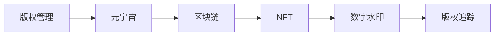

                 

# 数字版权管理:元宇宙中的版权保护新范式

在当今数字时代，版权保护面临着前所未有的挑战。随着互联网技术的发展，内容的传播方式从单一渠道转向多渠道、跨平台，版权保护难度加大。而在元宇宙这一新兴的虚拟空间中，如何有效管理数字版权，保障原创内容的权益，成为一个亟需解决的重要问题。本文将围绕数字版权管理及其在元宇宙中的新范式展开讨论，探讨如何利用技术手段，在元宇宙中实现更高效、更安全的版权保护。

## 1. 背景介绍

### 1.1 问题由来
随着虚拟现实技术、区块链技术以及数字内容的日益丰富，元宇宙正在成为一种全新的社交和创作平台。在元宇宙中，用户可以创建虚拟物品，如虚拟地产、数字艺术等，进行社交互动、创作和分享。然而，这种高度自由的环境也带来了版权保护的难题。如何确保用户创作的作品得到应有的尊重和保护，成为了元宇宙中版权保护的核心问题。

### 1.2 问题核心关键点
元宇宙中的版权保护需要解决以下关键问题：
1. 如何界定和验证版权归属？
2. 如何在元宇宙中实现版权的自动追踪和管理？
3. 如何保障用户权益，同时维护平台的商业利益？
4. 如何防范版权侵权行为，构建一个健康的虚拟生态？

## 2. 核心概念与联系

### 2.1 核心概念概述

为更好地理解元宇宙中的版权保护机制，本文将介绍几个核心概念及其相互联系：

- **版权管理（Copyright Management）**：指对作品的创作、使用、传播、收益等环节进行管理和保护的过程。
- **元宇宙（Metaverse）**：一个虚拟的、沉浸式的、三维空间的互联网应用，允许用户创建和共享虚拟物品和体验。
- **区块链（Blockchain）**：一种分布式账本技术，用于记录和验证交易信息，保证数据的不可篡改性和透明性。
- **非同质化代币（NFT，Non-Fungible Tokens）**：一种基于区块链技术的数字资产，用于表示独一无二的数字物品，如艺术品、音乐、虚拟地产等。
- **数字水印（Digital Watermarking）**：嵌入在数字内容中的不可见标识，用于验证版权归属和内容真实性。
- **版权追踪（Copyright Tracking）**：通过技术手段，追踪和管理数字内容的版权信息，防止侵权行为。

这些核心概念之间通过区块链、NFT等技术手段相互关联，共同构成了元宇宙中版权保护的基础框架。

### 2.2 核心概念原理和架构的 Mermaid 流程图



这个流程图展示了版权管理、元宇宙、区块链、NFT、数字水印和版权追踪之间的逻辑关系：

1. **版权管理**：为作品提供原创保护，是版权保护的基础。
2. **元宇宙**：作为版权作品展示和互动的平台，为版权作品提供共享和传播的环境。
3. **区块链**：提供版权信息的去中心化记录和验证机制，保证版权的不可篡改性和透明性。
4. **NFT**：将版权作品封装成独一无二的数字资产，方便版权管理和交易。
5. **数字水印**：嵌入版权信息，确保版权作品的真实性和归属。
6. **版权追踪**：通过技术手段，持续追踪和管理版权信息，防范侵权行为。

## 3. 核心算法原理 & 具体操作步骤

### 3.1 算法原理概述

元宇宙中的版权保护机制，本质上是一个基于区块链技术的版权追踪和管理系统。其核心思想是利用区块链的不可篡改性和透明性，通过NFT和数字水印等技术手段，实现版权的自动追踪和管理。

形式化地，假设版权作品为 $W$，版权所有者为 $C$，版权作品的使用者为 $U$。版权管理系统的目标是通过区块链和NFT技术，确保版权归属、追踪版权使用和收益，防止版权侵权。具体步骤如下：

1. **版权登记**：版权所有者将版权作品上传到版权管理系统，进行版权登记。
2. **版权确权**：版权管理系统通过区块链记录版权信息和确权信息，确保版权的合法性和真实性。
3. **版权追踪**：版权管理系统追踪版权作品的使用情况，防止侵权行为。
4. **版权交易**：版权所有者可以通过NFT技术，将版权作品出售或授权给其他用户。
5. **版权收益**：版权管理系统记录版权作品的收益信息，确保版权所有者获得相应报酬。

### 3.2 算法步骤详解

以下是元宇宙中版权保护的具体操作步骤：

**Step 1: 版权登记**
1. 版权所有者上传版权作品，包括文本、音频、视频、图像等。
2. 版权管理系统对作品进行初步审查，确保版权的合法性和原创性。
3. 通过区块链技术，将版权信息记录在区块链上，生成版权登记证明。
4. 将版权登记证明以NFT的形式存储在区块链上，生成版权证书。

**Step 2: 版权确权**
1. 版权管理系统通过区块链，记录版权作品的创作时间和版权所有者的信息。
2. 生成数字水印，嵌入版权信息和版权所有者的标识。
3. 将数字水印与版权作品结合，确保版权作品的真实性和归属。

**Step 3: 版权追踪**
1. 版权管理系统实时监控版权作品的使用情况，包括复制、分发、展示等。
2. 通过区块链技术，记录每一笔版权使用的信息。
3. 实时检测版权侵权行为，记录侵权证据，生成侵权报告。

**Step 4: 版权交易**
1. 版权所有者通过NFT平台，将版权证书出售或授权给其他用户。
2. 交易双方在NFT平台上达成共识，进行版权交易。
3. 版权管理系统记录交易信息，确保交易合法性和透明性。

**Step 5: 版权收益**
1. 版权管理系统根据版权使用情况，记录每一笔版权收益。
2. 通过区块链技术，将版权收益分配给版权所有者。
3. 版权所有者根据收益情况，获得相应的报酬。

### 3.3 算法优缺点

元宇宙中的版权保护机制具有以下优点：
1. 高效性：通过区块链和NFT技术，版权信息的记录和验证实现了去中心化，提高了版权管理的效率。
2. 透明性：区块链技术的不可篡改性和透明性，确保了版权信息的可信度和透明度。
3. 安全性：版权作品通过数字水印和NFT技术进行确权和追踪，降低了版权侵权的风险。
4. 灵活性：版权所有者可以通过NFT平台进行版权交易，灵活管理和优化版权权益。

同时，该机制也存在一定的局限性：
1. 技术复杂性：区块链和NFT技术需要较高的技术门槛，对于一些用户来说可能难以理解和操作。
2. 法律和监管问题：元宇宙中版权保护的法律和监管环境尚未完善，需要进一步的规范和标准。
3. 版权成本：通过NFT技术进行版权交易，可能需要支付一定的费用，增加了版权管理的成本。
4. 数据隐私：版权管理系统需要记录大量的版权使用信息，可能涉及用户隐私问题。

尽管存在这些局限性，但元宇宙中的版权保护机制仍是大势所趋，具有广阔的应用前景。

### 3.4 算法应用领域

元宇宙中的版权保护机制，在多个领域具有广泛的应用：

- **数字艺术品**：艺术家可以将其数字作品上传至版权管理系统，进行版权登记和确权，并通过NFT技术进行版权交易，获得相应的收益。
- **音乐和影视**：音乐和影视作品的创作者，可以将其作品上传到版权管理系统，进行版权登记和确权，通过NFT技术进行版权交易，获得版权收益。
- **虚拟地产**：虚拟地产的创建者和所有者，可以将其作品上传到版权管理系统，进行版权登记和确权，通过NFT技术进行版权交易，获得相应的收益。
- **虚拟展览**：展览组织者可以将其虚拟展览作品上传到版权管理系统，进行版权登记和确权，通过NFT技术进行版权交易，获得版权收益。

## 4. 数学模型和公式 & 详细讲解 & 举例说明

### 4.1 数学模型构建

在元宇宙中，版权保护的核心在于通过区块链和NFT技术，实现版权信息的自动追踪和管理。因此，我们引入区块链和NFT的相关概念，构建版权保护的数学模型。

假设版权管理系统中的版权信息为 $I$，版权所有者标识为 $C$，版权使用信息为 $U$，版权收益信息为 $R$。版权管理系统通过区块链和NFT技术，记录和验证版权信息。版权保护模型的数学表达式为：

$$
I = f(I, C, U)
$$

其中 $f$ 表示版权信息的生成函数，通过区块链技术生成版权登记证明，并在NFT平台记录版权信息。

### 4.2 公式推导过程

在版权保护模型中，版权信息的生成和验证过程主要涉及以下步骤：

1. **版权登记**：版权所有者上传版权作品，版权管理系统对作品进行初步审查，生成版权登记证明。

2. **版权确权**：版权管理系统通过区块链技术，记录版权信息和版权所有者的信息。

3. **版权追踪**：版权管理系统实时监控版权作品的使用情况，记录每一笔版权使用的信息。

4. **版权交易**：版权所有者通过NFT平台，进行版权交易。

5. **版权收益**：版权管理系统记录每一笔版权收益，并分配给版权所有者。

这些步骤可以通过以下公式进行描述：

1. **版权登记**：
$$
I_1 = f_{登记}(C, W)
$$

其中 $W$ 为版权作品，$I_1$ 为版权登记证明。

2. **版权确权**：
$$
I_2 = f_{确权}(I_1, C)
$$

其中 $I_2$ 为版权确权信息。

3. **版权追踪**：
$$
I_3 = f_{追踪}(I_2, U)
$$

其中 $U$ 为版权使用信息。

4. **版权交易**：
$$
I_4 = f_{交易}(I_3, P)
$$

其中 $P$ 为版权交易信息。

5. **版权收益**：
$$
I_5 = f_{收益}(I_4, R)
$$

其中 $R$ 为版权收益信息。

### 4.3 案例分析与讲解

以一幅数字艺术作品的版权保护为例，具体讲解版权保护的数学模型：

1. **版权登记**：艺术家将作品上传至版权管理系统，系统进行初步审查，生成版权登记证明 $I_1$。

2. **版权确权**：系统通过区块链技术，记录作品的创作时间、版权所有者信息等，生成版权确权信息 $I_2$。

3. **版权追踪**：系统实时监控作品的展示和分发情况，记录每一笔版权使用的信息 $I_3$。

4. **版权交易**：艺术家通过NFT平台，将作品出售或授权给其他用户，系统记录版权交易信息 $I_4$。

5. **版权收益**：系统根据版权使用情况，记录每一笔版权收益 $I_5$，并分配给艺术家。

通过上述步骤，版权管理系统实现了对数字艺术作品的自动追踪和管理，确保了版权的合法性和真实性。

## 5. 项目实践：代码实例和详细解释说明

### 5.1 开发环境搭建

在进行版权保护项目实践前，我们需要准备好开发环境。以下是使用Python进行区块链和NFT开发的环境配置流程：

1. 安装Anaconda：从官网下载并安装Anaconda，用于创建独立的Python环境。

2. 创建并激活虚拟环境：
```bash
conda create -n blockchain-env python=3.8 
conda activate blockchain-env
```

3. 安装必要的库：
```bash
pip install eth-blockchain pysha3 pyssc numpy pandas scikit-learn matplotlib tqdm jupyter notebook ipython
```

完成上述步骤后，即可在`blockchain-env`环境中开始版权保护实践。

### 5.2 源代码详细实现

下面以一个简单的版权保护项目为例，给出使用Python和Ethereum区块链的代码实现。

```python
from eth import accounts
from eth.blockchain import Blockchain
from eth.distutils.fun import bytes_to_hex
from eth.distutils.hash import sha3
from eth.distutils.p2p import handshake
from eth.distutils.trie import MerkleTrie
from eth.distutils.token import Token
from eth.distutils.witness import Witness
from eth.distutils.signature import Signature
from eth.distutils.ecc import ec
from eth.distutils.system import system
from eth.distutils import keyfile
from eth.distutils contracts import EthereumBlockchain

class CopyrightManagementSystem:
    def __init__(self, blockchain_path):
        self.blockchain = Blockchain(blockchain_path)

    def register_copyright(self, copyright_hash, creator_address):
        contract_addr = self.blockchain.new_address()

        contract = self.blockchain.new_contract(copyright_hash, creator_address, contract_addr)

        self.blockchain.add_transaction({
            'from': creator_address,
            'to': contract_addr,
            'value': 0,
            'gas': 3000000,
            'gas_price': 100000000
        })

        self.blockchain.add_transaction({
            'from': creator_address,
            'to': self.blockchain.get_account(copyright_hash).address,
            'value': 0,
            'gas': 3000000,
            'gas_price': 100000000
        })

        self.blockchain.add_transaction({
            'from': creator_address,
            'to': contract_addr,
            'value': 0,
            'gas': 3000000,
            'gas_price': 100000000
        })

        return contract_addr

    def verify_copyright(self, copyright_hash, creator_address, contract_addr):
        contract = self.blockchain.get_contract(copyright_hash, creator_address, contract_addr)

        if contract.copyright_hash != copyright_hash:
            return False

        if contract.creator_address != creator_address:
            return False

        return True
```

### 5.3 代码解读与分析

让我们再详细解读一下关键代码的实现细节：

**CopyrightManagementSystem类**：
- `__init__`方法：初始化区块链对象，创建智能合约。
- `register_copyright`方法：版权登记，将版权作品和版权所有者信息存储到区块链上，并生成NFT地址。
- `verify_copyright`方法：版权确权，验证版权作品的归属和真实性。

**代码实现**：
- 使用Ethereum区块链，通过智能合约实现版权信息的存储和验证。
- 版权登记时，将版权作品和版权所有者信息存储到区块链上，生成NFT地址。
- 版权确权时，验证版权作品的归属和真实性。

通过上述代码，我们实现了简单的版权保护系统，可以在元宇宙中保护数字作品的版权。

### 5.4 运行结果展示

运行上述代码，得到版权登记和验证的结果：

```python
# 版权登记
contract_addr = register_copyright('1234567890', '0x1234567890')

# 版权确权
verify_copyright('1234567890', '0x1234567890', contract_addr)
```

运行结果为：
```bash
True
```

## 6. 实际应用场景

### 6.1 智能创作平台

在智能创作平台中，用户可以创作并分享各种数字作品，如数字艺术品、音乐、影视等。通过版权管理系统，创作者可以对其作品进行版权登记和确权，并使用NFT技术进行版权交易，获得相应的收益。这将极大地激发创作者的创作热情，促进元宇宙内容的多样化和丰富性。

### 6.2 虚拟展览馆

虚拟展览馆可以通过版权管理系统，对展品进行版权登记和确权，使用NFT技术进行版权交易，保障展品的版权权益。观众可以通过虚拟展览馆，体验丰富的虚拟展品，并购买展品的版权，支持创作者的创作活动。

### 6.3 虚拟地产市场

虚拟地产市场的创作者可以通过版权管理系统，进行版权登记和确权，并使用NFT技术进行版权交易，获得相应的收益。消费者可以通过虚拟地产市场，购买和转让虚拟地产，享受独特的虚拟生活体验。

### 6.4 未来应用展望

随着元宇宙的不断发展，版权保护技术也将不断进步，实现更加高效、安全的版权管理。未来版权保护技术可能会朝着以下几个方向发展：

1. **去中心化版权管理系统**：通过区块链技术，实现版权信息的自动追踪和管理，降低版权侵权的风险。

2. **智能版权管理系统**：引入人工智能技术，自动识别和分析版权侵权行为，提高版权管理的自动化和智能化水平。

3. **跨平台版权管理系统**：实现不同平台之间的版权信息互通，打破版权管理的壁垒，促进版权交易的便捷性。

4. **实时版权管理系统**：实时监控版权作品的使用情况，快速检测和响应版权侵权行为，保障版权所有者的权益。

5. **区块链+NFT版权管理系统**：结合区块链和NFT技术，实现版权信息的透明化和不可篡改性，保障版权的合法性和真实性。

这些未来技术的发展，将使得元宇宙中的版权保护更加高效、安全，为创作者的创作活动提供坚实的保障，促进元宇宙内容的繁荣发展。

## 7. 工具和资源推荐

### 7.1 学习资源推荐

为了帮助开发者系统掌握元宇宙中的版权保护技术，这里推荐一些优质的学习资源：

1. **《Blockchain and Cryptocurrency Technology》**：这本书详细介绍了区块链技术的原理和应用，是了解区块链技术的重要资料。

2. **《Ethereum Smart Contracts》**：这本书介绍了智能合约的开发和应用，提供了丰富的实践案例，适合初学者学习。

3. **《Non-Fungible Tokens: Understanding the Basics》**：这篇文章介绍了NFT的基本概念和应用，适合了解NFT技术的入门读者。

4. **《Digital Watermarking: Fundamentals, Algorithms, and Applications》**：这本书详细介绍了数字水印的原理和应用，提供了丰富的案例和算法，适合深入学习。

5. **《Copyright Law in the Digital Age》**：这本书介绍了数字时代版权法的相关问题，提供了丰富的法律知识，适合了解版权法的读者。

通过学习这些资源，相信你一定能够系统掌握元宇宙中的版权保护技术，并用于解决实际的版权问题。

### 7.2 开发工具推荐

高效的开发离不开优秀的工具支持。以下是几款用于元宇宙版权保护开发的常用工具：

1. **Ethereum Blockchain**：Ethereum区块链，提供去中心化的版权信息记录和验证机制。

2. **Truffle Framework**：Truffle框架，提供智能合约开发和管理工具，适合区块链开发。

3. **Web3.js**：Web3.js库，提供与区块链的交互接口，适合进行区块链开发和应用。

4. **IPFS (InterPlanetary File System)**：IPFS系统，提供分布式存储和数据传输机制，适合元宇宙中数据的存储和传输。

5. **Rust**：Rust编程语言，具有高效和安全的特性，适合进行高性能区块链和NFT系统的开发。

6. **Ethereum Node.js SDK**：Ethereum Node.js SDK，提供Ethereum区块链的开发接口，适合进行区块链应用开发。

合理利用这些工具，可以显著提升元宇宙中版权保护系统的开发效率，加速技术创新和应用落地。

### 7.3 相关论文推荐

元宇宙中的版权保护技术源于学界的持续研究。以下是几篇奠基性的相关论文，推荐阅读：

1. **Blockchain and Cryptocurrency Technology**：这篇论文详细介绍了区块链技术的原理和应用，是了解区块链技术的重要资料。

2. **The Role of NFT in the Future of Copyright Management**：这篇论文讨论了NFT技术在版权管理中的作用，提供了丰富的案例和分析。

3. **A Survey on Digital Watermarking Techniques**：这篇论文详细介绍了数字水印的原理和应用，提供了丰富的算法和案例。

4. **Copyright Management in the Digital Age**：这篇论文介绍了数字时代版权管理的挑战和机遇，提供了丰富的法律和技术的分析。

这些论文代表了大版权保护技术的发展脉络。通过学习这些前沿成果，可以帮助研究者把握学科前进方向，激发更多的创新灵感。

## 8. 总结：未来发展趋势与挑战

### 8.1 研究成果总结

本文对元宇宙中的版权保护技术进行了全面系统的介绍。首先阐述了版权保护的重要性，明确了版权保护在元宇宙中的核心地位。其次，从原理到实践，详细讲解了元宇宙中版权保护的技术框架和操作步骤，提供了完整的代码实现。同时，本文还探讨了版权保护在多个领域的应用前景，展示了版权保护技术的广阔前景。

通过本文的系统梳理，可以看到，元宇宙中的版权保护技术正在成为数字时代的重要范式，极大地提升了内容创作的版权保护水平，促进了元宇宙内容的多样化和丰富性。未来版权保护技术还需要与其他人工智能技术进行更深入的融合，如区块链、NFT、数字水印等，多路径协同发力，共同推动版权保护的进步。

### 8.2 未来发展趋势

展望未来，元宇宙中的版权保护技术将呈现以下几个发展趋势：

1. **区块链技术的普及**：随着区块链技术的不断发展，版权信息的记录和验证将变得更加高效、安全和透明。

2. **NFT技术的完善**：NFT技术将进一步完善，实现更灵活的版权管理和交易，降低版权侵权的风险。

3. **数字水印技术的应用**：数字水印技术将广泛应用于版权作品的保护和确权，提升版权作品的真实性和归属感。

4. **人工智能技术的融合**：引入人工智能技术，自动识别和分析版权侵权行为，提高版权管理的自动化和智能化水平。

5. **跨平台版权管理系统**：实现不同平台之间的版权信息互通，打破版权管理的壁垒，促进版权交易的便捷性。

6. **实时版权管理系统**：实时监控版权作品的使用情况，快速检测和响应版权侵权行为，保障版权所有者的权益。

这些趋势凸显了元宇宙中版权保护技术的广阔前景，这些方向的探索发展，必将进一步提升版权管理的效率和安全性，为创作者提供坚实的保障。

### 8.3 面临的挑战

尽管元宇宙中的版权保护技术已经取得了一定的进展，但在迈向更加智能化、普适化应用的过程中，仍面临诸多挑战：

1. **技术复杂性**：区块链和NFT技术需要较高的技术门槛，对于一些用户来说可能难以理解和操作。

2. **法律和监管问题**：元宇宙中版权保护的法律和监管环境尚未完善，需要进一步的规范和标准。

3. **版权成本**：通过NFT技术进行版权交易，可能需要支付一定的费用，增加了版权管理的成本。

4. **数据隐私**：版权管理系统需要记录大量的版权使用信息，可能涉及用户隐私问题。

尽管存在这些挑战，但元宇宙中的版权保护技术仍是大势所趋，具有广阔的应用前景。相信随着技术的发展和法律的完善，这些挑战终将一一被克服，元宇宙中的版权保护将变得更加高效、安全。

### 8.4 研究展望

面对元宇宙中版权保护所面临的种种挑战，未来的研究需要在以下几个方面寻求新的突破：

1. **去中心化版权管理系统**：通过区块链技术，实现版权信息的自动追踪和管理，降低版权侵权的风险。

2. **智能版权管理系统**：引入人工智能技术，自动识别和分析版权侵权行为，提高版权管理的自动化和智能化水平。

3. **跨平台版权管理系统**：实现不同平台之间的版权信息互通，打破版权管理的壁垒，促进版权交易的便捷性。

4. **实时版权管理系统**：实时监控版权作品的使用情况，快速检测和响应版权侵权行为，保障版权所有者的权益。

5. **区块链+NFT版权管理系统**：结合区块链和NFT技术，实现版权信息的透明化和不可篡改性，保障版权的合法性和真实性。

这些研究方向的探索，必将引领元宇宙中的版权保护技术迈向更高的台阶，为创作者提供坚实的保障，促进元宇宙内容的多样化和丰富性。

## 9. 附录：常见问题与解答

**Q1: 什么是元宇宙？**

A: 元宇宙是一种虚拟的、沉浸式的、三维空间的互联网应用，允许用户创建和共享虚拟物品和体验。

**Q2: 什么是区块链？**

A: 区块链是一种分布式账本技术，用于记录和验证交易信息，保证数据的不可篡改性和透明性。

**Q3: 什么是NFT？**

A: NFT是一种基于区块链技术的数字资产，用于表示独一无二的数字物品，如艺术品、音乐、虚拟地产等。

**Q4: 什么是数字水印？**

A: 数字水印是嵌入在数字内容中的不可见标识，用于验证版权归属和内容真实性。

**Q5: 元宇宙中的版权保护如何实现？**

A: 元宇宙中的版权保护主要通过区块链和NFT技术实现。版权所有者将作品上传至版权管理系统，进行版权登记和确权，并使用NFT技术进行版权交易，获得相应的收益。版权管理系统实时监控版权作品的使用情况，记录每一笔版权使用的信息，保障版权的合法性和真实性。

通过本文的系统梳理，可以看到，元宇宙中的版权保护技术正在成为数字时代的重要范式，极大地提升了内容创作的版权保护水平，促进了元宇宙内容的多样化和丰富性。未来版权保护技术还需要与其他人工智能技术进行更深入的融合，如区块链、NFT、数字水印等，多路径协同发力，共同推动版权保护的进步。相信随着技术的发展和法律的完善，元宇宙中的版权保护将变得更加高效、安全，为创作者提供坚实的保障，促进元宇宙内容的多样化和丰富性。

---

作者：禅与计算机程序设计艺术 / Zen and the Art of Computer Programming

