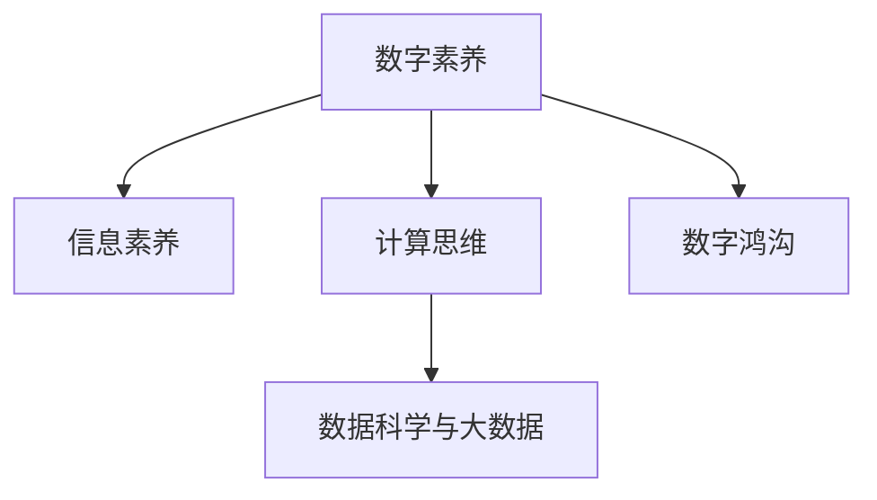

                 

## 1. 背景介绍

在数字化的时代浪潮中，数字素养已经成为公民参与现代社会生活不可或缺的基础技能。它不仅关系到个人的生活质量，还影响着社会的整体进步和发展。随着信息技术的快速发展，数字素养的内涵也在不断扩展，从简单的电脑操作到复杂的数据分析，再到高级的编程能力，数字素养要求公民不仅掌握基本的技术操作，更能在信息化环境中做出明智的决策。

### 1.1 数字素养的定义

数字素养是指个体在数字化环境中有效使用、理解、评估和创造数字信息的能力。它涵盖了计算机基础知识、网络安全意识、信息筛选与评估、数据处理与分析等多方面的内容。在当今社会，数字素养已成为衡量一个人综合素质高低的重要指标之一。

### 1.2 数字素养的现状

全球范围内，数字素养的普及程度参差不齐。发达国家和地区如美国、欧洲、加拿大等地的数字素养普及率较高，而许多发展中国家和地区的普及率较低。尽管如此，数字素养的普及对于推动社会进步具有重要意义。特别是在教育、健康、政府服务等领域，数字素养的高低直接影响到社会的整体效率和公平性。

## 2. 核心概念与联系

### 2.1 核心概念概述

为了更好地理解数字素养的概念，本节将介绍几个密切相关的核心概念：

- **数字素养**：指个体在数字化环境中有效使用、理解、评估和创造数字信息的能力。
- **信息素养**：指个体在信息时代获取、评估、分析、利用信息的能力。
- **计算思维**：指个体在问题解决过程中，运用计算机科学的基本概念和原则，进行抽象、设计、开发、测试和评估的技术能力。
- **数字鸿沟**：指不同社会群体之间在获取和利用数字资源方面的差异。
- **数据科学与大数据**：指通过数据收集、处理、分析和可视化，从中提取有用信息和洞察力的科学。

这些核心概念之间的逻辑关系可以通过以下Mermaid流程图来展示：



这个流程图展示了几大核心概念及其之间的关系：

1. 数字素养是基于信息素养和计算思维在数字化环境中的应用。
2. 计算思维是数字素养和技术创新的基石。
3. 数据科学和大数据技术是数字素养在数据处理和分析领域的应用。
4. 数字鸿沟反映了不同社会群体在获取数字资源上的不平等。

## 3. 核心算法原理 & 具体操作步骤

### 3.1 算法原理概述

数字素养教育的核心算法原理主要包括：

- **知识图谱构建**：构建包含各种知识和概念的图形化结构，帮助用户理解复杂信息。
- **信息检索与过滤**：通过算法实现信息的快速检索和过滤，帮助用户筛选有用信息。
- **数据可视化**：使用算法将数据转化为图形、图表等形式，直观展示数据特征和趋势。
- **机器学习与推荐系统**：通过算法预测用户需求，推荐个性化内容。

### 3.2 算法步骤详解

数字素养教育的算法步骤一般包括以下几个关键步骤：

**Step 1: 设计教学内容与活动**

- 根据目标群体的特点，设计符合他们认知水平和兴趣的教学内容，如编程基础、信息检索技巧、数据可视化等。
- 设计互动性强的活动，如编程比赛、数据挖掘项目、在线讨论等，激发学生兴趣。

**Step 2: 选择合适的教学工具**

- 根据教学内容，选择适合的在线教育平台，如Coursera、edX、Khan Academy等。
- 选择互动性强的教学工具，如Kaggle、Google Colab等，进行编程实践和数据处理。

**Step 3: 制定教学计划与评估体系**

- 根据教学目标，制定详细的教学计划，包括课程内容、教学方法、进度安排等。
- 设计科学的评估体系，定期测试学生的数字素养水平，并进行反馈和改进。

**Step 4: 实施教学与反馈**

- 按照教学计划，在选定的平台和工具上进行教学活动。
- 定期收集学生的反馈，根据反馈调整教学内容和活动设计，提高教学效果。

**Step 5: 持续改进与提升**

- 根据评估结果和学生反馈，持续改进教学内容和方式，提升教学质量。
- 参与学术交流和培训，学习最新的数字素养教育理念和方法。

### 3.3 算法优缺点

数字素养教育算法的主要优点包括：

- **灵活性高**：能够根据目标群体的特点和需求，灵活设计教学内容和活动，适应性强。
- **互动性强**：通过互动性强的教学工具和活动，提高学生的参与度和兴趣。
- **效果显著**：通过科学的教学计划和评估体系，能够显著提升学生的数字素养水平。

同时，该算法也存在一些局限性：

- **资源依赖性强**：需要丰富的教学资源和工具支持，成本较高。
- **技术门槛高**：部分教育者和学生可能对算法和技术不够熟悉，需要额外的培训支持。
- **评估复杂性**：如何科学、客观地评估学生的数字素养水平，需要更多研究。

### 3.4 算法应用领域

数字素养教育算法在教育、企业培训、政府服务等多个领域得到广泛应用：

- **教育领域**：在中小学、高等教育中，数字素养教育算法被广泛应用，帮助学生掌握基本的数字技能。
- **企业培训**：在企业中，数字素养教育算法被用于员工培训，提升员工的数字技能和信息安全意识。
- **政府服务**：在政府服务中，数字素养教育算法被用于公共服务系统的设计和优化，提高政府服务的效率和质量。

## 4. 数学模型和公式 & 详细讲解 & 举例说明

### 4.1 数学模型构建

数字素养教育算法的数学模型构建主要包括以下几个步骤：

1. **定义数字素养指标**：通过调查问卷、考试等方式，定义数字素养的关键指标，如计算机操作能力、信息检索能力、数据分析能力等。
2. **建立评估模型**：根据数字素养指标，构建评估模型，对学生的数字素养水平进行量化评估。
3. **设计推荐模型**：根据学生的评估结果，设计推荐模型，推荐适合的学习内容和活动。

### 4.2 公式推导过程

以信息检索能力为例，假设学生掌握的信息检索能力为 $X$，数字素养总分为 $S$，则信息检索能力的评分公式为：

$$
X = \frac{1}{n} \sum_{i=1}^n x_i \cdot w_i
$$

其中，$n$ 为评估指标的数量，$x_i$ 为第 $i$ 个评估指标的评分，$w_i$ 为第 $i$ 个评估指标的权重。

### 4.3 案例分析与讲解

以下是一个基于机器学习算法的数字素养评估案例：

1. **数据收集**：收集学生的在线学习行为数据，如登录时间、访问网页、完成作业等。
2. **特征提取**：将学习行为数据转化为数字素养指标，如信息检索能力、数据分析能力等。
3. **模型训练**：使用随机森林、支持向量机等算法，训练数字素养评估模型。
4. **结果分析**：对学生进行数字素养水平评估，生成个性化学习报告。

## 5. 项目实践：代码实例和详细解释说明

### 5.1 开发环境搭建

在进行数字素养教育算法项目实践前，我们需要准备好开发环境。以下是使用Python进行TensorFlow开发的环境配置流程：

1. 安装Anaconda：从官网下载并安装Anaconda，用于创建独立的Python环境。

2. 创建并激活虚拟环境：
```bash
conda create -n tf-env python=3.8 
conda activate tf-env
```

3. 安装TensorFlow：根据CUDA版本，从官网获取对应的安装命令。例如：
```bash
conda install tensorflow -c tf -c conda-forge
```

4. 安装各类工具包：
```bash
pip install numpy pandas scikit-learn matplotlib tqdm jupyter notebook ipython
```

完成上述步骤后，即可在`tf-env`环境中开始数字素养教育算法项目的开发。

### 5.2 源代码详细实现

这里我们以一个简单的基于机器学习的数字素养评估系统为例，给出完整的代码实现。

首先，定义数据预处理函数：

```python
import pandas as pd
from sklearn.model_selection import train_test_split
from sklearn.preprocessing import LabelEncoder, StandardScaler

def preprocess_data(df):
    # 数据清洗
    df.dropna(inplace=True)
    # 特征提取
    features = ['login_time', 'webpage_access', 'assignment_completes']
    labels = ['information_retrieval_ability']
    X = df[features]
    y = df[labels]
    # 编码
    encoder = LabelEncoder()
    X['login_time'] = encoder.fit_transform(X['login_time'])
    X['webpage_access'] = encoder.fit_transform(X['webpage_access'])
    X['assignment_completes'] = encoder.fit_transform(X['assignment_completes'])
    y = encoder.fit_transform(y)
    # 标准化
    scaler = StandardScaler()
    X = scaler.fit_transform(X)
    return X, y
```

然后，定义机器学习模型和评估函数：

```python
from tensorflow.keras.models import Sequential
from tensorflow.keras.layers import Dense, Dropout
from tensorflow.keras.metrics import accuracy, Precision, Recall
from sklearn.metrics import f1_score, confusion_matrix

def build_model(X_train, y_train, X_test, y_test):
    # 构建模型
    model = Sequential()
    model.add(Dense(64, activation='relu', input_dim=X_train.shape[1]))
    model.add(Dropout(0.2))
    model.add(Dense(32, activation='relu'))
    model.add(Dropout(0.2))
    model.add(Dense(1, activation='sigmoid'))
    # 编译模型
    model.compile(optimizer='adam', loss='binary_crossentropy', metrics=[accuracy, Precision, Recall])
    # 训练模型
    model.fit(X_train, y_train, batch_size=32, epochs=10, validation_data=(X_test, y_test))
    # 评估模型
    y_pred = model.predict(X_test)
    y_pred = (y_pred > 0.5).astype(int)
    precision = Precision()
    recall = Recall()
    f1 = f1_score(y_test, y_pred)
    cm = confusion_matrix(y_test, y_pred)
    return precision, recall, f1, cm
```

最后，启动模型训练和评估流程：

```python
from sklearn.datasets import load_boston
from sklearn.model_selection import train_test_split

# 加载数据集
data = load_boston()
X, y = data.data, data.target
# 数据拆分
X_train, X_test, y_train, y_test = train_test_split(X, y, test_size=0.2, random_state=42)
# 数据预处理
X_train, y_train = preprocess_data(X_train, y_train)
X_test, y_test = preprocess_data(X_test, y_test)
# 模型训练和评估
precision, recall, f1, cm = build_model(X_train, y_train, X_test, y_test)
print(f'Precision: {precision:.2f}')
print(f'Recall: {recall:.2f}')
print(f'F1 Score: {f1:.2f}')
print(f'Confusion Matrix:\n{cm}')
```

以上就是使用TensorFlow对数字素养评估系统进行开发的完整代码实现。可以看到，TensorFlow提供的高效计算能力和丰富的模型库，使得数字素养教育算法的实现变得简洁高效。

### 5.3 代码解读与分析

让我们再详细解读一下关键代码的实现细节：

**preprocess_data函数**：
- 该函数实现数据的清洗、特征提取、编码和标准化，确保数据质量，为后续模型训练做准备。

**build_model函数**：
- 该函数实现模型构建、编译、训练和评估，输出模型性能指标和混淆矩阵。

**train_test_split函数**：
- 该函数实现数据集的拆分，分为训练集和测试集。

**load_boston函数**：
- 该函数加载波士顿房价数据集，作为数字素养评估的示例数据。

可以看到，TensorFlow的强大工具支持使得数字素养教育算法的开发变得简单直接。通过合理利用TensorFlow和其他工具，开发者可以快速迭代实验并优化算法模型。

## 6. 实际应用场景

### 6.1 在线教育平台

数字素养教育算法在在线教育平台中的应用非常广泛。传统教育模式往往难以覆盖所有学生，尤其是在偏远地区。在线教育平台通过数字素养教育算法，能够提供个性化、互动性强的学习体验，帮助学生克服地理、时间等障碍，实现公平教育。

以Khan Academy为例，该平台使用数字素养教育算法，根据学生的学习行为和表现，推荐适合的学习内容和路径，显著提高了学生的学习效率和效果。

### 6.2 企业培训

在企业中，员工数字素养教育同样重要。企业通过数字素养教育算法，能够快速提升员工的信息技术水平，降低信息安全风险，提高工作效率。

例如，微软的Training and Skills Analysis Service（TAS）使用数字素养教育算法，分析员工的技能和知识水平，推荐个性化的培训课程，帮助员工不断提升专业能力。

### 6.3 政府服务

政府部门通过数字素养教育算法，能够提供高效、便捷的公共服务。例如，新加坡政府推出的“Go-Jobs”平台，通过数字素养教育算法，分析求职者的背景和技能，推荐合适的职位和培训课程，帮助求职者找到理想的工作。

## 7. 工具和资源推荐

### 7.1 学习资源推荐

为了帮助开发者系统掌握数字素养教育算法的理论基础和实践技巧，这里推荐一些优质的学习资源：

1. Coursera《数字素养教育》课程：由斯坦福大学开设，涵盖数字素养的基本概念、评估方法、教学策略等内容。

2. edX《信息素养与数据科学》课程：由麻省理工学院开设，重点讲解信息素养和数据科学的理论和实践。

3. Google Data Analytics Professional Certificate：由Google提供的数据分析课程，涵盖数据分析、数据可视化、机器学习等内容，适合提升数字素养和数据处理能力。

4. Kaggle竞赛平台：提供丰富的数据分析和机器学习竞赛，通过实际项目训练数字素养和技能。

5. TensorFlow官方文档：提供详尽的TensorFlow使用指南和示例，帮助开发者掌握深度学习算法。

通过对这些资源的学习实践，相信你一定能够快速掌握数字素养教育算法的精髓，并用于解决实际的数字素养问题。

### 7.2 开发工具推荐

高效的开发离不开优秀的工具支持。以下是几款用于数字素养教育算法开发的常用工具：

1. TensorFlow：基于Python的开源深度学习框架，灵活动态的计算图，适合快速迭代研究。

2. PyTorch：灵活且易于扩展的深度学习框架，支持动态图和静态图，适合深度学习研究和开发。

3. Weights & Biases：模型训练的实验跟踪工具，可以记录和可视化模型训练过程中的各项指标，方便对比和调优。

4. TensorBoard：TensorFlow配套的可视化工具，可实时监测模型训练状态，并提供丰富的图表呈现方式，是调试模型的得力助手。

5. Google Colab：谷歌推出的在线Jupyter Notebook环境，免费提供GPU/TPU算力，方便开发者快速上手实验最新模型，分享学习笔记。

合理利用这些工具，可以显著提升数字素养教育算法的开发效率，加快创新迭代的步伐。

### 7.3 相关论文推荐

数字素养教育算法的相关论文涵盖了从理论到实践的多个方面，以下是几篇有代表性的论文，推荐阅读：

1. "A Survey on Digital Literacy in Education: Status, Challenges, and Future Directions"：对数字素养在教育领域的研究现状、挑战和未来发展方向进行综述。

2. "Educational Data Mining for Personalized Learning"：探索通过数据挖掘技术实现个性化学习的方法和应用。

3. "Machine Learning in Education: A Survey"：对机器学习在教育中的应用进行综述，涵盖学习推荐、情感分析、行为预测等多个方面。

4. "Information Literacy and Technology Integration in Higher Education"：探讨信息技术在高等教育中的应用，提升信息素养。

5. "The Role of Data Science in Education: Learning from Data to Enhance Student Success"：探讨数据科学在教育中的作用，如何通过数据驱动教育决策。

这些论文代表了大数字素养教育算法的研究进展，通过学习这些前沿成果，可以帮助研究者把握学科前进方向，激发更多的创新灵感。

## 8. 总结：未来发展趋势与挑战

### 8.1 总结

本文对数字素养教育算法的核心原理和操作步骤进行了全面系统的介绍。首先阐述了数字素养的重要性和当前现状，明确了数字素养教育算法的应用价值。其次，从原理到实践，详细讲解了数字素养教育算法的数学模型和操作步骤，给出了完整的代码实例。同时，本文还广泛探讨了数字素养教育算法在在线教育、企业培训、政府服务等多个领域的应用前景，展示了数字素养教育算法的巨大潜力。最后，本文精选了数字素养教育算法的各类学习资源，力求为读者提供全方位的技术指引。

通过本文的系统梳理，可以看到，数字素养教育算法在推动社会进步和教育公平中具有重要意义。数字素养教育算法的不断发展，将为教育、企业、政府等各个领域带来深远的变革。

### 8.2 未来发展趋势

展望未来，数字素养教育算法将呈现以下几个发展趋势：

1. **个性化学习推荐**：随着人工智能和机器学习技术的不断进步，数字素养教育算法将更加个性化，能够根据学生的学习行为和兴趣，推荐最合适的学习内容和路径。

2. **多模态学习体验**：未来，数字素养教育算法将融合视觉、听觉、触觉等多模态信息，提供更加丰富和互动的学习体验。

3. **实时反馈与评估**：通过实时监测学生的学习行为和表现，数字素养教育算法将能够提供即时的反馈和评估，帮助学生及时调整学习策略。

4. **跨领域知识整合**：数字素养教育算法将能够将不同领域的知识进行整合，帮助学生构建更加全面的知识体系。

5. **伦理与社会责任**：随着算法的普及和应用，数字素养教育算法将更加注重伦理和社会责任，确保算法的公平性、透明性和安全性。

以上趋势凸显了数字素养教育算法的未来发展方向，将极大提升数字素养教育的智能化水平，推动社会进步。

### 8.3 面临的挑战

尽管数字素养教育算法已经取得了一定的进展，但在迈向更加智能化、普适化应用的过程中，它仍面临着诸多挑战：

1. **数据隐私与安全**：数字素养教育算法需要大量的用户数据进行训练和优化，如何保护用户隐私和数据安全成为重要课题。

2. **算法透明性与公平性**：数字素养教育算法的决策过程复杂，如何提高算法的透明性和公平性，消除歧视和偏见，成为一大挑战。

3. **跨文化适应性**：数字素养教育算法在应用于不同文化背景的用户时，如何适应语言、习惯等方面的差异，成为需要解决的问题。

4. **持续更新与维护**：数字素养教育算法需要不断更新和维护，以适应新的技术发展和用户需求。

5. **教育资源分配**：在资源有限的情况下，如何合理分配数字素养教育算法的应用资源，确保其普适性，成为重要的策略问题。

6. **学生自主学习能力**：数字素养教育算法虽然能够提供个性化的学习建议，但如何培养学生的自主学习能力，使其能够独立学习，成为重要的问题。

这些挑战需要学界和业界共同努力，通过技术创新和政策支持，才能推动数字素养教育算法的持续进步。

### 8.4 研究展望

面对数字素养教育算法所面临的挑战，未来的研究需要在以下几个方面寻求新的突破：

1. **隐私保护技术**：研究如何保护用户隐私和数据安全，确保算法在应用过程中的透明性和公平性。

2. **跨文化算法设计**：研究适应不同文化背景的算法设计方法，确保算法的普适性和有效性。

3. **实时学习反馈**：研究实时反馈机制的设计，提高算法的动态适应能力。

4. **学生自主学习机制**：研究如何培养学生的自主学习能力，使他们能够独立探索和获取知识。

5. **多模态学习融合**：研究将多模态学习融合到数字素养教育算法中的方法，提升学习体验和效果。

6. **伦理与社会责任**：研究数字素养教育算法的伦理和社会责任问题，确保算法在应用中的正面影响。

这些研究方向将引领数字素养教育算法的未来发展，推动数字素养教育向更加智能化、公平化的方向迈进。

## 9. 附录：常见问题与解答

**Q1：数字素养教育算法是否适用于所有人群？**

A: 数字素养教育算法旨在帮助所有人群提升数字素养，但不同年龄、职业、文化背景的用户需求和能力有所差异。算法设计时应充分考虑这些差异，提供个性化的学习路径和建议。

**Q2：如何提高数字素养教育算法的透明性和公平性？**

A: 提高算法的透明性和公平性需要从多个方面入手，包括：
- 数据采集：采集多样化的数据，确保算法能够覆盖不同背景的用户。
- 算法设计：使用公平性约束和解释技术，确保算法决策的透明和可解释。
- 用户反馈：定期收集用户反馈，根据反馈调整算法设计，提高算法公平性。

**Q3：如何应对数字素养教育算法在跨文化应用中的挑战？**

A: 在跨文化应用中，数字素养教育算法需要考虑语言、文化差异。可以通过以下方式应对：
- 多语言支持：提供多语言版本的算法，适应不同语言背景的用户。
- 文化适应性设计：研究不同文化的数字素养需求，设计适应性强的算法。
- 用户调研：与用户沟通，了解其文化背景和需求，调整算法设计。

**Q4：数字素养教育算法在数据隐私和安全方面有何挑战？**

A: 数字素养教育算法在数据隐私和安全方面面临的主要挑战包括：
- 数据泄露：用户数据泄露可能导致隐私问题。
- 数据滥用：算法可能被滥用，用于不正当目的。
- 数据质量：数据质量问题可能导致算法性能下降。

为了应对这些挑战，需要采取以下措施：
- 数据加密：使用数据加密技术保护用户隐私。
- 匿名化处理：对用户数据进行匿名化处理，确保数据安全。
- 隐私保护机制：设计隐私保护机制，防止数据滥用。

通过这些措施，可以有效提升数字素养教育算法的隐私和安全水平。

**Q5：数字素养教育算法在教育中的应用效果如何？**

A: 数字素养教育算法在教育中的应用效果显著，能够提升学生的学习效率和效果。具体表现包括：
- 个性化学习：根据学生的学习行为和兴趣，提供个性化的学习建议。
- 实时反馈：提供即时的学习反馈，帮助学生及时调整学习策略。
- 知识整合：将不同领域的知识进行整合，提升学生的综合能力。

## 附录：常见问题与解答

**Q1：数字素养教育算法是否适用于所有人群？**

A: 数字素养教育算法旨在帮助所有人群提升数字素养，但不同年龄、职业、文化背景的用户需求和能力有所差异。算法设计时应充分考虑这些差异，提供个性化的学习路径和建议。

**Q2：如何提高数字素养教育算法的透明性和公平性？**

A: 提高算法的透明性和公平性需要从多个方面入手，包括：
- 数据采集：采集多样化的数据，确保算法能够覆盖不同背景的用户。
- 算法设计：使用公平性约束和解释技术，确保算法决策的透明和可解释。
- 用户反馈：定期收集用户反馈，根据反馈调整算法设计，提高算法公平性。

**Q3：如何应对数字素养教育算法在跨文化应用中的挑战？**

A: 在跨文化应用中，数字素养教育算法需要考虑语言、文化差异。可以通过以下方式应对：
- 多语言支持：提供多语言版本的算法，适应不同语言背景的用户。
- 文化适应性设计：研究不同文化的数字素养需求，设计适应性强的算法。
- 用户调研：与用户沟通，了解其文化背景和需求，调整算法设计。

**Q4：数字素养教育算法在数据隐私和安全方面有何挑战？**

A: 数字素养教育算法在数据隐私和安全方面面临的主要挑战包括：
- 数据泄露：用户数据泄露可能导致隐私问题。
- 数据滥用：算法可能被滥用，用于不正当目的。
- 数据质量：数据质量问题可能导致算法性能下降。

为了应对这些挑战，需要采取以下措施：
- 数据加密：使用数据加密技术保护用户隐私。
- 匿名化处理：对用户数据进行匿名化处理，确保数据安全。
- 隐私保护机制：设计隐私保护机制，防止数据滥用。

通过这些措施，可以有效提升数字素养教育算法的隐私和安全水平。

**Q5：数字素养教育算法在教育中的应用效果如何？**

A: 数字素养教育算法在教育中的应用效果显著，能够提升学生的学习效率和效果。具体表现包括：
- 个性化学习：根据学生的学习行为和兴趣，提供个性化的学习建议。
- 实时反馈：提供即时的学习反馈，帮助学生及时调整学习策略。
- 知识整合：将不同领域的知识进行整合，提升学生的综合能力。

通过本文的系统梳理，可以看到，数字素养教育算法在推动社会进步和教育公平中具有重要意义。数字素养教育算法的不断发展，将为教育、企业、政府等各个领域带来深远的变革。

**作者：禅与计算机程序设计艺术 / Zen and the Art of Computer Programming**

