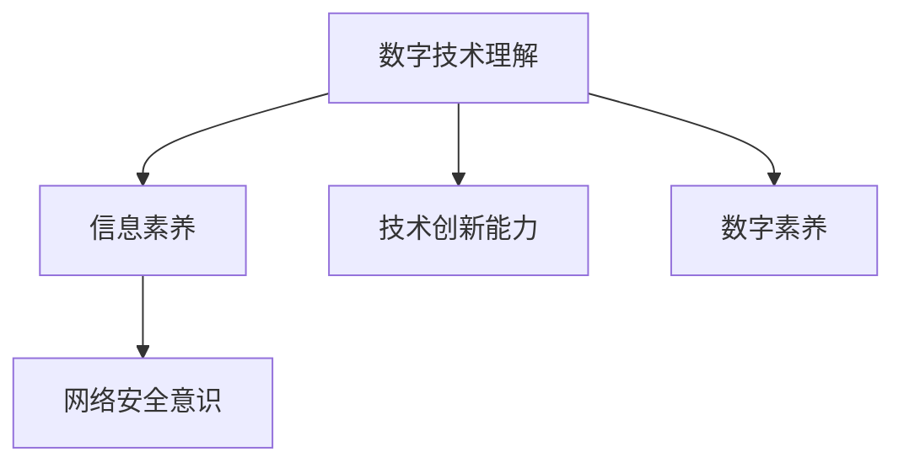

                 

# 数字素养：公民参与的基石

## 1. 背景介绍

### 1.1 问题由来
随着数字化进程的加速，数字素养成为现代公民的基本素质之一。从智能家居到在线教育，从远程办公到社交网络，数字技术渗透到生活的方方面面。然而，数字素养的缺乏，导致许多人无法充分利用数字技术，甚至成为数字鸿沟的加深因素。数字素养的普及和提升，关乎社会公平与包容，是数字时代公民参与的重要基石。

### 1.2 问题核心关键点
数字素养的核心关键点在于理解和应用数字技术的能力。包括：

- **技术理解**：对数字技术的基本原理和应用场景有基本的了解。
- **信息评估**：能够识别信息的来源、真实性和可靠性。
- **安全意识**：知晓网络安全风险，并采取相应的防护措施。
- **创新应用**：能够创造性地使用数字技术解决实际问题。

本文将从数字素养的概念出发，详细探讨其核心要素、构建路径及其在公民参与中的作用。

## 2. 核心概念与联系

### 2.1 核心概念概述

数字素养(Digital Literacy)是指个体理解、评估、应用和创造数字技术的能力。其核心在于：

- **数字技术理解**：掌握数字技术的基本原理和操作技能。
- **信息素养**：识别、评估和管理数字信息的能力。
- **网络安全意识**：防范网络风险，保护个人信息安全。
- **技术创新能力**：创造性地应用数字技术解决实际问题。

这些核心要素之间具有紧密的联系，共同构成了数字素养的全貌。

### 2.2 核心概念原理和架构的 Mermaid 流程图



这个流程图展示了数字素养的构成要素及其相互关系。

## 3. 核心算法原理 & 具体操作步骤

### 3.1 算法原理概述

数字素养的培养过程，本质上是一个持续学习、应用和创新的过程。通过设计系统化、层次化的教学方案，结合实践操作和反馈机制，可以有效提升个体的数字素养水平。

其核心算法原理包括：

- **知识图谱构建**：建立数字技术、信息管理和网络安全等知识点的知识图谱，帮助学习者系统掌握相关知识。
- **交互式学习**：采用游戏化、任务导向的学习方式，通过实践和反馈不断提升学习效果。
- **个性化推荐**：根据学习者的兴趣和进度，推荐个性化的学习资源和任务。
- **技能评估**：通过定量和定性的评估手段，全面了解学习者的掌握情况。

### 3.2 算法步骤详解

数字素养的培养流程一般包括以下几个关键步骤：

**Step 1: 需求分析**
- 确定目标人群的基本信息素养需求，设计相应的教学目标和评估标准。

**Step 2: 课程设计**
- 设计多层次、多维度的课程体系，包括理论学习、实践操作、案例分析等环节。
- 引入交互式学习平台，支持在线视频、互动问答、作业提交等多样化学习方式。

**Step 3: 资源开发**
- 开发高质量的学习资源，包括在线课程、练习题库、案例分析等。
- 引入虚拟现实(VR)、增强现实(AR)等技术，提升学习体验和效果。

**Step 4: 实践应用**
- 安排定期的实践项目，鼓励学习者将所学知识应用到实际问题中。
- 组织线上线下相结合的实践活动，增强学习者的综合应用能力。

**Step 5: 反馈改进**
- 定期收集学习者的反馈，评估课程和资源的效果。
- 根据反馈意见调整教学策略，持续优化课程内容和资源。

### 3.3 算法优缺点

数字素养培养的优势在于：

- **个性化定制**：通过个性化的学习路径和资源推荐，满足不同学习者的需求。
- **实践导向**：强调实践应用，学习者能够在实际问题中深化理解。
- **互动性强**：通过在线互动和反馈机制，增强学习效果和动力。

然而，数字素养培养也面临一些挑战：

- **资源需求高**：高质量的教学资源开发成本较高，需要大量人力物力投入。
- **技术门槛高**：部分学习者可能缺乏必要的技术条件，如网络、设备等。
- **效果评估难**：数字素养的效果难以量化，评估难度较大。

### 3.4 算法应用领域

数字素养培养在多个领域都有广泛应用，例如：

- **教育培训**：在基础教育、职业培训等领域推广数字素养教育，提升全民数字素养水平。
- **企业培训**：在企业内部实施数字素养培训，提升员工的技术应用能力和创新能力。
- **社会公益**：面向社区和弱势群体提供数字素养培训，促进社会公平与包容。
- **公共服务**：通过在线服务平台提供数字素养教育资源，服务公众学习。

## 4. 数学模型和公式 & 详细讲解 & 举例说明

### 4.1 数学模型构建

数字素养评估模型可以表示为：

$$
\text{Digital Literacy} = \text{Technical Understanding} + \text{Information Proficiency} + \text{Cybersecurity Awareness} + \text{Innovative Application}
$$

### 4.2 公式推导过程

具体推导过程如下：

1. **技术理解**：
   $$
   \text{Technical Understanding} = \sum_{i=1}^n f_i(U_i)
   $$
   其中 $f_i$ 为技术理解能力的函数，$U_i$ 为第 $i$ 个技术知识点。

2. **信息素养**：
   $$
   \text{Information Proficiency} = \sum_{j=1}^m g_j(I_j)
   $$
   其中 $g_j$ 为信息素养能力的函数，$I_j$ 为第 $j$ 个信息评估知识点。

3. **网络安全意识**：
   $$
   \text{Cybersecurity Awareness} = \sum_{k=1}^o h_k(C_k)
   $$
   其中 $h_k$ 为网络安全意识能力的函数，$C_k$ 为第 $k$ 个网络安全知识点。

4. **技术创新能力**：
   $$
   \text{Innovative Application} = \sum_{l=1}^p j_l(A_l)
   $$
   其中 $j_l$ 为技术创新能力的函数，$A_l$ 为第 $l$ 个应用创新知识点。

### 4.3 案例分析与讲解

以在线教育平台为例，通过以下案例分析数字素养培养的具体实现：

1. **技术理解课程**：
   - **课程内容**：介绍数字设备的基础知识，如电脑、手机等的使用技巧。
   - **实践活动**：通过虚拟现实模拟实验，如VR编程课程，加深学习者的技术理解。

2. **信息素养培训**：
   - **课程内容**：讲解搜索引擎的使用方法，评估网页可靠性的技巧。
   - **实践活动**：设计信息检索任务，学习者需根据关键词查找相关信息，并评估信息来源的真实性。

3. **网络安全教育**：
   - **课程内容**：教授密码管理、防病毒软件的使用方法。
   - **实践活动**：通过模拟钓鱼攻击，测试学习者的安全意识和防护能力。

4. **技术创新项目**：
   - **课程内容**：学习者通过团队合作，设计并实现一个小型应用程序。
   - **实践活动**：定期展示学习者的项目成果，进行同行评审，提升创新能力。

## 5. 项目实践：代码实例和详细解释说明

### 5.1 开发环境搭建

搭建数字素养培养项目开发环境，主要包括以下步骤：

1. **安装开发工具**：
   - Python 3.x
   - Django 或 Flask 框架
   - MySQL 或 PostgreSQL 数据库
   - Git 版本控制

2. **配置环境**：
   - 创建虚拟环境：
   ```bash
   python -m venv env
   source env/bin/activate
   ```

3. **依赖安装**：
   ```bash
   pip install django psycopg2-cffi markdown django-crispy-forms django-compressor
   ```

### 5.2 源代码详细实现

以下是一个简单的数字素养评估系统的代码实现：

1. **创建 Django 项目和应用**：
   ```bash
   django-admin startproject digital_literacy
   cd digital_literacy
   python manage.py startapp literacy_assessment
   ```

2. **编写模型和视图**：
   ```python
   from django.db import models
   from django.urls import path
   from .forms import LiteracyForm

   class Literacy(models.Model):
       name = models.CharField(max_length=50)
       score = models.FloatField()

       def __str__(self):
           return self.name

   def literacy_view(request):
       if request.method == 'POST':
           form = LiteracyForm(request.POST)
           if form.is_valid():
               form.save()
               return redirect('home')
       else:
           form = LiteracyForm()
       return render(request, 'lit_assessment.html', {'form': form})

   urlpatterns = [
       path('lit-assessment/', literacy_view, name='lit_assessment'),
   ]
   ```

3. **创建表单**：
   ```python
   from django import forms

   class LiteracyForm(forms.Form):
       name = forms.CharField(max_length=50)
       score = forms.FloatField()

   def clean_score(self):
       score = self.cleaned_data['score']
       if score < 0 or score > 100:
           raise forms.ValidationError("Score must be between 0 and 100")
       return score
   ```

4. **创建模板**：
   ```html
   <!-- lit_assessment.html -->
   <h1>Literacy Assessment</h1>
   <form method="post">
       
       {{ form.as_p }}
       <button type="submit">Submit</button>
   </form>
   ```

### 5.3 代码解读与分析

此代码实现了一个基本的数字素养评估系统，学习者可以通过输入姓名和评分提交自己的数字素养评估结果。其中：

- **模型设计**：定义了 `Literacy` 模型，存储学习者的评估信息。
- **视图实现**：实现了 `lit_assessment` 视图，用于接收并处理学习者的提交信息。
- **表单设计**：创建了 `LiteracyForm` 表单，包含姓名和评分两个字段。
- **模板设计**：创建了 `lit_assessment.html` 模板，用于显示表单和提交按钮。

### 5.4 运行结果展示

运行项目后，在浏览器中输入 `localhost:8000/lit-assessment/`，即可访问评估页面。学习者输入相关信息后提交，系统将保存其评估结果。

## 6. 实际应用场景

### 6.1 教育领域

在教育领域，数字素养是信息时代必备的基础技能。学校和培训机构可以借助数字素养培养平台，提升学生的技术应用和创新能力，为他们未来就业和生活奠定坚实基础。

例如，某高校开发了基于数字素养评估的在线学习平台，将数字素养教育纳入课程体系，通过实践项目和互动反馈，帮助学生系统掌握数字技术的应用。

### 6.2 企业培训

企业内部培训是提升员工数字素养的重要途径。通过定制化的培训课程和实践活动，帮助员工提高技术应用能力，激发创新意识。

某科技公司为提升员工数字素养，开发了内部培训平台，定期组织员工参与数字素养培训课程，并通过实际项目和竞赛，激励员工持续学习和提升。

### 6.3 社会公益

社会公益项目可以面向弱势群体提供数字素养培训，促进社会公平和包容。

例如，某非营利组织利用数字素养培训平台，为农村和欠发达地区的儿童提供免费的在线学习资源，提升他们的数字素养水平。

### 6.4 公共服务

公共服务领域可以通过数字素养培训，帮助公众更好地使用数字政府服务，提升社会治理效率。

例如，某城市政府利用数字素养培训平台，为市民提供免费的数字素养课程，帮助他们更好地使用城市在线服务，提升生活质量。

## 7. 工具和资源推荐

### 7.1 学习资源推荐

1. **Khan Academy**：提供在线编程、信息素养和网络安全等课程，适合不同年龄段的学习者。
2. **edX**：提供大学级别的数字素养课程，涵盖技术理解、信息评估和创新应用等主题。
3. **Coursera**：提供多门数字素养相关课程，包括数据科学、人工智能和网络安全等。
4. **Google Digital Garage**：提供免费数字素养培训课程，涵盖技术基础、在线广告和数字安全等主题。
5. **Udacity**：提供数字素养和职业发展课程，帮助学习者提升技术应用和创新能力。

### 7.2 开发工具推荐

1. **Django**：开源的 Python Web 框架，支持快速开发和部署数字素养评估系统。
2. **Flask**：轻量级 Python Web 框架，适合开发小型数字素养培训平台。
3. **Jupyter Notebook**：交互式编程环境，适合进行数据分析和案例分析。
4. **GitHub**：代码托管平台，方便团队协作和版本控制。
5. **Google Colab**：云平台，提供免费的GPU和TPU算力，支持在线实验和课程开发。

### 7.3 相关论文推荐

1. **The Importance of Digital Literacy in the Age of Digitalization**：讨论数字素养在数字化时代的意义和作用。
2. **A Comparative Study of Digital Literacy Programs**：比较不同国家数字素养教育项目的实施效果。
3. **Developing Digital Literacy Skills through Game-based Learning**：探讨游戏化学习对提升数字素养的作用。
4. **Assessing Digital Literacy Skills: A Framework for Evaluation**：提出数字素养评估的框架和方法。
5. **Enhancing Cybersecurity Awareness in the Digital Age**：讨论网络安全教育的重要性及实施策略。

## 8. 总结：未来发展趋势与挑战

### 8.1 研究成果总结

数字素养培养已取得显著成果，在教育、企业和社会各个领域得到了广泛应用。其核心在于系统化的教学设计、个性化的学习路径和互动化的反馈机制。

### 8.2 未来发展趋势

未来数字素养培养将呈现以下发展趋势：

1. **智能化**：通过AI和大数据分析，提供更加个性化的学习推荐和评估反馈。
2. **泛在化**：利用移动设备和智能家居等终端，实现随时随地学习。
3. **标准化**：制定数字素养教育标准，推动全球数字素养的普及和提升。
4. **国际化**：面向不同文化背景的学习者，开发多语言和多文化的学习资源。
5. **融合化**：与其他学科和技能培训相结合，形成综合素养的培养体系。

### 8.3 面临的挑战

尽管数字素养培养取得了不少进展，但仍面临以下挑战：

1. **资源不均衡**：城乡、地区间数字资源的差距，导致教育机会不平等。
2. **技术门槛高**：部分弱势群体可能缺乏必要的数字设备和互联网接入。
3. **内容更新慢**：数字技术和应用快速发展，教学内容更新滞后。
4. **评估难度大**：数字素养的效果难以量化，评估难度较大。
5. **隐私和安全**：数字素养培训涉及大量个人信息，隐私和安全问题需妥善处理。

### 8.4 研究展望

未来数字素养培养的研究方向包括：

1. **多模态学习**：结合文本、图像、视频等多种形式的学习资源，提升学习效果。
2. **跨学科融合**：与其他学科技能相结合，形成综合素养培养体系。
3. **开放教育资源**：推广开放教育资源，降低数字素养培训的门槛。
4. **个性化学习**：利用AI和大数据技术，提供个性化学习路径和评估反馈。
5. **终身学习**：建立终身学习机制，促进数字素养终身发展。

总之，数字素养是数字时代公民参与的重要基石，其培养需要多方协同，持续推动技术和教育创新，才能更好地服务社会和公众。

## 9. 附录：常见问题与解答

**Q1: 数字素养培养与传统教育有什么区别？**

A: 数字素养培养强调技术理解、信息素养、网络安全意识和创新应用，而传统教育更侧重于知识传授和技能训练。数字素养培养通过实践和应用，帮助学习者更好地理解和应用数字技术。

**Q2: 如何评估数字素养的培养效果？**

A: 数字素养的评估可以从多个维度进行，包括技术理解、信息素养、网络安全意识和创新应用等。可以通过在线测试、实践项目和同行评审等多种方式进行评估。

**Q3: 数字素养培养的资源需求有哪些？**

A: 高质量的教学资源开发、专业的技术支持、先进的硬件设备等都是数字素养培养的资源需求。同时，还需要有稳定的互联网接入和一定的技术素养。

**Q4: 数字素养培养的实施难点有哪些？**

A: 数字素养培养的实施难点包括资源不均衡、技术门槛高、内容更新慢、评估难度大、隐私和安全问题等。需要多方协同，共同解决这些挑战。

---

作者：禅与计算机程序设计艺术 / Zen and the Art of Computer Programming

