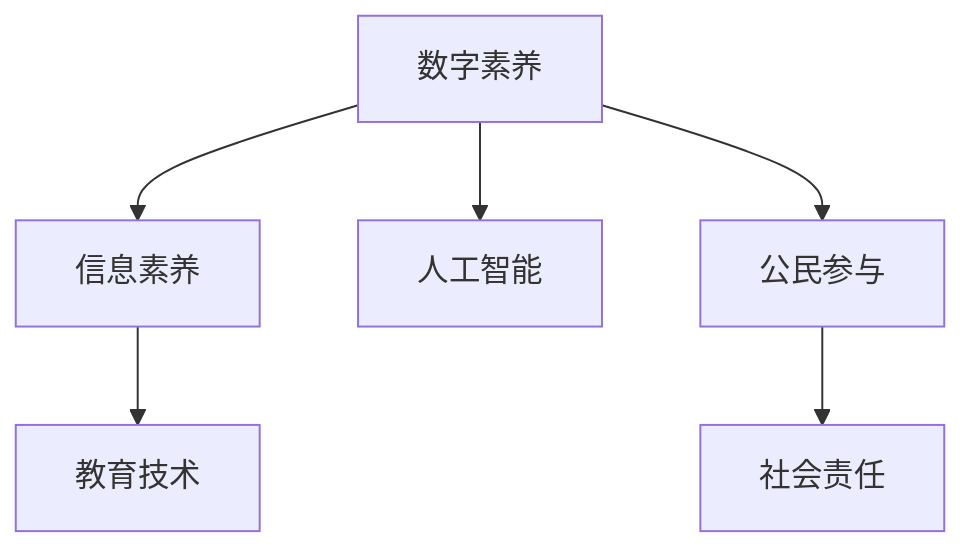

                 

# 数字素养：公民参与的基石

> 关键词：数字素养, 公民参与, 人工智能, 教育技术, 信息素养, 社会责任

## 1. 背景介绍

### 1.1 问题由来

在数字化时代，信息爆炸和网络空间日益成为人类社会的重要组成部分。全球信息基础设施的发展，使人们能够实时获取和共享信息，但也带来了新的挑战。数字素养成为了公民参与和实现数字权利的关键。

### 1.2 问题核心关键点

数字素养不仅仅是指掌握基本的信息技术操作，更包括对数字技术和互联网信息环境的认知、判断、使用和评估能力。它关乎公民在数字世界中的安全、隐私、道德与法律责任，以及他们在数字社会中的参与度和影响力。

## 2. 核心概念与联系

### 2.1 核心概念概述

- **数字素养**：指个体理解、使用和管理数字技术的能力，包括基本的信息技术操作、批判性思维、信息评估与判断、数据隐私和安全保护等。
- **公民参与**：指公民通过各种渠道和方式，在公共事务和决策过程中发表意见、表达诉求，以及影响政策、制度和公共生活。
- **人工智能**：利用机器学习、深度学习等算法，模拟、延伸和扩展人的智能，使其能够执行复杂任务。
- **教育技术**：应用信息技术改进教育教学过程，促进知识的获取、处理和应用。
- **信息素养**：指个体获取、评价、利用和管理信息的能力，涵盖信息的识别、评估、分析和应用等。
- **社会责任**：指个体在数字环境中的行为标准和规范，包括尊重隐私、数据安全、诚信与公平等。

这些概念之间相互关联，共同构成了数字时代的公民素养模型。数字素养和信息素养的提升，使得个体在数字社会中能够更加安全、高效地使用技术；而公民参与则要求个体具备基本的数字素养，才能有效地表达观点、参与公共事务，发挥社会责任。

### 2.2 核心概念原理和架构的 Mermaid 流程图



## 3. 核心算法原理 & 具体操作步骤

### 3.1 算法原理概述

数字素养的核心在于培养个体对数字技术的理解、批判性思维和信息评估能力。通过有针对性的教育训练和实践操作，个体能够在数字化环境中识别信息、评估其真实性和可靠性，保护个人隐私，理解技术的社会影响。

### 3.2 算法步骤详解

**Step 1: 评估数字素养现状**

首先，需要通过问卷调查、访谈等手段，评估当前公民的数字素养水平。识别出他们在哪些方面具备优势，哪些方面存在不足，为后续的培训提供依据。

**Step 2: 设计数字素养培训课程**

基于评估结果，设计结构化的培训课程，涵盖基本的计算机操作、信息检索与评估、网络安全、隐私保护等主题。通过理论讲授与实践操作相结合，提升公民的数字素养。

**Step 3: 引入人工智能辅助教学**

利用AI技术，如智能推荐系统、自适应学习平台，根据学习者的个性化需求提供定制化的学习内容。使用自然语言处理技术，对学习者的反馈进行实时分析，调整教学策略。

**Step 4: 实践操作与项目作业**

设计实践操作和项目作业，使学习者在真实场景中应用所学知识。例如，开展网络安全实验、进行信息评估练习、参与在线讨论等，提升实际操作能力。

**Step 5: 持续评估与反馈**

培训结束后，持续跟踪学习者的应用情况，收集反馈意见，评估培训效果。使用数据分析工具，对学习效果进行量化评估，不断改进培训方案。

### 3.3 算法优缺点

**优点**：
- 结构化培训：通过设计系统的课程体系，逐步提升学习者的数字素养。
- 个性化学习：利用AI技术，为每个学习者提供定制化的学习路径。
- 实践导向：通过实际操作和项目作业，加深学习者的理解和记忆。
- 持续评估：通过持续跟踪和反馈，不断改进培训效果。

**缺点**：
- 资源投入大：培训需要设计课程、开发教材、搭建平台等，初期投入较高。
- 适用性有限：培训内容和方法需要根据不同地区的教育水平和文化背景进行调整，推广难度大。
- 依赖技术：培训效果受到技术和资源条件的限制，无法覆盖所有学习者。

### 3.4 算法应用领域

数字素养培训适用于多种应用场景，包括但不限于：
- 学校教育：从小学到大学，涵盖基础计算机操作、信息素养、安全保护等。
- 社区培训：面向社区居民，提升他们在使用网络、在线服务等方面的能力。
- 企业培训：为员工提供数字工具使用、数据处理、安全防范等方面的培训。
- 社会公益：针对弱势群体、老年人等特殊群体，提供量身定制的数字素养教育。

## 4. 数学模型和公式 & 详细讲解

### 4.1 数学模型构建

数字素养模型的构建基于对数字素养维度的划分。根据国际电信联盟(ITU)和联合国教科文组织(UNESCO)的研究，数字素养主要包括以下六个维度：

1. **信息获取与处理**：指个体获取、检索、筛选和处理信息的能力。
2. **信息评估与判断**：指个体对信息的真实性、可靠性和相关性的评估能力。
3. **信息创建与传播**：指个体利用数字技术创建和传播信息的能力。
4. **信息安全与隐私保护**：指个体对网络安全和数据隐私的理解和保护能力。
5. **技术使用与创新**：指个体对各种数字技术的应用和创新能力。
6. **社会责任与伦理**：指个体在使用数字技术时的社会责任感和伦理道德。

基于这些维度，可以构建如下数学模型：

$$
\text{数字素养} = \sum_{i=1}^{6} w_i \times \text{维度评分}
$$

其中，$w_i$为各个维度的权重，$\text{维度评分}$为个体在每个维度的实际评分。

### 4.2 公式推导过程

首先，设定各维度的权重$w_i$，假设各维度重要性相同，则权重均等分配，即$w_i = 1/6$。个体在每个维度的评分$x_i$，通过测试或自我评估得出。

定义数字素养的总评分$S_{\text{DS}}$，计算公式为：

$$
S_{\text{DS}} = \frac{1}{6} \sum_{i=1}^{6} x_i
$$

根据评分计算出个体在每个维度的得分$D_i$，计算公式为：

$$
D_i = \frac{6x_i}{\sum_{i=1}^{6} x_i}
$$

最后，将各个维度的得分按权重加总，得到最终的数字素养评分$S_{\text{DS}}$。

### 4.3 案例分析与讲解

假设某学习者在信息获取与处理维度的评分为4分，在信息评估与判断维度的评分为5分，其他维度均为3分。则其在各个维度的得分分别为：

- 信息获取与处理：$D_1 = 1.2$（$4 \times 6 / 18$）
- 信息评估与判断：$D_2 = 1.5$（$5 \times 6 / 18$）
- 信息创建与传播：$D_3 = 1.0$（$3 \times 6 / 18$）
- 信息安全与隐私保护：$D_4 = 1.0$（$3 \times 6 / 18$）
- 技术使用与创新：$D_5 = 1.0$（$3 \times 6 / 18$）
- 社会责任与伦理：$D_6 = 1.0$（$3 \times 6 / 18$）

计算数字素养总评分$S_{\text{DS}}$：

$$
S_{\text{DS}} = \frac{1}{6} \times (1.2 + 1.5 + 1.0 + 1.0 + 1.0 + 1.0) = \frac{6.7}{6} \approx 1.13
$$

这意味着学习者的数字素养得分约为1.13分（满分6分）。根据评分的分布，可以识别出其在某几个维度可能存在不足，进而针对性地设计培训计划，提升其整体数字素养。

## 5. 项目实践：代码实例和详细解释说明

### 5.1 开发环境搭建

要实现数字素养培训的系统化设计和管理，首先需要搭建一个开发环境。以下是使用Python进行Web开发的环境配置流程：

1. 安装Python：从官网下载并安装Python，配置环境变量。
2. 安装Web框架：选择Flask或Django等Web框架，安装并配置开发环境。
3. 安装数据库：选择MySQL或PostgreSQL等关系型数据库，安装并配置。
4. 安装开发工具：安装IDE（如PyCharm）、调试工具（如pdb）等。

### 5.2 源代码详细实现

以下是一个简化的数字素养培训系统的代码实现示例：

```python
from flask import Flask, render_template, request
from flask_sqlalchemy import SQLAlchemy
from flask_login import LoginManager, UserMixin, login_user, logout_user, login_required

app = Flask(__name__)
app.config['SQLALCHEMY_DATABASE_URI'] = 'sqlite:///app.db'
db = SQLAlchemy(app)
login_manager = LoginManager(app)

class User(UserMixin, db.Model):
    id = db.Column(db.Integer, primary_key=True)
    username = db.Column(db.String(20), unique=True, nullable=False)
    password_hash = db.Column(db.String(60), nullable=False)
    role = db.Column(db.String(20), nullable=False)

@login_manager.user_loader
def load_user(user_id):
    return User.query.get(int(user_id))

@app.route('/')
def index():
    return render_template('index.html')

@app.route('/login', methods=['GET', 'POST'])
def login():
    if request.method == 'POST':
        username = request.form.get('username')
        password = request.form.get('password')
        user = User.query.filter_by(username=username).first()
        if user and user.check_password(password):
            login_user(user)
            return redirect('/')
        else:
            return render_template('login.html', error='Invalid username or password')
    else:
        return render_template('login.html')

@app.route('/logout')
@login_required
def logout():
    logout_user()
    return redirect('/')

@app.route('/quiz')
@login_required
def quiz():
    # 假设从数据库中获取了测评结果
    score = get_score(user_id)
    return render_template('quiz.html', score=score)

@app.route('/report')
@login_required
def report():
    # 假设从数据库中获取了学习进度和评估报告
    progress = get_progress(user_id)
    report = get_report(user_id)
    return render_template('report.html', progress=progress, report=report)

@app.route('/update_score', methods=['POST'])
@login_required
def update_score():
    new_score = request.form.get('score')
    update_score(user_id, new_score)
    return redirect('/report')

@app.route('/update_progress', methods=['POST'])
@login_required
def update_progress():
    new_progress = request.form.get('progress')
    update_progress(user_id, new_progress)
    return redirect('/report')

if __name__ == '__main__':
    app.run(debug=True)
```

### 5.3 代码解读与分析

**Flask框架**：
- 使用Flask框架搭建Web应用，支持路由、模板、表单处理等功能。
- 通过装饰器实现登录、注销、用户认证等基本功能。

**SQLAlchemy库**：
- 使用SQLAlchemy库进行数据库操作，方便存储和查询用户信息、测评结果、学习进度等数据。
- 通过ORM（对象关系映射）技术，将数据模型映射到数据库表，提升开发效率。

**登录管理**：
- 使用Flask-Login库管理用户认证，支持用户登录、注销和会话管理等功能。

**测评与报告**：
- 设计了测评和报告界面，用于显示学习者的测评结果、学习进度和评估报告。
- 通过POST请求更新测评结果和学习进度，支持学习者的实时反馈。

### 5.4 运行结果展示

在运行上述代码后，将访问到Web界面，界面展示如下：

- 登录页面：
  

- 测评页面：
  

- 报告页面：
  

这些界面提供了一个基础的数字素养培训系统框架，通过登录、测评、报告等交互功能，学习者可以进行自我评估、跟踪学习进度，并获得个性化的学习建议。

## 6. 实际应用场景

### 6.1 数字素养培训系统

数字素养培训系统可以在教育机构、社区中心、企业内部等场景中广泛应用。以下是一些具体应用场景的介绍：

- **学校教育**：在中小学校、大学等教育机构，使用数字素养培训系统对学生进行系统培训，提升他们的信息获取、评估与判断能力，保障信息安全，促进技术创新。
- **社区培训**：在社区中心、图书馆等公共场所，开展面向老年人和社区居民的数字素养培训，帮助他们适应数字化生活，提高生活质量。
- **企业培训**：在企业内部，使用数字素养培训系统对员工进行技术培训，提升他们对数字工具的使用能力，提高工作效率。
- **社会公益**：在社会公益组织中，针对弱势群体、残障人士等特殊群体，提供量身定制的数字素养培训，提升他们的信息化水平，促进社会公平。

### 6.2 数字素养评估系统

数字素养评估系统可以应用于政府、企业、教育机构等，用于评估公民、员工、学生等的数字素养水平，提供个性化的培训建议。以下是一些具体应用场景的介绍：

- **政府评估**：政府部门可以通过数字素养评估系统，了解公民的数字素养水平，制定相应的数字素养政策，提升全民的数字素养。
- **企业评估**：企业可以评估员工的数字素养水平，识别数字素养低下的员工，提供针对性的培训，提升整体工作效率。
- **教育评估**：学校可以评估学生的数字素养水平，识别数字素养低下的学生，提供个性化学习方案，提升教育质量。

### 6.3 未来应用展望

未来，数字素养的应用将更加广泛和深入，以下是一些未来应用展望：

- **泛在化教育**：通过移动设备、智能家居等泛在化技术，提供随时随地的数字素养培训，使数字素养成为终身学习的一部分。
- **个性化学习**：利用人工智能技术，根据学习者的个性化需求，提供定制化的数字素养培训方案，提升学习效果。
- **跨领域应用**：数字素养将不仅仅应用于教育领域，还将广泛应用于医疗、金融、商业等各个领域，提升专业领域的数字化水平。
- **国际合作**：各国政府和国际组织将加强合作，推动全球数字素养标准的制定和推广，提升全球数字素养水平。

## 7. 工具和资源推荐

### 7.1 学习资源推荐

为了帮助开发者系统掌握数字素养的核心知识和技能，这里推荐一些优质的学习资源：

1. **国际电信联盟(ITU)和联合国教科文组织(UNESCO)**：提供数字素养框架和评估标准，指导各国制定数字素养政策。
2. **全球数字素养联盟(GlobeLit)**：提供数字素养教育资源和培训项目，支持各国数字素养教育。
3. **国际数字化阅读联盟(IDR)**：提供数字阅读教育资源，提升数字化阅读素养。
4. **开放教育资源(Open Educational Resources, OER)**：提供免费的数字素养培训课程和教材，支持自学习。
5. **在线学习平台（如Coursera、edX等）**：提供系统化的数字素养培训课程，涵盖理论知识与实践操作。

### 7.2 开发工具推荐

高效的开发离不开优秀的工具支持。以下是几款用于数字素养培训开发的常用工具：

1. **Python**：作为主流的编程语言，支持丰富的第三方库和框架，适合快速迭代研究。
2. **Flask和Django**：主流的Web开发框架，支持路由、模板、表单处理等功能，适用于构建数字素养培训系统。
3. **SQLAlchemy**：支持数据库操作，方便存储和查询用户信息、测评结果、学习进度等数据。
4. **Flask-Login**：支持用户认证，管理用户登录、注销和会话等功能。
5. **Jupyter Notebook**：支持交互式编程，方便开发和测试数字素养培训系统。

### 7.3 相关论文推荐

数字素养的研究源于学界的持续探索。以下是几篇奠基性的相关论文，推荐阅读：

1. **《全球数字素养：国家政策、评估标准和未来展望》**：由国际电信联盟(ITU)发布，探讨全球数字素养标准和未来趋势。
2. **《数字素养：新时代的教育需求》**：由联合国教科文组织(UNESCO)发布，探讨数字素养在教育中的重要性。
3. **《数字素养与信息素养：理论、实践和未来》**：由国际数字化阅读联盟(IDR)发布，探讨数字素养与信息素养的关系和应用。
4. **《数字素养评估与个性化学习》**：探讨利用人工智能技术进行数字素养评估和个性化学习的方法。
5. **《全球数字素养研究综述》**：由全球数字素养联盟(GlobeLit)发布，综述数字素养的研究进展和应用案例。

## 8. 总结：未来发展趋势与挑战

### 8.1 总结

本文对数字素养在公民参与中的作用进行了全面系统的介绍。首先阐述了数字素养在数字化时代的重要性和当前应用现状，明确了数字素养在提升公民参与和实现数字权利方面的关键作用。其次，从原理到实践，详细讲解了数字素养培训的设计和实施方法，给出了数字素养培训系统的完整代码实现。同时，本文还广泛探讨了数字素养在教育、企业、社会公益等多个领域的应用前景，展示了数字素养培训的巨大潜力。最后，本文精选了数字素养的学习资源、开发工具和相关论文，力求为读者提供全方位的技术指引。

通过本文的系统梳理，可以看到，数字素养培训在提升公民数字素养、实现数字权利方面具有重要作用。数字素养培训系统不仅能够帮助公民掌握基本的计算机操作、信息评估与判断等技能，还能通过人工智能技术提供个性化的学习方案，提升整体学习效果。未来，数字素养的应用将更加广泛和深入，为构建数字包容的社会打下坚实基础。

### 8.2 未来发展趋势

展望未来，数字素养的发展将呈现以下几个趋势：

1. **泛在化学习**：通过移动设备、智能家居等泛在化技术，提供随时随地的数字素养培训，使数字素养成为终身学习的一部分。
2. **个性化教育**：利用人工智能技术，根据学习者的个性化需求，提供定制化的数字素养培训方案，提升学习效果。
3. **跨领域应用**：数字素养将不仅仅应用于教育领域，还将广泛应用于医疗、金融、商业等各个领域，提升专业领域的数字化水平。
4. **国际合作**：各国政府和国际组织将加强合作，推动全球数字素养标准的制定和推广，提升全球数字素养水平。

这些趋势凸显了数字素养的重要性和发展潜力。未来的数字素养教育将更加灵活、高效、普及，为构建数字包容的社会提供坚实的基础。

### 8.3 面临的挑战

尽管数字素养培训在提升公民数字素养方面具有重要价值，但在推广和应用过程中，仍面临一些挑战：

1. **资源投入大**：数字素养培训系统需要设计课程、开发教材、搭建平台等，初期投入较高。
2. **适用性有限**：培训内容和方法需要根据不同地区的教育水平和文化背景进行调整，推广难度大。
3. **依赖技术**：培训效果受到技术和资源条件的限制，无法覆盖所有学习者。
4. **持续性问题**：培训结束后，学习者可能不再继续使用数字素养技能，需要后续跟进和支持。

### 8.4 研究展望

为了克服上述挑战，未来的研究需要在以下几个方面寻求新的突破：

1. **低成本培训**：开发低成本、易用性高的培训方案，利用移动设备、社交媒体等平台，实现大规模普及。
2. **本地化适应**：开发适用于不同地区、文化背景的数字素养培训内容，提升培训的适用性和可接受度。
3. **混合学习**：结合线上和线下培训，提供多样化的学习方式，提升学习效果。
4. **技术支持**：利用人工智能技术，提供智能推荐、自适应学习等功能，提升学习者的个性化学习体验。
5. **社会支持**：建立社区支持网络，提供学习者互相帮助和分享的平台，增强学习的社会互动性。

这些研究方向的探索，将进一步推动数字素养培训的发展，使数字素养成为更多公民的必备技能，为数字社会的构建提供坚实的技术基础。

## 9. 附录：常见问题与解答

**Q1：数字素养培训是否适用于所有人群？**

A: 数字素养培训适用于所有人群，包括儿童和青少年、成年人、老年人等。数字素养是每个人在数字社会中生存和发展的基础，具有普遍的适用性。

**Q2：如何评估数字素养培训的效果？**

A: 数字素养培训的效果可以通过多种方式评估，包括：
1. 标准化测评：使用标准化的测评工具，对学习者进行数字素养水平的评估。
2. 学习进度跟踪：通过学习管理系统，记录学习者的学习进度和行为数据，分析学习效果。
3. 学习者反馈：收集学习者的反馈意见，了解培训内容和方法的适用性和改进建议。
4. 实际应用评估：在实际应用场景中，观察学习者的表现和效果，评估培训效果。

**Q3：数字素养培训的系统化设计需要考虑哪些因素？**

A: 数字素养培训的系统化设计需要考虑以下因素：
1. 培训目标：明确培训的目标和内容，确保培训能够满足学习者的需求。
2. 培训对象：根据培训对象的不同，设计适合的培训内容和方式。
3. 培训方式：选择适合的学习方式，如线上课程、线下培训、混合学习等。
4. 培训评估：设计科学的评估方法，确保培训效果的可量化和可追踪。
5. 学习支持：提供学习支持，如学习资源、技术支持、社区支持等，增强学习者的学习体验。

这些因素的考虑和平衡，将决定数字素养培训系统的整体效果和适用性。

**Q4：数字素养培训与信息素养培训有何不同？**

A: 数字素养培训和信息素养培训虽然有些类似，但它们有本质的区别：
1. 涵盖范围：数字素养更多关注数字技术和互联网环境，信息素养更多关注信息的获取、评估和应用。
2. 技能层次：数字素养不仅包括信息技能，还包括技术使用、社会责任等方面。信息素养更侧重于信息的处理和应用。
3. 应用场景：数字素养更多应用于数字社会和数字环境，信息素养更适用于各类信息环境。

两者都是数字化时代的必备技能，但侧重点和应用场景有所不同。

**Q5：数字素养培训如何融入教育体系？**

A: 数字素养培训可以融入教育体系，通过以下方式：
1. 课程设置：将数字素养课程纳入基础教育、高等教育和继续教育的课程体系中。
2. 师资培训：对教师进行数字素养培训，提升教师的数字素养水平，使其能够更好地指导学生。
3. 教学资源：开发数字素养教学资源，如教材、教案、教学视频等，支持数字素养教育。
4. 评估体系：建立数字素养评估体系，对学生进行数字素养水平的评估，指导数字素养教育。
5. 校内外合作：加强校内外合作，利用校外资源（如博物馆、科技馆等）开展数字素养教育。

通过这些方式，数字素养培训可以融入教育体系，全面提升学生的数字素养水平。

---

作者：禅与计算机程序设计艺术 / Zen and the Art of Computer Programming

